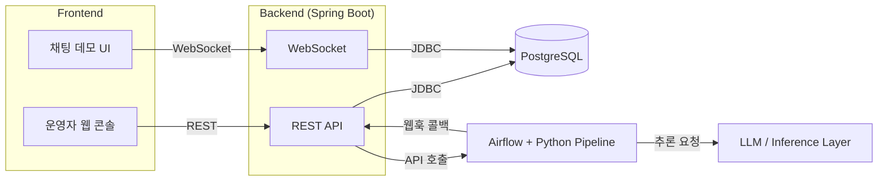
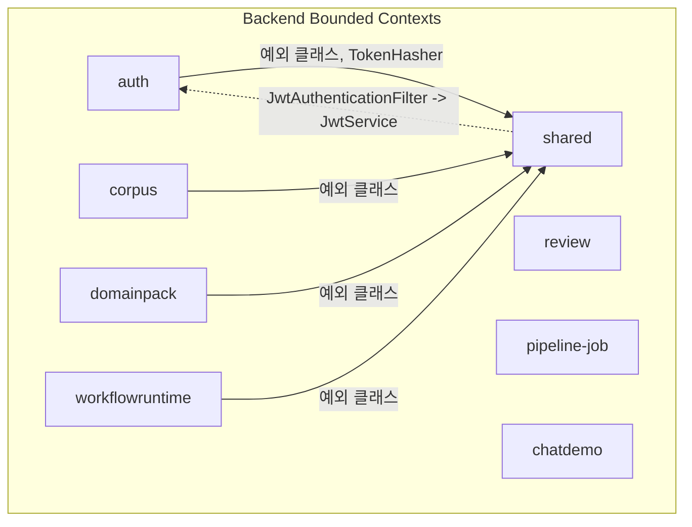
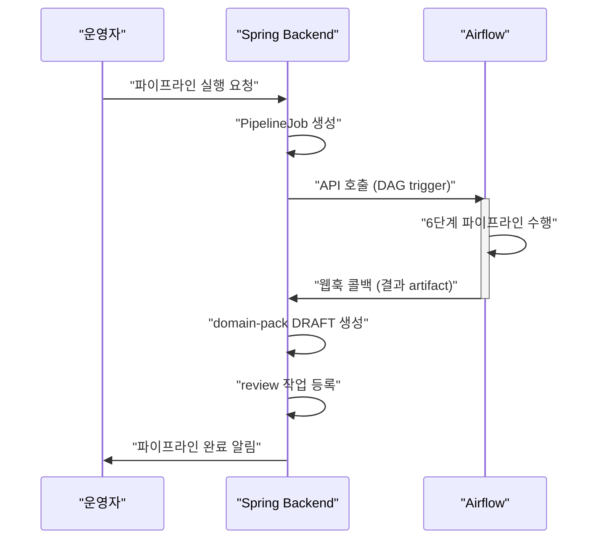
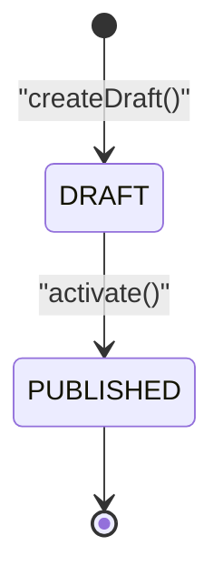
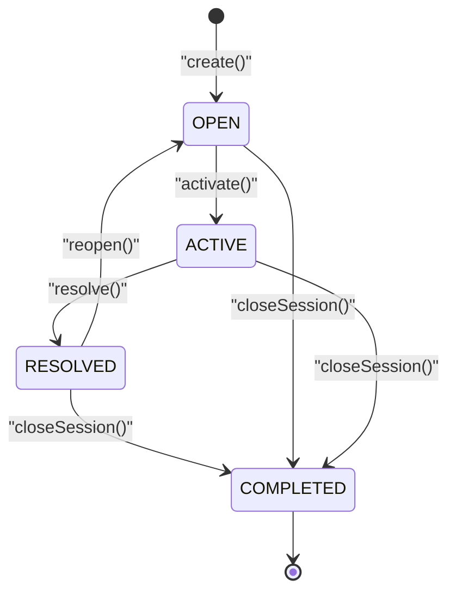
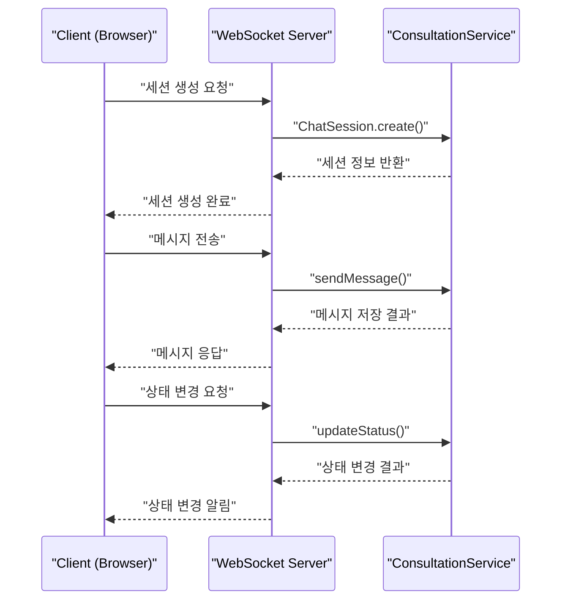

<!--
  generated-at-commit: 791dfb4948887360f9922837901f8803dacd737e
  generated-at-date: 2026-04-12
  mode: init
-->

# 상담 로그 기반 CS 워크플로우 생성 시스템 아키텍처 가이드

## 목차

- [1. 시스템 개요](#1-시스템-개요)
  - [1.1 프로젝트 목적](#11-프로젝트-목적)
  - [1.2 시스템 구성 요소](#12-시스템-구성-요소)
  - [1.3 기술 스택](#13-기술-스택)
  - [1.4 핵심 설계 결정과 이유](#14-핵심-설계-결정과-이유)
- [2. 모듈 설계](#2-모듈-설계)
  - [2.1 Backend](#21-backend--spring-boot-ddd-모듈형-모놀리스)
  - [2.2 Frontend](#22-frontend--vitefsd)
  - [2.3 ML Pipeline](#23-ml-pipeline--airflow-dag)
  - [2.4 모듈 간 연동](#24-모듈-간-연동)
- [3. 주요 구현 패턴](#3-주요-구현-패턴)
- [4. 의존성 분석](#4-의존성-분석)
- [5. 다이어그램](#5-다이어그램)

---

## 1. 시스템 개요

### 1.1 프로젝트 목적

이 시스템은 실시간 챗봇을 만드는 것이 아니다. 기존 고객상담 로그에서 운영 지식을 추출하여, 챗봇이 따라야 할 정책과 처리 흐름(intent, slot, policy, risk, workflow)을 자동으로 생성하는 시스템이다. 핵심 산출물은 개별 답변이 아니라 **Domain Pack**이라는 실행 가능한 운영 지식 묶음이다.

### 1.2 시스템 구성 요소

시스템은 **제품 런타임 계층**과 **도메인 팩 생성 계층** 두 축으로 구성된다.

- **운영자 웹 콘솔(Frontend)**: domain pack 조회, 검토, 승인, 파이프라인 실행 상태 확인을 제공한다.
- **고객 채팅 데모 UI(Frontend)**: workflow runtime 동작을 시연하는 화면이다.
- **Spring Boot Backend**: 제품 런타임 계층의 중심 서버로, domain pack 관리, 검토, 실행을 담당한다.
- **PostgreSQL**: domain pack, review, pipeline job 상태, 메타데이터를 저장한다.
- **Airflow + Python Pipeline**: 상담 로그 기반 domain pack 초안을 생성하는 오프라인 파이프라인이다.
- **LLM / Inference Layer**: 요약, 정규화, 구조화, 라벨링 등에 선택적으로 활용되는 외부 추론 계층이다.

### 1.3 기술 스택

| 영역 | 기술 | 버전 |
|------|------|------|
| Backend | Spring Boot | 3.4.5 |
| Frontend | Vite+ (React) | 0.1.15 |
| ML Pipeline | uv Python | 3.13+ |
| Database | PostgreSQL | 16+ (docker: 17) |
| Workflow Orchestration | Apache Airflow | 2.10+ |
| Infrastructure | Docker Compose | - |

### 1.4 핵심 설계 결정과 이유

**모듈형 모놀리스를 선택한 이유**: 현 단계에서 MSA는 운영 복잡도가 크다. 그러나 단순 controller-service-repository 구조만으로는 domain-pack, review, runtime, pipeline 경계가 섞이기 쉽다. 따라서 배포는 하나로 유지하되, 내부 코드는 bounded context 단위로 강하게 분리한다.

**DDD를 적용한 이유**: 핵심 산출물이 Domain Pack이라는 복잡한 도메인 객체이고, 상태 관리와 비즈니스 규칙이 중요하다. Aggregate 패턴으로 일관성 경계를 명확히 하고, Domain Event로 BC 간 결합도를 낮춘다.

**Airflow 역할 한정 이유**: Airflow는 실시간 runtime이 아니라 도메인 팩 생성용 오프라인 파이프라인에만 사용한다. 실시간 처리는 Spring Backend가 담당하고, Airflow는 장시간 실행되는 task orchestration에 집중한다.

**AI 초안 + 사람 검토 루프**: AI가 생성한 초안은 바로 운영에 쓰지 않는다. review bounded context를 통해 사람 검토를 거쳐 확정한다.

📖 **Dictionary**
| 용어 | 파일/디렉터리 | 설명 |
|------|--------------|------|
| Application | `backend/src/main/java/com/init/Application.java` | Spring Boot 메인 진입점 |
| docker-compose | `docker-compose.yml` | 서비스 오케스트레이션 정의 (postgres, backend, frontend) |
| architecture.md | `.agent/docs/architecture.md` | 아키텍처 합의 문서 (1차 소스) |
| schema.md | `.agent/docs/schema.md` | PostgreSQL 스키마 정의 |

---

## 2. 모듈 설계

### 2.1 Backend — Spring Boot DDD 모듈형 모놀리스

루트 패키지는 `com.init`이다. 각 bounded context는 `presentation → application → domain → infrastructure` 계층 구조를 따른다.

#### 2.1.1 auth

인증/인가와 JWT 토큰 관리를 담당한다. 회원가입, 로그인, 로그아웃, 비밀번호 재설정, 토큰 갱신 기능을 제공한다. `AppUser`를 중심으로 사용자 정보와 `RefreshToken`을 관리한다. `JwtService`가 토큰 생성/검증을 수행하며, `shared` 모듈의 `TokenHasher`를 활용하여 리프레시 토큰을 해싱한다.

다른 모듈과의 관계: auth는 다른 BC를 직접 참조하지 않으며, `shared`의 공통 예외 클래스만 사용한다. 반대로 `shared`의 `JwtAuthenticationFilter`가 auth의 `JwtService`를 참조한다.

📖 **Dictionary**
| 용어 | 파일/디렉터리 | 설명 |
|------|--------------|------|
| AppUser | `backend/src/main/java/com/init/auth/domain/model/AppUser.java` | 사용자 엔티티 |
| RefreshToken | `backend/src/main/java/com/init/auth/domain/model/RefreshToken.java` | 리프레시 토큰 엔티티 |
| UserRole | `backend/src/main/java/com/init/auth/domain/model/UserRole.java` | 사용자 역할 enum |
| UserStatus | `backend/src/main/java/com/init/auth/domain/model/UserStatus.java` | 사용자 상태 enum |
| AuthService | `backend/src/main/java/com/init/auth/application/AuthService.java` | 인증 유스케이스 |
| JwtService | `backend/src/main/java/com/init/auth/application/JwtService.java` | JWT 토큰 관리 |
| AuthController | `backend/src/main/java/com/init/auth/presentation/AuthController.java` | 인증 REST API |

#### 2.1.2 corpus

상담 로그 원천 데이터의 수집과 전처리를 담당한다. `Dataset`을 중심으로 상담 로그 묶음을 관리하며, `Conversation`과 `ConversationTurn` 단위로 데이터를 구조화한다. 운영자가 업로드한 상담 로그를 파싱하고, workspace 소속 검증을 수행한다.

workspace 존재 여부와 멤버십 검증을 위해 Port 인터페이스(`WorkspaceExistenceRepository`, `WorkspaceMembershipRepository`)를 정의하고, infrastructure 레이어에서 `app` 스키마의 테이블을 조회하는 Ref 엔티티(`WorkspaceRef`, `WorkspaceMemberRef`)로 구현한다.

📖 **Dictionary**
| 용어 | 파일/디렉터리 | 설명 |
|------|--------------|------|
| Dataset | `backend/src/main/java/com/init/corpus/domain/model/Dataset.java` | 상담 로그 묶음 엔티티 |
| Conversation | `backend/src/main/java/com/init/corpus/domain/model/Conversation.java` | 대화 단위 엔티티 |
| ConversationTurn | `backend/src/main/java/com/init/corpus/domain/model/ConversationTurn.java` | 발화 턴 엔티티 |
| DatasetStatus | `backend/src/main/java/com/init/corpus/domain/model/DatasetStatus.java` | 데이터셋 상태 enum |
| DatasetUploadService | `backend/src/main/java/com/init/corpus/application/DatasetUploadService.java` | 구조화된 데이터셋 업로드 |
| RawDatasetUploadService | `backend/src/main/java/com/init/corpus/application/RawDatasetUploadService.java` | 원본 텍스트 데이터셋 업로드 |
| ConsultingContentParser | `backend/src/main/java/com/init/corpus/application/ConsultingContentParser.java` | 상담 내용 파서 |
| DatasetController | `backend/src/main/java/com/init/corpus/presentation/DatasetController.java` | 데이터셋 REST API |

#### 2.1.3 domain-pack

intent / slot / policy / risk / workflow 초안과 확정본을 버전 단위로 관리한다. 핵심 aggregate는 `DomainPackVersion`이며, 하위에 `IntentDefinition`, `SlotDefinition`, `PolicyDefinition`, `RiskDefinition`, `WorkflowDefinition`이 소속된다. 개별 intent를 독립 aggregate로 쪼개기보다 하나의 pack version 단위로 관리하는 것이 배포/승인/rollback에 적합하다.

`DomainPackVersion`은 `DRAFT` → `PUBLISHED` 상태 전이를 지원한다. workspace 접근 제어를 위해 `WorkspaceExistencePort`와 `WorkspaceMembershipPort` 인터페이스를 정의하고, infrastructure에서 `DomainPackWorkspaceRef`, `DomainPackWorkspaceMemberRef`로 구현한다.

📖 **Dictionary**
| 용어 | 파일/디렉터리 | 설명 |
|------|--------------|------|
| DomainPackVersion | `backend/src/main/java/com/init/domainpack/domain/model/DomainPackVersion.java` | 팩 버전 엔티티 (상태 전이 포함) |
| IntentDefinition | `backend/src/main/java/com/init/domainpack/domain/model/IntentDefinition.java` | intent 정의 |
| SlotDefinition | `backend/src/main/java/com/init/domainpack/domain/model/SlotDefinition.java` | slot 정의 |
| PolicyDefinition | `backend/src/main/java/com/init/domainpack/domain/model/PolicyDefinition.java` | policy 정의 |
| RiskDefinition | `backend/src/main/java/com/init/domainpack/domain/model/RiskDefinition.java` | risk 정의 |
| WorkflowDefinition | `backend/src/main/java/com/init/domainpack/domain/model/WorkflowDefinition.java` | workflow 정의 (상태 기반 graph) |
| IntentSlotBinding | `backend/src/main/java/com/init/domainpack/domain/model/IntentSlotBinding.java` | intent-slot 매핑 |
| IntentWorkflowBinding | `backend/src/main/java/com/init/domainpack/domain/model/IntentWorkflowBinding.java` | intent-workflow 매핑 |
| CreateDomainPackDraftUseCase | `backend/src/main/java/com/init/domainpack/application/CreateDomainPackDraftUseCase.java` | DRAFT 생성 유스케이스 |
| ActivateDomainPackVersionUseCase | `backend/src/main/java/com/init/domainpack/application/ActivateDomainPackVersionUseCase.java` | PUBLISHED 전이 유스케이스 |

#### 2.1.4 review

AI가 만든 초안에 대해 사람이 검토, 수정, 승인, 반려를 수행하는 human-in-the-loop 루프를 담당한다. review는 domain-pack의 부속 기능이 아니라 독립적인 작업 흐름을 갖는 bounded context이다. 같은 domain pack에 대해 여러 검토 task가 열릴 수 있고, 승인/반려/수정 요청 흐름이 별도로 존재한다.

현재 구현 상태: 패키지 구조만 생성되어 있으며(`package-info.java`), 도메인 모델과 유스케이스는 아직 구현되지 않았다.

📖 **Dictionary**
| 용어 | 파일/디렉터리 | 설명 |
|------|--------------|------|
| review (package) | `backend/src/main/java/com/init/review/` | review BC 패키지 (스켈레톤) |

#### 2.1.5 pipeline-job

Airflow 파이프라인 실행을 요청하고, 실행 중인 job 상태를 추적하며, 웹훅 결과를 수신하여 후속 처리를 수행한다. Spring과 Airflow의 경계를 이 BC에서 담당하며, 외부 시스템의 run id, callback payload, 상태 변경 이벤트를 흡수하고 내부 모델로 번역하는 Anti-Corruption Layer 역할을 한다.

현재 구현 상태: 패키지 구조만 생성되어 있으며(`package-info.java`), 도메인 모델과 유스케이스는 아직 구현되지 않았다.

📖 **Dictionary**
| 용어 | 파일/디렉터리 | 설명 |
|------|--------------|------|
| pipeline-job (package) | `backend/src/main/java/com/init/pipelinejob/` | pipeline-job BC 패키지 (스켈레톤) |

#### 2.1.6 workflow-runtime / chat-demo

코드에서 `workflowruntime` 패키지가 현재 상담 세션 관리와 채팅 데모를 통합하여 담당한다. `ChatSession`을 aggregate root으로 하여 세션 생성, 메시지 전송, 상태 전이를 관리한다. `ChatSessionStatus`는 `OPEN → ACTIVE → RESOLVED → COMPLETED` 상태 전이를 지원하며, `RESOLVED → OPEN` 재개도 가능하다.

아키텍처 문서에서는 `workflow-runtime`과 `chat-demo`가 별도 BC로 정의되어 있으나, 현재 코드에서는 `workflowruntime` 하나로 통합되어 있다. `chatdemo` 패키지는 존재하나 `package-info.java`만 있는 스켈레톤 상태이다.

📖 **Dictionary**
| 용어 | 파일/디렉터리 | 설명 |
|------|--------------|------|
| ChatSession | `backend/src/main/java/com/init/workflowruntime/domain/ChatSession.java` | 상담 세션 aggregate |
| ChatMessage | `backend/src/main/java/com/init/workflowruntime/domain/ChatMessage.java` | 채팅 메시지 엔티티 |
| ChatSessionStatus | `backend/src/main/java/com/init/workflowruntime/domain/ChatSessionStatus.java` | 세션 상태 enum (OPEN/ACTIVE/RESOLVED/COMPLETED) |
| ConsultationService | `backend/src/main/java/com/init/workflowruntime/application/ConsultationService.java` | 상담 유스케이스 |
| ConsultationController | `backend/src/main/java/com/init/workflowruntime/presentation/ConsultationController.java` | 상담 REST API |
| chatdemo (package) | `backend/src/main/java/com/init/chatdemo/` | chat-demo BC 패키지 (스켈레톤) |

#### 2.1.7 shared / infra

공통 기술 요소를 제공하는 기술 공통 계층이다. 도메인 지식을 담는 곳이 아니라 중복을 줄이기 위한 계층이며, 공통 예외 처리기(`GlobalExceptionHandler`), 공통 응답 포맷(`ErrorResponse`, `ValidationErrorResponse`), 보안 설정(`SecurityConfig`, `JwtAuthenticationFilter`), 토큰 해싱(`TokenHasher`, `Sha256TokenHasher`)을 제공한다.

📖 **Dictionary**
| 용어 | 파일/디렉터리 | 설명 |
|------|--------------|------|
| GlobalExceptionHandler | `backend/src/main/java/com/init/shared/presentation/GlobalExceptionHandler.java` | 공통 예외 처리기 |
| SecurityConfig | `backend/src/main/java/com/init/shared/infrastructure/security/SecurityConfig.java` | Spring Security 설정 |
| JwtAuthenticationFilter | `backend/src/main/java/com/init/shared/infrastructure/security/JwtAuthenticationFilter.java` | JWT 인증 필터 |
| TokenHasher | `backend/src/main/java/com/init/shared/application/TokenHasher.java` | 토큰 해싱 인터페이스 |
| BusinessException | `backend/src/main/java/com/init/shared/application/exception/BusinessException.java` | 비즈니스 예외 기본 클래스 |
| ErrorResponse | `backend/src/main/java/com/init/shared/presentation/dto/ErrorResponse.java` | 공통 에러 응답 DTO |

---

### 2.2 Frontend — Vite+FSD

Feature-Sliced Design(FSD) 아키텍처를 적용한다. 레이어 구조는 `app → pages → features → shared` 순이다. 운영자 기능과 데모 기능의 경계를 화면 수준에서 분리한다.

#### 2.2.1 app

앱 초기화, 라우팅, 프로바이더 설정을 담당한다. `App.tsx`에서 React Router를 사용하여 페이지 라우팅을 정의하며, `PrivateRoute`로 인증이 필요한 경로를 보호한다.

#### 2.2.2 pages

URL 단위의 페이지 컴포넌트를 제공한다. 현재 구현된 페이지: login, signup, upload, consultation, password-reset, not-found. 아직 구현되지 않은 페이지(디렉터리만 존재): pipeline, review, domain-pack, chat-demo.

#### 2.2.3 features

사용자 시나리오 단위 기능 모듈이다. `auth`(로그인/회원가입/로그아웃), `consultation`(상담 채팅 패널, 대기열, 고객 정보), `log-upload`(상담 로그 업로드 폼)가 구현되어 있다.

#### 2.2.4 shared

공유 UI 컴포넌트, 훅, 유틸리티, API 클라이언트를 제공한다. shadcn/ui 기반의 공통 UI 컴포넌트와 `AuthLayout`, `DashboardLayout` 등 레이아웃을 포함한다.

📖 **Dictionary**
| 용어 | 파일/디렉터리 | 설명 |
|------|--------------|------|
| App.tsx | `frontend/src/app/App.tsx` | 라우팅 정의 |
| providers.tsx | `frontend/src/app/providers.tsx` | 앱 프로바이더 |
| PrivateRoute | `frontend/src/shared/ui/PrivateRoute.tsx` | 인증 보호 라우트 |
| authApi | `frontend/src/features/auth/api/authApi.ts` | 인증 API 클라이언트 |
| consultationApi | `frontend/src/features/consultation/api/consultationApi.ts` | 상담 API 클라이언트 |
| LogUploadForm | `frontend/src/features/log-upload/ui/LogUploadForm.tsx` | 상담 로그 업로드 폼 |
| DashboardLayout | `frontend/src/shared/ui/layout/DashboardLayout.tsx` | 대시보드 레이아웃 |

---

### 2.3 ML Pipeline — Airflow DAG

Airflow는 도메인 팩 생성용 오프라인 파이프라인 오케스트레이터로 사용한다. DDD보다 DAG 기반 파이프라인 아키텍처가 더 적합하다. task를 너무 잘게 쪼개지 않고, 산출물 경계가 바뀌는 지점 기준으로 stage를 나눈다.

#### 2.3.1 ingestion

상담 로그 입력, conversation 단위 묶기, speaker role 정리, 비식별화/개인정보 제거를 수행한다. 산출물은 normalized conversation dataset이다.

#### 2.3.2 preprocessing

boilerplate 제거, canonical text 생성, role-aware representation 생성, 실험용 입력 포맷 정리를 수행한다. 산출물은 cleaned conversations, canonical conversation text, feature-ready dataset이다.

#### 2.3.3 intent-discovery

semantic embedding 생성, graph community detection, flow signature 생성, hybrid clustering을 수행한다. 산출물은 intent cluster candidate, exemplar set, outlier set이다.

#### 2.3.4 draft-generation

intent별 slot / policy / risk / workflow 초안을 생성한다. 산출물은 draft domain pack, intent cards, workflow draft이다.

#### 2.3.5 evaluation

mapping rate, outlier rate, workflow separability를 평가한다. 산출물은 evaluation report, quality score summary이다.

#### 2.3.6 publish-candidate

검토 가능한 최종 draft artifact를 생성하고 Spring Backend로 결과를 전달한다. 산출물은 publish candidate artifact, pipeline result payload이다.

📖 **Dictionary**
| 용어 | 파일/디렉터리 | 설명 |
|------|--------------|------|
| ingestion | `ml/src/pipeline/stages/ingestion/main.py` | 상담 로그 수집 stage |
| preprocessing | `ml/src/pipeline/stages/preprocessing/main.py` | 전처리 stage |
| intent_discovery | `ml/src/pipeline/stages/intent_discovery/main.py` | 의도 클러스터링 stage |
| draft_generation | `ml/src/pipeline/stages/draft_generation/main.py` | 초안 생성 stage |
| evaluation | `ml/src/pipeline/stages/evaluation/main.py` | 품질 평가 stage |
| publish_candidate | `ml/src/pipeline/stages/publish_candidate/main.py` | 결과 전달 stage |
| pipeline/common | `ml/src/pipeline/common/` | 파이프라인 공통 유틸리티 |

---

### 2.4 모듈 간 연동

**Spring ↔ Airflow 연동**: API 호출 + 웹훅 방식으로 연동한다. Spring이 Airflow에 파이프라인 실행을 API로 요청하고, Airflow가 완료 후 Spring으로 웹훅을 전송한다. pipeline-job BC가 이 경계를 담당하며, 외부 payload를 내부 모델로 번역한다.

**Frontend ↔ Backend 통신**: REST API를 기본으로 사용한다. 실시간 상태 변경과 채팅 이벤트는 WebSocket으로 반영한다.

**Backend 내부 BC 간 통신**: 현재는 직접 참조가 없으며, 각 BC가 독립적으로 동작한다. workspace 관련 데이터 접근은 Port 인터페이스를 통해 인프라 레이어에서 해결한다.

📖 **Dictionary**
| 용어 | 파일/디렉터리 | 설명 |
|------|--------------|------|
| WorkspaceExistencePort | `backend/src/main/java/com/init/domainpack/domain/repository/WorkspaceExistencePort.java` | workspace 존재 확인 포트 |
| WorkspaceMembershipPort | `backend/src/main/java/com/init/domainpack/domain/repository/WorkspaceMembershipPort.java` | workspace 멤버십 확인 포트 |
| DomainPackWorkspaceRef | `backend/src/main/java/com/init/domainpack/infrastructure/persistence/DomainPackWorkspaceRef.java` | workspace 참조 엔티티 (infrastructure) |
| DomainPackWorkspaceMemberRef | `backend/src/main/java/com/init/domainpack/infrastructure/persistence/DomainPackWorkspaceMemberRef.java` | workspace 멤버 참조 엔티티 (infrastructure) |

---

## 3. 주요 구현 패턴

### 3.1 계층 구조 패턴

각 bounded context는 4계층 구조를 따른다.

- **presentation**: Controller, WebSocket handler, request/response DTO. 외부 요청을 받아 application 계층으로 전달한다.
- **application**: Use case, application service, command/query orchestration. 도메인 객체를 조합하여 비즈니스 시나리오를 실행한다.
- **domain**: Aggregate, entity, value object, domain service, domain event. 비즈니스 규칙의 핵심이다.
- **infrastructure**: JPA repository implementation, external client, persistence adapter. 기술 구현을 담당한다.

의존 방향은 `presentation → application → domain ← infrastructure`이다. domain은 infrastructure를 직접 참조하지 않고, repository 인터페이스(Port)를 정의한다.

### 3.2 모듈 간 연동 패턴

**Ports & Adapters**: 각 BC는 외부 시스템(다른 BC의 DB, 외부 API)에 대해 Port 인터페이스를 domain에 정의하고, infrastructure에서 Adapter로 구현한다. `WorkspaceExistencePort`와 `WorkspaceMembershipPort`가 대표적이다.

**Anti-Corruption Layer**: pipeline-job BC가 Airflow의 외부 개념(run id, callback payload)을 내부 도메인 모델로 번역하는 경계 레이어 역할을 한다.

### 3.3 비동기 처리 패턴

**Webhook Callback**: Spring과 Airflow 연동에서 사용한다. Spring이 파이프라인 실행을 요청하고, Airflow가 완료 후 웹훅으로 결과를 전송한다. long-running job을 동기 요청으로 처리하지 않고, 비동기 요청 + 상태 추적 구조를 사용한다.

### 3.4 상태 관리 패턴

**State Machine**: `ChatSession`의 상태 전이가 대표적이다. `OPEN → ACTIVE → RESOLVED → COMPLETED` 전이를 메서드 기반으로 관리하며, 유효하지 않은 전이 시 `InvalidSessionStateException`을 발생시킨다. `DomainPackVersion`도 `DRAFT → PUBLISHED` 전이를 `activate()` 메서드로 관리한다.

📖 **Dictionary**
| 용어 | 파일/디렉터리 | 설명 |
|------|--------------|------|
| InvalidSessionStateException | `backend/src/main/java/com/init/workflowruntime/domain/InvalidSessionStateException.java` | 유효하지 않은 세션 상태 전이 예외 |
| DomainPackVersion.activate() | `backend/src/main/java/com/init/domainpack/domain/model/DomainPackVersion.java` | DRAFT→PUBLISHED 상태 전이 메서드 |
| ChatSession.activate() | `backend/src/main/java/com/init/workflowruntime/domain/ChatSession.java` | OPEN→ACTIVE 상태 전이 메서드 |

---

## 4. 의존성 분석

### 4.1 모듈 간 의존 방향

**Backend Bounded Context 간 의존 관계**:

| 소스 BC | 대상 BC | 의존 유형 | 상태 |
|---------|---------|----------|------|
| auth | shared | 공통 예외 클래스, TokenHasher | 🟢 안전 |
| corpus | shared | 공통 예외 클래스 | 🟢 안전 |
| domainpack | shared | 공통 예외 클래스 | 🟢 안전 |
| workflowruntime | shared | 공통 예외 클래스 | 🟢 안전 |
| shared | auth | JwtAuthenticationFilter → JwtService | 🟡 잠재적 위험 |

**Frontend FSD 레이어 간 의존 관계**:

| 소스 레이어 | 대상 레이어 | 상태 |
|------------|------------|------|
| app | pages | 🟢 안전 (정방향) |
| app | shared | 🟢 안전 (정방향) |
| features | shared | 🟢 안전 (정방향) |

**ML Pipeline 간 의존 관계**: 각 stage는 독립적으로 동작하며, stage 간 직접 import가 없다. 데이터 전달은 artifact 기반으로 이루어진다.

### 4.2 순환 참조 위험 구간

🔴 **실제 순환**: 발견되지 않음

🟡 **잠재적 위험**: `shared` → `auth` 의존

`JwtAuthenticationFilter`(`com.init.shared.infrastructure.security`)가 `JwtService`(`com.init.auth.application`)를 직접 import한다. shared는 모든 BC가 의존하는 기술 공통 계층인데, shared 자체가 특정 BC(auth)에 의존하면 논리적 순환 위험이 존재한다. 현재 다른 BC가 auth를 직접 참조하지 않으므로 실질적 순환은 아니지만, 구조적으로 shared의 독립성이 깨진 상태이다.

### 4.3 개선 제안

`JwtAuthenticationFilter`를 `shared`에서 `auth.infrastructure` 또는 별도 `infra` 모듈로 이동하면 shared의 BC 무의존 원칙을 회복할 수 있다. 또는 auth가 `JwtService` 인터페이스를 shared에 제공하고 구현체를 auth에 두는 의존 역전 방식도 가능하다.

---

## 5. 다이어그램

### 정적 구조 다이어그램

#### 5.1 시스템 구성도

#### 5.2 모듈 의존 관계도

> `SHARED → AUTH` 점선은 🟡 잠재적 위험 구간이다. shared가 특정 BC에 의존하는 구조이므로 개선이 권장된다.

#### 5.3 데이터 플로우

```mermaid
flowchart LR
    A["상담 로그 업로드"] --> B["corpus (Dataset)"]
    B --> C["Airflow Pipeline"]

    subgraph "Pipeline Stages"
        C --> D["ingestion"]
        D --> E["preprocessing"]
        E --> F["intent-discovery"]
        F --> G["draft-generation"]
        G --> H["evaluation"]
        H --> I["publish-candidate"]
    end

    I -->|"웹훅"| J["pipeline-job"]
    J --> K["domain-pack (DRAFT)"]
    K --> L["review"]
    L --> M["domain-pack (PUBLISHED)"]
    M --> N["workflow-runtime"]
    N --> O["chat-demo"]
```

---

### 동적 행위 다이어그램

#### 5.4 Spring ↔ Airflow 파이프라인 연동

> 에러/재시도 시나리오: 웹훅 콜백 실패 시 재전송이 필요하며, 중복 수신을 고려한 idempotent 처리가 필요하다. Airflow task 실패 시 stage 단위 재시도가 가능하다.

#### 5.5 Domain Pack 라이프사이클

> 아키텍처 문서에서는 `DRAFT → REVIEW → APPROVED → PUBLISHED → DEPRECATED` 전체 라이프사이클을 정의하나, 현재 코드 구현에서는 `DRAFT`와 `PUBLISHED` 두 상태만 존재한다(`DomainPackVersion.java`). 중간 상태(REVIEW, APPROVED)와 DEPRECATED는 아직 구현되지 않았다.

#### 5.6 Workflow Runtime 상태 전이

> 아키텍처 문서에서 workflow-runtime은 "intent 인식 → slot 수집 → policy 확인 → action 결정" 흐름으로 설명하나, 현재 코드에서 구현된 상태 전이는 `ChatSession`의 세션 상태 관리이다. intent/slot/policy 기반의 workflow execution 상태 머신은 아직 구현되지 않았다.

> 에러 시나리오: 유효하지 않은 전이 시도 시 `InvalidSessionStateException`이 발생한다.

#### 5.7 Chat Demo WebSocket 이벤트 흐름

> 유형 선택: `sequenceDiagram` — 클라이언트와 서버 간 메시지 교환의 시간 순서를 표현하기에 적합하다.

> 현재 `ConsultationController`는 REST API로 구현되어 있다. 아키텍처 문서에서 명시한 WebSocket 기반 실시간 이벤트 처리는 아직 구현되지 않은 것으로 보인다.

#### 5.8 Pipeline 단계 간 artifact 전달

> 유형 선택: `flowchart` — 각 stage 간 산출물의 흐름을 보여주는 데 적합하다. 참여자 간 시간 순서보다 데이터 변환 흐름이 중심이다.

```mermaid
flowchart LR
    A["ingestion"] -->|"normalized dataset"| B["preprocessing"]
    B -->|"cleaned conversations"| C["intent-discovery"]
    C -->|"intent clusters"| D["draft-generation"]
    D -->|"draft domain pack"| E["evaluation"]
    E -->|"evaluation report"| F["publish-candidate"]
    F -->|"pipeline result payload"| G["Spring Backend"]
```

