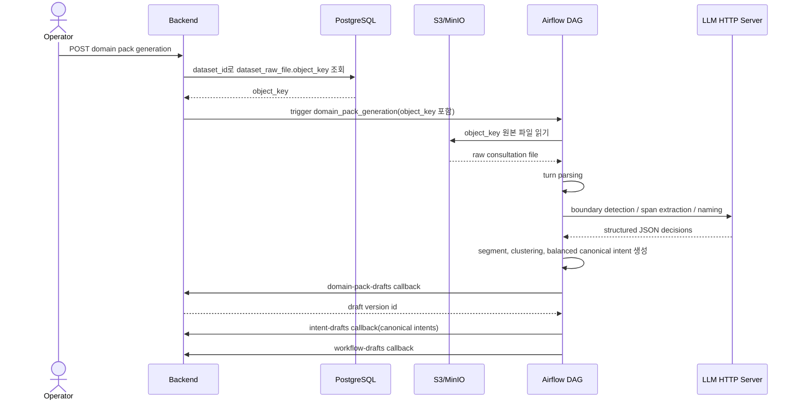

# [ML/BE-001] S3/MinIO 원본 파일 기반 Boundary Segment Intent 추출 및 도메인팩 등록

> **Backlog**: 상담 로그 업로드 이후 운영자가 도메인팩 생성을 실행하면, 원본 상담 파일에서 intent 전환 구간을 찾아 대표 intent를 자동으로 draft domain pack에 등록하고 싶다.
> **Layer**: Backend + ML Pipeline
> **Template**: `.agent/specs/_TEMPLATE_ML.md`, `.agent/specs/_TEMPLATE_BE.md`
> **Branch**: `spec/001`
> **Verified existing paths**: `backend/src/main/java/com/init/corpus/application/RawFileUploadService.java`, `backend/src/main/java/com/init/corpus/domain/model/DatasetRawFile.java`, `backend/src/main/java/com/init/pipelinejob/infrastructure/airflow/AirflowDomainPackGenerationTriggerAdapter.java`, `ml/src/pipeline/stages/ingestion/main.py`, `ml/src/pipeline/stages/intent_discovery/main.py`, `ml/src/pipeline/stages/draft_generation/main.py`

---

## Goal

도메인팩 생성 DAG가 DB에서 상담 row 전체를 재조회하지 않고, `dataset_raw_file.object_key`로 S3/MinIO 원본 파일을 직접 읽어 고객 발화의 intent boundary를 판정하고, 같은 intent 구간을 segment로 묶은 뒤 대표 `canonical_intent`를 draft domain pack intent로 등록한다.

---

## Current State

- Backend 업로드 흐름은 원본 파일을 S3/MinIO에 저장하고 `corpus.dataset_raw_file.object_key`를 남긴다.
- Backend는 같은 업로드 요청에서 원본 상담을 파싱해 `corpus.conversation`, `corpus.conversation_turn`에도 저장한다.
- ML `ingestion` stage는 아직 구현되어 있지 않다.
- 현재 `draft_generation`은 `intent_discovery/clusters.json`의 cluster를 intent draft로 변환하고, `publish_candidate`가 기존 `/callbacks/intent-drafts` callback으로 Spring에 등록한다.
- 사용자가 제공한 Colab 노트북의 핵심 intent discovery 흐름은 “고객 발화별 boundary detection → segment 구성 → segment intent 추출 → clustering → canonical naming → balanced 재집계”다.

---

## Target Flow



---

## Backend Changes

### Raw File Lookup

`DatasetRawFileRepository`에 dataset 기준 raw file 조회를 추가한다.

```java
Optional<DatasetRawFile> findFirstByDatasetIdOrderByUploadedAtDesc(Long datasetId);
```

- 동일 dataset에 raw file row가 여러 개 존재할 경우 최신 업로드를 사용한다.
- 조회 결과가 없으면 도메인팩 생성 요청을 실패시킨다.
- 실패 코드는 구현 시 `RAW_FILE_NOT_FOUND` 또는 기존 예외 체계와 충돌하지 않는 `NotFoundException` 계열로 정의한다.

### Airflow Trigger Payload

`DomainPackGenerationTriggerCommand`에 `objectKey`를 추가하고, `AirflowDomainPackGenerationTriggerAdapter`가 DAG conf에 아래 값을 넘긴다.

```json
{
  "workspace_id": 1,
  "dataset_id": 10,
  "pipeline_job_id": 20,
  "object_key": "workspaces/1/datasets/travel/uuid_uploaded.json"
}
```

- `object_key`는 ML ingestion의 필수 입력이다.
- Backend는 상담 본문 전체를 DAG conf에 넣지 않는다.
- 기존 callback endpoint와 draft domain pack 저장 흐름은 유지한다.

---

## ML Pipeline Changes

### Ingestion Stage

`ml/src/pipeline/stages/ingestion/main.py`를 구현한다.

Input:

| 필드 | 출처 | 설명 |
| --- | --- | --- |
| `workspace_id` | Airflow conf | workspace 식별자 |
| `dataset_id` | Airflow conf | dataset 식별자 |
| `pipeline_job_id` | Airflow conf | pipeline job 식별자 |
| `object_key` | Airflow conf | S3/MinIO 원본 파일 key |

Environment:

| 변수 | 설명 |
| --- | --- |
| `STORAGE_S3_BUCKET` | 원본 파일 bucket |
| `STORAGE_S3_REGION` | S3 region |
| `STORAGE_S3_ENDPOINT` | MinIO 또는 custom S3 endpoint |
| `STORAGE_S3_ACCESS_KEY` | access key |
| `STORAGE_S3_SECRET_KEY` | secret key |
| `STORAGE_S3_PATH_STYLE` | MinIO path-style 여부 |

Output:

```text
artifacts/{dag_id}/{run_id}/ingestion/
├── conversations.jsonl
└── manifest.json
```

`conversations.jsonl` row shape:

```json
{
  "id": "source_case_id",
  "dataset_id": "10",
  "channel": null,
  "ended_status": null,
  "turns": [
    {
      "turn_index": 0,
      "speaker_role": "CUSTOMER",
      "message_text": "풀빌라 견적 받을 수 있을까요?"
    }
  ]
}
```

Parsing rules:

- Backend 업로드 JSON 형식을 우선 지원한다.
- 원본 파일 전체를 메모리에 무조건 크게 복사하지 않고, 가능한 경우 streaming 또는 line 단위 처리를 우선한다.
- 원본 파일 파싱 실패는 ingestion stage 실패로 기록한다.

### Intent Discovery Stage

Colab 노트북 로직을 `.ipynb` 실행이 아니라 Python 모듈로 이식한다.

Required flow:

```text
turn parsing
-> boundary detection
-> same-intent segment grouping
-> segment span / intent phrase extraction
-> semantic rewrite
-> embedding
-> clustering
-> split / merge refinement
-> canonical naming
-> balanced domain/action aggregation
```

Boundary behavior:

- 고객 발화를 순서대로 검사한다.
- 현재 고객 발화가 이전 segment와 같은 intent이면 기존 segment에 포함한다.
- 새 intent이면 이전 segment를 닫고 새 segment를 시작한다.
- 상담사 발화는 boundary 판단과 span extraction의 문맥으로만 사용한다.

LLM runtime:

- Airflow worker가 32GB GPU 모델을 직접 로드하지 않는다.
- 별도 GPU LLM server를 띄우고 Airflow가 HTTP로 호출한다.
- 구현 시 아래 환경변수를 사용한다.

| 변수 | 설명 |
| --- | --- |
| `PIPELINE_LLM_BASE_URL` | OpenAI-compatible 또는 유사 HTTP endpoint |
| `PIPELINE_LLM_API_KEY` | LLM API key |
| `PIPELINE_LLM_MODEL` | 사용할 모델명 |

Colab-only code removal:

- Google Drive mount
- `/content` 고정 경로
- notebook `display`
- 수동 zip 생성/다운로드
- Excel import 기반 처리

---

## Artifacts

### Segment Mapping Artifact

`intent_segments_v3.jsonl` 또는 동일 의미의 artifact를 생성한다.

```json
{
  "consultation_id": "conv_001",
  "segment_id": "conv_001__seg000",
  "segment_index": 0,
  "start_turn": 0,
  "end_turn": 3,
  "segment_customer_text": "풀빌라 견적 받을 수 있을까요?\n7월 10일부터 3박이고 성인 2명이에요.",
  "intent_phrase": "풀빌라 견적 문의",
  "intent_phrase_refined": "숙소 견적 문의",
  "canonical_intent": "숙소 가격/견적 문의",
  "cluster_id": 0,
  "confidence": 0.92
}
```

### Optional Sentence Mapping Artifact

문장 단위 결과가 필요한 화면이나 분석을 위해 segment를 문장 단위로 펼친 artifact를 생성할 수 있다.

```json
{
  "consultation_id": "conv_001",
  "segment_id": "conv_001__seg000",
  "turn_index": 1,
  "sentence_text": "7월 10일부터 3박이고 성인 2명이에요.",
  "canonical_intent": "숙소 가격/견적 문의",
  "inherited_from_segment": true
}
```

- 이 artifact는 문장별 intent 추적을 위한 결과다.
- 도메인팩 intent row로 직접 저장하지 않는다.

### Balanced Cluster Artifact

`intent_clusters_v3_balanced.jsonl` 또는 동일 의미의 artifact를 생성한다.

```json
{
  "canonical_intent": "숙소 가격/견적 문의",
  "description": "고객이 숙소 가격/견적과 관련해 확인, 요청 또는 상담을 원하는 의도",
  "positive_keywords": ["숙소", "가격", "견적"],
  "negative_keywords": [],
  "fallback_name": false,
  "cluster_id": 0,
  "cluster_size": 250,
  "sample_intent_phrases": ["견적 요청", "예약 확인", "견적 문의"],
  "source": "balanced_defragmentation_v1"
}
```

---

## Draft Domain Pack Mapping

`draft_generation`은 balanced `canonical_intent`를 기준으로 intent draft payload를 만든다.

| Domain Pack field | Source |
| --- | --- |
| `intentCode` | `INTENT_{cluster_id}` |
| `name` | `canonical_intent` |
| `description` | balanced description |
| `taxonomyLevel` | `1` |
| `parentIntentCode` | `null` |
| `sourceClusterRef` | cluster id, cluster size, source |
| `entryConditionJson` | `{}` |
| `evidenceJson` | representative segment texts, sample intent phrases |
| `metaJson` | positive/negative keywords, fallback flag, pipeline version |

Important:

- segment row 전체를 도메인팩 intent로 직접 등록하지 않는다.
- 문장별 mapping은 artifact로 남긴다.
- 도메인팩에는 중복 제거된 대표 `canonical_intent`만 등록한다.

---

## Example

원본 상담:

```text
고객: 풀빌라 견적 받을 수 있을까요?
상담사: 네, 여행 날짜와 인원 알려주세요.
고객: 7월 10일부터 3박이고 성인 2명이에요.
고객: 조식 포함 가격도 궁금합니다.
고객: 그리고 공항 픽업도 가능한가요?
고객: 픽업 비용도 같이 알려주세요.
고객: 취소하면 환불은 어떻게 되나요?
```

Boundary 결과:

| segment | 포함 고객 발화 | canonical intent |
| --- | --- | --- |
| `seg000` | 풀빌라 견적, 날짜/인원, 조식 포함 가격 | 숙소 가격/견적 문의 |
| `seg001` | 공항 픽업 가능 여부, 픽업 비용 | 공항 픽업/이동 가능 여부/확인 문의 |
| `seg002` | 취소/환불 규정 | 예약 취소/환불 문의 |

도메인팩 draft 등록 결과:

```json
[
  {"intentCode": "INTENT_0", "name": "숙소 가격/견적 문의"},
  {"intentCode": "INTENT_1", "name": "공항 픽업/이동 가능 여부/확인 문의"},
  {"intentCode": "INTENT_2", "name": "예약 취소/환불 문의"}
]
```

---

## Exclusions

- 이 spec PR에서는 구현 코드를 변경하지 않는다.
- 이 spec PR에서는 테스트 코드를 추가하지 않는다.
- `intent_clusters_v3_balanced.xlsx` 파일을 파이프라인 입력으로 사용하지 않는다.
- 모든 문장 또는 segment를 `pack.intent_definition` row로 직접 등록하지 않는다.
- workflow/risk/policy 생성 품질 개선은 별도 spec에서 다룬다.

---

## Acceptance Criteria

- `.agent/specs/001.md`가 존재한다.
- 문서가 S3/MinIO 원본 파일 기반 ingestion, boundary segment intent 추출, representative canonical intent 등록 방식을 명확히 설명한다.
- 문서가 Backend 변경 범위와 ML/Airflow 변경 범위를 모두 포함한다.
- 문서가 segment artifact, optional sentence artifact, balanced cluster artifact의 형태를 설명한다.
- 문서가 도메인팩 draft intent 매핑 규칙과 제외 범위를 명확히 한다.
