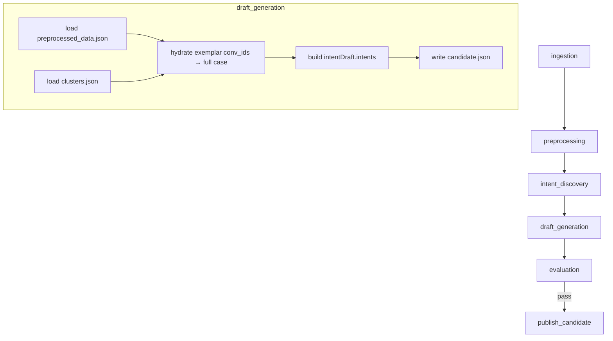

# [ML] 2.2.17 — Intent별 대표 상담 케이스 추출

> Backlog 002217 · Branch: `spec/002217`
> Template: `_TEMPLATE_ML.md`

---

## Goal

`intent_discovery`가 식별한 intent cluster마다 **상위 3개 대표 상담 케이스(representative cases)** 를 텍스트와 메타정보까지 함께 추출하여, `draft_generation` 스테이지가 산출하는 candidate artifact의 `intentDraft.intents[*].representativeCases` 필드로 직렬화한다. 이 필드는 사람 검토(review UI) 및 후속 publish 흐름에서 intent 정의의 근거로 사용된다.

---

## DAG Diagram



---

## Scope

### In scope

1. `intent_discovery` 스테이지 — exemplar 개수 **2 → 3**, 반환 타입 **int → conv_id string**, 필드명 **`exemplar_indices` → `exemplar_conv_ids`** (U-012-C, U-014 해소).
2. `draft_generation` 스테이지 (현재 1-line stub) — **intent별 representative case 추출 및 candidate artifact의 `intentDraft.intents[*].representativeCases` 필드 산출** 로직만 새로 구현. cluster→intent 매핑을 통한 `intents[*]`의 `intentCode`/`name` 생성 포함.
3. `publish_candidate.validate_candidate` — `intents[*].representativeCases` 검증 규칙 추가.
4. `preprocessing` 스테이지 — 출력 파일명을 `preprocessed_data.json`으로 통일 (기존 `preprocessed_conversations.json` → `preprocessed_data.json`). `intent_discovery`가 이미 읽는 파일명과 맞춤 (U-013-b).

### Out of scope

- `draft_generation`의 `slots` / `policies` / `risks` / `workflows` 초안 생성 로직 (별도 2.2.x backlog 항목 — 본 spec은 이들을 비어있는 list로 채우거나 stub으로 둠. 동작 가능한 publish는 후속 spec이 책임).
- `pack.intent_definition.source_cluster_ref` / `evidence_json` jsonb 내부 schema (Backend 측 영구 저장은 별도 spec).
- `intent-drafts` callback payload의 representative case 전달 형식 (Q6 결정: ML 출력 + candidate validation까지가 본 spec 범위).
- novel intent candidates의 representative case (Q5 결정: 본 spec은 cluster만).

---

## Stage Interface — `draft_generation`

### Input

| 항목 | 타입 | 설명 |
|------|------|------|
| `upstream_manifest_path` | `str \| None` | `intent_discovery` 스테이지 manifest.json 경로 |

upstream artifact 디렉터리 및 그 직전 stage 디렉터리에서 읽는 파일:

| 파일 | 출처 stage | 설명 |
|------|-----------|------|
| `clusters.json` | `intent_discovery` | cluster 목록 + `exemplar_conv_ids`(conv_id 문자열 목록, U-012-C) |
| `preprocessed_data.json` | `preprocessing` | `{"schema_version":"1.0","conversations":[{id, canonical_text, customer_problem_text, ended_status, ...},...]}` ordered list. `draft_generation`에서 `{conv_id: conversation_dict}` dict를 빌드하여 사용. ※ preprocessing 출력 파일명이 `preprocessed_data.json`으로 통일됨 (U-013-b). |

`intent_discovery`는 manifest payload에 `clusters_path`/`preprocessed_path` 등을 명시적으로 노출하지 않고 stage 디렉터리 컨벤션(`StageContext`)으로 해소되므로, `draft_generation`도 동일한 `StageContext` 컨벤션으로 두 artifact를 찾는다.

### Output

| 파일 | 형식 | 설명 |
|------|------|------|
| `candidate.json` | JSON | `publish_candidate`가 소비하는 candidate artifact (이번 spec 범위는 `intentDraft.intents[*].representativeCases` 위주) |
| `manifest.json` | JSON | `pipeline.common.artifacts.write_stage_manifest` 공통 포맷 (`payload.candidateArtifactPath` 포함) |

### Configuration

| 환경변수 | 기본값 | 설명 |
|---|---|---|
| `DRAFT_REPRESENTATIVE_CASES_PER_INTENT` | `3` | intent당 추출할 대표 케이스 개수. Q2 결정에 따라 default 3 |

추가 입력은 없음. cluster 선정 알고리즘은 `intent_discovery`에서 이미 결정한 `exemplar_conv_ids`를 그대로 사용 (Q4 결정: cosine top-N 유지).

---

## Selection Logic

### Cluster → Intent 매핑

- `intent_discovery`의 valid cluster 1개 = candidate artifact의 intent 1개.
- `intentCode`: `INTENT_<cluster_id>` (예: cluster_id=0 → `INTENT_0`, cluster_id=12 → `INTENT_12`). publish_candidate의 max 100자 / non-blank 제약을 자연 충족 (U-002 Confirmed).
- `name`: `cluster.suggested_name` 사용.
- `description`: `cluster.suggested_description` 사용 (선택).

### Representative case 선정

- 새 logic을 만들지 않고 `intent_discovery`가 산출한 `cluster.exemplar_conv_ids`(top-3 cosine conv_id 문자열, U-012-C·U-014 정합)를 그대로 사용.
- `exemplar_conv_ids` conv_id 목록으로 `preprocessed_data.json`을 join하여 텍스트/메타 hydration.
- Q4 결정: cosine top-N(=3) 유지, diversity/outcome split 강제 없음.
- Q7 결정: preprocessing의 PII mask만 신뢰. 추가 redaction/길이 cutoff 없음.

### 대표 케이스 항목 스키마 (Q3 결정 = (d))

```json
{
  "conversationId": "<ProcessedConversation.id>",
  "canonicalText": "<ProcessedConversation.canonical_text>",
  "customerProblemText": "<ProcessedConversation.customer_problem_text>",
  "endedStatus": "<ProcessedConversation.ended_status | null>"
}
```

- 모든 필드는 string (`endedStatus`는 nullable).
- `representativeCases`는 array, 길이 0~3.
- `exemplar_conv_ids`가 비어있거나 hydration 실패 시 가능한 케이스만 포함. 빈 list가 된 intent는 candidate에 그대로 포함되며 메트릭 `intents_with_zero_cases` 가 +1 (U-005 Confirmed).

---

## Stage Implementation 개요

### 함수 구조 (참고용 — 정확한 시그니처는 codeBuilder가 결정)

```python
# ml/src/pipeline/stages/draft_generation/main.py
def run(upstream_manifest_path: str | None = None) -> dict[str, object]:
    runtime_config = PipelineRuntimeConfig.from_env()
    stage_context = read_stage_context(upstream_manifest_path, stage_name="draft_generation")

    clusters_payload = read_clusters_artifact(runtime_config, stage_context)
    preprocessed_index = read_preprocessed_index(runtime_config, stage_context)

    intents = build_intents(
        clusters=clusters_payload["clusters"],
        preprocessed_index=preprocessed_index,
        cases_per_intent=resolve_cases_per_intent(),
    )

    candidate = build_candidate_artifact(intents)
    candidate_path = write_candidate_artifact(stage_context, runtime_config, candidate)
    return write_stage_manifest(
        stage_context, runtime_config,
        {"candidateArtifactPath": candidate_path.name},
    )
```

`read_preprocessed_index` 구현 참고 (ordered list → dict 변환):

```python
def read_preprocessed_index(...) -> dict[str, dict]:
    data = json.loads(preprocessed_path.read_text(encoding="utf-8"))
    return {conv["id"]: conv for conv in data["conversations"]}
```

`build_intents`의 핵심:

```python
for cluster in clusters:
    rep_conv_ids = cluster["exemplar_conv_ids"]  # conv_id 문자열 목록, 길이 0~3 (U-012-C)
    representative_cases = [
        case for case in (preprocessed_index.get(conv_id) for conv_id in rep_conv_ids)
        if case is not None
    ]
    intents.append({
        "intentCode": f"INTENT_{cluster['cluster_id']}",  # U-002 Confirmed
        "name": cluster["suggested_name"],
        "description": cluster["suggested_description"],
        "representativeCases": representative_cases,
    })
```

### `intent_discovery` 변경

- `ml/src/pipeline/stages/intent_discovery/cluster_analysis.py:_exemplar_indices`:
  - `[:2]` → `[:3]` (개수 변경, U-003)
  - 반환 타입 `tuple[int, ...]` → `tuple[str, ...]` (U-012-C)
  - `member_indices[int(position)]` (global 인덱스) → `conversations[member_indices[int(position)]].id` (conv_id 문자열) 반환으로 변경
  - `centroid_norm < 1e-9` 분기도 동일하게 conv_id 반환: `tuple(conversations[i].id for i in member_indices[:3])`
- `ml/src/pipeline/stages/intent_discovery/io.py:_serialize_cluster`:
  - `"exemplar_indices": list(cluster.exemplar_indices)` → `"exemplar_conv_ids": list(cluster.exemplar_conv_ids)`
- `ClusterResult` dataclass(또는 정의 위치) 필드명도 `exemplar_indices` → `exemplar_conv_ids`로 변경.
- 관련 단위 테스트도 3개 기준 + conv_id 문자열 반환 기준으로 갱신.
- `.agent/specs/2-1-1.md` 의 `exemplar_conversation_ids: string[], 3개` 와 **개수·타입 모두 정합** (U-014 자동 해소).

---

## Artifact Schema — candidate.json (해당 부분만)

```json
{
  "schemaVersion": "1.0",
  "domainPackDraft": {
    "packKey": "<TBD by future 2.2.x>",
    "packName": "<TBD>"
  },
  "intentDraft": {
    "intents": [
      {
        "intentCode": "INTENT_0",
        "name": "환불 관련 문의",
        "description": "환불 관련 문의 클러스터",
        "representativeCases": [
          {
            "conversationId": "conv_001",
            "canonicalText": "주문 환불을 요청합니다 ...",
            "customerProblemText": "환불 요청",
            "endedStatus": "resolved"
          }
        ]
      }
    ]
  },
  "workflowDraft": { /* 본 spec 범위 외 — 후속 spec */ }
}
```

### `intents[*].representativeCases` 타입 정의

| 필드 | 타입 | Required | 제약 |
|---|---|---|---|
| `representativeCases` | `array` | Yes | length 0~3 (빈 list 허용 — U-005) |
| `representativeCases[*].conversationId` | string | Yes | non-blank, max 100자 |
| `representativeCases[*].canonicalText` | string | Yes | non-blank, max length 제한 없음 (Q7 결정) |
| `representativeCases[*].customerProblemText` | string | Yes | non-blank |
| `representativeCases[*].endedStatus` | string \| null | No | preprocessing 단계 값 그대로 |

---

## `publish_candidate` 검증 규칙 추가

`ml/src/pipeline/stages/publish_candidate/main.py:validate_candidate` 에 아래 규칙 추가:

| 규칙 ID | 규칙 | 위반 메시지 |
|---|---|---|
| V-RC-1 | 각 `intents[*]`에 `representativeCases` 키가 존재하고 array | `intents[*].representativeCases must be a JSON array.` |
| V-RC-2 | `representativeCases` length ≤ 3 (length 0 허용 — U-005) | `intents[*].representativeCases must contain at most 3 items.` |
| V-RC-3 | 각 case의 `conversationId` 는 non-blank string, max 100 | `representativeCases[*].conversationId must be a non-blank string up to 100 chars.` |
| V-RC-4 | 각 case의 `canonicalText` 는 non-blank string | `representativeCases[*].canonicalText must be a non-blank string.` |
| V-RC-5 | 각 case의 `customerProblemText` 는 non-blank string | `representativeCases[*].customerProblemText must be a non-blank string.` |
| V-RC-6 | 각 case의 `endedStatus` 는 string 또는 null | `representativeCases[*].endedStatus must be a string or null.` |
| V-RC-7 | 동일 intent 내 `conversationId` 중복 금지 | `representativeCases[*].conversationId duplicates within an intent: <id>.` |

`representativeCases` 가 빈 list여도 통과 (U-005 Confirmed). 빈 list가 발생한 intent는 메트릭 `intents_with_zero_cases` 에 카운트되며, candidate에는 그대로 포함된다.

`build_intent_payload`는 기존대로 `intent_draft["intents"]` 를 deepcopy로 전달하므로 별도 변경 없이 representativeCases 가 callback으로 흘러간다 (Q6 결정 범위 외이지만 노출은 자연 발생).

---

## Metrics

| 메트릭 | 단위 | 설명 |
|---|---|---|
| `intent_count` | count | 생성된 intent 수 (= valid cluster 수) |
| `representative_case_total` | count | 전체 representative case 수 (예상값 ≤ intent_count × 3) |
| `representative_case_avg_per_intent` | float | intent당 평균 case 수 |
| `intents_with_zero_cases` | count | hydration 실패 등으로 빈 representativeCases를 가진 intent 수 |
| `processing_duration_seconds` | float | 처리 소요 시간 |

stage manifest payload 또는 별도 `metrics.json` 위치는 codeBuilder 재량 — 다른 stage 컨벤션에 맞춤.

---

## Tests

### Unit Tests

- `_exemplar_indices` 가 길이 3 이하의 **conv_id 문자열**을 반환 (`intent_discovery/cluster_analysis.py` test: 타입·개수 기준으로 갱신).
- preprocessed_index hydration: 모든 conv_id 매칭 시 정확히 3개 case 생성.
- preprocessed_index hydration: 일부 conv_id 누락 시 부분 case list 반환 + 메트릭 반영.
- `validate_candidate` V-RC-1~V-RC-7 위반 케이스별 에러 메시지.
- 동일 intent 내 conversationId 중복 시 V-RC-7 에러.
- `representativeCases` 빈 list 처리 (U-005 Confirmed: 빈 list 허용 + `intents_with_zero_cases` 메트릭).

### Integration Tests

- `tests/dags/`의 dev_bootstrap 또는 별도 fixture로 `intent_discovery → draft_generation → publish_candidate(callback_disabled)` 경로 smoke test.
- candidate.json 의 `intentDraft.intents[0].representativeCases` 가 길이 3, 모든 필드 존재 여부.

### Test Checklist

- [ ] `_exemplar_indices` top-3 conv_id string 반환 단위 테스트 갱신 (타입·개수)
- [ ] `draft_generation` 정상 hydration 단위 테스트
- [ ] `draft_generation` 부분 hydration 단위 테스트
- [ ] `validate_candidate` V-RC-1~V-RC-7 단위 테스트
- [ ] dev_bootstrap 또는 dev_replay 기반 통합 smoke 검증
- [ ] `.agent/specs/2-1-1.md` 정합 검증 (3개)

---

## Error Handling

| 상황 | 처리 전략 |
|---|---|
| `clusters.json` 없음 | `PipelineStageError` 즉시 실패 (`intent_discovery` 산출물 누락) |
| `preprocessed_data.json` 없음 | `PipelineStageError` 즉시 실패 |
| `clusters` 가 빈 list | candidate에 `intents: []` 작성 후 `publish_candidate` 측 기존 검증(`intents must contain at least one intent`)이 실패시킨다. 본 stage는 통과 |
| 일부 conv_id가 preprocessed_index에 없음 | 해당 case 제외, 메트릭 `intents_with_zero_cases` 가 0건이 된 intent에 한해 +1, stage 자체는 success (U-005 Confirmed: 빈 list 허용) |
| `exemplar_conv_ids` 가 빈 list | 해당 intent의 representativeCases는 `[]`, candidate에 포함, 메트릭 +1 (U-005 Confirmed) |
| candidate 다른 필수 섹션(workflowDraft 등) 미작성 | 본 spec 범위 외. 후속 2.2.x spec이 채울 때까지 publish_candidate가 실패할 수 있음 (Out of scope에 명시됨) |

---

## Monitoring

`intent_discovery`/`publish_candidate` 와 동일하게 `pipeline.common.logging` 의 `structlog` 패턴 사용. 최소 로그:

```
draft_generation.start { stage_context }
draft_generation.cluster_loaded { cluster_count }
draft_generation.preprocessed_loaded { conversation_count }
draft_generation.intent_built { intent_count, representative_case_total, intents_with_zero_cases }
draft_generation.completed { candidate_artifact_path }
```

---

## Dependencies

신규 dependency 없음. `pipeline.common.*` 와 stage 모듈 내 기존 import만 사용.

---

## Open Items

상세 의사결정 항목은 `.handoff/002217/uncertainty-register-002217.md` 참조.

남은 항목:

- U-006 — `domainPackDraft` / `workflowDraft` 등 다른 candidate 섹션은 본 spec 범위 외 (Deferred — 후속 2.2.x backlog).
- U-011 — Spring `intent-drafts` callback contract / `pack.intent_definition.source_cluster_ref` 영구 저장 schema 는 본 spec 범위 외 (Deferred — 별도 BE spec).
- U-013-b — preprocessing 출력 파일명 `preprocessed_data.json` 통일이 본 spec 002217 구현 범위에 포함됨. codeBuilder는 `preprocessing/io.py`의 출력 파일명 상수를 함께 수정한다.

`Needs Input` 항목 없음. codeBuilder 진입 가능.

---

## References

- `.agent/specs/2-1-1.md` — `intent_discovery` 스테이지 spec (exemplar_conversation_ids 3개 명시)
- `.agent/specs/_TEMPLATE_ML.md`
- `.agent/docs/architecture.md` §7.2.3 / §7.2.4
- `.agent/docs/schema.md` `pack.intent_definition` (`source_cluster_ref`, `evidence_json`)
- `.handoff/002217/recon-report-002217.md`
- `ml/src/pipeline/stages/intent_discovery/cluster_analysis.py`
- `ml/src/pipeline/stages/intent_discovery/io.py`
- `ml/src/pipeline/stages/draft_generation/main.py` (현재 stub)
- `ml/src/pipeline/stages/publish_candidate/main.py` (`validate_candidate`)
