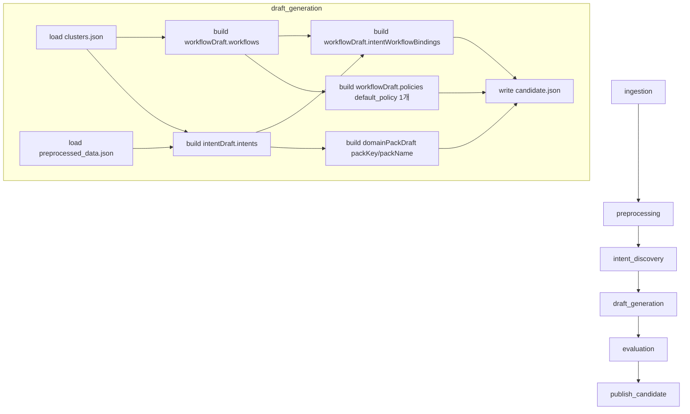

# [ML] 2.2.18 — Intent별 Workflow Graph 생성

> Backlog 002218 · Branch: `spec/002218`
> Template: `_TEMPLATE_ML.md`

---

## Goal

`draft_generation` 스테이지가 산출하는 candidate artifact의 `workflowDraft` (현재 빈 dict stub) 를 채워, 각 intent cluster마다 **state 기반 workflow graph 1개**를 생성한다. 본 spec 적용 후 `publish_candidate.validate_candidate` 가 처음으로 통과 가능한 candidate 가 만들어지며, ML pipeline 의 end-to-end publish 가 동작한다.

graph topology 생성기는 향후 LLM 기반 generator 로 교체 가능하도록 callable interface 로 분리한다 (본 spec 은 `signal_based_generator` 만 구현).

---

## DAG Diagram



---

## Scope

### In scope

1. `draft_generation/main.py` `_build_candidate` 수정 — `workflowDraft` 채우기 (workflows + intentWorkflowBindings + 1개 default policy).
2. `draft_generation/main.py` `_build_candidate` 수정 — `domainPackDraft.packKey` / `packName` 도출 (StageContext 기반).
3. `draft_generation` 내부에 graph topology generator 모듈 추가 (`signal_based_generator`). callable 분리로 향후 LLM 교체 가능 구조.
4. `evaluation/main.py` `_build_development_candidate` 의 graphJson 에 `direction: "LR"` 추가 + 각 node 에 `label` 추가 (schema-level minimal 갱신).
5. `ml/tests/stages/test_draft_generation_smoke.py` 의 publish_candidate exclude 제거 + publish 통과 smoke 검증 추가.
6. 위 변경에 대한 unit test 갱신/추가.

### Out of scope

- `slots` / `risks` / `intentSlotBindings` 생성 로직 (별도 후속 2.2.x backlog. 본 spec 은 빈 list `[]`).
- LLM 기반 graph generator 구현 (별도 backlog — 본 spec 은 generator interface 와 signal-based 구현만).
- `evaluation.workflow_separability` 메트릭 계산 (현재 stub `None` 그대로 유지. 별도 backlog).
- 실제 cluster context 기반 policy / risk 생성 (현재 spec 은 V8c 충족용 dummy default policy 만).
- `evaluation._build_development_candidate` 의 topology 다양화 (schema-level 변경만, 노드 구조 그대로 유지).
- callback 단계의 BE 측 처리 (publish_candidate 는 validate 만 검증, 콜백 통신은 기존 구현 그대로).

---

## Stage Interface — `draft_generation`

### Input

| 항목 | 타입 | 설명 |
|------|------|------|
| `upstream_manifest_path` | `str \| None` | `intent_discovery` 스테이지 manifest.json 경로 |

upstream artifact 디렉터리 및 직전 stage 디렉터리에서 읽는 파일 (002217과 동일):

| 파일 | 출처 stage | 설명 |
|------|-----------|------|
| `clusters.json` | `intent_discovery` | cluster 목록 (`exemplar_conv_ids`, `workflow_signal` 포함) |
| `preprocessed_data.json` | `preprocessing` | conversation 메타 (representativeCases hydration용) |

`StageContext` 의 `workspace_id`, `dataset_id` 는 `domainPackDraft.packKey/packName` 도출에 사용.

### Output

| 파일 | 형식 | 설명 |
|------|------|------|
| `candidate.json` | JSON | `publish_candidate` 가 소비하는 candidate (이번 spec 범위는 `domainPackDraft` + `workflowDraft.workflows/policies/intentWorkflowBindings`) |
| `manifest.json` | JSON | `pipeline.common.artifacts.write_stage_manifest` 공통 포맷 |

### Configuration

새 환경 변수 없음. 002217 의 `DRAFT_REPRESENTATIVE_CASES_PER_INTENT` 그대로 유지.

---

## Selection Logic

### Cluster → Workflow 매핑 (1:1)

- `intent_discovery` 의 valid cluster 1개 → workflow 1개 + intentWorkflowBinding 1개.
- `workflowCode = f"WORKFLOW_{cluster_id}"` (예: cluster_id=0 → `WORKFLOW_0`).
- `intentCode = f"INTENT_{cluster_id}"` (002217 §Selection Logic 정합).
- intent 와 workflow 가 같은 cluster_id 를 공유하므로 binding 자연스럽게 1:1.

### packKey / packName 도출

- `packKey = f"pack_ws{stage_context.workspace_id}_ds{stage_context.dataset_id}"` (max 100자, V_pack_key 충족).
- `packName = f"Pack ws{stage_context.workspace_id}/ds{stage_context.dataset_id}"`.
- `workspace_id` 또는 `dataset_id` 가 `None` 이면 `PipelineStageError("packKey requires both workspace_id and dataset_id in StageContext.")` raise.

### Policies (Dummy Default)

candidate 전체에 1개 default policy 만 포함. **Dummy 임을 명시**:

```json
{
  "policyCode": "default_policy",
  "name": "Default policy (Dummy)",
  "description": "Workflow ACTION 노드의 V8c policyRef 검증을 충족하기 위한 placeholder dummy policy. 후속 backlog spec(별도 2.2.x)에서 cluster context 기반 실제 policy로 대체 예정.",
  "severity": "LOW",
  "conditionJson": "{}",
  "actionJson": "{}",
  "evidenceJson": "[]",
  "metaJson": "{}"
}
```

모든 ACTION 노드의 `policyRef = "default_policy"` 사용 (V8c 자동 충족).

### intentWorkflowBindings

각 cluster 마다 1개 binding 생성:

```json
{
  "intentCode": "INTENT_<cluster_id>",
  "workflowCode": "WORKFLOW_<cluster_id>",
  "isPrimary": true,
  "routeConditionJson": "{}"
}
```

---

## graphJson Generation Rule

### Generator Interface (LLM-Extensible)

```python
# ml/src/pipeline/stages/draft_generation/workflow_graph.py (신규)

from dataclasses import dataclass
from typing import Protocol

@dataclass(frozen=True)
class ClusterContext:
    cluster_id: int
    suggested_name: str
    workflow_signal: dict[str, bool]  # WORKFLOW_SIGNAL_KEYS

@dataclass(frozen=True)
class GraphNodeSpec:
    id: str
    type: str  # "START" | "ACTION" | "DECISION" | "HANDOFF" | "TERMINAL"
    label: str
    policy_ref: str | None = None  # ACTION 노드만 non-None

@dataclass(frozen=True)
class GraphEdgeSpec:
    id: str
    from_node: str
    to_node: str
    label: str | None = None  # DECISION outgoing edge 만 필수

@dataclass(frozen=True)
class WorkflowGraphSpec:
    direction: str              # "LR"
    nodes: tuple[GraphNodeSpec, ...]
    edges: tuple[GraphEdgeSpec, ...]

class WorkflowGraphGenerator(Protocol):
    def __call__(self, context: ClusterContext) -> WorkflowGraphSpec: ...
```

본 spec 은 `signal_based_generator: WorkflowGraphGenerator` 1개만 구현.
향후 `llm_based_generator` 가 같은 Protocol 을 구현해 swap 가능.

### Direction / Label 규칙

- 모든 graphJson 에 `"direction": "LR"`.
- node `label` 규칙:
  | type | label |
  |---|---|
  | `START` | `"시작"` |
  | `ACTION` (메인) | `cluster.suggested_name` (cluster 컨텍스트 표현) |
  | `ACTION` (identify) | `"본인인증"` |
  | `ACTION` (payment_check) | `"결제 확인"` |
  | `DECISION` | `"분기"` |
  | `HANDOFF` | `"상담원 연결"` |
  | `TERMINAL` | `"종료"` |

### Edge ID Rule (V7c 자동 충족)

- 형식: `f"e_{cluster_id}_{n}"` (n 은 graph 내 1부터 시작하는 순번).
- workflow 내 unique + `[A-Za-z0-9_-]+` 패턴 자동 충족.

### `signal_based_generator` 변형 규칙

baseline 에 `workflow_signal` 별 변형을 결정적 순서 (identify → payment_check → escalation) 로 적용.

#### Baseline (모든 cluster 공통, 3 nodes / 2 edges)

```
nodes:
  - {id: "start",    type: "START",    label: "시작"}
  - {id: "action",   type: "ACTION",   label: "<suggested_name>", policyRef: "default_policy"}
  - {id: "terminal", type: "TERMINAL", label: "종료"}
edges:
  - {id: "e_<cid>_1", from: "start",  to: "action"}
  - {id: "e_<cid>_2", from: "action", to: "terminal"}
```

#### `requires_user_identification == true` 변형

ACTION `identify` 를 `start` 와 `action` 사이에 prepend.

```
nodes 추가: {id: "identify", type: "ACTION", label: "본인인증", policyRef: "default_policy"}
edges 갱신: start → identify → action → terminal
```

#### `requires_payment_check == true` 변형

ACTION `payment_check` 를 `identify` (있으면 그 다음) 또는 `start` 와 `action` 사이에 prepend.

```
nodes 추가: {id: "payment_check", type: "ACTION", label: "결제 확인", policyRef: "default_policy"}
edges 갱신: 직전 노드 → payment_check → action → terminal
```

#### `has_escalation_cases == true` 변형

`action` 다음에 DECISION 분기 + HANDOFF 분기 추가.

```
nodes 추가:
  - {id: "decision", type: "DECISION", label: "분기"}
  - {id: "handoff",  type: "HANDOFF",  label: "상담원 연결"}
  - {id: "terminal_alt", type: "TERMINAL", label: "종료"}
edges 갱신:
  - action → decision (label 없음)
  - decision → terminal      (label: "resolved")
  - decision → handoff       (label: "escalated")
  - handoff → terminal_alt   (label 없음)
```

V6 (DECISION outgoing edge label 필수) 충족.

#### 변형 조합 예시 (3 signals all true)

8 nodes / 8 edges:
```
start → identify → payment_check → action → decision
                                                ├─[resolved]→ terminal
                                                └─[escalated]→ handoff → terminal_alt
```

V1 (START 1개) / V2 (TERMINAL ≥1) / V3 (no dangling) / V4 (reachability) / V5 (no cycle) 모두 충족.

### graphJson 직렬화

`WorkflowGraphSpec` → JSON string (max 20000자, V8 충족):

```json
{
  "direction": "LR",
  "nodes": [
    {"id": "start", "type": "START", "label": "시작"},
    {"id": "action", "type": "ACTION", "label": "환불 관련 문의", "policyRef": "default_policy"},
    {"id": "terminal", "type": "TERMINAL", "label": "종료"}
  ],
  "edges": [
    {"id": "e_0_1", "from": "start", "to": "action"},
    {"id": "e_0_2", "from": "action", "to": "terminal"}
  ]
}
```

---

## Stage Implementation 개요

### 변경 대상 파일

| 파일 | 변경 내용 |
|---|---|
| `ml/src/pipeline/stages/draft_generation/main.py` | `_build_candidate` 수정. packKey/packName 채움. workflowDraft 채움. generator 호출. |
| `ml/src/pipeline/stages/draft_generation/workflow_graph.py` | 신규. `ClusterContext`, `WorkflowGraphSpec`, `WorkflowGraphGenerator` Protocol, `signal_based_generator` 구현. |
| `ml/src/pipeline/stages/evaluation/main.py` | `_build_development_candidate` graphJson 에 `direction: "LR"` 추가 + 각 node 에 `label` 추가 (schema-level minimal). |
| `ml/tests/stages/test_draft_generation_smoke.py` | publish_candidate exclude 제거. publish 통과 검증 추가. |
| `ml/tests/stages/test_draft_generation_*` | 신규 unit test 추가 (workflow graph generation, V1~V8 통과). |

### 함수 구조 (참고용 — 정확한 시그니처는 codeBuilder 결정)

```python
# draft_generation/main.py 변경 예시

from pipeline.stages.draft_generation.workflow_graph import (
    ClusterContext, signal_based_generator, serialize_graph_json,
)

def _build_candidate(
    intents: list[dict[str, Any]],
    clusters: list[dict[str, Any]],
    stage_context: StageContext,
) -> dict[str, Any]:
    pack_key, pack_name = _derive_pack_identity(stage_context)
    workflow_draft = _build_workflow_draft(intents, clusters)
    return {
        "schemaVersion": "1.0",
        "domainPackDraft": {
            "packKey": pack_key,
            "packName": pack_name,
        },
        "intentDraft": {"intents": intents},
        "workflowDraft": workflow_draft,
    }

def _derive_pack_identity(stage_context: StageContext) -> tuple[str, str]:
    if stage_context.workspace_id is None or stage_context.dataset_id is None:
        raise PipelineStageError(
            "packKey requires both workspace_id and dataset_id in StageContext."
        )
    pack_key = f"pack_ws{stage_context.workspace_id}_ds{stage_context.dataset_id}"
    pack_name = f"Pack ws{stage_context.workspace_id}/ds{stage_context.dataset_id}"
    return pack_key, pack_name

def _build_workflow_draft(
    intents: list[dict[str, Any]],
    clusters: list[dict[str, Any]],
) -> dict[str, Any]:
    workflows: list[dict[str, Any]] = []
    bindings: list[dict[str, Any]] = []
    for cluster in clusters:
        cluster_id = cluster["cluster_id"]
        context = ClusterContext(
            cluster_id=cluster_id,
            suggested_name=cluster.get("suggested_name") or f"INTENT_{cluster_id}",
            workflow_signal=cluster.get("workflow_signal") or {},
        )
        graph_spec = signal_based_generator(context)
        workflows.append({
            "workflowCode": f"WORKFLOW_{cluster_id}",
            "name": context.suggested_name,
            "description": f"{context.suggested_name} 자동 생성 workflow",
            "graphJson": serialize_graph_json(graph_spec),
            "evidenceJson": "[]",
            "metaJson": "{}",
        })
        bindings.append({
            "intentCode": f"INTENT_{cluster_id}",
            "workflowCode": f"WORKFLOW_{cluster_id}",
            "isPrimary": True,
            "routeConditionJson": "{}",
        })
    return {
        "slots": [],
        "policies": [_default_dummy_policy()],
        "risks": [],
        "workflows": workflows,
        "intentSlotBindings": [],
        "intentWorkflowBindings": bindings,
    }

def _default_dummy_policy() -> dict[str, Any]:
    return {
        "policyCode": "default_policy",
        "name": "Default policy (Dummy)",
        "description": (
            "Workflow ACTION 노드의 V8c policyRef 검증을 충족하기 위한 "
            "placeholder dummy policy. 후속 backlog spec(별도 2.2.x)에서 "
            "cluster context 기반 실제 policy로 대체 예정."
        ),
        "severity": "LOW",
        "conditionJson": "{}",
        "actionJson": "{}",
        "evidenceJson": "[]",
        "metaJson": "{}",
    }
```

`signal_based_generator` 의 시그니처는 `WorkflowGraphGenerator` Protocol 충족. 내부적으로 baseline 빌드 후 signal 별 mutation 함수 (예: `_apply_identify`, `_apply_payment_check`, `_apply_escalation`) 를 결정적 순서로 적용.

---

## Artifact Schema — candidate.json (해당 부분만)

```json
{
  "schemaVersion": "1.0",
  "domainPackDraft": {
    "packKey": "pack_ws<workspace_id>_ds<dataset_id>",
    "packName": "Pack ws<workspace_id>/ds<dataset_id>"
  },
  "intentDraft": {
    "intents": [
      {
        "intentCode": "INTENT_0",
        "name": "환불 관련 문의",
        "description": "...",
        "representativeCases": [/* 002217 */]
      }
    ]
  },
  "workflowDraft": {
    "slots": [],
    "policies": [
      {
        "policyCode": "default_policy",
        "name": "Default policy (Dummy)",
        "description": "Workflow ACTION 노드의 V8c policyRef 검증을 충족하기 위한 placeholder dummy policy. ...",
        "severity": "LOW",
        "conditionJson": "{}",
        "actionJson": "{}",
        "evidenceJson": "[]",
        "metaJson": "{}"
      }
    ],
    "risks": [],
    "workflows": [
      {
        "workflowCode": "WORKFLOW_0",
        "name": "환불 관련 문의",
        "description": "환불 관련 문의 자동 생성 workflow",
        "graphJson": "{\"direction\":\"LR\",\"nodes\":[...],\"edges\":[...]}",
        "evidenceJson": "[]",
        "metaJson": "{}"
      }
    ],
    "intentSlotBindings": [],
    "intentWorkflowBindings": [
      {
        "intentCode": "INTENT_0",
        "workflowCode": "WORKFLOW_0",
        "isPrimary": true,
        "routeConditionJson": "{}"
      }
    ]
  }
}
```

---

## `publish_candidate` 검증

기존 `validate_candidate` (recon §1.4) 가 다음을 모두 강제:

- `domainPackDraft.packKey/packName` non-blank max 100/255 (recon §1.5) — 본 spec 의 `_derive_pack_identity` 가 충족.
- `WORKFLOW_LIST_KEYS` 중 1개 이상 non-empty — `policies` (1개) + `workflows` (cluster 수) + `intentWorkflowBindings` (cluster 수) 채움으로 충족.
- `policies[*].policyCode/name` 검증 — `default_policy` / `Default policy (Dummy)` 가 충족.
- `workflows[*].workflowCode/name/graphJson` 검증 — `WORKFLOW_<cluster_id>` / `cluster.suggested_name` / serialized graphJson 이 충족.
- `intentWorkflowBindings[*].intentCode ∈ intent_codes` + `workflowCode ∈ workflow_codes` cross-ref — 1:1 매핑이 자동 충족.

본 spec 은 `validate_candidate` 자체를 변경하지 않는다. (002217 의 `representativeCases` 검증 추가는 그대로 유지.)

---

## Backend Validation Cross-Check (V1 ~ V8)

ML 이 생성한 graphJson 은 BE `WorkflowGraphValidator` 의 V1 ~ V8 (recon §1.7) 을 모두 통과해야 함.

| Rule | 충족 방식 |
|---|---|
| V1 (정확히 1개 START) | 모든 변형이 `start` 1개 유지 |
| V2 (≥1개 TERMINAL) | baseline `terminal` 1개 + escalation 시 `terminal_alt` 추가 (≥1 보장) |
| V3 (no dangling edge) | edge 의 `from`/`to` 가 모두 nodes 안에 있도록 generator 가 생성 |
| V4 (START reachability) | START → … 경로 모두 연결되도록 generator 가 생성 |
| V5 (no cycle) | DAG 형태로만 생성 (역방향 edge 없음) |
| V6 (DECISION outgoing label 필수) | escalation 변형에서 `decision → terminal` 에 `"resolved"`, `decision → handoff` 에 `"escalated"` label |
| V7a (edge id 존재) | 모든 edge 에 `e_<cid>_<n>` 부여 |
| V7b (edge id 중복 금지) | n 순번 unique |
| V7c (edge id 패턴) | `e_<숫자>_<숫자>` 는 `[A-Za-z0-9_-]+` 충족 |
| V8a (ACTION policyRef 필수) | 모든 ACTION 노드에 `"default_policy"` 부여 |
| V8b (policyRef 유효 문자) | `default_policy` 충족 |
| V8c (policyRef ∈ policy codes) | candidate `policies` 에 `"default_policy"` 1개 포함 |

---

## Metrics

기존 002217 메트릭에 다음 추가:

| 메트릭 | 단위 | 설명 |
|---|---|---|
| `workflow_count` | count | 생성된 workflow 수 (= valid cluster 수, 1:1 매핑) |
| `workflow_with_identify_count` | count | `requires_user_identification=true` cluster 수 |
| `workflow_with_payment_check_count` | count | `requires_payment_check=true` cluster 수 |
| `workflow_with_escalation_count` | count | `has_escalation_cases=true` cluster 수 |

`evaluation.workflowSeparability` 는 본 spec 범위 외 (Deferred — `None` stub 그대로).

---

## Tests

### Unit Tests

- `signal_based_generator`:
  - baseline (signal 모두 false): 3 nodes (START/ACTION/TERMINAL) / 2 edges
  - `requires_user_identification` only: 4 nodes / 3 edges, identify ACTION 포함
  - `requires_payment_check` only: 4 nodes / 3 edges
  - `has_escalation_cases` only: 6 nodes / 5 edges (DECISION + HANDOFF + terminal_alt)
  - 3 signals all true: 8 nodes / 8 edges
  - 모든 변형에서 V1~V8 통과 (별도 helper 로 검증)
- `_derive_pack_identity`:
  - workspace_id+dataset_id 둘 다 set → `pack_ws{ws}_ds{ds}` 형식
  - 둘 중 하나 None → `PipelineStageError` raise + 메시지 "packKey requires both ..."
- `_build_workflow_draft`:
  - cluster 1개 입력 → `workflows` len=1, `policies` len=1, `intentWorkflowBindings` len=1
  - cluster 0개 입력 (empty) → 빈 list 들. (publish_candidate 의 "at least one draft component" 검증은 cluster 0개 시 intent 도 0개라 별개로 fail)
  - intent_code/workflow_code 1:1 매핑 검증
  - `policies[0].policyCode = "default_policy"` + `name` 에 "Dummy" 포함
- `serialize_graph_json`:
  - `direction: "LR"` 포함
  - 각 node 에 `label` 포함
  - JSON 길이 max 20000 (V8 충족)

### Integration Tests

- `tests/dags/`의 dev_bootstrap fixture 로 `intent_discovery → draft_generation → publish_candidate(callback_disabled)` 통과 smoke test.
- candidate.json 의 `domainPackDraft.packKey` non-blank, `workflowDraft.workflows` non-empty, `intentWorkflowBindings` 모두 cross-ref 통과.
- `validate_candidate(candidate)` 가 raise 없이 통과.

### `test_draft_generation_smoke.py` 변경

- 002217 시점 publish_candidate exclude 사유 (`packKey=None (U-006 Deferred)`) 가 본 spec 으로 해소됨.
- exclude 제거 + `validate_candidate` 통과 검증 추가.

### Test Checklist

- [ ] `signal_based_generator` 모든 signal 조합 (8 케이스: 3-bit) unit test
- [ ] V1~V8 graph validation helper 로 generator 출력 검증
- [ ] `_derive_pack_identity` workspace/dataset None 케이스
- [ ] `_build_workflow_draft` cluster N 케이스 + intent/workflow 1:1 매핑 cross-ref
- [ ] `validate_candidate` (publish_candidate) 가 본 spec 산출 candidate 를 raise 없이 통과
- [ ] `_build_development_candidate` graphJson 에 `direction` + node `label` 포함 검증
- [ ] dev_bootstrap fixture 로 publish_candidate(callback_disabled) 통과 smoke

---

## Error Handling

| 상황 | 처리 전략 |
|---|---|
| `stage_context.workspace_id` 또는 `dataset_id` 가 None | `PipelineStageError("packKey requires both workspace_id and dataset_id in StageContext.")` raise |
| `clusters` 가 빈 list | workflowDraft 의 모든 list 빈 list `[]`. publish_candidate 의 기존 검증 (`intents must contain at least one intent`) 이 별도로 실패시킴. 본 stage 자체는 통과 |
| `cluster.workflow_signal` 누락 또는 falsy | baseline graph (signal 모두 false 처리) 로 fallback |
| `cluster.suggested_name` 누락 | `f"INTENT_{cluster_id}"` 로 fallback (workflow `name` / ACTION `label` 모두) |
| graphJson serialize 결과 max 20000 초과 | 본 spec 변형 규칙으로는 unreachable (8노드 8엣지 최대). 발생 시 기존 publish_candidate validation 이 raise. 별도 처리 없음 |

---

## Monitoring

logging 추가 (002217 패턴 동일):

```
draft_generation.workflow_built {
  cluster_id: <id>,
  workflow_code: WORKFLOW_<id>,
  signal_flags: [identify=<bool>, payment=<bool>, escalation=<bool>],
  node_count: <n>, edge_count: <m>
}
draft_generation.pack_identity {
  pack_key: <derived>, pack_name: <derived>
}
```

---

## Dependencies

신규 dependency 없음. `pipeline.common.*`, stage 내부 모듈만 사용.

---

## Migration / Rollout Notes

- 본 spec 머지 후 `_build_development_candidate` 의 schema-level 갱신 (direction/label) 도 함께 들어감.
- 실제 production data 로 publish 가 처음 동작하는 spec. dummy policy 로 publish 까지 완주만 보장.
- `default_policy` 는 dummy 임을 description 에 명시했으므로, runtime/검토 화면에서 실제 정책으로 오인되지 않음. 후속 backlog 에서 cluster context 기반 실제 policy 생성 예정.

---

## Open Items

상세 의사결정 항목은 `.handoff/002218/uncertainty-register-002218.md` 참조.

남은 항목 (Deferred):

- U-013 — `evaluation.workflowSeparability` 메트릭 (별도 backlog)
- 실제 cluster 컨텍스트 기반 policy / risk / slot 생성 (별도 후속 2.2.x backlog)
- LLM 기반 graph generator 구현 (별도 backlog — 본 spec 이 generator interface 만 분리)

`Needs Input` / `Conflict` 항목 없음. codeBuilder 진입 가능.

---

## References

- `.agent/specs/002217.md` — 선행 spec (intent representative cases)
- `.agent/specs/2217.md` — BE V7 edge id 정의
- `.agent/specs/_TEMPLATE_ML.md`
- `.agent/docs/architecture.md` §7.2.4 (draft-generation), §7.2.5 (evaluation), §workflow as state-based graph
- `.agent/docs/schema.md` `pack.workflow_definition`, `pack.intent_workflow_binding`
- `.handoff/002218/recon-report-002218.md`
- `.handoff/002218/uncertainty-register-002218.md`
- `ml/src/pipeline/stages/draft_generation/main.py` (현재 stub `_build_candidate`)
- `ml/src/pipeline/stages/publish_candidate/main.py` `validate_candidate`
- `ml/src/pipeline/stages/evaluation/main.py` `_build_development_candidate`
- `ml/src/pipeline/stages/intent_discovery/types.py` `WORKFLOW_SIGNAL_KEYS`
- `frontend/src/entities/workflow/model/types.ts` `WorkflowGraph` (direction/label 정합 근거)
- `backend/src/main/java/com/init/domainpack/application/WorkflowGraphValidator.java` (V1~V8 검증 cross-check)
