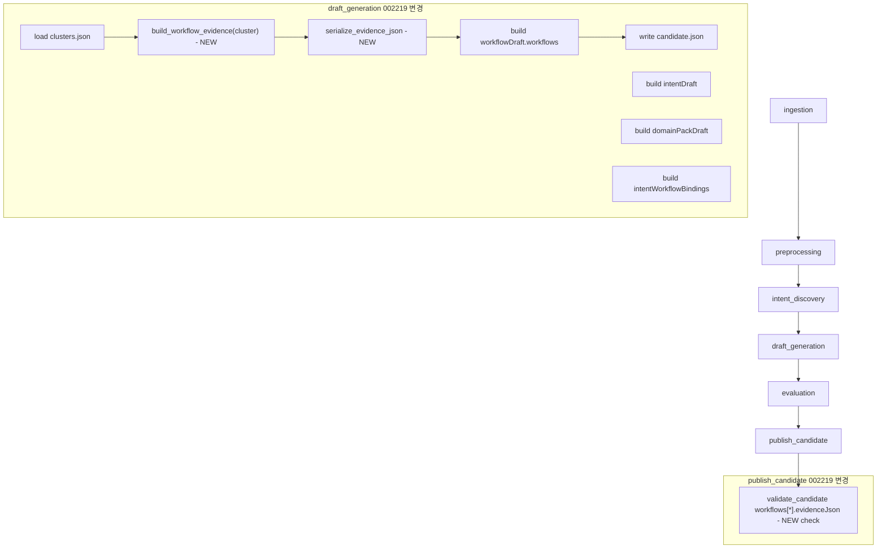

# [ML] 2.2.19 — Workflow Graph 근거 연결

> Backlog 002219 · Branch: `spec/002219`
> Template: `_TEMPLATE_ML.md`

---

## Goal

`draft_generation` 스테이지가 산출하는 candidate artifact의 `workflowDraft.workflows[*].evidenceJson` (현재 002218 시점 빈 stub `"[]"`) 를 cluster context (TF-IDF keywords + conversation IDs) 기반 근거 list로 채워, Backend `pack.workflow_definition.evidence_json` jsonb 컬럼에 의미 있는 데이터가 저장되도록 한다.

`signal_based_generator` 와 `ClusterContext`는 변경 없이 유지하며 (사용자 제약 — LLM 추론 기반 변경 금지), evidence 생성은 별도 deterministic 함수로 분리한다.

---

## DAG Diagram



---

## Scope

### In scope

1. `ml/src/pipeline/stages/draft_generation/workflow_evidence.py` 신규 — `build_workflow_evidence(cluster)` + `serialize_evidence_json(items)` 함수.
2. `ml/src/pipeline/stages/draft_generation/main.py` `_build_workflow_draft` 수정 — workflow dict의 `evidenceJson` 키를 `serialize_evidence_json(build_workflow_evidence(cluster))` 결과로 채움 (002218 stub `"[]"` 교체).
3. `ml/src/pipeline/stages/publish_candidate/main.py` `validate_candidate` 수정 — `workflowDraft.workflows[*].evidenceJson` 에 대한 JSON-parse + array 형태 + length ≤ 5000 검증 추가.
4. 위 변경에 대한 unit test 추가 / 갱신.

### Out of scope

- `default_policy.evidenceJson` 채우기 (002218 dummy policy 그대로 `"[]"`. 별도 후속 backlog).
- graph node 단위 evidence 매핑 (Option B Future Extension — §Future Extension에 명시. 본 spec은 workflow-level flat list만).
- `intent_discovery._workflow_signal` 변경 (signal-match keyword / escalation conv_id 특정 직렬화 — 별도 backlog).
- `ClusterContext` 확장 (현 3필드 유지. 사용자 제약 준수 — U-004 Decision A).
- `signal_based_generator` 자체 수정 (사용자 제약 — LLM 추론 기반 변경 금지).
- `intent.evidenceJson` / `risk.evidenceJson` / `slot.evidenceJson` (별도 backlog. policy / risk / intent의 evidenceJson은 본 spec scope 외 — U-001 Decision A).
- BE 측 `evidence_json` 정형 schema 검증 / migration (별도 spec).
- FE 측 evidence UI 표시 변경 (현 raw JSON 표시 패턴 유지).

---

## Stage Interface — `draft_generation`

### Input

기존 002217 / 002218 입력 동일. 본 spec 추가 입력 없음.

| 파일 | 출처 stage | 본 spec 사용 필드 |
|---|---|---|
| `clusters.json` | `intent_discovery` | `cluster_id`, `keywords`, `exemplar_conv_ids`, `member_conv_ids`, `suggested_name`, `workflow_signal` |
| `preprocessed_data.json` | `preprocessing` | (002217 representativeCases hydration 그대로) |

`StageContext`의 `workspace_id`/`dataset_id`는 002218에서 도입한 packKey 도출에만 사용 (본 spec 변경 없음).

### Output

기존 candidate.json 형식 동일. 변경 차이:
- `workflowDraft.workflows[*].evidenceJson`: 002218 stub `"[]"` → 본 spec 실질 list `"[{...}, ...]"`.
- `manifest.json` 형식 변경 없음 (메트릭 4종 추가, §Metrics 참고).

### Configuration

신규 환경 변수 3개:

| 변수 | 기본값 | 설명 |
|---|---|---|
| `DRAFT_EVIDENCE_KEYWORDS_PER_WORKFLOW` | `5` | workflow evidence에 포함할 keyword 최대 개수 |
| `DRAFT_EVIDENCE_EXEMPLARS_PER_WORKFLOW` | `3` | exemplar conv_id 최대 개수 (intent_discovery exemplar top-3 정합) |
| `DRAFT_EVIDENCE_MEMBERS_PER_WORKFLOW` | `10` | exemplar 제외한 member conv_id 최대 개수 |

env 미설정 시 위 default 사용. 음수/비정수 입력 시 default fallback (예외 raise 없음).

기존 `DRAFT_REPRESENTATIVE_CASES_PER_INTENT` (002217) 그대로 유지.

---

## Selection Logic

### Evidence Source 선택 (U-003 Decision: B)

다음 3종 source를 deterministic 순서로 채움 (output reproducibility 보장):

1. **TF-IDF keywords** — `cluster["keywords"]` 의 head N개 (`DRAFT_EVIDENCE_KEYWORDS_PER_WORKFLOW`, default 5).
   - intent_discovery `_top_keywords` (recon §1.5)가 TF-IDF 점수 내림차순 정렬한 결과 그대로 사용.
   - Empty 또는 missing → keyword evidence 0개 (해당 type만 skip).

2. **Exemplar conversation IDs** — `cluster["exemplar_conv_ids"]` 의 head N개 (`DRAFT_EVIDENCE_EXEMPLARS_PER_WORKFLOW`, default 3).
   - intent_discovery exemplar top-3 (002217 §1.7 정합).
   - Empty 또는 missing → exemplar evidence 0개.

3. **Member conversation IDs (non-exemplar)** — `cluster["member_conv_ids"]` 에서 위에서 채택한 exemplar set을 제외한 head N개 (`DRAFT_EVIDENCE_MEMBERS_PER_WORKFLOW`, default 10).
   - 중복 방지 (exemplar이 member의 부분집합이므로 dedup 필요).
   - cluster size가 작아 N개 미만이면 가능한 만큼만 포함.
   - Empty 또는 missing → member evidence 0개.

### Top-N 결정 근거

| Source | top-N | 추정 entry 크기 (UTF-8) | 합 |
|---|---|---|---|
| keyword | 5 | ~33 chars (`{"type":"keyword","value":"환불"}`) | ~250 |
| exemplar_conv_id | 3 | ~70 chars (UUID 36자 + JSON 32자 ~) | ~210 |
| member_conv_id | 10 | ~70 chars | ~700 |
| 구조 (`[`, `]`, `,`) | — | — | ~50 |
| **Total** | **18 entries** | — | **~1210** |

`@Size(max=5000)` (recon §1.8) 대비 4배 margin. cluster size 또는 keyword 길이가 예외적으로 커도 5000 cap 안전.

`signal_based_generator`처럼 cluster signal에 따라 entry 수가 가변하지 않으므로, output은 cluster.keywords/conv_ids head 결정 시 결정적.

---

## Evidence Generation Rule

### evidenceJson Schema (Option A — Workflow-Level Flat List)

```json
[
  {"type": "keyword", "value": "환불"},
  {"type": "keyword", "value": "결제"},
  {"type": "keyword", "value": "취소"},
  {"type": "keyword", "value": "주문"},
  {"type": "keyword", "value": "배송"},
  {"type": "exemplar_conv_id", "value": "conv-uuid-1"},
  {"type": "exemplar_conv_id", "value": "conv-uuid-2"},
  {"type": "exemplar_conv_id", "value": "conv-uuid-3"},
  {"type": "member_conv_id", "value": "conv-uuid-4"},
  {"type": "member_conv_id", "value": "conv-uuid-5"}
]
```

각 entry 필드:

| 필드 | 타입 | 의미 |
|---|---|---|
| `type` | `"keyword" | "exemplar_conv_id" | "member_conv_id"` | source kind |
| `value` | `string` | type별 의미: keyword string 또는 conversation ID string |

빈 cluster (모든 source empty) → `[]`.

### Order Determinism

evidence list 내 순서:

1. 모든 keyword (cluster.keywords 입력 순서, head N개).
2. 모든 exemplar_conv_id (cluster.exemplar_conv_ids 입력 순서, head N개).
3. 모든 member_conv_id (exemplar set 제외 후 cluster.member_conv_ids 입력 순서, head N개).

같은 cluster 입력 → 같은 evidenceJson 출력 (재현성 보장).

### Future Extension (Option B — Node-Grouped Evidence)

본 spec은 workflow-level flat list만 출력. graph node 단위 근거 매핑 (예: `identify` node에 "본인인증" keyword 연결, `payment_check` node에 "결제" keyword 연결, `action` node에 exemplar/member conv_ids 연결)이 향후 필요해지면 다음 schema로 확장 가능:

```json
{
  "workflowEvidence": [
    {"type": "keyword", "value": "환불"},
    {"type": "exemplar_conv_id", "value": "conv-uuid-1"}
  ],
  "nodeEvidence": {
    "identify": [
      {"type": "keyword", "value": "본인인증"}
    ],
    "payment_check": [
      {"type": "keyword", "value": "결제"}
    ],
    "action": [
      {"type": "exemplar_conv_id", "value": "conv-uuid-1"}
    ]
  }
}
```

이 확장은 `evidenceJson` 본체 형태를 array → object로 바꾸므로 다음을 동반:

- ML side: `build_workflow_evidence` 시그니처 확장 (`graph_spec` 인자 추가). node→evidence 매핑 함수 (LLM 또는 deterministic rule) 추가.
- BE side: `pack.workflow_definition.evidence_json` jsonb 컬럼은 array/object 둘 다 수용 가능 (jsonb 본질). FE 표시 로직만 update 필요.
- FE side: `formatJsonForDisplay`는 raw 표시이므로 schema 진화에 호환. node-level 표시 UI 추가는 별도 backlog.

본 spec 머지 후 별도 backlog로 처리. 본 spec의 array-only 출력은 향후 schema 확장 시에도 hostile fork 없이 단계적 진화 가능.

---

## Stage Implementation 개요

### 변경 대상 파일

| 파일 | 변경 내용 |
|---|---|
| `ml/src/pipeline/stages/draft_generation/workflow_evidence.py` | **신규**. `build_workflow_evidence(cluster)` + `serialize_evidence_json(items)` |
| `ml/src/pipeline/stages/draft_generation/main.py` | `_build_workflow_draft` 수정. workflow dict의 `evidenceJson`을 새 함수 호출 결과로 교체. metric 4종 추가 |
| `ml/src/pipeline/stages/publish_candidate/main.py` | `validate_candidate` 수정. `workflows[*].evidenceJson` 에 대한 JSON-parse + array 형태 + length ≤ 5000 검증 추가 (`_validate_evidence_json` helper 신규) |
| `ml/tests/stages/test_draft_generation_*` | unit test 추가 |
| `ml/tests/stages/test_publish_candidate_*` | unit test 추가 (evidenceJson 검증) |

### 함수 구조 (참고용 — 정확한 시그니처는 codeBuilder 결정)

```python
# ml/src/pipeline/stages/draft_generation/workflow_evidence.py (신규)

from __future__ import annotations

import json
import os
from typing import Any

DEFAULT_KEYWORDS_PER_WORKFLOW = 5
DEFAULT_EXEMPLARS_PER_WORKFLOW = 3
DEFAULT_MEMBERS_PER_WORKFLOW = 10


def build_workflow_evidence(cluster: dict[str, Any]) -> list[dict[str, str]]:
    """Cluster 딕셔너리에서 workflow evidence 항목들을 deterministic 순서로 추출."""
    items: list[dict[str, str]] = []

    keywords = cluster.get("keywords") or []
    exemplar_conv_ids = cluster.get("exemplar_conv_ids") or []
    member_conv_ids = cluster.get("member_conv_ids") or []

    keyword_cap = _resolve_cap("DRAFT_EVIDENCE_KEYWORDS_PER_WORKFLOW", DEFAULT_KEYWORDS_PER_WORKFLOW)
    exemplar_cap = _resolve_cap("DRAFT_EVIDENCE_EXEMPLARS_PER_WORKFLOW", DEFAULT_EXEMPLARS_PER_WORKFLOW)
    member_cap = _resolve_cap("DRAFT_EVIDENCE_MEMBERS_PER_WORKFLOW", DEFAULT_MEMBERS_PER_WORKFLOW)

    for kw in keywords[:keyword_cap]:
        if isinstance(kw, str) and kw:
            items.append({"type": "keyword", "value": kw})

    selected_exemplars: list[str] = []
    for cid in exemplar_conv_ids[:exemplar_cap]:
        if isinstance(cid, str) and cid:
            items.append({"type": "exemplar_conv_id", "value": cid})
            selected_exemplars.append(cid)

    exemplar_set = set(selected_exemplars)
    member_added = 0
    for cid in member_conv_ids:
        if member_added >= member_cap:
            break
        if not isinstance(cid, str) or not cid:
            continue
        if cid in exemplar_set:
            continue
        items.append({"type": "member_conv_id", "value": cid})
        member_added += 1

    return items


def serialize_evidence_json(items: list[dict[str, str]]) -> str:
    """Evidence list를 JSON string으로 직렬화. ensure_ascii=False (한글 그대로)."""
    return json.dumps(items, ensure_ascii=False)


def _resolve_cap(env_key: str, default: int) -> int:
    raw = os.getenv(env_key, "").strip()
    if not raw:
        return default
    try:
        value = int(raw)
        return value if value >= 0 else default
    except ValueError:
        return default
```

```python
# ml/src/pipeline/stages/draft_generation/main.py (변경 부분)

from pipeline.stages.draft_generation.workflow_evidence import (
    build_workflow_evidence,
    serialize_evidence_json,
)

def _build_workflow_draft(
    clusters: list[dict[str, Any]],
) -> tuple[dict[str, Any], dict[str, Any]]:
    workflows: list[dict[str, Any]] = []
    bindings: list[dict[str, Any]] = []
    workflow_count = 0
    identify_count = 0
    payment_count = 0
    escalation_count = 0
    keyword_total = 0
    exemplar_total = 0
    member_total = 0
    empty_evidence_count = 0

    for cluster in clusters:
        if not isinstance(cluster, dict):
            continue
        cluster_id = cluster.get("cluster_id")
        suggested_name = cluster.get("suggested_name") or f"INTENT_{cluster_id}"
        context = ClusterContext(
            cluster_id=cluster_id,
            suggested_name=suggested_name,
            workflow_signal=cluster.get("workflow_signal") or {},
        )
        graph_spec = signal_based_generator(context)

        evidence_items = build_workflow_evidence(cluster)
        evidence_json_str = serialize_evidence_json(evidence_items)
        # 메트릭 누적 (type별 count)
        for item in evidence_items:
            t = item.get("type")
            if t == "keyword":
                keyword_total += 1
            elif t == "exemplar_conv_id":
                exemplar_total += 1
            elif t == "member_conv_id":
                member_total += 1
        if not evidence_items:
            empty_evidence_count += 1

        # ... 기존 logger 호출 + workflow/binding append ...
        workflows.append({
            "workflowCode": f"WORKFLOW_{cluster_id}",
            "name": suggested_name,
            "description": f"{suggested_name} 자동 생성 workflow",
            "graphJson": serialize_graph_json(graph_spec),
            "evidenceJson": evidence_json_str,  # ← 002218 stub "[]" 교체
            "metaJson": "{}",
        })
        # ... binding append + signal flag count 그대로 ...

    workflow_metrics = {
        "workflow_count": workflow_count,
        "workflow_with_identify_count": identify_count,
        "workflow_with_payment_check_count": payment_count,
        "workflow_with_escalation_count": escalation_count,
        # 본 spec 추가 메트릭 4종
        "workflow_evidence_keyword_total": keyword_total,
        "workflow_evidence_exemplar_total": exemplar_total,
        "workflow_evidence_member_total": member_total,
        "workflow_with_empty_evidence_count": empty_evidence_count,
    }
    return draft, workflow_metrics
```

```python
# ml/src/pipeline/stages/publish_candidate/main.py (변경)

import json as _json

EVIDENCE_JSON_MAX_LEN = 5000


def validate_candidate(candidate: dict[str, Any]) -> None:
    # ... 기존 검증 그대로 ...
    workflow_codes = _validate_code_list(workflow_lists["workflows"], "workflowCode", "workflowDraft.workflows")
    for workflow in workflow_lists["workflows"]:
        _required_non_blank(workflow, "name", 255)
        _required_non_blank(workflow, "graphJson", 20000)
        _validate_evidence_json(
            workflow.get("evidenceJson"),
            context="workflowDraft.workflows[*].evidenceJson",
        )
    # ... 나머지 그대로 ...


def _validate_evidence_json(value: object, *, context: str) -> None:
    if value is None:
        return
    if not isinstance(value, str):
        raise PipelineStageError(f"{context} must be a string when present.")
    if len(value) > EVIDENCE_JSON_MAX_LEN:
        raise PipelineStageError(
            f"{context} length ({len(value)}) exceeds {EVIDENCE_JSON_MAX_LEN}."
        )
    try:
        parsed = _json.loads(value)
    except _json.JSONDecodeError as exc:
        raise PipelineStageError(f"{context} must be valid JSON.") from exc
    if not isinstance(parsed, list):
        raise PipelineStageError(f"{context} must encode a JSON array.")
```

`_validate_evidence_json`는 `workflowDraft.workflows[*].evidenceJson`에만 호출. policy / risk / intent의 evidenceJson은 본 spec scope 외 (U-001 Decision A — 002218 답습 그대로 검증 없음).

---

## Artifact Schema — candidate.json (해당 부분만)

```json
{
  "schemaVersion": "1.0",
  "domainPackDraft": { },
  "intentDraft": { },
  "workflowDraft": {
    "slots": [],
    "policies": [
      {
        "policyCode": "default_policy",
        "name": "Default policy (Dummy)",
        "description": "...",
        "severity": "LOW",
        "conditionJson": "{}",
        "actionJson": "{}",
        "evidenceJson": "[]",
        "metaJson": "{}"
      }
    ],
    "risks": [],
    "workflows": [
      {
        "workflowCode": "WORKFLOW_0",
        "name": "환불 관련 문의",
        "description": "환불 관련 문의 자동 생성 workflow",
        "graphJson": "{\"direction\":\"LR\",\"nodes\":[...],\"edges\":[...]}",
        "evidenceJson": "[{\"type\":\"keyword\",\"value\":\"환불\"},{\"type\":\"keyword\",\"value\":\"결제\"},{\"type\":\"exemplar_conv_id\",\"value\":\"conv-uuid-1\"},{\"type\":\"member_conv_id\",\"value\":\"conv-uuid-X\"}]",
        "metaJson": "{}"
      }
    ],
    "intentSlotBindings": [],
    "intentWorkflowBindings": []
  }
}
```

---

## `publish_candidate` 검증 — 본 spec 추가 항목

기존 002217 / 002218 검증 항목에 다음을 추가 (workflow.evidenceJson 한정):

| 검증 항목 | 검증 내용 | 실패 시 메시지 형식 |
|---|---|---|
| missing/null 허용 | `None` → pass (BE DTO optional 정합) | — |
| 타입 | `str`이 아니면 fail | `"... must be a string when present."` |
| length | `len > 5000` → fail (BE `@Size(max=5000)` 정합) | `"... length (X) exceeds 5000."` |
| JSON parseability | `json.loads` 실패 → fail | `"... must be valid JSON."` |
| array shape | parse 결과가 `list` 아니면 fail | `"... must encode a JSON array."` |

policy / risk / intent의 evidenceJson은 본 spec에서 검증하지 않음 (002218 답습).

본 spec은 `validate_candidate` 의 다른 검증 항목 (packKey/packName/intentCode/workflowCode/graphJson/cross-ref 등)을 변경하지 않음.

---

## Backend Validation Cross-Check

ML이 생성한 evidenceJson은 BE validation 통과 필수.

| BE 제약 | ML 충족 방식 |
|---|---|
| `WorkflowDraftRequest.evidenceJson` `@Size(max=5000)` (recon §1.8) | top-N 5/3/10 cap → 추정 ~1210자 (안전 margin 4배) + ML 측 5000 cap pre-check (U-006) |
| `WorkflowDraftRequest.evidenceJson` optional | ML output은 항상 채우지만 (`"[]"` 최소), null도 BE에서 허용 |
| `pack.workflow_definition.evidence_json` jsonb (recon §1.9) | JSON array string → BE에서 jsonb parse 가능. default `'[]'::jsonb` 호환 |
| `PolicyDraftRequest.evidenceJson` `@Size(max=5000)` (recon §1.8) | 002218 dummy `"[]"` 그대로 (본 spec 변경 없음) |

---

## Metrics

기존 002218 메트릭에 다음 4종 추가:

| 메트릭 | 단위 | 설명 |
|---|---|---|
| `workflow_evidence_keyword_total` | count | 모든 workflow evidence 합계 — keyword type |
| `workflow_evidence_exemplar_total` | count | 모든 workflow evidence 합계 — exemplar_conv_id type |
| `workflow_evidence_member_total` | count | 모든 workflow evidence 합계 — member_conv_id type |
| `workflow_with_empty_evidence_count` | count | evidence 0개인 workflow 수 (cluster.keywords + conv_ids 모두 empty) |

`evaluation` stage 메트릭 변경 없음. `evaluation.workflowSeparability` 는 002218 그대로 stub `None` 유지 (별도 backlog).

---

## Tests

### Unit Tests — `workflow_evidence.py`

`build_workflow_evidence`:

- 모든 source 충분 (keywords 7, exemplar 5, member 13 입력) → 5+3+10=18개 entry. type/value 형식 검증.
- cluster.keywords 없음 → keyword evidence 0개 (다른 source 정상).
- cluster.exemplar_conv_ids 없음 → exemplar 0개.
- cluster.member_conv_ids 없음 → member 0개.
- 모든 source empty → 빈 list `[]`.
- exemplar과 member에 같은 conv_id 포함 → member에서 dedup (exemplar 우선).
- keyword가 string 아닌 (`int`, `None`, `dict`) → 해당 항목 skip.
- conv_id가 string 아닌 → 해당 항목 skip.
- 빈 string keyword/conv_id → skip.
- cluster.keywords가 dict (잘못된 schema) → keyword evidence 0개 (skip, no exception — `or []` fallback).
- 환경 변수 `DRAFT_EVIDENCE_KEYWORDS_PER_WORKFLOW=2` override → keyword 2개로 cap.
- 환경 변수 `DRAFT_EVIDENCE_*_PER_WORKFLOW=0` → 해당 type 0개 (정상).
- 음수 (`-1`) / 비-정수 (`abc`) env → default fallback.
- 결정성: 같은 cluster 입력 → 같은 list 출력 (순서 동일).

`serialize_evidence_json`:

- 빈 list → `"[]"`.
- 한글 keyword 포함 → `ensure_ascii=False`로 한글 그대로 출력.
- JSON 파싱 round-trip 검증 (`json.loads(serialize_evidence_json(items)) == items`).
- 결과 길이 ≤ 5000 (top-N cap 5/3/10 fixture 기준).

### Unit Tests — `_build_workflow_draft` 갱신

- cluster 1개 입력 → workflow 1개의 `evidenceJson`이 `"[]"`이 아니고 valid JSON array이며 cluster.keywords 첫 항목이 첫 entry로 등장.
- 002218 시점 stub `"[]"` 출력 검증 test (있다면) → 본 spec 출력 검증으로 갱신.
- workflow.evidenceJson 형태가 `[{"type": ..., "value": ...}, ...]`인지 검증.
- workflow_metrics에 `workflow_evidence_*` 4종 키 존재 + 입력 cluster 합계와 일치.

### Unit Tests — `validate_candidate` evidence 검증

- workflow.evidenceJson 정상 (top-N 채움) → pass.
- workflow.evidenceJson `None` → pass (optional).
- workflow.evidenceJson missing key → pass (optional).
- workflow.evidenceJson `""` (빈 string) → fail (`json.loads("")` 불가, "must be valid JSON").
- workflow.evidenceJson `"{}"` (JSON object) → fail ("must encode a JSON array").
- workflow.evidenceJson `"not-json"` → fail ("must be valid JSON").
- workflow.evidenceJson 5001자 string → fail ("length ... exceeds 5000") + JSON parse 시도 안 함.
- workflow.evidenceJson `123` (int) → fail ("must be a string when present").
- policy.evidenceJson은 검증 안 함 (002218 dummy `"[]"`도 pass).

### Integration Tests

- 002218 dev_bootstrap fixture 그대로 사용. `intent_discovery → draft_generation → publish_candidate(callback_disabled)` 통과 smoke.
- candidate.json `workflows[0].evidenceJson` 길이 > 2 (`"[]"` 이상) 확인.
- `validate_candidate(candidate)` raise 없이 통과.
- 재현성: 같은 fixture 두 번 실행 → 두 candidate.json 의 `workflows[*].evidenceJson` 값이 모두 동일.

### Test Checklist

- [ ] `build_workflow_evidence` 모든 케이스 (source 충분 / 일부 empty / 전부 empty / dedup / cap / 비-string skip)
- [ ] `serialize_evidence_json` round-trip + 한글 비-escape + 길이 검증
- [ ] env override (`DRAFT_EVIDENCE_*_PER_WORKFLOW`) + 음수/비-정수 fallback
- [ ] `_build_workflow_draft` evidenceJson 결과 검증 + metric 4종 누적
- [ ] `validate_candidate` workflow.evidenceJson 정상/이상 케이스 (8 케이스)
- [ ] dev_bootstrap fixture publish_candidate 통과 smoke
- [ ] 002218 시점 `"[]"` stub 검증 test 갱신 (있는 경우)
- [ ] 재현성 검증 (같은 입력 → 같은 출력)

---

## Error Handling

| 상황 | 처리 전략 |
|---|---|
| `cluster["keywords"]` 누락 또는 `None` | keyword evidence 0개 fallback |
| `cluster["exemplar_conv_ids"]` 누락 또는 `None` | exemplar evidence 0개 fallback |
| `cluster["member_conv_ids"]` 누락 또는 `None` | member evidence 0개 fallback |
| 모든 source 누락 | `evidenceJson = "[]"`. validate_candidate pass (array shape 충족) |
| keyword/conv_id가 비-string (int/dict 등) | 해당 항목 skip. 다른 항목은 정상 채택. 예외 raise 없음 |
| 빈 string keyword/conv_id | skip |
| `DRAFT_EVIDENCE_*_PER_WORKFLOW` env가 음수 / 비-정수 | default (5/3/10) fallback. 예외 raise 없음 |
| 직렬화 결과가 5000자 초과 | top-N cap이 보장하므로 일반 케이스 unreachable. validate_candidate에서 raise (방어적 검증) |
| validate_candidate에서 `evidenceJson` JSON parse 실패 | `PipelineStageError`. publish_candidate stage 실패 (BE callback 발생 전) |

---

## Monitoring

logging 추가 (002218 패턴 동일):

```
draft_generation.workflow_evidence_built {
  cluster_id: <id>,
  workflow_code: WORKFLOW_<id>,
  keyword_count: <n>,
  exemplar_count: <n>,
  member_count: <n>,
  total_count: <n>,
  serialized_length: <bytes>
}
```

기존 002218 `draft_generation.workflow_built` log line은 그대로 유지 (signal flag count). 본 spec은 evidence count 별도 line으로 추가.

`draft_generation.workflow_summary` (002218) 도 본 spec 메트릭 4종을 포함하도록 확장 가능 (codeBuilder 결정).

---

## Dependencies

신규 dependency 없음. `pipeline.common.*`, stage 내부 모듈, 표준 lib (`json`, `os`)만 사용.

---

## Migration / Rollout Notes

- 002218에서 출력된 candidate의 `evidenceJson`은 `"[]"` (빈 array). 본 spec 머지 후 실질 list 출력.
- BE `pack.workflow_definition.evidence_json` 컬럼 jsonb default `'[]'::jsonb` (recon §1.9). BE 측 schema migration / DTO 변경 불필요.
- FE `WorkflowDetailPanel.tsx` `formatJsonForDisplay(detail.evidenceJson)`은 raw JSON 표시이므로 본 spec 출력 형태 (`[{type, value}, ...]`)도 동일하게 표시 가능. FE 변경 불필요.
- 기존 production data에 영향 없음 (`draft_generation` stage가 매 run마다 새 candidate 생성. 기존 저장 data의 `evidence_json` 값은 그대로).
- 본 spec 출력 schema는 후속 backlog (Option B node-grouped) 확장 시 BE migration 검토 필요. 본 spec 머지 단계에서는 array 단순 형태로 충분.

---

## Open Items

상세 의사결정 항목은 `.handoff/002219/uncertainty-register-002219.md` 참조.

남은 항목 (Deferred):

- node 단위 evidence 매핑 (Option B Future Extension — 별도 backlog).
- policy / risk / intent / slot 의 `evidenceJson` 채우기 (별도 backlog).
- `intent_discovery._workflow_signal` 변경 (signal-match keyword / escalation conv_id 직렬화 — 별도 backlog).
- LLM 기반 evidence 추론 (사용자 제약 — 본 spec 범위 외, 별도 backlog).

`Needs Input` / `Conflict` 항목 없음. codeBuilder 진입 가능.

---

## References

- `.agent/specs/002218.md` — 선행 spec (workflow graph 생성)
- `.agent/specs/002217.md` — 선행 spec (intent representative cases)
- `.agent/specs/_TEMPLATE_ML.md`
- `.agent/docs/architecture.md` `evidence` 필드 목적 (recon §1.17)
- `.agent/docs/schema.md` `pack.workflow_definition.evidence_json` (recon §1.9)
- `.handoff/002219/recon-report-002219.md`
- `.handoff/002218/uncertainty-register-002218.md` U-016 (evidenceJson dev candidate 답습 — 본 spec이 해소)
- `ml/src/pipeline/stages/draft_generation/main.py` `_build_workflow_draft` (recon §1.3)
- `ml/src/pipeline/stages/draft_generation/workflow_graph.py` (변경 없음 — 사용자 제약)
- `ml/src/pipeline/stages/intent_discovery/io.py` `_serialize_cluster` (recon §1.5)
- `ml/src/pipeline/stages/intent_discovery/cluster_analysis.py` `_workflow_signal` (변경 없음 — U-005 Decision A)
- `ml/src/pipeline/stages/publish_candidate/main.py` `validate_candidate` (recon §1.10)
- `backend/src/main/java/com/init/pipelinejob/presentation/dto/PipelineWorkflowDraftCallbackRequest.java` (recon §1.8)
- `frontend/src/features/workflow-draft-read/ui/WorkflowDetailPanel.tsx` (FE evidence 표시 패턴)
