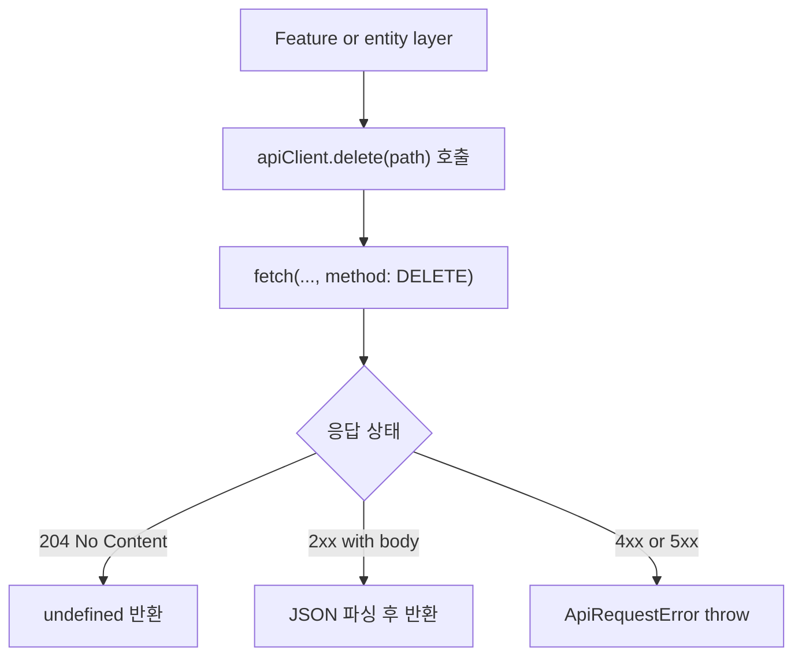

# [FE-0131] 공용 API 클라이언트 DELETE 메서드 추가

> **Backlog**: 프론트엔드 공용 API 클라이언트가 `DELETE` 요청을 지원하지 않아, 삭제/보관 성격의 REST API를 일관된 방식으로 호출하기 어렵다.
> **Bounded Context**: `frontend/shared`
> **Template**: `_TEMPLATE_FE.md`
> **Branch**: `spec/0131`

---

## Goal

프론트엔드 공용 API 클라이언트에 `DELETE` 메서드를 추가해 삭제/보관 성격의 REST API를 `get/post/patch`와 동일한 규칙으로 호출할 수 있게 한다.

---

## User Flow Chart



---

## Design Diff

### As-is vs To-be

| 영역 | As-is | To-be | 변경 내용 |
|------|-------|-------|----------|
| 공용 API 메서드 | `get`, `post`, `patch`만 제공 | `delete` 추가 | REST 삭제/보관 API 공통 지원 |
| 삭제 요청 호출부 | 개별 `fetch` 작성 필요 | `apiClient.delete()` 재사용 | 중복 제거 |
| 204 응답 처리 | 호출부별로 직접 처리 필요 | `handleResponse()` 재사용 | 성공 처리 규칙 일관화 |

---

## Component Tree

```text
shared/api
└─ ApiClient
   ├─ get()
   ├─ post()
   ├─ patch()
   └─ delete()
```

이번 작업은 UI 컴포넌트 추가 없이 `shared` 계층의 공용 인프라만 수정한다.

---

## API Integration

### 대상 호출 패턴

| Method | Path Example | Description |
|--------|--------------|-------------|
| DELETE | `/api/v1/{resource}/{id}` | 리소스 삭제/보관 요청 |

### Client Contract

```typescript
async delete<T>(path: string): Promise<T>
```

- 인증 헤더는 기존 `get/post/patch`와 동일하게 `getHeaders()`를 사용한다.
- 성공 응답 처리는 기존 `handleResponse()`를 그대로 재사용한다.
- `204 No Content`는 `undefined as T`를 반환한다.
- 실패 응답은 기존과 동일하게 `ApiRequestError`를 던진다.

---

## Data Flow

```text
feature/entity hook
  -> shared/api/apiClient.delete(path)
  -> fetch DELETE request
  -> handleResponse()
  -> success value or ApiRequestError
```

---

## 수정 대상 파일

| 파일 | 변경 유형 | 설명 |
|------|----------|------|
| `frontend/src/shared/api/index.ts` | update | `ApiClient.delete()` 메서드 추가 |

이번 스펙 범위에는 특정 도메인 전용 훅/서비스 추가나 UI 연결은 포함하지 않는다.

---

## State Management

별도 상태 관리 변경 없음.

---

## Tests

### Test Strategy

| 구분 | 방법 | 도구 | 비고 |
|------|------|------|------|
| 정적 검토 | 타입 시그니처 확인 | TypeScript | 기존 메서드와 일관성 확인 |
| 수동 테스트 | DELETE API 호출 연결 확인 | 브라우저 DevTools | 204/에러 응답 처리 확인 |

### Test Scenarios

#### Happy Path

| # | 시나리오 | 조작 | 기대 결과 |
|---|---------|------|----------|
| 1 | 204 응답 DELETE 호출 | `apiClient.delete('/workspaces/1')` | 예외 없이 종료, `undefined` 반환 |
| 2 | JSON body를 가진 2xx DELETE 호출 | mock API 연결 | JSON body 반환 |

#### Error & Edge Cases

| # | 시나리오 | 조작 | 기대 결과 |
|---|---------|------|----------|
| 1 | 404 응답 | 존재하지 않는 리소스 삭제 | `ApiRequestError` throw |
| 2 | 403 응답 | 권한 없는 삭제 시도 | `ApiRequestError` throw |
| 3 | 인증 토큰 없음 | 보호된 DELETE 호출 | 기존과 동일한 인증 에러 처리 |

---

## Implementation Example

```typescript
class ApiClient {
  async delete<T>(path: string): Promise<T> {
    const response = await fetch(`${this.baseUrl}${path}`, {
      method: 'DELETE',
      headers: this.getHeaders(),
    });

    return this.handleResponse<T>(response);
  }
}
```

---

## Notes

- `DELETE` 메서드 추가는 특정 도메인 API를 위한 예외 처리나 우회가 아니라, 기존 REST 계약을 프론트 공용 클라이언트가 지원하도록 맞추는 작업이다.
- 공용 API 클라이언트는 `shared` 계층에 위치하므로 특정 도메인 기능에 종속된 로직을 포함하지 않는다.
- 필요 시 후속 구현 브랜치에서 각 feature/entity 레이어가 이 메서드를 사용하도록 연결할 수 있다.

---

## Out of Scope

- 특정 도메인 UI 구현
- TanStack Query mutation 추가
- `put`, `head`, `options` 등 다른 HTTP 메서드 확장
- backend API 계약 변경
