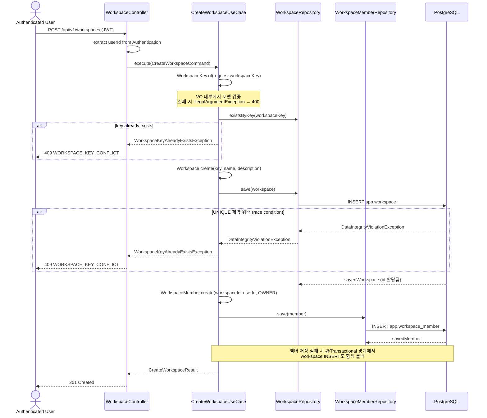
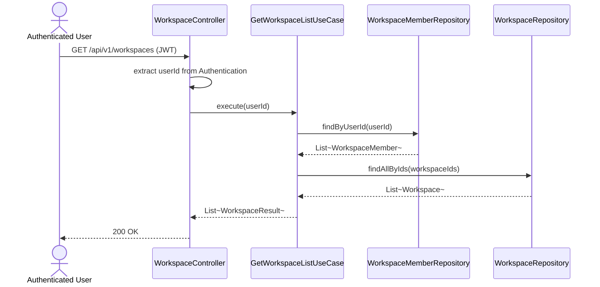
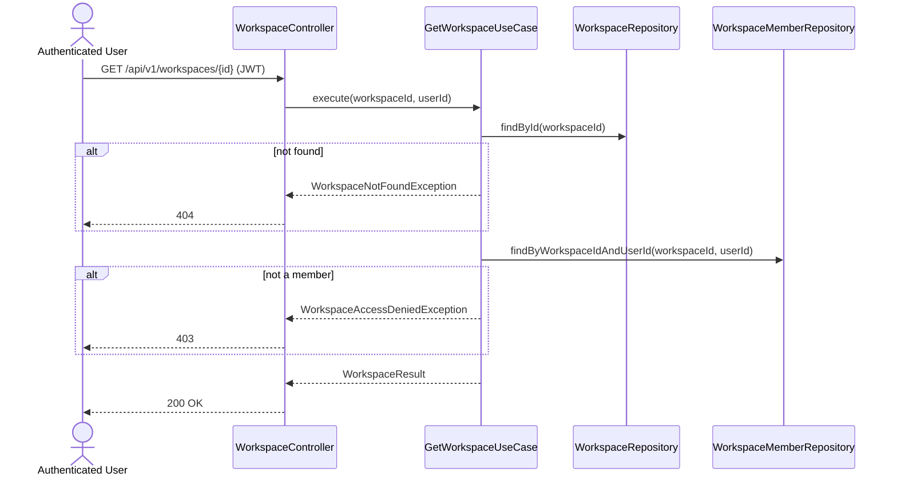
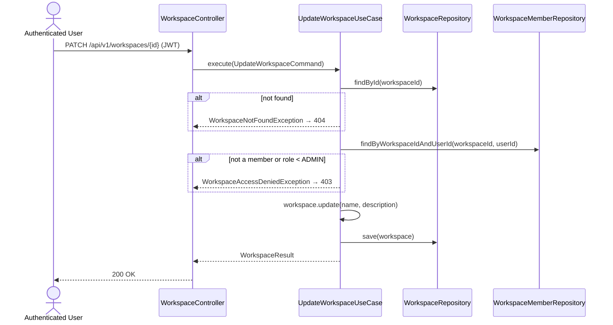
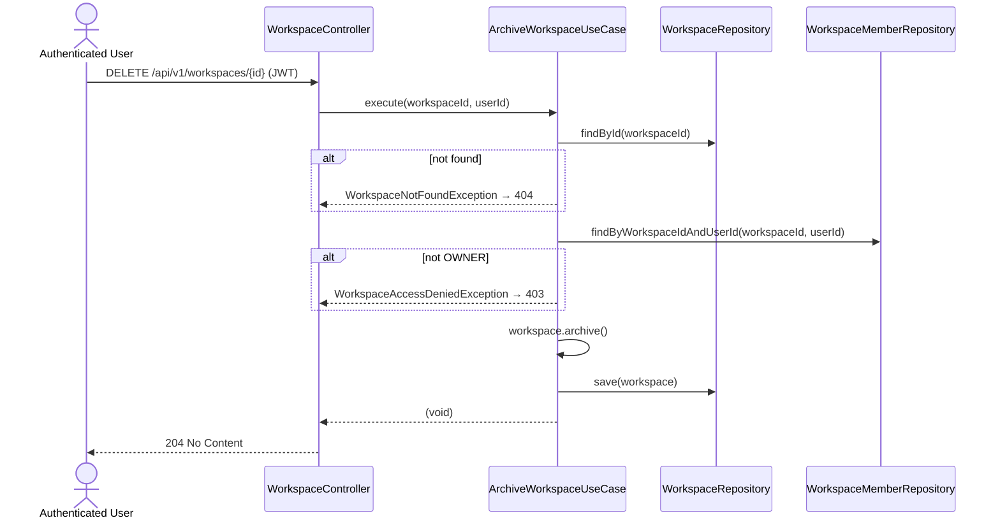

# [BE-022] 워크스페이스 CRUD API

> **Backlog**: 로그인한 사용자가 워크스페이스를 생성·조회·수정·삭제하고 싶다 → 모든 도메인 리소스(corpus, domain pack 등)가 워크스페이스 단위로 격리되므로, 워크스페이스 자체의 기본 CRUD가 필요
> **Bounded Context**: `workspace` (신규)
> **Template**: `_TEMPLATE_BE.md`
> **Branch**: `feature/022-workspace-crud`

---

## Goal

신규 `workspace` bounded context에서 워크스페이스 기본 CRUD를 제공한다.

- **생성**: 워크스페이스를 만들면 **동일 트랜잭션 안**에서 `OWNER` 권한의 `workspace_member`가 자동 등록된다.
- **목록 조회**: 인증된 사용자가 멤버로 속한 워크스페이스 목록을 반환한다.
- **단건 조회**: 멤버인 경우에만 해당 워크스페이스 상세 정보를 반환한다.
- **수정**: `name`과 `description`만 수정 가능하다. `workspace_key`는 불변이다. OWNER 또는 ADMIN만 수정할 수 있다.
- **삭제**: 소프트 삭제(`ARCHIVED` 상태 전환). OWNER만 수행할 수 있다. 다른 테이블이 `workspace_id`를 FK로 참조하므로 하드 삭제는 하지 않는다.

공통 제약:
- `workspace_key` 포맷: `^[a-z0-9]([a-z0-9-]*[a-z0-9])?$`, 3–100자 (`WorkspaceKey` VO 내부 검증)
- 중복 `workspace_key` 방어: `existsByKey` 사전 체크 + `DataIntegrityViolationException` catch (belt-and-suspenders)
- 기존 `corpus`/`domainpack` 모듈의 `WorkspaceRef` / `WorkspaceExistencePort`(authz 전용 read-only 참조)는 건드리지 않는다.

---

## Sequence Diagram



### GET /api/v1/workspaces (목록 조회)



### GET /api/v1/workspaces/{id} (단건 조회)



### PATCH /api/v1/workspaces/{id} (수정)



### DELETE /api/v1/workspaces/{id} (삭제)



---

## REST API

### Endpoint

| Method   | Path                      | Description                      | Auth         |
| -------- | ------------------------- | -------------------------------- | ------------ |
| POST     | `/api/v1/workspaces`      | 새 워크스페이스 생성             | JWT          |
| GET      | `/api/v1/workspaces`      | 내 워크스페이스 목록 조회        | JWT          |
| GET      | `/api/v1/workspaces/{id}` | 워크스페이스 단건 조회           | JWT + 멤버   |
| PATCH    | `/api/v1/workspaces/{id}` | 워크스페이스 수정 (name/desc)    | JWT + OWNER/ADMIN |
| DELETE   | `/api/v1/workspaces/{id}` | 워크스페이스 삭제 (소프트)       | JWT + OWNER  |

### Request

**POST `/api/v1/workspaces`**

```json
{
  "workspaceKey": "cs-team-alpha",
  "name": "CS Team Alpha",
  "description": "고객지원팀 알파 워크스페이스"
}
```

#### Request Body 제약

| Field          | Type    | Required | 제약                                                       |
| -------------- | ------- | -------- | ---------------------------------------------------------- |
| `workspaceKey` | string  | ✅       | 3–100자, `^[a-z0-9]([a-z0-9-]*[a-z0-9])?$` (`WorkspaceKey` VO 내부 검증) |
| `name`         | string  | ✅       | 1–255자, blank 금지                                        |
| `description`  | string? | ❌       | 최대 2000자                                                |

Bean Validation(`@Valid`)은 `name` blank 검증과 길이 검증을 담당하고, `workspaceKey`의 포맷 검증은 도메인 VO `WorkspaceKey.of(...)`에서 처리한다.

### Response

**201 Created**

```json
{
  "id": 42,
  "workspaceKey": "cs-team-alpha",
  "name": "CS Team Alpha",
  "description": "고객지원팀 알파 워크스페이스",
  "status": "ACTIVE",
  "ownerId": 7,
  "ownerRole": "OWNER",
  "createdAt": "2026-04-13T10:00:00Z"
}
```

**400 Bad Request** — `@Valid` 실패 (name blank / length 초과)

```json
{
  "code": "VALIDATION_ERROR",
  "errors": ["name must not be blank"]
}
```

**400 Bad Request** — `WorkspaceKey` 포맷 위반 (`IllegalArgumentException` → `BadRequestException` 래핑)

```json
{
  "code": "WORKSPACE_INVALID_KEY",
  "message": "workspaceKey 형식이 올바르지 않습니다."
}
```

**401 Unauthorized** — JWT 누락/만료

```json
{
  "code": "UNAUTHORIZED",
  "message": "인증이 필요합니다."
}
```

**409 Conflict** — `workspace_key` 중복

```json
{
  "code": "WORKSPACE_KEY_CONFLICT",
  "message": "이미 사용 중인 워크스페이스 키입니다."
}
```

### GET /api/v1/workspaces

**200 OK**

```json
[
  {
    "id": 42,
    "workspaceKey": "cs-team-alpha",
    "name": "CS Team Alpha",
    "description": "고객지원팀 알파 워크스페이스",
    "status": "ACTIVE",
    "myRole": "OWNER",
    "createdAt": "2026-04-13T10:00:00Z",
    "updatedAt": "2026-04-13T10:00:00Z"
  }
]
```

> 멤버로 속한 워크스페이스가 없으면 빈 배열 `[]` 반환.

### GET /api/v1/workspaces/{id}

**200 OK**

```json
{
  "id": 42,
  "workspaceKey": "cs-team-alpha",
  "name": "CS Team Alpha",
  "description": "고객지원팀 알파 워크스페이스",
  "status": "ACTIVE",
  "myRole": "OWNER",
  "createdAt": "2026-04-13T10:00:00Z",
  "updatedAt": "2026-04-13T10:00:00Z"
}
```

**403 Forbidden** — 멤버가 아닌 경우

```json
{
  "code": "WORKSPACE_ACCESS_DENIED",
  "message": "워크스페이스에 접근 권한이 없습니다."
}
```

**404 Not Found** — 존재하지 않는 워크스페이스

```json
{
  "code": "WORKSPACE_NOT_FOUND",
  "message": "워크스페이스를 찾을 수 없습니다."
}
```

### PATCH /api/v1/workspaces/{id}

**Request** — 두 필드 모두 선택. **전달된 필드만 수정** (absent 필드는 기존 값 유지).

```json
{
  "name": "CS Team Alpha v2",
  "description": "업데이트된 설명"
}
```

| Field         | Type    | Required | 제약                                         |
| ------------- | ------- | -------- | -------------------------------------------- |
| `name`        | string? | ❌       | 전달 시 1–255자, blank/공백만 금지           |
| `description` | string? | ❌       | 전달 시 최대 2000자, null 허용(설명 제거)    |

> `UpdateWorkspaceRequest`는 두 필드를 `JsonNullable<String>`(`org.openapitools:jackson-databind-nullable`)으로 선언한다.
> - **absent** → `JsonNullable.undefined()` (`isPresent() = false`) → UseCase에서 현재 값 유지
> - **present + non-null** → `JsonNullable.of("value")` → 해당 값으로 변경
> - **present + null** (`"description": null`) → `JsonNullable.of(null)` → description 제거(null 저장)
> - `name`에 null 명시 전달 시 → `WorkspaceInvalidNameException`(400)
>
> Jackson 설정: `objectMapper.registerModule(new JsonNullableModule())`. `@JsonSetter(nulls = Nulls.AS_EMPTY)` 사용 금지 (null/absent 구분이 깨짐).
> blank-only `name`은 도메인 `Workspace.update()`에서 `IllegalArgumentException` → UseCase가 `WorkspaceInvalidNameException`(400)으로 변환.

**200 OK** — 수정된 워크스페이스 반환 (GET 단건 응답과 동일 형태)

**403 Forbidden** — 멤버가 아니거나 role < ADMIN

**404 Not Found** — 존재하지 않는 워크스페이스

### DELETE /api/v1/workspaces/{id}

**204 No Content** — 소프트 삭제 성공 (응답 바디 없음)

**403 Forbidden** — OWNER가 아닌 경우

**404 Not Found** — 존재하지 않는 워크스페이스

---

## Class Design

### DDD Layered Structure

```mermaid
classDiagram
    class WorkspaceController {
        +createWorkspace(CreateWorkspaceRequest, Authentication) ResponseEntity
        +listWorkspaces(Authentication) ResponseEntity
        +getWorkspace(Long id, Authentication) ResponseEntity
        +updateWorkspace(Long id, UpdateWorkspaceRequest, Authentication) ResponseEntity
        +archiveWorkspace(Long id, Authentication) ResponseEntity
    }

    class CreateWorkspaceUseCase {
        +execute(CreateWorkspaceCommand) WorkspaceResult
    }
    class GetWorkspaceListUseCase {
        +execute(Long userId) List~WorkspaceResult~
    }
    class GetWorkspaceUseCase {
        +execute(Long workspaceId, Long userId) WorkspaceResult
    }
    class UpdateWorkspaceUseCase {
        +execute(UpdateWorkspaceCommand) WorkspaceResult
    }
    class ArchiveWorkspaceUseCase {
        +execute(Long workspaceId, Long userId) void
    }

    class Workspace {
        +create(WorkspaceKey, String, String)$ Workspace
        +update(String name, String description) void
        +archive() void
    }

    class WorkspaceRepository {
        <<interface>>
        +existsByKey(WorkspaceKey) boolean
        +save(Workspace) Workspace
        +findById(Long) Optional~Workspace~
        +findAllByIds(Collection~Long~) List~Workspace~
    }

    class WorkspaceMemberRepository {
        <<interface>>
        +save(WorkspaceMember) WorkspaceMember
        +findByUserId(Long) List~WorkspaceMember~
        +findByWorkspaceIdAndUserId(Long, Long) Optional~WorkspaceMember~
    }

    class WorkspaceKeyAlreadyExistsException { <<extends DuplicateException>> }
    class WorkspaceInvalidKeyException { <<extends BadRequestException>> }
    class WorkspaceInvalidNameException { <<extends BadRequestException>> }
    class WorkspaceNotFoundException { <<extends NotFoundException>> }
    class WorkspaceAccessDeniedException { <<extends UnauthorizedException>> }

    WorkspaceController --> CreateWorkspaceUseCase
    WorkspaceController --> GetWorkspaceListUseCase
    WorkspaceController --> GetWorkspaceUseCase
    WorkspaceController --> UpdateWorkspaceUseCase
    WorkspaceController --> ArchiveWorkspaceUseCase
    WorkspaceRepository <|.. JpaWorkspaceRepository
    WorkspaceMemberRepository <|.. JpaWorkspaceMemberRepository
```



### 디렉토리 구조 (신규 모듈)

```text
backend/src/main/java/com/init/workspace/
├── presentation/
│   ├── WorkspaceController.java
│   ├── dto/
│   │   ├── CreateWorkspaceRequest.java    (record, @Valid)
│   │   ├── UpdateWorkspaceRequest.java    (record, 두 필드 모두 nullable)
│   │   └── WorkspaceResponse.java         (record, 모든 조회/생성/수정 응답 공용)
│   └── package-info.java
├── application/
│   ├── CreateWorkspaceUseCase.java        (@Service @Transactional(readOnly=true))
│   ├── GetWorkspaceListUseCase.java       (@Service @Transactional(readOnly=true))
│   ├── GetWorkspaceUseCase.java           (@Service @Transactional(readOnly=true))
│   ├── UpdateWorkspaceUseCase.java        (@Service @Transactional(readOnly=true))
│   ├── ArchiveWorkspaceUseCase.java       (@Service @Transactional(readOnly=true))
│   ├── CreateWorkspaceCommand.java        (record)
│   ├── UpdateWorkspaceCommand.java        (record)
│   ├── WorkspaceResult.java               (record, 공용 결과 — myRole 포함)
│   ├── exception/
│   │   ├── WorkspaceKeyAlreadyExistsException.java  (extends DuplicateException)
│   │   ├── WorkspaceInvalidKeyException.java        (extends BadRequestException)
│   │   ├── WorkspaceInvalidNameException.java       (extends BadRequestException)
│   │   ├── WorkspaceNotFoundException.java          (extends NotFoundException)
│   │   └── WorkspaceAccessDeniedException.java      (extends UnauthorizedException)
│   └── package-info.java
├── domain/
│   ├── model/
│   │   ├── Workspace.java                 (@Entity, Aggregate Root)
│   │   ├── WorkspaceKey.java              (@Embeddable Value Object)
│   │   ├── WorkspaceStatus.java           (enum: ACTIVE, ARCHIVED)
│   │   ├── WorkspaceMember.java           (@Entity)
│   │   └── WorkspaceMemberRole.java       (enum: OWNER, ADMIN, REVIEWER, OPERATOR)
│   ├── repository/
│   │   ├── WorkspaceRepository.java       (interface, JPA 의존성 없음)
│   │   └── WorkspaceMemberRepository.java (interface)
│   └── package-info.java
└── infrastructure/
    └── persistence/
        ├── JpaWorkspaceRepository.java
        ├── JpaWorkspaceMemberRepository.java
        └── package-info.java
```

> 기존 `corpus`/`domainpack` 모듈의 `WorkspaceRef` / `WorkspaceExistencePort` / `WorkspaceMembershipPort`는 **인가(authz) 전용 read-only 참조 객체**로 남기고, 새 `workspace` 모듈이 aggregate root `Workspace`를 독점 소유한다. 이 PR에서는 기존 ref/port를 건드리지 않는다.

### Aggregate Design

```java
// Aggregate Root
@Entity
@Table(name = "workspace", schema = "app")
public class Workspace {

  @Id
  @GeneratedValue(strategy = GenerationType.IDENTITY)
  private Long id;

  @Embedded
  private WorkspaceKey workspaceKey;

  @Column(nullable = false)
  private String name;

  @Column
  private String description;

  @Enumerated(EnumType.STRING)
  @Column(nullable = false)
  private WorkspaceStatus status;

  @Column(name = "created_at", nullable = false, updatable = false)
  private OffsetDateTime createdAt;

  @Column(name = "updated_at", nullable = false)
  private OffsetDateTime updatedAt;

  protected Workspace() {}

  public static Workspace create(WorkspaceKey workspaceKey, String name, String description) {
    if (workspaceKey == null) {
      throw new IllegalArgumentException("workspaceKey must not be null");
    }
    if (name == null || name.isBlank()) {
      throw new IllegalArgumentException("name must not be null or blank");
    }
    if (name.length() > 255) {
      throw new IllegalArgumentException("name must not exceed 255 characters");
    }
    if (description != null && description.length() > 2000) {
      throw new IllegalArgumentException("description must not exceed 2000 characters");
    }
    Workspace workspace = new Workspace();
    workspace.workspaceKey = workspaceKey;
    workspace.name = name;
    workspace.description = description;
    workspace.status = WorkspaceStatus.ACTIVE;
    return workspace;
  }

  @PrePersist
  protected void onPersist() {
    OffsetDateTime now = OffsetDateTime.now();
    this.createdAt = now;
    this.updatedAt = now;
  }

  @PreUpdate
  protected void onUpdate() {
    this.updatedAt = OffsetDateTime.now();
  }

  public void archive() {
    if (this.status == WorkspaceStatus.ARCHIVED) {
      throw new IllegalStateException("이미 보관된 워크스페이스입니다.");
    }
    this.status = WorkspaceStatus.ARCHIVED;
  }

  // getters (no public setters)
}
```

### Domain Methods (추가)

```java
// Workspace — update() 도메인 메서드 추가
// UpdateWorkspaceUseCase 계약: absent name → workspace.getName()로 대체, null 명시 → 즉시 400
// 따라서 이 메서드 호출 시 name은 항상 non-null이다. null 전달은 계약 위반.
public void update(String name, String description) {
  if (name == null || name.isBlank()) {
    throw new IllegalArgumentException("name must not be null or blank");
  }
  if (name.length() > 255) {
    throw new IllegalArgumentException("name must not exceed 255 characters");
  }
  this.name = name;

  if (description != null && description.length() > 2000) {
    throw new IllegalArgumentException("description must not exceed 2000 characters");
  }
  this.description = description;  // null 전달 시 설명 제거 허용
}
```

### Repository Interfaces

```java
// WorkspaceRepository
public interface WorkspaceRepository {
  boolean existsByKey(WorkspaceKey workspaceKey);
  Workspace save(Workspace workspace);
  Optional<Workspace> findById(Long id);
  List<Workspace> findAllByIds(Collection<Long> ids);
}

// WorkspaceMemberRepository
public interface WorkspaceMemberRepository {
  WorkspaceMember save(WorkspaceMember member);
  List<WorkspaceMember> findByUserId(Long userId);
  Optional<WorkspaceMember> findByWorkspaceIdAndUserId(Long workspaceId, Long userId);
}
```

### Value Object

```java
@Embeddable
public class WorkspaceKey {

  private static final int MIN_LENGTH = 3;
  private static final int MAX_LENGTH = 100;
  private static final Pattern PATTERN =
      Pattern.compile("^[a-z0-9]([a-z0-9-]*[a-z0-9])?$");

  @Column(name = "workspace_key", nullable = false, unique = true, length = 100)
  private String value;

  protected WorkspaceKey() {}

  private WorkspaceKey(String value) {
    validate(value);
    this.value = value;
  }

  public static WorkspaceKey of(String value) {
    return new WorkspaceKey(value);
  }

  private void validate(String value) {
    if (value == null || value.isBlank()) {
      throw new IllegalArgumentException("workspaceKey must not be null or blank");
    }
    if (value.length() < MIN_LENGTH || value.length() > MAX_LENGTH) {
      throw new IllegalArgumentException(
          "workspaceKey length must be between " + MIN_LENGTH + " and " + MAX_LENGTH);
    }
    if (!PATTERN.matcher(value).matches()) {
      throw new IllegalArgumentException(
          "workspaceKey must match pattern " + PATTERN.pattern());
    }
  }

  public String getValue() {
    return value;
  }

  // equals / hashCode
}
```

### WorkspaceMember Entity

```java
@Entity
@Table(name = "workspace_member", schema = "app")
public class WorkspaceMember {

  @Id
  @GeneratedValue(strategy = GenerationType.IDENTITY)
  private Long id;

  @Column(name = "workspace_id", nullable = false)
  private Long workspaceId;

  @Column(name = "user_id", nullable = false)
  private Long userId;

  @Enumerated(EnumType.STRING)
  @Column(name = "member_role", nullable = false)
  private WorkspaceMemberRole memberRole;

  @Column(name = "joined_at", nullable = false, updatable = false)
  private OffsetDateTime joinedAt;

  protected WorkspaceMember() {}

  public static WorkspaceMember create(
      Long workspaceId, Long userId, WorkspaceMemberRole memberRole) {
    if (workspaceId == null) {
      throw new IllegalArgumentException("workspaceId must not be null");
    }
    if (userId == null) {
      throw new IllegalArgumentException("userId must not be null");
    }
    if (memberRole == null) {
      throw new IllegalArgumentException("memberRole must not be null");
    }
    WorkspaceMember member = new WorkspaceMember();
    member.workspaceId = workspaceId;
    member.userId = userId;
    member.memberRole = memberRole;
    return member;
  }

  @PrePersist
  protected void onPersist() {
    this.joinedAt = OffsetDateTime.now();
  }

  // getters (no public setters)
}
```

### Application Service

```java
@Service
@Transactional(readOnly = true)
public class CreateWorkspaceUseCase {

  private final WorkspaceRepository workspaceRepository;
  private final WorkspaceMemberRepository workspaceMemberRepository;

  public CreateWorkspaceUseCase(
      WorkspaceRepository workspaceRepository,
      WorkspaceMemberRepository workspaceMemberRepository) {
    this.workspaceRepository = workspaceRepository;
    this.workspaceMemberRepository = workspaceMemberRepository;
  }

  @Transactional
  public WorkspaceResult execute(CreateWorkspaceCommand command) {
    WorkspaceKey key;
    try {
      key = WorkspaceKey.of(command.workspaceKey());
    } catch (IllegalArgumentException ex) {
      throw new WorkspaceInvalidKeyException("workspaceKey 형식이 올바르지 않습니다.");
    }

    if (workspaceRepository.existsByKey(key)) {
      throw new WorkspaceKeyAlreadyExistsException("이미 사용 중인 워크스페이스 키입니다.");
    }

    Workspace workspace = Workspace.create(key, command.name(), command.description());
    Workspace saved;
    try {
      saved = workspaceRepository.save(workspace);
    } catch (DataIntegrityViolationException ex) {
      if (isWorkspaceKeyConstraintViolation(ex)) {
        throw new WorkspaceKeyAlreadyExistsException("이미 사용 중인 워크스페이스 키입니다.");
      }
      throw ex;
    }

    WorkspaceMember owner =
        WorkspaceMember.create(saved.getId(), command.ownerUserId(), WorkspaceMemberRole.OWNER);
    WorkspaceMember savedMember = workspaceMemberRepository.save(owner);

    return WorkspaceResult.from(saved, savedMember);
  }

  private boolean isWorkspaceKeyConstraintViolation(DataIntegrityViolationException ex) {
    // 1차: Hibernate ConstraintViolationException의 constraintName으로 판별
    // PostgreSQL inline UNIQUE 제약의 자동 생성 이름: "workspace_workspace_key_key"
    Throwable cause = ex.getCause();
    if (cause instanceof org.hibernate.exception.ConstraintViolationException hcve) {
      String constraintName = hcve.getConstraintName();
      return constraintName != null && constraintName.contains("workspace_key");
    }
    // 2차 fallback: cause가 Hibernate ConstraintViolationException이 아닌 경우
    Throwable root = ex.getMostSpecificCause();
    String msg = (root != null) ? root.getMessage() : null;
    return msg != null && msg.contains("workspace_key");
  }
}

@Service
@Transactional(readOnly = true)
public class GetWorkspaceListUseCase {

  private final WorkspaceMemberRepository workspaceMemberRepository;
  private final WorkspaceRepository workspaceRepository;

  public GetWorkspaceListUseCase(
      WorkspaceMemberRepository workspaceMemberRepository,
      WorkspaceRepository workspaceRepository) {
    this.workspaceMemberRepository = workspaceMemberRepository;
    this.workspaceRepository = workspaceRepository;
  }

  public List<WorkspaceResult> execute(Long userId) {
    List<WorkspaceMember> memberships = workspaceMemberRepository.findByUserId(userId);
    if (memberships.isEmpty()) {
      return List.of();
    }
    List<Long> workspaceIds = memberships.stream().map(WorkspaceMember::getWorkspaceId).toList();
    List<Workspace> workspaces = workspaceRepository.findAllByIds(workspaceIds);

    Map<Long, WorkspaceMember> memberByWorkspaceId =
        memberships.stream()
            .collect(Collectors.toMap(WorkspaceMember::getWorkspaceId, m -> m));

    return workspaces.stream()
        .map(ws -> WorkspaceResult.from(ws, memberByWorkspaceId.get(ws.getId())))
        .toList();
  }
}

@Service
@Transactional(readOnly = true)
public class GetWorkspaceUseCase {

  private final WorkspaceRepository workspaceRepository;
  private final WorkspaceMemberRepository workspaceMemberRepository;

  public GetWorkspaceUseCase(
      WorkspaceRepository workspaceRepository,
      WorkspaceMemberRepository workspaceMemberRepository) {
    this.workspaceRepository = workspaceRepository;
    this.workspaceMemberRepository = workspaceMemberRepository;
  }

  public WorkspaceResult execute(Long workspaceId, Long userId) {
    Workspace workspace =
        workspaceRepository
            .findById(workspaceId)
            .orElseThrow(() -> new WorkspaceNotFoundException("워크스페이스를 찾을 수 없습니다."));

    WorkspaceMember member =
        workspaceMemberRepository
            .findByWorkspaceIdAndUserId(workspaceId, userId)
            .orElseThrow(
                () -> new WorkspaceAccessDeniedException("워크스페이스에 접근 권한이 없습니다."));

    return WorkspaceResult.from(workspace, member);
  }
}

@Service
@Transactional(readOnly = true)
public class UpdateWorkspaceUseCase {

  private final WorkspaceRepository workspaceRepository;
  private final WorkspaceMemberRepository workspaceMemberRepository;

  public UpdateWorkspaceUseCase(
      WorkspaceRepository workspaceRepository,
      WorkspaceMemberRepository workspaceMemberRepository) {
    this.workspaceRepository = workspaceRepository;
    this.workspaceMemberRepository = workspaceMemberRepository;
  }

  @Transactional
  public WorkspaceResult execute(UpdateWorkspaceCommand command) {
    Workspace workspace =
        workspaceRepository
            .findById(command.workspaceId())
            .orElseThrow(() -> new WorkspaceNotFoundException("워크스페이스를 찾을 수 없습니다."));

    WorkspaceMember member =
        workspaceMemberRepository
            .findByWorkspaceIdAndUserId(command.workspaceId(), command.userId())
            .orElseThrow(
                () -> new WorkspaceAccessDeniedException("워크스페이스에 접근 권한이 없습니다."));

    // OWNER 또는 ADMIN만 수정 가능
    if (member.getMemberRole() != WorkspaceMemberRole.OWNER
        && member.getMemberRole() != WorkspaceMemberRole.ADMIN) {
      throw new WorkspaceAccessDeniedException("워크스페이스에 접근 권한이 없습니다.");
    }

    // JsonNullable 3-state handling:
    //   undefined() → keep current  |  of(null) → clear  |  of(value) → update
    String newName;
    if (!command.name().isPresent()) {
      newName = workspace.getName();                   // absent → keep
    } else if (command.name().get() == null) {
      throw new WorkspaceInvalidNameException("name must not be null"); // null 명시 전달 → 400
    } else {
      newName = command.name().get();                  // present + non-null → update
    }

    String newDescription;
    if (!command.description().isPresent()) {
      newDescription = workspace.getDescription();     // absent → keep
    } else {
      newDescription = command.description().get();    // present + null → clear, + value → update
    }

    try {
      workspace.update(newName, newDescription);
    } catch (IllegalArgumentException ex) {
      throw new WorkspaceInvalidNameException(ex.getMessage());
    }

    Workspace saved = workspaceRepository.save(workspace);
    return WorkspaceResult.from(saved, member);
  }
}

@Service
@Transactional(readOnly = true)
public class ArchiveWorkspaceUseCase {

  private final WorkspaceRepository workspaceRepository;
  private final WorkspaceMemberRepository workspaceMemberRepository;

  public ArchiveWorkspaceUseCase(
      WorkspaceRepository workspaceRepository,
      WorkspaceMemberRepository workspaceMemberRepository) {
    this.workspaceRepository = workspaceRepository;
    this.workspaceMemberRepository = workspaceMemberRepository;
  }

  @Transactional
  public void execute(Long workspaceId, Long userId) {
    Workspace workspace =
        workspaceRepository
            .findById(workspaceId)
            .orElseThrow(() -> new WorkspaceNotFoundException("워크스페이스를 찾을 수 없습니다."));

    WorkspaceMember member =
        workspaceMemberRepository
            .findByWorkspaceIdAndUserId(workspaceId, userId)
            .orElseThrow(
                () -> new WorkspaceAccessDeniedException("워크스페이스에 접근 권한이 없습니다."));

    // OWNER만 삭제(소프트) 가능
    if (member.getMemberRole() != WorkspaceMemberRole.OWNER) {
      throw new WorkspaceAccessDeniedException("워크스페이스에 접근 권한이 없습니다.");
    }

    workspace.archive();
    workspaceRepository.save(workspace);
  }
}
```

### Exception 매핑

| Exception                              | 상속                         | HTTP | Code                       |
| --------------------------------------- | ---------------------------- | ---- | -------------------------- |
| `WorkspaceInvalidKeyException`          | `BadRequestException`        | 400  | `WORKSPACE_INVALID_KEY`    |
| `WorkspaceInvalidNameException`         | `BadRequestException`        | 400  | `WORKSPACE_INVALID_NAME`   |
| `WorkspaceKeyAlreadyExistsException`    | `DuplicateException`         | 409  | `WORKSPACE_KEY_CONFLICT`   |
| `WorkspaceNotFoundException`            | `NotFoundException`          | 404  | `WORKSPACE_NOT_FOUND`      |
| `WorkspaceAccessDeniedException`        | `UnauthorizedException`      | 403  | `WORKSPACE_ACCESS_DENIED`  |
| `MethodArgumentNotValidException`       | (Spring)                     | 400  | `VALIDATION_ERROR`         |
| `AuthenticationCredentialsNotFoundException` | (Spring Security)       | 401  | `UNAUTHORIZED`             |

`com.init.shared.presentation.GlobalExceptionHandler`는 이미 `BadRequestException`, `DuplicateException`, `NotFoundException`, `UnauthorizedException`, `MethodArgumentNotValidException`, `AuthenticationCredentialsNotFoundException`에 대한 핸들러를 보유하고 있으므로 **신규 핸들러 추가는 필요 없다**. 신규 예외 클래스가 각 base를 상속하기만 하면 `GlobalExceptionHandler`가 `ex.getCode()`를 통해 각 예외에 지정한 code 문자열을 그대로 응답에 반영한다.

```java
// 예외 클래스 구현 예시 (동일 패턴)
public class WorkspaceNotFoundException extends NotFoundException {
  public WorkspaceNotFoundException(String message) {
    super("WORKSPACE_NOT_FOUND", message);
  }
}

public class WorkspaceAccessDeniedException extends UnauthorizedException {
  public WorkspaceAccessDeniedException(String message) {
    super("WORKSPACE_ACCESS_DENIED", message);
  }
}

public class WorkspaceInvalidNameException extends BadRequestException {
  public WorkspaceInvalidNameException(String message) {
    super("WORKSPACE_INVALID_NAME", message);
  }
}
```

### Controller

```java
@RestController
@RequestMapping("/api/v1/workspaces")
public class WorkspaceController {

  private final CreateWorkspaceUseCase createWorkspaceUseCase;
  private final GetWorkspaceListUseCase getWorkspaceListUseCase;
  private final GetWorkspaceUseCase getWorkspaceUseCase;
  private final UpdateWorkspaceUseCase updateWorkspaceUseCase;
  private final ArchiveWorkspaceUseCase archiveWorkspaceUseCase;

  public WorkspaceController(
      CreateWorkspaceUseCase createWorkspaceUseCase,
      GetWorkspaceListUseCase getWorkspaceListUseCase,
      GetWorkspaceUseCase getWorkspaceUseCase,
      UpdateWorkspaceUseCase updateWorkspaceUseCase,
      ArchiveWorkspaceUseCase archiveWorkspaceUseCase) {
    this.createWorkspaceUseCase = createWorkspaceUseCase;
    this.getWorkspaceListUseCase = getWorkspaceListUseCase;
    this.getWorkspaceUseCase = getWorkspaceUseCase;
    this.updateWorkspaceUseCase = updateWorkspaceUseCase;
    this.archiveWorkspaceUseCase = archiveWorkspaceUseCase;
  }

  @PostMapping
  public ResponseEntity<WorkspaceResponse> createWorkspace(
      @Valid @RequestBody CreateWorkspaceRequest request, Authentication authentication) {
    Long userId = extractUserId(authentication);
    WorkspaceResult result =
        createWorkspaceUseCase.execute(
            new CreateWorkspaceCommand(
                request.workspaceKey(), request.name(), request.description(), userId));
    return ResponseEntity.status(HttpStatus.CREATED).body(WorkspaceResponse.from(result));
  }

  @GetMapping
  public ResponseEntity<List<WorkspaceResponse>> listWorkspaces(Authentication authentication) {
    Long userId = extractUserId(authentication);
    List<WorkspaceResult> results = getWorkspaceListUseCase.execute(userId);
    return ResponseEntity.ok(results.stream().map(WorkspaceResponse::from).toList());
  }

  @GetMapping("/{id}")
  public ResponseEntity<WorkspaceResponse> getWorkspace(
      @PathVariable Long id, Authentication authentication) {
    Long userId = extractUserId(authentication);
    WorkspaceResult result = getWorkspaceUseCase.execute(id, userId);
    return ResponseEntity.ok(WorkspaceResponse.from(result));
  }

  @PatchMapping("/{id}")
  public ResponseEntity<WorkspaceResponse> updateWorkspace(
      @PathVariable Long id,
      @Valid @RequestBody UpdateWorkspaceRequest request,
      Authentication authentication) {
    Long userId = extractUserId(authentication);
    WorkspaceResult result =
        updateWorkspaceUseCase.execute(
            new UpdateWorkspaceCommand(id, userId, request.name(), request.description()));
    return ResponseEntity.ok(WorkspaceResponse.from(result));
  }
  // UpdateWorkspaceRequest.name/description 은 JsonNullable<String>이므로
  // absent → JsonNullable.undefined() → UseCase에서 현재 값 유지
  // present+null → JsonNullable.of(null) → description 제거 / name은 400
  // present+value → JsonNullable.of("value") → 변경

  @DeleteMapping("/{id}")
  public ResponseEntity<Void> archiveWorkspace(
      @PathVariable Long id, Authentication authentication) {
    Long userId = extractUserId(authentication);
    archiveWorkspaceUseCase.execute(id, userId);
    return ResponseEntity.noContent().build();
  }

  private Long extractUserId(Authentication authentication) {
    if (authentication == null || !(authentication.getPrincipal() instanceof Long userId)) {
      throw new AuthenticationCredentialsNotFoundException("인증이 필요합니다.");
    }
    return userId;
  }
  // JwtAuthenticationFilter는 principal을 Long(userId)으로 세팅하므로 (JwtAuthenticationFilter.java:52)
  // getName() + parseLong() 대신 getPrincipal()을 Long으로 직접 캐스팅한다.
}
```

> `JwtAuthenticationFilter`(line 52)는 `principal`을 `Long userId`로 세팅한다. `authentication.getPrincipal() instanceof Long userId` 패턴 매칭으로 캐스팅하면 `NumberFormatException` 가능성이 완전히 제거된다.

### DTO (Presentation)

```java
// 생성 요청
public record CreateWorkspaceRequest(
    String workspaceKey,
    @NotBlank @Size(max = 255) String name,
    @Size(max = 2000) String description) {}

// 수정 요청 — 두 필드 모두 선택, 전달된 필드만 수정
// JsonNullable.undefined() = absent (변경 없음)
// JsonNullable.of("value") = 명시적 전달 (변경)
// JsonNullable.of(null) = null 명시 전달 (description 제거)
// 의존성: org.openapitools:jackson-databind-nullable (build.gradle.kts에 추가 필요)
// Jackson: ObjectMapper에 new JsonNullableModule() 등록
// Bean Validation은 JsonNullable 내부 타입을 언래핑하지 않으므로 @Size 등 내부 어노테이션이
// 실행되지 않는다. 길이·blank 검증은 도메인 레이어(Workspace.update())에서 수행하며,
// IllegalArgumentException → WorkspaceInvalidNameException(400) 변환은 UseCase가 담당한다.
public record UpdateWorkspaceRequest(
    JsonNullable<String> name,        // 전달 시 max 255자, blank 금지 — 도메인 검증
    JsonNullable<String> description) { // 전달 시 max 2000자 — 도메인 검증

  public UpdateWorkspaceRequest {
    name = (name != null) ? name : JsonNullable.undefined();
    description = (description != null) ? description : JsonNullable.undefined();
  }
}

// 모든 조회/생성/수정 응답 공용 (생성 시에도 myRole = "OWNER")
public record WorkspaceResponse(
    Long id,
    String workspaceKey,
    String name,
    String description,
    String status,
    String myRole,
    OffsetDateTime createdAt,
    OffsetDateTime updatedAt) {

  public static WorkspaceResponse from(WorkspaceResult result) {
    return new WorkspaceResponse(
        result.workspaceId(),
        result.workspaceKey(),
        result.name(),
        result.description(),
        result.status(),
        result.myRole(),
        result.createdAt(),
        result.updatedAt());
  }
}
```

### Command / Result Records (Application)

```java
// 생성 커맨드
public record CreateWorkspaceCommand(
    String workspaceKey,
    String name,
    String description,
    Long ownerUserId) {
  public CreateWorkspaceCommand {
    Objects.requireNonNull(workspaceKey, "workspaceKey must not be null");
    Objects.requireNonNull(name, "name must not be null");
    Objects.requireNonNull(ownerUserId, "ownerUserId must not be null");
  }
}

// 수정 커맨드 — JsonNullable.undefined() = 미전달(변경 없음), JsonNullable.of(v) = 명시적 전달
public record UpdateWorkspaceCommand(
    Long workspaceId,
    Long userId,
    JsonNullable<String> name,
    JsonNullable<String> description) {
  public UpdateWorkspaceCommand {
    Objects.requireNonNull(workspaceId, "workspaceId must not be null");
    Objects.requireNonNull(userId, "userId must not be null");
    Objects.requireNonNull(name, "name must not be null");
    Objects.requireNonNull(description, "description must not be null");
  }
}

// 공용 결과 레코드 (생성/조회/수정 모두 사용)
public record WorkspaceResult(
    Long workspaceId,
    String workspaceKey,
    String name,
    String description,
    String status,
    String myRole,
    OffsetDateTime createdAt,
    OffsetDateTime updatedAt) {

  public static WorkspaceResult from(Workspace workspace, WorkspaceMember member) {
    return new WorkspaceResult(
        workspace.getId(),
        workspace.getWorkspaceKey().getValue(),
        workspace.getName(),
        workspace.getDescription(),
        workspace.getStatus().name(),
        member.getMemberRole().name(),
        workspace.getCreatedAt(),
        workspace.getUpdatedAt());
  }
}
```

---

## Tests

### Unit Tests

**`WorkspaceKeyTest`** — 순수 VO 단위

- `should_생성성공_when_유효한_소문자숫자하이픈` — `"cs-team-alpha"`, `"ws1"`, `"a-b-c-1"` 정상 생성
- `should_IllegalArgumentException_when_null` — `WorkspaceKey.of(null)`
- `should_IllegalArgumentException_when_blank` — `""`, `" "`
- `should_IllegalArgumentException_when_길이_2이하` — `"ab"`
- `should_IllegalArgumentException_when_길이_100초과` — 101자
- `should_IllegalArgumentException_when_대문자포함` — `"CS-team"`
- `should_IllegalArgumentException_when_언더스코어포함` — `"cs_team"`
- `should_IllegalArgumentException_when_하이픈으로시작` — `"-cs"`
- `should_IllegalArgumentException_when_하이픈으로끝` — `"cs-"`

**`WorkspaceTest`** — 순수 도메인 단위

- `should_생성성공_when_유효한_인자` — 상태가 `ACTIVE`로 초기화됨
- `should_IllegalArgumentException_when_update_name_null` — `update(null, ...)` 호출 시 즉시 실패 (UpdateWorkspaceUseCase 계약 위반)
- `should_IllegalArgumentException_when_update_name_blank`
- `should_IllegalArgumentException_when_update_name_255초과`
- `should_IllegalArgumentException_when_update_description_2000초과`
- `should_update_description_null허용` — `update(name, null)` → description 제거
- `should_archive_시_상태변경_ARCHIVED`
- `should_IllegalStateException_when_이미_ARCHIVED상태에서_archive호출`

**`WorkspaceMemberTest`**

- `should_생성성공_when_유효한_인자`
- `should_IllegalArgumentException_when_workspaceId_null`
- `should_IllegalArgumentException_when_userId_null`
- `should_IllegalArgumentException_when_memberRole_null`

### Application Service Tests (`@ExtendWith(MockitoExtension)`)

**`CreateWorkspaceUseCaseTest`**

- `should_workspace와_OWNER멤버저장_when_정상요청`
  - given: `workspaceRepository.existsByKey` → false, `save` → 저장된 workspace, `memberRepository.save` → 저장된 member
  - when: `execute(command)`
  - then: result 필드 확인(`myRole = "OWNER"`), `workspaceRepository.save`와 `memberRepository.save` 각 1회 호출
- `should_WorkspaceKeyAlreadyExistsException_when_existsByKey_true`
- `should_WorkspaceKeyAlreadyExistsException_when_save시_DataIntegrityViolation`
  - given: `save` 호출 시 `DataIntegrityViolationException` 던짐 (race condition 시뮬레이션)
- `should_WorkspaceInvalidKeyException_when_workspaceKey_형식위반`
- `should_멤버저장실패시_전체롤백_when_memberRepository_예외`
  - given: `memberRepository.save` → `RuntimeException`
  - then: 예외 전파 (실제 롤백 검증은 integration 또는 `@DataJpaTest`에서 보강)

**`GetWorkspaceListUseCaseTest`**

- `should_빈목록반환_when_멤버십_없음`
  - given: `memberRepository.findByUserId` → empty list
  - then: 빈 리스트 반환, `workspaceRepository` 호출 없음
- `should_워크스페이스목록반환_when_멤버십_있음`
  - given: 멤버 2개 → workspace 2개 매핑
  - then: 각 `WorkspaceResult.myRole` 이 해당 멤버십 role과 일치

**`GetWorkspaceUseCaseTest`**

- `should_워크스페이스반환_when_멤버인_사용자`
  - given: `workspaceRepository.findById` → workspace, `memberRepository.findByWorkspaceIdAndUserId` → member
  - then: result 필드 확인
- `should_WorkspaceNotFoundException_when_존재하지않는_id`
  - given: `workspaceRepository.findById` → empty
- `should_WorkspaceAccessDeniedException_when_멤버가_아닌_사용자`
  - given: workspace 존재, `memberRepository.findByWorkspaceIdAndUserId` → empty

**`UpdateWorkspaceUseCaseTest`**

- `should_name과_description_수정_when_OWNER`
  - given: `name = JsonNullable.of("new")`, `description = JsonNullable.of("desc")`
  - then: `workspace.update("new", "desc")` 호출 확인
- `should_name만_수정_when_description_undefined`
  - given: `name = JsonNullable.of("new")`, `description = JsonNullable.undefined()`
  - then: description은 기존 값 유지 (`workspace.getDescription()` 값으로 `update` 호출)
- `should_description_제거_when_description_null_명시전달`
  - given: `name = JsonNullable.undefined()`, `description = JsonNullable.of(null)`
  - then: `workspace.update(currentName, null)` 호출 → DB description null 저장
- `should_모두_undefined_시_기존값_유지`
  - given: `name = JsonNullable.undefined()`, `description = JsonNullable.undefined()`
  - then: 둘 다 기존 값으로 `update` 호출 → 실질적 변경 없음
- `should_WorkspaceInvalidNameException_when_name_blank`
  - given: `name = JsonNullable.of("   ")` → `workspace.update()` throws `IllegalArgumentException`
  - then: `WorkspaceInvalidNameException` (400) 발생
- `should_WorkspaceInvalidNameException_when_name_null_명시전달`
  - given: `name = JsonNullable.of(null)` → UseCase에서 null 체크 후 즉시 예외
  - then: `WorkspaceInvalidNameException` (400) 발생
- `should_WorkspaceAccessDeniedException_when_REVIEWER_role`
  - given: member.role = REVIEWER
- `should_WorkspaceNotFoundException_when_존재하지않는_id`
- `should_WorkspaceAccessDeniedException_when_멤버가_아닌_사용자`

**`ArchiveWorkspaceUseCaseTest`**

- `should_ARCHIVED상태로_변경_when_OWNER`
  - then: `workspace.archive()` 호출 후 `workspaceRepository.save` 호출
- `should_WorkspaceAccessDeniedException_when_ADMIN_role`
  - given: member.role = ADMIN (OWNER만 삭제 가능)
- `should_WorkspaceNotFoundException_when_존재하지않는_id`
- `should_WorkspaceAccessDeniedException_when_멤버가_아닌_사용자`

### Controller Tests (`@WebMvcTest` + MockMvc)

**`WorkspaceControllerTest`**

POST 시나리오:
- `should_201Created_when_유효한요청_인증된사용자`
- `should_400VALIDATION_ERROR_when_name_blank`
- `should_400VALIDATION_ERROR_when_name_255초과`
- `should_400VALIDATION_ERROR_when_description_2000초과`
- `should_400WORKSPACE_INVALID_KEY_when_workspaceKey_대문자포함`
- `should_401UNAUTHORIZED_when_인증_누락`
- `should_409WORKSPACE_KEY_CONFLICT_when_useCase가_WorkspaceKeyAlreadyExistsException`
- `should_응답바디_myRole_포함` — `"myRole": "OWNER"` 확인

GET 목록 시나리오:
- `should_200빈배열_when_워크스페이스_없음`
- `should_200목록반환_when_워크스페이스_있음`
- `should_401UNAUTHORIZED_when_목록조회_인증_누락`

GET 단건 시나리오:
- `should_200반환_when_멤버인_사용자`
- `should_404WORKSPACE_NOT_FOUND_when_존재하지않는_id`
- `should_403WORKSPACE_ACCESS_DENIED_when_멤버가_아닌_사용자`
- `should_401UNAUTHORIZED_when_단건조회_인증_누락`

PATCH 시나리오:
- `should_200반환_when_OWNER_수정`
- `should_200반환_when_name만_전달시_description_유지` — `{"name":"new"}` 전송 시 기존 description 변경 없음 확인
- `should_200반환_when_description_null_전달시_설명제거` — `{"description":null}` 전송 → description null 저장
- `should_400WORKSPACE_INVALID_NAME_when_name_blank` — `{"name":"   "}` 전송 → 400
- `should_400WORKSPACE_INVALID_NAME_when_name_null_전달` — `{"name":null}` 전송 → 400
- `should_400VALIDATION_ERROR_when_name_255초과`
- `should_403WORKSPACE_ACCESS_DENIED_when_권한_없음`
- `should_404WORKSPACE_NOT_FOUND_when_수정_존재하지않는_id`
- `should_401UNAUTHORIZED_when_수정_인증_누락`

DELETE 시나리오:
- `should_204반환_when_OWNER_삭제`
- `should_403WORKSPACE_ACCESS_DENIED_when_OWNER_아닌_경우`
- `should_404WORKSPACE_NOT_FOUND_when_삭제_존재하지않는_id`
- `should_401UNAUTHORIZED_when_삭제_인증_누락`

### Test Checklist

- [x] Happy path: POST 201 + Workspace/WorkspaceMember 두 row 생성
- [x] Happy path: GET 목록 200 + 빈 배열 케이스
- [x] Happy path: GET 단건 200
- [x] Happy path: PATCH 200 + 수정된 필드 반영 확인
- [x] Happy path: DELETE 204
- [x] 멱등성: 동일 workspaceKey 반복 POST 시 첫 요청만 성공, 이후는 409
- [x] 유효성 오류: name blank, workspaceKey 포맷
- [x] 권한/인증 오류: 인증 누락 → 401 (전 엔드포인트)
- [x] Not found: GET/PATCH/DELETE 존재하지 않는 id → 404
- [x] 접근 거부: 비멤버 → 403, role 부족 → 403
- [x] 경계값: workspaceKey 3자/100자, name 1자/255자, description 0자/2000자
- [x] 동시성: `DataIntegrityViolationException` catch로 race condition에서도 409 응답
- [x] 트랜잭션: 멤버 저장 실패 시 workspace 저장도 롤백 (`@Transactional` 경계)

---

## Database

### Migration (Liquibase)

**신규 changeset 불필요**. `app.workspace`, `app.workspace_member` 테이블은 `backend/src/main/resources/db/changelog/db.changelog-master.sql`에 이미 정의되어 있다:

- `20250403-create-app-workspace-table`
- `20250403-create-workspace-member-table`

JPA `@Entity` 매핑만 작성한다. `member_role` 컬럼은 `varchar(50)`이므로 `WorkspaceMemberRole` enum을 `@Enumerated(EnumType.STRING)`으로 매핑한다. `status` 컬럼도 동일.

---

## Additional Notes

- `@Service` 클래스에 `@Transactional(readOnly = true)` 기본, `execute()`만 `@Transactional`로 개별 오버라이드 (`java.md` 권장 패턴 및 `AuthService` 참조).
- `@Autowired` 필드 주입 금지. 모든 의존성은 `final` + 생성자 주입.
- Aggregate Root에 public setter 금지. 상태 변경은 `archive()` 같은 의미 있는 도메인 메서드로만 수행.
- Controller에 비즈니스 로직 금지. Service/UseCase에 위임.
- JPA 엔티티를 API 응답으로 직접 반환 금지. `WorkspaceResponse` DTO로 변환.
- 에러 메시지는 한글로, 내부 스택트레이스 노출 금지 (`GlobalExceptionHandler`가 이미 처리).
- 테스트 네이밍: `should_결과_when_조건` (한글 혼용), Given-When-Then 구조, `@DisplayName` 한글 시나리오.
- 새 모듈 추가 후 `AGENTS.md`의 "7개 Bounded Context" → "8개"로 업데이트, `workspace` 항목 추가는 **구현 PR(`feature/022-workspace-crud`)에서 수행**한다 (이 스펙 PR 범위에서는 문서 수정 없음).
- **`jackson-databind-nullable` 의존성 추가 필요** (`UpdateWorkspaceRequest` / `UpdateWorkspaceCommand`의 `JsonNullable<String>` 사용): `build.gradle.kts`에 `implementation("org.openapitools:jackson-databind-nullable:0.2.6")` 추가. Spring Boot `ObjectMapper` 빈에 `new JsonNullableModule()` 등록 (`@Bean` 또는 `Jackson2ObjectMapperBuilderCustomizer` 사용). `@JsonSetter(nulls = Nulls.AS_EMPTY)` 사용 금지 — null과 absent가 모두 `undefined()`로 합쳐진다.

---

## Out of Scope

- 멤버 초대 / 제거 / 역할 변경 API (후속 태스크)
- 워크스페이스 전환 및 현재 워크스페이스 컨텍스트 관리 (후속 태스크)
- Frontend UI (`spec/{FE-이슈번호}` 별도 브랜치에서 진행)
- 기존 `corpus`/`domainpack`의 `WorkspaceRef` / `WorkspaceExistencePort` 리팩토링 (별도 태스크)
