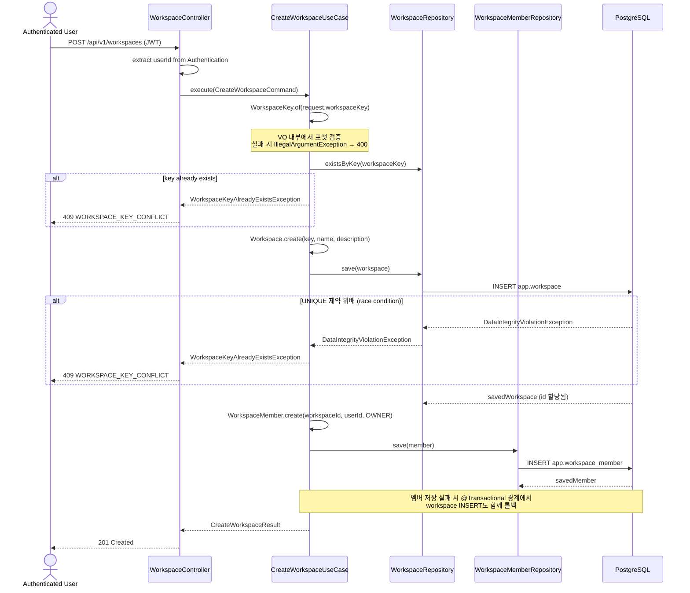
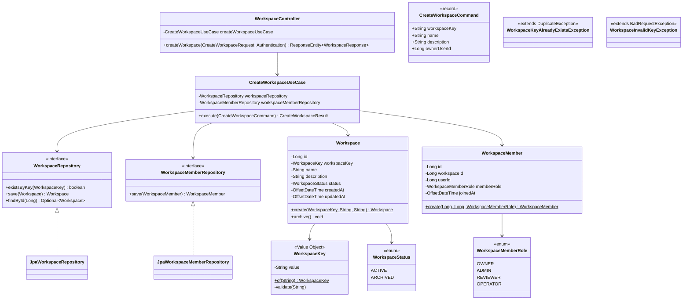

# [BE-022] 워크스페이스 생성 API

> **Backlog**: 로그인한 사용자가 새 워크스페이스를 만들고 싶다 → 모든 도메인 리소스(corpus, domain pack 등)가 워크스페이스 단위로 격리되므로, 워크스페이스 자체를 생성할 수 있는 최초 진입점이 필요
> **Bounded Context**: `workspace` (신규)
> **Template**: `_TEMPLATE_BE.md`
> **Branch**: `feature/022-workspace-create`

---

## Goal

로그인한 사용자가 워크스페이스를 생성하면 **동일 트랜잭션 안**에서 `OWNER` 권한의 `workspace_member`가 자동 등록된다.

- `workspace_key`는 사용자가 직접 입력하며 소문자/숫자/하이픈 패턴을 강제한다 (`^[a-z0-9]([a-z0-9-]*[a-z0-9])?$`).
- 중복 `workspace_key`는 `existsByKey` 사전 체크 + `app.workspace.workspace_key` UNIQUE 제약 `DataIntegrityViolationException` catch의 belt-and-suspenders 패턴으로 방어한다 (auth `signup` 패턴과 동일).
- `Workspace`와 `WorkspaceMember` 저장은 원자적(atomic)이어야 한다 — 멤버 저장 실패 시 workspace 저장도 함께 롤백된다.
- 이 API는 기존 `corpus`/`domainpack` 모듈의 `WorkspaceRef` / `WorkspaceExistencePort` (authz 전용 read-only 참조)와 독립적으로 존재하는 새 `workspace` 바운디드 컨텍스트에서 aggregate root `Workspace`를 소유한다.

---

## Sequence Diagram



---

## REST API

### Endpoint

| Method | Path                 | Description            | Auth |
| ------ | -------------------- | ---------------------- | ---- |
| POST   | `/api/v1/workspaces` | 새 워크스페이스 생성   | JWT  |

### Request

**POST `/api/v1/workspaces`**

```json
{
  "workspaceKey": "cs-team-alpha",
  "name": "CS Team Alpha",
  "description": "고객지원팀 알파 워크스페이스"
}
```

#### Request Body 제약

| Field          | Type    | Required | 제약                                                       |
| -------------- | ------- | -------- | ---------------------------------------------------------- |
| `workspaceKey` | string  | ✅       | 3–100자, `^[a-z0-9]([a-z0-9-]*[a-z0-9])?$` (`WorkspaceKey` VO 내부 검증) |
| `name`         | string  | ✅       | 1–255자, blank 금지                                        |
| `description`  | string? | ❌       | 최대 2000자                                                |

Bean Validation(`@Valid`)은 `name` blank 검증과 길이 검증을 담당하고, `workspaceKey`의 포맷 검증은 도메인 VO `WorkspaceKey.of(...)`에서 처리한다.

### Response

**201 Created**

```json
{
  "id": 42,
  "workspaceKey": "cs-team-alpha",
  "name": "CS Team Alpha",
  "description": "고객지원팀 알파 워크스페이스",
  "status": "ACTIVE",
  "ownerId": 7,
  "ownerRole": "OWNER",
  "createdAt": "2026-04-13T10:00:00Z"
}
```

**400 Bad Request** — `@Valid` 실패 (name blank / length 초과)

```json
{
  "code": "VALIDATION_ERROR",
  "errors": ["name must not be blank"]
}
```

**400 Bad Request** — `WorkspaceKey` 포맷 위반 (`IllegalArgumentException` → `BadRequestException` 래핑)

```json
{
  "code": "WORKSPACE_INVALID_KEY",
  "message": "workspaceKey 형식이 올바르지 않습니다."
}
```

**401 Unauthorized** — JWT 누락/만료

```json
{
  "code": "UNAUTHORIZED",
  "message": "인증이 필요합니다."
}
```

**409 Conflict** — `workspace_key` 중복

```json
{
  "code": "WORKSPACE_KEY_CONFLICT",
  "message": "이미 사용 중인 워크스페이스 키입니다."
}
```

---

## Class Design

### DDD Layered Structure



### 디렉토리 구조 (신규 모듈)

```text
backend/src/main/java/com/init/workspace/
├── presentation/
│   ├── WorkspaceController.java
│   ├── dto/
│   │   ├── CreateWorkspaceRequest.java   (record, @Valid)
│   │   └── WorkspaceResponse.java         (record)
│   └── package-info.java
├── application/
│   ├── CreateWorkspaceUseCase.java        (@Service @Transactional(readOnly = true))
│   ├── CreateWorkspaceCommand.java        (record)
│   ├── CreateWorkspaceResult.java         (record)
│   ├── exception/
│   │   ├── WorkspaceKeyAlreadyExistsException.java  (extends DuplicateException)
│   │   └── WorkspaceInvalidKeyException.java        (extends BadRequestException)
│   └── package-info.java
├── domain/
│   ├── model/
│   │   ├── Workspace.java                 (@Entity, Aggregate Root)
│   │   ├── WorkspaceKey.java              (@Embeddable Value Object)
│   │   ├── WorkspaceStatus.java           (enum: ACTIVE, ARCHIVED)
│   │   ├── WorkspaceMember.java           (@Entity)
│   │   └── WorkspaceMemberRole.java       (enum: OWNER, ADMIN, REVIEWER, OPERATOR)
│   ├── repository/
│   │   ├── WorkspaceRepository.java       (interface, JPA 의존성 없음)
│   │   └── WorkspaceMemberRepository.java (interface)
│   └── package-info.java
└── infrastructure/
    └── persistence/
        ├── JpaWorkspaceRepository.java
        ├── JpaWorkspaceMemberRepository.java
        └── package-info.java
```

> 기존 `corpus`/`domainpack` 모듈의 `WorkspaceRef` / `WorkspaceExistencePort` / `WorkspaceMembershipPort`는 **인가(authz) 전용 read-only 참조 객체**로 남기고, 새 `workspace` 모듈이 aggregate root `Workspace`를 독점 소유한다. 이 PR에서는 기존 ref/port를 건드리지 않는다.

### Aggregate Design

```java
// Aggregate Root
@Entity
@Table(name = "workspace", schema = "app")
public class Workspace {

  @Id
  @GeneratedValue(strategy = GenerationType.IDENTITY)
  private Long id;

  @Embedded
  private WorkspaceKey workspaceKey;

  @Column(nullable = false)
  private String name;

  @Column
  private String description;

  @Enumerated(EnumType.STRING)
  @Column(nullable = false)
  private WorkspaceStatus status;

  @Column(name = "created_at", nullable = false, updatable = false)
  private OffsetDateTime createdAt;

  @Column(name = "updated_at", nullable = false)
  private OffsetDateTime updatedAt;

  protected Workspace() {}

  public static Workspace create(WorkspaceKey workspaceKey, String name, String description) {
    if (workspaceKey == null) {
      throw new IllegalArgumentException("workspaceKey must not be null");
    }
    if (name == null || name.isBlank()) {
      throw new IllegalArgumentException("name must not be null or blank");
    }
    if (name.length() > 255) {
      throw new IllegalArgumentException("name must not exceed 255 characters");
    }
    if (description != null && description.length() > 2000) {
      throw new IllegalArgumentException("description must not exceed 2000 characters");
    }
    Workspace workspace = new Workspace();
    workspace.workspaceKey = workspaceKey;
    workspace.name = name;
    workspace.description = description;
    workspace.status = WorkspaceStatus.ACTIVE;
    return workspace;
  }

  @PrePersist
  protected void onPersist() {
    OffsetDateTime now = OffsetDateTime.now();
    this.createdAt = now;
    this.updatedAt = now;
  }

  @PreUpdate
  protected void onUpdate() {
    this.updatedAt = OffsetDateTime.now();
  }

  public void archive() {
    if (this.status == WorkspaceStatus.ARCHIVED) {
      throw new IllegalStateException("이미 보관된 워크스페이스입니다.");
    }
    this.status = WorkspaceStatus.ARCHIVED;
  }

  // getters (no public setters)
}
```

### Value Object

```java
@Embeddable
public class WorkspaceKey {

  private static final int MIN_LENGTH = 3;
  private static final int MAX_LENGTH = 100;
  private static final Pattern PATTERN =
      Pattern.compile("^[a-z0-9]([a-z0-9-]*[a-z0-9])?$");

  @Column(name = "workspace_key", nullable = false, unique = true, length = 100)
  private String value;

  protected WorkspaceKey() {}

  private WorkspaceKey(String value) {
    validate(value);
    this.value = value;
  }

  public static WorkspaceKey of(String value) {
    return new WorkspaceKey(value);
  }

  private void validate(String value) {
    if (value == null || value.isBlank()) {
      throw new IllegalArgumentException("workspaceKey must not be null or blank");
    }
    if (value.length() < MIN_LENGTH || value.length() > MAX_LENGTH) {
      throw new IllegalArgumentException(
          "workspaceKey length must be between " + MIN_LENGTH + " and " + MAX_LENGTH);
    }
    if (!PATTERN.matcher(value).matches()) {
      throw new IllegalArgumentException(
          "workspaceKey must match pattern " + PATTERN.pattern());
    }
  }

  public String getValue() {
    return value;
  }

  // equals / hashCode
}
```

### WorkspaceMember Entity

```java
@Entity
@Table(name = "workspace_member", schema = "app")
public class WorkspaceMember {

  @Id
  @GeneratedValue(strategy = GenerationType.IDENTITY)
  private Long id;

  @Column(name = "workspace_id", nullable = false)
  private Long workspaceId;

  @Column(name = "user_id", nullable = false)
  private Long userId;

  @Enumerated(EnumType.STRING)
  @Column(name = "member_role", nullable = false)
  private WorkspaceMemberRole memberRole;

  @Column(name = "joined_at", nullable = false, updatable = false)
  private OffsetDateTime joinedAt;

  protected WorkspaceMember() {}

  public static WorkspaceMember create(
      Long workspaceId, Long userId, WorkspaceMemberRole memberRole) {
    if (workspaceId == null) {
      throw new IllegalArgumentException("workspaceId must not be null");
    }
    if (userId == null) {
      throw new IllegalArgumentException("userId must not be null");
    }
    if (memberRole == null) {
      throw new IllegalArgumentException("memberRole must not be null");
    }
    WorkspaceMember member = new WorkspaceMember();
    member.workspaceId = workspaceId;
    member.userId = userId;
    member.memberRole = memberRole;
    return member;
  }

  @PrePersist
  protected void onPersist() {
    this.joinedAt = OffsetDateTime.now();
  }

  // getters (no public setters)
}
```

### Application Service

```java
@Service
@Transactional(readOnly = true)
public class CreateWorkspaceUseCase {

  private final WorkspaceRepository workspaceRepository;
  private final WorkspaceMemberRepository workspaceMemberRepository;

  public CreateWorkspaceUseCase(
      WorkspaceRepository workspaceRepository,
      WorkspaceMemberRepository workspaceMemberRepository) {
    this.workspaceRepository = workspaceRepository;
    this.workspaceMemberRepository = workspaceMemberRepository;
  }

  @Transactional
  public CreateWorkspaceResult execute(CreateWorkspaceCommand command) {
    WorkspaceKey key;
    try {
      key = WorkspaceKey.of(command.workspaceKey());
    } catch (IllegalArgumentException ex) {
      throw new WorkspaceInvalidKeyException(ex.getMessage());
    }

    if (workspaceRepository.existsByKey(key)) {
      throw new WorkspaceKeyAlreadyExistsException("이미 사용 중인 워크스페이스 키입니다.");
    }

    Workspace workspace = Workspace.create(key, command.name(), command.description());
    Workspace saved;
    try {
      saved = workspaceRepository.save(workspace);
    } catch (DataIntegrityViolationException ex) {
      throw new WorkspaceKeyAlreadyExistsException("이미 사용 중인 워크스페이스 키입니다.");
    }

    WorkspaceMember owner =
        WorkspaceMember.create(saved.getId(), command.ownerUserId(), WorkspaceMemberRole.OWNER);
    WorkspaceMember savedMember = workspaceMemberRepository.save(owner);

    return CreateWorkspaceResult.from(saved, savedMember);
  }
}
```

### Exception 매핑

| Exception                              | 상속                         | HTTP | Code                     |
| --------------------------------------- | ---------------------------- | ---- | ------------------------ |
| `WorkspaceInvalidKeyException`          | `BadRequestException`        | 400  | `WORKSPACE_INVALID_KEY`  |
| `WorkspaceKeyAlreadyExistsException`    | `DuplicateException`         | 409  | `WORKSPACE_KEY_CONFLICT` |
| `MethodArgumentNotValidException`       | (Spring)                     | 400  | `VALIDATION_ERROR`       |
| `AuthenticationCredentialsNotFoundException` | (Spring Security)       | 401  | `UNAUTHORIZED`           |

`com.init.shared.presentation.GlobalExceptionHandler`는 이미 `BadRequestException`, `DuplicateException`, `MethodArgumentNotValidException`, `AuthenticationCredentialsNotFoundException`에 대한 핸들러를 보유하고 있으므로 **신규 핸들러 추가는 필요 없다**. 신규 예외 클래스가 각 base를 상속하기만 하면 자동으로 올바른 HTTP 상태와 code가 매핑된다.

### Controller

```java
@RestController
@RequestMapping("/api/v1/workspaces")
public class WorkspaceController {

  private final CreateWorkspaceUseCase createWorkspaceUseCase;

  public WorkspaceController(CreateWorkspaceUseCase createWorkspaceUseCase) {
    this.createWorkspaceUseCase = createWorkspaceUseCase;
  }

  @PostMapping
  public ResponseEntity<WorkspaceResponse> createWorkspace(
      @Valid @RequestBody CreateWorkspaceRequest request, Authentication authentication) {
    Long userId = extractUserId(authentication);
    CreateWorkspaceResult result =
        createWorkspaceUseCase.execute(
            new CreateWorkspaceCommand(
                request.workspaceKey(), request.name(), request.description(), userId));
    return ResponseEntity.status(HttpStatus.CREATED).body(WorkspaceResponse.from(result));
  }

  private Long extractUserId(Authentication authentication) {
    if (authentication == null || authentication.getName() == null) {
      throw new AuthenticationCredentialsNotFoundException("인증이 필요합니다.");
    }
    return Long.parseLong(authentication.getName());
  }
}
```

> `authentication.getName()`에서 userId를 추출하는 구체 방식은 `JwtAuthenticationFilter`가 SecurityContext에 저장하는 principal 구조에 맞춘다 (구현 시점에 `SecurityConfig` 및 기존 필터 구조 확인 후 조정 가능).

### DTO (Presentation)

```java
public record CreateWorkspaceRequest(
    String workspaceKey,
    @NotBlank @Size(max = 255) String name,
    @Size(max = 2000) String description) {}

public record WorkspaceResponse(
    Long id,
    String workspaceKey,
    String name,
    String description,
    String status,
    Long ownerId,
    String ownerRole,
    OffsetDateTime createdAt) {

  public static WorkspaceResponse from(CreateWorkspaceResult result) {
    return new WorkspaceResponse(
        result.workspaceId(),
        result.workspaceKey(),
        result.name(),
        result.description(),
        result.status(),
        result.ownerId(),
        result.ownerRole(),
        result.createdAt());
  }
}
```

---

## Tests

### Unit Tests

**`WorkspaceKeyTest`** — 순수 VO 단위

- `should_생성성공_when_유효한_소문자숫자하이픈` — `"cs-team-alpha"`, `"ws1"`, `"a-b-c-1"` 정상 생성
- `should_IllegalArgumentException_when_null` — `WorkspaceKey.of(null)`
- `should_IllegalArgumentException_when_blank` — `""`, `" "`
- `should_IllegalArgumentException_when_길이_2이하` — `"ab"`
- `should_IllegalArgumentException_when_길이_100초과` — 101자
- `should_IllegalArgumentException_when_대문자포함` — `"CS-team"`
- `should_IllegalArgumentException_when_언더스코어포함` — `"cs_team"`
- `should_IllegalArgumentException_when_하이픈으로시작` — `"-cs"`
- `should_IllegalArgumentException_when_하이픈으로끝` — `"cs-"`

**`WorkspaceTest`** — 순수 도메인 단위

- `should_생성성공_when_유효한_인자` — 상태가 `ACTIVE`로 초기화됨
- `should_IllegalArgumentException_when_name_blank`
- `should_IllegalArgumentException_when_name_255초과`
- `should_IllegalArgumentException_when_description_2000초과`
- `should_description_null허용`
- `should_archive_시_상태변경_ARCHIVED`
- `should_IllegalStateException_when_이미_ARCHIVED상태에서_archive호출`

**`WorkspaceMemberTest`**

- `should_생성성공_when_유효한_인자`
- `should_IllegalArgumentException_when_workspaceId_null`
- `should_IllegalArgumentException_when_userId_null`
- `should_IllegalArgumentException_when_memberRole_null`

### Application Service Tests (`@ExtendWith(MockitoExtension)`)

**`CreateWorkspaceUseCaseTest`**

- `should_workspace와_OWNER멤버저장_when_정상요청`
  - given: `workspaceRepository.existsByKey` → false, `save` → 저장된 workspace, `memberRepository.save` → 저장된 member
  - when: `execute(command)`
  - then: result 필드 확인, `workspaceRepository.save`와 `memberRepository.save` 각 1회 호출
- `should_WorkspaceKeyAlreadyExistsException_when_existsByKey_true`
- `should_WorkspaceKeyAlreadyExistsException_when_save시_DataIntegrityViolation`
  - given: `save` 호출 시 `DataIntegrityViolationException` 던짐 (race condition 시뮬레이션)
- `should_WorkspaceInvalidKeyException_when_workspaceKey_형식위반`
- `should_멤버저장실패시_전체롤백_when_memberRepository_예외`
  - given: `memberRepository.save` → `RuntimeException`
  - then: 예외 전파 (실제 롤백 검증은 integration 또는 `@DataJpaTest`에서 보강)

### Controller Tests (`@WebMvcTest` + MockMvc)

**`WorkspaceControllerTest`**

- `should_201Created_when_유효한요청_인증된사용자`
- `should_400VALIDATION_ERROR_when_name_blank`
- `should_400VALIDATION_ERROR_when_name_255초과`
- `should_400VALIDATION_ERROR_when_description_2000초과`
- `should_400WORKSPACE_INVALID_KEY_when_workspaceKey_대문자포함`
- `should_401UNAUTHORIZED_when_인증_누락`
- `should_409WORKSPACE_KEY_CONFLICT_when_useCase가_WorkspaceKeyAlreadyExistsException`
- `should_응답바디_ownerId_ownerRole_포함` — OWNER 자동 등록 결과 확인

### Test Checklist

- [x] Happy path: 201 + Workspace/WorkspaceMember 두 row 생성
- [x] 멱등성: 동일 workspaceKey 반복 호출 시 첫 요청만 성공, 이후는 409
- [x] 유효성 오류: name blank, workspaceKey 포맷
- [x] 권한/인증 오류: 인증 누락 → 401
- [x] 경계값: workspaceKey 3자/100자, name 1자/255자, description 0자/2000자
- [x] 동시성: `DataIntegrityViolationException` catch로 race condition에서도 409 응답
- [x] 트랜잭션: 멤버 저장 실패 시 workspace 저장도 롤백 (`@Transactional` 경계)

---

## Database

### Migration (Liquibase)

**신규 changeset 불필요**. `app.workspace`, `app.workspace_member` 테이블은 `backend/src/main/resources/db/changelog/db.changelog-master.sql`에 이미 정의되어 있다:

- `20250403-create-app-workspace-table`
- `20250403-create-workspace-member-table`

JPA `@Entity` 매핑만 작성한다. `member_role` 컬럼은 `varchar(50)`이므로 `WorkspaceMemberRole` enum을 `@Enumerated(EnumType.STRING)`으로 매핑한다. `status` 컬럼도 동일.

---

## Additional Notes

- `@Service` 클래스에 `@Transactional(readOnly = true)` 기본, `execute()`만 `@Transactional`로 개별 오버라이드 (`java.md` 권장 패턴 및 `AuthService` 참조).
- `@Autowired` 필드 주입 금지. 모든 의존성은 `final` + 생성자 주입.
- Aggregate Root에 public setter 금지. 상태 변경은 `archive()` 같은 의미 있는 도메인 메서드로만 수행.
- Controller에 비즈니스 로직 금지. Service/UseCase에 위임.
- JPA 엔티티를 API 응답으로 직접 반환 금지. `WorkspaceResponse` DTO로 변환.
- 에러 메시지는 한글로, 내부 스택트레이스 노출 금지 (`GlobalExceptionHandler`가 이미 처리).
- 테스트 네이밍: `should_결과_when_조건` (한글 혼용), Given-When-Then 구조, `@DisplayName` 한글 시나리오.
- 새 모듈 추가 후 `AGENTS.md`의 "7개 Bounded Context" → "8개"로 업데이트, `workspace` 항목 추가는 **구현 PR(`feature/022-workspace-create`)에서 수행**한다 (이 스펙 PR 범위에서는 문서 수정 없음).

---

## Out of Scope

- 워크스페이스 목록 조회 / 단건 조회 / 수정 / 삭제 API (후속 태스크)
- 멤버 초대 / 제거 / 역할 변경 API (후속 태스크)
- 워크스페이스 전환 및 현재 워크스페이스 컨텍스트 관리 (후속 태스크)
- Frontend UI (`spec/{FE-이슈번호}` 별도 브랜치에서 진행)
- 기존 `corpus`/`domainpack`의 `WorkspaceRef` / `WorkspaceExistencePort` 리팩토링 (별도 태스크)
