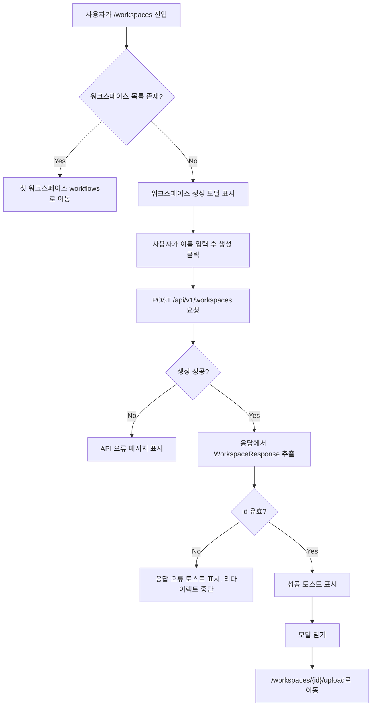

# 0351: [FE] 워크스페이스 생성 성공 후 리다이렉트 오류 수정

> **Issue**: [#351](https://github.com/ajou-2026-1-capstone-5/ostone/issues/351)
> **Bounded Context**: `workspace` FE
> **Template**: `_TEMPLATE_FE.md`
> **Branch**: `fix/0351-workspace-create-redirect`
> **Canonical Number**: `0351`
> **Type**: Frontend (FSD Bug Fix)
> **작성일**: 2026-06-01

---

## Goal

워크스페이스 생성이 성공했는데도 이상한 오류 토스트가 표시되고 생성된 워크스페이스로 즉시 이동하지 않는 문제를 수정한다.

---

## Background

현재 워크스페이스 생성 API는 백엔드에서 `WorkspaceResponse`를 JSON body로 직접 반환한다. 하지만 프론트의 `CreateWorkspaceDialog`는 generated client 타입을 기준으로 응답이 `{ data: WorkspaceResponse }` 형태라고 가정하고 `result.data`를 읽는다.

런타임 실제 응답이 raw `WorkspaceResponse`이면 `result.data`는 `undefined`가 된다. 이후 `WorkspaceRootRedirect`의 `onSuccess`에서 `created.id`를 사용하려 할 때 예외가 발생하고, 이 예외가 `CreateWorkspaceDialog`의 catch 블록에 잡혀 `워크스페이스 목록을 새로고침하지 못했습니다...` 토스트로 표시된다.

결과적으로 워크스페이스 생성은 정상 완료되지만 사용자는 실패처럼 보이는 메시지를 보고, 생성된 워크스페이스의 `/workspaces/{id}/upload` 화면으로 이동하지 못한다.

---

## Scope

### In Scope

- `CreateWorkspaceDialog`의 생성 성공 응답 처리 방식을 수정한다.
- raw `WorkspaceResponse`와 `{ data: WorkspaceResponse }` 응답을 모두 처리할 수 있도록 기존 공용 API 응답 유틸리티를 사용한다.
- 생성 응답에서 유효한 `id`를 확보한 경우에만 `onSuccess(created)`를 호출한다.
- 생성 응답이 비정상인 경우 `created.id` 접근 예외 대신 명확한 오류 토스트를 표시한다.
- 워크스페이스 생성 성공 후 `/workspaces/{created.id}/upload`로 즉시 리다이렉트되는 동작을 테스트한다.
- API 응답 형태 차이에 대한 회귀 테스트를 추가한다.

### Out of Scope

- 백엔드 `WorkspaceController` 응답 구조 변경
- Orval generated 파일 직접 수정
- workspace create endpoint 재생성
- 워크스페이스 목록, 수정, 삭제 UI 재설계
- 로그인/인증 흐름 변경
- 전체 API client 구조 개편

---

## Existing Context

아래 경로는 현재 repository에서 존재 확인 완료했다.

| Existing file | 현재 역할 | 변경 기준 |
| --- | --- | --- |
| `frontend/src/features/workspace/ui/CreateWorkspaceDialog.tsx` | 워크스페이스 생성 모달, 생성 mutation 성공/실패 처리 | `result.data` 직접 접근 제거, 안전한 응답 unwrap 적용 |
| `frontend/src/pages/workspace/ui/WorkspaceRootRedirect.tsx` | `/workspaces` 진입 시 목록 조회, 빈 목록이면 생성 모달 표시, 생성 성공 시 navigate | `onSuccess(created)`가 유효한 workspace를 받으면 기존 navigate 흐름 유지 |
| `frontend/src/pages/workspace/ui/WorkspaceRootRedirect.test.tsx` | `/workspaces` redirect 및 생성 성공 navigate 테스트 | 생성 성공 후 navigate 기대값 유지 |
| `frontend/src/shared/api/apiResponse.ts` | raw 응답과 `{ data }` 응답을 모두 처리하는 `selectApiData`, `selectApiList` 제공 | 새 helper 추가 없이 기존 `selectApiData` 재사용 |
| `frontend/src/shared/api/unwrapApiResponse.ts` | API 응답 unwrap 유틸리티 | 직접 수정하지 않음 |
| `frontend/src/shared/api/generated/endpoints/workspace-controller/workspace-controller.ts` | Orval generated workspace endpoint hooks | 직접 수정하지 않음 |
| `backend/src/main/java/com/init/workspace/presentation/WorkspaceController.java` | workspace REST controller | 현재 raw `WorkspaceResponse` 반환 계약 유지 |

---

## User Flow Chart



---

## Design Diff

### As-is vs To-be

| 영역 | As-is | To-be | 변경 내용 |
| --- | --- | --- | --- |
| 생성 성공 응답 읽기 | `result.data` 직접 접근 | `selectApiData<WorkspaceResponse>(result)` 사용 | raw 응답과 `{ data }` 응답 모두 지원 |
| 생성 후 리다이렉트 | `created`가 `undefined`가 되어 `created.id` 접근 예외 발생 | 유효한 `created.id`가 있을 때만 `onSuccess` 호출 | 생성 직후 업로드 화면 이동 보장 |
| 오류 메시지 | 응답 파싱 문제도 "목록 새로고침 실패"로 표시 | 생성 응답 오류를 별도 메시지로 표시 | 사용자가 원인을 더 정확히 이해 |
| API 계약 | generated 타입과 런타임 응답 형태가 혼재 | 호출부에서 기존 unwrap 유틸로 흡수 | backend/generated 파일 변경 없이 회귀 방지 |

---

## API Integration

새 endpoint 또는 backend 계약 변경은 없다.

| Method | Path | Response | 설명 |
| --- | --- | --- | --- |
| `POST` | `/api/v1/workspaces` | `WorkspaceResponse` | 워크스페이스 생성 |
| `GET` | `/api/v1/workspaces` | `WorkspaceResponse[]` | 워크스페이스 목록 조회 |
| `GET` | `/api/v1/workspaces/{id}` | `WorkspaceResponse` | 워크스페이스 단건 조회 |

### Response Handling Contract

`CreateWorkspaceDialog`는 생성 mutation 성공 결과를 아래 두 형태 모두에서 같은 `WorkspaceResponse`로 해석해야 한다.

```typescript
// 실제 backend/customFetch 런타임 응답
{
  id: 12,
  workspaceKey: "support-team-abc123",
  name: "Support Team",
  status: "ACTIVE"
}
```

```typescript
// generated type 또는 일부 테스트 mock에서 사용할 수 있는 래핑 응답
{
  data: {
    id: 12,
    workspaceKey: "support-team-abc123",
    name: "Support Team",
    status: "ACTIVE"
  }
}
```

구현은 기존 유틸리티를 사용한다.

```typescript
const created = selectApiData<WorkspaceResponse>(
  result as WorkspaceResponse | { data?: WorkspaceResponse },
);
```

---

## Component Tree

```text
WorkspaceRootRedirect
└─ CreateWorkspaceDialog
   ├─ Workspace name input
   ├─ Cancel button
   └─ Submit button
      └─ useCreateWorkspace mutation
         ├─ onSuccess: unwrap response and call parent onSuccess
         └─ onError: field error or toast
```

---

## Data Flow

```text
CreateWorkspaceDialog submit
  -> generateWorkspaceKey(trimmedName)
  -> useCreateWorkspace.mutate({ data: { workspaceKey, name } })
  -> onSuccess(result)
  -> selectApiData<WorkspaceResponse>(result)
  -> validate created.id
  -> toast.success
  -> onOpenChange(false)
  -> WorkspaceRootRedirect.onSuccess(created)
  -> navigate(`/workspaces/${created.id}/upload`, { replace: true })
```

---

## 수정 대상 파일

| 파일 | 변경 유형 | 설명 |
| --- | --- | --- |
| `frontend/src/features/workspace/ui/CreateWorkspaceDialog.tsx` | modify | 생성 성공 응답 unwrap, `id` 검증, 명확한 오류 토스트 처리 |
| `frontend/src/features/workspace/ui/CreateWorkspaceDialog.test.tsx` | new | raw 응답, `{ data }` 응답, 비정상 응답 케이스 테스트 |
| `frontend/src/pages/workspace/ui/WorkspaceRootRedirect.test.tsx` | optional modify | 생성 성공 navigate 회귀 테스트가 충분하지 않으면 보강 |

### Optional Follow-up

| 파일 | 변경 유형 | 설명 |
| --- | --- | --- |
| `frontend/src/pages/workspace/ui/WorkspaceLayout.tsx` | optional modify | `useGetWorkspace` 결과도 `selectApiData`로 정규화해 API 응답 형태 혼재에 더 강하게 만든다 |

Optional follow-up은 이번 버그의 직접 원인이 아니므로, 구현 중 불필요하면 제외한다.

---

## Implementation Notes

- `frontend/src/shared/api/generated/endpoints/workspace-controller/workspace-controller.ts`는 generated 파일이므로 직접 수정하지 않는다.
- `frontend/src/shared/api/apiResponse.ts`에 이미 `selectApiData`가 있으므로 새 unwrap helper를 만들지 않는다.
- 생성 성공 후 `onSuccess`에서 throw가 발생하는 경우는 parent callback 실패로 보고 기존 "목록 갱신 실패" 계열 메시지를 유지할 수 있다.
- 생성 응답 자체가 비정상인 경우와 parent callback 실패는 서로 다른 메시지로 구분한다.
- `isSubmitting`은 성공적으로 navigate가 시작되는 happy path에서는 별도 reset이 필요 없다. 오류 path에서는 기존처럼 `false`로 되돌린다.
- `created.id`는 `null` 또는 `undefined`일 수 있다고 보고 방어한다. `0`은 정상 workspace id로 사용하지 않는 것이 일반적이지만, 프론트에서는 `typeof created.id === "number"` 또는 `created.id != null` 기준으로 충분하다.

---

## Acceptance Criteria

| # | 기준 | 검증 방법 |
| --- | --- | --- |
| 1 | backend가 raw `WorkspaceResponse`를 반환해도 생성 성공 후 `/workspaces/{id}/upload`로 이동한다 | 컴포넌트 테스트 |
| 2 | `{ data: WorkspaceResponse }` 형태의 mock 응답에서도 동일하게 이동한다 | 컴포넌트 테스트 |
| 3 | 생성 성공 응답에서 `id`를 확인할 수 없으면 `onSuccess`와 navigate를 호출하지 않는다 | 컴포넌트 테스트 |
| 4 | 응답 파싱 문제로 인해 "목록 새로고침 실패" 메시지가 표시되지 않는다 | 컴포넌트 테스트 |
| 5 | `WORKSPACE_INVALID_NAME`, `WORKSPACE_KEY_CONFLICT` 필드 오류 처리는 기존 동작을 유지한다 | 기존/추가 테스트 |
| 6 | generated 파일은 수정하지 않는다 | git diff 확인 |

---

## Tests

### Test Strategy

| 구분 | 방법 | 도구 | 비고 |
| --- | --- | --- | --- |
| 컴포넌트 테스트 | 생성 모달 submit과 mutation callback mock | Vitest, Testing Library | 핵심 회귀 검증 |
| 라우팅 테스트 | `WorkspaceRootRedirect` 생성 성공 navigate 확인 | Vitest, MemoryRouter mock | 기존 테스트 유지 또는 보강 |
| 정적 검사 | 타입/린트 확인 | `pnpm lint` | 가능하면 실행 |

### Test Scenarios

#### Happy Path

| # | 시나리오 | 사전 조건 | 조작 | 기대 결과 |
| --- | --- | --- | --- | --- |
| 1 | raw 응답 생성 성공 | `useCreateWorkspace`가 raw `WorkspaceResponse` 반환 | 이름 입력 후 생성 | `onSuccess`가 생성 workspace로 호출됨 |
| 2 | wrapped 응답 생성 성공 | `useCreateWorkspace`가 `{ data: WorkspaceResponse }` 반환 | 이름 입력 후 생성 | `onSuccess`가 생성 workspace로 호출됨 |
| 3 | 빈 워크스페이스 목록에서 생성 성공 | `/workspaces`, 목록 없음 | 생성 완료 | `/workspaces/{id}/upload`로 navigate |

#### Error & Edge Cases

| # | 시나리오 | 조작 | 기대 결과 |
| --- | --- | --- | --- |
| 1 | 생성 응답에 `id` 없음 | mutation success가 `{ name: "WS" }` 반환 | 오류 토스트 표시, `onSuccess` 미호출 |
| 2 | 생성 응답이 `undefined` | mutation success가 `undefined` 반환 | 오류 토스트 표시, `onSuccess` 미호출 |
| 3 | workspace name validation 실패 | 빈 이름 제출 | API 호출 없음, 필드 오류 표시 |
| 4 | `WORKSPACE_INVALID_NAME` | mutation error | name field error 표시 |
| 5 | `WORKSPACE_KEY_CONFLICT` | mutation error | "다른 워크스페이스 이름으로 다시 시도해주세요." 표시 |

### Suggested Commands

```bash
cd frontend && pnpm test -- CreateWorkspaceDialog
cd frontend && pnpm test -- WorkspaceRootRedirect
cd frontend && pnpm lint
```

---

## Risk & Mitigation

| Risk | 영향 | 대응 |
| --- | --- | --- |
| generated 타입과 실제 응답이 계속 어긋남 | 다른 생성/수정 화면에서도 유사 버그 가능 | 이번 변경은 workspace create에 한정하고, 반복 발견 시 API client 정규화 이슈로 분리 |
| `onSuccess` callback 오류와 응답 오류가 섞임 | 잘못된 toast 표시 | 응답 검증 실패와 callback 실패 메시지를 분리 |
| 테스트 mock이 generated 타입만 가정 | raw 응답 회귀를 놓침 | raw 응답과 `{ data }` 응답을 모두 테스트 |

---

## Non-Functional Requirements

- 기존 FSD 의존성 방향을 유지한다.
- shared API 유틸은 재사용하고 새 추상화는 추가하지 않는다.
- generated 파일은 직접 수정하지 않는다.
- UI 레이아웃 변경 없이 동작 오류만 수정한다.
- 사용자가 생성 성공을 실패로 오해하지 않도록 오류 메시지를 구체화한다.
