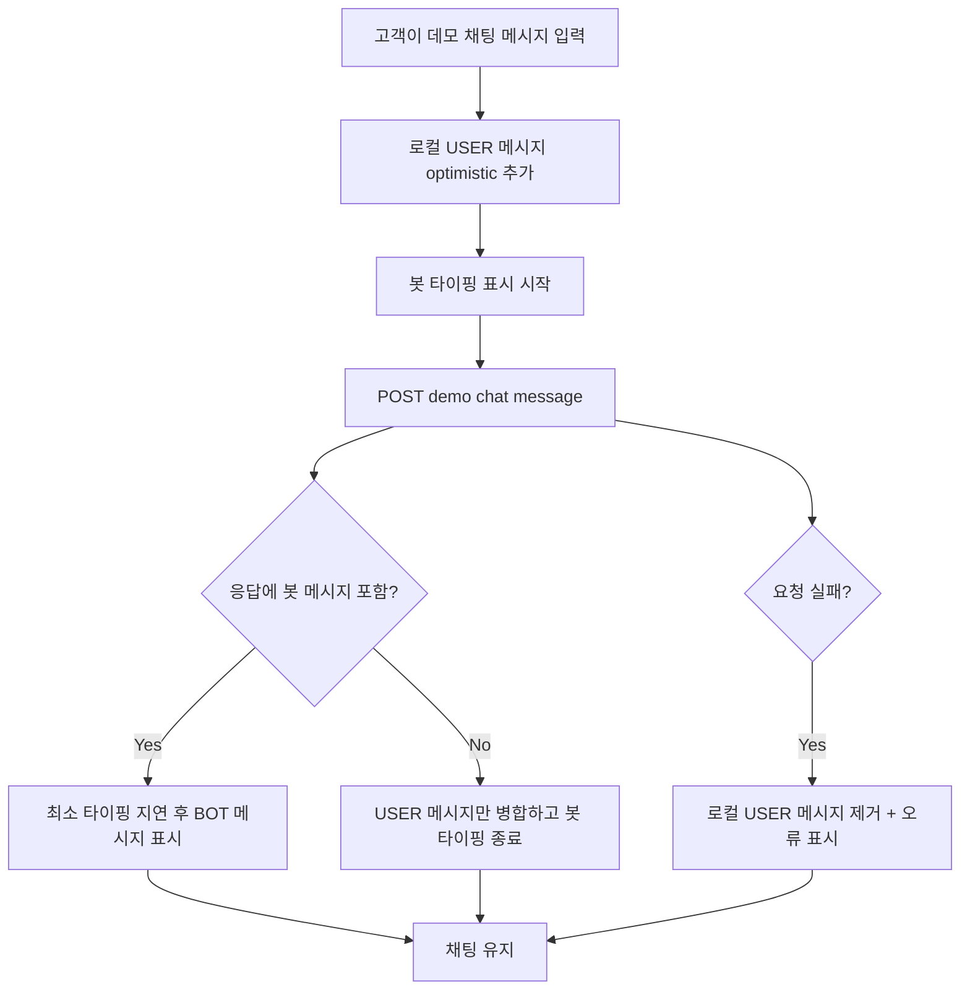

# 0353: 데모 채팅 상담사 배정 후 봇 타이핑 상태 정리

> **Issue**: #0353
> **Bounded Context**: `chat-demo` Frontend
> **Template**: `_TEMPLATE_FE.md` 기반
> **Branch**: `fix/0353-chat-demo-bot-typing-after-assignment`
> **Canonical Number**: `0353`
> **Type**: Frontend FSD
> **작성일**: 2026-06-01

---

## Goal

상담사 배정 이후 Backend가 데모 채팅 봇 자동응답을 생성하지 않을 때, 고객 채팅 화면이 봇 타이핑 상태를 남기지 않고 사용자 메시지만 자연스럽게 반영하도록 한다.

---

## Background

데모 채팅 화면은 `frontend/src/pages/user-chat/ui/UserChatPage.tsx`에서 메시지 전송 시 `startBotTypingDelay()`를 먼저 실행하고, `sendDemoChatMessage()` 응답 또는 WebSocket 메시지를 통해 봇 응답을 병합한다.

Backend 이슈 #0354에서 상담사 배정 이후 `DemoChatSessionRegistrationService.appendMessage()`가 사용자 메시지만 저장하고 `ASSISTANT` 메시지를 생성하지 않도록 바뀌면, 프론트는 응답 목록에 봇 메시지가 없는 정상 케이스를 처리해야 한다. 그렇지 않으면 화면에 봇 입력 중 표시가 남거나, 고객이 응답 생성 실패로 오해할 수 있다.

---

## Scope

### In Scope

- 데모 채팅 메시지 전송 응답에 `BOT`/`ASSISTANT` 메시지가 없을 때 봇 타이핑 상태를 종료한다.
- 사용자 메시지 1개만 반환되는 응답을 성공으로 처리한다.
- WebSocket으로 뒤늦게 상담사 메시지 또는 시스템 메시지가 들어와도 기존 병합 흐름을 유지한다.
- 기존 로컬 optimistic USER 메시지 치환 동작을 유지한다.

### Out of Scope

- 상담사 화면의 응대 모드 UI 변경
- 데모 채팅 입력창 비활성화 또는 상담사 배정 배너 추가
- Backend 자동응답 차단 로직 구현
- WebSocket 프로토콜 또는 endpoint 변경

---

## Existing Context

아래 경로는 현재 repository에서 존재 확인 완료했다.

| Existing file | 현재 역할 | 변경 기준 |
| --- | --- | --- |
| `frontend/DESIGN.md` | 프론트 디자인 가이드 | 기존 채팅 UI의 monochrome/focus/spacing 기준 유지 |
| `frontend/src/pages/user-chat/ui/UserChatPage.tsx` | 데모 고객 채팅 페이지, 세션 시작/전송/동기화/타이핑 상태 관리 | 봇 메시지 없는 성공 응답에서 타이핑 상태 종료 |
| `frontend/src/pages/user-chat/ui/UserChatPage.test.tsx` | 고객 채팅 페이지 동작 테스트 | 사용자 메시지만 반환되는 성공 케이스 추가 |
| `frontend/src/entities/chat/api/chatApi.ts` | 데모 채팅 REST 호출 wrapper | `sendDemoChatMessage()` 응답 shape 유지 |
| `frontend/src/entities/chat/lib/chatMessageSync.ts` | backend 메시지 sender role 변환 및 merge 유틸 | sender type 판별 기준 확인 |
| `frontend/src/features/user-chat/ui/MessageList.tsx` | 메시지 목록과 bot typing indicator 렌더링 | 기존 표시 정책 유지 |

---

## User Flow Chart



---

## Design Diff

| 영역 | As-is | To-be | 변경 내용 |
| --- | --- | --- | --- |
| 전송 직후 상태 | 모든 전송에서 봇 타이핑 표시 시작 | 기존과 동일 | 사용자에게 즉시 반응 유지 |
| 응답 처리 | 봇 메시지 수신을 전제로 타이핑 종료 | 봇 메시지가 없으면 즉시 타이핑 종료 | 상담사 배정 이후 정상 흐름 처리 |
| 오류 표시 | 요청 실패 시 오류 문구 표시 | 동일 | 사용자 메시지만 반환되는 성공을 오류로 보지 않음 |
| 메시지 병합 | USER/BOT 응답 모두 병합 | USER-only 응답도 성공 병합 | optimistic USER 메시지 중복 방지 |

---

## Component Tree

```text
UserChatPage
├─ ChatEntryScreen
└─ ChatConversationScreen
   ├─ ChatHeader
   ├─ MessageList
   │  └─ botTyping indicator
   └─ MessageInput
```

---

## API Integration

### Existing Endpoint

| Method | Path | Description |
| --- | --- | --- |
| `POST` | `/api/v1/workspaces/{workspaceId}/demo/chat-sessions/{sessionId}/messages` | 데모 고객 메시지 전송 |

### Response Cases

#### AI 자동응답 허용

```json
[
  {
    "id": 10,
    "seqNo": 2,
    "senderRole": "USER",
    "messageType": "TEXT",
    "content": "환불 문의입니다",
    "createdAt": "2026-06-01T10:00:00Z"
  },
  {
    "id": 11,
    "seqNo": 3,
    "senderRole": "ASSISTANT",
    "messageType": "TEXT",
    "content": "환불 정책을 확인해드릴게요.",
    "createdAt": "2026-06-01T10:00:01Z"
  }
]
```

#### 상담사 배정 또는 AI 보조 모드

```json
[
  {
    "id": 10,
    "seqNo": 2,
    "senderRole": "USER",
    "messageType": "TEXT",
    "content": "아직 답변 없나요?",
    "createdAt": "2026-06-01T10:00:00Z"
  }
]
```

프론트는 두 응답 모두 성공으로 처리한다. 응답 배열에 `ASSISTANT` 또는 `BOT`으로 변환되는 메시지가 없으면 봇 타이핑 상태를 종료한다.

---

## Data Flow

```text
MessageInput submit
  -> UserChatPage.handleSendMessage()
      -> createLocalUserMessage()
      -> startBotTypingDelay()
      -> sendDemoChatMessage()
          -> ChatMessage[]
      -> hasBotLikeMessage(response)?
          -> yes: existing realtime/queued bot rendering
          -> no: clear pending bot messages + setBotTyping(false)
```

---

## 수정 대상 파일

| 파일 | 변경 유형 | 설명 |
| --- | --- | --- |
| `.agent/specs/0353.md` | new | FE 변경 의도와 검증 기준 문서화 |
| `frontend/src/pages/user-chat/ui/UserChatPage.tsx` | modify | `sendDemoChatMessage()` 성공 응답에 봇 메시지가 없을 때 타이핑 상태 종료 |
| `frontend/src/pages/user-chat/ui/UserChatPage.test.tsx` | modify | USER-only 응답을 성공 처리하고 bot typing indicator가 사라지는지 검증 |

---

## State Management

새 전역 상태는 추가하지 않는다. `UserChatPage`의 기존 local state와 refs를 유지한다.

| State/Ref | 역할 | 변경 기준 |
| --- | --- | --- |
| `isBotTyping` | `MessageList`의 bot typing indicator 제어 | USER-only 성공 응답 시 `false` |
| `pendingBotMessagesRef` | 최소 타이핑 지연 중 받은 봇 메시지 큐 | USER-only 성공 응답 시 비움 |
| `botTypingTimeoutRef` | 지연 표시 timeout | USER-only 성공 응답 시 clear |
| `chatState.session.messages` | 화면 메시지 목록 | USER-only 응답도 persisted/realtime merge 흐름으로 정리 |

---

## Tests

### Test Strategy

| 구분 | 방법 | 도구 | 비고 |
| --- | --- | --- | --- |
| 컴포넌트 테스트 | 고객 메시지 전송 후 화면 상태 검증 | Vitest + React Testing Library | 응답 shape별 타이핑 상태 확인 |
| API wrapper 테스트 | 기존 `sendDemoChatMessage()` 변환 유지 확인 | Vitest | 필요 시 USER-only 응답 fixture 추가 |

### Test Scenarios

#### Happy Path

| # | 시나리오 | 사전 조건 | 조작 | 기대 결과 |
| --- | --- | --- | --- | --- |
| 1 | AI 자동응답 허용 | `sendDemoChatMessage()`가 USER + ASSISTANT 반환 | 고객 메시지 전송 | 봇 타이핑 후 ASSISTANT 메시지 표시 |
| 2 | 상담사 배정 후 USER-only 성공 | `sendDemoChatMessage()`가 USER 1개만 반환 | 고객 메시지 전송 | 사용자 메시지는 유지되고 봇 타이핑이 종료됨 |
| 3 | 연속 전송 | 첫 응답은 USER-only, 다음 응답도 USER-only | 고객 메시지 2회 전송 | 타이핑 indicator가 누적되거나 고착되지 않음 |

#### Error & Edge Cases

| # | 시나리오 | 기대 결과 |
| --- | --- | --- |
| 1 | `sendDemoChatMessage()` 실패 | 기존처럼 optimistic USER 메시지 제거, 오류 문구 표시, 타이핑 종료 |
| 2 | 응답 배열이 비어 있음 | 요청 성공으로 보되 타이핑 종료, 기존 메시지 유지 |
| 3 | WebSocket으로 상담사 메시지가 도착 | bot typing과 무관하게 메시지 목록에 병합 |

---

## Acceptance Criteria

- 상담사 배정 이후 데모 고객이 메시지를 보내도 화면에 봇 타이핑 표시가 남지 않는다.
- Backend가 USER 메시지만 반환하는 응답을 실패로 취급하지 않는다.
- 기존 AI 자동응답이 허용된 데모 채팅에서는 봇 타이핑 지연과 ASSISTANT 메시지 표시가 유지된다.
- 로컬 optimistic USER 메시지와 서버 USER 메시지가 중복 표시되지 않는다.
- `frontend/DESIGN.md`의 기존 채팅 UI 스타일 기준을 변경하지 않는다.

---

## Non-goals

- 상담사 배정 여부를 프론트가 자체 판단해 메시지 전송을 막지 않는다.
- AI 응대 모드 전환 API를 고객 채팅 화면에 추가하지 않는다.
- 데모 채팅 REST endpoint의 응답 계약을 새 envelope로 바꾸지 않는다.

---

## Open Questions

- 후속 이슈에서 고객 화면에 “상담사가 응대 중입니다” 같은 상태 문구를 표시할지 결정한다.
