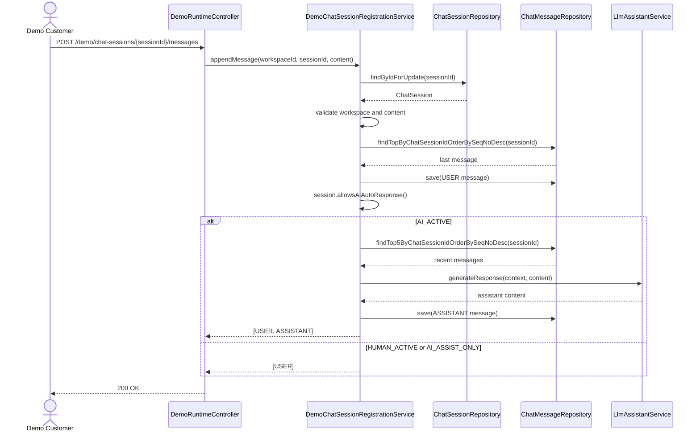
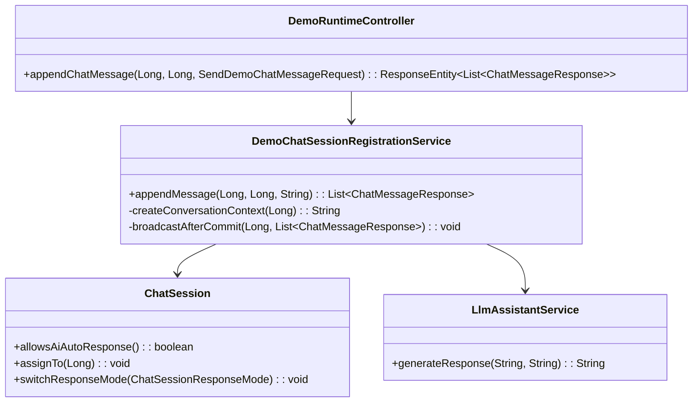

# 0354: 데모 채팅 상담사 배정 후 봇 자동응답 차단

> **Issue**: #0354
> **Bounded Context**: `chat-demo` Backend
> **Template**: `_TEMPLATE_BE.md` 기반
> **Branch**: `fix/0354-chat-demo-ai-handoff-guard`
> **Canonical Number**: `0354`
> **Type**: Backend DDD
> **작성일**: 2026-06-01

---

## Goal

데모 채팅 세션이 상담사에게 배정되거나 AI 보조 모드로 전환된 이후에는 고객 메시지를 저장하되 봇 자동응답 생성과 `ASSISTANT` 메시지 저장을 차단한다.

---

## Background

일반 WebSocket 기반 고객 채팅 경로는 `ChatSession.responseMode`와 `ChatSession.allowsAiAutoResponse()`를 기준으로 LLM 자동응답을 차단한다. `CounselorService.assignSession()`은 `ChatSession.assignTo()`를 호출하며, 이때 세션은 `HUMAN_ACTIVE`로 전환된다. `LlmResponseHandler`는 LLM 호출 전과 저장 직전에 `allowsAiAutoResponse()`를 확인한다.

반면 데모 채팅 REST 경로는 `DemoChatSessionRegistrationService.appendMessage()`에서 사용자 메시지를 저장한 뒤 `llmAssistantService.generateResponse(...)`를 무조건 호출하고 `ASSISTANT` 메시지를 저장한다. 이 때문에 상담사 배정 이후에도 데모 고객 화면에서 봇 응답이 생성될 수 있다.

---

## Scope

### In Scope

- 데모 채팅 메시지 append 경로에 `ChatSession.allowsAiAutoResponse()` 가드를 추가한다.
- AI 자동응답이 금지된 세션에서는 USER 메시지만 저장하고 반환한다.
- AI 자동응답이 금지된 세션에서는 `llmAssistantService.generateResponse(...)`를 호출하지 않는다.
- 기존 세션 workspace 검증, content 검증, message seqNo 계산 흐름은 유지한다.
- `HUMAN_ACTIVE`, `AI_ASSIST_ONLY` 모두 자동응답 금지 상태로 처리한다.

### Out of Scope

- 일반 `ChatWebSocketService`/`LlmResponseHandler` 자동응답 흐름 변경
- 상담사 배정 API 또는 응대 모드 API 변경
- DB schema 변경
- 프론트 타이핑 상태 처리
- 데모 domain pack fixture 변경

---

## Existing Context

아래 경로는 현재 repository에서 존재 확인 완료했다.

| Existing file | 현재 역할 | 변경 기준 |
| --- | --- | --- |
| `backend/src/main/java/com/init/chatdemo/application/DemoChatSessionRegistrationService.java` | 데모 채팅 세션 등록과 데모 메시지 append 처리 | `appendMessage()`에 AI 자동응답 가드 추가 |
| `backend/src/main/java/com/init/chatdemo/presentation/DemoRuntimeController.java` | 데모 채팅 REST controller | endpoint 계약 유지 |
| `backend/src/main/java/com/init/workflowruntime/domain/ChatSession.java` | 상담 세션 aggregate | `allowsAiAutoResponse()`를 자동응답 허용 기준으로 재사용 |
| `backend/src/main/java/com/init/workflowruntime/domain/ChatSessionResponseMode.java` | 응대 모드 enum | `AI_ACTIVE`만 자동응답 허용 |
| `backend/src/main/java/com/init/workflowruntime/application/CounselorService.java` | 상담사 배정/해제/응대 모드 변경 | 배정 시 `HUMAN_ACTIVE` 전환 흐름 유지 |
| `backend/src/main/java/com/init/workflowruntime/application/LlmResponseHandler.java` | 일반 채팅 LLM 자동응답 handler | 동일한 guard 정책의 참조 구현 |
| `backend/src/test/java/com/init/chatdemo/application/DemoChatSessionRegistrationServiceTest.java` | 데모 채팅 service 단위 테스트 | USER-only 성공 케이스 추가 |
| `backend/src/test/java/com/init/chatdemo/presentation/DemoRuntimeControllerTest.java` | 데모 REST controller 테스트 | 필요 시 응답 배열 shape 유지 확인 |
| `backend/src/test/java/com/init/workflowruntime/domain/ChatSessionTest.java` | 응대 모드 domain rule 테스트 | 기존 `allowsAiAutoResponse()` 기대값 유지 |

---

## Sequence Diagram



---

## REST API

### Endpoint

기존 endpoint를 유지한다.

| Method | Path | Description |
| --- | --- | --- |
| `POST` | `/api/v1/workspaces/{workspaceId}/demo/chat-sessions/{sessionId}/messages` | 데모 고객 메시지 append |

### Request

```json
{
  "content": "아직 답변 없나요?"
}
```

### Response

#### 200 OK: AI 자동응답 허용

```json
[
  {
    "id": 10,
    "seqNo": 2,
    "senderRole": "USER",
    "messageType": "TEXT",
    "content": "환불 문의입니다",
    "createdAt": "2026-06-01T10:00:00Z"
  },
  {
    "id": 11,
    "seqNo": 3,
    "senderRole": "ASSISTANT",
    "messageType": "TEXT",
    "content": "환불 정책을 확인해드릴게요.",
    "createdAt": "2026-06-01T10:00:01Z"
  }
]
```

#### 200 OK: 상담사 배정 또는 AI 보조 모드

```json
[
  {
    "id": 10,
    "seqNo": 2,
    "senderRole": "USER",
    "messageType": "TEXT",
    "content": "아직 답변 없나요?",
    "createdAt": "2026-06-01T10:00:00Z"
  }
]
```

### Error Responses

기존 오류 정책을 유지한다.

| Status | Code | 조건 |
| --- | --- | --- |
| `400` | `VALIDATION_ERROR` | `content`가 blank |
| `404` | `SESSION_NOT_FOUND` | 세션이 없거나 workspace가 불일치 |
| `404` | `DOMAIN_PACK_CURRENT_VERSION_NOT_FOUND` | 데모 세션 생성 시 운영 버전 없음 |

---

## Application Rules

- `appendMessage()`는 항상 `findByIdForUpdate(sessionId)`로 세션을 잠근 뒤 처리한다.
- `workspaceId`가 세션의 workspace와 다르면 기존처럼 `SESSION_NOT_FOUND`로 숨긴다.
- 세션 상태 검증은 현재 데모 append 흐름을 유지한다. 이번 이슈는 자동응답 생성 여부만 다룬다.
- USER 메시지는 자동응답 가능 여부와 관계없이 저장한다.
- `session.allowsAiAutoResponse()`가 `false`이면 아래 작업을 수행하지 않는다.
  - 최근 대화 context 조회
  - `llmAssistantService.generateResponse(...)` 호출
  - `ASSISTANT` 메시지 저장
- `session.allowsAiAutoResponse()`가 `true`이면 기존처럼 USER와 ASSISTANT 메시지를 모두 반환한다.
- WebSocket broadcast는 실제 반환된 메시지 목록만 대상으로 한다.

---

## Class Design



### Pseudocode

```java
ChatMessage userMessage = saveUserMessage(sessionId, nextSeqNo, normalizedContent);
if (!session.allowsAiAutoResponse()) {
  List<ChatMessageResponse> responses = List.of(ChatMessageResponse.from(userMessage));
  broadcastAfterCommit(sessionId, responses);
  return responses;
}

String assistantContent =
    llmAssistantService.generateResponse(createConversationContext(sessionId), normalizedContent);
ChatMessage assistantMessage = saveAssistantMessage(sessionId, nextSeqNo + 1, assistantContent);
List<ChatMessageResponse> responses =
    List.of(ChatMessageResponse.from(userMessage), ChatMessageResponse.from(assistantMessage));
broadcastAfterCommit(sessionId, responses);
return responses;
```

---

## 수정 대상 파일

| 파일 | 변경 유형 | 설명 |
| --- | --- | --- |
| `.agent/specs/0354.md` | new | BE 변경 의도와 검증 기준 문서화 |
| `backend/src/main/java/com/init/chatdemo/application/DemoChatSessionRegistrationService.java` | modify | `appendMessage()`에 `allowsAiAutoResponse()` 기반 guard 추가 |
| `backend/src/test/java/com/init/chatdemo/application/DemoChatSessionRegistrationServiceTest.java` | modify | HUMAN_ACTIVE/AI_ASSIST_ONLY에서 LLM 미호출 및 USER-only 반환 검증 |

---

## Tests

### Test Strategy

| 구분 | 방법 | 도구 | 비고 |
| --- | --- | --- | --- |
| Application unit | service 단위 mock 테스트 | JUnit 5 + Mockito | LLM 호출 여부와 저장 메시지 수 검증 |
| Domain regression | 기존 ChatSession rule 유지 | JUnit 5 | `allowsAiAutoResponse()` 기준 확인 |
| Controller contract | 기존 REST response shape 유지 | MockMvc | 필요 시 USER-only response 허용 검증 |

### Test Scenarios

#### Happy Path

| # | 시나리오 | 사전 조건 | 기대 결과 |
| --- | --- | --- | --- |
| 1 | AI_ACTIVE 데모 세션 메시지 append | `responseMode=AI_ACTIVE` | USER 저장, LLM 호출, ASSISTANT 저장, 응답 2개 |
| 2 | 상담사 배정 세션 메시지 append | `assignTo(counselorId)` 호출로 `HUMAN_ACTIVE` | USER 저장, LLM 미호출, ASSISTANT 미저장, 응답 1개 |
| 3 | AI 보조 모드 세션 메시지 append | 배정 후 `AI_ASSIST_ONLY` | USER 저장, LLM 미호출, ASSISTANT 미저장, 응답 1개 |

#### Error & Edge Cases

| # | 시나리오 | 기대 결과 |
| --- | --- | --- |
| 1 | content blank | 기존처럼 `BadRequestException` |
| 2 | session 없음 | 기존처럼 `NotFoundException` |
| 3 | workspace mismatch | 기존처럼 `NotFoundException` |
| 4 | 자동응답 금지 상태에서 broadcast 수행 | USER 메시지만 broadcast 대상 |

---

## Acceptance Criteria

- 상담사에게 배정된 데모 채팅 세션에서는 고객 메시지 이후 `ASSISTANT` 메시지가 새로 저장되지 않는다.
- `HUMAN_ACTIVE`와 `AI_ASSIST_ONLY` 세션에서는 `llmAssistantService.generateResponse(...)`가 호출되지 않는다.
- `AI_ACTIVE` 세션의 기존 데모 봇 응답 생성 동작은 유지된다.
- 자동응답 금지 상태에서도 고객 USER 메시지는 저장되고 REST 응답에 포함된다.
- WebSocket broadcast는 실제 저장된 USER-only 응답만 전송한다.
- DB schema나 REST endpoint path는 변경하지 않는다.

---

## Non-goals

- 고객 메시지 전송 자체를 막지 않는다.
- 상담사 배정 시 기존 대기열/알림 이벤트 정책을 변경하지 않는다.
- LLM 응답 품질, prompt, workflow-aware 응답 정책을 변경하지 않는다.
- 데모 fixture 기반 읽기 전용 API의 정적 메시지를 변경하지 않는다.

---

## Open Questions

- 데모 고객 화면에 상담사 배정 상태를 명시적으로 표시할지는 #0353 이후 별도 UX 이슈로 결정한다.
