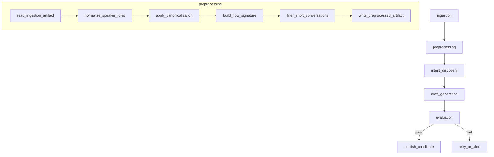

# [ML-1-2-3] Preprocessing Stage

> Backlog 1.2.3 · Branch: `spec/1-2-3`

---

## Goal

ingestion 스테이지 산출물(`conversations.jsonl`)을 읽어 conversation 단위로 정규화된 텍스트 표현(`canonical_text`, `customer_problem_text`)과 절차 특성 벡터(`flow_signature`, 61차원)를 생성하고, `preprocessed_conversations.json`으로 저장한다.

---

## DAG Diagram



---

## Stage Interface

### Input

| 필드 | 타입 | 설명 | 예시 |
|------|------|------|------|
| `upstream_manifest_path` | `str \| None` | ingestion 스테이지 manifest.json 경로 | `"/opt/airflow/artifacts/.../ingestion/manifest.json"` |

ingestion artifact 디렉터리에서 읽는 파일:

| 파일 | 형식 | 설명 |
|------|------|------|
| `conversations.jsonl` | JSONL | conversation 단위 원본 데이터 (1줄 = 1 conversation) |

`conversations.jsonl` 한 줄 스키마:

```json
{
  "id": "conv_001",
  "dataset_id": "ds_2026q1",
  "channel": "chat",
  "ended_status": "resolved",
  "turns": [
    {
      "turn_index": 0,
      "speaker_role": "AGENT",
      "message_text": "안녕하세요, 상담원입니다."
    },
    {
      "turn_index": 1,
      "speaker_role": "CUSTOMER",
      "message_text": "주문 환불 요청하고 싶어요."
    }
  ]
}
```

### Output

| 파일 | 형식 | 설명 |
|------|------|------|
| `preprocessed_conversations.json` | JSON | 전처리 결과 전체 (conversations 배열 + stats) |
| `manifest.json` | JSON | 스테이지 메타정보 (공통 helper 생성) |

### Configuration

환경변수:

| 변수 | 기본값 | 설명 |
|------|--------|------|
| `PIPELINE_ARTIFACT_ROOT` | `/opt/airflow/artifacts` | artifact 저장 루트 (`PipelineRuntimeConfig.from_env()`) |
| `PREPROCESSING_MIN_TURNS` | `2` | 필터링 최소 전체 턴 수 |
| `PREPROCESSING_MIN_CUSTOMER_TURN_LEN` | `5` | 필터링 최소 고객 텍스트 길이 (문자 수) |

---

## Stage Implementation

### 함수 시그니처

```python
# ml/src/pipeline/stages/preprocessing/main.py

def run(upstream_manifest_path: str | None = None) -> None:
    """
    ingestion artifact를 읽어 전처리 결과를 저장한다.

    Args:
        upstream_manifest_path: ingestion manifest.json 경로.
            None이면 환경변수에서 StageContext를 구성한다.
    """
    ...
```

### 내부 호출 흐름

```
run()
  ├── PipelineRuntimeConfig.from_env()
  ├── StageContext(stage_name="preprocessing")
  ├── get_stage_logger(stage_context)
  ├── io.read_ingestion_artifact(upstream_manifest_path) -> Iterable[Conversation]
  └── for conv in conversations:
        ├── canonicalize.normalize_speaker_roles(conv) -> Conversation
        ├── canonicalize.apply_canonicalization(conv) -> tuple[str, str]
        │     # returns (canonical_text, customer_problem_text)
        ├── flow_signature.build_signature(conv) -> np.ndarray[61]
        └── filter: turn_count < MIN_TURNS or len(customer_problem_text) < MIN_LEN
  └── io.write_preprocessed_artifact(stage_context, runtime_config, processed)
```

서브 모듈 위치:

| 모듈 | 경로 |
|------|------|
| `io` | `pipeline.stages.preprocessing.io` |
| `canonicalize` | `pipeline.stages.preprocessing.canonicalize` |
| `flow_signature` | `pipeline.stages.preprocessing.flow_signature` |

### 알고리즘 단계 (canonicalize.apply_canonicalization)

1. **PII 마스킹** (`_mask_pii`): 주민번호(`\d{6}[-.]?\d{7}`), 휴대폰(`\d{3}[-.]\d{4}[-.]\d{4}`), 일반전화(`\d{2,3}[-.]\d{3,4}[-.]\d{4}`) 패턴을 `[MASKED]`로 치환
2. **Greeting 제거** (`_remove_greetings`): 8개 패턴 (안녕하세요, 감사합니다, 수고하세요 등) 포함 발화 제거
3. **Script 제거** (`_remove_scripts`): 상담사 전용 8개 패턴 (말씀 부탁, 확인 가능 등) 포함 발화 제거
4. **Stopword 제거** (`_remove_stopwords`): 10개 한국어 stopword (저희, 고객님, 혹시, 입니다, 합니다 등) 제거
5. **Purpose 추출** (`_extract_purpose_sentences`): 10개 키워드 (해결, 문제, 요청, 변경, 취소, 환불, 신청, 문의, 확인, 조회) 포함 문장 추출 → `customer_problem_text`

`canonical_text`: 전체 발화에 1~4 단계 적용 후 공백 join  
`customer_problem_text`: CUSTOMER 발화에만 1~5 단계 적용

### flow_signature 차원 정의

`build_signature(conv) -> np.ndarray[61]` 구성:

| 구간 | 차원 수 | 내용 |
|------|---------|------|
| histogram | 7 | EVENT_TYPES 7개 각 빈도 |
| transition matrix | 49 | 7×7 이벤트 전이 행렬 |
| flags | 2 | escalation 여부, exception 여부 |
| outcome one-hot | 3 | 해결 / 이관 / 기타 |
| **합계** | **61** | |

EVENT_TYPES (7개): `["이관", "해결", "불만표현", "추가정보요청", "정책안내", "확인질문", "예외처리"]`

---

## Metrics

| 메트릭 | 단위 | 설명 |
|--------|------|------|
| `input_count` | count | ingestion에서 읽은 conversation 수 |
| `output_count` | count | 필터링 후 출력된 conversation 수 |
| `filtered_count` | count | 필터링으로 제외된 conversation 수 |
| `pii_masked_count` | count | PII 마스킹이 1회 이상 발생한 conversation 수 |
| `avg_canonical_text_length` | float | 출력 canonical_text 평균 문자 수 |
| `empty_customer_text_count` | count | customer_problem_text가 빈 conversation 수 |
| `processing_duration_seconds` | float | 전체 처리 소요 시간 |

---

## Artifact Schema

### preprocessed_conversations.json

```json
{
  "schema_version": "1.0",
  "stage": "preprocessing",
  "generated_at": "2026-04-27T12:00:00Z",
  "source_manifest": "ingestion/manifest.json",
  "conversations": [
    {
      "id": "conv_001",
      "dataset_id": "ds_2026q1",
      "channel": "chat",
      "ended_status": "resolved",
      "canonical_text": "주문 환불 요청 결제 확인 [MASKED] 처리",
      "customer_problem_text": "주문 환불 요청 결제 확인",
      "flow_signature": [0.0, 0.125, 0.0, 0.25, 0.125, 0.375, 0.125, 0.0, 0.0, 0.0, 0.0, 0.0, 0.0, 0.0, 0.0, 0.0, 0.0, 0.0, 0.0, 0.0, 0.0, 0.0, 0.0, 0.0, 0.0, 0.0, 0.0, 0.0, 0.0, 0.0, 0.0, 0.0, 0.0, 0.0, 0.0, 0.0, 0.0, 0.0, 0.0, 0.0, 0.0, 0.0, 0.0, 0.0, 0.0, 0.0, 0.0, 0.0, 0.0, 0.0, 0.0, 0.0, 0.0, 0.0, 0.0, 0.0, 0.0, 0.0, 0.0, 1.0, 0.0],
      "flow_signature_dim": 61,
      "turn_count": 8,
      "customer_turn_count": 4,
      "pii_mask_count": 1,
      "filtered": false
    }
  ],
  "stats": {
    "input_count": 100,
    "output_count": 95,
    "filtered_count": 5,
    "pii_masked_count": 12,
    "avg_canonical_text_length": 42.3,
    "empty_customer_text_count": 0,
    "processing_duration_seconds": 1.24
  }
}
```

### manifest.json

`pipeline.common.artifacts.write_stage_manifest`이 생성하는 공통 포맷:

```json
{
  "dag_id": "domain_pack_generation",
  "run_id": "manual__2026-04-27T12:00:00+00:00",
  "stage_name": "preprocessing",
  "workspace_id": "ws_001",
  "dataset_id": "ds_2026q1",
  "pipeline_job_id": "job_001",
  "artifact_root": "/opt/airflow/artifacts",
  "generated_at": "2026-04-27T12:00:00Z",
  "payload": {
    "artifact_path": "preprocessed_conversations.json",
    "output_count": 95,
    "filtered_count": 5
  }
}
```

---

## Tests

### Unit Tests

```python
# tests/pipeline/stages/preprocessing/test_canonicalize.py

class TestMaskPii:
    def test_masks_resident_number(self): ...
    def test_masks_mobile_phone(self): ...
    def test_masks_landline_phone(self): ...
    def test_no_pii_returns_unchanged(self): ...

class TestRemoveGreetings:
    def test_removes_greeting_turns(self): ...
    def test_non_greeting_turns_preserved(self): ...

class TestRemoveScripts:
    def test_removes_agent_script_turns(self): ...
    def test_customer_turns_not_affected(self): ...

class TestRemoveStopwords:
    def test_removes_known_stopwords(self): ...

class TestExtractPurposeSentences:
    def test_extracts_sentences_with_keywords(self): ...
    def test_returns_empty_when_no_keywords(self): ...

class TestApplyCanonicalization:
    def test_returns_canonical_and_customer_text(self): ...
    def test_pii_masked_in_canonical_text(self): ...
```

```python
# tests/pipeline/stages/preprocessing/test_flow_signature.py

class TestBuildSignature:
    def test_output_shape_is_61(self): ...
    def test_histogram_sums_to_one_or_zero(self): ...
    def test_empty_events_returns_zero_vector(self): ...
    def test_escalation_flag_set_when_event_present(self): ...
    def test_outcome_onehot_resolved(self): ...
```

### Integration Tests

```python
# tests/pipeline/stages/preprocessing/test_main.py

class TestPreprocessingRun:
    def test_run_produces_output_file(self, tmp_path, mock_ingestion_jsonl):
        """tmp_path에 mock JSONL 생성 후 run() 호출 → preprocessed_conversations.json 존재 확인"""
        ...

    def test_run_filters_short_conversations(self, tmp_path, mock_ingestion_jsonl):
        """MIN_TURNS 미만 conversation이 filtered=True로 기록되는지 확인"""
        ...

    def test_run_with_empty_jsonl_produces_empty_artifact(self, tmp_path):
        """빈 JSONL → output_count=0, filtered_count=0, 파일 정상 생성"""
        ...

    def test_run_stats_match_actual_counts(self, tmp_path, mock_ingestion_jsonl):
        """stats.output_count + stats.filtered_count == stats.input_count"""
        ...
```

### Test Checklist

- [ ] PII 마스킹: 주민번호, 휴대폰, 일반전화 패턴 각각 치환 확인
- [ ] Greeting 제거: 8개 패턴 포함 발화 제거 확인
- [ ] Script 제거: 상담사 전용 패턴 제거, 고객 발화 보존 확인
- [ ] Stopword 제거: 10개 stopword 제거 확인
- [ ] Purpose 추출: 키워드 포함 문장 추출, 없으면 빈 문자열 확인
- [ ] flow_signature: 출력 shape (61,) 확인
- [ ] flow_signature: histogram + transition + flags + outcome 합산 61 확인
- [ ] 통합: tmp_path + mock JSONL → run() → 파일 생성 확인
- [ ] 통합: stats 카운트 일관성 (input = output + filtered)
- [ ] 통합: 빈 JSONL → 경고 로그 + 빈 artifact 생성 (예외 없음)

---

## Error Handling

| 상황 | 처리 방식 |
|------|----------|
| `PIPELINE_ARTIFACT_ROOT` 미설정 | `PipelineConfigurationError` raise |
| JSONL 파싱 실패 (개별 라인) | 해당 라인 skip + 카운터 증가, 로그 경고 |
| JSONL 전체 실패 (100%) | `PipelineStageError` raise |
| 출력 파일 쓰기 실패 | `PipelineStageError` raise |
| 빈 dataset (input_count=0) | 경고 로그 + 빈 artifact 출력 (raise 아님) |

`PipelineStageError`는 `pipeline.common.exceptions`에 추가:

```python
class PipelineStageError(RuntimeError):
    """Raised when a pipeline stage fails to complete processing."""
```

---

## Monitoring

`pipeline.common.logging.get_stage_logger`를 사용한다:

```python
logger = get_stage_logger(stage_context)

# 스테이지 시작
logger.info("stage_started", extra={"input_path": upstream_manifest_path})

# 처리 완료
logger.info(
    "stage_completed",
    extra={
        "input_count": stats["input_count"],
        "output_count": stats["output_count"],
        "filtered_count": stats["filtered_count"],
        "duration_seconds": stats["processing_duration_seconds"],
    },
)

# 개별 라인 파싱 실패
logger.warning("jsonl_line_skipped", extra={"line_no": n, "reason": str(e)})

# 빈 dataset
logger.warning("empty_dataset", extra={"input_count": 0})
```

---

## Dependencies

```toml
# pyproject.toml (추가 또는 확인)
[project]
dependencies = [
    "numpy>=2.0",
    "orjson>=3.10",  # 선택: JSON 직렬화 성능 향상
]
```

- `numpy>=2.0`: `requires_python>=3.11`, Python 3.13 호환 확인 [OK]
- `orjson>=3.10`: `requires_python>=3.10`, Python 3.13 호환 확인 [OK]

---

## DAG Task Definition

```python
# ml/src/dags/domain_pack_generation.py (발췌)

from airflow.operators.python import PythonOperator

def create_preprocessing_task(dag):
    def execute(**context):
        from pipeline.stages.preprocessing.main import run

        ti = context["task_instance"]
        ingestion_result = ti.xcom_pull(task_ids="ingestion")
        upstream_manifest_path = ingestion_result.get("manifest_path") if ingestion_result else None

        run(upstream_manifest_path=upstream_manifest_path)

        return {"stage": "preprocessing", "status": "success"}

    return PythonOperator(
        task_id="preprocessing",
        python_callable=execute,
        dag=dag,
        retries=1,
    )
```

---

## Additional Notes

- `flow_signature_dim: 61`은 artifact 필드에 항상 명시한다. 다운스트림 스테이지(intent_discovery)가 차원 검증에 사용한다.
- `filtered: false` 필드는 필터링된 conversation도 artifact에 포함하되 플래그로 구분한다. 다운스트림은 `filtered=false`인 항목만 사용한다.
- `customer_problem_text`가 빈 문자열인 경우 `filtered`를 `true`로 설정하지 않는다. 별도 `empty_customer_text_count` 메트릭으로 추적한다.
- `orjson`은 선택 의존성이다. 없으면 표준 `json` 모듈로 fallback한다.

---

## Re-confirm Note

ingestion 출력 contract(`conversations.jsonl` 스키마)는 ingestion 스펙 확정 시 재검토한다. 본 문서 작성 시점에는 가정에 기반한다.
