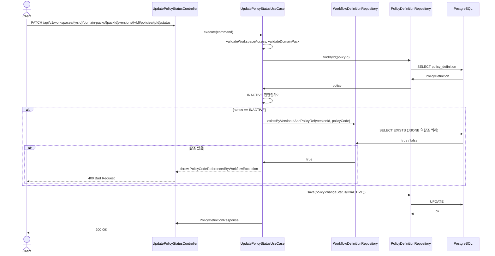

# [BE] policyCode INACTIVE 전환 시 graphJson policyRef 역참조 무결성 처리

> Issue: #100
> Branch: `spec/100`
> Template: `_TEMPLATE_BE.md`
> Scope: `UpdatePolicyStatusUseCase` — INACTIVE 전환 시 graphJson 역참조 체크 추가

---

## Goal

policy를 INACTIVE로 전환할 때, 같은 버전 내 workflow의 graphJson에 해당 policyCode가 `policyRef`로 참조되고 있으면 전환을 거부하여 stale policyRef 발생을 원천 차단한다.

---

## Sequence Diagram



---

## REST API

### Endpoint

| Method | Path | Description |
|--------|------|-------------|
| PATCH | `/api/v1/workspaces/{workspaceId}/domain-packs/{packId}/versions/{versionId}/policies/{policyId}/status` | policy 상태 변경 |

기존 엔드포인트 유지. 신규 에러 케이스만 추가.

### Request

```json
{ "status": "INACTIVE" }
```

### Response

**200 OK** — 기존과 동일 (`PolicyDefinitionResponse`)

**400 Bad Request** — INACTIVE 전환 시 policyRef 참조 workflow 존재

```json
{
  "code": "POLICY_CODE_REFERENCED_BY_WORKFLOW",
  "message": "해당 정책 코드를 참조하는 워크플로우가 존재하여 비활성화할 수 없습니다."
}
```

---

## Class Design

### 변경 대상 파일

```
application/
  UpdatePolicyStatusUseCase.java        — INACTIVE 분기에 역참조 체크 추가
  exception/
    PolicyCodeReferencedByWorkflowException.java   — 신규

domain/repository/
  WorkflowDefinitionRepository.java    — existsByVersionIdAndPolicyRef 메서드 추가

infrastructure/persistence/
  JpaWorkflowDefinitionRepository.java — @Query(JSONB) 구현 추가
```

### 신규 예외

```java
// BadRequestException 계열 (HTTP 400)
public class PolicyCodeReferencedByWorkflowException extends BadRequestException {

    public PolicyCodeReferencedByWorkflowException(String policyCode) {
        super("POLICY_CODE_REFERENCED_BY_WORKFLOW",
              "해당 정책 코드를 참조하는 워크플로우가 존재하여 비활성화할 수 없습니다. policyCode=" + policyCode);
    }
}
```

### Repository 인터페이스 변경

```java
// WorkflowDefinitionRepository.java 에 추가
boolean existsByDomainPackVersionIdAndPolicyRef(Long versionId, String policyCode);
```

### JPA 구현 — JSONB 역참조 쿼리

graphJson 구조:
```json
{
  "nodes": [
    { "id": "n1", "type": "ACTION", "policyRef": "refund_check" },
    ...
  ]
}
```

```java
// JpaWorkflowDefinitionRepository.java 에 추가
@Query(
  value = """
    SELECT CASE WHEN COUNT(*) > 0 THEN TRUE ELSE FALSE END
    FROM pack.workflow_definition
    WHERE domain_pack_version_id = :versionId
      AND graph_json -> 'nodes' @> jsonb_build_array(jsonb_build_object('policyRef', :policyCode))
    """,
  nativeQuery = true)
boolean existsByDomainPackVersionIdAndPolicyRef(
    @Param("versionId") Long versionId,
    @Param("policyCode") String policyCode);
```

### UseCase 변경 포인트

```java
// UpdatePolicyStatusUseCase.execute() 내 changeStatus 호출 직전에 삽입
if (PolicyDefinition.STATUS_INACTIVE.equals(command.status())) {
    String policyCode = policy.getPolicyCode();
    if (workflowRepository.existsByDomainPackVersionIdAndPolicyRef(command.versionId(), policyCode)) {
        throw new PolicyCodeReferencedByWorkflowException(policyCode);
    }
}
```

`UpdatePolicyStatusUseCase`에 `WorkflowDefinitionRepository` 생성자 주입 추가 필요.

---

## Tests

### Unit Tests — `UpdatePolicyStatusUseCaseTest`

기존 테스트에 아래 케이스 추가:

```java
@Test
@DisplayName("INACTIVE 전환 시 policyRef 참조 workflow 존재 → PolicyCodeReferencedByWorkflowException")
void should_역참조예외_when_INACTIVE전환시참조workflow존재() {
    given(versionRepository.findById(10L)).willReturn(Optional.of(draftVersion(10L, 7L)));
    PolicyDefinition policy = policy(55L, 10L);  // policyCode = "refund_check"
    given(policyRepository.findById(55L)).willReturn(Optional.of(policy));
    given(workflowRepository.existsByDomainPackVersionIdAndPolicyRef(10L, "refund_check"))
        .willReturn(true);

    assertThatThrownBy(() ->
        useCase.execute(new UpdatePolicyStatusCommand(1L, 7L, 10L, 55L, 5L, PolicyDefinition.STATUS_INACTIVE)))
        .isInstanceOf(PolicyCodeReferencedByWorkflowException.class);
    verify(policyRepository, never()).save(any());
}

@Test
@DisplayName("INACTIVE 전환 시 참조 workflow 없음 → 정상 전환")
void should_INACTIVE전환성공_when_참조workflow없음() {
    given(versionRepository.findById(10L)).willReturn(Optional.of(draftVersion(10L, 7L)));
    PolicyDefinition policy = policy(55L, 10L);
    given(policyRepository.findById(55L)).willReturn(Optional.of(policy));
    given(workflowRepository.existsByDomainPackVersionIdAndPolicyRef(10L, "refund_check"))
        .willReturn(false);
    given(policyRepository.save(any())).willReturn(policy);

    PolicyDefinitionResponse result =
        useCase.execute(new UpdatePolicyStatusCommand(1L, 7L, 10L, 55L, 5L, PolicyDefinition.STATUS_INACTIVE));

    assertThat(result.status()).isEqualTo(PolicyDefinition.STATUS_INACTIVE);
}

@Test
@DisplayName("ACTIVE 전환 시 역참조 체크 스킵")
void should_역참조체크스킵_when_ACTIVE전환() {
    given(versionRepository.findById(10L)).willReturn(Optional.of(draftVersion(10L, 7L)));
    PolicyDefinition policy = policy(55L, 10L);
    ReflectionTestUtils.setField(policy, "status", PolicyDefinition.STATUS_INACTIVE);
    given(policyRepository.findById(55L)).willReturn(Optional.of(policy));
    given(policyRepository.save(any())).willReturn(policy);

    useCase.execute(new UpdatePolicyStatusCommand(1L, 7L, 10L, 55L, 5L, PolicyDefinition.STATUS_ACTIVE));

    verify(workflowRepository, never()).existsByDomainPackVersionIdAndPolicyRef(any(), any());
}
```

### Integration Tests — `UpdatePolicyStatusControllerTest`

기존 테스트 파일에 추가:

```java
@Test
@DisplayName("INACTIVE 전환 시 policyRef 참조 workflow 존재 → 400")
void updatePolicyStatus_inactiveWithReferencedWorkflow_returns400() throws Exception {
    // given: workflow가 해당 policyCode를 policyRef로 참조하는 상태 세팅
    // 구체적 픽스처는 기존 테스트 헬퍼 패턴 따름

    mockMvc.perform(patch(".../{policyId}/status")
            .contentType(MediaType.APPLICATION_JSON)
            .content("{\"status\": \"INACTIVE\"}"))
        .andExpect(status().isBadRequest())
        .andExpect(jsonPath("$.code").value("POLICY_CODE_REFERENCED_BY_WORKFLOW"));
}
```

### Test Checklist

- [x] INACTIVE 전환 시 참조 있음 → `PolicyCodeReferencedByWorkflowException` 발생, save 미호출
- [x] INACTIVE 전환 시 참조 없음 → 정상 INACTIVE 전환
- [x] ACTIVE 전환 시 역참조 체크 스킵
- [ ] 통합 테스트: INACTIVE + 참조 있음 → 400 + 에러 코드 `POLICY_CODE_REFERENCED_BY_WORKFLOW`
- [ ] 통합 테스트: INACTIVE + 참조 없음 → 200

---

## Database

### Migration

신규 DDL 없음. 기존 `pack.workflow_definition.graph_json` JSONB 컬럼을 PostgreSQL `@>` 연산자로 조회.

### JSONB 쿼리 전제 조건

`graph_json -> 'nodes'` 경로가 배열이고, 각 노드 객체에 `policyRef` 키가 존재함.
spec 3215에서 확정된 graphJson 구조 기준.

---

## Additional Notes

- policyCode rename은 현재 미지원 (policyCode immutable) → 이번 scope 외
- `UpdatePolicyStatusUseCase`에 `WorkflowDefinitionRepository` 의존성 추가 시 생성자 주입 규칙 준수
- GlobalExceptionHandler에 `PolicyCodeReferencedByWorkflowException` 핸들러 추가 필요 (BadRequestException 계열이면 기존 fallback으로 처리 가능하지만 명시적 핸들러 권장)
