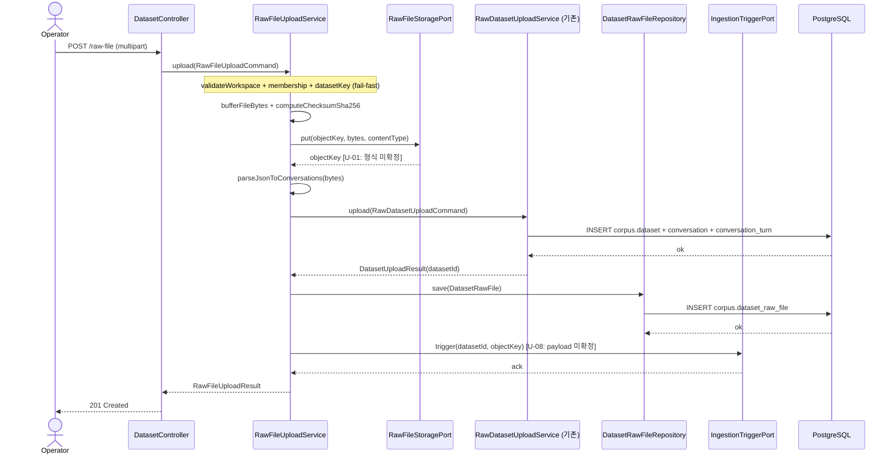

# [Infra] 1.1.4 상담 데이터 raw 파일 클라우드 스토리지 선정 및 세팅 및 저장

**Canonical Number**: `114`
**Branch**: `spec/114`
**Template Base**: `_TEMPLATE_BE.md`
**작성일**: 2026-04-16

---

## Goal

운영자가 `multipart/form-data`로 상담 로그 JSON 파일을 업로드하면, 서버가 AWS S3(로컬 개발: MinIO)에 원본을 저장하고, 파싱하여 PostgreSQL `corpus` 스키마에 적재한 뒤 Airflow ingestion 파이프라인을 트리거하는 신규 엔드포인트와 스토리지 어댑터를 구축한다.

---

## Sequence Diagram



> **확정**: S3 put 성공 후 DB 실패 시 orphan 파일 처리 정책: best-effort delete + WARN 로그 + 원예외 전파.
> 상세 결정 근거는 `.handoff/114/uncertainty-register-114.md` U-05 참조.

---

## REST API

### Endpoints

| Method | Path | Description |
|--------|------|-------------|
| POST | `/api/v1/workspaces/{workspaceId}/datasets/raw-file` | multipart 파일 업로드 **(신규)** |
| POST | `/api/v1/workspaces/{workspaceId}/datasets/raw` | JSON body 직접 업로드 (기존, 유지) |

### Request

**POST /api/v1/workspaces/{workspaceId}/datasets/raw-file**

`Content-Type: multipart/form-data`

| Part | Type | Required | Constraints | Description |
|------|------|----------|-------------|-------------|
| `file` | `MultipartFile` | Yes | `.json` 파일 | 상담 로그 JSON 배열 파일 |
| `datasetKey` | `@RequestParam` | Yes | max 100자 | 데이터셋 식별 키 |
| `name` | `@RequestParam` | Yes | max 255자 | 데이터셋 이름 |
| `sourceType` | `@RequestParam` | Yes | max 50자 | 소스 타입 |

> **파일 크기 상한**: 50MB / 파일 1개 per 요청. `spring.servlet.multipart.max-file-size=50MB` 설정 필요.

JSON 파일 포맷 (배열):

```json
[
  {
    "source_id": "40001",
    "source": "엘지유플러스",
    "consulting_category": "배송문의",
    "client_gender": "",
    "client_age": "",
    "consulting_turns": "49",
    "consulting_length": 592,
    "consulting_content": "상담사: ...\n고객: ..."
  }
]
```

### Response

**201 Created**

```json
{
  "datasetId": 42,
  "datasetKey": "lgu-2026-04",
  "workspaceId": 1,
  "objectKey": "workspaces/1/datasets/lgu-2026-04/a1b2c3d4-e5f6-7890-abcd-ef1234567890_lgu-2026-04_1.json",
  "originalFilename": "엘지유플러스_1.json",
  "sizeBytes": 17825792,
  "status": "READY",
  "piiRedactionStatus": "PENDING",
  "conversationCount": 3216
}
```

**400 Bad Request** — 파일 없음 / 검증 실패 / JSON 파싱 오류

```json
{
  "code": "VALIDATION_ERROR",
  "message": "파일이 없거나 형식이 올바르지 않습니다."
}
```

**403 Forbidden** — 비멤버 접근

```json
{
  "code": "UNAUTHORIZED_WORKSPACE_ACCESS",
  "message": "워크스페이스에 접근 권한이 없습니다."
}
```

**404 Not Found** — 워크스페이스 미존재

```json
{
  "code": "NOT_FOUND",
  "message": "워크스페이스를 찾을 수 없습니다. id=999"
}
```

**409 Conflict** — datasetKey 중복

```json
{
  "code": "DATASET_KEY_CONFLICT",
  "message": "이미 사용 중인 데이터셋 키입니다: lgu-2026-04"
}
```

**500 Internal Server Error**

```json
{
  "code": "INTERNAL_SERVER_ERROR",
  "message": "서버 오류가 발생했습니다."
}
```

---

## Class Design

### DDD Layered Structure

```
corpus/
├── presentation/
│   ├── DatasetController.java                    (기존 — 신규 메서드 추가)
│   └── dto/
│       └── RawFileUploadResponse.java            (신규)
├── application/
│   ├── RawFileUploadService.java                 (신규 — 오케스트레이터)
│   ├── RawFileUploadCommand.java                 (신규)
│   └── port/
│       ├── RawFileStoragePort.java               (신규 — S3 인터페이스)
│       └── IngestionTriggerPort.java             (신규 — Airflow 트리거 인터페이스)
├── domain/
│   ├── model/
│   │   └── DatasetRawFile.java                   (신규 — corpus.dataset_raw_file 엔티티)
│   └── repository/
│       └── DatasetRawFileRepository.java         (신규 인터페이스)
└── infrastructure/
    ├── storage/
    │   └── S3RawFileStorageAdapter.java          (신규 — AWS SDK v2, MinIO 호환)
    ├── airflow/
    │   └── AirflowIngestionTriggerAdapter.java   (신규)
    └── persistence/
        └── JpaDatasetRawFileRepository.java      (신규)
```

### Aggregate Design

```java
// corpus/domain/model/DatasetRawFile.java
@Entity
@Table(name = "dataset_raw_file", schema = "corpus")
public class DatasetRawFile {
    @Id
    @GeneratedValue(strategy = GenerationType.IDENTITY)
    private Long id;

    @Column(name = "dataset_id", nullable = false)
    private Long datasetId;

    @Column(name = "object_key", nullable = false, length = 1024)
    private String objectKey;

    @Column(name = "original_filename", nullable = false, length = 255)
    private String originalFilename;

    @Column(name = "content_type", nullable = false, length = 100)
    private String contentType;

    @Column(name = "size_bytes", nullable = false)
    private Long sizeBytes;

    @Column(name = "checksum_sha256", nullable = false, length = 64)
    private String checksumSha256;

    @Column(name = "uploaded_at", nullable = false)
    private Instant uploadedAt;

    // public setter 금지 — 상태 변경은 도메인 메서드로만
    public static DatasetRawFile create(
            Long datasetId, String objectKey, String originalFilename,
            String contentType, Long sizeBytes, String checksumSha256) {
        // factory method — uploadedAt = Instant.now()
    }
}
```

### Port Interfaces

```java
// application/port/RawFileStoragePort.java
public interface RawFileStoragePort {
    /**
     * objectKey 위치에 파일 bytes를 저장하고 확정된 objectKey를 반환한다.
     * endpoint는 프로파일에 따라 AWS S3 또는 MinIO로 전환된다.
     */
    String put(String objectKey, byte[] content, String contentType);

    /**
     * objectKey 위치의 파일을 삭제한다.
     * S3 put 성공 + DB 실패 시 orphan 보상 처리용.
     */
    void delete(String objectKey);
}

// application/port/IngestionTriggerPort.java
public interface IngestionTriggerPort {
    /**
     * Airflow ingestion 파이프라인을 트리거한다.
     * payload 스펙은 uncertainty-register-114.md U-08 참조.
     */
    void trigger(Long datasetId, String objectKey);
}
```

### Command / Response

```java
// application/RawFileUploadCommand.java
public record RawFileUploadCommand(
    Long workspaceId,
    String datasetKey,
    String name,
    String sourceType,
    Long createdBy,
    byte[] fileBytes,         // controller가 MultipartFile.getBytes()로 추출
    String originalFilename,
    String contentType,
    long sizeBytes
) {}

// presentation/dto/RawFileUploadResponse.java
public record RawFileUploadResponse(
    Long datasetId,
    String datasetKey,
    Long workspaceId,
    String objectKey,
    String originalFilename,
    Long sizeBytes,
    String status,
    String piiRedactionStatus,
    int conversationCount
) {}
```

---

## Tests

### Unit Tests

```java
@DisplayName("RawFileUploadService")
@ExtendWith(MockitoExtension.class)
class RawFileUploadServiceTest {

    @Test
    @DisplayName("should_성공_when_유효한_multipart_파일")
    void upload_success_returnsRawFileUploadResult() {
        // given — mock storagePort, mock rawDatasetUploadService, mock repo, mock triggerPort
        // when
        // then — storagePort.put() 1회, rawDatasetUploadService.upload() 1회,
        //         repo.save() 1회, triggerPort.trigger() 1회
    }

    @Test
    @DisplayName("should_throw_WorkspaceNotFoundException_when_워크스페이스_없음")
    void upload_workspaceNotFound_throwsException() { }

    @Test
    @DisplayName("should_throw_UnauthorizedWorkspaceAccessException_when_비멤버")
    void upload_notMember_throwsException() { }

    @Test
    @DisplayName("should_throw_DatasetKeyConflictException_when_키_중복")
    void upload_datasetKeyConflict_throwsException() { }
}
```

```java
@DisplayName("DatasetRawFile")
class DatasetRawFileTest {
    @Test
    @DisplayName("should_create_with_all_required_fields")
    void create_withValidFields_returnsEntity() {
        // given / when / then — all fields set, uploadedAt is non-null
    }
}
```

### Integration Tests

```java
@WebMvcTest(DatasetController.class)
@DisplayName("DatasetController — raw-file upload")
class DatasetControllerRawFileTest {

    @Test
    @DisplayName("POST /raw-file — 성공 시 201 반환")
    void uploadRawFile_returns201() throws Exception {
        // given
        MockMultipartFile mockFile = new MockMultipartFile(
            "file", "test.json", "application/json", validJsonBytes);
        given(rawFileUploadService.upload(any())).willReturn(validResult);

        // when & then
        mockMvc.perform(multipart("/api/v1/workspaces/1/datasets/raw-file")
                .file(mockFile)
                .param("datasetKey", "test-key")
                .param("name", "테스트 데이터셋")
                .param("sourceType", "LGU"))
            .andExpect(status().isCreated())
            .andExpect(jsonPath("$.datasetId").isNumber())
            .andExpect(jsonPath("$.objectKey").isString());
    }

    @Test
    @DisplayName("POST /raw-file — file 파트 없음 시 400")
    void uploadRawFile_missingFile_returns400() throws Exception { }
}
```

### Test Checklist

- [ ] 정상 시나리오: 유효 multipart → 201 + datasetId/objectKey 반환
- [ ] file 파트 누락 → 400
- [ ] datasetKey 누락 → 400
- [ ] 잘못된 JSON 파일 → 400
- [ ] 워크스페이스 없음 → 404
- [ ] 비멤버 접근 → 403
- [ ] datasetKey 중복 → 409
- [ ] S3RawFileStorageAdapter 단위: MinIO endpoint override + put 동작 검증
- [ ] 트랜잭션: corpus.dataset_raw_file INSERT 실패 시 롤백 확인

---

## Database

### Migration (Liquibase — `db.changelog-master.sql` 말미에 추가)

```sql
--changeset devjhan:20260416-create-corpus-dataset-raw-file-table
--comment: S3 원본 파일 메타데이터 보관 테이블 신설 (archive + audit 목적)
CREATE TABLE corpus.dataset_raw_file (
    id                BIGSERIAL     PRIMARY KEY,
    dataset_id        BIGINT        NOT NULL REFERENCES corpus.dataset(id) ON DELETE CASCADE,
    object_key        VARCHAR(1024) NOT NULL,
    original_filename VARCHAR(255)  NOT NULL,
    content_type      VARCHAR(100)  NOT NULL,
    size_bytes        BIGINT        NOT NULL,
    checksum_sha256   VARCHAR(64)   NOT NULL,
    uploaded_at       TIMESTAMPTZ   NOT NULL DEFAULT NOW()
);

CREATE INDEX idx_dataset_raw_file_dataset_id
    ON corpus.dataset_raw_file(dataset_id);
```

> **corpus.dataset 변경 없음** — Confirmed.

---

## Additional Notes

- **계층 의존성**: `presentation → application → domain ← infrastructure` (DDD 표준).
- `RawDatasetUploadService`는 내부 위임 호출로만 사용. 기존 코드 변경 없음.
- `S3RawFileStorageAdapter`는 `software.amazon.awssdk:s3` (v2) 사용.
  `EndpointOverride` 설정으로 MinIO(local)와 AWS S3(prod/dev)를 프로파일별 전환.
- **S3 object key 형식** (Confirmed): `workspaces/{workspaceId}/datasets/{datasetKey}/{uniquePrefix}_{normalizedFilename}`
  - `normalizedFilename`: `originalFilename`에서 허용 문자(`[a-zA-Z0-9._-]`) 외 문자(슬래시, 제어 문자 등) 제거/치환한 결과
  - `uniquePrefix`: UUID v4 또는 SHA-256 콘텐츠 해시 앞 8자 — key 충돌 방지 및 동명 파일 재업로드 허용
  - 예: `a1b2c3d4-e5f6-7890-abcd-ef1234567890_lgu-2026-04_1.json`
  - **raw `originalFilename`을 objectKey에 직접 사용 금지** — 경로 순회(`../`), 특수문자, URL 인코딩 문제 방지
- **버킷 전략** (Confirmed): 환경별 버킷 분리 + 워크스페이스는 object key 경로로 분리.
  버킷명 예: `init-raw-files-prod`, `init-raw-files-dev`, `init-raw-files-local`.
  `STORAGE_S3_BUCKET` 환경 변수로 배포 환경별 주입.
- **파일 크기 상한** (Confirmed): 50MB / 1 파일 per 요청.
  `spring.servlet.multipart.max-file-size=50MB`, `max-request-size=55MB` 설정 필요.
- **`consulting_content` 제한** (Confirmed): `/raw-file` 경로는 제한 없음.
  기존 `/raw` 경로의 `@Size(max = 5000)` 제약은 변경하지 않음.
- **Orphan 처리** (Confirmed): S3 put 성공 + DB 실패 시, best-effort `S3Client.deleteObject()` 호출.
  deleteObject 자체 실패 시 WARN 로그 + 원 DB 예외를 caller에게 propagate.
- **Airflow 트리거** (Assumption — NOOP stub): payload 미확정으로 `AirflowIngestionTriggerAdapter`는
  NOOP 구현으로 임시 대체. `// TODO: spec/114 U-08` 주석 포함 필수.
- `@Transactional(readOnly = true)` 기본값 + 쓰기 메서드 개별 오버라이드 패턴 적용.
- `RawFileUploadService`는 fail-fast를 위해 S3 IO 전에 workspace/membership/datasetKey 검증 선행.
  (`RawDatasetUploadService` 내부 재검증과 중복되나 불필요한 S3 IO 방지를 위해 유지.)
- 보조 설계 문서:
  - ADR: `.agent/specs/114/adr-storage-selection.md`
  - 인프라 런북: `.agent/specs/114/infra-setup.md`
  - 불확실성 관리: `.handoff/114/uncertainty-register-114.md`
