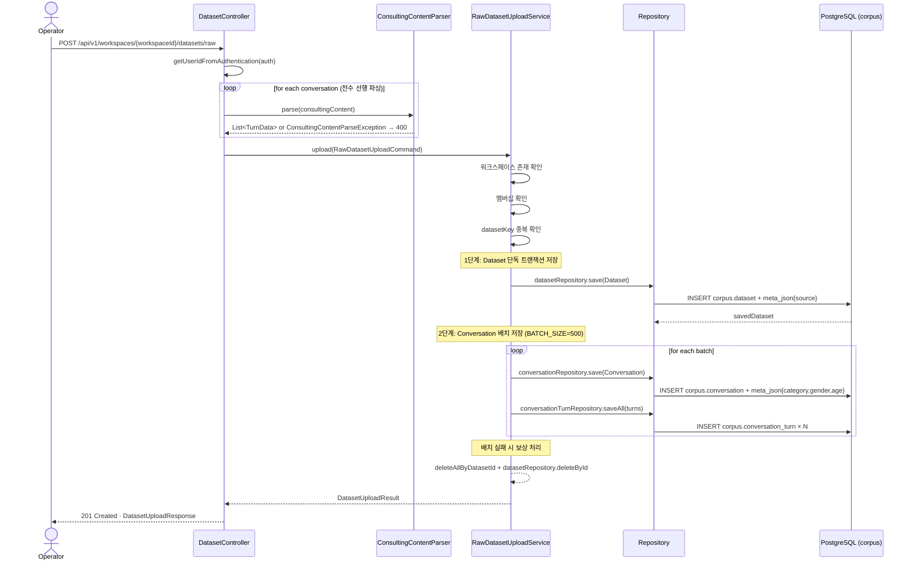
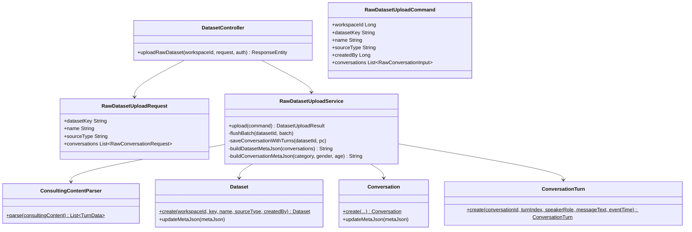

# [BE-121] 원본 상담 로그 업로드 API

> Backlog 1.1.2 · Branch: `feature/121-conversation-log-parsing-task`

---

## Goal

운영자가 원본 상담 로그 JSON(`consulting_content` 단일 문자열)을 업로드하면, 서버에서 화자 prefix 기반으로 파싱하여 `corpus` 테이블에 저장한다. Domain Pack 생성 파이프라인의 입력 데이터를 적재하는 것이 목적이다.

---

## Sequence Diagram



---

## REST API

### Endpoint

| Method | Path | Description |
|--------|------|-------------|
| POST | `/api/v1/workspaces/{workspaceId}/datasets/raw` | 원본 상담 로그 업로드 |
| POST | `/api/v1/workspaces/{workspaceId}/datasets` | 구조화 데이터 업로드 (기존) |

### Request

**POST /api/v1/workspaces/{workspaceId}/datasets/raw**

```json
{
  "datasetKey": "하나카드-2024Q1",
  "name": "하나카드 상담 로그 2024 1분기",
  "sourceType": "상담전화",
  "conversations": [
    {
      "source_id": "200001",
      "source": "하나카드",
      "consulting_category": "도난/분실 신청/해제",
      "client_gender": "여자",
      "client_age": "30대",
      "consulting_content": "상담사: 상담원 ▲▲▲입니다.\n손님: 네, 안녕하세요?\n상담사: 네, 어떻게 도와드릴까요?"
    }
  ]
}
```

**필드 제약**

| 필드 | 필수 | 제약 |
|------|------|------|
| `datasetKey` | O | max 100, workspace 내 unique |
| `name` | O | max 255 |
| `sourceType` | O | max 50, 운영자 직접 입력 |
| `conversations` | O | min 1 |
| `conversations[].source_id` | O | max 255 |
| `conversations[].source` | X | max 255 |
| `conversations[].consulting_category` | X | max 100 |
| `conversations[].client_gender` | X | max 10 |
| `conversations[].client_age` | X | max 10 |
| `conversations[].consulting_content` | O | max 5000 |

### Response

**201 Created**

```json
{
  "datasetId": 1,
  "datasetKey": "하나카드-2024Q1",
  "workspaceId": 1,
  "status": "READY",
  "piiRedactionStatus": "PENDING",
  "conversationCount": 1
}
```

**400 Bad Request** — 유효성 오류 또는 파싱 실패

```json
{
  "error": "VALIDATION_ERROR",
  "message": "consulting_content는 필수입니다.",
  "field": "conversations[0].consulting_content"
}
```

```json
{
  "error": "PARSE_ERROR",
  "message": "인식할 수 없는 화자 prefix입니다. (line=3, length=12)"
}
```

**401 Unauthorized** — JWT 없음 또는 만료

**403 Forbidden** — 워크스페이스 멤버 아님

```json
{
  "error": "FORBIDDEN",
  "message": "워크스페이스에 접근 권한이 없습니다. workspaceId=1"
}
```

**404 Not Found** — 워크스페이스 없음

```json
{
  "error": "NOT_FOUND",
  "message": "워크스페이스를 찾을 수 없습니다. id=999"
}
```

**409 Conflict** — datasetKey 중복

```json
{
  "error": "CONFLICT",
  "message": "이미 사용 중인 데이터셋 키입니다: 하나카드-2024Q1"
}
```

---

## Class Design

### DDD Layered Structure



### 파싱 규칙 — ConsultingContentParser

| 원본 prefix | speakerRole | 비고 |
|-------------|-------------|------|
| `상담사:` | `AGENT` | |
| `고객:` | `CUSTOMER` | |
| `손님:` | `CUSTOMER` | `고객:`과 동일 처리 |
| 빈 라인 | — | 스킵 |
| 기타 prefix | — | `ConsultingContentParseException` → 400 |

- `turnIndex`: 0-based 자동 부여
- `eventTime`: 항상 `null` (원본 데이터에 타임스탬프 없음)
- 파싱 결과 턴이 0개이면 예외 발생

### 필드 매핑 — RawDatasetUploadService

| 원본 필드 | DB 컬럼 / 위치 |
|-----------|----------------|
| `source_id` | `corpus.conversation.external_case_id` |
| `source` | `corpus.dataset.meta_json → { "source": "..." }` |
| `consulting_category` | `corpus.conversation.meta_json → { "category": "..." }` |
| `client_gender` | `corpus.conversation.meta_json → { "clientGender": "..." }` |
| `client_age` | `corpus.conversation.meta_json → { "clientAge": "..." }` |
| `consulting_date: ""` | `startedAt = null`, `endedAt = null` |
| (없음) | `language_code = "ko"` (기본값) |
| `consulting_turns` | 저장 안 함 (DB에서 계산 가능) |
| `consulting_length` | 저장 안 함 (DB에서 계산 가능) |

### 트랜잭션 전략

```text
1. 전수 파싱 (DB write 없음)
   → ConsultingContentParseException 발생 시 즉시 400, DB write 없음

2. Dataset 단독 트랜잭션
   → DataIntegrityViolationException 시 DatasetKeyConflictException → 409

3. Conversation 배치 트랜잭션 (BATCH_SIZE = 500)
   → 배치 실패 시 보상 처리:
      deleteAllByDatasetId(datasetId) + datasetRepository.deleteById(datasetId)
```

---

## Tests

### Unit Tests

```java
@DisplayName("ConsultingContentParser")
class ConsultingContentParserTest {

    @Test
    @DisplayName("상담사/고객/손님 prefix를 올바른 speakerRole로 파싱한다")
    void parse_withValidPrefixes_returnsTurns() { ... }

    @Test
    @DisplayName("빈 라인을 스킵하고 turnIndex를 연속으로 부여한다")
    void parse_withBlankLines_skipsAndIndexesContinuously() { ... }

    @Test
    @DisplayName("인식 불가 prefix는 ConsultingContentParseException을 던진다")
    void parse_withUnknownPrefix_throwsParseException() { ... }

    @Test
    @DisplayName("null 입력은 ConsultingContentParseException을 던진다")
    void parse_withNull_throwsParseException() { ... }

    @Test
    @DisplayName("파싱 결과 턴이 0개이면 ConsultingContentParseException을 던진다")
    void parse_withAllBlankLines_throwsParseException() { ... }

    @Test
    @DisplayName("prefix 이후 텍스트는 앞뒤 공백이 제거된다")
    void parse_stripsWhitespaceFromMessageText() { ... }

    @Test
    @DisplayName("turnIndex는 0부터 시작한다")
    void parse_turnIndexStartsFromZero() { ... }
}
```

```java
@DisplayName("RawDatasetUploadService")
@ExtendWith(MockitoExtension.class)
class RawDatasetUploadServiceTest {

    @Test
    @DisplayName("정상 업로드 시 DatasetUploadResult를 반환한다")
    void upload_withValidCommand_returnsResult() { ... }

    @Test
    @DisplayName("워크스페이스가 없으면 WorkspaceNotFoundException을 던진다")
    void upload_whenWorkspaceNotFound_throws() { ... }

    @Test
    @DisplayName("워크스페이스 멤버가 아니면 UnauthorizedWorkspaceAccessException을 던진다")
    void upload_whenNotMember_throws() { ... }

    @Test
    @DisplayName("datasetKey 중복 시 DatasetKeyConflictException을 던진다")
    void upload_whenDatasetKeyConflict_throws() { ... }

    @Test
    @DisplayName("파싱 실패 시 DB write가 발생하지 않는다")
    void upload_whenParseFails_noDbWrite() { ... }

    @Test
    @DisplayName("dataset.meta_json에 source 값이 기록된다")
    void upload_setsDatasetMetaJsonWithSource() { ... }

    @Test
    @DisplayName("conversation.meta_json에 category/gender/age가 기록된다")
    void upload_setsConversationMetaJson() { ... }
}
```

### Integration Tests

```java
@SpringBootTest
@AutoConfigureMockMvc
@DisplayName("DatasetController - POST /datasets/raw")
class RawDatasetUploadControllerTest {

    @Test
    @DisplayName("유효한 요청은 201을 반환한다")
    void uploadRaw_withValidRequest_returns201() throws Exception {
        mockMvc.perform(post("/api/v1/workspaces/1/datasets/raw")
                .header("Authorization", "Bearer " + validToken)
                .contentType(MediaType.APPLICATION_JSON)
                .content(validRawRequestJson))
            .andExpect(status().isCreated())
            .andExpect(jsonPath("$.datasetId").isNumber())
            .andExpect(jsonPath("$.status").value("READY"))
            .andExpect(jsonPath("$.piiRedactionStatus").value("PENDING"));
    }

    @Test
    @DisplayName("인식 불가 prefix는 400을 반환한다")
    void uploadRaw_withUnknownPrefix_returns400() throws Exception { ... }

    @Test
    @DisplayName("consulting_content 누락 시 400을 반환한다")
    void uploadRaw_missingConsultingContent_returns400() throws Exception { ... }

    @Test
    @DisplayName("인증 없이 요청하면 401을 반환한다")
    void uploadRaw_withoutAuth_returns401() throws Exception { ... }

    @Test
    @DisplayName("워크스페이스 멤버 아닌 사용자는 403을 반환한다")
    void uploadRaw_notMember_returns403() throws Exception { ... }

    @Test
    @DisplayName("datasetKey 중복 시 409를 반환한다")
    void uploadRaw_duplicateDatasetKey_returns409() throws Exception { ... }

    @Test
    @DisplayName("대화 1000건 업로드 시 배치 처리가 정상 동작한다")
    void uploadRaw_with1000Conversations_batchesCorrectly() throws Exception { ... }
}
```

### Test Checklist

- [ ] 정상 시나리오: 유효 입력 시 201 및 corpus 테이블 저장 검증
- [ ] 파싱 오류: 인식 불가 prefix, null, 빈 문자열에 대한 400 검증
- [ ] 유효성 오류: 필수 필드 누락, max length 초과에 대한 400 검증
- [ ] 권한/인증 오류: JWT 없음(401), 멤버 아님(403)
- [ ] 중복 오류: 동일 datasetKey 재업로드 시 409 검증
- [ ] 트랜잭션: 배치 중간 실패 시 dataset + conversation 롤백 검증
- [ ] meta_json: `dataset.meta_json.source`, `conversation.meta_json.category/clientGender/clientAge` 저장 검증
- [ ] 필드 매핑: `source_id` → `external_case_id`, `language_code = "ko"`, `started_at = null` 검증
- [ ] 배치: BATCH_SIZE(500) 경계에서의 정상 처리 검증

---

## Database

### 사용 테이블

스키마 변경 없음. 기존 컬럼 활용.

```sql
-- corpus.dataset
-- meta_json: { "source": "하나카드" }
--            또는 복수 source 시: { "source": ["하나카드", "엘지유플러스"] }

-- corpus.conversation
-- external_case_id: source_id 값
-- language_code: "ko" (기본값)
-- started_at, ended_at: null (consulting_date 없음)
-- meta_json: { "category": "도난/분실", "clientGender": "여자", "clientAge": "30대" }
--            (null/blank 필드는 포함하지 않음)

-- corpus.conversation_turn
-- turn_index: 0-based
-- speaker_role: "AGENT" 또는 "CUSTOMER"
-- event_time: null
```

### 신규 Repository 메서드

```text
ConversationRepository.deleteAllByDatasetId(Long datasetId)
  → 배치 실패 시 보상 처리에 사용
  → ON DELETE CASCADE가 corpus.conversation_turn에 설정되어 있어
     conversation 삭제 시 turn도 자동 삭제됨
```

---

## Additional Notes

- **파싱 전수 선행**: `ConsultingContentParser.parse()`는 DB write 이전에 전체 conversations를 일괄 파싱한다. 파싱 실패 시 DB write 없이 즉시 400 반환.
- **배치 보상 전략**: Dataset 저장 후 conversation 배치 실패 시, `deleteAllByDatasetId` + `datasetRepository.deleteById`로 보상 처리. Saga 패턴 적용.
- **source 복수 처리**: 한 요청에 여러 `source` 값이 섞인 경우, `dataset.meta_json.source`는 배열로 저장됨.
- **consulting_content 5000자 제한**: `RawConversationRequest` DTO에 `@Size(max = 5000)` 적용. 실제 업무 데이터 크기 재검토 필요.
- **기존 API 영향 없음**: `POST /datasets` (구조화 업로드)는 `DatasetUploadService`를 그대로 사용하며 이번 변경의 영향을 받지 않음.
