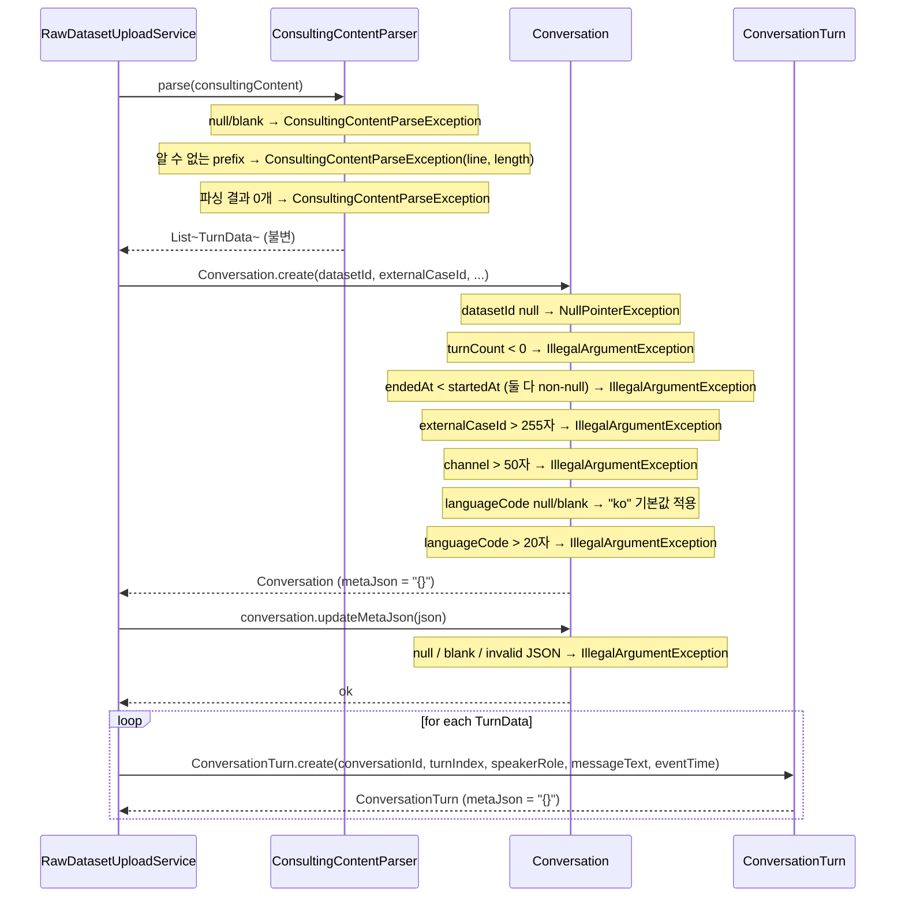
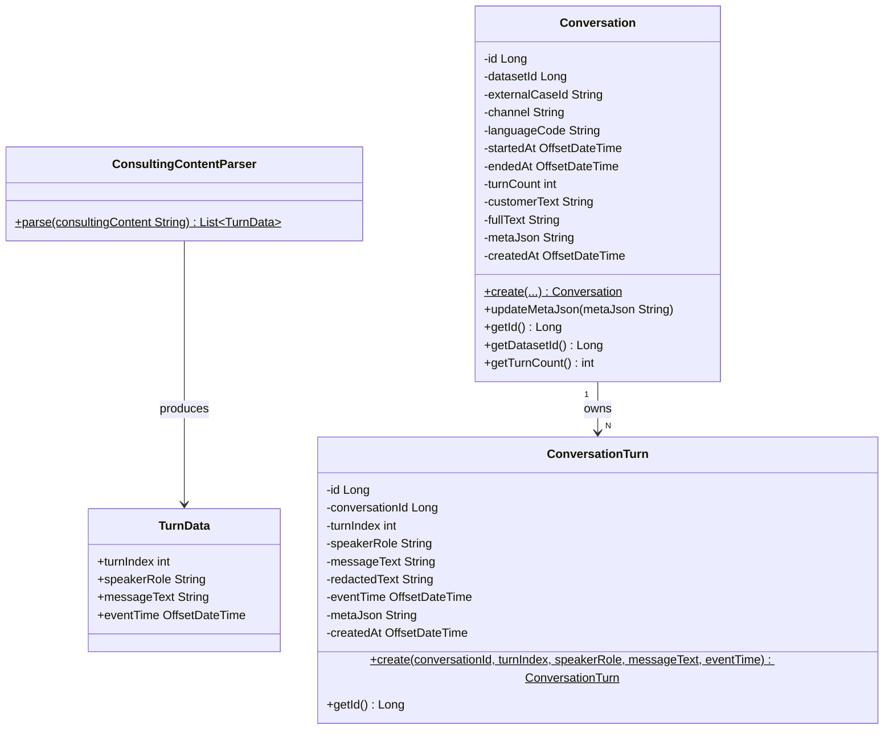

# [BE-122] Conversation / Turn 구조화 및 기본 검증 처리

> Backlog 1.2.2 · Branch: `spec/122`

---

## Goal

업로드된 원본 상담 텍스트를 `Conversation` / `ConversationTurn` 도메인 모델로 구조화하고, 팩토리 메서드 기반 기본 검증을 적용한다. ML 파이프라인의 Discovery 및 Workflow 생성 단계에서 활용 가능한 정형 도메인 구조를 제공하는 것이 목적이다.

---

## Sequence Diagram



---

## REST API

N/A — 외부에 직접 노출되는 HTTP 엔드포인트 없음.

Backlog 1.2.1 (`POST /api/v1/workspaces/{workspaceId}/datasets/raw`)이 이 도메인 모델을 사용하며, 해당 엔드포인트를 통해 간접 호출됨.

---

## Class Design

### DDD Layered Structure



### Aggregate Design — Conversation

```java
// corpus.conversation 테이블 매핑
@Entity
@Table(name = "conversation", schema = "corpus")
public class Conversation {

    // 팩토리 메서드 검증 규칙
    public static Conversation create(
        Long datasetId,           // NOT NULL (Objects.requireNonNull)
        String externalCaseId,    // nullable, max 255
        String channel,           // nullable, max 50
        String languageCode,      // null/blank → "ko", max 20
        OffsetDateTime startedAt, // nullable
        OffsetDateTime endedAt,   // nullable; endedAt >= startedAt (둘 다 non-null 시)
        String customerText,      // CUSTOMER turn messageText를 "\n" join
        String fullText,          // 전체 turn messageText를 "\n" join
        int turnCount             // >= 0
    ) { ... }

    // metaJson 갱신: null / blank / invalid JSON → IllegalArgumentException
    public void updateMetaJson(String metaJson) { ... }
}
```

### Aggregate Design — ConversationTurn

```java
// corpus.conversation_turn 테이블 매핑
// uniqueConstraint: (conversation_id, turn_index)
@Entity
@Table(
    name = "conversation_turn",
    schema = "corpus",
    uniqueConstraints = @UniqueConstraint(columnNames = {"conversation_id", "turn_index"})
)
public class ConversationTurn {

    // 팩토리 메서드 (ConsultingContentParser가 speakerRole / messageText 유효성 보장)
    public static ConversationTurn create(
        Long conversationId,
        int turnIndex,          // 0-based, ConsultingContentParser가 순차 부여
        String speakerRole,     // "AGENT" | "CUSTOMER"
        String messageText,
        OffsetDateTime eventTime  // 현재 항상 null (원본 데이터에 타임스탬프 없음)
    ) { ... }
}
```

### Parser Design — ConsultingContentParser

```text
패키지: com.init.corpus.application (package-private)
유형: static utility class, 직접 인스턴스 생성 불가

parse(String consultingContent) 파싱 규칙
──────────────────────────────────────
입력 분리: "\r?\n" 기준 라인 분리
반환값: List.copyOf(turns) — 불변 리스트

prefix → speakerRole 매핑
 상담사:  → AGENT
 고객:    → CUSTOMER
 손님:    → CUSTOMER (고객:과 동일 처리)
 빈 라인  → 스킵
 기타     → ConsultingContentParseException (line 번호, length 포함)

예외 발생 조건
 - null / blank 입력   → ConsultingContentParseException
 - 파싱 결과 0개       → ConsultingContentParseException
 - 알 수 없는 prefix   → ConsultingContentParseException (line, length 포함)

turnIndex: 0-based 자동 부여
eventTime: 항상 null
```

---

## Tests

### Unit Tests

// [template] 아래 ConversationTest는 구현 예시이며 ConversationTest.java는 미생성 상태 (Test Checklist의 [ ] 항목 참조)
```java
@DisplayName("Conversation")
class ConversationTest {

    @Test
    @DisplayName("유효한 입력으로 Conversation을 생성한다")
    void should_생성성공_when_유효한입력() {
        // given / when
        Conversation conv = Conversation.create(1L, "case-001", null, null, null, null, null, null, 3);
        // then
        assertThat(conv.getDatasetId()).isEqualTo(1L);
        assertThat(conv.getTurnCount()).isEqualTo(3);
    }

    @Test
    @DisplayName("datasetId가 null이면 NullPointerException을 던진다")
    void should_NPE_when_datasetIdNull() {
        assertThatThrownBy(() -> Conversation.create(null, null, null, null, null, null, null, null, 0))
            .isInstanceOf(NullPointerException.class);
    }

    @Test
    @DisplayName("turnCount가 음수이면 IllegalArgumentException을 던진다")
    void should_IAE_when_turnCountNegative() {
        assertThatThrownBy(() -> Conversation.create(1L, null, null, null, null, null, null, null, -1))
            .isInstanceOf(IllegalArgumentException.class);
    }

    @Test
    @DisplayName("endedAt이 startedAt보다 이전이면 IllegalArgumentException을 던진다")
    void should_IAE_when_endedAtBeforeStartedAt() {
        var start = OffsetDateTime.now();
        var end = start.minusMinutes(1);
        assertThatThrownBy(() -> Conversation.create(1L, null, null, null, start, end, null, null, 0))
            .isInstanceOf(IllegalArgumentException.class);
    }

    @Test
    @DisplayName("externalCaseId가 255자를 초과하면 IllegalArgumentException을 던진다")
    void should_IAE_when_externalCaseIdExceeds255() {
        String tooLong = "a".repeat(256);
        assertThatThrownBy(() -> Conversation.create(1L, tooLong, null, null, null, null, null, null, 0))
            .isInstanceOf(IllegalArgumentException.class);
    }

    @Test
    @DisplayName("channel이 50자를 초과하면 IllegalArgumentException을 던진다")
    void should_IAE_when_channelExceeds50() {
        String tooLong = "a".repeat(51);
        assertThatThrownBy(() -> Conversation.create(1L, null, tooLong, null, null, null, null, null, 0))
            .isInstanceOf(IllegalArgumentException.class);
    }

    @Test
    @DisplayName("updateMetaJson에 유효하지 않은 JSON을 전달하면 IllegalArgumentException을 던진다")
    void should_IAE_when_invalidJson() {
        Conversation conv = Conversation.create(1L, null, null, null, null, null, null, null, 0);
        assertThatThrownBy(() -> conv.updateMetaJson("not-json"))
            .isInstanceOf(IllegalArgumentException.class);
    }

    @Test
    @DisplayName("updateMetaJson에 null을 전달하면 NullPointerException을 던진다")
    void should_NPE_when_metaJsonNull() {
        Conversation conv = Conversation.create(1L, null, null, null, null, null, null, null, 0);
        assertThatThrownBy(() -> conv.updateMetaJson(null))
            .isInstanceOf(NullPointerException.class);
    }
}
```

```java
// ConsultingContentParserTest — 7개 케이스 구현 완료
// - AGENT / CUSTOMER / 손님 prefix 파싱
// - 빈 라인 스킵 + turnIndex 연속 부여
// - 알 수 없는 prefix → ConsultingContentParseException
// - null → ConsultingContentParseException
// - 결과 0개 → ConsultingContentParseException
// - prefix 이후 텍스트 공백 제거
// - turnIndex 0-based 시작
```

### Test Checklist

- [x] ConsultingContentParser: AGENT / CUSTOMER / 손님 prefix 파싱
- [x] ConsultingContentParser: 빈 라인 스킵 + turnIndex 연속 부여
- [x] ConsultingContentParser: null / 공백 입력 → 예외
- [x] ConsultingContentParser: 알 수 없는 prefix → 예외 (line, length 포함)
- [x] ConsultingContentParser: 결과 0개 → 예외
- [x] ConsultingContentParser: prefix 이후 텍스트 앞뒤 공백 제거
- [x] ConsultingContentParser: turnIndex 0-based 시작
- [ ] Conversation.create: 유효 입력 → 정상 생성
- [ ] Conversation.create: datasetId null → NullPointerException
- [ ] Conversation.create: turnCount 음수 → IllegalArgumentException
- [ ] Conversation.create: endedAt < startedAt → IllegalArgumentException
- [ ] Conversation.create: externalCaseId 255자 초과 → IllegalArgumentException
- [ ] Conversation.create: channel 50자 초과 → IllegalArgumentException
- [ ] Conversation.updateMetaJson: 유효하지 않은 JSON → IllegalArgumentException
- [ ] Conversation.updateMetaJson: null → NullPointerException

---

## Database

### 사용 테이블

스키마 변경 없음. 기존 테이블 활용.

```sql
-- corpus.conversation
-- language_code: null/blank 입력 시 도메인에서 "ko"로 변환하여 저장
-- meta_json: 초기값 '{}', updateMetaJson()으로 갱신
-- turn_count: 파싱 결과의 총 Turn 수 (예: 3개 Turn → turn_count = 3). 개별 위치는 turn_index (0, 1, 2, ...) 로 참조.

-- corpus.conversation_turn
-- unique constraint: (conversation_id, turn_index)
-- speaker_role: "AGENT" | "CUSTOMER"
-- event_time: 항상 null (원본 데이터에 타임스탬프 없음)
-- meta_json: 초기값 '{}'
-- redacted_text: PII 제거 후 저장 (별도 파이프라인 단계에서 처리)
```

---

## Additional Notes

- `ConsultingContentParser`는 package-private static utility로, corpus 모듈 외부에서 직접 접근 불가
- `ConversationTurn.create()` 팩토리 메서드에는 별도 입력 검증 없음. `ConsultingContentParser`가 speakerRole(`"AGENT"` / `"CUSTOMER"`)과 messageText 유효성을 이미 보장하므로 의도적 설계임
- `(conversation_id, turn_index)` unique constraint 위반 시 DB 레벨에서 `DataIntegrityViolationException` 발생 → 상위 서비스 계층(`RawDatasetUploadService`)에서 `DuplicateTurnIndexException`으로 변환. 현재 파서가 순차 turnIndex를 보장하므로 정상 흐름에서는 발생하지 않음
- `Conversation`의 노출 getter: `getId()`, `getDatasetId()`, `getTurnCount()` 3개만 존재. `languageCode` 기본값 "ko" 검증은 `@DataJpaTest` 영속화 후 SELECT로 간접 검증하거나 getter 추가가 필요함
- 도메인 엔티티 단위 테스트(`ConversationTest`)가 현재 미구현 상태. `testing.md` 기준 도메인 로직 90%+ 커버리지 달성을 위해 작성 필요
