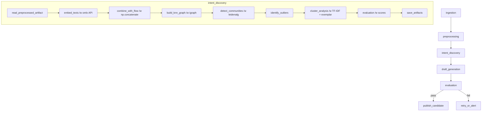

# [ML-2-1-1] Intent Discovery Stage

> Backlog 2.1.1 · Branch: `spec/2-1-1`

---

## Goal

preprocessing 스테이지에서 생성한 전처리된 conversation 데이터를 읽어, 의미 임베딩과 절차 특성 벡터를 결합한 하이브리드 표현으로 클러스터링하고, 의도(intent) 후보 cluster를 식별한다.

---

## DAG Diagram



---

## Stage Interface

### Input

| 항목 | 타입 | 설명 |
|------|------|------|
| `upstream_manifest_path` | `str \| None` | preprocessing 스테이지 manifest.json 경로 |

upstream 아티팩트 디렉터리에서 읽는 파일:

| 파일 | 형식 | 설명 |
|------|------|------|
| `preprocessed_conversations.json` | JSON | `1-2-3.md` 출력 contract |

입력 conversation 스키마 (1-2-3.md와 1:1 대응):

| 필드 | 타입 | Required | 설명 |
|------|------|----------|------|
| `id` | string | Yes | conversation 고유 식별자 |
| `dataset_id` | string | Yes | 속한 데이터셋 ID |
| `channel` | string \| null | No | 채널 |
| `ended_status` | string \| null | No | 종료 상태 |
| `canonical_text` | string | Yes | 임베딩 입력 텍스트 |
| `customer_problem_text` | string | Yes | 목적 추출 텍스트 |
| `flow_signature` | number[] | Yes | 61차원 벡터 |
| `flow_signature_dim` | integer | Yes | 벡터 차원 (항상 61) |
| `turn_count` | integer | Yes | 전체 턴 수 |
| `customer_turn_count` | integer | Yes | 고객 턴 수 |
| `pii_mask_count` | integer | Yes | PII 마스킹 횟수 |
| `filtered` | boolean | Yes | 필터링 여부 |

본 스테이지는 `filtered=false`인 conversation만 처리한다.

### Output

| 파일 | 형식 | 설명 |
|------|------|------|
| `clusters.json` | JSON | 클러스터 및 outlier 상세 결과 |
| `embeddings.npy` | NumPy .npy | shape (N, 1085), dtype float32 |
| `novel_intent_candidates.json` | JSON | 신규 intent 후보 (옵션) |
| `manifest.json` | JSON | 공통 메타정보 |

### Configuration

환경변수:

| 변수 | 기본값 | 설명 |
|------|--------|------|
| `OMLX_API_KEY` | (필수) | omlx API 키 |
| `OMLX_BASE_URL` | `https://omlx.heewon.xyz/v1` | API base URL |
| `EMBEDDING_MODEL_NAME` | `jina-embeddings-v5-text-small-mlx` | 임베딩 모델명 |
| `EMBEDDING_BATCH_SIZE` | `32` | batch 크기 |
| `INTENT_KNN_K` | `15` | kNN graph k |
| `INTENT_LEIDEN_RESOLUTION` | `1.0` | Leiden resolution |
| `INTENT_MIN_CLUSTER_SIZE` | `5` | 최소 cluster 크기 |
| `INTENT_TFIDF_TOP_KEYWORDS` | `8` | TF-IDF top-N keyword 수 |

---

## Stage Implementation

### 함수 시그니처

```python
# ml/src/pipeline/stages/intent_discovery/main.py

def run(upstream_manifest_path: str | None = None) -> None:
    """
    preprocessing artifact를 읽어 클러스터링 결과를 저장한다.

    Args:
        upstream_manifest_path: preprocessing manifest.json 경로.
            None이면 환경변수에서 StageContext를 구성한다.
    """
    ...
```

### 내부 호출 흐름

```
run()
  ├── PipelineRuntimeConfig.from_env()
  ├── StageContext(stage_name="intent_discovery")
  ├── get_stage_logger(stage_context)
  ├── io.read_preprocessed_artifact(upstream_manifest_path)
  │     -> conversations (filtered=false만 수집)
  ├── embedding.embed_texts(
  │       texts=[c.canonical_text for c in conversations],
  │       api_key=os.environ["OMLX_API_KEY"],
  │       base_url=os.environ.get("OMLX_BASE_URL", "https://omlx.heewon.xyz/v1"),
  │       model=os.environ.get("EMBEDDING_MODEL_NAME", "jina-embeddings-v5-text-small-mlx"),
  │       batch_size=int(os.environ.get("EMBEDDING_BATCH_SIZE", "32")),
  │     ) -> np.ndarray[float32, (N, 1024)]
  ├── embedding.combine_with_flow(
  │       embeddings=np.ndarray[(N, 1024)],
  │       flow_signatures=np.ndarray[(N, 61)],
  │     ) -> np.ndarray[(N, 1085)]
  ├── clustering.build_knn_graph(
  │       X=hybrid_embeddings,
  │       k=int(os.environ.get("INTENT_KNN_K", "15")),
  │     ) -> igraph.Graph
  ├── clustering.detect_communities(
  │       graph, resolution=float(os.environ.get("INTENT_LEIDEN_RESOLUTION", "1.0")),
  │     ) -> list[int]  # cluster_id per node
  ├── clustering.identify_outliers(
  │       labels, min_cluster_size=int(os.environ.get("INTENT_MIN_CLUSTER_SIZE", "5")),
  │     ) -> (labels, outlier_mask)
  ├── cluster_analysis.compute_exemplars(conversation_ids, labels, hybrid_embeddings)
  │     -> dict[cluster_id, list[str]]  # 대표 conversation ID 3개
  ├── cluster_analysis.extract_keywords(canonical_texts, labels, top_n=8)
  │     -> dict[cluster_id, list[str]]  # TF-IDF top-N
  ├── cluster_analysis.suggest_name_and_description(keywords)
  │     -> dict[cluster_id, tuple[str, str]]  # rule-based keyword 조합
  ├── cluster_analysis.compute_workflow_signal(flow_signatures, labels)
  │     -> dict[cluster_id, dict]  # 평균 + threshold
  ├── evaluation.interpretability_score(hybrid_embeddings, labels)
  │     -> dict[cluster_id, float]  # pair-wise cosine sim 평균
  ├── evaluation.workflow_consistency_score(ended_status, labels)
  │     -> dict[cluster_id, float]  # 동일 outcome 비율
  ├── evaluation.branching_explainability_score(...)
  │     -> dict[cluster_id, None | float]  # placeholder
  └── io.write_clusters_artifact(stage_context, runtime_config, clusters, embeddings)
        -> clusters.json + embeddings.npy + manifest.json
```

서브 모듈 위치:

| 모듈 | 경로 |
|------|------|
| `io` | `pipeline.stages.intent_discovery.io` |
| `embedding` | `pipeline.stages.intent_discovery.embedding` |
| `clustering` | `pipeline.stages.intent_discovery.clustering` |
| `cluster_analysis` | `pipeline.stages.intent_discovery.cluster_analysis` |
| `evaluation` | `pipeline.stages.intent_discovery.evaluation` |

### 주요 알고리즘 개요

#### embedding.embed_texts

- omlx API (`/v1/embeddings`)로 batch 호출
- 입력: `{"model": "jina-embeddings-v5-text-small-mlx", "input": [texts]}`
- 응답 body에서 `data[i].embedding` 추출 (1024차원 float32)
- 에러(body 내 `error` 필드 존재 시) → 해당 batch skip
- 빈 임베딩(norm=0) 제외 + 카운트

#### embedding.combine_with_flow

```
hybrid = np.concatenate([normalized_embeddings, normalized_flow_signatures], axis=1)
# shape: (N, 1024+61) → (N, 1085)
```

#### clustering.build_knn_graph

- sklearn `NearestNeighbors(n_neighbors=k, metric="cosine")`
- igraph.Graph 인스턴스 생성 (kNN directed → undirected)

#### clustering.detect_communities

- `leidenalg.find_partition(graph, leidenalg.CPMVertexPartition, resolution_parameter=resolution)`
- membership list 반환

#### clustering.identify_outliers

- cluster 할당 수 < `min_cluster_size` → outlier
- graph에서 isolated node → outlier
- outlier는 `cluster_id = -1`로 표기

#### evaluation.interpretability_score

- sklearn `cosine_similarity`로 cluster 내 모든 쌍 계산 후 평균
- outlier는 score null 처리

#### evaluation.workflow_consistency_score
- 동일 cluster 내에서 동일 `ended_status` 비율 계산
- 같으면 1.0, 완전히 다르면 0.0

#### evaluation.branching_explainability_score
- placeholder: 향후 정의 시까지 `None` 반환

---

## Metrics

| 메트릭 | 단위 | 설명 |
|--------|------|------|
| `embedding_count` | count | 임베딩에 성공한 conversation 수 |
| `embedding_failure_count` | count | 임베딩 실패 conversation 수 |
| `cluster_count` | count | 발견된 cluster 수 |
| `outlier_count` | count | outlier로 분류된 conversation 수 |
| `outlier_rate` | 0-1 | outlier 비율 |
| `avg_cluster_size` | float | 평균 cluster 크기 |
| `min_cluster_size_observed` | count | 최소 cluster 크기 |
| `max_cluster_size_observed` | count | 최대 cluster 크기 |
| `avg_interpretability_score` | 0-1 | cluster별 interpretability 평균 |
| `avg_workflow_consistency_score` | 0-1 | cluster별 workflow consistency 평균 |
| `processing_duration_seconds` | float | 전체 처리 소요 시간 |
| `embedding_api_call_count` | count | omlx API 호출 횟수 |
| `embedding_api_retry_count` | count | 재시도 발생 횟수 |

---

## Artifact Schema

### clusters.json

```json
{
  "schema_version": "1.0",
  "stage": "intent_discovery",
  "generated_at": "2026-04-27T12:30:00Z",
  "source_manifest": "preprocessing/manifest.json",
  "embedding_provider": "omlx",
  "embedding_model": "jina-embeddings-v5-text-small-mlx",
  "embedding_dim": 1024,
  "hybrid_dim": 1085,
  "clustering": {
    "algorithm": "leiden",
    "knn_k": 15,
    "leiden_resolution": 1.0,
    "min_cluster_size": 5
  },
  "clusters": [
    {
      "cluster_id": 0,
      "size": 12,
      "exemplar_conversation_ids": ["c1", "c5", "c9"],
      "keywords": ["환불", "주문", "결제"],
      "suggested_name": "주문 환불 요청",
      "suggested_description": "주문 환불 관련 요청 cluster",
      "workflow_signal": {
        "requires_payment_check": true,
        "requires_user_identification": false,
        "has_escalation_cases": false
      },
      "quality": {
        "interpretability_score": 0.78,
        "workflow_consistency_score": 0.85,
        "branching_explainability_score": null
      },
      "review_hint": "merge_candidate"
    }
  ],
  "outlier_conversation_ids": ["c3", "c17"],
  "novel_intent_candidates": [
    {
      "candidate_key": "novel_001",
      "source_type": "outlier_pattern",
      "candidate_size": 3,
      "suggested_name": "신규 intent 후보 A"
    }
  ],
  "stats": {
    "input_count": 100,
    "embedding_failed_count": 0,
    "cluster_count": 8,
    "outlier_count": 5,
    "outlier_rate": 0.05,
    "avg_interpretability_score": 0.72,
    "avg_workflow_consistency_score": 0.81
  }
}
```

### clusters 필드 타입 정의

| 필드 | 타입 | Required | 설명 |
|------|------|----------|------|
| `schema_version` | string | Yes | 스키마 버전 |
| `stage` | string | Yes | 스테이지명 (`intent_discovery`) |
| `generated_at` | string | Yes | 생성 시각 (ISO 8601) |
| `source_manifest` | string | Yes | upstream manifest 참조 |
| `embedding_provider` | string | Yes | 사용한 embedding provider (`omlx`) |
| `embedding_model` | string | Yes | 사용한 모델명 |
| `embedding_dim` | integer | Yes | 순수 임베딩 차원 (1024) |
| `hybrid_dim` | integer | Yes | 하이브리드 차원 (1085) |
| `clustering` | object | Yes | 클러스터링 파라미터 |
| `clusters` | array | Yes | cluster 목록 |
| `outlier_conversation_ids` | array | Yes | outlier conversation ID 목록 |
| `novel_intent_candidates` | array | No | 신규 intent 후보 목록 |
| `stats` | object | Yes | 메트릭 요약 |

### clusters[].cluster 필드

| 필드 | 타입 | Required | 설명 |
|------|------|----------|------|
| `cluster_id` | integer | Yes | cluster 고유 ID |
| `size` | integer | Yes | 소속 conversation 수 |
| `exemplar_conversation_ids` | string[] | Yes | 대표 conversation ID 3개 |
| `keywords` | string[] | Yes | TF-IDF top-N 키워드 |
| `suggested_name` | string | Yes | rule-based 추천 이름 |
| `suggested_description` | string | No | cluster 설명 |
| `workflow_signal` | object | Yes | 워크플로우 특성 시그널 |
| `quality` | object | Yes | 품질 평가 점수 |
| `review_hint` | string \| null | No | 검토 힌트 |

### clusters[].quality 필드

| 필드 | 타입 | Required | 설명 |
|------|------|----------|------|
| `interpretability_score` | float \| null | No | pair-wise cosine sim 평균 |
| `workflow_consistency_score` | float \| null | No | 동일 outcome 비율 |
| `branching_explainability_score` | float \| null | No | placeholder (null 또는 0.0) |

### embeddings.npy

- 파일명: `embeddings.npy`
- 형식: NumPy .npy (dtype float32)
- shape: `(N, 1085)` — N = embedding_count
- 내용: `np.concatenate([normalized_embeddings, normalized_flow_signatures], axis=1)`

### novel_intent_candidates.json

```json
[
  {
    "candidate_key": "novel_001",
    "source_type": "outlier_pattern",
    "candidate_size": 3,
    "suggested_name": "...",
    "conversation_ids": ["c3", "c18", "c42"]
  }
]
```

### manifest.json

`pipeline.common.artifacts.write_stage_manifest`이 생성하는 공통 포맷:

```json
{
  "dag_id": "domain_pack_generation",
  "run_id": "manual__2026-04-27T12:00:00+00:00",
  "stage_name": "intent_discovery",
  "workspace_id": "ws_001",
  "dataset_id": "ds_2026q1",
  "pipeline_job_id": "job_001",
  "artifact_root": "/opt/airflow/artifacts",
  "generated_at": "2026-04-27T12:00:00Z",
  "payload": {
    "artifact_path": "clusters.json",
    "cluster_count": 8,
    "outlier_count": 5
  }
}
```

---

## Tests

### Unit Tests

```python
# tests/pipeline/stages/intent_discovery/test_embedding.py

class TestEmbedTexts:
    def test_single_text_returns_1024_dim(self, mock_omlx_api):
        """단일 텍스트 임베딩 → 1024차원 float32 배열"""
        ...

    def test_batch_embedding_returns_correct_shape(self, mock_omlx_api):
        """N개 텍스트 batch → shape (N, 1024)"""
        ...

    def test_api_error_skips_batch(self, mock_omlx_api_error):
        """API 에러 발생 batch → skip + 카운트"""
        ...

    def test_empty_text_list_raises_stage_error(self):
        """빈 텍스트 목록 → PipelineStageError"""
        ...

class TestCombineWithFlow:
    def test_combined_shape_is_N_1085(self):
        """(N, 1024) + (N, 61) → (N, 1085)"""
        ...

    def test_raises_on_mismatched_N(self):
        """N 불일치 시 ValueError"""
        ...
```

```python
# tests/pipeline/stages/intent_discovery/test_clustering.py

class TestBuildKnnGraph:
    def test_graph_has_N_nodes_and_kN_edges(self):
        """igraph.Graph: N nodes, ~kN edges"""
        ...

class TestDetectCommunities:
    def test_returns_label_per_node(self):
        """len(labels) == N"""
        ...

    def test_different_resolution_yields_different_clusters(self):
        """resolution 변화 → cluster 수 변화"""
        ...

class TestIdentifyOutliers:
    def test_small_cluster_marked_outlier(self):
        """min_cluster_size 미만 cluster → outlier(-1)"""
        ...

    def test_no_outlier_when_all_above_threshold(self): ...
```

```python
# tests/pipeline/stages/intent_discovery/test_cluster_analysis.py

class TestComputeExemplars:
    def test_returns_three_ids_per_cluster(self): ...
    def test_outlier_cluster_returns_empty_list(self): ...

class TestExtractKeywords:
    def test_returns_top_n_keywords(self): ...
    def test_tfidf_on_single_text_returns_text_itself(self): ...

class TestComputeWorkflowSignal:
    def test_returns_bools_with_correct_keys(self): ...
```

### Integration Tests

```python
# tests/pipeline/stages/intent_discovery/test_main.py

class TestIntentDiscoveryRun:
    def test_run_produces_clusters_json_and_embeddings_npy(
        self, tmp_path, mock_preprocessed_artifact
    ):
        """run() → clusters.json + embeddings.npy 생성"""
        ...

    def test_run_single_cluster_logs_warning(
        self, tmp_path, mock_single_cluster_artifact
    ):
        """단일 cluster → 경고 로그"""
        ...

    def test_run_all_outlier_raises_stage_error(
        self, tmp_path, mock_all_outlier_artifact
    ):
        """전체 outlier → PipelineStageError"""
        ...

    def test_run_empty_input_raises_stage_error(
        self, tmp_path, mock_empty_artifact
    ):
        """빈 입력 → PipelineStageError"""
        ...
```

### Test Checklist

- [ ] 정상: 다중 cluster + outlier 정상 생성
- [ ] 단일 cluster: 경고 로그 출력 확인
- [ ] 모두 outlier: `PipelineStageError` raise
- [ ] 빈 입력: `PipelineStageError` raise
- [ ] embedding 1개 실패: skip + 카운트 증가, 나머지 정상 처리
- [ ] hybrid 차원: (N, 1085) 일치 확인
- [ ] outlier_rate > 0.3: 경고 로그 확인
- [ ] fixture: 8 conversations + 2 clusters + 1 outlier

---

## Error Handling

| 상황 | 처리 방식 |
|------|----------|
| `OMLX_API_KEY` 미설정 | `PipelineConfigurationError` raise |
| upstream manifest 경로 부재 | `PipelineConfigurationError` raise |
| 빈 입력 (conversation 0개) | `PipelineStageError` raise |
| embedding 100% 실패 | `PipelineStageError` raise |
| cluster 0개 생성 | `PipelineStageError` raise |
| omlx API 429 (Rate Limit) | exponential backoff (1s → 2s → 4s) 3회, batch 50% 이상 실패 시 `PipelineStageError` |
| omlx API body error | 해당 batch skip, `embedding_failure_count` 누적 |
| 빈 임베딩 (norm=0) | 제외 + 카운트 |
| 개별 conversation flow_signature 차원 불일치 | 해당 conversation skip + 로그 경고 |
| 출력 파일 쓰기 실패 | `PipelineStageError` raise |

에외 클래스는 `pipeline.common.exceptions`에 정의된 2종만 사용한다:

```python
class PipelineConfigurationError(RuntimeError):
    """Raised when required configuration is missing or invalid."""

class PipelineStageError(RuntimeError):
    """Raised when a pipeline stage fails to complete processing."""
```

---

## Monitoring

`pipeline.common.logging.get_stage_logger`를 사용한다:

```python
logger = get_stage_logger(stage_context)

# 스테이지 시작
logger.info("stage_started", extra={"input_path": upstream_manifest_path})

# 임베딩 완료
logger.info(
    "embedding_completed",
    extra={
        "embedding_count": n_success,
        "embedding_failure_count": n_failure,
        "api_call_count": api_calls,
        "retry_count": retries,
    },
)

# 클러스터링 완료
logger.info(
    "clustering_completed",
    extra={
        "cluster_count": n_clusters,
        "outlier_count": n_outliers,
        "outlier_rate": outlier_rate,
    },
)

# 분석 완료
logger.info(
    "analysis_completed",
    extra={
        "avg_interpretability_score": avg_int,
        "avg_workflow_consistency_score": avg_wf,
    },
)

# 스테이지 완료
logger.info(
    "stage_completed",
    extra={
        "embedding_count": n_success,
        "cluster_count": n_clusters,
        "outlier_rate": outlier_rate,
        "duration_seconds": elapsed,
    },
)

# 경고
logger.warning("high_outlier_rate", extra={"outlier_rate": outlier_rate})
logger.warning("embedding_retry", extra={"attempt": attempt, "error": str(e)})
logger.warning("empty_embedding_skipped", extra={"conversation_id": cid})

# 오류
logger.error(
    "embedding_provider_failure",
    extra={"provider": "omlx", "model": model_name, "error": str(e)},
)
logger.error(
    "stage_failed",
    extra={"stage": "intent_discovery", "error": str(e), "error_type": type(e).__name__},
)
```

---

## Dependencies

```toml
# pyproject.toml (추가)
[project]
dependencies = [
    "numpy>=2.0",          # 공통 (already in A2)
    "igraph>=0.11",        # kNN graph
    "leidenalg>=0.10",     # community detection
    "scikit-learn>=1.5",   # TF-IDF, cosine_similarity, NearestNeighbors
    "scipy>=1.14",         # sparse matrix
    "httpx>=0.27",         # omlx API HTTP client
]
```

> `numpy>=2.0`은 A2(preprocessing)에서 이미 포함됨. `orjson`은 B2에서 추가 가능.

---

## DAG Task Definition

```python
# ml/src/dags/domain_pack_generation.py (발췌)

from airflow.operators.python import PythonOperator

def create_intent_discovery_task(dag):
    def execute(**context):
        from pipeline.stages.intent_discovery.main import run

        ti = context["task_instance"]
        preprocessing_result = ti.xcom_pull(task_ids="preprocessing")
        upstream_manifest_path = preprocessing_result.get("manifest_path") if preprocessing_result else None

        run(upstream_manifest_path=upstream_manifest_path)

        return {"stage": "intent_discovery", "status": "success"}

    return PythonOperator(
        task_id="intent_discovery",
        python_callable=execute,
        dag=dag,
        retries=2,
        retry_delay=timedelta(minutes=5),
    )
```

---

## Additional Notes

- `hybrid_dim: 1085`는 embedding(1024) + flow_signature(61)의 합이다. artifact의 `clusters.json`에 항상 명시한다.
- `filtered=false`인 conversation만 처리한다. preprocessing에서 filtered=true로 표시된 항목은 제외한다.
- flow_signature 차원이 61이 아닌 개별 conversation이 발견되면 해당 항목을 skip하고 경고 로그를 남긴다.
- `branching_explainability_score`는 향후 정의될 항목이다. 현재는 `null`을 반환한다.
- `novel_intent_candidates.json`는 outlier 패턴에서 추가 분석이 필요한 경우에만 생성한다. 항상 생성하지는 않는다.
- omlx API 에러는 body의 `error.type` 필드로 유형을 판별한다 (HTTP status code가 아님).

---

## Out of Scope

- LLM 기반 cluster naming/description 생성 (별도 PR에서 추가)
- 의도 분류기(intent classifier) 학습
- runtime workflow 실행
- 운영자 review UI 개발
- DB 쓰기, backend webhook 호출 (`INSERT INTO`, `backend.callback`, `psycopg`, `sqlalchemy` 모두 금지)
- AI slop 라이브러리(data validation, structured logging, metrics export) 사용
- 클러스터 시각화 (차트/그래프 이미지 생성)
