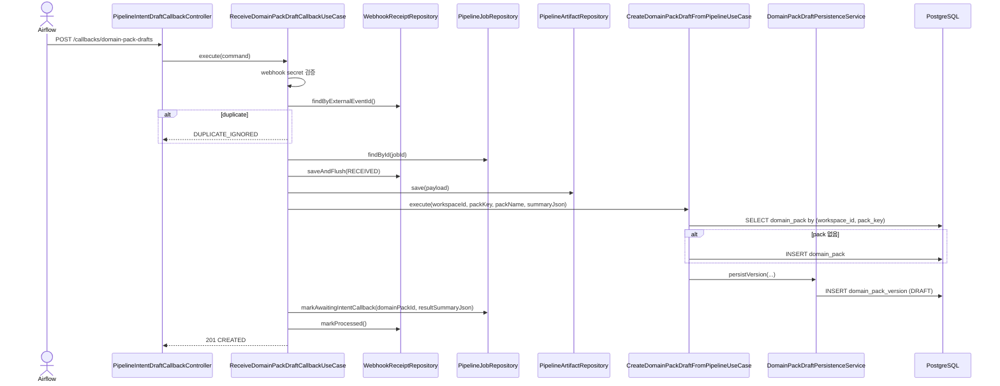
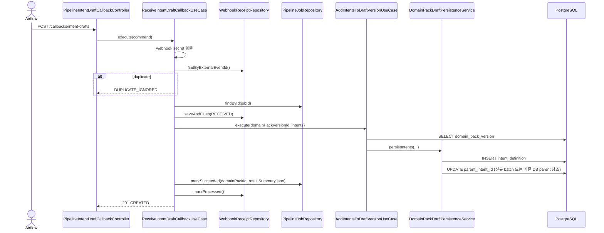
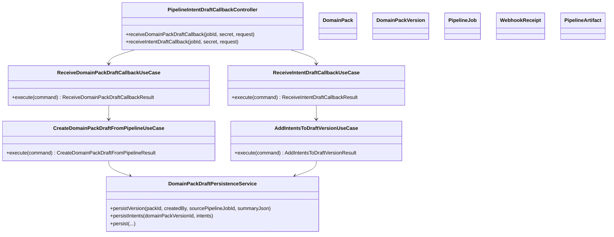

# [BE-213] Airflow Callback -> Domain Pack DRAFT 생성 및 Intent 적재

> **Backlog**: Airflow가 생성한 draft artifact를 서버에 callback 하고 싶다 → 운영 검토 전 단계의 draft version을 자동 적재하기 위해
> **Bounded Context**: `pipelinejob`, `domainpack`
> **Template**: `_TEMPLATE_BE.md`
> **Branch**: `feature/213-airflow-intent-draft-callback`

---

## Goal

Airflow callback을 `pipelinejob` 경계에서 수신하고, 이를 `domainpack` 경계로 전달해 `pack.domain_pack_version`의 `DRAFT` 버전을 만든다.

현재 구현은 2단계 callback 구조다.

1. `domain-pack-drafts` callback이 `DomainPack`을 찾거나 생성하고, 비어 있는 `DRAFT` 버전을 만든다.
2. `intent-drafts` callback이 해당 `DRAFT` 버전에 intent를 추가 저장한다.

즉, 초기 계획의 "intent callback 한 번으로 pack/version/intents를 모두 생성"이 아니라, "draft version 생성"과 "intent 적재"를 분리한 구조다.

상태 흐름은 아래와 같이 고정한다.

- `domain-pack-drafts` 이전: `QUEUED` 또는 `RUNNING`
- `domain-pack-drafts` 성공 후: `WAITING_INTENT_CALLBACK`
- `intent-drafts` 성공 후: `SUCCEEDED`
- 어느 단계에서든 실패 시: `FAILED`

---

## Scope

이번 스펙에서 구현된 범위는 아래와 같다.

- `pipelinejob.presentation`에 Airflow callback endpoint 2개 추가
- webhook secret 기반 최소 인증 처리
- `pipeline.pipeline_job`, `pipeline.webhook_receipt`, `pipeline.pipeline_artifact` JPA 모델/저장소 추가
- `pack.domain_pack` 쓰기 모델 및 저장소 추가
- `DomainPackDraftPersistenceService`로 draft 저장 로직 공통화
- pipeline 전용 draft 생성 use case 추가
- 기존 `DRAFT` 버전에 intent를 추가하는 use case 추가
- `pipeline_job`에 `WAITING_INTENT_CALLBACK` 중간 상태 추가
- callback 종류별 허용 상태 분리
- `intent-drafts` 성공 시 `pipeline_job`를 `SUCCEEDED`로 종료하고 결과 요약 JSON 저장
- `webhook_receipt` 중복 판정을 DB insert 예외 재조회 방식으로 보강
- 이미 저장된 부모 intent를 참조하는 incremental `parentIntentCode` 연결 지원

이번 단계에서 제외된 범위:

- review task 자동 생성
- slot/policy/risk/workflow를 Airflow callback에서 직접 적재하는 기능
- `domain-pack-drafts` 성공만으로 `pipeline_job`를 종료하는 처리

---

## Endpoints

### 1. Domain Pack Draft 생성 callback

| Method | Path | Description |
|--------|------|-------------|
| POST | `/api/v1/pipeline-jobs/{jobId}/callbacks/domain-pack-drafts` | pack 조회/생성 후 빈 `DRAFT` version 생성 |

Request header:

| Name | Required | Description |
|------|----------|-------------|
| `X-Airflow-Webhook-Secret` | Y | `airflow.webhook.secret`와 일치해야 하는 webhook secret |

Request body:

```json
{
  "externalEventId": "evt-draft-1",
  "packKey": "refund-pack",
  "packName": "환불 Pack",
  "summaryJson": "{\"clusterCount\":12}"
}
```

Validation:

- `externalEventId`: 필수, 최대 255자
- `packKey`: 필수, 최대 100자
- `packName`: 필수, 최대 255자
- `summaryJson`: 선택, 최대 10000자

Success response:

```json
{
  "status": "CREATED",
  "externalEventId": "evt-draft-1",
  "domainPackId": 7,
  "domainPackVersionId": 101,
  "versionNo": 3,
  "packKey": "refund-pack",
  "createdPack": true,
  "sourcePipelineJobId": 11
}
```

Duplicate response:

```json
{
  "status": "DUPLICATE_IGNORED",
  "externalEventId": "evt-draft-1",
  "domainPackId": null,
  "domainPackVersionId": null,
  "versionNo": null,
  "packKey": null,
  "createdPack": null,
  "sourcePipelineJobId": null
}
```

### 2. Intent 적재 callback

| Method | Path | Description |
|--------|------|-------------|
| POST | `/api/v1/pipeline-jobs/{jobId}/callbacks/intent-drafts` | 기존 `DRAFT` version에 intent 추가 저장 |

Request header:

| Name | Required | Description |
|------|----------|-------------|
| `X-Airflow-Webhook-Secret` | Y | `airflow.webhook.secret`와 일치해야 하는 webhook secret |

Request body:

```json
{
  "externalEventId": "evt-intent-1",
  "domainPackVersionId": 101,
  "intents": [
    {
      "intentCode": "refund_request",
      "name": "환불 요청",
      "taxonomyLevel": 1
    },
    {
      "intentCode": "refund_request_cancel",
      "name": "환불 요청 취소",
      "taxonomyLevel": 2,
      "parentIntentCode": "refund_request"
    }
  ]
}
```

Validation:

- `externalEventId`: 필수, 최대 255자
- `domainPackVersionId`: 필수
- `intents`: 필수, 1개 이상 200개 이하
- `intentCode`: 필수, 최대 100자
- `name`: 필수, 최대 255자
- `parentIntentCode`: 선택, 최대 100자
- `sourceClusterRef`, `entryConditionJson`, `evidenceJson`, `metaJson`: 선택, 최대 5000자

Success response:

```json
{
  "status": "CREATED",
  "externalEventId": "evt-intent-1",
  "domainPackVersionId": 101,
  "addedIntentCount": 2,
  "skippedIntentCount": 0,
  "totalIntentCount": 5,
  "sourcePipelineJobId": 11
}
```

Duplicate response:

```json
{
  "status": "DUPLICATE_IGNORED",
  "externalEventId": "evt-intent-1",
  "domainPackVersionId": null,
  "addedIntentCount": null,
  "skippedIntentCount": null,
  "totalIntentCount": null,
  "sourcePipelineJobId": null
}
```

### Error responses

공통적으로 아래 오류를 반환한다.

**401 Unauthorized**

```json
{
  "code": "UNAUTHORIZED",
  "message": "유효하지 않은 Airflow webhook secret입니다."
}
```

**404 Not Found**

```json
{
  "code": "PIPELINE_JOB_NOT_FOUND",
  "message": "Pipeline job을 찾을 수 없습니다. id=11"
}
```

**409 Conflict**

```json
{
  "code": "PIPELINE_JOB_ALREADY_FINALIZED",
  "message": "이미 종료된 pipeline job입니다. id=11"
}
```

**400 Bad Request**

- Bean Validation 실패 시 `VALIDATION_ERROR`
- intent 추가 단계에서 중복 `intentCode`, 잘못된 `parentIntentCode`, 비어 있는 code 값 등이 있으면 `DOMAIN_PACK_DRAFT_INVALID_REQUEST`
- `domainPackVersionId`가 존재하지 않거나 DRAFT 상태가 아니면 예외 반환

---

## Sequence

### Domain Pack Draft 생성 단계



### Intent 적재 단계



---

## Class Design



---

## Domain / Persistence Notes

### `DomainPack`

- `pack.domain_pack`에 대응하는 쓰기 모델
- `(workspace_id, pack_key)` 기준으로 조회/생성
- pipeline callback으로 생성될 때:
  - `workspaceId`: `pipeline_job.workspace_id`
  - `packKey`: callback body
  - `name`: callback body의 `packName`
  - `description`: `null`
  - `status`: aggregate 기본값
  - `createdBy`: `null`

### `DomainPackDraftPersistenceService`

공통 draft 저장 서비스다.

- `persistVersion(...)`
  - 다음 `versionNo` 계산
  - `DomainPackVersion.createDraft(...)`
  - `saveAndFlush(...)`
  - version 충돌 시 `DomainPackVersionConflictException`

- `persistIntents(...)`
  - payload 내부 `intentCode` 중복 검증
  - 이미 존재하는 `intentCode`는 skip
  - 새 intent만 저장
  - `parentIntentCode`가 있으면 현재 batch 또는 기존 DB의 동일 version intent를 기준으로 `parent_intent_id` 연결
  - 결과로 `domainPackId`, `addedIntentCount`, `skippedIntentCount`, `totalIntentCount` 반환

- `persist(...)`
  - 운영자 UI의 전체 draft 생성 경로에서 사용하는 기존 로직
  - workflow가 들어오면 `WorkflowGraphValidator`로 검증/정규화

### `WebhookReceipt`

- `pipeline.webhook_receipt`에 callback 수신 이력을 저장
- `external_event_id`를 idempotency key로 사용
- receipt 저장 중 `DataIntegrityViolationException`이 나면 `external_event_id` 재조회로 실제 duplicate 여부를 다시 확인한다
- 처리 상태:
  - `RECEIVED`
  - `PROCESSED`
  - `FAILED`

### `PipelineArtifact`

- 현재는 `domain-pack-drafts` callback에서만 payload 원문을 `pipeline_artifact`로 저장
- 저장 값:
  - `stage_name = "publish-candidate"`
  - `artifact_type = "DOMAIN_PACK_DRAFT_PAYLOAD"`

### `PipelineJob`

- 상태:
  - `QUEUED`
  - `RUNNING`
  - `WAITING_INTENT_CALLBACK`
  - `SUCCEEDED`
  - `FAILED`
  - `CANCELLED`
- `SUCCEEDED`, `FAILED`, `CANCELLED` 상태면 새 callback을 받지 않는다
- `domain-pack-drafts`는 `QUEUED`, `RUNNING`에서만 허용한다
- `intent-drafts`는 `WAITING_INTENT_CALLBACK`에서만 허용한다
- `domain-pack-drafts` 성공 시 `markAwaitingIntentCallback(...)`로 `domainPackId/resultSummaryJson`를 기록하고 중간 상태로 전이한다
- `intent-drafts` 성공 시 `markSucceeded(...)`로 종료하고 `domainPackId/resultSummaryJson/finishedAt`를 기록한다
- 실패 시에는 `markFailed(...)`로 상태와 마지막 오류 메시지를 남긴다
- 허용되지 않는 상태에서 callback이 오면 `PIPELINE_JOB_CALLBACK_NOT_ALLOWED`로 `409`를 반환한다

---

## Security

- Spring Security에서 아래 경로는 `permitAll`
  - `/api/v1/pipeline-jobs/*/callbacks/domain-pack-drafts`
  - `/api/v1/pipeline-jobs/*/callbacks/intent-drafts`
- 실제 인증은 use case 내부에서 `X-Airflow-Webhook-Secret`와 `airflow.webhook.secret` 비교로 처리
- 저장되는 request header JSON에서는 secret 값을 `***`로 마스킹한다
- CORS allowed header에 `X-Airflow-Webhook-Secret`를 추가했다

---

## Tests

### Application Tests

- `CreateDomainPackDraftFromPipelineUseCaseTest`
  - 기존 pack 재사용
  - pack 신규 생성
  - unique 충돌 시 재조회

- `AddIntentsToDraftVersionUseCaseTest`
  - DRAFT 버전에 intent 추가
  - 기존 intentCode skip
  - version not found
  - non-DRAFT version 거부

- `DomainPackDraftPersistenceServiceTest`
  - 기존 DB에 저장된 부모 intent를 참조하는 incremental parent 연결

- `ReceiveDomainPackDraftCallbackUseCaseTest`
  - 정상 callback 처리
  - 성공 시 `pipeline_job = WAITING_INTENT_CALLBACK`, 중간 summary 저장
  - duplicate ignored
  - receipt insert 충돌 후 재조회 duplicate 처리
  - receipt insert 비중복 예외 전파
  - 잘못된 secret
  - 없는 job
  - finalized job
  - 중간 상태 job의 domain-pack callback 재요청 거부

- `ReceiveIntentDraftCallbackUseCaseTest`
  - 정상 callback 처리
  - 성공 시 `pipeline_job = SUCCEEDED`, `result_summary_json` 저장
  - duplicate ignored
  - receipt insert 충돌 후 재조회 duplicate 처리
  - receipt insert 비중복 예외 전파
  - 잘못된 secret
  - 없는 job
  - finalized job
  - `WAITING_INTENT_CALLBACK`이 아닌 상태의 intent callback 거부
  - intent 저장 실패 시 `pipeline_job` / `webhook_receipt` 실패 처리

### Controller Tests

- `PipelineDomainPackDraftCallbackControllerTest`
  - 201 / 200 / 401 / 404 / 409 / 400

- `PipelineIntentDraftCallbackControllerTest`
  - 201 / 200 / 401 / 404 / 409 / 400

---

## Current Limitations

- `pipeline_artifact` 저장은 현재 domain-pack draft callback에만 들어간다
- intent callback은 `domainPackVersionId`를 직접 받기 때문에, Airflow 쪽에서 1단계 결과를 알고 있어야 한다

이 부분들은 후속 스펙에서 정리할 대상이다.
