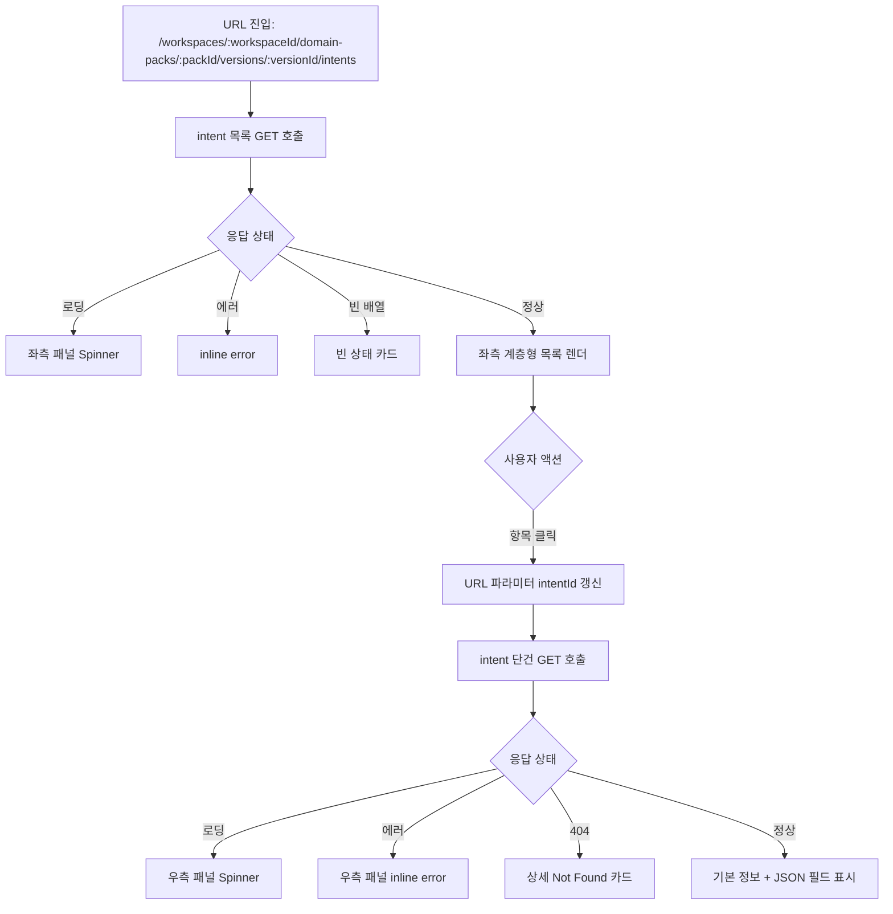

# [FE-214] Console — Intent 초안 목록 및 상세 조회 화면 구현

> **Backlog**: `213.md` callback으로 적재된 intent 초안을 운영자가 콘솔에서 목록과 상세로 조회하고 싶다 → review 이전에 저장 결과를 빠르게 검토하기 위해
> **Layer**: Frontend (Operator Console)
> **Template**: `.agent/specs/_TEMPLATE_FE.md`
> **Branch**: `spec/214`
> **Depends on**: `.agent/specs/213.md`, `.agent/specs/219.md`
> **Verified existing paths**: `backend/src/main/java/com/init/domainpack/presentation/IntentDefinitionController.java`, `frontend/src/pages/domain-pack/ui/WorkflowDraftReadPage.tsx`

---

## Goal

운영자 콘솔에서 `workspaceId / packId / versionId`가 주어진 상태로, 해당 `DomainPackVersion`에 저장된 intent 초안 목록과 선택된 intent의 상세 정보를 **좌측 계층형 목록 + 우측 상세 패널** 레이아웃으로 조회한다.

이번 스펙의 핵심 전제는 아래와 같다.

- intent 데이터의 생성 주체는 프런트엔드가 아니라 `213.md`의 Airflow callback이다.
- 프런트엔드는 callback이 적재한 결과를 읽어서 보여주는 read-only 화면만 담당한다.
- 현재 `main`에는 workflow 초안 조회 화면이 이미 있으므로, 이 스펙은 그 패턴을 재사용해 intent 조회 화면을 추가한다.
- pipeline 상태 폴링이나 callback 수신 자체는 이 스펙 범위에 포함하지 않는다.

---

## User Flow Chart



---

## Design Diff

### As-is vs To-be

| 영역 | As-is | To-be | 변경 내용 |
|------|-------|-------|----------|
| Domain Pack 콘솔 | workflow 초안 조회 화면만 존재 | intent 초안 조회 화면 추가 | 신규 read 기능 |
| Intent 조회 방식 | DB 또는 API 응답을 직접 봐야 함 | 브라우저에서 좌측 목록/우측 상세로 확인 | 운영자 UX 개선 |
| 계층 구조 표현 | 없음 | `parentIntentId` 기준 트리 렌더 | intent taxonomy 가시화 |
| 라우트 패턴 | workflow 조회 라우트만 존재 | 동일 규칙의 intent 조회 라우트 추가 | 기존 페이지 구조와 일관성 유지 |
| 서버 상태 관리 | `apiClient` + `useState/useEffect` 기반 | 동일 패턴 유지 | 기존 main 구현 방식 재사용 |

### Main 기준 재사용 포인트

- route parameter parsing: `frontend/src/shared/lib/parseRouteId.ts`
- 공통 API 클라이언트: `frontend/src/shared/api/index.ts`
- 2단 레이아웃 패턴: `frontend/src/pages/domain-pack/ui/WorkflowDraftReadPage.tsx`
- read 전용 상태 훅 패턴: `features/workflow-draft-read/model/useWorkflowList.ts`, `useWorkflowDetail.ts`

이번 스펙은 위 패턴을 intent 전용 feature로 복제·조정하는 방향을 따른다.

---

## Component Tree

```text
IntentDraftReadPage (pages/domain-pack/ui/IntentDraftReadPage.tsx)
├─ DashboardLayout
├─ PageHeader
│  ├─ Breadcrumb (ws / pack / version)
│  └─ VersionMetaStrip (READ ONLY)
├─ IntentTwoPane
│  ├─ IntentTreePanel
│  │  ├─ ListHeader (count)
│  │  ├─ IntentTreeItem[] (recursive)
│  │  │  ├─ IntentCodeLabel
│  │  │  ├─ IntentName
│  │  │  └─ StatusBadge
│  │  ├─ LoadingState
│  │  └─ EmptyState
│  └─ IntentDetailPanel
│     ├─ DetailHeader (name, code, updatedAt)
│     ├─ BasicInfoSection
│     ├─ JsonFieldSection (sourceClusterRef, entryConditionJson, evidenceJson, metaJson)
│     ├─ DetailLoadingState
│     ├─ DetailErrorState
│     └─ PlaceholderState
└─ OptionalInlineNotice (orphan intent / invalid params 등)
```

좌측은 "계층형 목록", 우측은 "선택된 intent 상세"에만 집중한다. 수정 액션, 승인/반려 버튼은 넣지 않는다.

---

## API Integration

### Endpoints

현재 `main`에 이미 구현된 BE read API를 사용한다.

| Method | Path | 용도 |
|--------|------|------|
| GET | `/api/v1/workspaces/{workspaceId}/domain-packs/{packId}/versions/{versionId}/intents` | intent 목록 조회 |
| GET | `/api/v1/workspaces/{workspaceId}/domain-packs/{packId}/versions/{versionId}/intents/{intentId}` | intent 단건 상세 조회 |

### Response Types

백엔드 DTO는 아래 구조를 기준으로 사용한다.

```ts
// entities/intent/model/types.ts
export interface IntentSummary {
  id: number;
  intentCode: string;
  name: string;
  description: string | null;
  taxonomyLevel: number;
  parentIntentId: number | null;
  status: string;
  sourceClusterRef: string;
  createdAt: string;
  updatedAt: string;
}

export interface IntentDetail {
  id: number;
  intentCode: string;
  name: string;
  description: string | null;
  taxonomyLevel: number;
  parentIntentId: number | null;
  status: string;
  sourceClusterRef: string;
  entryConditionJson: string;
  evidenceJson: string;
  metaJson: string;
  createdAt: string;
  updatedAt: string;
}

export interface IntentTreeNode extends IntentSummary {
  children: IntentTreeNode[];
}
```

주의점:

- `sourceClusterRef`, `entryConditionJson`, `evidenceJson`, `metaJson`는 문자열이다.
- 문자열이 JSON 형식이면 pretty-print해서 보여주고, 파싱 실패 시 raw string을 그대로 출력한다.
- list 응답에는 `parentIntentId`만 있으므로, 트리 구성은 `id -> parentIntentId` 매핑으로 처리한다.

### API Module Pattern

```ts
// features/intent-draft-read/api/intentApi.ts
import { apiClient } from "../../../shared/api";
import type { IntentDetail, IntentSummary } from "../../../entities/intent";

export const intentApi = {
  list: (wsId: number, packId: number, versionId: number) =>
    apiClient.get<IntentSummary[]>(
      `/workspaces/${wsId}/domain-packs/${packId}/versions/${versionId}/intents`,
    ),

  detail: (wsId: number, packId: number, versionId: number, intentId: number) =>
    apiClient.get<IntentDetail>(
      `/workspaces/${wsId}/domain-packs/${packId}/versions/${versionId}/intents/${intentId}`,
    ),
};
```

### State Hook Pattern

workflow 조회 기능과 같은 방식으로 `useState + useEffect`를 사용한다. 새로운 서버 상태 라이브러리는 도입하지 않는다.

```ts
export type IntentListState =
  | { status: "loading" }
  | { status: "error"; code: string; message: string; httpStatus?: number }
  | { status: "ready"; data: IntentSummary[] };

export type IntentDetailState =
  | { status: "idle" }
  | { status: "loading" }
  | { status: "error"; code: string; message: string; httpStatus?: number }
  | { status: "ready"; data: IntentDetail };
```

---

## Data Flow

```text
IntentDraftReadPage
  -> useParams()
  -> parseRouteId(workspaceId / packId / versionId / intentId)
  -> useIntentList(wsId, packId, versionId)
    -> intentApi.list()
      -> IntentSummary[]
        -> buildIntentTree()
          -> IntentTreePanel 렌더
  -> 사용자가 항목 클릭
    -> navigate(.../intents/{intentId})
      -> useIntentDetail(wsId, packId, versionId, intentId)
        -> intentApi.detail()
          -> IntentDetail
            -> IntentDetailPanel 렌더
```

트리 구성 알고리즘 원칙:

1. `IntentSummary[]`를 `id` 기준 map으로 만든다.
2. 각 item을 `parentIntentId` 기준으로 부모의 `children`에 연결한다.
3. 부모가 없거나 `parentIntentId`가 `null`이면 root node로 둔다.
4. 응답 정렬이 보장되지 않으므로, 트리 구성은 입력 순서에 의존하지 않는다.

---

## Route Design

App 라우트에 아래 경로를 추가한다.

| Path | 설명 |
|------|------|
| `/workspaces/:workspaceId/domain-packs/:packId/versions/:versionId/intents` | intent 목록 조회 |
| `/workspaces/:workspaceId/domain-packs/:packId/versions/:versionId/intents/:intentId` | 특정 intent 상세 조회 |

페이지는 workflow read 화면과 동일하게 path parameter 기반으로 동작한다. 상위 pack/version 선택 화면은 범위 밖이다.

---

## 수정 대상 파일

| 파일 | 변경 유형 | 설명 |
|------|----------|------|
| `frontend/src/app/App.tsx` | update | intent 조회 라우트 추가 |
| `frontend/src/entities/intent/index.ts` | new | intent 타입 export |
| `frontend/src/entities/intent/model/types.ts` | new | `IntentSummary`, `IntentDetail`, `IntentTreeNode` 정의 |
| `frontend/src/features/intent-draft-read/api/intentApi.ts` | new | list/detail API 함수 |
| `frontend/src/features/intent-draft-read/model/mapApiError.ts` | new | workflow read와 동일 패턴의 에러 매핑 |
| `frontend/src/features/intent-draft-read/model/buildIntentTree.ts` | new | flat summary -> tree 변환 |
| `frontend/src/features/intent-draft-read/model/useIntentList.ts` | new | 목록 조회 상태 훅 |
| `frontend/src/features/intent-draft-read/model/useIntentDetail.ts` | new | 상세 조회 상태 훅 |
| `frontend/src/features/intent-draft-read/ui/IntentTreePanel.tsx` | new | 계층형 목록 패널 |
| `frontend/src/features/intent-draft-read/ui/IntentDetailPanel.tsx` | new | 상세 패널 |
| `frontend/src/features/intent-draft-read/ui/IntentTreePanel.module.css` | new | 목록 패널 스타일 |
| `frontend/src/features/intent-draft-read/ui/IntentDetailPanel.module.css` | new | 상세 패널 스타일 |
| `frontend/src/features/intent-draft-read/ui/index.ts` | new | UI export |
| `frontend/src/pages/domain-pack/ui/IntentDraftReadPage.tsx` | new | page composition |
| `frontend/src/pages/domain-pack/ui/intent-draft-read-page.module.css` | new | page layout 스타일 |

`parseRouteId`와 `apiClient`는 기존 shared 모듈을 그대로 재사용한다.

---

## UX / 화면 원칙

- invalid route param이면 API 호출을 하지 않고 즉시 "잘못된 URL 파라미터" 경고를 보여준다.
- 목록은 root intent부터 표시하고, child intent는 들여쓰기와 연결선 또는 단계 구분 스타일로 표시한다.
- 선택된 intent는 목록에서 명확히 강조한다.
- detail 미선택 상태에서는 "좌측에서 intent를 선택하세요" placeholder를 보여준다.
- `description`이 비어 있어도 레이아웃은 유지한다.
- JSON 문자열 필드는 가능한 경우 pretty-print `<pre>`로 보여준다.
- status는 text만 두지 말고 badge 형태로 표시한다.

---

## Tests

### Test Strategy

| 구분 | 방법 | 도구 | 비고 |
|------|------|------|------|
| 컴포넌트 테스트 | Vitest + Testing Library | `pnpm test` | list/detail 상태 분기 |
| 수동 테스트 | 브라우저 확인 | `pnpm dev` | URL 진입과 라우트 전환 확인 |
| API Mock | mock `apiClient` 또는 `fetch` | unit/component test | network 의존 제거 |

### Test Scenarios

#### Happy Path

| # | 시나리오 | 사전 조건 | 조작 | 기대 결과 |
|---|---------|---------|------|----------|
| 1 | 목록 조회 성공 | list API가 3개 intent 반환 | 목록 URL 진입 | 좌측 패널에 3개 intent가 트리로 표시됨 |
| 2 | 상세 조회 성공 | detail API가 정상 응답 | 목록에서 intent 클릭 | URL이 `/intents/{id}`로 바뀌고 우측 패널에 상세 표시 |
| 3 | 부모-자식 트리 렌더 | child intent가 `parentIntentId`를 가짐 | 페이지 진입 | child가 parent 아래에 렌더됨 |
| 4 | 직접 상세 URL 진입 | 목록/상세 API 모두 정상 | `/intents/{id}`로 직접 진입 | 좌측 목록과 우측 상세가 동시에 올바르게 렌더됨 |

#### Error & Edge Cases

| # | 시나리오 | 사전 조건 | 조작 | 기대 결과 |
|---|---------|---------|------|----------|
| 1 | 목록 API 실패 | list API 500 | 목록 URL 진입 | 좌측 패널에 에러 메시지 표시 |
| 2 | 상세 API 404 | 존재하지 않는 intentId로 진입 | 상세 URL 진입 | 우측 패널에 not found 상태 표시 |
| 3 | 잘못된 URL 파라미터 | `workspaceId=abc` | 페이지 진입 | API 호출 없이 invalid params 메시지 표시 |
| 4 | 빈 목록 | list API 빈 배열 | 목록 URL 진입 | 빈 상태 카드 표시 |
| 5 | 파싱 불가 JSON 문자열 | `metaJson = "{broken"` | 상세 패널 표시 | 앱이 깨지지 않고 raw string 출력 |

#### 접근성 / 반응형

| # | 확인 항목 | 기대 결과 |
|---|---------|----------|
| 1 | 데스크톱 | 좌측 목록 / 우측 상세 2단 유지 |
| 2 | 모바일 | 세로 스택 또는 detail 우선 레이아웃으로 전환 |
| 3 | 키보드 탐색 | 목록 항목 Tab 이동 + Enter 선택 가능 |
| 4 | 긴 intent 이름 | 줄바꿈 또는 ellipsis 처리로 레이아웃 붕괴 없음 |

---

## Out of Scope

- pipeline 상태 폴링 화면
- intent 수정, 승인, 반려
- slot / policy / risk / workflow 조회를 한 화면에 통합하는 작업
- search/filter/sort 고도화
- review task 생성 또는 review 화면 연결

이번 스펙은 **저장된 intent 초안의 목록 및 상세 조회 화면**까지만 다룬다.
