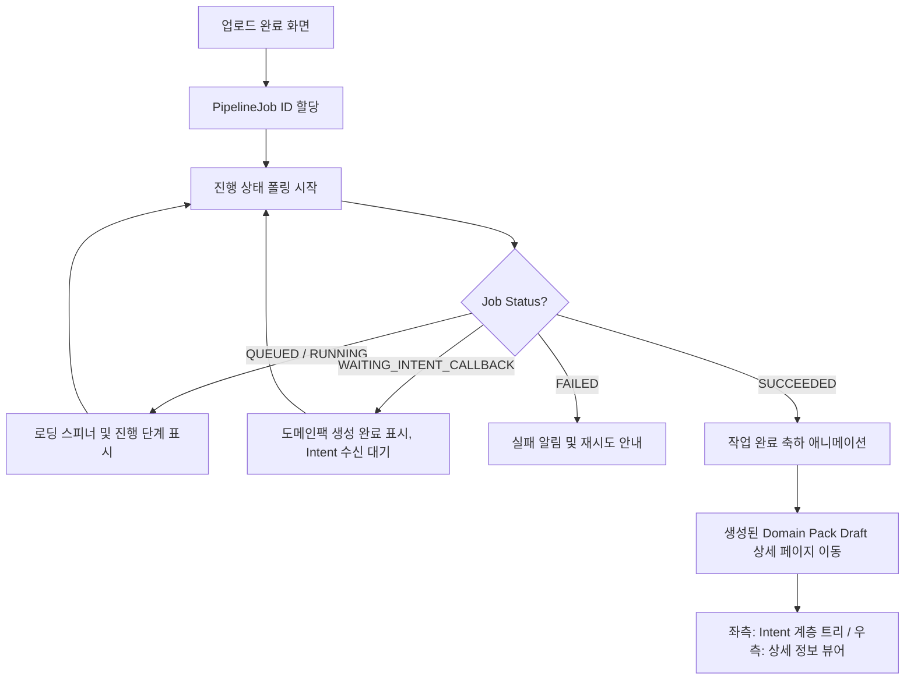

# [FE-214] 파이프라인 모니터링 및 Intent Draft 조회 화면 구현

> **Backlog**: 유저가 업로드한 상담 로그가 처리되는 에어플로우 파이프라인 작업 상황을 모니터링하고, 콜백으로 적재 완료된 Domain Pack Draft 내역을 시각적으로 검토하고 싶다.
> **상위 스펙**: `213.md` (Airflow Callback -> Domain Pack DRAFT 생성)
> **Bounded Context**: `pipelinejob`, `domain-pack`
> **Template**: `_TEMPLATE_FE.md`
> **Branch**: `spec/214`

---

## Goal

상담 로그 분석 파이프라인의 현재 진행 상태를 사용자에게 실시간 폴링으로 안내하고, 작업이 성공(`SUCCEEDED`)하면 백엔드에 적재된 Domain Pack Draft 버전의 Intent 목록을 트리(Tree) 계층 구조로 조회할 수 있는 대시보드를 FSD 아키텍처와 Figma Design System 규칙에 맞게 구현한다.

---

## User Flow Chart



---

## Design Diff

### As-is vs To-be

| 영역 | As-is | To-be |
|------|-------|-------|
| 상태 안내 | 업로드 후 무한 대기 또는 알림 없음 | Pipeline 단계별 실시간 Progress Stepper 제공 |
| 조회 방식 | DB를 직접 까봐야 알 수 있음 | 부모-자식 관계가 시각적으로 연결된 트리(Tree) UI 제공 |
| 디자인 테마 | 기본 컴포넌트 조합 형태 | Figma 테마 적용 (figmaSans, 흑백 베이스 구조, Dashed Focus, Pill Button) |

---

## Component Tree

```text
PipelineResultPage
 ├─ PipelineStatusTracker (Widget)
 │    ├─ StatusStepper (QUEUED -> RUNNING -> WAITING -> SUCCEEDED)
 │    └─ ErrorStateMessage (조건부)
 └─ DomainPackDraftViewer (Widget)
      ├─ ViewerHeader
      │    ├─ PackTitle (figmaSans, 64px)
      │    └─ StatusBadge (Black Pill)
      ├─ IntentWorkspace (가로 분할 레이아웃)
           ├─ IntentTreeSidebar (Feature)
           │    ├─ TreeItem (부모/자식 들여쓰기)
           │    └─ SearchInput (Dashed Focus)
           └─ IntentDetailPanel (Feature)
                ├─ IntentCodeLabel (figmaMono)
                ├─ IntentName
                └─ SummaryMetrics (도넛 차트 또는 통계 데이터)
```

---

## API Integration

### 백엔드 요구사항 (신규 API 필요)

프론트엔드 연동을 위해 백엔드에 다음 조회(GET) API가 추가로 구현되어야 합니다.

| Method | Path | Description |
|--------|------|-------------|
| GET | `/api/v1/pipeline-jobs/{id}` | 특정 파이프라인의 진행 상태 및 에러 메시지, 연결된 domainPackId 조회 |
| GET | `/api/v1/domain-packs/{id}/draft` | 해당 팩의 DRAFT 버전 상세 정보 및 모든 Intent 목록 조회 |

### Query Key Pattern (TanStack Query)

```typescript
// entities/pipeline-job/api.ts
export const pipelineJobKeys = {
  all: ['pipeline-jobs'] as const,
  detail: (id: string) => [...pipelineJobKeys.all, 'detail', id] as const,
};

// features/pipeline-monitoring/api/usePipelineJob.ts
export function usePipelineJobPolling(id: string) {
  return useQuery({
    queryKey: pipelineJobKeys.detail(id),
    queryFn: () => fetchPipelineJob(id),
    refetchInterval: (data) => 
      // 성공이나 실패 시에는 폴링 중단
      (data?.status === 'SUCCEEDED' || data?.status === 'FAILED') ? false : 3000, 
  });
}
```

---

## 수정 대상 파일 (FSD 구조)

| 파일 | 변경 유형 | 설명 |
|------|----------|------|
| `src/pages/pipeline-result/ui/index.tsx` | new | 상태 추적 및 조회 메인 페이지 |
| `src/entities/pipeline-job/model/types.ts` | new | PipelineJob 상태 타입 정의 |
| `src/entities/domain-pack/model/types.ts` | update | Intent 트리 구조화 객체 타입 추가 |
| `src/widgets/pipeline-status-tracker/ui.tsx` | new | 상태 진행률 렌더 위젯 |
| `src/widgets/domain-pack-draft-viewer/ui.tsx` | new | 결과 뷰어 레이아웃 |
| `src/features/intent-tree/ui/index.tsx` | new | 재귀적 트리 컴포넌트 |

---

## Design System 적용 가이드 (frontend/DESIGN.md 기준)

1. **컬러 팔레트**: 메인 인터페이스는 오직 `Pure Black(#000000)`과 `Pure White(#ffffff)`만 사용. 완료를 축하하는 영웅(Hero) 섹션 부분에만 톡톡 튀는 그라디언트를 사용해 시각적 쾌감을 준다.
2. **타이포그래피**: 
   - 메인 타이틀: `figmaSans`, 64px, weight 400, letter-spacing -0.96px
   - Intent 코드 라벨: `figmaMono`, 18px, uppercase, letter-spacing +0.54px
   - 본문/설명: `figmaSans`, 16px, weight 330, letter-spacing -0.14px
3. **인터랙션**: 모든 트리 노드나 버튼 클릭 포커스 시 `dashed 2px` 외곽선을 표시한다. 버튼 모서리는 완전한 `50px` (Pill 구조)를 채택한다.
4. **여백**: 기본 8px 단위(8, 16, 24, 32...)를 흑백 구조 내에서 적극적으로 사용하여 빈 공간으로 섹션을 분리한다.

---

## Test Scenarios

| # | 시나리오 | 사전 조건 | 조작 | 기대 결과 |
|---|---------|---------|------|----------|
| 1 | 상태 폴링 확인 | API가 RUNNING 상태 반환 중 | 페이지 진입 | 3초마다 API 다시 맞는지 Network 탭 확인, 프로그레스 바 애니메이션 |
| 2 | 작업 완료 자동 전환 | 백엔드가 마침내 SUCCEEDED 반환 | 폴링 대기 | 자동 폴링 멈춤, 하단에 도메인 팩 조회 뷰어 부드럽게 등장 |
| 3 | 에러 발생 처리 | 백엔드가 FAILED 반환 | 폴링 대기 | 붉은 계열의 상태 메시지와 함께 재시도(초기화) 버튼 표시 |
| 4 | 트리 계층구조 표기 | Intent 데이터 중 `parentIntentCode`가 있음 | 트리 폴더 클릭 | 자식 노드들이 들여쓰기 탭과 함께 아코디언처럼 나타남 |
