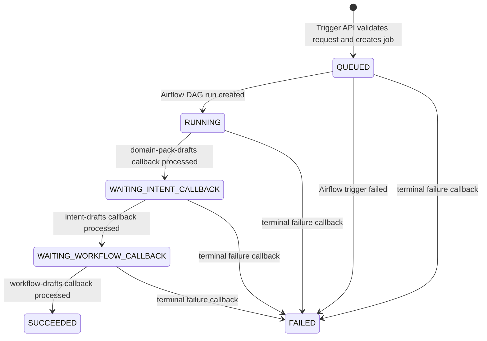
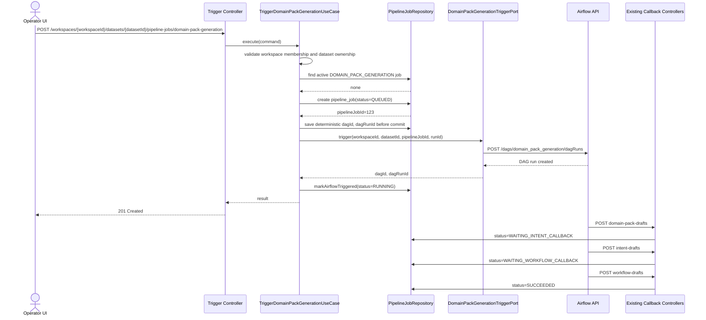
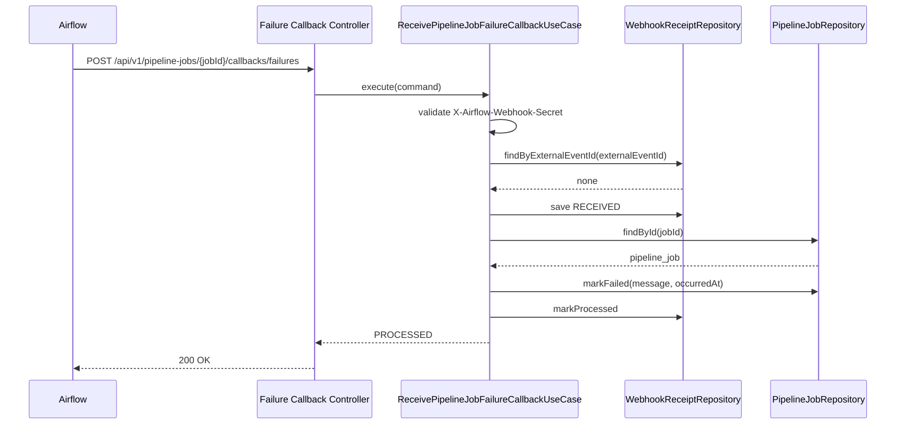

# [BE-215] Domain Pack Generation DAG Trigger API 및 Terminal Failure Callback

> **Backlog**: Conversation Intent 생성 DAG 트리거 API 구현
> **Bounded Context**: `pipelinejob`, `workspace`, `corpus`
> **Template**: `.agent/specs/_TEMPLATE_BE.md`
> **Branch**: `feature/215-domain-pack-generation-trigger`
> **Depends on**: `.agent/specs/213.md`, `.agent/specs/217.md`, `.agent/specs/218.md`, `.agent/specs/114.md`
> **Verified existing paths**:
> - `backend/src/main/java/com/init/pipelinejob/domain/model/PipelineJob.java`
> - `backend/src/main/java/com/init/pipelinejob/domain/model/WebhookReceipt.java`
> - `backend/src/main/java/com/init/pipelinejob/domain/repository/PipelineJobRepository.java`
> - `backend/src/main/java/com/init/pipelinejob/domain/repository/WebhookReceiptRepository.java`
> - `backend/src/main/java/com/init/pipelinejob/infrastructure/persistence/JpaPipelineJobRepository.java`
> - `backend/src/main/java/com/init/pipelinejob/infrastructure/persistence/JpaWebhookReceiptRepository.java`
> - `backend/src/main/java/com/init/pipelinejob/application/PipelineJobCallbackSupportService.java`
> - `backend/src/main/java/com/init/pipelinejob/presentation/PipelineIntentDraftCallbackController.java`
> - `backend/src/main/java/com/init/pipelinejob/presentation/PipelineWorkflowDraftCallbackController.java`
> - `backend/src/main/java/com/init/pipelinejob/application/ReceiveDomainPackDraftCallbackUseCase.java`
> - `backend/src/main/java/com/init/pipelinejob/application/ReceiveIntentDraftCallbackUseCase.java`
> - `backend/src/main/java/com/init/pipelinejob/application/ReceiveWorkflowDraftCallbackUseCase.java`
> - `backend/src/main/java/com/init/corpus/domain/repository/DatasetRepository.java`
> - `backend/src/main/java/com/init/corpus/infrastructure/airflow/AirflowIngestionTriggerAdapter.java`
> - `backend/src/main/java/com/init/workspace/domain/model/WorkspaceMemberRole.java`
> - `backend/src/main/java/com/init/workspace/domain/repository/WorkspaceMemberRepository.java`
> - `backend/src/main/java/com/init/shared/infrastructure/security/SecurityConfig.java`
> - `backend/src/main/resources/application.yml`
> - `backend/src/main/resources/application-local.yml`
> - `.env.example`
> - `docker-compose.yml`
> - `ml/src/dags/domain_pack_generation.py`
> - `ml/src/pipeline/common/callbacks.py`
> - `ml/src/pipeline/stages/publish_candidate/main.py`

---

## Goal

Spring Backend가 workspace dataset을 기준으로 기존 Airflow `domain_pack_generation` DAG를 트리거하고, 생성된 `pipeline_job`의 실행 상태를 추적할 수 있게 한다.

초기 backlog 명칭은 "Conversation Intent 생성 DAG 트리거"였지만, 현재 Airflow DAG의 실제 산출물은 intent 단독이 아니다. `publish_candidate` 단계는 `domain-pack-drafts` -> `intent-drafts` -> `workflow-drafts` callback을 순차 호출하며, 최종적으로 Domain Pack 후보 전체를 Spring에 적재한다. 따라서 본 스펙의 기능명과 API 의미는 `Domain Pack Generation`으로 정의한다.

---

## Current State

현재 구현은 Airflow가 산출물을 만든 뒤 Spring으로 전달하는 callback 수신부가 중심이다.

| 구분 | Endpoint | 역할 |
|------|----------|------|
| 성공 산출물 callback | `POST /api/v1/pipeline-jobs/{jobId}/callbacks/domain-pack-drafts` | `DomainPack` 조회/생성 + 빈 `DRAFT` version 생성 |
| 성공 산출물 callback | `POST /api/v1/pipeline-jobs/{jobId}/callbacks/intent-drafts` | 기존 `DRAFT` version에 intent 적재 |
| 성공 산출물 callback | `POST /api/v1/pipeline-jobs/{jobId}/callbacks/workflow-drafts` | slot/policy/risk/workflow/binding 적재 후 `pipeline_job`을 `SUCCEEDED` 종료 |

반대로 Spring에서 Airflow DAG run을 생성하는 trigger API는 아직 없다. `corpus` 쪽 `AirflowIngestionTriggerAdapter`는 114 스펙의 upload 흐름에서 언급된 NOOP 계열이며, 본 기능의 `pipeline.pipeline_job` 상태 추적 책임과 직접 맞지 않는다.

또한 기존 `PipelineJobCallbackSupportService.markFailure(...)`는 외부 failure callback endpoint가 아니다. 성공 산출물 callback을 Spring이 처리하던 중 예외가 발생했을 때 `webhook_receipt`와 `pipeline_job`을 `FAILED`로 보상 처리하는 내부 로직이다.

---

## Scope

### In scope

- `POST /api/v1/workspaces/{workspaceId}/datasets/{datasetId}/pipeline-jobs/domain-pack-generation` 신규 trigger API
- request body 없는 trigger 계약
- JWT 인증 + workspace membership 기반 권한 검증
- workspace dataset 소유 관계 검증
- 같은 dataset에 대한 active `DOMAIN_PACK_GENERATION` job 중복 실행 방지
  - DB schema 변경 없이 PostgreSQL transaction-scoped advisory lock 사용
- `pipeline_job` 생성 및 상태 전이
- `DomainPackGenerationTriggerPort` application port 추가
- Airflow 구현체 `AirflowDomainPackGenerationTriggerAdapter` 추가
- Airflow outgoing API 설정 및 env 주입 경로 추가
- deterministic `dag_run_id = pipeline_job_{pipelineJobId}` 사용
- Airflow trigger 실패 시 `pipeline_job`을 `FAILED`로 남기고 client에 `502 Bad Gateway` 반환
  - 단, timeout/connection ambiguous failure는 deterministic `dagRunId`로 Airflow DAG run 조회를 1회 시도해 성공 여부를 보정
- Airflow DAG run terminal failure 수신 endpoint 추가
  - `POST /api/v1/pipeline-jobs/{jobId}/callbacks/failures`
- terminal failure callback의 `webhook_receipt` 기반 멱등 처리
- failure callback의 `dagId`, `dagRunId`가 실제 `pipeline_job`의 Airflow 실행 정보와 일치하는지 검증
- 기존 성공 callback과 신규 failure callback의 책임 구분 문서화

### Out of scope

- Airflow DAG에서 terminal failure callback을 실제 발신하는 ML/Infra 구현
- Airflow stage attempt별 started/failed callback
- 기존 `domain-pack-drafts`, `intent-drafts`, `workflow-drafts` 성공 callback request/response 변경
- ML stage retry 정책 변경
- UI trigger 버튼
- review task 자동 생성
- `job_type` Java enum 또는 DB enum 도입
- request body 기반 generation option

---

## Terminology

| 용어 | 의미 |
|------|------|
| `DOMAIN_PACK_GENERATION` | 본 기능에서 사용하는 `pipeline_job.job_type` 문자열 값 |
| active job | `QUEUED`, `RUNNING`, `WAITING_INTENT_CALLBACK`, `WAITING_WORKFLOW_CALLBACK` 상태의 job |
| terminal job | `SUCCEEDED`, `FAILED`, `CANCELLED` 상태의 job |
| success callback | Airflow `publish_candidate`가 정상 산출물을 Spring으로 전달하는 기존 3개 callback |
| terminal failure callback | Airflow DAG run이 retry/복구 가능성을 모두 소진한 뒤 최종 실패를 Spring에 알리는 신규 callback |

`job_type`은 Java enum으로 추가하지 않는다. 현재 `PipelineJob.jobType`과 DB `pipeline.pipeline_job.job_type`은 문자열 기반이므로, 본 기능도 `DOMAIN_PACK_GENERATION` 문자열 식별자를 사용한다.

---

## State Flow



`RUNNING`은 Airflow DAG 내부 stage 시작이 아니라, Spring이 Airflow DAG run 생성 API 호출에 성공했다는 뜻이다. 별도 `stage_started` callback은 추가하지 않는다.

Airflow DAG run이 최종 실패하면 신규 terminal failure callback을 통해 Spring의 `pipeline_job`을 `FAILED`로 종료한다. Airflow에서 실제 failure callback을 발신하는 작업은 ML/Infra 후속 의존성이지만, BE는 본 스펙에서 수신 계약과 상태 전이를 구현한다.

---

## Sequence Diagram



Failure path:



---

## REST API

### 1. Domain Pack Generation Trigger

| Method | Path | Description |
|--------|------|-------------|
| POST | `/api/v1/workspaces/{workspaceId}/datasets/{datasetId}/pipeline-jobs/domain-pack-generation` | 기존 Airflow `domain_pack_generation` DAG run 생성 |

Request header:

| Name | Required | Description |
|------|----------|-------------|
| `Authorization` | Y | JWT access token |

Request body: 없음.

Success response: `201 Created`

```json
{
  "pipelineJobId": 123,
  "workspaceId": 1,
  "datasetId": 7,
  "jobType": "DOMAIN_PACK_GENERATION",
  "status": "RUNNING",
  "airflowDagId": "domain_pack_generation",
  "airflowRunId": "pipeline_job_123",
  "requestedAt": "2026-05-04T10:00:00Z",
  "startedAt": "2026-05-04T10:00:01Z"
}
```

Validation and authorization:

| 조건 | 응답 |
|------|------|
| JWT 없음 또는 invalid | `401 Unauthorized` |
| workspace 없음 | `404 Not Found` |
| dataset 없음 또는 해당 workspace 소속 아님 | `404 Not Found` |
| workspace 멤버가 아니거나 role 불충분 | `403 Forbidden` |
| active `DOMAIN_PACK_GENERATION` job 존재 | `409 Conflict` |
| Airflow trigger 실패/timeout | `502 Bad Gateway` |

Active job conflict response:

```json
{
  "code": "PIPELINE_JOB_ALREADY_RUNNING",
  "message": "해당 dataset에 대해 진행 중인 Domain Pack Generation 작업이 있습니다.",
  "pipelineJobId": 123,
  "status": "RUNNING"
}
```

Airflow trigger failure response:

```json
{
  "code": "AIRFLOW_TRIGGER_FAILED",
  "message": "Domain Pack Generation DAG 실행 요청에 실패했습니다.",
  "pipelineJobId": 123,
  "status": "FAILED"
}
```

Ambiguous timeout handling:

Airflow trigger 요청이 timeout 또는 connection reset 등으로 실패했지만 Airflow가 DAG run을 생성했는지 확정할 수 없는 경우가 있다. 이때 곧바로 `FAILED`로 확정하면, 실제로는 실행 중인 DAG가 이후 success callback을 보낼 수 있어 Spring 상태와 Airflow 상태가 충돌한다.

따라서 ambiguous failure는 deterministic `dagRunId`를 사용해 1회 보정한다.

```text
1. Airflow trigger request timeout/connection ambiguous failure 발생
2. 동일 dagId + dagRunId로 Airflow DAG run 조회를 1회 시도
3. DAG run이 존재하면 trigger 성공으로 간주하고 pipeline_job = RUNNING
4. DAG run이 존재하지 않거나 조회도 실패하면 pipeline_job = FAILED, client response = 502
```

조회 보정은 Airflow 외부 호출 구간에서 수행하며, DB transaction 안에서 수행하지 않는다.

### 2. Terminal Failure Callback

| Method | Path | Description |
|--------|------|-------------|
| POST | `/api/v1/pipeline-jobs/{jobId}/callbacks/failures` | Airflow DAG run terminal failure를 Spring `pipeline_job`에 반영 |

Request header:

| Name | Required | Description |
|------|----------|-------------|
| `X-Airflow-Webhook-Secret` | Y | `airflow.webhook.secret`와 일치해야 하는 webhook secret |

Request body:

```json
{
  "externalEventId": "airflow:failure:domain_pack_generation:pipeline_job_123:preprocessing",
  "dagId": "domain_pack_generation",
  "dagRunId": "pipeline_job_123",
  "failedStage": "preprocessing",
  "reason": "TASK_FAILED",
  "message": "PII masking failed",
  "occurredAt": "2026-05-04T10:30:00Z",
  "error": {
    "type": "PipelineStageError",
    "message": "PII masking failed",
    "traceback": "redacted or truncated traceback"
  }
}
```

Required fields:

| 필드 | 제약 |
|------|------|
| `externalEventId` | 필수, 최대 255자, `pipeline.webhook_receipt.external_event_id` 기준 전역 unique |
| `dagId` | 필수, 최대 255자 |
| `dagRunId` | 필수, 최대 255자 |
| `failedStage` | 필수, 최대 100자. stage 특정 불가 시 `dag` 또는 `unknown` 허용 |
| `reason` | 필수, 최대 100자 |
| `message` | 필수, 최대 `pipeline_job.last_error_message` 저장 가능 길이 이내 |
| `occurredAt` | 필수, ISO-8601 offset date-time |
| `error` | 선택 diagnostic object |

Recommended `reason` values:

```text
TASK_FAILED
DAG_FAILED
EVALUATION_BLOCKED
CALLBACK_FAILED
TIMEOUT
CANCELLED
UNKNOWN
```

`error.traceback`은 반드시 redacted/truncated된 값만 허용한다. BE는 `webhook_receipt.requestBodyJson` 또는 `pipeline_job.resultSummaryJson`에 diagnostic object를 저장할 수 있으나, 민감정보 원문 저장은 금지한다.

Success response:

```json
{
  "status": "PROCESSED",
  "externalEventId": "airflow:failure:domain_pack_generation:pipeline_job_123:preprocessing",
  "pipelineJobId": 123,
  "jobStatus": "FAILED"
}
```

Duplicate response:

```json
{
  "status": "DUPLICATE_IGNORED",
  "externalEventId": "airflow:failure:domain_pack_generation:pipeline_job_123:preprocessing",
  "pipelineJobId": 123,
  "jobStatus": "FAILED"
}
```

Final-state policy:

| 현재 `pipeline_job.status` | 처리 |
|---------------------------|------|
| same `externalEventId` already `PROCESSED` | `200 OK`, `DUPLICATE_IGNORED` |
| `SUCCEEDED` | `409 Conflict`, failure로 되돌리지 않음 |
| `FAILED` | `200 OK`, `IGNORED_ALREADY_FAILED` |
| `CANCELLED` | `200 OK`, `IGNORED_CANCELLED` |
| `QUEUED`, `RUNNING`, `WAITING_INTENT_CALLBACK`, `WAITING_WORKFLOW_CALLBACK` | `markFailed(message, occurredAt)`, `200 OK`, `PROCESSED` |

Target validation:

- `dagId`는 `pipeline_job.airflowDagId`와 일치해야 한다.
- `dagRunId`는 `pipeline_job.airflowRunId`와 일치해야 한다.
- 둘 중 하나라도 불일치하면 `409 PIPELINE_JOB_CALLBACK_TARGET_MISMATCH`를 반환하고 job 상태를 변경하지 않는다.
- 단, 같은 `externalEventId`가 이미 `PROCESSED`인 duplicate 요청은 target validation 전에 `200 OK`, `DUPLICATE_IGNORED`로 종료할 수 있다.

---

## Authorization

Trigger API는 HTTP security layer에서 JWT 인증만 요구한다. 전역 `UserRole.OPERATOR/ADMIN`을 강제하지 않는다.

UseCase에서는 workspace membership을 검증한다.

| Workspace role | Trigger 허용 |
|----------------|--------------|
| `OWNER` | Y |
| `ADMIN` | Y |
| `OPERATOR` | Y |
| `REVIEWER` | N |
| 비멤버 | N |

이 API는 시스템 운영자 전용 endpoint가 아니라 workspace dataset을 기반으로 workspace 산출물을 생성하는 작업이다. 따라서 workspace 소유자인 `OWNER`도 허용한다.

기존 domain-pack 일부 use case가 `OPERATOR`, `ADMIN`만 허용하는 패턴과 다르다. 본 기능은 `pipelinejob` trigger 권한 모델을 workspace membership 기준으로 별도 정의한다.

---

## Airflow Trigger Contract

Airflow DAG run 생성 요청은 Airflow 3.x API를 기준으로 한다.

```http
POST {airflow.api.base-url}/dags/{dagId}/dagRuns
Authorization: Basic ...
Content-Type: application/json
```

Request body:

```json
{
  "dag_run_id": "pipeline_job_123",
  "conf": {
    "workspace_id": 1,
    "dataset_id": 7,
    "pipeline_job_id": 123
  }
}
```

Ambiguous failure reconciliation:

Airflow trigger 요청의 성공 여부가 불명확하면 같은 `dagId`, `dagRunId`로 DAG run 조회 API를 1회 호출한다.

```http
GET {airflow.api.base-url}/dags/{dagId}/dagRuns/{dagRunId}
Authorization: Basic ...
```

Port 구현체는 아래 결과를 application layer로 전달해야 한다.

| 상황 | 처리 |
|------|------|
| trigger response 2xx | `DomainPackGenerationTriggerResult(dagId, dagRunId)` 반환 |
| trigger timeout 후 DAG run 조회 성공 | `DomainPackGenerationTriggerResult(dagId, dagRunId)` 반환 |
| trigger timeout 후 DAG run 조회 404 | trigger 실패로 변환 |
| trigger timeout 후 DAG run 조회 timeout/5xx | trigger 실패로 변환 |
| trigger response 명확한 4xx/5xx | trigger 실패로 변환 |

`dag_run_id`는 deterministic하게 아래 형식을 사용한다.

```text
pipeline_job_{pipelineJobId}
```

Spring `pipeline_job.requestPayloadJson`에는 운영 추적을 위해 최소 아래 정보를 저장한다.

```json
{
  "workspaceId": 1,
  "datasetId": 7,
  "jobType": "DOMAIN_PACK_GENERATION",
  "airflowDagId": "domain_pack_generation",
  "airflowRunId": "pipeline_job_123",
  "requestedBy": 55
}
```

`pipeline_job`에는 아래 값을 반영한다. `airflowDagId`, `airflowRunId`는 deterministic 값이므로 Airflow 호출 전 `QUEUED` 생성 transaction 안에서 저장한다. 그래야 `QUEUED` 상태에서 terminal failure callback이 도착하더라도 callback target validation을 수행할 수 있다.

| 필드 | 값 |
|------|----|
| `datasetId` | path variable `datasetId` |
| `triggeredBy` | JWT 사용자 id |
| `airflowDagId` | `QUEUED` 생성 시점에 저장, 설정값 기본 `domain_pack_generation` |
| `airflowRunId` | `QUEUED` 생성 시점에 저장, `pipeline_job_{id}` |
| `status` | Airflow 호출 전 `QUEUED`, Airflow trigger 성공 후 `RUNNING` |
| `startedAt` | Airflow trigger 성공 시각 |

---

## Transaction Boundary

Airflow 외부 호출은 DB transaction 내부에서 수행하지 않는다.

1. 짧은 transaction
   - `workspaceId + datasetId + jobType` 조합으로 PostgreSQL transaction-scoped advisory lock 획득
   - workspace membership 검증
   - dataset ownership 검증
   - active job 중복 검증
   - `pipeline_job` 생성: `QUEUED`
   - 생성된 `pipelineJobId`로 deterministic `airflowRunId = pipeline_job_{pipelineJobId}` 할당
   - `airflowDagId`, `airflowRunId` 저장
   - commit

2. transaction 밖
   - Airflow DAG run 생성 API 호출

3. 짧은 transaction
   - 성공: `startedAt` 저장, `status = RUNNING`
   - 실패: `status = FAILED`, `lastErrorMessage`, `finishedAt` 저장

외부 시스템 지연/timeout이 DB transaction과 lock을 길게 유지하지 않도록 위 경계를 유지한다.

### Concurrent trigger guard

DB schema 변경 없이 active job 중복 생성을 막기 위해 PostgreSQL transaction-scoped advisory lock을 사용한다.

Lock key:

```text
workspaceId + datasetId + jobType
```

Rules:

- lock key의 `jobType`은 `DOMAIN_PACK_GENERATION` 문자열 값을 사용한다.
- advisory lock 획득, active job 조회, `QUEUED` job 생성을 같은 DB transaction 안에서 수행한다.
- 같은 `workspaceId + datasetId + jobType` 조합의 동시 trigger 요청은 advisory lock에 의해 직렬화된다.
- 먼저 들어온 요청이 `QUEUED` job을 commit하면, 뒤따라 lock을 획득한 요청은 active job 조회에서 해당 job을 발견하고 `409 PIPELINE_JOB_ALREADY_RUNNING`을 반환한다.
- lock은 transaction-scoped를 사용해 commit/rollback 시 자동 해제되게 한다.
- advisory lock은 중복 trigger 생성 방지에만 사용하며, Airflow 외부 호출 구간까지 유지하지 않는다.

---

## Class Design

### Planned new application types

신규 예정 경로:

```text
backend/src/main/java/com/init/pipelinejob/application/TriggerDomainPackGenerationUseCase.java
backend/src/main/java/com/init/pipelinejob/application/TriggerDomainPackGenerationCommand.java
backend/src/main/java/com/init/pipelinejob/application/TriggerDomainPackGenerationResult.java
backend/src/main/java/com/init/pipelinejob/application/DomainPackGenerationTriggerPort.java
backend/src/main/java/com/init/pipelinejob/application/DomainPackGenerationTriggerResult.java
backend/src/main/java/com/init/pipelinejob/application/DomainPackGenerationConcurrencyGuard.java
backend/src/main/java/com/init/pipelinejob/application/WorkspaceMembershipPort.java
backend/src/main/java/com/init/pipelinejob/application/DatasetOwnershipPort.java
backend/src/main/java/com/init/pipelinejob/application/ReceivePipelineJobFailureCallbackUseCase.java
backend/src/main/java/com/init/pipelinejob/application/ReceivePipelineJobFailureCallbackCommand.java
backend/src/main/java/com/init/pipelinejob/application/ReceivePipelineJobFailureCallbackResult.java
```

Port:

```java
public interface DomainPackGenerationTriggerPort {
  DomainPackGenerationTriggerResult trigger(
      Long workspaceId,
      Long datasetId,
      Long pipelineJobId,
      String runId);
}
```

Result:

```java
public record DomainPackGenerationTriggerResult(
    String dagId,
    String dagRunId) {}
```

Workspace membership port:

```java
public interface WorkspaceMembershipPort {
  boolean hasAnyRole(Long workspaceId, Long userId, Set<String> roles);
}
```

Dataset ownership port:

```java
public interface DatasetOwnershipPort {
  boolean existsByIdAndWorkspaceId(Long datasetId, Long workspaceId);
}
```

Concurrency guard port:

```java
public interface DomainPackGenerationConcurrencyGuard {
  void lockTriggerCreation(Long workspaceId, Long datasetId);
}
```

`WorkspaceMembershipPort`와 `DatasetOwnershipPort`는 `pipelinejob` application layer가 `workspace`/`corpus` bounded context의 repository 구현에 직접 묶이지 않도록 두는 anti-corruption port다. infrastructure adapter가 기존 workspace membership 저장소와 dataset 저장소를 사용해 구현한다.

### Planned new presentation types

신규 예정 경로:

```text
backend/src/main/java/com/init/pipelinejob/presentation/DomainPackGenerationTriggerController.java
backend/src/main/java/com/init/pipelinejob/presentation/PipelineFailureCallbackController.java
backend/src/main/java/com/init/pipelinejob/presentation/dto/DomainPackGenerationTriggerResponse.java
backend/src/main/java/com/init/pipelinejob/presentation/dto/PipelineFailureCallbackRequest.java
backend/src/main/java/com/init/pipelinejob/presentation/dto/PipelineFailureCallbackResponse.java
```

### Planned new infrastructure types

신규 예정 경로:

```text
backend/src/main/java/com/init/pipelinejob/infrastructure/airflow/AirflowApiProperties.java
backend/src/main/java/com/init/pipelinejob/infrastructure/airflow/AirflowDomainPackGenerationTriggerAdapter.java
backend/src/main/java/com/init/pipelinejob/infrastructure/persistence/PostgreSqlDomainPackGenerationConcurrencyGuard.java
backend/src/main/java/com/init/pipelinejob/infrastructure/persistence/PipelineJobWorkspaceMembershipAdapter.java
backend/src/main/java/com/init/pipelinejob/infrastructure/persistence/PipelineJobDatasetOwnershipAdapter.java
```

`pipelinejob.application`은 `DomainPackGenerationTriggerPort`만 의존한다. Airflow라는 기술 구현명은 infrastructure adapter 안에 둔다.

### Existing domain model changes

`PipelineJob` 보강:

```java
public static final String JOB_TYPE_DOMAIN_PACK_GENERATION = "DOMAIN_PACK_GENERATION";

public void assignDataset(Long datasetId) { ... }

public void assignTriggeredBy(Long triggeredBy) { ... }

public void assignAirflowRun(
    String airflowDagId,
    String airflowRunId) { ... }

public void markAirflowTriggered(
    OffsetDateTime startedAt) { ... }
```

필요 getter:

```java
public Long getDatasetId();
public String getJobType();
public String getAirflowDagId();
public String getAirflowRunId();
public OffsetDateTime getRequestedAt();
public OffsetDateTime getStartedAt();
```

public setter는 추가하지 않는다. 상태 변경은 의미 있는 도메인 메서드로만 수행한다.

### Repository changes

`PipelineJobRepository`에는 active job 조회용 port 메서드를 추가한다.

```java
Optional<PipelineJob> findActiveDomainPackGenerationJob(Long workspaceId, Long datasetId);
```

구현은 아래 조건과 동등해야 한다.

```text
workspace_id = :workspaceId
dataset_id = :datasetId
job_type = 'DOMAIN_PACK_GENERATION'
status in ('QUEUED', 'RUNNING', 'WAITING_INTENT_CALLBACK', 'WAITING_WORKFLOW_CALLBACK')
order by requested_at desc
limit 1
```

`DatasetRepository`에는 dataset ownership 검증용 메서드를 추가한다. `pipelinejob.application`은 이 repository를 직접 의존하지 않고 `DatasetOwnershipPort`를 통해 접근한다.

```java
boolean existsByIdAndWorkspaceId(Long datasetId, Long workspaceId);
```

workspace membership은 `WorkspaceMembershipPort` 구현체가 기존 `WorkspaceMemberRepository.findByWorkspaceIdAndUserId(...)`를 사용해 검증한다. `pipelinejob.application`은 workspace repository를 직접 의존하지 않는다.

Advisory lock은 persistence adapter가 PostgreSQL native query로 제공한다. application layer는 구체 SQL이 아니라 의도를 드러내는 port를 호출한다.

신규 예정 port:

```java
public interface DomainPackGenerationConcurrencyGuard {
  void lockTriggerCreation(Long workspaceId, Long datasetId);
}
```

PostgreSQL 구현은 transaction-scoped advisory lock을 사용한다. 예시는 아래와 같다.

```sql
select pg_advisory_xact_lock(:lockKey)
```

`lockKey` 생성은 같은 `workspaceId + datasetId + DOMAIN_PACK_GENERATION` 조합이 항상 같은 `bigint` 값을 만들고, 다른 조합과 충돌 가능성이 실질적으로 낮도록 구현한다. 단, lock key 생성을 위해 DB schema를 변경하지 않는다.

---

## Configuration

본 스펙은 Airflow 연동 설정과 env 주입 경로를 구현 범위에 포함한다. 실제 secret 값은 커밋하지 않는다.

### Spring properties

`backend/src/main/resources/application.yml`, `backend/src/main/resources/application-local.yml`에 아래 구조를 둔다.

```yaml
airflow:
  api:
    base-url: ${AIRFLOW_API_BASE_URL:}
    username: ${AIRFLOW_API_USERNAME:}
    password: ${AIRFLOW_API_PASSWORD:}
    connect-timeout: ${AIRFLOW_API_CONNECT_TIMEOUT:3s}
    read-timeout: ${AIRFLOW_API_READ_TIMEOUT:10s}
  dags:
    domain-pack-generation:
      dag-id: ${AIRFLOW_DOMAIN_PACK_GENERATION_DAG_ID:domain_pack_generation}
  webhook:
    secret: ${AIRFLOW_WEBHOOK_SECRET:}
```

Rules:

- `base-url`, `username`, `password`는 BE -> Airflow trigger 호출에 사용한다.
- `dag-id`는 `domain_pack_generation` DAG 식별자다.
- `connect-timeout`, `read-timeout`은 Airflow 장애 시 API thread가 오래 붙잡히지 않도록 설정한다.
- `webhook.secret`은 Airflow -> BE callback 검증에 사용한다.
- password/secret/token은 log, exception message, response body에 노출하지 않는다.

### Local env

`.env.example`에 아래 값을 추가한다.

```text
AIRFLOW_API_BASE_URL=http://airflow-apiserver:8080/api/v2
AIRFLOW_API_USERNAME=admin
AIRFLOW_API_PASSWORD=admin
AIRFLOW_DOMAIN_PACK_GENERATION_DAG_ID=domain_pack_generation
AIRFLOW_API_CONNECT_TIMEOUT=3s
AIRFLOW_API_READ_TIMEOUT=10s
AIRFLOW_WEBHOOK_SECRET=change-me-airflow-webhook-secret
```

`docker-compose.yml`의 `backend.environment`에도 동일 env를 주입한다. `AIRFLOW_API_PASSWORD`는 로컬에서 `AIRFLOW_SIMPLE_ADMIN_PASSWORD`와 같은 값을 사용해도 된다.

---

## Security

`SecurityConfig` 변경:

- Trigger API는 `.authenticated()` 대상이다. 별도 `hasRole("OPERATOR")`를 걸지 않는다.
- 기존 success callback 3개와 동일하게 신규 failure callback도 `permitAll`에 포함한다.
- failure callback은 application layer에서 `X-Airflow-Webhook-Secret`을 상수시간 비교로 검증한다.

추가 permitAll 경로:

```java
.requestMatchers(HttpMethod.POST, "/api/v1/pipeline-jobs/*/callbacks/failures").permitAll()
```

---

## Failure Callback vs Existing Callback Failure

기존 성공 callback 처리 중 Spring 내부 예외가 발생하면 `PipelineJobCallbackSupportService.markFailure(...)`가 호출되어 receipt/job을 `FAILED`로 보상 처리한다. 이는 외부 endpoint가 아니다.

신규 `failures` callback은 Airflow DAG run이 최종 실패로 확정된 뒤 Spring에 "더 이상 성공 산출물 callback을 기다리면 안 된다"고 알려주는 외부 수신 계약이다.

따라서 본 스펙은 기존 성공 callback을 변경하지 않는다. 신규 failure callback use case는 `webhook_receipt` 중복 처리 패턴과 webhook secret 검증 패턴만 재사용한다.

---

## Error Handling

Trigger API:

| 상황 | HTTP | Code |
|------|------|------|
| 인증 실패 | 401 | `UNAUTHORIZED` |
| workspace 없음 | 404 | `WORKSPACE_NOT_FOUND` |
| dataset 없음 또는 workspace mismatch | 404 | `DATASET_NOT_FOUND` |
| workspace role 불충분 | 403 | `WORKSPACE_ACCESS_DENIED` |
| active job 존재 | 409 | `PIPELINE_JOB_ALREADY_RUNNING` |
| Airflow 설정 누락 | 500 또는 503 | `AIRFLOW_CONFIGURATION_INVALID` |
| Airflow trigger HTTP 4xx/5xx/timeout | 502 | `AIRFLOW_TRIGGER_FAILED` |

Failure callback:

| 상황 | HTTP | Code |
|------|------|------|
| webhook secret 불일치 | 401 | `UNAUTHORIZED` |
| `pipeline_job` 없음 | 404 | `PIPELINE_JOB_NOT_FOUND` |
| `externalEventId`가 다른 webhook type으로 이미 존재 | 409 | `WEBHOOK_RECEIPT_TYPE_CONFLICT` |
| `dagId` 또는 `dagRunId`가 job의 Airflow 실행 정보와 불일치 | 409 | `PIPELINE_JOB_CALLBACK_TARGET_MISMATCH` |
| job이 `SUCCEEDED` | 409 | `PIPELINE_JOB_ALREADY_SUCCEEDED` |
| 같은 `externalEventId` 이미 처리됨 | 200 | response status `DUPLICATE_IGNORED` |
| job이 이미 `FAILED` | 200 | response status `IGNORED_ALREADY_FAILED` |
| job이 이미 `CANCELLED` | 200 | response status `IGNORED_CANCELLED` |

---

## Tests

### Unit tests

`TriggerDomainPackGenerationUseCase`

- workspace member role `OWNER`, `ADMIN`, `OPERATOR`는 trigger 가능
- `REVIEWER`와 비멤버는 403
- dataset이 workspace에 속하지 않으면 404
- active `DOMAIN_PACK_GENERATION` job이 있으면 409
- terminal job만 있으면 새 trigger 가능
- Airflow trigger 성공 시 `QUEUED` job이 `RUNNING`으로 전이
- Airflow trigger 실패 시 job이 `FAILED`로 남고 예외 result에 `pipelineJobId` 포함
- Airflow trigger timeout 후 deterministic `dagRunId` 조회에서 DAG run이 발견되면 `RUNNING`으로 전이
- Airflow trigger timeout 후 deterministic `dagRunId` 조회가 404/timeout/5xx이면 `FAILED`로 전이
- Airflow 외부 호출은 job 생성 commit 이후 수행되도록 transaction 분리 검증
- 같은 `workspaceId + datasetId + DOMAIN_PACK_GENERATION` 동시 trigger 요청 2개 중 하나만 `QUEUED/RUNNING` job을 만들고 나머지는 409
- advisory lock은 active job 조회와 `QUEUED` job 생성 transaction 안에서만 유지되고 Airflow 호출 구간까지 유지되지 않음
- `WorkspaceMembershipPort`, `DatasetOwnershipPort`를 통해 workspace/corpus repository 직접 의존을 피함

`ReceivePipelineJobFailureCallbackUseCase`

- secret 불일치 시 401
- 신규 `externalEventId` 수신 시 receipt `RECEIVED` -> job `FAILED` -> receipt `PROCESSED`
- 같은 `externalEventId`가 `PROCESSED`면 200 duplicate ignored
- 같은 `externalEventId`가 다른 webhook type이면 409
- `dagId`가 `pipeline_job.airflowDagId`와 다르면 409
- `dagRunId`가 `pipeline_job.airflowRunId`와 다르면 409
- `SUCCEEDED` job에 failure callback이 오면 409
- `FAILED` job에 다른 failure callback이 오면 200 ignored
- `CANCELLED` job에 failure callback이 오면 200 ignored
- `failedStage = dag` 또는 `unknown` 허용
- `reason` 권장값 외 string도 저장 가능
- `error.traceback`은 저장 전 truncation/redaction 정책을 거친다

### Controller tests

- trigger endpoint는 request body 없이 동작
- trigger endpoint는 JWT 없으면 401
- trigger endpoint는 성공 시 201과 expected response body 반환
- failure callback endpoint는 `permitAll`이지만 secret 없으면 401
- failure callback validation error는 400

### Adapter tests

- `AirflowDomainPackGenerationTriggerAdapter`가 아래 body로 호출한다.

```json
{
  "dag_run_id": "pipeline_job_123",
  "conf": {
    "workspace_id": 1,
    "dataset_id": 7,
    "pipeline_job_id": 123
  }
}
```

- Basic Auth header가 설정된다.
- timeout 설정이 client에 반영된다.
- non-2xx, timeout, connection error가 secret 없이 `AirflowTriggerException` 계열로 변환된다.
- trigger timeout 후 DAG run 조회 API를 1회 호출한다.
- trigger timeout 후 조회 결과가 존재하면 성공 result를 반환한다.

### Regression tests

- 기존 `domain-pack-drafts`, `intent-drafts`, `workflow-drafts` callback path와 response shape는 변경하지 않는다.
- 기존 success callback 처리 중 발생한 Spring 내부 실패는 계속 `PipelineJobCallbackSupportService.markFailure(...)` 보상 로직을 사용한다.

---

## Acceptance Criteria

- 운영자는 workspace dataset 기준으로 Domain Pack Generation job을 시작할 수 있다.
- trigger 성공 시 `pipeline.pipeline_job`에 `DOMAIN_PACK_GENERATION` job이 `RUNNING`으로 저장된다.
- Airflow DAG run id는 항상 `pipeline_job_{pipelineJobId}`이다.
- Airflow trigger 실패 시 job row는 사라지지 않고 `FAILED`로 남는다.
- 같은 dataset의 active generation job은 409로 중복 실행이 차단된다.
- `OWNER`, `ADMIN`, `OPERATOR` workspace member만 trigger 가능하다.
- Airflow DAG terminal failure callback을 받으면 job이 `FAILED`로 종료된다.
- 기존 성공 산출물 callback 3개는 변경되지 않는다.
- Airflow API 설정과 webhook secret 설정이 Spring config, `.env.example`, `docker-compose.yml`에 반영된다.
