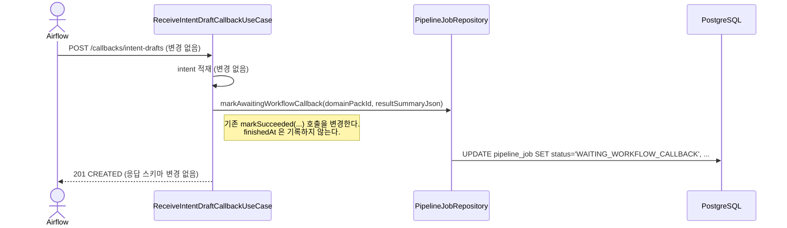
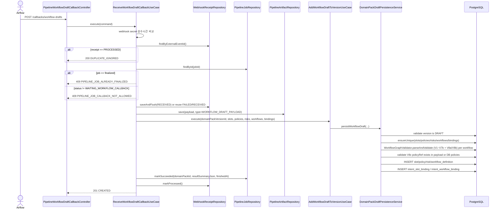
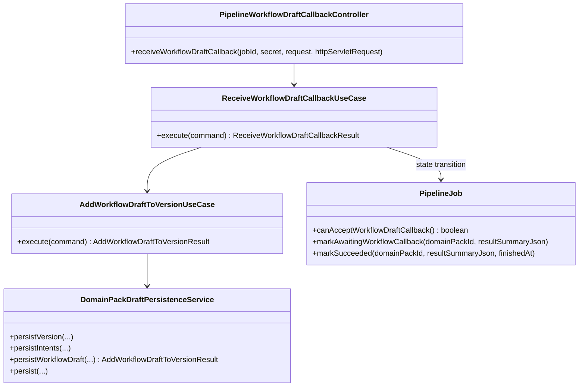

# [BE-217] Airflow Callback -> Workflow Draft 적재 및 Pipeline Job 종료

> **Backlog**: Airflow의 draft-generation 단계가 끝난 뒤, 산출된 slot/policy/risk/workflow 초안을 backend에 callback 으로 적재하고 싶다 → 운영자 검토 직전의 Domain Pack DRAFT 버전을 자동으로 완성하기 위해
> **Bounded Context**: `pipelinejob`, `domainpack`
> **Template**: `.agent/specs/_TEMPLATE_BE.md`
> **Branch**: `feature/217-airflow-workflow-draft-callback`
> **Depends on**: `.agent/specs/213.md`(intent-drafts callback), `.agent/specs/226.md`(graphJson V1~V6 정의), `.agent/specs/2217.md`(graphJson V7 edge id 정의), `.agent/specs/3215.md`(graphJson V8 policyRef 정의), `.agent/specs/231.md` / `.agent/specs/99.md`(CreateDomainPackDraftUseCase V8c 검증 기준)
> **Verified existing paths**:
> - `backend/src/main/java/com/init/pipelinejob/presentation/PipelineIntentDraftCallbackController.java`
> - `backend/src/main/java/com/init/pipelinejob/application/ReceiveIntentDraftCallbackUseCase.java`
> - `backend/src/main/java/com/init/pipelinejob/domain/model/PipelineJob.java`
> - `backend/src/main/java/com/init/domainpack/application/DomainPackDraftPersistenceService.java`
> - `backend/src/main/java/com/init/domainpack/application/WorkflowGraphValidator.java`

---

## Goal

기존 2단계(`domain-pack-drafts` → `intent-drafts`) 콜백 구조를 3단계로 확장한다. Airflow `draft-generation` 단계가 끝난 뒤, 같은 `pipeline_job` 위에 신규 콜백 `workflow-drafts` 가 호출되어 slot/policy/risk/workflow 초안과 intent ↔ slot / intent ↔ workflow binding 을 적재하고 `pipeline_job`을 `SUCCEEDED` 로 종료한다.

상태 흐름은 아래와 같이 확장한다.

| 단계 | callback | from | to |
|------|----------|------|-----|
| 1 | `domain-pack-drafts` (213) | `QUEUED` 또는 `RUNNING` | `WAITING_INTENT_CALLBACK` |
| 2 | `intent-drafts` (213, **본 스펙에서 종료 동작 변경**) | `WAITING_INTENT_CALLBACK` | `WAITING_WORKFLOW_CALLBACK` *(변경)* |
| 3 | `workflow-drafts` (**신규**) | `WAITING_WORKFLOW_CALLBACK` | `SUCCEEDED` |

어느 단계에서든 실패 시 → `FAILED`, finalized job(`SUCCEEDED/FAILED/CANCELLED`) 은 모든 callback 거부.

---

## Scope

### In scope

- `pipelinejob.presentation` 에 신규 callback endpoint 1 개 추가: `POST /api/v1/pipeline-jobs/{jobId}/callbacks/workflow-drafts`
- 신규 use case `ReceiveWorkflowDraftCallbackUseCase` (213 의 두 use case 와 같은 컨벤션)
- `PipelineJob` 에 `STATUS_WAITING_WORKFLOW_CALLBACK` 추가, 허용 상태/전이 메서드 확장
  - `markAwaitingWorkflowCallback(domainPackId, resultSummaryJson)` 신규
  - `canAcceptWorkflowDraftCallback()` 신규
- `ReceiveIntentDraftCallbackUseCase` 의 종료 전이 변경: `markSucceeded(...)` → `markAwaitingWorkflowCallback(...)`
  - 기존 intent 성공 응답 형식은 유지하되, `pipeline_job.status` 만 `WAITING_WORKFLOW_CALLBACK` 로 바뀐다
- `domainpack.application` 에 신규 use case `AddWorkflowDraftToVersionUseCase`
  - 입력: `domainPackVersionId` + slots / policies / risks / workflows / intentSlotBindings / intentWorkflowBindings
  - 동작: 기존 `DomainPackDraftPersistenceService.persist(...)` 의 slot/policy/risk/workflow + binding 적재 분기를 잘라낸 신규 메서드 `persistWorkflowDraft(...)` 호출
  - intent 는 본 스펙에서 적재하지 않으며, 213 의 intent callback 으로 이미 적재된 상태를 전제로 한다
- `DomainPackDraftPersistenceService` 에 `persistWorkflowDraft(...)` 신규 메서드 추가
  - 기존 `persist(...)` 의 slot/policy/risk/workflow + binding 적재 로직과 동일한 검증 / 저장 흐름을 사용한다 (DRY)
  - graphJson 은 `WorkflowGraphValidator.parseAndValidate(...)` 로 V1~V7b + V8a/V8b 검증 후 `initialState` / `terminalStatesJson` 추출
  - V8c(policyRef 존재 여부)는 `persistWorkflowDraft(...)` 에서 이번 callback payload 와 DB 의 같은 version policy 를 대상으로 별도 교차 검증
  - V7c(edge id 문자셋 검증)는 선행 validator 구현이 존재하면 그대로 통과시켜 사용한다. 현 validator 에 없으면 본 스펙에서 새로 추가하지 않는다.
- `webhook_receipt` 기반 멱등 처리 (213 와 동일 패턴, `webhook_type = WORKFLOW_DRAFT_CALLBACK`)
- `pipeline_job.version` 기반 optimistic locking 으로 동시 callback 경쟁을 409 충돌로 차단
- `pipeline_artifact` 에 callback payload 원문 저장
  - `stage_name = "publish-candidate"`, `artifact_type = "WORKFLOW_DRAFT_PAYLOAD"`
- Spring Security `permitAll` 경로 추가 + `X-Airflow-Webhook-Secret` 상수시간 비교

### Out of scope

- review task 자동 생성 (별도 후속 스펙)
- intent 추가 적재 (이미 213 에서 처리됨)
- `domain-pack-drafts` / `intent-drafts` callback request DTO 변경
- workflow callback 으로 받지 못한 누락 binding 에 대한 자동 재시도
- intent_workflow_binding 의 `is_primary` 충돌 해결 로직 (KISS — DB unique 제약과 단일 callback 내부 검증으로만 처리)

---

## Endpoints

### Workflow Draft 적재 callback

| Method | Path | Description |
|--------|------|-------------|
| POST | `/api/v1/pipeline-jobs/{jobId}/callbacks/workflow-drafts` | 기존 `DRAFT` version 에 slot / policy / risk / workflow + binding 적재 후 `pipeline_job` 을 `SUCCEEDED` 로 종료 |

### Request header

| Name | Required | Description |
|------|----------|-------------|
| `X-Airflow-Webhook-Secret` | Y | `airflow.webhook.secret` 와 일치해야 하는 webhook secret |

### Request body

```json
{
  "externalEventId": "evt-workflow-1",
  "domainPackVersionId": 101,
  "slots": [
    {
      "slotCode": "order_id",
      "name": "주문번호",
      "description": "환불 대상 주문 번호",
      "dataType": "STRING",
      "isSensitive": false,
      "validationRuleJson": "{\"pattern\":\"^O[0-9]{6}$\"}",
      "defaultValueJson": null,
      "metaJson": "{}"
    }
  ],
  "policies": [
    {
      "policyCode": "refund_policy_default",
      "name": "기본 환불 정책",
      "description": "7일 이내 환불",
      "severity": "HIGH",
      "conditionJson": "{}",
      "actionJson": "{}",
      "evidenceJson": "[]",
      "metaJson": "{}"
    }
  ],
  "risks": [
    {
      "riskCode": "fraud_high_amount",
      "name": "고액 사기 위험",
      "description": "100만원 이상 결제 차단",
      "riskLevel": "HIGH",
      "triggerConditionJson": "{}",
      "handlingActionJson": "{}",
      "evidenceJson": "[]",
      "metaJson": "{}"
    }
  ],
  "workflows": [
    {
      "workflowCode": "refund_flow",
      "name": "환불 플로우",
      "description": "환불 요청 처리 플로우",
      "graphJson": "{\"direction\":\"LR\",\"nodes\":[{\"id\":\"start\",\"type\":\"START\"},{\"id\":\"check_refund_policy\",\"type\":\"DECISION\"},{\"id\":\"answer_refund\",\"type\":\"ACTION\",\"policyRef\":\"refund_policy_default\"},{\"id\":\"terminal\",\"type\":\"TERMINAL\"}],\"edges\":[{\"id\":\"e_start_to_check\",\"from\":\"start\",\"to\":\"check_refund_policy\"},{\"id\":\"e_check_to_answer\",\"from\":\"check_refund_policy\",\"to\":\"answer_refund\",\"label\":\"eligible\"},{\"id\":\"e_answer_to_end\",\"from\":\"answer_refund\",\"to\":\"terminal\"}]}",
      "evidenceJson": "[]",
      "metaJson": "{}"
    }
  ],
  "intentSlotBindings": [
    {
      "intentCode": "refund_request",
      "slotCode": "order_id",
      "isRequired": true,
      "collectionOrder": 1,
      "promptHint": "주문번호를 알려주세요.",
      "conditionJson": "{}"
    }
  ],
  "intentWorkflowBindings": [
    {
      "intentCode": "refund_request",
      "workflowCode": "refund_flow",
      "isPrimary": true,
      "routeConditionJson": "{}"
    }
  ]
}
```

### Validation

`@Valid` + Bean Validation. 각 list 는 nullable 허용 (해당 종류 산출물이 없는 케이스 대응) — 단, 모두 비어 있으면 `DOMAIN_PACK_DRAFT_INVALID_REQUEST`.

| 필드 | 제약 |
|------|------|
| `externalEventId` | 필수, 최대 255자 |
| `domainPackVersionId` | 필수, > 0 |
| `slots` | optional, 0 ~ 200 개 |
| `policies` | optional, 0 ~ 200 개 |
| `risks` | optional, 0 ~ 200 개 |
| `workflows` | optional, 0 ~ 50 개 |
| `intentSlotBindings` | optional, 0 ~ 1000 개 |
| `intentWorkflowBindings` | optional, 0 ~ 1000 개 |
| `*.code` (`slotCode`, `policyCode`, `riskCode`, `workflowCode`, `intentCode`) | 필수, 최대 100자 |
| `*.name` | 필수, 최대 255자 |
| `slots[].dataType` | 필수, 최대 50자 |
| `risks[].riskLevel` | 필수, 최대 50자 |
| `workflows[].graphJson` | 필수, 최대 20000자, V1~V7b / V8a~V8c 검증 대상 |
| `policies[].severity` | 선택, 최대 50자 |
| `intentSlotBindings[].isRequired` | 선택, null 이면 domain / entity default 정책을 따른다 |
| `intentWorkflowBindings[].isPrimary` | 선택, null 이면 domain / entity default 정책을 따른다 |
| `*Json` (jsonb 컬럼) | 선택, 최대 20000자 (각 row 별). 단 기존 DTO와 맞춰 세부 필드별 5000자 제한을 적용해도 된다 |

추가 무결성 검증은 `DomainPackDraftPersistenceService.persistWorkflowDraft(...)` 가 담당 (아래 "Domain / Persistence Notes" 참조).

### Success response (201 CREATED)

```json
{
  "status": "CREATED",
  "externalEventId": "evt-workflow-1",
  "domainPackId": 7,
  "domainPackVersionId": 101,
  "addedSlotCount": 1,
  "addedPolicyCount": 1,
  "addedRiskCount": 1,
  "addedWorkflowCount": 1,
  "addedIntentSlotBindingCount": 1,
  "addedIntentWorkflowBindingCount": 1,
  "sourcePipelineJobId": 11
}
```

### Duplicate response (200 OK)

`webhook_receipt.processing_status = PROCESSED` 인 동일 `externalEventId` 재요청.

```json
{
  "status": "DUPLICATE_IGNORED",
  "externalEventId": "evt-workflow-1",
  "domainPackId": null,
  "domainPackVersionId": null,
  "addedSlotCount": null,
  "addedPolicyCount": null,
  "addedRiskCount": null,
  "addedWorkflowCount": null,
  "addedIntentSlotBindingCount": null,
  "addedIntentWorkflowBindingCount": null,
  "sourcePipelineJobId": null
}
```

### Error responses

> 모든 `code` 값은 해당 `BusinessException.getCode()` 결과다.

**400 Bad Request — Bean Validation 실패**

```json
{ "code": "VALIDATION_ERROR", "message": "domainPackVersionId 는 필수입니다." }
```

**400 Bad Request — payload 무결성 실패**

```json
{ "code": "DOMAIN_PACK_DRAFT_INVALID_REQUEST", "message": "중복된 workflowCode 값이 존재합니다. value=refund_flow" }
```

**400 Bad Request — graphJson V1~V7b / V8a~V8c 위반 (예시)**

> 코드는 위반된 규칙별로 분리된다 (`WORKFLOW_INVALID_START_NODE`, `WORKFLOW_INVALID_TERMINAL_NODE`, `WORKFLOW_DANGLING_EDGE`, `WORKFLOW_UNREACHABLE_NODE`, `WORKFLOW_CYCLE_DETECTED`, `WORKFLOW_UNLABELED_BRANCH`, `WORKFLOW_EDGE_ID_MISSING`, `WORKFLOW_EDGE_ID_DUPLICATE`, `WORKFLOW_ACTION_NODE_POLICY_REF_MISSING`, `WORKFLOW_ACTION_NODE_POLICY_REF_INVALID_CHARS`, `WORKFLOW_ACTION_NODE_POLICY_REF_NOT_FOUND`). `WORKFLOW_ACTION_NODE_POLICY_REF_NOT_FOUND` 는 `WorkflowGraphValidator` 가 아니라 `persistWorkflowDraft(...)` 의 V8c 교차 검증에서 발생한다. `WORKFLOW_EDGE_ID_INVALID_CHARS` 는 V7c 선행 구현이 존재하는 경우에만 같은 방식으로 전파된다.

```json
{ "code": "WORKFLOW_CYCLE_DETECTED", "message": "사이클이 발견되었습니다. workflowCode=refund_flow" }
```

**401 Unauthorized — webhook secret 불일치**

```json
{ "code": "UNAUTHORIZED", "message": "유효하지 않은 Airflow webhook secret입니다." }
```

**404 Not Found — pipeline_job 미존재**

```json
{ "code": "PIPELINE_JOB_NOT_FOUND", "message": "Pipeline job을 찾을 수 없습니다. id=11" }
```

**404 Not Found — domain_pack_version 미존재**

```json
{ "code": "DOMAIN_PACK_VERSION_NOT_FOUND", "message": "DomainPackVersion not found: 101" }
```

**409 Conflict — finalized job 에 callback 시도**

```json
{ "code": "PIPELINE_JOB_ALREADY_FINALIZED", "message": "이미 종료된 pipeline job입니다. id=11" }
```

**409 Conflict — 허용되지 않는 상태에서 callback 시도**

```json
{ "code": "PIPELINE_JOB_CALLBACK_NOT_ALLOWED", "message": "현재 상태에서 해당 callback을 받을 수 없습니다. id=11, status=WAITING_INTENT_CALLBACK, type=WORKFLOW_DRAFT_CALLBACK" }
```

**409 Conflict — optimistic locking 충돌**

```json
{ "code": "PIPELINE_JOB_CONFLICT", "message": "Pipeline job 상태가 다른 요청에 의해 변경되었습니다. id=11" }
```

**400 Bad Request — DRAFT 가 아닌 version 적재 시도**

```json
{ "code": "DOMAIN_PACK_VERSION_NOT_DRAFT", "message": "DRAFT 상태의 버전이 아닙니다. id=101" }
```

---

## Sequence

### intent-drafts callback (213) 의 종료 전이 변경

> 본 스펙은 213 의 intent callback 응답/요청 스키마와 endpoint 경로는 그대로 두고, **`pipeline_job.status` 종료 전이만 변경**한다.



### workflow-drafts callback (신규)



---

## Class Design



### 신규 파일

| 파일 | 경로 | 역할 |
|------|------|------|
| `PipelineWorkflowDraftCallbackController.java` | `pipelinejob/presentation/` | POST `/callbacks/workflow-drafts` |
| `PipelineWorkflowDraftCallbackRequest.java` | `pipelinejob/presentation/dto/` | request body DTO + Bean Validation |
| `PipelineWorkflowDraftCallbackResponse.java` | `pipelinejob/presentation/dto/` | 응답 DTO (`status`, `externalEventId`, `domainPackId`, `domainPackVersionId`, count 6 종, `sourcePipelineJobId`) |
| `ReceiveWorkflowDraftCallbackCommand.java` | `pipelinejob/application/` | use case 입력 record |
| `ReceiveWorkflowDraftCallbackResult.java` | `pipelinejob/application/` | use case 결과 record + `created(...)` / `duplicateIgnored(...)` 팩토리 |
| `ReceiveWorkflowDraftCallbackUseCase.java` | `pipelinejob/application/` | callback 오케스트레이션 |
| `AddWorkflowDraftToVersionCommand.java` | `domainpack/application/` | persistence 입력 record (slots/policies/risks/workflows/bindings) |
| `AddWorkflowDraftToVersionResult.java` | `domainpack/application/` | count 결과 record |
| `AddWorkflowDraftToVersionUseCase.java` | `domainpack/application/` | DRAFT version 검증 + persistence 위임 |

### 수정 파일

| 파일 | 변경 |
|------|------|
| `pipelinejob/domain/model/PipelineJob.java` | `STATUS_WAITING_WORKFLOW_CALLBACK` 상수 / `canAcceptWorkflowDraftCallback()` / `markAwaitingWorkflowCallback(...)` 추가. `canAcceptIntentDraftCallback()` 의 허용 상태는 그대로 `WAITING_INTENT_CALLBACK` 유지. |
| `pipelinejob/application/ReceiveIntentDraftCallbackUseCase.java` | `processCallback(...)` 의 `job.markSucceeded(...)` → `job.markAwaitingWorkflowCallback(...)` 로 교체. `finishedAt` 기록 제거. summary JSON 빌더는 그대로. |
| `pipelinejob/application/exception/PipelineJobCallbackNotAllowedException.java` | 메시지 포맷 그대로 (`type` 인자만 `WORKFLOW_DRAFT_CALLBACK` 추가). |
| `domainpack/application/DomainPackDraftPersistenceService.java` | `persistWorkflowDraft(domainPackVersionId, slots, policies, risks, workflows, intentSlotBindings, intentWorkflowBindings)` 신규. 기존 `persist(...)` 의 slot/policy/risk/workflow 적재 코드 블록을 추출해 공유한다. |
| `shared/infrastructure/web/SecurityConfig` 류 (이미 213 에서 callback 경로 `permitAll` 처리) | `/api/v1/pipeline-jobs/*/callbacks/workflow-drafts` POST 경로를 `permitAll` 목록에 추가 |
| `shared/infrastructure/web/CorsConfig` 류 | 변경 없음 (`X-Airflow-Webhook-Secret` 는 213 에서 이미 추가) |

### Pseudo-code

```java
// pipelinejob/application/ReceiveWorkflowDraftCallbackUseCase.java
@Service
public class ReceiveWorkflowDraftCallbackUseCase {

  private static final String WEBHOOK_TYPE = "WORKFLOW_DRAFT_CALLBACK";

  // 의존성: PipelineJobRepository, WebhookReceiptRepository, PipelineArtifactRepository,
  //        AddWorkflowDraftToVersionUseCase, Clock, ObjectMapper,
  //        PlatformTransactionManager, @Value("${airflow.webhook.secret}") String secret

  public ReceiveWorkflowDraftCallbackResult execute(ReceiveWorkflowDraftCallbackCommand command) {
    validateWebhookSecret(command.providedWebhookSecret());

    Optional<WebhookReceipt> existing =
        webhookReceiptRepository.findByExternalEventId(command.externalEventId());
    if (isProcessed(existing.orElse(null))) {
      return ReceiveWorkflowDraftCallbackResult.duplicateIgnored(command.externalEventId());
    }

    PipelineJob job = pipelineJobRepository.findById(command.jobId())
        .orElseThrow(() -> new PipelineJobNotFoundException(command.jobId()));
    if (job.isFinalized()) {
      throw new PipelineJobAlreadyFinalizedException(command.jobId());
    }
    if (!job.canAcceptWorkflowDraftCallback()) {
      throw new PipelineJobCallbackNotAllowedException(
          command.jobId(), job.getStatus(), WEBHOOK_TYPE);
    }

    WebhookReceipt receipt = ensureReceivedReceipt(command, existing.orElse(null));
    if (isProcessed(receipt)) {
      return ReceiveWorkflowDraftCallbackResult.duplicateIgnored(command.externalEventId());
    }

    try {
      return transactionTemplate.execute(status -> processCallback(command));
    } catch (RuntimeException ex) {
      try {
        markFailure(command.jobId(), command.externalEventId(), ex);
      } catch (RuntimeException markFailureException) {
        ex.addSuppressed(markFailureException);
      }
      throw ex;
    }
  }

  private ReceiveWorkflowDraftCallbackResult processCallback(
      ReceiveWorkflowDraftCallbackCommand command) {
    PipelineJob job = pipelineJobRepository.findById(command.jobId())
        .orElseThrow(() -> new PipelineJobNotFoundException(command.jobId()));
    if (job.isFinalized()) {
      throw new PipelineJobAlreadyFinalizedException(command.jobId());
    }
    if (!job.canAcceptWorkflowDraftCallback()) {
      throw new PipelineJobCallbackNotAllowedException(
          command.jobId(), job.getStatus(), WEBHOOK_TYPE);
    }

    // payload 원문 저장 (213 의 domain-pack-drafts callback 과 같은 패턴: 본 처리 트랜잭션 내부)
    pipelineArtifactRepository.save(
        PipelineArtifact.create(
            command.jobId(),
            "publish-candidate",
            "WORKFLOW_DRAFT_PAYLOAD",
            command.requestBodyJson()));

    AddWorkflowDraftToVersionResult workflowResult =
        addWorkflowDraftToVersionUseCase.execute(
            new AddWorkflowDraftToVersionCommand(
                command.domainPackVersionId(),
                command.slots(),
                command.policies(),
                command.risks(),
                command.workflows(),
                command.intentSlotBindings(),
                command.intentWorkflowBindings()));

    OffsetDateTime now = OffsetDateTime.now(clock);
    job.markSucceeded(workflowResult.domainPackId(),
        buildSuccessSummaryJson(workflowResult), now);
    savePipelineJobOrThrowConflict(job, command.jobId());

    WebhookReceipt receipt = webhookReceiptRepository
        .findByExternalEventId(command.externalEventId())
        .orElseThrow(() -> new IllegalStateException("Webhook receipt가 존재하지 않습니다."));
    receipt.markProcessed(now);
    webhookReceiptRepository.saveAndFlush(receipt);

    return ReceiveWorkflowDraftCallbackResult.created(
        command.externalEventId(),
        workflowResult.domainPackId(),
        workflowResult.domainPackVersionId(),
        workflowResult.addedSlotCount(),
        workflowResult.addedPolicyCount(),
        workflowResult.addedRiskCount(),
        workflowResult.addedWorkflowCount(),
        workflowResult.addedIntentSlotBindingCount(),
        workflowResult.addedIntentWorkflowBindingCount(),
        command.jobId());
  }

  // ensureReceivedReceipt(...), validateWebhookSecret(...), isProcessed(...),
  // savePipelineJobOrThrowConflict(...), markFailure(...), buildSuccessSummaryJson(...) 는
  // ReceiveIntentDraftCallbackUseCase 와 동일 형태로 구현한다 (DRY 가 정당화될 만큼 분량이
  // 많지 않으면 두 use case 에 직접 작성하고, 3 번째 callback 이 추가되는 시점에
  // CallbackProcessingSupport 같은 헬퍼로 추출한다 — Rule of Three).
}
```

```java
// domainpack/application/AddWorkflowDraftToVersionUseCase.java
@Service
@Transactional
public class AddWorkflowDraftToVersionUseCase {

  private final DomainPackDraftPersistenceService persistenceService;

  public AddWorkflowDraftToVersionResult execute(AddWorkflowDraftToVersionCommand command) {
    return persistenceService.persistWorkflowDraft(
        command.domainPackVersionId(),
        command.slots(),
        command.policies(),
        command.risks(),
        command.workflows(),
        command.intentSlotBindings(),
        command.intentWorkflowBindings());
  }
}
```

```java
// domainpack/application/DomainPackDraftPersistenceService.java (신규 메서드 시그니처)
public AddWorkflowDraftToVersionResult persistWorkflowDraft(
    Long domainPackVersionId,
    List<SlotDraft> slots,
    List<PolicyDraft> policies,
    List<RiskDraft> risks,
    List<WorkflowDraft> workflows,
    List<IntentSlotBindingDraft> intentSlotBindings,
    List<IntentWorkflowBindingDraft> intentWorkflowBindings);
// 내부 동작은 기존 persist(...) 의 slot/policy/risk/workflow + binding 적재 블록과 동일.
// intent 는 이번 호출에서 새로 만들지 않고, version 내 기존 intentCode 로 lookup 한다.
```

```java
// pipelinejob/domain/model/PipelineJob.java (추가 부분)
public static final String STATUS_WAITING_WORKFLOW_CALLBACK = "WAITING_WORKFLOW_CALLBACK";

public boolean canAcceptWorkflowDraftCallback() {
  return STATUS_WAITING_WORKFLOW_CALLBACK.equals(status);
}

public void markAwaitingWorkflowCallback(Long domainPackId, String resultSummaryJson) {
  this.domainPackId = domainPackId;
  this.resultSummaryJson = resultSummaryJson != null ? resultSummaryJson : "{}";
  this.status = STATUS_WAITING_WORKFLOW_CALLBACK;
  this.lastErrorMessage = null;
}
```

```java
// pipelinejob/application/ReceiveIntentDraftCallbackUseCase.java (변경 부분만)
// 기존
job.markSucceeded(intentResult.domainPackId(), buildSuccessSummaryJson(intentResult), now);
// 변경 후
job.markAwaitingWorkflowCallback(
    intentResult.domainPackId(), buildSuccessSummaryJson(intentResult));
```

---

## Domain / Persistence Notes

### `DomainPackDraftPersistenceService.persistWorkflowDraft(...)`

기존 `persist(...)` 와 동일한 검증 / 저장 흐름을 사용하되, **DRAFT version 은 미리 존재해야 하고 intent 는 다시 만들지 않는다**.

처리 순서:

1. `requireDraftVersion(domainPackVersionId)` — version 이 없거나 `DRAFT` 가 아니면 예외.
2. `validateDraftPayload(...)` 의 slot/policy/risk/workflow 부분만 호출 (intent 검증 제외) — 각 list 의 code 중복 / 빈 값 / `intentSlotBinding`, `intentWorkflowBinding` 키 중복 검증.
3. 각 workflow 는 `WorkflowGraphValidator.parseAndValidate(...)` 로 graphJson V1~V7b + V8a/V8b 검증 + `initialState` / `terminalStatesJson` 추출.
   - V7c(edge id 문자셋 검증)는 선행 validator 구현이 존재하는 경우에만 함께 적용된다. 현 validator 에 없으면 본 스펙에서 새로 추가하지 않는다.
4. V8c: ACTION 노드의 `policyRef` 가 **이번 callback 에서 들어온 policies** 또는 **DB 에 이미 존재하는 같은 version 의 policy_code** 둘 중 한 곳에서 발견되어야 함 — 둘 다 없으면 `WORKFLOW_ACTION_NODE_POLICY_REF_NOT_FOUND` (기존 예외 재사용).
5. slot / policy / risk / workflow 적재 (`saveAll`).
6. binding 적재:
   - intent code → DB 의 `intent_definition` 을 `(domain_pack_version_id, intent_code)` 로 lookup.
   - slot code / workflow code → 이번 callback 에서 저장한 row 에서 lookup.
   - lookup 실패 시 `DomainPackDraftRequestInvalidException` (기존 예외 재사용, 메시지 포맷 동일).
7. 결과로 6 개 count 와 `domainPackId`, `domainPackVersionId` 반환.

### Race condition / 멱등성

- `external_event_id` 를 idempotency key 로 사용 (213 와 동일).
- receipt insert 중 `DataIntegrityViolationException` → 동일 `external_event_id` 재조회 (concurrent 처리 보강).
- `PROCESSED` receipt 만 duplicate 로 간주, `FAILED` / `RECEIVED` 는 재처리 대상.
- `pipeline_job.@Version` optimistic locking 으로 동시 callback 경쟁을 409 충돌로 차단.
- `webhook_receipt` insert 는 별도 트랜잭션 (`TransactionTemplate.execute(...)`) 으로 처리해, persist 단계 실패 시에도 receipt 가 `FAILED` 로 남도록 한다 (213 의 `markFailure(...)` 패턴 그대로).
- `pipeline_artifact` insert 는 213 의 현재 구현과 동일하게 본 처리 트랜잭션 내부에서 수행한다. 따라서 persist 단계 실패 시 payload artifact 도 함께 롤백된다. 실패 payload 까지 영구 보관해야 하는 요구가 생기면 별도 backlog 로 artifact 저장 트랜잭션 분리를 검토한다.

### 부분 실패 정책

- payload 안의 일부 row 만 저장하고 나머지를 실패 처리하지 않는다. 단일 트랜잭션에서 전부 성공하거나 전부 롤백한다 (KISS).
- 따라서 `addedSlotCount` 등 count 는 항상 payload 의 총 개수와 일치한다.
- 부분 적재가 필요해지는 시점에 별도 backlog 로 분리한다.

### `pipeline_artifact`

| 컬럼 | 값 |
|------|----|
| `pipeline_job_id` | path variable `jobId` |
| `stage_name` | `"publish-candidate"` (213 와 동일) |
| `artifact_type` | `"WORKFLOW_DRAFT_PAYLOAD"` |
| `payload_json` | request body 원문 |
| `created_at` | `now()` |

### `webhook_receipt`

| 컬럼 | 값 |
|------|----|
| `pipeline_job_id` | `jobId` |
| `external_event_id` | command.externalEventId |
| `webhook_type` | `"WORKFLOW_DRAFT_CALLBACK"` |
| `request_headers_json` | secret 마스킹된 header JSON |
| `request_body_json` | request body 원문 |
| `processing_status` | 초기 `RECEIVED` → 성공 시 `PROCESSED` / 실패 시 `FAILED` |

---

## Security

- Spring Security `permitAll` 경로에 추가:
  - `POST /api/v1/pipeline-jobs/*/callbacks/workflow-drafts`
- 실제 인증은 `ReceiveWorkflowDraftCallbackUseCase` 가 `X-Airflow-Webhook-Secret` 와 `airflow.webhook.secret` 를 `MessageDigest.isEqual(...)` 로 상수 시간 비교.
- 저장되는 request header JSON 에서는 secret 값을 `***` 로 마스킹 (213 의 `extractHeaders(...)` 헬퍼 그대로 재사용).
- CORS allowed header 는 213 에서 이미 `X-Airflow-Webhook-Secret` 추가됨.
- 운영 기본 설정에서는 `AIRFLOW_WEBHOOK_SECRET` 를 반드시 주입, local 프로필만 개발용 기본값 유지.

---

## Tests

### Application Tests

`AddWorkflowDraftToVersionUseCaseTest`
- DRAFT version 에 slot/policy/risk/workflow + binding 정상 적재
- workflow 의 ACTION 노드 `policyRef` 가 같은 callback 의 policy 로 해소
- workflow 의 ACTION 노드 `policyRef` 가 DB 에 이미 존재하는 같은 version policy 로 해소
- workflow 의 ACTION 노드 `policyRef` 가 어디에서도 발견되지 않음 → `WORKFLOW_ACTION_NODE_POLICY_REF_NOT_FOUND`
- intentCode lookup 실패 → `DOMAIN_PACK_DRAFT_INVALID_REQUEST`
- 같은 callback 에서 slotCode / policyCode / riskCode / workflowCode 중복 → `DOMAIN_PACK_DRAFT_INVALID_REQUEST`
- graphJson V1~V7b / V8a~V8c 위반 (각 케이스 1 개씩) → 해당 예외 코드
- `domainPackVersionId` 미존재 → `DOMAIN_PACK_VERSION_NOT_FOUND`
- non-DRAFT version → `DOMAIN_PACK_VERSION_NOT_DRAFT`

`DomainPackDraftPersistenceServiceTest` (신규 메서드 단위)
- `persistWorkflowDraft(...)` 와 기존 `persist(...)` 의 slot/policy/risk/workflow 적재 결과가 같은 row 를 만들어내는지 (중복 코드 제거 검증)
- `persistWorkflowDraft(...)` 가 intent 를 새로 만들지 않는지 (intent_definition row 수가 호출 전후로 같은지)

`ReceiveWorkflowDraftCallbackUseCaseTest`
- 정상 callback 처리 → 201 CREATED + `pipeline_job.status = SUCCEEDED` + `result_summary_json` 저장
- duplicate ignored (`PROCESSED` receipt)
- `FAILED` receipt 재처리 성공
- receipt insert 충돌 후 재조회 duplicate 처리
- receipt insert 비중복 예외 전파
- 잘못된 secret → `UNAUTHORIZED`
- 없는 job → `PIPELINE_JOB_NOT_FOUND`
- finalized job → `PIPELINE_JOB_ALREADY_FINALIZED`
- `WAITING_WORKFLOW_CALLBACK` 이 아닌 상태 → `PIPELINE_JOB_CALLBACK_NOT_ALLOWED`
- workflow draft 적재 도중 예외 → `pipeline_job = FAILED`, `webhook_receipt = FAILED`, `last_error_message` 저장
- optimistic locking 충돌 → `PIPELINE_JOB_CONFLICT`
- 정상 callback 처리 시 `pipeline_artifact` row 1 개 생성, duplicate ignored 시 0 row
- workflow draft 적재 도중 예외 시 본 처리 트랜잭션 롤백으로 `pipeline_artifact` row 는 생성되지 않음

`ReceiveIntentDraftCallbackUseCaseTest` (변경 검증)
- intent 정상 처리 시 `pipeline_job.status = WAITING_WORKFLOW_CALLBACK` (변경 전: `SUCCEEDED`)
- intent 정상 처리 시 `pipeline_job.finished_at = null` (workflow callback 까지는 종료가 아님)
- 응답 스키마 (`PipelineIntentDraftCallbackResponse`) 는 변경 없음 — 기존 controller test 는 그대로 통과해야 함

`PipelineJobTest` (도메인 단위)
- `markAwaitingWorkflowCallback(...)` 호출 시 status / domainPackId / resultSummaryJson / lastErrorMessage 변경
- `canAcceptWorkflowDraftCallback()` 는 `WAITING_WORKFLOW_CALLBACK` 상태에서만 true
- `canAcceptIntentDraftCallback()` 는 여전히 `WAITING_INTENT_CALLBACK` 상태에서만 true (회귀 검증)

### Controller Tests

`PipelineWorkflowDraftCallbackControllerTest`
- 201 정상
- 200 duplicate ignored
- 400 Bean Validation 실패 (`externalEventId` 누락 등)
- 400 graphJson V1~V7b / V8a~V8c 위반 (`WORKFLOW_CYCLE_DETECTED` 응답 코드 검증)
- 400 `DOMAIN_PACK_DRAFT_INVALID_REQUEST`
- 400 `DOMAIN_PACK_VERSION_NOT_DRAFT`
- 401 secret 누락 / 불일치
- 404 job 미존재
- 404 `domain_pack_version` 미존재
- 409 finalized
- 409 status 불허 (`WAITING_INTENT_CALLBACK` 인 job)
- 409 optimistic locking 충돌

### Test Checklist

- [ ] 정상 시나리오: workflow callback 1 회로 slot/policy/risk/workflow + binding 모두 적재 + `SUCCEEDED` 종료
- [ ] 멱등성: 동일 `externalEventId` 재요청 시 duplicate ignored
- [ ] 권한: secret 불일치 시 401
- [ ] 상태머신: `QUEUED` / `RUNNING` / `WAITING_INTENT_CALLBACK` / `SUCCEEDED` / `FAILED` / `CANCELLED` 에서 모두 409
- [ ] 동시성: 같은 job 에 동시 callback 2 개 → 1 개는 201, 다른 1 개는 409 (optimistic locking)
- [ ] graphJson 검증: V1~V7b / V8a~V8c 각 위반 케이스에 대응되는 에러 코드
- [ ] 트랜잭션: persist 도중 예외 시 slot/policy/risk/workflow 모두 롤백, `pipeline_job = FAILED`, `webhook_receipt = FAILED`
- [ ] 213 회귀: intent callback 응답 스키마 / endpoint / receipt 처리 모두 변경 없음

---

## Database

신규 DDL 없음.

| 테이블 | 비고 |
|--------|------|
| `pack.slot_definition` | 기존 (`db.changelog-master.sql:163-179`) |
| `pack.intent_slot_binding` | 기존 (`db.changelog-master.sql:181-192`) |
| `pack.policy_definition` | 기존 (`db.changelog-master.sql:194-210`) |
| `pack.risk_definition` | 기존 (`db.changelog-master.sql:212-228`) |
| `pack.workflow_definition` | 기존 (`db.changelog-master.sql:230-246`) |
| `pack.intent_workflow_binding` | 기존 (`db.changelog-master.sql:248-257`) |
| `pipeline.pipeline_job` | 기존, `status` 컬럼 값에 `WAITING_WORKFLOW_CALLBACK` 추가. 컬럼 정의는 enum 이 아니므로 schema 변경 없음. `chk_pipeline_job_status` CHECK 제약이 존재한다면 별도 changeset 으로 값 추가 필요 — 현 schema 에는 CHECK 제약 없음을 확인했다. |
| `pipeline.webhook_receipt`, `pipeline.pipeline_artifact` | 기존 (213 에서 추가) |

---

## Additional Notes

- 이 스펙은 213 의 후속이다. 213 의 endpoint / 응답 스키마는 변경하지 않고, intent callback 의 종료 전이만 `SUCCEEDED` → `WAITING_WORKFLOW_CALLBACK` 으로 바꾼다. 따라서 이미 production 에서 `WAITING_INTENT_CALLBACK` 까지 진행된 job 은 본 변경 후에도 호환되며, 그 이후의 job 은 workflow callback 을 반드시 받아야 종료된다.
- workflow graphJson 의 V1~V7b + V8a/V8b 구조 검증은 `WorkflowGraphValidator.parseAndValidate(...)` 와 그 예외 클래스를 재사용한다. V7c(edge id 문자셋 검증)는 선행 validator 구현이 존재하는 경우에만 그대로 전파하며, 본 스펙에서 새로 추가하지 않는다.
- V8c(policyRef 가 실제 policyCode 로 해소되는지)는 `CreateDomainPackDraftUseCase`(spec 231 / 99) 의 write path 와 같은 의미가 되도록 `persistWorkflowDraft(...)` 에서 별도로 교차 검증한다.
- workflow 의 ACTION 노드 `policyRef` 해소 정책은 "이번 callback 의 policies" + "DB 에 이미 적재된 같은 version 의 policies" 두 곳을 모두 본다. 이는 운영자 UI 가 policy 만 먼저 수동 등록하고 workflow 만 callback 으로 받는 케이스를 막지 않기 위함이다.
- `addedXxxCount` 는 항상 payload 의 총 개수와 일치한다 (전부-아니면-전무 정책). 향후 partial 적재 요구가 생기면 `skippedXxxCount` 를 추가한다 (213 intent callback 의 `skippedIntentCount` 패턴).
- 두 callback (`intent-drafts`, `workflow-drafts`) 모두 거의 같은 형태의 `validateWebhookSecret / ensureReceivedReceipt / markFailure / savePipelineJobOrThrowConflict` 를 가진다. **3 번째 callback 이 추가되는 시점에** 공통 로직을 `CallbackProcessingSupport` 같은 헬퍼로 추출한다 (Rule of Three 까지는 중복 허용).
- `PipelineJob.markAwaitingWorkflowCallback(...)` 은 `finishedAt` 을 건드리지 않는다 (`SUCCEEDED` 가 아니므로). 이미 `markAwaitingIntentCallback(...)` 도 같은 정책이다.
- `PipelineJobCallbackNotAllowedException` 메시지의 `type` 인자에는 `"WORKFLOW_DRAFT_CALLBACK"` 문자열을 사용해, intent / domain-pack callback 과 동일한 메시지 포맷을 유지한다.

---

## Current Limitations

- 한 번의 callback 으로 slot/policy/risk/workflow + binding 을 모두 받는다. 산출물이 매우 큰 도메인 (예: workflow 50 개 이상) 의 경우 timeout / payload size 한계에 걸릴 수 있다. 이 시점에서는 callback 분할 (예: `policy-drafts`, `risk-drafts`, `slot-drafts` 별도 endpoint) 을 별도 backlog 로 검토한다.
- workflow 적재 성공 = `pipeline_job.SUCCEEDED` 라는 1:1 매핑이다. review task 자동 생성은 이 스펙에 포함되지 않으며, 별도 후속 스펙에서 `pipeline_job.SUCCEEDED` 이벤트 (또는 polling) 기반으로 만든다.
- `intent_workflow_binding.is_primary` 가 같은 intent 에 대해 여러 row 에서 true 인 경우 DB unique 제약이 없으므로 통과한다. 운영 데이터 정합성을 강하게 보장하려면 별도 check 또는 partial unique index 를 검토한다 (이 스펙 범위 밖).
