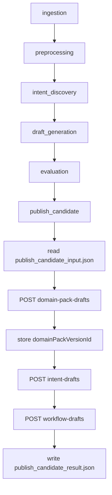

# [ML/Infra-218] Airflow publish_candidate -> Spring Backend Callback 발신 연동

> **Backlog**: 2.1.8 [Infra] workflow 완료 후 callback 연동
> **Layer**: ML Pipeline / Infra Integration
> **Template**: `.agent/specs/_TEMPLATE_ML.md`
> **Branch**: `feature/218-publish-candidate-callback`
> **Depends on**: `.agent/specs/213.md`, `.agent/specs/217.md`, `.agent/docs/architecture.md`, `.agent/docs/schema.md`
> **Verified existing paths**:
> - `ml/src/dags/domain_pack_generation.py`
> - `ml/src/pipeline/stages/publish_candidate/main.py`
> - `ml/src/pipeline/common/config.py`
> - `ml/src/pipeline/common/artifacts.py`
> - `backend/src/main/java/com/init/pipelinejob/presentation/PipelineIntentDraftCallbackController.java`
> - `backend/src/main/java/com/init/pipelinejob/presentation/PipelineWorkflowDraftCallbackController.java`

---

## Goal

Airflow `domain_pack_generation` DAG의 `publish_candidate` stage에서 최종 candidate artifact를 읽고, Spring Backend의 기존 3단계 callback API를 순서대로 호출하여 Domain Pack DRAFT 버전을 완성한다.

핵심 흐름은 아래와 같다.

1. upstream stage가 생성한 `publish_candidate_input.json`을 읽는다.
2. `domain-pack-drafts` callback을 호출한다.
3. Spring 응답의 `domainPackId`, `domainPackVersionId`, `versionNo`를 publish context에 저장한다.
4. `domainPackVersionId`를 사용해 `intent-drafts` callback을 호출한다.
5. 같은 `domainPackVersionId`를 사용해 `workflow-drafts` callback을 호출한다.
6. callback 결과를 `publish_candidate_result.json` 및 stage manifest에 남긴다.

이 스펙의 목표는 ML 알고리즘 산출 품질이 아니라, Airflow와 Spring 사이의 publish callback 계약을 닫는 것이다.

---

## Current State

현재 Spring Backend에는 callback 수신부가 구현되어 있다.

| Callback | Endpoint | Spring 동작 |
|----------|----------|-------------|
| Domain Pack Draft | `POST /api/v1/pipeline-jobs/{jobId}/callbacks/domain-pack-drafts` | `DomainPack` 조회/생성 + 빈 `DRAFT` version 생성 |
| Intent Draft | `POST /api/v1/pipeline-jobs/{jobId}/callbacks/intent-drafts` | 기존 `DRAFT` version에 intent 적재 |
| Workflow Draft | `POST /api/v1/pipeline-jobs/{jobId}/callbacks/workflow-drafts` | slot/policy/risk/workflow/binding 적재 후 job `SUCCEEDED` 종료 |

현재 Airflow DAG와 stage 파일은 존재하지만, 실제 publish callback 발신 로직은 없다.

- `ml/src/dags/domain_pack_generation.py`: 6단계 DAG 체인 존재
- `ml/src/pipeline/stages/publish_candidate/main.py`: `pass`
- `PipelineRuntimeConfig`: `PIPELINE_BACKEND_BASE_URL`, `PIPELINE_ARTIFACT_ROOT`만 보유
- `draft_generation`, `evaluation` 등 upstream stage의 실제 artifact 생성 구현은 아직 placeholder 상태

따라서 본 스펙은 upstream stage가 나중에 생성해야 할 최종 candidate artifact 계약을 먼저 정의하고, `publish_candidate`는 그 artifact만 읽어 Spring callback을 수행하도록 한다.

---

## Scope

### In scope

- `publish_candidate` stage의 Spring callback 발신 로직
- `publish_candidate_input.json` schema 정의
- `publish_candidate_result.json` schema 정의
- callback HTTP client 공통 모듈 정의
- `domain-pack-drafts -> intent-drafts -> workflow-drafts` 순차 호출
- 첫 callback 응답의 `domainPackVersionId`를 이후 callback payload에 주입
- Airflow retry를 고려한 idempotent `externalEventId` 생성 규칙
- 부분 성공 후 retry를 위한 publish context 저장/복구 정책
- callback 결과와 실패 원인을 artifact/manifest에 기록
- unit/smoke test 기준 정의

### Out of scope

- Spring Backend callback endpoint 신규 구현
- Backend에서 Airflow DAG run을 trigger하는 기능
- ML stage의 실제 draft 생성 알고리즘 구현
- `draft_generation` / `evaluation` 내부 artifact 상세 schema 전체 확정
- review task 자동 생성
- DB schema 변경
- Spring duplicate callback 응답 형태 변경
- Airflow 실패를 Spring에 별도 통지하는 failure callback

---

## DAG Flow



---

## Stage Interface

### Input

`publish_candidate`는 upstream manifest path를 입력으로 받는다.

```python
def run(upstream_manifest_path: str | None = None) -> None:
    ...
```

`upstream_manifest_path`는 이전 stage의 `manifest.json` 경로다. 해당 manifest의 payload에서 `candidateArtifactPath`를 읽는다.

```json
{
  "payload": {
    "status": "completed",
    "candidateArtifactPath": "/opt/airflow/artifacts/domain_pack_generation/manual__run/evaluation/publish_candidate_input.json"
  }
}
```

`candidateArtifactPath`가 없거나 파일을 읽을 수 없으면 `publish_candidate`는 실패한다. 기본 파일명 탐색은 하지 않는다.

### Output

`publish_candidate`는 자신의 stage directory에 아래 파일을 생성한다.

| 파일 | 형식 | 설명 |
|------|------|------|
| `publish_candidate_result.json` | JSON | Spring callback 실행 결과와 publish context |
| `manifest.json` | JSON | `write_stage_manifest(...)`가 생성하는 stage manifest |

`manifest.json` payload에는 최소한 아래 정보를 포함한다.

```json
{
  "status": "completed",
  "candidate_artifact_path": "/opt/airflow/artifacts/.../publish_candidate_input.json",
  "publish_result_path": "/opt/airflow/artifacts/.../publish_candidate/publish_candidate_result.json",
  "domain_pack_id": 7,
  "domain_pack_version_id": 101,
  "version_no": 3,
  "callbacks": [
    {
      "type": "domain-pack-drafts",
      "external_event_id": "domain_pack_generation:manual__run:domain-pack-drafts",
      "http_status": 201,
      "response_status": "CREATED"
    }
  ]
}
```

실패 시에도 가능한 범위에서 `publish_candidate_result.json`을 남기고, manifest payload에는 `status = "failed"`와 실패 callback 정보를 남긴다.

---

## Candidate Artifact Schema

`publish_candidate_input.json`은 upstream stage가 생성하고, `publish_candidate`가 읽는 최종 입력 계약이다.

이 artifact는 Spring callback payload와 거의 같은 구조를 가지지만, 다음 값은 runtime에 생성/주입된다.

- `externalEventId`: `publish_candidate`가 DAG context로 생성
- `domainPackVersionId`: 첫 callback 응답에서 획득
- `publishContext.*`: callback 진행 중/후 Airflow가 채움. 입력 artifact에 없어도 되며, 없으면 `publish_candidate`가 null/default 값으로 초기화한다.

`domainPackDraft.packKey`, `domainPackDraft.packName`, `domainPackDraft.summaryJson`은 Spring이 생성하는 값이 아니라 Airflow가 Spring에 보내는 입력값이다. 따라서 candidate artifact에는 `packKey`와 `packName`이 반드시 채워져 있어야 한다.

`packKey`와 `packName`의 생성 주체는 upstream candidate producer(`draft_generation` 또는 `evaluation`)이다. `publish_candidate`는 이 값을 자동 생성하지 않고 non-blank 검증만 수행한다. DAG run conf에서 사용자가 지정한 pack key/name을 지원하는 경우에도, 그 값은 upstream producer가 `publish_candidate_input.json`에 반영해야 한다.

`evaluationSummary`는 optional이다. 존재하고 `passed = false`이면 callback을 보내지 않고 실패 처리한다. 필드가 없으면 `publish_candidate`는 품질 gate 판단을 생략하고 callback 계약 검증만 수행한다.

### Example

```json
{
  "schemaVersion": "1.0",
  "domainPackDraft": {
    "packKey": "refund-pack",
    "packName": "환불 Pack",
    "summaryJson": "{\"clusterCount\":12}"
  },
  "intentDraft": {
    "intents": [
      {
        "intentCode": "refund_request",
        "name": "환불 요청",
        "description": "고객이 환불을 요청하는 의도",
        "taxonomyLevel": 1,
        "parentIntentCode": null,
        "sourceClusterRef": "{\"clusterId\":\"c-refund\"}",
        "entryConditionJson": "{}",
        "evidenceJson": "[]",
        "metaJson": "{}"
      }
    ]
  },
  "workflowDraft": {
    "slots": [
      {
        "slotCode": "order_id",
        "name": "주문번호",
        "description": "환불 대상 주문 번호",
        "dataType": "STRING",
        "isSensitive": false,
        "validationRuleJson": "{}",
        "defaultValueJson": null,
        "metaJson": "{}"
      }
    ],
    "policies": [
      {
        "policyCode": "refund_policy_default",
        "name": "기본 환불 정책",
        "description": "기본 환불 가능 여부를 판단한다.",
        "severity": "HIGH",
        "conditionJson": "{}",
        "actionJson": "{}",
        "evidenceJson": "[]",
        "metaJson": "{}"
      }
    ],
    "risks": [
      {
        "riskCode": "fraud_high_amount",
        "name": "고액 환불 위험",
        "description": "고액 환불 요청 위험",
        "riskLevel": "HIGH",
        "triggerConditionJson": "{}",
        "handlingActionJson": "{}",
        "evidenceJson": "[]",
        "metaJson": "{}"
      }
    ],
    "workflows": [
      {
        "workflowCode": "refund_flow",
        "name": "환불 플로우",
        "description": "환불 요청 처리 흐름",
        "graphJson": "{\"nodes\":[{\"id\":\"start\",\"type\":\"START\"},{\"id\":\"answer\",\"type\":\"ACTION\",\"policyRef\":\"refund_policy_default\"},{\"id\":\"terminal\",\"type\":\"TERMINAL\"}],\"edges\":[{\"id\":\"e1\",\"from\":\"start\",\"to\":\"answer\"},{\"id\":\"e2\",\"from\":\"answer\",\"to\":\"terminal\"}]}",
        "evidenceJson": "[]",
        "metaJson": "{}"
      }
    ],
    "intentSlotBindings": [
      {
        "intentCode": "refund_request",
        "slotCode": "order_id",
        "isRequired": true,
        "collectionOrder": 1,
        "promptHint": "주문번호를 알려주세요.",
        "conditionJson": "{}"
      }
    ],
    "intentWorkflowBindings": [
      {
        "intentCode": "refund_request",
        "workflowCode": "refund_flow",
        "isPrimary": true,
        "routeConditionJson": "{}"
      }
    ]
  },
  "evaluationSummary": {
    "passed": true,
    "mappingRate": null,
    "outlierRate": null,
    "workflowSeparability": null
  },
  "publishContext": {
    "domainPackId": null,
    "domainPackVersionId": null,
    "versionNo": null,
    "publishStatus": "PENDING",
    "callbackResults": []
  }
}
```

### Field Responsibilities

| Field | 담당 | 설명 | 중요도 |
|-------|------|------|--------|
| `schemaVersion` | upstream producer | candidate artifact 구조 버전 | 높음 |
| `domainPackDraft` | upstream producer | 첫 callback 입력값. `packKey`, `packName`, `summaryJson` 포함 | 높음 |
| `intentDraft` | upstream producer | 두 번째 callback 입력값. `intents` 포함 | 높음 |
| `workflowDraft` | upstream producer | 세 번째 callback 입력값. slot/policy/risk/workflow/binding 포함 | 높음 |
| `evaluationSummary` | upstream producer | optional. publish 가능 여부 및 품질 지표 요약 | 중간 |
| `publishContext.domainPackId` | publish_candidate | 첫 callback 응답으로 채움 | 높음 |
| `publishContext.domainPackVersionId` | publish_candidate | 첫 callback 응답으로 채우고 다음 callback에 주입 | 높음 |
| `publishContext.versionNo` | publish_candidate | 첫 callback 응답으로 채움 | 중간 |
| `publishContext.publishStatus` | publish_candidate | `PENDING/RUNNING/SUCCEEDED/FAILED` | 중간~높음 |
| `publishContext.callbackResults` | publish_candidate | callback별 요청/응답 결과 기록 | 높음 |

`domainPackDraft.packKey`, `domainPackDraft.packName`, `domainPackDraft.summaryJson`은 Spring이 생성하는 값이 아니라 Airflow가 Spring에 보내는 입력값이다. 따라서 candidate artifact에 채워져 있어야 한다.

반대로 `publishContext.domainPackId`, `publishContext.domainPackVersionId`, `publishContext.versionNo`는 Spring 응답으로부터 Airflow가 채우는 값이다.

`publishContext`는 input artifact에서 optional이다. upstream producer가 빈 context를 넣어도 되고, 생략해도 된다. `publish_candidate`는 처리 시작 시 아래 기본값으로 context를 준비한다.

```json
{
  "domainPackId": null,
  "domainPackVersionId": null,
  "versionNo": null,
  "publishStatus": "PENDING",
  "callbackResults": []
}
```

### Minimal Validation

`publish_candidate`는 Spring에 보내기 전 아래 최소 검증을 수행한다.

| Field | Rule |
|-------|------|
| `schemaVersion` | `"1.0"`이어야 함 |
| `domainPackDraft.packKey` | 필수 string |
| `domainPackDraft.packName` | 필수 string |
| `intentDraft.intents` | 1개 이상 |
| `workflowDraft` | `slots/policies/risks/workflows/intentSlotBindings/intentWorkflowBindings` 중 최소 1개 이상 |
| `workflowDraft.workflows[].graphJson` | 비어 있지 않은 string |
| `evaluationSummary.passed` | optional. 필드가 있고 `false`이면 callback을 보내지 않고 실패 처리 |

세부 domain validation은 Spring Backend의 213/217 callback 수신부가 담당한다.

---

## Callback Contract

### Common Header

| Header | Value |
|--------|-------|
| `Content-Type` | `application/json` |
| `X-Airflow-Webhook-Secret` | `AIRFLOW_WEBHOOK_SECRET` |

### Endpoint 1: domain-pack-drafts

Request:

```json
{
  "externalEventId": "domain_pack_generation:manual__run:domain-pack-drafts",
  "packKey": "refund-pack",
  "packName": "환불 Pack",
  "summaryJson": "{\"clusterCount\":12}"
}
```

Success response에서 아래 값을 추출한다.

```json
{
  "domainPackId": 7,
  "domainPackVersionId": 101,
  "versionNo": 3
}
```

### Endpoint 2: intent-drafts

`domain-pack-drafts` 응답에서 받은 `domainPackVersionId`를 request body에 주입한다.

```json
{
  "externalEventId": "domain_pack_generation:manual__run:intent-drafts",
  "domainPackVersionId": 101,
  "intents": [
    {
      "intentCode": "refund_request",
      "name": "환불 요청",
      "description": "고객이 환불 가능 여부와 절차를 문의하는 의도",
      "taxonomyLevel": 1,
      "parentIntentCode": null,
      "sourceClusterRef": "{\"clusterId\":\"c-refund\"}",
      "entryConditionJson": "{}",
      "evidenceJson": "[]",
      "metaJson": "{}"
    }
  ]
}
```

### Endpoint 3: workflow-drafts

같은 `domainPackVersionId`를 request body에 주입한다.

```json
{
  "externalEventId": "domain_pack_generation:manual__run:workflow-drafts",
  "domainPackVersionId": 101,
  "slots": [
    {
      "slotCode": "order_id",
      "name": "주문번호",
      "description": "환불 대상 주문 번호",
      "dataType": "STRING",
      "isSensitive": false,
      "validationRuleJson": "{}",
      "defaultValueJson": null,
      "metaJson": "{}"
    }
  ],
  "policies": [
    {
      "policyCode": "refund_policy_default",
      "name": "기본 환불 정책",
      "description": "기본 환불 가능 여부를 판단한다.",
      "severity": "HIGH",
      "conditionJson": "{}",
      "actionJson": "{}",
      "evidenceJson": "[]",
      "metaJson": "{}"
    }
  ],
  "risks": [
    {
      "riskCode": "fraud_high_amount",
      "name": "고액 환불 위험",
      "description": "고액 환불 요청 위험",
      "riskLevel": "HIGH",
      "triggerConditionJson": "{}",
      "handlingActionJson": "{}",
      "evidenceJson": "[]",
      "metaJson": "{}"
    }
  ],
  "workflows": [
    {
      "workflowCode": "refund_flow",
      "name": "환불 플로우",
      "description": "환불 요청 처리 흐름",
      "graphJson": "{\"nodes\":[{\"id\":\"start\",\"type\":\"START\"},{\"id\":\"answer\",\"type\":\"ACTION\",\"policyRef\":\"refund_policy_default\"},{\"id\":\"terminal\",\"type\":\"TERMINAL\"}],\"edges\":[{\"id\":\"e1\",\"from\":\"start\",\"to\":\"answer\"},{\"id\":\"e2\",\"from\":\"answer\",\"to\":\"terminal\"}]}",
      "evidenceJson": "[]",
      "metaJson": "{}"
    }
  ],
  "intentSlotBindings": [
    {
      "intentCode": "refund_request",
      "slotCode": "order_id",
      "isRequired": true,
      "collectionOrder": 1,
      "promptHint": "주문번호를 알려주세요.",
      "conditionJson": "{}"
    }
  ],
  "intentWorkflowBindings": [
    {
      "intentCode": "refund_request",
      "workflowCode": "refund_flow",
      "isPrimary": true,
      "routeConditionJson": "{}"
    }
  ]
}
```

---

## externalEventId Rule

`externalEventId`는 callback type과 무관하게 Spring의 `pipeline.webhook_receipt.external_event_id` 기준으로 전역 unique 해야 한다.

Airflow retry에서는 같은 callback에 대해 같은 `externalEventId`를 다시 사용해야 한다.

형식:

```text
{dag_id}:{run_id}:{callback_type}
```

예:

```text
domain_pack_generation:manual__2026-04-29T12:00:00+00:00:domain-pack-drafts
domain_pack_generation:manual__2026-04-29T12:00:00+00:00:intent-drafts
domain_pack_generation:manual__2026-04-29T12:00:00+00:00:workflow-drafts
```

`run_id`에 `/`가 포함되면 artifact path에서는 `__`로 치환하지만, `externalEventId`에서는 원본 `run_id`를 그대로 사용해도 된다. 단, 255자를 초과하지 않도록 한다.

기본 형식이 255자를 초과하면 deterministic fallback을 사용한다.

```text
{dag_id}:{sha256(run_id)[:16]}:{callback_type}
```

fallback도 retry마다 같은 값을 만들어야 하므로 random, timestamp, try number를 포함하지 않는다.

---

## Retry and Partial Success

부분 성공 후 retry가 가장 중요한 위험이다.

예:

1. `domain-pack-drafts` 성공
2. `intent-drafts` timeout
3. Airflow task retry

이때 `domain-pack-drafts`를 다시 호출하면 Spring은 `DUPLICATE_IGNORED`를 반환할 수 있다. 현재 duplicate 응답은 `domainPackVersionId`를 null로 내려줄 수 있으므로, Airflow가 이전 성공 context를 복구하지 못하면 이후 callback을 만들 수 없다.

따라서 `publish_candidate`는 아래 정책을 따른다.

1. `domain-pack-drafts` 성공 직후 `publish_candidate_result.json`에 `domainPackId`, `domainPackVersionId`, `versionNo`를 즉시 flush한다.
2. retry 시작 시 기존 `publish_candidate_result.json`이 있고 `domainPackVersionId`가 있으면 `domain-pack-drafts`를 재호출하지 않고 저장된 context를 재사용한다.
3. `intent-drafts` 성공 결과도 즉시 기록한다.
4. retry 시작 시 `intent-drafts`가 이미 성공으로 기록되어 있으면 재호출하지 않는다.
5. `workflow-drafts`가 성공하면 `publishStatus = "SUCCEEDED"`로 기록한다.
6. 실패 시 `publishStatus = "FAILED"`, `failedCallbackType`, `error`를 기록하고 예외를 raise해 Airflow task를 실패시킨다.

---

## publish_candidate_result.json Schema

```json
{
  "schemaVersion": "1.0",
  "publishStatus": "SUCCEEDED",
  "pipelineContext": {
    "dagId": "domain_pack_generation",
    "runId": "manual__2026-04-29T12:00:00+00:00",
    "pipelineJobId": "11",
    "workspaceId": "3",
    "datasetId": "5"
  },
  "candidateArtifactPath": "/opt/airflow/artifacts/.../publish_candidate_input.json",
  "domainPackId": 7,
  "domainPackVersionId": 101,
  "versionNo": 3,
  "callbackResults": [
    {
      "type": "domain-pack-drafts",
      "externalEventId": "domain_pack_generation:manual__run:domain-pack-drafts",
      "endpoint": "/api/v1/pipeline-jobs/11/callbacks/domain-pack-drafts",
      "httpStatus": 201,
      "responseStatus": "CREATED",
      "responseBody": {}
    },
    {
      "type": "intent-drafts",
      "externalEventId": "domain_pack_generation:manual__run:intent-drafts",
      "endpoint": "/api/v1/pipeline-jobs/11/callbacks/intent-drafts",
      "httpStatus": 201,
      "responseStatus": "CREATED",
      "responseBody": {}
    },
    {
      "type": "workflow-drafts",
      "externalEventId": "domain_pack_generation:manual__run:workflow-drafts",
      "endpoint": "/api/v1/pipeline-jobs/11/callbacks/workflow-drafts",
      "httpStatus": 201,
      "responseStatus": "CREATED",
      "responseBody": {}
    }
  ],
  "error": null
}
```

실패 예:

```json
{
  "schemaVersion": "1.0",
  "publishStatus": "FAILED",
  "failedCallbackType": "intent-drafts",
  "domainPackId": 7,
  "domainPackVersionId": 101,
  "versionNo": 3,
  "callbackResults": [],
  "error": {
    "type": "PipelineCallbackError",
    "message": "Spring callback failed: httpStatus=400",
    "httpStatus": 400,
    "responseBody": "{\"code\":\"VALIDATION_ERROR\"}"
  }
}
```

---

## Configuration

`PipelineRuntimeConfig`를 확장한다.

| Env | Default | Required | Description |
|-----|---------|----------|-------------|
| `PIPELINE_ARTIFACT_ROOT` | `/opt/airflow/artifacts` | Y | artifact 저장 루트 |
| `PIPELINE_BACKEND_BASE_URL` | `http://backend:8080` | Y | Spring Backend base URL |
| `AIRFLOW_WEBHOOK_SECRET` | 없음 | Y when callback enabled | Spring `airflow.webhook.secret`과 같은 값 |
| `PIPELINE_CALLBACK_ENABLED` | `true` | N | false이면 callback을 보내지 않고 result에 `SKIPPED` 기록 |
| `PIPELINE_CALLBACK_TIMEOUT_SECONDS` | `10` | N | HTTP callback timeout |

`AIRFLOW_WEBHOOK_SECRET`은 Spring Backend의 `AIRFLOW_WEBHOOK_SECRET`과 동일해야 한다.

local DAG parsing/smoke test를 Backend 없이 수행해야 하는 경우 `PIPELINE_CALLBACK_ENABLED=false`를 사용할 수 있다. 단, 통합 환경에서는 true로 켜야 한다.

---

## Implementation Plan

### New file: `ml/src/pipeline/common/callbacks.py`

역할:

- callback endpoint URL 조립
- `X-Airflow-Webhook-Secret` header 구성
- JSON POST
- timeout 처리
- 2xx 성공 / non-2xx 실패 판정
- response JSON parsing
- `PipelineCallbackError` 정의

예상 API:

```python
def post_callback(
    backend_base_url: str,
    job_id: str,
    callback_type: str,
    payload: dict[str, object],
    webhook_secret: str,
    timeout_seconds: float,
) -> CallbackResponse:
    ...
```

`callback_type`은 아래 세 값만 허용한다.

- `domain-pack-drafts`
- `intent-drafts`
- `workflow-drafts`

### Modify: `ml/src/pipeline/common/config.py`

`PipelineRuntimeConfig`에 아래 필드를 추가한다.

```python
callback_enabled: bool
callback_timeout_seconds: float
airflow_webhook_secret: str | None
```

`callback_enabled`가 true인데 secret이 비어 있으면 `PipelineConfigurationError`를 던진다.

### Modify: `ml/src/pipeline/stages/publish_candidate/main.py`

역할:

1. `PipelineRuntimeConfig.from_env()` 로드
2. Airflow context 또는 env/manifest에서 `StageContext` 구성
3. upstream manifest에서 `candidateArtifactPath` 읽기
4. `publish_candidate_input.json` 파싱 및 최소 검증
5. 기존 `publish_candidate_result.json`이 있으면 partial success context 복구
6. callback 3개 순차 호출
7. 각 성공 직후 result 파일 flush
8. 최종 manifest 작성

---

## Error Handling

| 상황 | 처리 |
|------|------|
| `candidateArtifactPath` 없음 | `PipelineConfigurationError` 또는 stage error |
| candidate JSON parse 실패 | stage 실패 |
| `schemaVersion` 불일치 | stage 실패 |
| `evaluationSummary.passed = false` | callback 미전송, stage 실패 |
| `pipeline_job_id` 없음 | stage 실패 |
| `pipeline_job_id`가 숫자 문자열이 아님 | stage 실패 |
| callback 2xx | 성공 |
| callback 200 + `DUPLICATE_IGNORED` | 성공. 단 필요한 context가 없으면 이전 result 파일에서 복구해야 함 |
| callback non-2xx | result 기록 후 stage 실패 |
| timeout | result 기록 후 stage 실패 |

---

## Tests

### Unit Tests

| Test | 검증 |
|------|------|
| `test_build_external_event_id_is_stable` | 같은 dag/run/type이면 같은 externalEventId 생성 |
| `test_load_candidate_requires_schema_version` | schemaVersion 누락/불일치 실패 |
| `test_validate_candidate_requires_intents` | `intentDraft.intents` 빈 배열 실패 |
| `test_validate_candidate_requires_workflow_component` | workflowDraft 전체 빈 배열 실패 |
| `test_domain_pack_response_updates_context` | 첫 callback 응답이 publish context에 저장됨 |
| `test_intent_payload_includes_domain_pack_version_id` | 두 번째 callback payload에 version id 주입 |
| `test_workflow_payload_includes_domain_pack_version_id` | 세 번째 callback payload에 version id 주입 |
| `test_callback_client_sends_secret_header` | `X-Airflow-Webhook-Secret` 포함 |
| `test_non_2xx_raises_callback_error` | HTTP 실패 시 예외 |
| `test_retry_reuses_existing_domain_pack_context` | result 파일에 version id가 있으면 첫 callback skip |

### Smoke Tests

- `PIPELINE_CALLBACK_ENABLED=false`에서 DAG import가 성공한다.
- `PIPELINE_CALLBACK_ENABLED=false`에서 `publish_candidate`가 candidate artifact를 읽고 `SKIPPED` result를 쓴다.
- mock HTTP server를 사용해 3개 callback 호출 순서가 `domain-pack-drafts -> intent-drafts -> workflow-drafts`임을 검증한다.

---

## Acceptance Criteria

- [ ] `publish_candidate_input.json` schema가 문서화되어 있다.
- [ ] `publish_candidate_result.json` schema가 문서화되어 있다.
- [ ] `publish_candidate`는 `candidateArtifactPath`가 없으면 실패한다.
- [ ] `publish_candidate`는 Spring callback 3개를 순서대로 호출한다.
- [ ] 첫 callback 응답의 `domainPackVersionId`를 이후 callback payload에 주입한다.
- [ ] `externalEventId`는 retry에도 안정적으로 동일하게 생성된다.
- [ ] domain-pack callback 성공 직후 context가 result 파일에 flush된다.
- [ ] retry 시 기존 context를 복구해 duplicate 응답의 null ID 문제를 피한다.
- [ ] callback 실패 시 실패 callback type, HTTP status, response body가 result 파일에 남는다.
- [ ] callback disabled 모드에서 local DAG smoke test가 가능하다.
- [ ] Spring Backend 213/217 callback request schema와 필드명이 일치한다.

---

## Open Questions

1. `publish_candidate_input.json`은 최종적으로 `evaluation` stage가 만들 것인가, `draft_generation` stage가 만들 것인가?
   - 본 스펙의 권장안: `evaluation`이 publish 가능 후보를 확정하고 `candidateArtifactPath`를 manifest에 남긴다.
2. `PIPELINE_CALLBACK_ENABLED` 기본값을 local에서 false로 둘 것인가, 항상 true로 둘 것인가?
   - 본 스펙의 권장안: 기본 true, local smoke test에서는 env로 false 지정.
3. `evaluationSummary.passed = false`일 때 Airflow task를 실패로 볼 것인가, publish skipped 성공으로 볼 것인가?
   - 본 스펙의 권장안: callback 미전송 후 stage 실패. 운영자가 명시적으로 failed pipeline으로 볼 수 있어야 한다.
4. Spring duplicate response가 기존 `domainPackVersionId`를 반환하도록 변경할 것인가?
   - 본 스펙에서는 Backend 변경 없이 Airflow result context 복구로 해결한다.
5. Airflow stage 실패를 Spring에 별도 failure callback으로 알릴 것인가?
   - 본 스펙에서는 제외한다. 필요 시 후속 스펙으로 분리한다.

---

## Notes

- `schema.md`는 DB table/column schema를 정의한다. 본 스펙의 `publish_candidate_input.json`은 Airflow 내부 artifact file schema이므로 별도 계약으로 둔다.
- Spring Backend가 `domainPackVersionId`를 생성하고, Airflow `publish_candidate`가 그 응답을 받아 다음 callback payload에 주입한다.
- 최종 Domain Pack의 source of truth는 Airflow artifact가 아니라 Spring Backend의 `pack.domain_pack_version` 및 하위 definition table이다.
