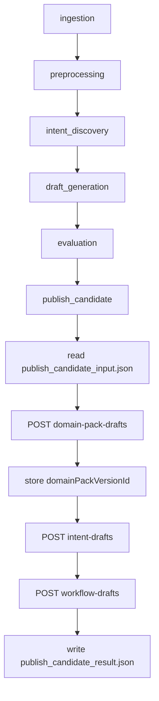

# [ML/Infra-218] Airflow publish_candidate -> Spring Backend Callback 발신 연동

> **Backlog**: 2.1.8 [Infra] workflow 완료 후 callback 연동
> **Layer**: ML Pipeline / Infra Integration
> **Template**: `.agent/specs/_TEMPLATE_ML.md`
> **Branch**: `feature/218-publish-candidate-callback`
> **Depends on**:
> - `verified` `.agent/specs/213.md`
> - `verified` `.agent/specs/217.md`
> - `verified` `.agent/docs/architecture.md`
> - `verified` `.agent/docs/schema.md`
> **Verified existing code paths**:
> - `ml/src/dags/domain_pack_generation.py`
> - `ml/src/pipeline/stages/publish_candidate/main.py`
> - `ml/src/pipeline/common/config.py`
> - `ml/src/pipeline/common/artifacts.py`
> - `backend/src/main/java/com/init/pipelinejob/presentation/PipelineIntentDraftCallbackController.java`
> - `backend/src/main/java/com/init/pipelinejob/presentation/PipelineWorkflowDraftCallbackController.java`
> **Planned new path**:
> - `ml/src/pipeline/common/callbacks.py`

---

## Goal

Airflow `domain_pack_generation` DAG의 `publish_candidate` stage에서 최종 candidate artifact를 읽고, Spring Backend의 기존 3단계 callback API를 순서대로 호출하여 Domain Pack DRAFT 버전을 완성한다.

핵심 흐름은 아래와 같다.

1. upstream stage가 생성한 `publish_candidate_input.json`을 읽는다.
2. `domain-pack-drafts` callback을 호출한다.
3. Spring 응답의 `domainPackId`, `domainPackVersionId`, `versionNo`를 publish context에 저장한다.
4. `domainPackVersionId`를 사용해 `intent-drafts` callback을 호출한다.
5. 같은 `domainPackVersionId`를 사용해 `workflow-drafts` callback을 호출한다.
6. callback 결과를 `publish_candidate_result.json` 및 stage manifest에 남긴다.

이 스펙의 목표는 ML 알고리즘 산출 품질이 아니라, Airflow와 Spring 사이의 publish callback 계약을 닫는 것이다.

---

## Current State

현재 Spring Backend에는 callback 수신부가 구현되어 있다.

| Callback | Endpoint | Spring 동작 |
|----------|----------|-------------|
| Domain Pack Draft | `POST /api/v1/pipeline-jobs/{jobId}/callbacks/domain-pack-drafts` | `DomainPack` 조회/생성 + 빈 `DRAFT` version 생성 |
| Intent Draft | `POST /api/v1/pipeline-jobs/{jobId}/callbacks/intent-drafts` | 기존 `DRAFT` version에 intent 적재 |
| Workflow Draft | `POST /api/v1/pipeline-jobs/{jobId}/callbacks/workflow-drafts` | slot/policy/risk/workflow/binding 적재 후 job `SUCCEEDED` 종료 |

현재 Airflow DAG와 stage 파일은 존재하지만, 실제 publish callback 발신 로직은 없다.

- `ml/src/dags/domain_pack_generation.py`: 6단계 DAG 체인 존재
- `ml/src/pipeline/stages/publish_candidate/main.py`: `pass`
- `PipelineRuntimeConfig`: `PIPELINE_BACKEND_BASE_URL`, `PIPELINE_ARTIFACT_ROOT`만 보유
- `draft_generation`, `evaluation` 등 upstream stage의 실제 artifact 생성 구현은 아직 placeholder 상태

따라서 본 스펙은 upstream stage가 나중에 생성해야 할 최종 candidate artifact 계약을 먼저 정의하고, `publish_candidate`는 그 artifact만 읽어 Spring callback을 수행하도록 한다.

---

## Scope

### In scope

- `publish_candidate` stage의 Spring callback 발신 로직
- `publish_candidate_input.json` schema 정의
- `publish_candidate_result.json` schema 정의
- callback HTTP client 공통 모듈 정의
- `domain-pack-drafts -> intent-drafts -> workflow-drafts` 순차 호출
- 첫 callback 응답의 `domainPackVersionId`를 이후 callback payload에 주입
- Airflow retry를 고려한 idempotent `externalEventId` 생성 규칙
- 부분 성공 후 retry를 위한 publish context 저장/복구 정책
- callback 결과와 실패 원인을 artifact/manifest에 기록
- production 연동 전에 필요한 upstream/Backend/status sync 의존성 명시
- unit/smoke test 기준 정의

### Out of scope

- Spring Backend callback endpoint 신규 구현
- Backend에서 Airflow DAG run을 trigger하는 기능
- ML stage의 실제 draft 생성 알고리즘 구현
- `draft_generation` / `evaluation` 내부 artifact 상세 schema 전체 확정
- review task 자동 생성
- DB schema 변경
- Spring duplicate callback 응답 형태 변경 또는 recovery endpoint 구현
- Spring -> Airflow DAG/task 상태 동기화 구현
- Airflow 실패를 Spring에 별도 통지하는 failure callback

---

## DAG Flow



---

## Stage Interface

### Input

`publish_candidate`는 upstream manifest path를 입력으로 받는다.

```python
def run(upstream_manifest_path: str | None = None) -> None:
    ...
```

`upstream_manifest_path`는 이전 stage의 `manifest.json` 경로다. 해당 manifest의 payload에서 `candidateArtifactPath`를 읽는다.

`pipeline_job_id`는 Airflow DAG run params의 `pipeline_job_id`에서 제공된다. 이 값은 Spring Backend에서 이미 생성된 `pipeline.pipeline_job.id`이며, callback URL의 `{jobId}`로 사용하는 실행 추적용 ID다. `publish_candidate`가 `StageContext`를 구성할 때는 `context["params"].get("pipeline_job_id")` 또는 같은 의미의 Airflow context 접근을 사용한다.

`pipeline_job_id`는 `domainPackId`나 `domainPackVersionId`를 만드는 원인이 아니다. `domainPackId`와 `domainPackVersionId`는 Airflow 산출물을 받은 첫 `domain-pack-drafts` callback을 Spring이 처리하면서 생성/조회하고 응답하는 값이다.

```json
{
  "payload": {
    "status": "completed",
    "candidateArtifactPath": "/opt/airflow/artifacts/domain_pack_generation/manual__run/evaluation/publish_candidate_input.json"
  }
}
```

`candidateArtifactPath`가 없거나 파일을 읽을 수 없으면 `publish_candidate`는 실패한다. 기본 파일명 탐색은 하지 않는다.

입력 manifest의 key는 upstream callback request 계열과 맞추기 위해 `candidateArtifactPath`를 사용한다. `publish_candidate_result.json`도 같은 camelCase key를 유지한다. 단, `write_stage_manifest(...)`가 생성하는 출력 `manifest.json` payload에서는 기존 stage manifest 관례에 맞춰 `candidate_artifact_path`로 변환해 저장한다.

현재 실제 `evaluation` stage와 공통 DAG wrapper는 `candidateArtifactPath`를 생산하지 않는다. 따라서 `publish_candidate` 구현 전제 조건으로, upstream producer는 최소한 `evaluation` stage에서 최종 `publish_candidate_input.json`을 만들고 `manifest.json` payload에 `candidateArtifactPath`를 기록하도록 수정되어야 한다. 이 의존성이 충족되지 않으면 `publish_candidate`는 설계대로 즉시 실패해야 한다.

### Output

`publish_candidate`는 자신의 stage directory에 아래 파일을 생성한다.

| 파일 | 형식 | 설명 |
|------|------|------|
| `publish_candidate_result.json` | JSON | Spring callback 실행 결과와 publish context |
| `manifest.json` | JSON | `write_stage_manifest(...)`가 생성하는 stage manifest |

`manifest.json` payload에는 최소한 아래 정보를 포함한다.

```json
{
  "status": "completed",
  "candidate_artifact_path": "/opt/airflow/artifacts/.../publish_candidate_input.json",
  "publish_result_path": "/opt/airflow/artifacts/.../publish_candidate/publish_candidate_result.json",
  "domain_pack_id": 7,
  "domain_pack_version_id": 101,
  "version_no": 3,
  "callbacks": [
    {
      "type": "domain-pack-drafts",
      "external_event_id": "domain_pack_generation:manual__run:domain-pack-drafts",
      "http_status": 201,
      "response_status": "CREATED"
    }
  ]
}
```

실패 시에도 가능한 범위에서 `publish_candidate_result.json`을 남기고, manifest payload에는 `status = "failed"`와 실패 callback 정보를 남긴다.

---

## Candidate Artifact Schema

`publish_candidate_input.json`은 upstream stage가 생성하고, `publish_candidate`가 읽는 최종 입력 계약이다.

이 artifact는 Spring callback payload와 거의 같은 구조를 가지지만, 다음 값은 runtime에 생성/주입된다.

- `externalEventId`: `publish_candidate`가 DAG context로 생성
- `domainPackVersionId`: 첫 callback 응답에서 획득
- `publishContext.*`: callback 진행 중/후 Airflow가 채움. 입력 artifact에 없어도 되며, 없으면 `publish_candidate`가 null/default 값으로 초기화한다.

`domainPackDraft.packKey`, `domainPackDraft.packName`, `domainPackDraft.summaryJson`은 Spring이 생성하는 값이 아니라 Airflow가 Spring에 보내는 입력값이다. 따라서 candidate artifact에는 `packKey`와 `packName`이 반드시 채워져 있어야 한다.

`packKey`와 `packName`의 생성 주체는 upstream candidate producer(`draft_generation` 또는 `evaluation`)이다. `publish_candidate`는 이 값을 자동 생성하지 않고 non-blank 검증만 수행한다. DAG run conf에서 사용자가 지정한 pack key/name을 지원하는 경우에도, 그 값은 upstream producer가 `publish_candidate_input.json`에 반영해야 한다.

`evaluationSummary`는 optional이다. 존재하고 `passed = false`이면 callback을 보내지 않고 `BLOCKED_BY_EVALUATION` result를 기록한 뒤 Airflow task를 실패시킨다. 필드가 없으면 `publish_candidate`는 품질 gate 판단을 생략하고 callback 계약 검증만 수행한다.

### Example

```json
{
  "schemaVersion": "1.0",
  "domainPackDraft": {
    "packKey": "refund-pack",
    "packName": "환불 Pack",
    "summaryJson": "{\"clusterCount\":12}"
  },
  "intentDraft": {
    "intents": [
      {
        "intentCode": "refund_request",
        "name": "환불 요청",
        "description": "고객이 환불을 요청하는 의도",
        "taxonomyLevel": 1,
        "parentIntentCode": null,
        "sourceClusterRef": "{\"clusterId\":\"c-refund\"}",
        "entryConditionJson": "{}",
        "evidenceJson": "[]",
        "metaJson": "{}"
      }
    ]
  },
  "workflowDraft": {
    "slots": [
      {
        "slotCode": "order_id",
        "name": "주문번호",
        "description": "환불 대상 주문 번호",
        "dataType": "STRING",
        "isSensitive": false,
        "validationRuleJson": "{}",
        "defaultValueJson": null,
        "metaJson": "{}"
      }
    ],
    "policies": [
      {
        "policyCode": "refund_policy_default",
        "name": "기본 환불 정책",
        "description": "기본 환불 가능 여부를 판단한다.",
        "severity": "HIGH",
        "conditionJson": "{}",
        "actionJson": "{}",
        "evidenceJson": "[]",
        "metaJson": "{}"
      }
    ],
    "risks": [
      {
        "riskCode": "fraud_high_amount",
        "name": "고액 환불 위험",
        "description": "고액 환불 요청 위험",
        "riskLevel": "HIGH",
        "triggerConditionJson": "{}",
        "handlingActionJson": "{}",
        "evidenceJson": "[]",
        "metaJson": "{}"
      }
    ],
    "workflows": [
      {
        "workflowCode": "refund_flow",
        "name": "환불 플로우",
        "description": "환불 요청 처리 흐름",
        "graphJson": "{\"nodes\":[{\"id\":\"start\",\"type\":\"START\"},{\"id\":\"answer\",\"type\":\"ACTION\",\"policyRef\":\"refund_policy_default\"},{\"id\":\"terminal\",\"type\":\"TERMINAL\"}],\"edges\":[{\"id\":\"e1\",\"from\":\"start\",\"to\":\"answer\"},{\"id\":\"e2\",\"from\":\"answer\",\"to\":\"terminal\"}]}",
        "evidenceJson": "[]",
        "metaJson": "{}"
      }
    ],
    "intentSlotBindings": [
      {
        "intentCode": "refund_request",
        "slotCode": "order_id",
        "isRequired": true,
        "collectionOrder": 1,
        "promptHint": "주문번호를 알려주세요.",
        "conditionJson": "{}"
      }
    ],
    "intentWorkflowBindings": [
      {
        "intentCode": "refund_request",
        "workflowCode": "refund_flow",
        "isPrimary": true,
        "routeConditionJson": "{}"
      }
    ]
  },
  "evaluationSummary": {
    "passed": true,
    "mappingRate": null,
    "outlierRate": null,
    "workflowSeparability": null
  },
  "publishContext": {
    "domainPackId": null,
    "domainPackVersionId": null,
    "versionNo": null,
    "publishStatus": "PENDING",
    "callbackResults": []
  }
}
```

### Field Responsibilities

| Field | 담당 | 설명 | 중요도 |
|-------|------|------|--------|
| `schemaVersion` | upstream producer | candidate artifact 구조 버전 | 높음 |
| `domainPackDraft` | upstream producer | 첫 callback 입력값. `packKey`, `packName`, `summaryJson` 포함 | 높음 |
| `intentDraft` | upstream producer | 두 번째 callback 입력값. `intents` 포함 | 높음 |
| `workflowDraft` | upstream producer | 세 번째 callback 입력값. slot/policy/risk/workflow/binding 포함 | 높음 |
| `evaluationSummary` | upstream producer | optional. publish 가능 여부 및 품질 지표 요약 | 중간 |
| `publishContext.domainPackId` | publish_candidate | 첫 callback 응답으로 채움 | 높음 |
| `publishContext.domainPackVersionId` | publish_candidate | 첫 callback 응답으로 채우고 다음 callback에 주입 | 높음 |
| `publishContext.versionNo` | publish_candidate | 첫 callback 응답으로 채움 | 중간 |
| `publishContext.publishStatus` | publish_candidate | `PENDING/RUNNING/SUCCEEDED/FAILED/SKIPPED/BLOCKED_BY_EVALUATION` | 중간~높음 |
| `publishContext.callbackResults` | publish_candidate | callback별 요청/응답 결과 기록 | 높음 |

`domainPackDraft.packKey`, `domainPackDraft.packName`, `domainPackDraft.summaryJson`은 Spring이 생성하는 값이 아니라 Airflow가 Spring에 보내는 입력값이다. 따라서 candidate artifact에 채워져 있어야 한다.

반대로 `publishContext.domainPackId`, `publishContext.domainPackVersionId`, `publishContext.versionNo`는 Spring 응답으로부터 Airflow가 채우는 값이다. 이 값들은 `pipeline_job_id`에서 파생하지 않고, 첫 `domain-pack-drafts` callback의 `domainPackDraft` payload를 Spring이 처리한 결과로 결정된다.

`publishContext`는 input artifact에서 optional이다. upstream producer가 빈 context를 넣어도 되고, 생략해도 된다. `publish_candidate`는 처리 시작 시 아래 기본값으로 context를 준비한다.

```json
{
  "domainPackId": null,
  "domainPackVersionId": null,
  "versionNo": null,
  "publishStatus": "PENDING",
  "callbackResults": []
}
```

### Minimal Validation

`publish_candidate`는 Spring에 보내기 전 아래 최소 검증을 수행한다.

| Field | Rule |
|-------|------|
| `schemaVersion` | `"1.0"`이어야 함 |
| `domainPackDraft.packKey` | 필수 non-blank string, max 100 |
| `domainPackDraft.packName` | 필수 non-blank string, max 255 |
| `intentDraft.intents` | 1개 이상 |
| `intentDraft.intents[].intentCode` | 필수 non-blank string, max 100, candidate 내 중복 금지 |
| `workflowDraft` | `slots/policies/risks/workflows/intentSlotBindings/intentWorkflowBindings` 중 최소 1개 이상 |
| `workflowDraft.*Code` | 필수 non-blank string, max 100, 같은 entity type 내 중복 금지 |
| `workflowDraft.workflows[].graphJson` | 비어 있지 않은 string |
| `workflowDraft.intentSlotBindings[]` | 참조하는 `intentCode`와 `slotCode`가 candidate 안에 존재해야 함 |
| `workflowDraft.intentWorkflowBindings[]` | 참조하는 `intentCode`와 `workflowCode`가 candidate 안에 존재해야 함 |
| `workflowDraft.workflows[].graphJson`의 `policyRef` | candidate 내부 policies에 있으면 빠른 검증 가능. 최종 해소는 Spring Backend에 위임 |
| `evaluationSummary.passed` | optional. 필드가 있고 `false`이면 callback을 보내지 않고 `BLOCKED_BY_EVALUATION` 결과를 남긴 뒤 Airflow task 실패 |

세부 domain validation은 Spring Backend의 213/217 callback 수신부가 담당한다.

---

## Callback Contract

### Common Header

| Header | Value |
|--------|-------|
| `Content-Type` | `application/json` |
| `X-Airflow-Webhook-Secret` | `AIRFLOW_WEBHOOK_SECRET` |

### Endpoint 1: domain-pack-drafts

Request:

```json
{
  "externalEventId": "domain_pack_generation:manual__run:domain-pack-drafts",
  "packKey": "refund-pack",
  "packName": "환불 Pack",
  "summaryJson": "{\"clusterCount\":12}"
}
```

Success response에서 아래 값을 추출한다.

```json
{
  "domainPackId": 7,
  "domainPackVersionId": 101,
  "versionNo": 3
}
```

### Endpoint 2: intent-drafts

`domain-pack-drafts` 응답에서 받은 `domainPackVersionId`를 request body에 주입한다.

```json
{
  "externalEventId": "domain_pack_generation:manual__run:intent-drafts",
  "domainPackVersionId": 101,
  "intents": [
    {
      "intentCode": "refund_request",
      "name": "환불 요청",
      "description": "고객이 환불 가능 여부와 절차를 문의하는 의도",
      "taxonomyLevel": 1,
      "parentIntentCode": null,
      "sourceClusterRef": "{\"clusterId\":\"c-refund\"}",
      "entryConditionJson": "{}",
      "evidenceJson": "[]",
      "metaJson": "{}"
    }
  ]
}
```

### Endpoint 3: workflow-drafts

같은 `domainPackVersionId`를 request body에 주입한다.

```json
{
  "externalEventId": "domain_pack_generation:manual__run:workflow-drafts",
  "domainPackVersionId": 101,
  "slots": [
    {
      "slotCode": "order_id",
      "name": "주문번호",
      "description": "환불 대상 주문 번호",
      "dataType": "STRING",
      "isSensitive": false,
      "validationRuleJson": "{}",
      "defaultValueJson": null,
      "metaJson": "{}"
    }
  ],
  "policies": [
    {
      "policyCode": "refund_policy_default",
      "name": "기본 환불 정책",
      "description": "기본 환불 가능 여부를 판단한다.",
      "severity": "HIGH",
      "conditionJson": "{}",
      "actionJson": "{}",
      "evidenceJson": "[]",
      "metaJson": "{}"
    }
  ],
  "risks": [
    {
      "riskCode": "fraud_high_amount",
      "name": "고액 환불 위험",
      "description": "고액 환불 요청 위험",
      "riskLevel": "HIGH",
      "triggerConditionJson": "{}",
      "handlingActionJson": "{}",
      "evidenceJson": "[]",
      "metaJson": "{}"
    }
  ],
  "workflows": [
    {
      "workflowCode": "refund_flow",
      "name": "환불 플로우",
      "description": "환불 요청 처리 흐름",
      "graphJson": "{\"nodes\":[{\"id\":\"start\",\"type\":\"START\"},{\"id\":\"answer\",\"type\":\"ACTION\",\"policyRef\":\"refund_policy_default\"},{\"id\":\"terminal\",\"type\":\"TERMINAL\"}],\"edges\":[{\"id\":\"e1\",\"from\":\"start\",\"to\":\"answer\"},{\"id\":\"e2\",\"from\":\"answer\",\"to\":\"terminal\"}]}",
      "evidenceJson": "[]",
      "metaJson": "{}"
    }
  ],
  "intentSlotBindings": [
    {
      "intentCode": "refund_request",
      "slotCode": "order_id",
      "isRequired": true,
      "collectionOrder": 1,
      "promptHint": "주문번호를 알려주세요.",
      "conditionJson": "{}"
    }
  ],
  "intentWorkflowBindings": [
    {
      "intentCode": "refund_request",
      "workflowCode": "refund_flow",
      "isPrimary": true,
      "routeConditionJson": "{}"
    }
  ]
}
```

---

## externalEventId Rule

`externalEventId`는 callback type과 무관하게 Spring의 `pipeline.webhook_receipt.external_event_id` 기준으로 전역 unique 해야 한다.

Airflow retry에서는 같은 callback에 대해 같은 `externalEventId`를 다시 사용해야 한다.

형식:

```text
{dag_id}:{run_id}:{callback_type}
```

예:

```text
domain_pack_generation:manual__2026-04-29T12:00:00+00:00:domain-pack-drafts
domain_pack_generation:manual__2026-04-29T12:00:00+00:00:intent-drafts
domain_pack_generation:manual__2026-04-29T12:00:00+00:00:workflow-drafts
```

`run_id`에 `/`가 포함되면 artifact path에서는 `__`로 치환하지만, `externalEventId`에서는 원본 `run_id`를 그대로 사용해도 된다. 단, 255자를 초과하지 않도록 한다.

`externalEventId`는 Spring이 통째로 저장/조회하는 opaque string이다. Spring Backend, Airflow, 기타 외부 시스템은 `:`를 기준으로 split해서 의미를 해석하면 안 된다. `run_id`에 `:`가 포함되어도 위 형식은 사람이 읽기 위한 관례일 뿐이며, 파싱 계약이 아니다.

기본 형식이 255자를 초과하면 deterministic fallback을 사용한다.

```text
{dag_id}:{sha256(run_id)[:16]}:{callback_type}
```

fallback도 retry마다 같은 값을 만들어야 하므로 random, timestamp, try number를 포함하지 않는다.

---

## ID and Naming Contract

callback 계약에서 ID/Code 성격의 값은 최소한의 하드 규칙을 둔다. 이 값들은 멱등성, DB row 연결, binding 해소에 직접 쓰이기 때문이다.

다만 현재 Spring DTO/DB schema는 code 값의 대소문자나 구분자 스타일을 강제하지 않는다. 따라서 `publish_candidate`는 backend 계약보다 강한 naming style을 hard validation으로 막지 않는다. style rule은 upstream producer가 안정적인 산출물을 만들기 위한 권장 규칙으로 둔다.

`name`, `description`, `summaryJson`, `evidenceJson`, `metaJson`처럼 사람이 읽거나 실험적으로 바뀔 가능성이 높은 값은 소프트하게 둔다. 단, Spring DTO의 길이 제한과 JSON string 형식은 지켜야 한다.

### Hard Contract

| Field | Owner | Rule | Reason |
|-------|-------|------|--------|
| `pipelineJobId` | Spring Backend creates before DAG trigger, Airflow receives through DAG params `pipeline_job_id` | Spring `pipeline.pipeline_job.id` 값. callback URL의 `{jobId}`로 사용하며 숫자 문자열이어야 한다. `domainPackId`/`domainPackVersionId` 생성 원인이 아니라 실행 추적 및 callback 대상 식별자다. | Spring이 job/workspace/status를 조회하는 기준 |
| `externalEventId` | `publish_candidate` | `{dag_id}:{run_id}:{callback_type}`. 255자 초과 시 deterministic fallback. retry마다 동일해야 한다. opaque string이므로 `:` 기준 파싱 금지. | webhook 멱등성 key |
| `domainPackVersionId` | Spring Backend creates, Airflow stores from first callback response | candidate artifact에서 임의 생성 금지. `domain-pack-drafts` 응답으로만 획득한다. | 이후 intent/workflow callback target version |
| `packKey` | upstream candidate producer | non-blank, max 100. workspace 안에서 동일 pack 식별자로 쓰인다. | workspace 안의 domain pack 식별자 |
| `intentCode` | upstream candidate producer | non-blank, max 100, 같은 candidate 안에서 중복 금지. | intent row 식별 및 binding 참조 |
| `slotCode` | upstream candidate producer | non-blank, max 100, 같은 candidate 안에서 중복 금지. | slot row 식별 및 binding 참조 |
| `policyCode` | upstream candidate producer | non-blank, max 100, 같은 candidate 안에서 중복 금지. | policy row 식별 및 workflow `policyRef` 해소 |
| `riskCode` | upstream candidate producer | non-blank, max 100, 같은 candidate 안에서 중복 금지. | risk row 식별 |
| `workflowCode` | upstream candidate producer | non-blank, max 100, 같은 candidate 안에서 중복 금지. | workflow row 식별 및 binding 참조 |

`intentSlotBindings`와 `intentWorkflowBindings`는 numeric id가 아니라 code로 연결한다.

```json
{
  "intentSlotBindings": [
    {
      "intentCode": "refund_request",
      "slotCode": "order_id"
    }
  ],
  "intentWorkflowBindings": [
    {
      "intentCode": "refund_request",
      "workflowCode": "refund_flow"
    }
  ]
}
```

따라서 upstream producer는 binding이 참조하는 code가 같은 candidate 안에 존재하도록 만들어야 한다. Spring Backend도 최종 validation을 수행하지만, `publish_candidate`는 callback 전에 빠른 실패를 위해 최소 참조 검증을 수행한다.

`publish_candidate`의 fast validation은 candidate 내부 구조와 중복만 검증한다. 예를 들어 `intentCode`, `slotCode`, `policyCode`, `riskCode`, `workflowCode`가 non-blank, 100자 이하, 같은 candidate 내부에서 중복되지 않는지와 binding/reference가 candidate 내부에 존재하는지만 확인하며, 외부 해소나 Backend/DB lookup은 수행하지 않는다.

`workflowDraft.workflows[].graphJson`의 ACTION node `policyRef`는 Spring Backend가 최종 검증한다. 217 기준으로 policyRef는 이번 callback의 `policies`뿐 아니라 같은 version에 이미 존재하는 DB policy로도 해소될 수 있다. 따라서 `publish_candidate`는 candidate 내부 policy와의 일치 여부를 hard failure로 만들지 않는다.

### Soft Contract

| Field | Rule |
|-------|------|
| `packKey` style | 권장: lowercase kebab-case, `^[a-z0-9]+(-[a-z0-9]+)*$`. Backend가 현재 강제하지 않으므로 hard failure로 만들지 않는다. |
| `intentCode`, `slotCode`, `policyCode`, `riskCode`, `workflowCode` style | 권장: lowercase snake_case, `^[a-z][a-z0-9_]*$`. Backend가 현재 강제하지 않으므로 hard failure로 만들지 않는다. |
| `packName` | 사람이 읽는 표시명. 한국어/공백 허용, non-blank, max 255. |
| `intent.name`, `slot.name`, `policy.name`, `risk.name`, `workflow.name` | 사람이 읽는 표시명. 한국어/공백 허용, non-blank, Spring DTO 길이 제한 준수. |
| `description` | 자연어 설명. 비어 있을 수 있음. Spring DTO 길이 제한 준수. |
| `summaryJson` | JSON string. 내부 schema는 본 스펙에서 고정하지 않는다. |
| `sourceClusterRef`, `entryConditionJson`, `validationRuleJson`, `conditionJson`, `actionJson`, `evidenceJson`, `metaJson` | JSON string. 내부 schema는 stage 구현과 후속 스펙에서 확장 가능. |
| `evaluationSummary` | optional. 존재하면 `passed`만 publish gate로 사용하고 나머지 metric은 참고 정보로 둔다. |
| `workflowDraft.workflows` | 운영 publish candidate에서는 1개 이상을 권장한다. 단, Spring 217 계약은 workflow 관련 list 중 최소 1개 이상을 허용하므로 hard failure로 만들지는 않는다. |

### Recommended Code Examples

| Concept | Example |
|---------|---------|
| `packKey` | `refund-support`, `order-cancel`, `delivery-inquiry` |
| `intentCode` | `refund_request`, `order_cancel_request` |
| `slotCode` | `order_id`, `customer_email` |
| `policyCode` | `refund_policy_default`, `identity_verification_required` |
| `riskCode` | `fraud_high_amount`, `repeat_abuse_pattern` |
| `workflowCode` | `refund_flow`, `order_cancel_flow` |

---

## Retry and Partial Success

부분 성공 후 retry가 가장 중요한 위험이다.

예:

1. `domain-pack-drafts` 성공
2. `intent-drafts` timeout
3. Airflow task retry

이때 `domain-pack-drafts`를 다시 호출하면 Spring은 `DUPLICATE_IGNORED`를 반환할 수 있다. 현재 duplicate 응답은 `domainPackVersionId`를 null로 내려줄 수 있으므로, Airflow가 이전 성공 context를 복구하지 못하면 이후 callback을 만들 수 없다.

더 위험한 경우는 Spring이 `domain-pack-drafts` 처리를 commit했지만 HTTP timeout 때문에 Airflow가 성공 response body를 받지 못한 상황이다. 이 경우 Airflow는 `publish_candidate_result.json`에 `domainPackVersionId`를 flush하지 못한다. retry에서 같은 `externalEventId`로 다시 호출했을 때 Spring이 context 없는 `DUPLICATE_IGNORED`만 반환하면 Airflow는 다음 `intent-drafts`, `workflow-drafts` payload를 만들 수 없다.

따라서 production retry/idempotency 계약은 아래 중 하나가 반드시 충족되어야 한다.

1. Spring duplicate response가 원래 처리 결과의 `domainPackId`, `domainPackVersionId`, `versionNo`를 포함한다.
2. Spring이 `externalEventId` 또는 `pipeline_job_id`로 domain-pack callback 처리 결과를 조회할 수 있는 recovery endpoint를 제공한다.
3. 위 둘이 없으면, `domain-pack-drafts` timeout 후 context가 없는 retry는 자동 복구 불가한 non-retryable failure로 간주한다. 이때 Airflow는 `publishStatus = "FAILED"`, `failedCallbackType = "domain-pack-drafts"`, `error.type = "DomainPackContextLost"`를 기록하고 이후 callback을 보내지 않는다.

따라서 `publish_candidate`는 아래 정책을 따른다.

1. `domain-pack-drafts` 성공 직후 `publish_candidate_result.json`에 `domainPackId`, `domainPackVersionId`, `versionNo`를 즉시 flush한다.
2. retry 시작 시 `domain-pack-drafts`를 skip하려면 아래 조건을 모두 만족해야 한다.
   - `domainPackVersionId`가 존재한다.
   - `callbackResults`에 `type == "domain-pack-drafts"` entry가 존재한다.
   - 해당 entry의 `httpStatus`가 2xx이고 `responseStatus`가 `CREATED` 또는 성공으로 취급하는 값이다.
3. `intent-drafts` 성공 결과도 즉시 기록한다.
4. retry 시작 시 `intent-drafts`가 이미 성공으로 기록되어 있으면 재호출하지 않는다.
5. `workflow-drafts`가 성공하면 `publishStatus = "SUCCEEDED"`로 기록한다.
6. 실패 시 `publishStatus = "FAILED"`, `failedCallbackType`, `error`를 기록하고 예외를 raise해 Airflow task를 실패시킨다.

---

## publish_candidate_result.json Schema

`publishStatus`는 아래 값만 허용한다.

| publishStatus | 의미 | callbackResults | failedCallbackType | error |
|----------------|------|-----------------|--------------------|-------|
| `PENDING` | stage가 시작되었지만 callback이 아직 실행되지 않음 | empty 가능 | null | null |
| `RUNNING` | callback 진행 중이며 partial success가 있을 수 있음 | 성공한 callback만 누적 | null | null |
| `SUCCEEDED` | 3개 callback 모두 성공 | 3개 성공 entry 필수 | null | null |
| `FAILED` | callback 또는 stage 처리 실패 | 성공한 callback entry는 보존 | 실패 callback type 또는 stage 실패면 null | structured error 필수 |
| `SKIPPED` | callback disabled 등 publish를 의도적으로 수행하지 않음 | empty | null | null |
| `BLOCKED_BY_EVALUATION` | evaluation gate 실패로 publish 차단 | empty | null | reason 또는 structured error 필수 |

### Root Fields

| Field | Type | Requirement |
|-------|------|-------------|
| `schemaVersion` | string | required. 현재 값은 `"1.0"` |
| `publishStatus` | string enum | required. 위 허용값 중 하나 |
| `pipelineContext` | object | Airflow pipeline run에서는 required |
| `pipelineContext.dagId` | string | Airflow pipeline run에서는 required |
| `pipelineContext.runId` | string | Airflow pipeline run에서는 required |
| `pipelineContext.pipelineJobId` | string | Airflow pipeline run에서는 required. callback enabled 상태에서는 숫자 문자열이어야 함 |
| `pipelineContext.workspaceId` | string or null | Airflow pipeline run에서는 key required. DAG params에 없으면 null 허용 |
| `pipelineContext.datasetId` | string or null | Airflow pipeline run에서는 key required. DAG params에 없으면 null 허용 |
| `candidateArtifactPath` | string or null | upstream manifest에서 path를 읽은 뒤에는 required non-null. 그 전에 실패한 경우에만 null/omission 허용 |
| `domainPackId` | number or null | `SUCCEEDED`에서는 required non-null. 그 외 상태에서는 nullable |
| `domainPackVersionId` | number or null | `SUCCEEDED`에서는 required non-null. 그 외 상태에서는 nullable |
| `versionNo` | number or null | `SUCCEEDED`에서는 required non-null. 그 외 상태에서는 nullable |
| `callbackResults` | array | required. 성공한 callback 결과를 순서대로 누적하며, callback을 보내지 않은 상태에서는 empty |
| `failedCallbackType` | string or null | `FAILED`에서 callback 실패라면 해당 callback type. stage-local failure면 null 허용. 그 외 상태에서는 null |
| `error` | object or null | `FAILED`에서는 structured error required. `SKIPPED`는 null. `BLOCKED_BY_EVALUATION`은 null 또는 structured reason object 허용 |
| `skipReason` | string | optional. `SKIPPED`에서는 required |
| `blockReason` | string | optional. `BLOCKED_BY_EVALUATION`에서는 required |

### Status Requirements

| publishStatus | Required fields | Nullable/optional fields |
|----------------|-----------------|--------------------------|
| `PENDING` | `schemaVersion`, `publishStatus`, `pipelineContext`, `callbackResults` | `candidateArtifactPath` nullable until resolved. `domainPackId`, `domainPackVersionId`, `versionNo`, `failedCallbackType`, `error` should be null |
| `RUNNING` | `schemaVersion`, `publishStatus`, `pipelineContext`, `candidateArtifactPath`, `callbackResults` | `domainPackId`, `domainPackVersionId`, `versionNo` may be non-null after `domain-pack-drafts` success. `failedCallbackType`, `error` should be null |
| `SUCCEEDED` | all root fields except `skipReason`, `blockReason`; `domainPackId`, `domainPackVersionId`, `versionNo` non-null; 3 successful `callbackResults` | `failedCallbackType`, `error` must be null |
| `FAILED` | `schemaVersion`, `publishStatus`, `pipelineContext`, `callbackResults`, structured `error` | `failedCallbackType` required only when a specific callback failed. `domainPackId`, `domainPackVersionId`, `versionNo` nullable for pre-domain failures |
| `SKIPPED` | `schemaVersion`, `publishStatus`, `pipelineContext`, `candidateArtifactPath`, `skipReason`, empty `callbackResults` | `domainPackId`, `domainPackVersionId`, `versionNo`, `failedCallbackType`, `error` must be null |
| `BLOCKED_BY_EVALUATION` | `schemaVersion`, `publishStatus`, `pipelineContext`, `candidateArtifactPath`, `blockReason`, empty `callbackResults` | `domainPackId`, `domainPackVersionId`, `versionNo`, `failedCallbackType` must be null. `error` may be null or structured reason object |

`callbackResults[].responseBody`와 `error.responseBody`는 항상 redacted raw response text string 또는 null이다. JSON parsing이 성공하면 `parsedResponseBody`에 parsed JSON object/array를 저장할 수 있다. JSON parsing이 실패하면 원본 raw text에 redaction/truncation을 적용한 값을 `responseBody`에 저장하고 `parsedResponseBody`는 null로 둔다.

`callbackResults[]` entry는 `type`, `externalEventId`, `endpoint`, `httpStatus`, `responseStatus`, `responseBody`, `parsedResponseBody`를 포함한다. `responseBody`는 redacted raw string 또는 null이며, `parsedResponseBody`는 JSON parse 성공 시 object/array, JSON parse 실패 또는 body 없음이면 null이다. `error.responseBody`와 `error.parsedResponseBody`도 같은 typing rule을 따른다.

request/response 기록에는 아래 redaction 정책을 적용한다.

- 필수: `X-Airflow-Webhook-Secret` header는 artifact와 log에 원문 저장 금지. 값은 `***`로 마스킹한다.
- 권장: 공통 redaction helper는 `Authorization`, `Cookie`, `Set-Cookie` header도 함께 마스킹한다. 현재 callback 계약에서 필수 header는 아니지만, future-proof 기본값으로 둔다.
- 권장: JSON object에서는 key 이름이 `secret`, `token`, `password`, `authorization`, `cookie`, `email`, `phone`, `ssn`을 포함하면 값을 `***`로 마스킹한다. 현재 필수 계약은 webhook secret 보호이며, 나머지는 PII/secret 노출을 줄이기 위한 방어적 기본값이다.
- log에는 request/response body 전체를 남기지 않는다. 필요한 경우 callback type, externalEventId, httpStatus, responseStatus, redacted response snippet만 남긴다.
- result artifact의 `responseBody`는 redaction 후 저장하며, 큰 body는 정해진 최대 길이로 truncate하고 `responseBodyTruncated = true`를 함께 기록한다. 권장 최대 길이는 artifact 64KB, log snippet 2KB다.

```json
{
  "schemaVersion": "1.0",
  "publishStatus": "SUCCEEDED",
  "pipelineContext": {
    "dagId": "domain_pack_generation",
    "runId": "manual__2026-04-29T12:00:00+00:00",
    "pipelineJobId": "11",
    "workspaceId": "3",
    "datasetId": "5"
  },
  "candidateArtifactPath": "/opt/airflow/artifacts/.../publish_candidate_input.json",
  "domainPackId": 7,
  "domainPackVersionId": 101,
  "versionNo": 3,
  "failedCallbackType": null,
  "callbackResults": [
    {
      "type": "domain-pack-drafts",
      "externalEventId": "domain_pack_generation:manual__run:domain-pack-drafts",
      "endpoint": "/api/v1/pipeline-jobs/11/callbacks/domain-pack-drafts",
      "httpStatus": 201,
      "responseStatus": "CREATED",
      "responseBody": "{\"status\":\"CREATED\",\"domainPackVersionId\":101}",
      "parsedResponseBody": {
        "status": "CREATED",
        "domainPackVersionId": 101
      }
    },
    {
      "type": "intent-drafts",
      "externalEventId": "domain_pack_generation:manual__run:intent-drafts",
      "endpoint": "/api/v1/pipeline-jobs/11/callbacks/intent-drafts",
      "httpStatus": 201,
      "responseStatus": "CREATED",
      "responseBody": "{\"status\":\"CREATED\",\"domainPackVersionId\":101}",
      "parsedResponseBody": {
        "status": "CREATED",
        "domainPackVersionId": 101
      }
    },
    {
      "type": "workflow-drafts",
      "externalEventId": "domain_pack_generation:manual__run:workflow-drafts",
      "endpoint": "/api/v1/pipeline-jobs/11/callbacks/workflow-drafts",
      "httpStatus": 201,
      "responseStatus": "CREATED",
      "responseBody": "{\"status\":\"CREATED\",\"domainPackVersionId\":101}",
      "parsedResponseBody": {
        "status": "CREATED",
        "domainPackVersionId": 101
      }
    }
  ],
  "error": null
}
```

실패 예:

```json
{
  "schemaVersion": "1.0",
  "publishStatus": "FAILED",
  "failedCallbackType": "intent-drafts",
  "candidateArtifactPath": "/opt/airflow/artifacts/.../publish_candidate_input.json",
  "domainPackId": 7,
  "domainPackVersionId": 101,
  "versionNo": 3,
  "callbackResults": [
    {
      "type": "domain-pack-drafts",
      "externalEventId": "domain_pack_generation:manual__run:domain-pack-drafts",
      "endpoint": "/api/v1/pipeline-jobs/11/callbacks/domain-pack-drafts",
      "httpStatus": 201,
      "responseStatus": "CREATED",
      "responseBody": "{\"status\":\"CREATED\",\"domainPackVersionId\":101}",
      "parsedResponseBody": {
        "status": "CREATED",
        "domainPackVersionId": 101
      }
    }
  ],
  "error": {
    "type": "PipelineCallbackError",
    "message": "Spring callback failed: httpStatus=400",
    "httpStatus": 400,
    "responseBody": "{\"code\":\"VALIDATION_ERROR\"}",
    "parsedResponseBody": {
      "code": "VALIDATION_ERROR"
    }
  }
}
```

callback disabled로 인한 skip 예:

```json
{
  "schemaVersion": "1.0",
  "publishStatus": "SKIPPED",
  "pipelineContext": {
    "dagId": "domain_pack_generation",
    "runId": "manual__2026-04-29T12:00:00+00:00",
    "pipelineJobId": "11",
    "workspaceId": "3",
    "datasetId": "5"
  },
  "candidateArtifactPath": "/opt/airflow/artifacts/.../publish_candidate_input.json",
  "skipReason": "CALLBACK_DISABLED",
  "domainPackId": null,
  "domainPackVersionId": null,
  "versionNo": null,
  "failedCallbackType": null,
  "callbackResults": [],
  "error": null
}
```

evaluation gate 실패 예:

```json
{
  "schemaVersion": "1.0",
  "publishStatus": "BLOCKED_BY_EVALUATION",
  "pipelineContext": {
    "dagId": "domain_pack_generation",
    "runId": "manual__2026-04-29T12:00:00+00:00",
    "pipelineJobId": "11",
    "workspaceId": "3",
    "datasetId": "5"
  },
  "candidateArtifactPath": "/opt/airflow/artifacts/.../publish_candidate_input.json",
  "blockReason": "evaluationSummary.passed=false",
  "domainPackId": null,
  "domainPackVersionId": null,
  "versionNo": null,
  "failedCallbackType": null,
  "callbackResults": [],
  "error": {
    "type": "EvaluationBlocked",
    "message": "Candidate did not pass evaluation gate",
    "responseBody": null,
    "parsedResponseBody": null
  }
}
```

`BLOCKED_BY_EVALUATION`은 callback을 보내지 않는 terminal local result다. Spring failure callback은 본 스펙 범위 밖이므로, 이 상태를 기록한 뒤 `publish_candidate`는 Airflow task를 실패시킨다. Spring `pipeline_job`을 `FAILED` 또는 이에 준하는 종료 상태로 전이시키는 책임은 Spring -> Airflow trigger/status sync 구현에 둔다. 현재 해당 구현은 확인되지 않았으므로, production 연동 전에는 DAG/task 실패를 Spring pipeline job 상태로 동기화하는 경로가 반드시 합의되어야 한다.

---

## Configuration

`PipelineRuntimeConfig`를 확장한다.

| Env | Default | Required | Description |
|-----|---------|----------|-------------|
| `PIPELINE_ARTIFACT_ROOT` | `/opt/airflow/artifacts` | Y | artifact 저장 루트 |
| `PIPELINE_BACKEND_BASE_URL` | `http://backend:8080` | Y | Spring Backend base URL |
| `AIRFLOW_WEBHOOK_SECRET` | 없음 | Y when callback enabled | Spring `airflow.webhook.secret`과 같은 값 |
| `PIPELINE_CALLBACK_ENABLED` | `true` | N | false이면 callback을 보내지 않고 result에 `SKIPPED` 기록 |
| `PIPELINE_CALLBACK_TIMEOUT_SECONDS` | `10` | N | HTTP callback timeout |

`AIRFLOW_WEBHOOK_SECRET`은 Spring Backend의 `AIRFLOW_WEBHOOK_SECRET`과 동일해야 한다.

local DAG parsing/smoke test를 Backend 없이 수행해야 하는 경우 `PIPELINE_CALLBACK_ENABLED=false`를 사용할 수 있다. 단, 통합 환경에서는 true로 켜야 한다.

---

## Implementation Plan

### New file: `ml/src/pipeline/common/callbacks.py`

역할:

- callback endpoint URL 조립
- `X-Airflow-Webhook-Secret` header 구성
- JSON POST
- timeout 처리
- 2xx 성공 / non-2xx 실패 판정
- response JSON parsing 및 redacted raw response text 보존
- `PipelineCallbackError` 정의

예상 API:

```python
def post_callback(
    backend_base_url: str,
    job_id: str,
    callback_type: str,
    payload: dict[str, object],
    webhook_secret: str,
    timeout_seconds: float,
) -> CallbackResponse:
    ...
```

`callback_type`은 아래 세 값만 허용한다.

- `domain-pack-drafts`
- `intent-drafts`
- `workflow-drafts`

request/response 처리 함수는 URL을 조립하고, `X-Airflow-Webhook-Secret` header를 설정하고, POST를 수행한 뒤 2xx/non-2xx를 판정한다. 응답 body는 먼저 JSON parse를 시도한다. 성공하면 `parsedResponseBody`에 parsed JSON을 저장하고 `responseBody`에는 redacted raw text를 저장한다. JSON parse에 실패하면 `parsedResponseBody = null`, `responseBody = redactedRawText`로 기록한다. non-2xx에서는 `PipelineCallbackError` payload와 로그에도 같은 redacted `responseBody`를 포함해 downstream retry/recording logic이 일관된 string field에 의존할 수 있게 한다.

단, artifact/log에 쓰기 전에는 위의 redaction/truncation 정책을 적용한다. `PipelineCallbackError`는 redacted `responseBody`, `responseBodyTruncated`, `httpStatus`, `callbackType`, `externalEventId`를 포함해야 하며, `X-Airflow-Webhook-Secret`이나 full request body를 log에 남기면 안 된다.

### Modify: `ml/src/pipeline/common/config.py`

`PipelineRuntimeConfig`에 아래 필드를 추가한다.

```python
callback_enabled: bool
callback_timeout_seconds: float
airflow_webhook_secret: str | None
```

`callback_enabled`가 true인데 secret이 비어 있으면 `PipelineConfigurationError`를 던진다.

### Modify: `ml/src/dags/domain_pack_generation.py`

현재 `_run_stage(...)`는 `stage_callable(upstream_manifest_path)`를 호출한 뒤 wrapper가 generic payload로 `manifest.json`을 작성한다. 이 구조만으로는 `publish_candidate`가 생성한 `publish_result_path`, domain pack id, callback summary를 최종 manifest에 반영하기 어렵다.

따라서 후속 구현에서는 아래 중 하나로 wrapper 계약을 수정한다.

1. stage callable이 `dict[str, object]` payload를 반환하게 하고, `_run_stage(...)`가 이를 generic manifest payload와 merge해 `write_stage_manifest(...)`에 전달한다.
2. 또는 `publish_candidate`에 `StageContext`와 `PipelineRuntimeConfig`를 명시적으로 전달하고, wrapper는 publish stage가 반환한 manifest payload를 덮어쓰지 않는다.

본 스펙의 권장안은 1번이다. 기존 `run(upstream_manifest_path)` 호출 형태를 크게 바꾸지 않으면서도 publish stage가 필요한 manifest payload를 반환할 수 있기 때문이다.

### Modify: `ml/src/pipeline/stages/evaluation/main.py`

현재 `evaluation` stage는 placeholder이며 `candidateArtifactPath`를 생산하지 않는다. `publish_candidate` 구현 전에는 `evaluation`이 최종 `publish_candidate_input.json`을 생성하고, stage return payload 또는 manifest payload에 `candidateArtifactPath`를 포함해야 한다.

최소 구현 범위:

1. upstream draft artifact를 읽어 `publish_candidate_input.json`을 생성한다.
2. `evaluationSummary`를 포함한다. 평가를 수행하지 못하는 초기 구현에서는 `passed = true` 또는 명시적인 개발용 default 정책을 문서화한다.
3. `_run_stage(...)`가 쓸 payload에 `candidateArtifactPath`를 반환한다.

### Modify: `ml/src/pipeline/stages/publish_candidate/main.py`

역할:

1. `PipelineRuntimeConfig.from_env()` 로드
2. Airflow context의 `context["params"].get("pipeline_job_id")`로 `StageContext.pipeline_job_id` 구성
3. upstream manifest에서 `payload.candidateArtifactPath` 읽기
4. `publish_candidate_result.json`에는 `candidateArtifactPath`를 유지하고, 출력 `manifest.json` payload에는 `candidate_artifact_path`로 변환
5. `publish_candidate_input.json` 파싱 및 최소 검증
6. 기존 `publish_candidate_result.json`이 있으면 partial success context 복구
7. callback 3개 순차 호출
8. 각 성공 직후 result 파일 flush
9. 최종 manifest 작성

---

## Error Handling

| 상황 | 처리 |
|------|------|
| `candidateArtifactPath` 없음 | `PipelineConfigurationError` 또는 stage error |
| candidate JSON parse 실패 | stage 실패 |
| `schemaVersion` 불일치 | stage 실패 |
| `evaluationSummary.passed = false` | callback 미전송, `BLOCKED_BY_EVALUATION` result 기록 후 Airflow task 실패. `callbackResults`는 empty, `failedCallbackType`은 null, `error`에는 차단 사유를 기록 |
| `pipeline_job_id` 없음 | stage 실패 |
| `pipeline_job_id`가 숫자 문자열이 아님 | stage 실패 |
| callback 2xx | 성공 |
| callback 200 + `DUPLICATE_IGNORED` | 성공. 단 필요한 context가 response나 이전 result 파일에 없으면 자동 복구 불가 |
| callback non-2xx | result 기록 후 stage 실패 |
| timeout | result 기록 후 stage 실패 |
| `domain-pack-drafts` timeout 후 context 없음 | `DomainPackContextLost` 실패로 기록하고 이후 callback 미전송 |
| callback response JSON parse 실패 | `parsedResponseBody = null`, `responseBody = redactedRawText`로 result/error에 기록 |

---

## Tests

### Unit Tests

| Test | 검증 |
|------|------|
| `test_build_external_event_id_is_stable` | 같은 dag/run/type이면 같은 externalEventId 생성 |
| `test_load_candidate_requires_schema_version` | schemaVersion 누락/불일치 실패 |
| `test_validate_candidate_requires_intents` | `intentDraft.intents` 빈 배열 실패 |
| `test_validate_candidate_requires_workflow_component` | workflowDraft 전체 빈 배열 실패 |
| `test_domain_pack_response_updates_context` | 첫 callback 응답이 publish context에 저장됨 |
| `test_intent_payload_includes_domain_pack_version_id` | 두 번째 callback payload에 version id 주입 |
| `test_workflow_payload_includes_domain_pack_version_id` | 세 번째 callback payload에 version id 주입 |
| `test_callback_client_sends_secret_header` | `X-Airflow-Webhook-Secret` 포함 |
| `test_non_2xx_raises_callback_error` | HTTP 실패 시 예외 |
| `test_retry_reuses_existing_domain_pack_context` | version id와 성공한 domain callback entry가 모두 있으면 첫 callback skip |
| `test_domain_pack_timeout_without_context_is_non_retryable` | committed timeout 후 context가 없으면 `DomainPackContextLost` 기록 |
| `test_callback_response_body_keeps_redacted_raw_text` | JSON parse 성공/실패와 무관하게 responseBody는 redacted raw string 또는 null |
| `test_redacts_secret_and_sensitive_fields_before_logging` | secret/header/PII 후보 key가 artifact와 log에서 마스킹됨 |
| `test_evaluation_blocked_fails_airflow_task` | `evaluationSummary.passed=false`이면 `BLOCKED_BY_EVALUATION` 기록 후 task 실패 |
| `test_stage_return_payload_is_merged_into_manifest` | stage 반환 payload가 wrapper manifest payload에 반영됨 |
| `test_evaluation_manifest_contains_candidate_artifact_path` | evaluation manifest payload에 `candidateArtifactPath`가 포함됨 |

### Smoke Tests

- `PIPELINE_CALLBACK_ENABLED=false`에서 DAG import가 성공한다.
- `PIPELINE_CALLBACK_ENABLED=false`에서 `publish_candidate`가 candidate artifact를 읽고 `SKIPPED` result를 쓴다.
- mock HTTP server를 사용해 3개 callback 호출 순서가 `domain-pack-drafts -> intent-drafts -> workflow-drafts`임을 검증한다.

---

## Acceptance Criteria

- [ ] `publish_candidate_input.json` schema가 문서화되어 있다.
- [ ] `publish_candidate_result.json` schema와 허용 `publishStatus` 값이 문서화되어 있다.
- [ ] `evaluation` 또는 합의된 upstream producer가 `publish_candidate_input.json`을 만들고 manifest payload에 `candidateArtifactPath`를 남긴다.
- [ ] DAG wrapper는 stage 반환 payload를 `manifest.json` payload에 merge하거나, publish stage가 쓴 manifest를 덮어쓰지 않는다.
- [ ] `publish_candidate`는 `candidateArtifactPath`가 없으면 실패한다.
- [ ] `publish_candidate`는 입력 `candidateArtifactPath`를 result에는 그대로 기록하고, 출력 manifest payload에는 `candidate_artifact_path`로 변환해 기록한다.
- [ ] `publish_candidate`는 Spring callback 3개를 순서대로 호출한다.
- [ ] 첫 callback 응답의 `domainPackVersionId`를 이후 callback payload에 주입한다.
- [ ] `externalEventId`는 retry에도 안정적으로 동일하게 생성된다.
- [ ] domain-pack callback 성공 직후 context가 result 파일에 flush된다.
- [ ] retry 시 `domainPackVersionId`, 성공한 domain callback entry, 2xx `httpStatus`/성공 `responseStatus`를 모두 확인한 뒤 domain callback을 skip한다.
- [ ] Spring이 committed duplicate context를 반환하지 못하고 Airflow에도 저장된 context가 없으면 `DomainPackContextLost`로 실패하고 이후 callback을 보내지 않는다.
- [ ] callback 실패 시 실패 callback type, HTTP status, redacted raw response body string이 result 파일에 남는다.
- [ ] `X-Airflow-Webhook-Secret`은 artifact/log 기록 전에 반드시 마스킹하고, authorization/cookie류 header와 민감 key는 공통 redaction helper에서 권장 마스킹 대상으로 처리한다.
- [ ] callback disabled 모드에서는 `publishStatus = "SKIPPED"`, empty `callbackResults`, null `failedCallbackType`, null `error`로 local DAG smoke test가 가능하다.
- [ ] evaluation gate 실패 시 `publishStatus = "BLOCKED_BY_EVALUATION"`, empty `callbackResults`, null `failedCallbackType`, 차단 사유가 포함된 `error` 또는 `blockReason`을 남기고 Airflow task를 실패시킨다.
- [ ] Spring Backend 213/217 callback request schema와 필드명이 일치한다.

---

## Open Questions

1. `publish_candidate_input.json`은 최종적으로 `evaluation` stage가 만들 것인가, `draft_generation` stage가 만들 것인가?
   - 본 스펙의 권장안: `evaluation`이 publish 가능 후보를 확정하고 `candidateArtifactPath`를 manifest에 남긴다.
2. `PIPELINE_CALLBACK_ENABLED` 기본값을 local에서 false로 둘 것인가, 항상 true로 둘 것인가?
   - 본 스펙의 권장안: 기본 true, local smoke test에서는 env로 false 지정.
3. `evaluationSummary.passed = false`일 때 Airflow task를 실패로 볼 것인가, publish skipped 성공으로 볼 것인가?
   - 본 스펙의 권장안: callback은 미전송하고 result에는 `BLOCKED_BY_EVALUATION`을 남긴 뒤 Airflow task를 실패시킨다. Spring pipeline job 상태 전이는 Spring -> Airflow trigger/status sync 구현에서 처리해야 한다.
4. Spring duplicate response가 기존 `domainPackId`, `domainPackVersionId`, `versionNo`를 반환하도록 변경하거나 recovery endpoint를 추가할 것인가?
   - production 자동 retry를 위해서는 둘 중 하나가 필요하다. 둘 다 없으면 domain-pack committed timeout 이후 context가 없는 retry는 `DomainPackContextLost` non-retryable failure로 처리한다.
5. Airflow stage 실패를 Spring에 별도 failure callback으로 알릴 것인가?
   - 본 스펙에서는 제외한다. 필요 시 후속 스펙으로 분리한다.
6. Spring Backend가 Airflow DAG를 trigger할 때 `pipeline_job_id`를 DAG run params로 전달하는 구현은 어디에서 담당할 것인가?
   - 본 스펙은 `publish_candidate`가 `context["params"].get("pipeline_job_id")`로 읽는 것을 전제한다. 다만 Spring -> Airflow trigger 구현은 현재 확인/완료되지 않았으므로 후속 구현에서 이 값을 반드시 넘겨야 한다.

---

## Notes

- `schema.md`는 DB table/column schema를 정의한다. 본 스펙의 `publish_candidate_input.json`은 Airflow 내부 artifact file schema이므로 별도 계약으로 둔다.
- Spring Backend가 `domainPackVersionId`를 생성하고, Airflow `publish_candidate`가 그 응답을 받아 다음 callback payload에 주입한다.
- 최종 Domain Pack의 source of truth는 Airflow artifact가 아니라 Spring Backend의 `pack.domain_pack_version` 및 하위 definition table이다.
