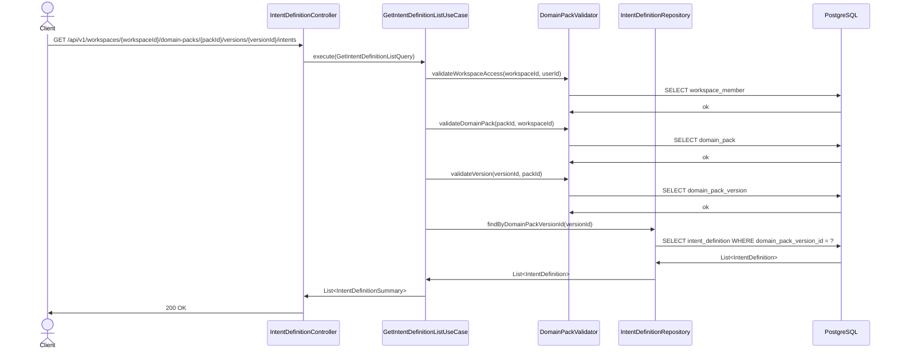
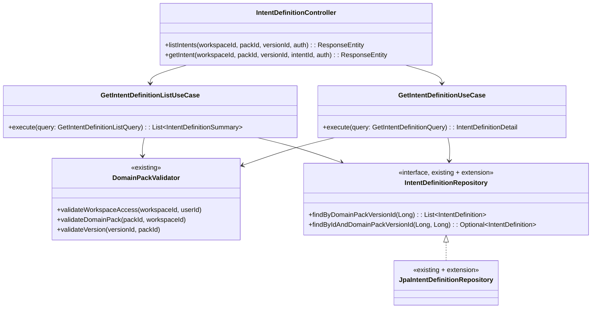

# [BE] Conversation Intent 초안 조회 (219)

## Goal

특정 Domain Pack 버전에 속한 Conversation Intent 초안 목록 및 단건을 조회하는 API를 제공한다.

---

## Sequence Diagram



---

## REST API

### Endpoint

| Method | Path                                                                                                              | Description    |
|--------|-------------------------------------------------------------------------------------------------------------------|----------------|
| GET    | `/api/v1/workspaces/{workspaceId}/domain-packs/{packId}/versions/{versionId}/intents`                             | Intent 목록 조회 |
| GET    | `/api/v1/workspaces/{workspaceId}/domain-packs/{packId}/versions/{versionId}/intents/{intentId}`                  | Intent 단건 조회 |

### Path Variables

| 변수          | 타입 | 설명                         |
|---------------|------|------------------------------|
| workspaceId   | Long | 워크스페이스 ID               |
| packId        | Long | Domain Pack ID                |
| versionId     | Long | Domain Pack Version ID        |
| intentId      | Long | Intent Definition ID (단건만) |

### Request

쿼리 파라미터 없음. JWT Bearer 토큰 필수.

### Response — 목록 조회

**200 OK**

```json
[
  {
    "id": 1,
    "intentCode": "INTENT_001",
    "name": "배송 조회 문의",
    "description": "주문 배송 상태를 확인하려는 고객 의도",
    "taxonomyLevel": 1,
    "parentIntentId": null,
    "status": "ACTIVE",
    "sourceClusterRef": "{\"clusterId\": \"c-001\", \"clusterSize\": 42}",
    "createdAt": "2026-04-10T10:00:00+09:00",
    "updatedAt": "2026-04-10T10:00:00+09:00"
  }
]
```

### Response — 단건 조회

**200 OK**

```json
{
  "id": 1,
  "intentCode": "INTENT_001",
  "name": "배송 조회 문의",
  "description": "주문 배송 상태를 확인하려는 고객 의도",
  "taxonomyLevel": 1,
  "parentIntentId": null,
  "status": "ACTIVE",
  "sourceClusterRef": "{\"clusterId\": \"c-001\", \"clusterSize\": 42}",
  "entryConditionJson": "{\"conditions\": []}",
  "evidenceJson": "[{\"turnId\": \"t-100\", \"text\": \"배송이 어디까지 왔나요?\"}]",
  "metaJson": "{}",
  "createdAt": "2026-04-10T10:00:00+09:00",
  "updatedAt": "2026-04-10T10:00:00+09:00"
}
```

### Error Responses

> `code` 필드는 각 예외의 `ex.getCode()`에서 반환된 값이다 (하드코딩된 문자열이 아님).

**403 Forbidden** — 워크스페이스 접근 권한 없음 (예시)

```json
{ "code": "<ex.getCode()>", "message": "워크스페이스 접근 권한이 없습니다." }
```

**404 Not Found** — packId / versionId / intentId 미존재 (예시)

```json
{ "code": "<ex.getCode()>", "message": "Domain Pack Version을 찾을 수 없습니다. id=99" }
```

---

## Class Design

### DDD Layered Structure



### New Files

| 파일 경로 (presentation layer)                                       | 역할                        |
|----------------------------------------------------------------------|-----------------------------|
| `presentation/IntentDefinitionController.java`                       | GET 목록 + GET 단건 엔드포인트 |

| 파일 경로 (application layer)                                        | 역할                        |
|----------------------------------------------------------------------|-----------------------------|
| `application/GetIntentDefinitionListQuery.java`                      | 목록 조회 Query record      |
| `application/GetIntentDefinitionListUseCase.java`                    | 목록 조회 UseCase           |
| `application/GetIntentDefinitionQuery.java`                          | 단건 조회 Query record      |
| `application/GetIntentDefinitionUseCase.java`                        | 단건 조회 UseCase           |
| `application/IntentDefinitionSummary.java`                           | 목록 응답 record            |
| `application/IntentDefinitionDetail.java`                            | 단건 응답 record            |
| `application/exception/IntentDefinitionNotFoundException.java`       | Intent 단건 조회 실패 예외  |

### Existing Files to Modify

| 파일 경로                                                              | 수정 내용                                                          |
|------------------------------------------------------------------------|--------------------------------------------------------------------|
| `domain/repository/IntentDefinitionRepository.java`                    | `findByIdAndDomainPackVersionId(Long, Long)` 메서드 추가           |
| `infrastructure/persistence/JpaIntentDefinitionRepository.java`        | 동일 메서드 선언 추가 (Spring Data 자동 구현)                       |

### UseCase 구현 예시

```java
@Service
@Transactional(readOnly = true)
public class GetIntentDefinitionListUseCase {

    private final DomainPackValidator validator;
    private final IntentDefinitionRepository intentDefinitionRepository;

    public GetIntentDefinitionListUseCase(
            DomainPackValidator validator,
            IntentDefinitionRepository intentDefinitionRepository) {
        this.validator = validator;
        this.intentDefinitionRepository = intentDefinitionRepository;
    }

    public List<IntentDefinitionSummary> execute(GetIntentDefinitionListQuery query) {
        validator.validateWorkspaceAccess(query.workspaceId(), query.userId());
        validator.validateDomainPack(query.packId(), query.workspaceId());
        validator.validateVersion(query.versionId(), query.packId());

        return intentDefinitionRepository.findByDomainPackVersionId(query.versionId()).stream()
                .map(IntentDefinitionSummary::from)
                .toList();
    }
}
```

```java
@Service
@Transactional(readOnly = true)
public class GetIntentDefinitionUseCase {

    private final DomainPackValidator validator;
    private final IntentDefinitionRepository intentDefinitionRepository;

    public GetIntentDefinitionUseCase(
            DomainPackValidator validator,
            IntentDefinitionRepository intentDefinitionRepository) {
        this.validator = validator;
        this.intentDefinitionRepository = intentDefinitionRepository;
    }

    public IntentDefinitionDetail execute(GetIntentDefinitionQuery query) {
        validator.validateWorkspaceAccess(query.workspaceId(), query.userId());
        validator.validateDomainPack(query.packId(), query.workspaceId());
        validator.validateVersion(query.versionId(), query.packId());

        IntentDefinition intent = intentDefinitionRepository
                .findByIdAndDomainPackVersionId(query.intentId(), query.versionId())
                .orElseThrow(() -> new IntentDefinitionNotFoundException(
                        query.intentId(), query.versionId()));

        return IntentDefinitionDetail.from(intent);
    }
}
```

### Controller 구현 예시

```java
@RestController
@RequestMapping(
    "/api/v1/workspaces/{workspaceId}/domain-packs/{packId}/versions/{versionId}/intents")
public class IntentDefinitionController {

    private final GetIntentDefinitionListUseCase listUseCase;
    private final GetIntentDefinitionUseCase detailUseCase;

    public IntentDefinitionController(
            GetIntentDefinitionListUseCase listUseCase,
            GetIntentDefinitionUseCase detailUseCase) {
        this.listUseCase = listUseCase;
        this.detailUseCase = detailUseCase;
    }

    @GetMapping
    public ResponseEntity<List<IntentDefinitionSummary>> listIntents(
            @PathVariable Long workspaceId,
            @PathVariable Long packId,
            @PathVariable Long versionId,
            Authentication authentication) {
        Long userId = AuthenticationUtils.getUserId(authentication);
        List<IntentDefinitionSummary> result =
                listUseCase.execute(
                        new GetIntentDefinitionListQuery(workspaceId, packId, versionId, userId));
        return ResponseEntity.ok(result);
    }

    @GetMapping("/{intentId}")
    public ResponseEntity<IntentDefinitionDetail> getIntent(
            @PathVariable Long workspaceId,
            @PathVariable Long packId,
            @PathVariable Long versionId,
            @PathVariable Long intentId,
            Authentication authentication) {
        Long userId = AuthenticationUtils.getUserId(authentication);
        IntentDefinitionDetail result =
                detailUseCase.execute(
                        new GetIntentDefinitionQuery(workspaceId, packId, versionId, intentId, userId));
        return ResponseEntity.ok(result);
    }
}
```

### Exception Class

```java
public class IntentDefinitionNotFoundException extends NotFoundException {
  public IntentDefinitionNotFoundException(Long intentId, Long versionId) {
    super("INTENT_DEFINITION_NOT_FOUND",
          "Intent를 찾을 수 없습니다. intentId=" + intentId + ", versionId=" + versionId);
  }
}
```

### Response Records

```java
// 목록용 — JSONB 세부 필드 제외
public record IntentDefinitionSummary(
        Long id,
        String intentCode,
        String name,
        String description,
        Integer taxonomyLevel,
        Long parentIntentId,
        String status,
        String sourceClusterRef,
        OffsetDateTime createdAt,
        OffsetDateTime updatedAt) {

    public static IntentDefinitionSummary from(IntentDefinition entity) {
        return new IntentDefinitionSummary(
                entity.getId(),
                entity.getIntentCode(),
                entity.getName(),
                entity.getDescription(),
                entity.getTaxonomyLevel(),
                entity.getParentIntentId(),
                entity.getStatus(),
                entity.getSourceClusterRef(),
                entity.getCreatedAt(),
                entity.getUpdatedAt());
    }
}

// 단건용 — 전체 JSONB 필드 포함
public record IntentDefinitionDetail(
        Long id,
        String intentCode,
        String name,
        String description,
        Integer taxonomyLevel,
        Long parentIntentId,
        String status,
        String sourceClusterRef,
        String entryConditionJson,
        String evidenceJson,
        String metaJson,
        OffsetDateTime createdAt,
        OffsetDateTime updatedAt) {

    public static IntentDefinitionDetail from(IntentDefinition entity) {
        return new IntentDefinitionDetail(
                entity.getId(),
                entity.getIntentCode(),
                entity.getName(),
                entity.getDescription(),
                entity.getTaxonomyLevel(),
                entity.getParentIntentId(),
                entity.getStatus(),
                entity.getSourceClusterRef(),
                entity.getEntryConditionJson(),
                entity.getEvidenceJson(),
                entity.getMetaJson(),
                entity.getCreatedAt(),
                entity.getUpdatedAt());
    }
}
```

---

## Tests

### Unit Tests

```java
@DisplayName("GetIntentDefinitionListUseCase")
class GetIntentDefinitionListUseCaseTest {

    @Test
    @DisplayName("유효한 query로 intent 목록을 반환한다")
    void execute_withValidQuery_returnsIntentList() {
        // given
        var query = new GetIntentDefinitionListQuery(1L, 10L, 100L, 99L);
        var intent = IntentDefinitionFixture.active(100L, "INTENT_001");
        willDoNothing().given(validator).validateVersion(100L, 10L);
        given(repository.findByDomainPackVersionId(100L)).willReturn(List.of(intent));

        // when
        var result = useCase.execute(query);

        // then
        assertThat(result).hasSize(1);
        assertThat(result.get(0).intentCode()).isEqualTo("INTENT_001");
    }
}

@DisplayName("GetIntentDefinitionUseCase")
class GetIntentDefinitionUseCaseTest {

    @Test
    @DisplayName("존재하지 않는 intentId로 조회하면 NotFoundException을 던진다")
    void execute_withUnknownIntentId_throwsNotFoundException() {
        // given
        var query = new GetIntentDefinitionQuery(1L, 10L, 100L, 999L, 99L);
        given(repository.findByIdAndDomainPackVersionId(999L, 100L)).willReturn(Optional.empty());

        // then
        assertThatThrownBy(() -> useCase.execute(query))
                .isInstanceOf(NotFoundException.class);
    }
}
```

### Integration Tests

```java
@SpringBootTest
@AutoConfigureMockMvc
@DisplayName("IntentDefinitionController")
class IntentDefinitionControllerTest {

    @Test
    @DisplayName("GET /intents - 목록 반환")
    void listIntents_returnsOk() throws Exception {
        mockMvc.perform(get("/api/v1/workspaces/1/domain-packs/10/versions/100/intents")
                .header("Authorization", "Bearer " + validToken))
            .andExpect(status().isOk())
            .andExpect(jsonPath("$").isArray());
    }

    @Test
    @DisplayName("GET /intents/{intentId} - 존재하지 않는 ID 404 반환")
    void getIntent_notFound_returns404() throws Exception {
        mockMvc.perform(get("/api/v1/workspaces/1/domain-packs/10/versions/100/intents/9999")
                .header("Authorization", "Bearer " + validToken))
            .andExpect(status().isNotFound());
    }
}
```

### Test Checklist

- [ ] 정상 시나리오: 유효한 versionId로 목록 반환
- [ ] 정상 시나리오: 유효한 intentId로 단건 반환
- [ ] 권한 오류: 워크스페이스 미소속 userId → 403
- [ ] 404 오류: 존재하지 않는 packId → 404
- [ ] 404 오류: 존재하지 않는 versionId → 404
- [ ] 404 오류: 존재하지 않는 intentId → 404
- [ ] 빈 목록: versionId에 intent가 없으면 빈 배열 반환
- [ ] intent가 다른 versionId 소속일 때 단건 조회 → 404

---

## Database

신규 마이그레이션 없음. `pack.intent_definition` 테이블 기존 존재.

**근거**: `backend/src/main/resources/db/changelog/db.changelog-master.sql:143–161`

---

## Additional Notes

- `DomainPackValidator` (기존)의 3단계 검증 체인을 그대로 재사용한다: `validateWorkspaceAccess` → `validateDomainPack` → `validateVersion`
- `findByIdAndDomainPackVersionId` 추가로 intentId가 해당 versionId 소속인지 DB 수준에서 보장한다
- JSONB 필드(`entryConditionJson`, `evidenceJson`, `metaJson`)는 문자열 그대로 직렬화한다 (파싱하지 않음)
- 페이지네이션 없음 (YAGNI). 필요 시 별도 백로그로 추가한다
- 응답 형식: flat list + parentIntentId 참조 (tree 변환은 FE 책임)
