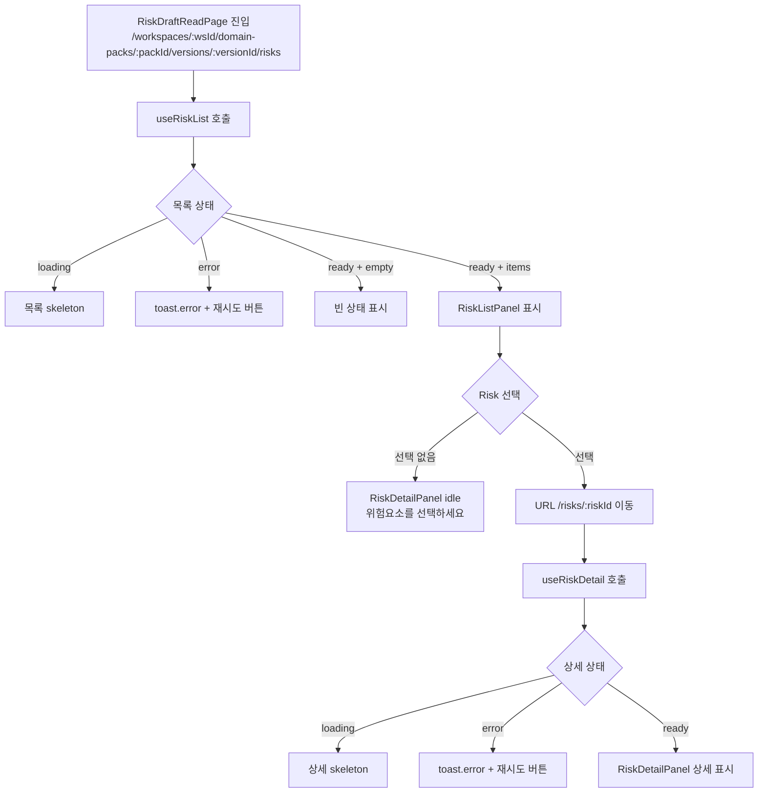

# Spec 2210 — [FE] Risk Factor 초안 조회

**Branch**: `spec/2210`
**Canonical Number**: `2210`
**Type**: Frontend (FSD)
**작성일**: 2026-04-28

---

## Goal

운영자가 Domain Pack Version에 속한 Risk Factor 초안 목록과 단건 상세를 조회하는 읽기 전용 2-pane 화면을 구현한다.

---

## Scope Decision

### 2210은 Risk Factor 초안 조회만 담당한다

이 스펙은 `risk_definition`의 목록/상세 데이터를 화면에 표시하는 책임만 가진다. Risk 일반 필드 수정과 status 수정은 `323.md`에서 별도로 다룬다.

이 결정의 기준:
- Risk Factor 초안 조회는 `3213.md` 목록 GET API와 `2213.md` 단건 GET API를 사용하는 read-only 화면이다.
- 수정 기능은 `328.md` PATCH API와 form validation, optimistic update, rollback을 포함하므로 조회 화면과 책임을 분리한다.
- `RiskDraftReadPage`, `RiskListPanel`, `RiskDetailPanel`은 이 스펙 범위다.
- `RiskEditPanel`, `RiskEditForm`, `RiskStatusToggle`은 `323.md` 범위다.

---

## User Flow Chart



---

## Design Diff

### As-is vs To-be

| 영역 | As-is | To-be | 변경 내용 |
|------|-------|-------|----------|
| Risk FE 조회 화면 | 없음 | `RiskDraftReadPage` | 신규 라우트와 2-pane 목록/상세 화면 추가 |
| Risk 목록 조회 | BE GET API만 존재 | `riskApi.list` + `useRiskList` | 3213 API를 FE에서 사용 |
| Risk 단건 조회 | BE GET API만 존재 | `riskApi.detail` + `useRiskDetail` | 2213 API를 FE에서 사용 |
| Risk 수정 | 이 스펙 범위 아님 | 323에서 처리 | 조회 화면에는 수정 form을 넣지 않음 |

---

## Prerequisites

### BE API

| Source | Method | Path | Description |
|--------|--------|------|-------------|
| 3213 | GET | `/api/v1/workspaces/{workspaceId}/domain-packs/{packId}/versions/{versionId}/risks` | Risk Factor 목록 조회 |
| 2213 | GET | `/api/v1/workspaces/{workspaceId}/domain-packs/{packId}/versions/{versionId}/risks/{riskId}` | Risk Factor 단건 조회 |

`frontend/src/shared/api/index.ts`의 `apiClient`는 기본 base URL이 `/api/v1`이므로 FE API 함수에서는 `/workspaces/...`부터 path를 작성한다.

### Existing FE Patterns

구현 시 아래 기존 파일의 패턴을 따른다.

| Existing file | 재사용 기준 |
|---------------|------------|
| `frontend/src/pages/domain-pack/ui/PolicyDraftReadPage.tsx` | 목록/상세 2-pane 라우팅 구조 |
| `frontend/src/features/policy-draft-read/ui/PolicyListPanel.tsx` | 목록 loading/error/empty/ready 상태 |
| `frontend/src/features/policy-draft-read/ui/PolicyDetailPanel.tsx` | 상세 idle/loading/error/ready 상태 |
| `frontend/src/features/policy-draft-read/model/usePolicyList.ts` | TanStack Query 기반 목록 조회 hook |
| `frontend/src/features/policy-draft-read/model/usePolicyDetail.ts` | TanStack Query 기반 상세 조회 hook |
| `frontend/src/features/slot-draft-read/ui/SlotDetailPanel.tsx` | JSON 카드 표시 방식 참고 |

---

## Component Tree

```text
App
└── Route /workspaces/:workspaceId/domain-packs/:packId/versions/:versionId/risks/:riskId?
    └── RiskDraftReadPage
        ├── DashboardLayout
        ├── PageHeader
        ├── BackButton (mobile/detail 선택 상태)
        └── twoPane
            ├── RiskListPanel
            │   ├── loading skeleton
            │   ├── error + retry
            │   ├── empty state
            │   └── RiskListRow[]
            └── RiskDetailPanel
                ├── idle placeholder
                ├── loading skeleton
                ├── error + retry
                └── ready
                    ├── DetailHeader
                    ├── InfoCard grid
                    └── JsonCard(triggerCondition/handlingAction/evidence/meta)
```

---

## API Integration

### Query Key Pattern

```typescript
// frontend/src/entities/risk/api/index.ts
export const riskKeys = {
  all: ["risks"] as const,
  lists: () => [...riskKeys.all, "list"] as const,
  list: (workspaceId: number, packId: number, versionId: number) =>
    [...riskKeys.lists(), workspaceId, packId, versionId] as const,
  detail: (workspaceId: number, packId: number, versionId: number, riskId: number) =>
    [...riskKeys.all, "detail", workspaceId, packId, versionId, riskId] as const,
};
```

### Types

```typescript
// frontend/src/entities/risk/model/types.ts
export type RiskStatus = "ACTIVE" | "INACTIVE";
export type RiskLevel = "LOW" | "MEDIUM" | "HIGH" | "CRITICAL";

export interface RiskSummary {
  id: number;
  domainPackVersionId: number;
  riskCode: string;
  name: string;
  description: string | null;
  riskLevel: RiskLevel;
  status: RiskStatus;
  createdAt: string;
  updatedAt: string;
}

export interface RiskDefinition extends RiskSummary {
  triggerConditionJson: string;
  handlingActionJson: string;
  evidenceJson: string;
  metaJson: string;
}
```

### API Functions

```typescript
const basePath = (workspaceId: number, packId: number, versionId: number) =>
  `/workspaces/${workspaceId}/domain-packs/${packId}/versions/${versionId}/risks`;

export const riskApi = {
  list: (workspaceId: number, packId: number, versionId: number) =>
    apiClient.get<RiskSummary[]>(basePath(workspaceId, packId, versionId)),

  detail: (workspaceId: number, packId: number, versionId: number, riskId: number) =>
    apiClient.get<RiskDefinition>(`${basePath(workspaceId, packId, versionId)}/${riskId}`),
};
```

### Error Messages

```typescript
export const RISK_READ_ERROR_MESSAGES = {
  NOT_FOUND: "위험요소를 찾을 수 없습니다.",
  LOAD_LIST_FAILED: "위험요소 목록을 불러오지 못했습니다.",
  LOAD_DETAIL_FAILED: "위험요소 상세 정보를 불러오지 못했습니다.",
} as const;
```

---

## Data Flow

```text
RiskDraftReadPage
    │ parseRouteId(workspaceId, packId, versionId, riskId?)
    ├── RiskListPanel
    │     useRiskList(wsId, packId, versionId, retryKey)
    │     └── riskApi.list → riskKeys.list
    └── RiskDetailPanel
          useRiskDetail(wsId, packId, versionId, riskId, retryKey)
          ├── idle/loading/error/ready
          └── JsonCard(triggerConditionJson, handlingActionJson, evidenceJson, metaJson)
```

---

## 수정 대상 파일

> 경로 기준: 아래 모든 경로는 repository root 기준이다.

### 신규 생성 예정

| 파일 | 설명 |
|------|------|
| `frontend/src/entities/risk/model/types.ts` | `RiskSummary`, `RiskDefinition`, status/level 타입 |
| `frontend/src/entities/risk/api/index.ts` | `riskKeys`, `riskApi.list`, `riskApi.detail` |
| `frontend/src/entities/risk/index.ts` | entity barrel export |
| `frontend/src/features/risk-draft-read/model/mapApiError.ts` | list/detail 조회 에러 매핑 |
| `frontend/src/features/risk-draft-read/model/useRiskList.ts` | Risk 목록 조회 hook |
| `frontend/src/features/risk-draft-read/model/useRiskDetail.ts` | Risk 단건 조회 hook |
| `frontend/src/features/risk-draft-read/ui/RiskListPanel.tsx` | 목록 패널 |
| `frontend/src/features/risk-draft-read/ui/RiskListPanel.module.css` | 목록 패널 스타일 |
| `frontend/src/features/risk-draft-read/ui/RiskDetailPanel.tsx` | 상세 패널 |
| `frontend/src/features/risk-draft-read/ui/RiskDetailPanel.module.css` | 상세 패널 스타일 |
| `frontend/src/features/risk-draft-read/ui/index.ts` | UI barrel export |
| `frontend/src/pages/domain-pack/ui/RiskDraftReadPage.tsx` | Risk 목록/상세 페이지 |
| `frontend/src/pages/domain-pack/ui/risk-draft-read-page.module.css` | 페이지 스타일 |

### 수정 예정

| 파일 | 변경 내용 |
|------|----------|
| `frontend/src/app/App.tsx` | `/workspaces/:workspaceId/domain-packs/:packId/versions/:versionId/risks/:riskId?` 라우트 추가 |

### 테스트 신규 생성 예정

| 파일 | 설명 |
|------|------|
| `frontend/src/entities/risk/api/index.test.ts` | `riskApi` path/query key 테스트 |
| `frontend/src/features/risk-draft-read/model/mapApiError.test.ts` | 조회 에러 매핑 테스트 |
| `frontend/src/features/risk-draft-read/model/useRiskList.test.ts` | 목록 hook 상태 테스트 |
| `frontend/src/features/risk-draft-read/model/useRiskDetail.test.ts` | 상세 hook 상태 테스트 |
| `frontend/src/features/risk-draft-read/ui/RiskListPanel.test.tsx` | 목록 패널 상태 렌더링 테스트 |
| `frontend/src/features/risk-draft-read/ui/RiskDetailPanel.test.tsx` | 상세 패널 상태 렌더링 테스트 |
| `frontend/src/pages/domain-pack/ui/RiskDraftReadPage.test.tsx` | route param/page 전환 테스트 |

---

## State Management

### Server State

TanStack Query를 사용한다.

- `riskKeys.list(workspaceId, packId, versionId)`로 목록 캐시를 관리한다.
- `riskKeys.detail(workspaceId, packId, versionId, riskId)`로 단건 캐시를 관리한다.
- 재시도 버튼은 `retryKey` 변경 또는 `query.refetch()`로 처리한다.
- `riskId = null`이면 상세 hook은 API 호출 없이 `{ status: "idle" }`을 반환한다.

### Client State

- `riskId`: URL path param으로만 관리한다.
- `handleSelect(id)`: `/workspaces/${wsId}/domain-packs/${pId}/versions/${vId}/risks/${id}`로 이동한다.
- `handleBack()`: `/workspaces/${wsId}/domain-packs/${pId}/versions/${vId}/risks`로 이동한다.
- 별도 Zustand store는 만들지 않는다.

---

## Design Constraints

`frontend/DESIGN.md`를 따른다.

- 색상은 기존 Domain Pack 구성요소 화면처럼 모노크롬 기반으로 유지한다.
- 버튼/입력/Badge는 `shared/ui` 컴포넌트를 우선 사용한다.
- focus outline은 dashed 패턴을 유지한다.
- 페이지 레이아웃은 Policy/Slot draft read 화면의 2-pane 구조와 반응형 동작을 따른다.
- `alert()`는 사용하지 않고 `sonner` toast를 사용한다.
- 카드 중첩을 만들지 않고, 상세 정보 카드는 반복 정보 표시 단위에만 사용한다.
- 긴 JSON 문자열은 `pre` 내부에서 줄바꿈 처리해 모바일/데스크톱 모두 overflow를 제어한다.

---

## Tests

### Test Strategy

| 구분 | 방법 | 도구 | 비고 |
|------|------|------|------|
| 단위 테스트 | API path/query key 테스트 | Vitest | `riskApi`, `riskKeys` |
| 단위 테스트 | hook 상태 테스트 | Vitest + Testing Library | `useRiskList`, `useRiskDetail` |
| 컴포넌트 테스트 | list/detail 상태 렌더링 | Vitest + mock | loading/error/empty/ready |
| 수동 테스트 | 브라우저 직접 확인 | `pnpm dev` | 실제 BE와 연동 |

### Test Scenarios

#### Happy Path

| # | 시나리오 | 사전 조건 | 조작 | 기대 결과 |
|---|---------|---------|------|----------|
| 1 | Risk 목록 조회 | DRAFT version에 risk 2개 이상 | `/risks` 진입 | riskCode ASC 목록 표시 |
| 2 | Risk 상세 조회 | risk 존재 | 목록 row 클릭 | URL에 riskId 반영, 상세 표시 |
| 3 | 목록으로 돌아가기 | 상세 선택 상태 | `← 목록` 클릭 | riskId 제거, 상세 idle 복귀 |
| 4 | 빈 목록 | risk 0개인 version | `/risks` 진입 | 빈 상태 표시 |

#### Error & Edge Cases

| # | 시나리오 | 조작 | 기대 결과 |
|---|---------|------|----------|
| 1 | riskId 미존재 | URL 직접 진입 | 404 toast + 상세 error state |
| 2 | 목록 조회 실패 | 네트워크/API 실패 | toast + 재시도 버튼 |
| 3 | 상세 조회 실패 | risk row 클릭 후 API 실패 | toast + 재시도 버튼 |
| 4 | 잘못된 URL 파라미터 | `/workspaces/abc/...` | "잘못된 URL 파라미터입니다." 표시 |

#### 접근성

| # | 확인 항목 | 기대 결과 |
|---|---------|----------|
| 1 | 목록 row 키보드 선택 | Tab 이동 후 Enter/Space로 선택 |
| 2 | 선택 row 상태 | `aria-pressed` 또는 현재 선택 상태가 전달됨 |
| 3 | JSON 카드 label | 각 JSON 영역의 label이 노출됨 |
| 4 | Focus outline | dashed outline 표시 |

---

## Done Criteria

- [ ] `entities/risk` 타입/API/query key 추가
- [ ] `RiskDraftReadPage` 라우트 추가 및 잘못된 URL 파라미터 처리
- [ ] `RiskListPanel` loading/error/empty/ready 상태 구현
- [ ] `RiskDetailPanel` idle/loading/error/ready 상태 구현
- [ ] 목록 row 선택 시 URL에 `riskId` 반영
- [ ] 상세 화면에서 JSON 필드 4종 표시
- [ ] 조회 실패 시 toast와 재시도 버튼 제공
- [ ] `alert()` 미사용, `sonner` toast 사용
- [ ] FSD 의존성 방향 준수: `pages → features → entities → shared`
- [ ] `frontend/DESIGN.md` 준수
- [ ] `pnpm test` 통과
- [ ] `pnpm lint` 통과

---

## Out of Scope

- Risk Factor 생성/삭제 기능
- Risk Factor 일반 필드 수정
- Risk Factor status 수정
- `riskCode` 수정 기능
- Risk와 Policy/Workflow 간 바인딩 설계
- Domain Pack 구성요소 통합 탭 화면
