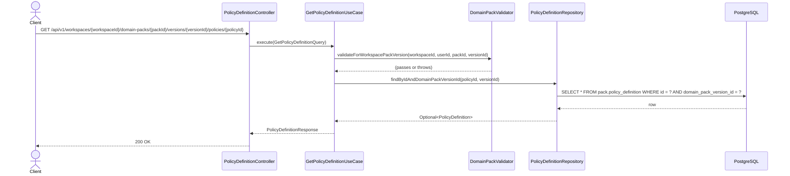

# [BE] 2.2.11 — Policy / Rule 초안 단건 조회

## Goal

특정 Domain Pack Version에 속한 Policy 초안 단건을 조회하는 READ 전용 엔드포인트를 제공한다.

---

## Sequence Diagram



---

## REST API

### Endpoint

| Method | Path | Description |
|--------|------|-------------|
| GET | `/api/v1/workspaces/{workspaceId}/domain-packs/{packId}/versions/{versionId}/policies/{policyId}` | Policy 초안 단건 조회 |

### Request

Path variables:
- `workspaceId`: Long
- `packId`: Long
- `versionId`: Long
- `policyId`: Long

Headers:
- `Authorization: Bearer {jwt-token}` (필수)

### Response

**200 OK**

```json
{
  "id": 1,
  "domainPackVersionId": 10,
  "policyCode": "POL_RETURN",
  "name": "반품 처리 정책",
  "description": "7일 이내 반품 허용",
  "severity": "HIGH",
  "conditionJson": {},
  "actionJson": {},
  "evidenceJson": [],
  "metaJson": {},
  "status": "ACTIVE",
  "createdAt": "2025-04-03T10:00:00Z",
  "updatedAt": "2025-04-03T10:00:00Z"
}
```

**401 Unauthorized**

```json
{ "code": "UNAUTHORIZED", "message": "인증이 필요합니다." }
```

**403 Forbidden**

```json
{ "code": "FORBIDDEN", "message": "접근 권한이 없습니다." }
```

**404 Not Found — policy not found**

```json
{ "code": "POLICY_DEFINITION_NOT_FOUND", "message": "PolicyDefinition not found: {policyId}" }
```

**404 Not Found — workspace / pack / version not found**

```json
{ "code": "NOT_FOUND", "message": "..." }
```

---

## Class Design

### 신규 생성 파일

| 파일 | 경로 | 역할 |
|------|------|------|
| `GetPolicyDefinitionQuery.java` | `application/` | UseCase 입력 record |
| `GetPolicyDefinitionUseCase.java` | `application/` | 단건 조회 UseCase |
| `PolicyDefinitionNotFoundException.java` | `application/exception/` | 404 예외 |
| `PolicyDefinitionController.java` | `presentation/` | GET 핸들러 |

### 수정 파일

| 파일 | 변경 내용 |
|------|-----------|
| `PolicyDefinitionRepository.java` | `findByIdAndDomainPackVersionId(Long id, Long domainPackVersionId)` 메서드 추가 |
| `JpaPolicyDefinitionRepository.java` | 동일 메서드 선언 추가 (Spring Data JPA 이름 기반 자동 구현) |

### Pseudo-code

```java
// GetPolicyDefinitionQuery.java
record GetPolicyDefinitionQuery(
    Long workspaceId, Long packId, Long versionId, Long policyId, Long userId)

// PolicyDefinitionNotFoundException.java
class PolicyDefinitionNotFoundException extends NotFoundException {
    PolicyDefinitionNotFoundException(Long policyId) {
        super("POLICY_DEFINITION_NOT_FOUND", "PolicyDefinition not found: " + policyId)
    }
}

// GetPolicyDefinitionUseCase.java
@Service
@Transactional(readOnly = true)
class GetPolicyDefinitionUseCase {
    execute(GetPolicyDefinitionQuery query) {
        validator.validateForWorkspacePackVersion(
            query.workspaceId(), query.userId(), query.packId(), query.versionId())
        return policyDefinitionRepository
            .findByIdAndDomainPackVersionId(query.policyId(), query.versionId())
            .map(PolicyDefinitionResponse::from)
            .orElseThrow(() -> new PolicyDefinitionNotFoundException(query.policyId()))
    }
}

// PolicyDefinitionController.java
@RestController
@RequestMapping("/api/v1/workspaces/{workspaceId}/domain-packs/{packId}/versions/{versionId}/policies")
class PolicyDefinitionController {
    @GetMapping("/{policyId}")
    getPolicy(@PathVariable Long workspaceId, @PathVariable Long packId,
              @PathVariable Long versionId, @PathVariable Long policyId,
              @AuthenticationPrincipal Long userId) {
        return ResponseEntity.ok(
            useCase.execute(new GetPolicyDefinitionQuery(workspaceId, packId, versionId, policyId, userId)))
    }
}
```

---

## Tests

### UseCase 테스트: `GetPolicyDefinitionUseCaseTest.java`

참조: `GetSlotDefinitionUseCaseTest.java` 패턴 동일 적용

- `@ExtendWith(MockitoExtension.class)` + `@DisplayName`

| 시나리오 | 예상 결과 |
|----------|-----------|
| 정상 조회 | `PolicyDefinitionResponse` 반환 |
| policyId 미존재 | `PolicyDefinitionNotFoundException` |
| 다른 version 소속 policy | `PolicyDefinitionNotFoundException` |
| workspace 미존재 | `WorkspaceNotFoundException` (validator 위임) |
| 권한 없음 | `UnauthorizedException` (validator 위임) |
| pack 소속 불일치 | `DomainPackNotFoundException` (validator 위임) |

### Controller 테스트: `PolicyDefinitionControllerTest.java`

- `@WebMvcTest(PolicyDefinitionController.class)` + JwtAuthenticationFilter exclude
- `@WithLongPrincipal(10L)` fixture 사용 (패키지: `com.init.fixtures`)

| 시나리오 | 예상 결과 |
|----------|-----------|
| 단건 정상 조회 | 200, response body 전체 필드 검증 |
| 단건 미존재 | 404, code `POLICY_DEFINITION_NOT_FOUND` |
| 권한 없음 | 403 |
| 인증 없음 | 401 |
| version 미존재 | 404 |

---

## Database

신규 DDL 없음.

`pack.policy_definition` 테이블 및 인덱스 이미 존재 (`.agent/docs/schema.md:480–495, 848`).

---

## Additional Notes

- 구현은 `GetSlotDefinitionUseCase` + `SlotDefinitionController` 패턴을 그대로 따른다.
- `DomainPackValidator.validateForWorkspacePackVersion(workspaceId, userId, packId, versionId)`가 4단계 공통 검증 진입점이다.
- `PolicyDefinitionRepository.findByIdAndDomainPackVersionId` 추가 시 JPA 메서드 이름 자동 구현을 활용한다.
- `PolicyDefinitionResponse.from(PolicyDefinition)` 팩토리 메서드가 이미 존재하므로 신규 작성 불필요.
