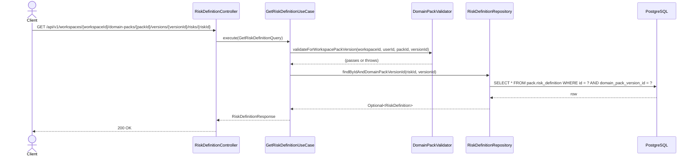

# [BE] 2.2.13 — Risk Factor 초안 단건 조회

## Goal

특정 Domain Pack Version에 속한 Risk Factor 초안 단건을 조회하는 READ 전용 엔드포인트를 제공한다.

---

## Sequence Diagram



---

## REST API

### Endpoint

| Method | Path | Description |
|--------|------|-------------|
| GET | `/api/v1/workspaces/{workspaceId}/domain-packs/{packId}/versions/{versionId}/risks/{riskId}` | Risk Factor 초안 단건 조회 |

### Request

Path variables:
- `workspaceId`: Long
- `packId`: Long
- `versionId`: Long
- `riskId`: Long

Headers:
- `Authorization: Bearer {jwt-token}` (필수)

### Response

**200 OK**

```json
{
  "id": 1,
  "domainPackVersionId": 10,
  "riskCode": "RISK_FRAUD",
  "name": "사기 거래 위험",
  "description": "비정상적인 결제 패턴 감지 시 차단",
  "riskLevel": "HIGH",
  "triggerConditionJson": {},
  "handlingActionJson": {},
  "evidenceJson": [],
  "metaJson": {},
  "status": "ACTIVE",
  "createdAt": "2025-04-03T10:00:00Z",
  "updatedAt": "2025-04-03T10:00:00Z"
}
```

**401 Unauthorized**

```json
{ "code": "UNAUTHORIZED", "message": "인증이 필요합니다." }
```

**403 Forbidden**

```json
{ "code": "FORBIDDEN", "message": "접근 권한이 없습니다." }
```

**404 Not Found — risk not found**

```json
{ "code": "RISK_DEFINITION_NOT_FOUND", "message": "RiskDefinition not found: {riskId}" }
```

**404 Not Found — workspace not found**

```json
{ "code": "DOMAIN_PACK_WORKSPACE_NOT_FOUND", "message": "..." }
```

**404 Not Found — pack not found**

```json
{ "code": "DOMAIN_PACK_NOT_FOUND", "message": "DomainPack not found: {packId}" }
```

**404 Not Found — version not found**

```json
{ "code": "DOMAIN_PACK_VERSION_NOT_FOUND", "message": "도메인 팩 버전을 찾을 수 없습니다. id={versionId}" }
```

---

## Class Design

### 신규 생성 파일

| 파일 | 경로 | 역할 |
|------|------|------|
| `GetRiskDefinitionQuery.java` | `application/` | UseCase 입력 record |
| `GetRiskDefinitionUseCase.java` | `application/` | 단건 조회 UseCase |
| `RiskDefinitionNotFoundException.java` | `application/exception/` | 404 예외 |
| `RiskDefinitionController.java` | `presentation/` | GET 핸들러 |

### 수정 파일

| 파일 | 변경 내용 |
|------|-----------|
| `RiskDefinitionRepository.java` | `findByIdAndDomainPackVersionId(Long id, Long domainPackVersionId)` 메서드 추가 |
| `JpaRiskDefinitionRepository.java` | 동일 메서드 선언 추가 (Spring Data JPA 이름 기반 자동 구현) |

### Pseudo-code

```java
// GetRiskDefinitionQuery.java
record GetRiskDefinitionQuery(
    Long workspaceId, Long packId, Long versionId, Long riskId, Long userId)

// RiskDefinitionNotFoundException.java
class RiskDefinitionNotFoundException extends NotFoundException {
    RiskDefinitionNotFoundException(Long riskId) {
        super("RISK_DEFINITION_NOT_FOUND", "RiskDefinition not found: " + riskId)
    }
}

// GetRiskDefinitionUseCase.java
@Service
@Transactional(readOnly = true)
class GetRiskDefinitionUseCase {
    execute(GetRiskDefinitionQuery query) {
        validator.validateForWorkspacePackVersion(
            query.workspaceId(), query.userId(), query.packId(), query.versionId())
        return riskDefinitionRepository
            .findByIdAndDomainPackVersionId(query.riskId(), query.versionId())
            .map(RiskDefinitionResponse::from)
            .orElseThrow(() -> new RiskDefinitionNotFoundException(query.riskId()))
    }
}

// RiskDefinitionController.java
@RestController
@RequestMapping("/api/v1/workspaces/{workspaceId}/domain-packs/{packId}/versions/{versionId}/risks")
class RiskDefinitionController {
    @GetMapping("/{riskId}")
    getRisk(@PathVariable Long workspaceId, @PathVariable Long packId,
            @PathVariable Long versionId, @PathVariable Long riskId,
            Authentication authentication) {
        Long userId = AuthenticationUtils.getUserId(authentication)
        return ResponseEntity.ok(
            useCase.execute(new GetRiskDefinitionQuery(workspaceId, packId, versionId, riskId, userId)))
    }
}
```

---

## Tests

### UseCase 테스트: `GetRiskDefinitionUseCaseTest.java`

참조: `GetPolicyDefinitionUseCaseTest.java` 패턴 동일 적용

- `@ExtendWith(MockitoExtension.class)` + `@DisplayName`

| 시나리오 | 예상 결과 |
|----------|-----------|
| 정상 조회 | `RiskDefinitionResponse` 반환 |
| riskId 미존재 | `RiskDefinitionNotFoundException` |
| 다른 version 소속 risk | `RiskDefinitionNotFoundException` |
| workspace 미존재 | `WorkspaceNotFoundException` (validator 위임) |
| 권한 없음 | `UnauthorizedException` (validator 위임) |
| pack 소속 불일치 | `DomainPackNotFoundException` (validator 위임) |

### Controller 테스트: `RiskDefinitionControllerTest.java`

- `@WebMvcTest(RiskDefinitionController.class)` + JwtAuthenticationFilter exclude
- `@WithLongPrincipal(10L)` fixture 사용 (패키지: `com.init.fixtures`)

| 시나리오 | 예상 결과 |
|----------|-----------|
| 단건 정상 조회 | 200, response body 전체 필드 검증 |
| 단건 미존재 | 404, code `RISK_DEFINITION_NOT_FOUND` |
| 권한 없음 | 403 |
| 인증 없음 | 401 |
| version 미존재 | 404 |

---

## Database

신규 DDL 없음.

`pack.risk_definition` 테이블 및 인덱스 이미 존재 (`.agent/docs/schema.md:497–514, 852`).

---

## Additional Notes

- 구현은 `GetPolicyDefinitionUseCase` + `PolicyDefinitionController` 패턴을 그대로 따른다.
- `DomainPackValidator.validateForWorkspacePackVersion(workspaceId, userId, packId, versionId)`가 4단계 공통 검증 진입점이다.
- `RiskDefinitionRepository.findByIdAndDomainPackVersionId` 추가 시 JPA 메서드 이름 자동 구현을 활용한다.
- `RiskDefinitionResponse.from(RiskDefinition)` 팩토리 메서드가 이미 존재하므로 신규 작성 불필요.
- `UpdateRiskController`, `UpdateRiskStatusController`는 이미 `/risks/{riskId}` 경로에 `@PatchMapping`/`@PatchMapping("/status")`로 등록되어 있다. `RiskDefinitionController`는 `/risks` 기준 새 `@RestController`로 분리한다.
