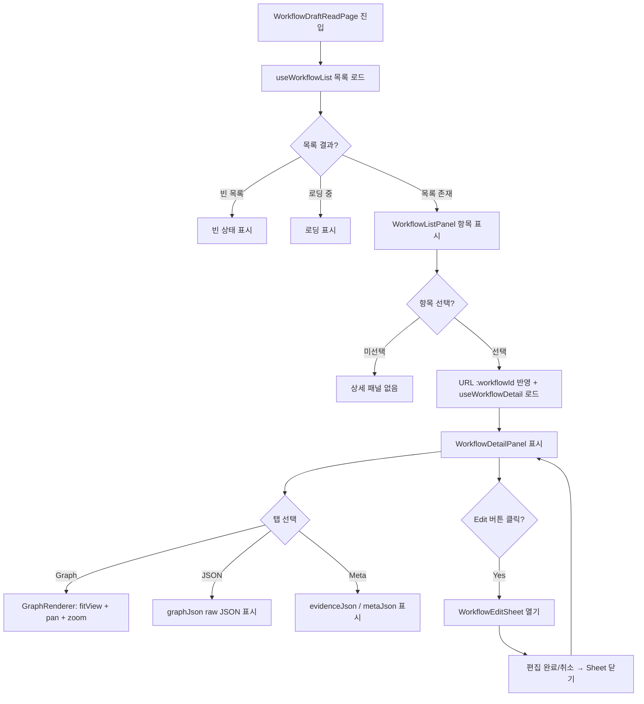

# [FE] 2.2.14 — Workflow 초안 조회 화면

## Goal

Workflow 초안 목록을 2-panel 레이아웃(목록 좌/상세 우)으로 조회한다. 상세 패널은 Graph(pan+zoom 탐색 가능) / JSON / Meta 탭을 제공하며, Edit 버튼을 통해 `WorkflowEditSheet`(`update-workflow` feature)를 열어 편집 흐름으로 진입한다.

---

## User Flow Chart



---

## Design Diff

### As-is vs To-be

| 영역 | As-is | To-be | 변경 내용 |
|------|-------|-------|----------|
| 데이터 fetching | `useState + useEffect` 수동 구현 | TanStack Query `useQuery` | 캐싱·재시도·로딩 상태 자동화 |
| Graph 탐색 | `fitView` 전용 (pan/zoom 없음) | `fitView + panOnDrag + zoomOnScroll` | 그래프 탐색 UX 개선 |
| Edit 진입점 | 미명시 | 상세 패널 Edit 버튼 → `WorkflowEditSheet` | `update-workflow` feature 연결 명시 |
| FSD cross-slice | 미명시 | `WorkflowDetailPanel`은 `onEdit` emit, page 레이어에서 Sheet 조합 | FSD 규칙 준수 |

---

## Component Tree

```
WorkflowDraftReadPage                          (pages)
├─ WorkflowListPanel                           (workflow-draft-read feature)
│    ├─ loading / error / empty state
│    └─ WorkflowSummary[] 항목
│         └─ 클릭 → URL :workflowId 반영
└─ WorkflowDetailPanel                         (workflow-draft-read feature)
     ├─ loading / error state
     ├─ Edit 버튼  ──onEdit 콜백 emit──►  WorkflowEditSheet  (update-workflow feature, page 레이어 조합)
     ├─ TabBar: "graph" | "json" | "meta"
     ├─ [Graph 탭]
     │    └─ GraphRenderer
     │         └─ ReactFlow
     │              ├─ fitView=true
     │              ├─ panOnDrag=true
     │              ├─ zoomOnScroll=true
     │              ├─ nodesDraggable=false
     │              ├─ nodesConnectable=false
     │              └─ 6 custom node types
     │                   ├─ StartNode
     │                   ├─ ActionNode
     │                   ├─ DecisionNode
     │                   ├─ AnswerNode
     │                   ├─ HandoffNode
     │                   └─ TerminalNode
     ├─ [JSON 탭]
     │    └─ graphJson raw JSON 표시 (읽기 전용)
     └─ [Meta 탭]
          └─ evidenceJson / metaJson 표시 (읽기 전용)
```

> FSD 규칙: `WorkflowDetailPanel`(features 레이어)이 `WorkflowEditSheet`(다른 feature)를 직접 import하면 cross-slice 위반이다. `WorkflowDraftReadPage`(pages 레이어)에서 두 feature를 조합하고, `WorkflowDetailPanel`은 `onEdit?: () => void` 콜백만 emit한다.

---

## API Integration

### Endpoints

| Method | Path | Hook | 비고 |
|--------|------|------|------|
| GET | `/api/v1/workspaces/{wsId}/domain-packs/{packId}/versions/{versionId}/workflows` | `useWorkflowList` | TanStack Query, 반환: `WorkflowSummary[]` |
| GET | `/api/v1/workspaces/{wsId}/domain-packs/{packId}/versions/{versionId}/workflows/{workflowId}` | `useWorkflowDetail` | TanStack Query, 반환: `WorkflowDetail` (graphJson: WorkflowGraph) |

**Orval hook 미사용 이유**: springdoc-openapi가 `@JsonRawValue` 필드를 `String`으로 인식해 Orval Zod 스키마를 `zod.string()`으로 생성하지만, 실제 HTTP 응답에서 `graphJson`은 JSON object다. 수동 apiClient(`workflowApi.ts`)는 이를 `WorkflowGraph` 타입으로 정확히 수신하므로 Orval hook 없이 타입 안전성을 유지한다.

Transitions API(`useListTransitions`, `useGetTransition`)는 이 스펙 범위 밖이다.

### Query Key Pattern

```typescript
// entities/workflow/api/index.ts
// 기존 workflowKeys 삭제 후 아래로 교체. 파일 내 workflowKeys 참조처 일괄 업데이트 필요.
export const workflowQueryKeys = {
  all: ['workflows'] as const,
  lists: () => [...workflowQueryKeys.all, 'list'] as const,
  list: (workspaceId: number, packId: number, versionId: number) =>
    [...workflowQueryKeys.lists(), workspaceId, packId, versionId] as const,
  details: () => [...workflowQueryKeys.all, 'detail'] as const,
  detail: (
    workspaceId: number, packId: number, versionId: number, workflowId: number
  ) => [...workflowQueryKeys.details(), workspaceId, packId, versionId, workflowId] as const,
};
```

---

## Data Flow

```
┌─────────────────────────────────────────────────────────────┐
│                     pages                                   │
│  WorkflowDraftReadPage                                      │
│  ├─ editOpen: boolean (useState)                            │
│  ├─ <WorkflowListPanel onSelect={setWorkflowId} />          │
│  ├─ <WorkflowDetailPanel onEdit={() => setEditOpen(true)} />│
│  └─ {editOpen && <WorkflowEditSheet ... />}                 │
└────────────────────────────┬────────────────────────────────┘
                             │
                             ▼
┌─────────────────────────────────────────────────────────────┐
│                   features                                  │
│  useWorkflowList(wsId, packId, versionId)                   │
│    queryFn: workflowApi.list()  →  WorkflowSummary[]        │
│                                                             │
│  useWorkflowDetail(wsId, packId, versionId, workflowId)     │
│    queryFn: workflowApi.detail()  →  WorkflowDetail         │
│      ↳ graphJson: WorkflowGraph (JSON object, not string)   │
└────────────────────────────┬────────────────────────────────┘
                             │
                             ▼
┌─────────────────────────────────────────────────────────────┐
│                   entities                                  │
│  WorkflowGraph  →  toFlow()  →  Node[], Edge[]              │
│  workflowQueryKeys                                          │
│  workflowApi.list() / workflowApi.detail()                  │
└────────────────────────────┬────────────────────────────────┘
                             │
                             ▼
┌─────────────────────────────────────────────────────────────┐
│                   shared                                    │
│  apiClient (axios / fetch base)                             │
└─────────────────────────────────────────────────────────────┘
```

---

## 수정 대상 파일

| 파일 | 변경 유형 | 설명 |
|------|---------|------|
| `entities/workflow/api/index.ts` | modify | 기존 `workflowKeys` 삭제 후 `workflowQueryKeys`로 교체. 파일 내 `workflowKeys` 참조처 일괄 업데이트. |
| `features/workflow-draft-read/model/useWorkflowList.ts` | modify | `useState+useEffect` → TanStack Query `useQuery` |
| `features/workflow-draft-read/model/useWorkflowDetail.ts` | modify | `useState+useEffect` → TanStack Query `useQuery`, `enabled: workflowId != null` |
| `features/workflow-draft-read/ui/GraphRenderer.tsx` | modify | `panOnDrag={true}`, `zoomOnScroll={true}`, `nodesDraggable={false}`, `nodesConnectable={false}` 적용 |
| `features/workflow-draft-read/ui/WorkflowDetailPanel.tsx` | modify | `onEdit?: () => void` prop 추가, Edit 버튼 UI 추가 |
| `pages/domain-pack/ui/WorkflowDraftReadPage.tsx` | modify | `editOpen` state, `WorkflowEditSheet` 조합 추가 |

---

## State Management

### Server State (TanStack Query)

```typescript
// features/workflow-draft-read/model/useWorkflowList.ts
export function useWorkflowList(
  workspaceId: number, packId: number, versionId: number
) {
  return useQuery({
    queryKey: workflowQueryKeys.list(workspaceId, packId, versionId),
    queryFn: () => workflowApi.list(workspaceId, packId, versionId),
  });
}

// features/workflow-draft-read/model/useWorkflowDetail.ts
export function useWorkflowDetail(
  workspaceId: number, packId: number, versionId: number,
  workflowId: number | null
) {
  return useQuery({
    queryKey: workflowQueryKeys.detail(workspaceId, packId, versionId, workflowId!),
    queryFn: () => workflowApi.detail(workspaceId, packId, versionId, workflowId!),
    enabled: workflowId != null,
  });
}
```

### Client State (URL + Local)

| 상태 | 위치 | 타입 | 설명 |
|------|------|------|------|
| 선택된 workflow | URL param `:workflowId` | `number \| null` | react-router `useParams` |
| 선택된 탭 | `WorkflowDetailPanel` local | `"graph" \| "json" \| "meta"` | `useState` |
| EditSheet 열림 여부 | `WorkflowDraftReadPage` local | `boolean` | `useState`, page 레이어 |

---

## Tests

### Test Strategy

| 구분 | 방법 | 도구 |
|------|------|------|
| 컴포넌트 단위 | Vitest + React Testing Library | `pnpm test` |
| E2E (골든 패스) | Playwright | `pnpm test:e2e` |

### Test Environment & 사전 조건

| 항목 | 값 |
|------|---|
| 환경 | `pnpm dev` |
| 사전 조건 | workflow 데이터 2개 이상 존재하는 domain pack version |

### Test Scenarios

#### Happy Path

| # | 시나리오 | 사전 조건 | 조작 | 기대 결과 |
|---|---------|---------|------|----------|
| 1 | 목록 조회 | workflow 3개 존재 | 페이지 진입 | 3개 항목 표시 |
| 2 | 상세 조회 | 목록 로드 완료 | 첫 번째 항목 클릭 | URL에 workflowId 반영, 상세 패널 표시 |
| 3 | Graph 탭 | 상세 패널 표시 | Graph 탭 클릭 | ReactFlow 렌더링, node 6종 시각화 |
| 4 | Graph pan/zoom | Graph 탭 활성 | 드래그 pan, 스크롤 zoom | 그래프 이동/확대 동작 |
| 5 | JSON 탭 | 상세 패널 표시 | JSON 탭 클릭 | graphJson raw 표시 |
| 6 | Meta 탭 | 상세 패널 표시 | Meta 탭 클릭 | evidenceJson / metaJson 표시 |
| 7 | Edit Sheet 열기 | 상세 패널 표시 | Edit 버튼 클릭 | WorkflowEditSheet 열림 |

#### Error & Edge Cases

| # | 시나리오 | 조작 | 기대 결과 |
|---|---------|------|----------|
| 1 | 빈 목록 | workflow 없는 version 진입 | 빈 상태 표시 |
| 2 | 목록 로딩 중 | 느린 네트워크 | 로딩 스피너/스켈레톤 표시 |
| 3 | 목록 API 오류 | 네트워크 오류 | 에러 상태 표시, `toast.error()` |
| 4 | 상세 API 오류 | 항목 선택 후 네트워크 오류 | 에러 상태 표시 |
| 5 | workflowId만 URL 직접 접근 | URL에 workflowId 포함하여 진입 | 목록 + 해당 항목 상세 패널 표시 |

---

## Implementation Example

```typescript
// WorkflowDraftReadPage.tsx (page 레이어 조합 패턴)
import { useState } from 'react';
import { useParams } from 'react-router-dom';
import { WorkflowListPanel, WorkflowDetailPanel } from '@/features/workflow-draft-read';
import { WorkflowEditSheet } from '@/features/update-workflow';

export function WorkflowDraftReadPage() {
  const { workspaceId, packId, versionId, workflowId } = useParams();
  const [editOpen, setEditOpen] = useState(false);

  return (
    <div className="workflow-draft-read-layout">
      <WorkflowListPanel
        wsId={Number(workspaceId)}
        packId={Number(packId)}
        versionId={Number(versionId)}
      />
      {workflowId && (
        <WorkflowDetailPanel
          wsId={Number(workspaceId)}
          packId={Number(packId)}
          versionId={Number(versionId)}
          workflowId={Number(workflowId)}
          onEdit={() => setEditOpen(true)}
        />
      )}
      {workflowId && (
        <WorkflowEditSheet
          wsId={Number(workspaceId)}
          packId={Number(packId)}
          versionId={Number(versionId)}
          workflowId={Number(workflowId)}
          isOpen={editOpen}
          onClose={() => setEditOpen(false)}
        />
      )}
    </div>
  );
}
```

```typescript
// GraphRenderer.tsx (ReactFlow props 변경 사항)
<ReactFlow
  nodes={nodes}
  edges={edges}
  nodeTypes={nodeTypes}
  fitView
  panOnDrag={true}
  zoomOnScroll={true}
  nodesDraggable={false}
  nodesConnectable={false}
  elementsSelectable={false}
/>
```

---

## Additional Notes

- `graphJson` 타입 처리: BE `@JsonRawValue`로 HTTP 응답에 JSON object가 포함되지만 springdoc-openapi는 `String` 타입으로 스펙 생성 → Orval Zod `zod.string()` 불일치. 수동 apiClient(`workflowApi.detail()`)는 해당 필드를 `WorkflowGraph`로 정확히 수신하므로 이 feature에서 Orval hook 미사용으로 해소한다.
- `workflowApi.ts` 및 `WorkflowDetail`, `WorkflowGraph`, `WorkflowSummary` 타입은 현행 유지.
- `toFlow()` (`entities/workflow/lib/graphConverter.ts`) 및 6종 custom node 컴포넌트는 현행 유지.
- 스타일링은 `frontend/DESIGN.md` 기준: 버튼은 pill geometry, focus outline dashed 2px, 인터페이스 chrome은 black/white only.
