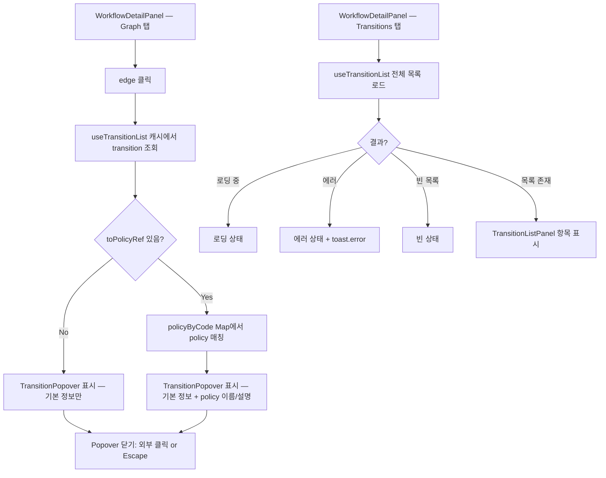

# [FE] 2.2.16 — Transition Condition / Action 초안 조회

## Goal

WorkflowDetailPanel Graph 탭에서 edge(transition)를 클릭하면 Popover로 transition 상세를 표시하고, 새 Transitions 탭에서 전체 transition 목록을 조회한다. `toPolicyRef`가 있는 transition에는 policy 이름·설명을 병합 표시한다.

---

## User Flow Chart



---

## Design Diff

### As-is vs To-be

| 영역 | As-is | To-be | 변경 내용 |
|------|-------|-------|----------|
| WorkflowDetailPanel 탭 | graph / json / meta (3개) | graph / json / meta / transitions (4개) | Transitions 탭 추가 |
| Graph 탭 edge 클릭 | 동작 없음 | `onEdgeClick` → TransitionPopover 표시 | edge 클릭 상호작용 추가 |
| transition 상세 | 없음 | Popover: id, from → to, label(DECISION edge), policy 이름/설명(toPolicyRef 있을 때) | 신규 |
| transition 목록 | 없음 | Transitions 탭: TransitionListPanel | 신규 |

---

## Component Tree

```
WorkflowDetailPanel (existing — modified)
├── DetailHeader (existing, 변경 없음)
├── TabBar: "graph" | "json" | "meta" | "transitions"   ← transitions 추가
├── [Graph 탭]
│    └── ErrorBoundary + Suspense
│         └── GraphRenderer (existing — modified: onEdgeClick prop 추가)
│              └── TransitionPopover (new) — 선택된 edge id 기준 표시
├── [JSON 탭] (existing, 변경 없음)
├── [Meta 탭] (existing, 변경 없음)
└── [Transitions 탭] (new)
     └── TransitionListPanel (new)
          ├── loading / error / empty state
          └── TransitionItem[] 목록 (id / from → to / label / policyCode)
```

> **FSD 규칙**: `workflow-draft-read` feature는 `entities/policy`에서 `policyApi`, `policyKeys`, `PolicySummary`를 직접 import 가능(feature → entity). `features/policy-draft-read` cross-slice import는 금지.

---

## API Integration

### Endpoints

| Method | Path | 반환 타입 | 사용 훅 / 함수 |
|--------|------|----------|--------------|
| GET | `/api/v1/workspaces/{wsId}/domain-packs/{packId}/versions/{versionId}/workflows/{workflowId}/transitions` | `WorkflowTransitionDetail[]` | `useTransitionList` |
| GET | `/api/v1/workspaces/{wsId}/domain-packs/{packId}/versions/{versionId}/policies` | `PolicySummary[]` | `policyApi.list()` (entities/policy, 기존) |

> Transition 단건 GET (`useGetTransition`) 은 이 스펙 범위에서 필수 아님. list 캐시에서 조회하는 방식 사용.

### Query Key Pattern (신규)

```typescript
// entities/workflow/api/index.ts — transitionQueryKeys 추가
export const transitionQueryKeys = {
  all: ["transitions"] as const,
  lists: () => [...transitionQueryKeys.all, "list"] as const,
  list: (wsId: number, packId: number, versionId: number, workflowId: number) =>
    [...transitionQueryKeys.lists(), wsId, packId, versionId, workflowId] as const,
};
```

> `policyKeys`는 `entities/policy/api/index.ts`에 이미 존재. 재사용.

---

## Data Flow

```
┌─────────────────────────────────────────────────────────────────┐
│                 WorkflowDetailPanel (workflow-draft-read)        │
│                                                                 │
│  useTransitionList(wsId, packId, versionId, workflowId)         │
│    queryFn: fetchTransitionList()  →  WorkflowTransitionDetail[] │
│                                                                 │
│  useQuery({ queryKey: policyKeys.list(...),                     │
│             queryFn: policyApi.list() })                        │
│    → PolicySummary[]                                            │
│    → policyByCode: Map<policyCode, PolicySummary>               │
│                                                                 │
│  [Graph 탭] onEdgeClick(edgeId)                                 │
│    → transitionList.find(t => t.id === edgeId)                  │
│    → policyByCode.get(transition.toPolicyRef)                   │
│    → TransitionPopover(transition, policy?)                     │
│                                                                 │
│  [Transitions 탭]                                               │
│    → TransitionListPanel(transitions: WorkflowTransitionDetail[])│
└─────────────────────────────────────────────────────────────────┘
               ↓                           ↓
┌──────────────────────┐     ┌─────────────────────────┐
│   entities/workflow  │     │    entities/policy       │
│  fetchTransitionList │     │  policyApi.list()        │
│  transitionQueryKeys │     │  policyKeys              │
│  WorkflowTransition  │     │  PolicySummary           │
│  Detail (type)       │     │                         │
└──────────────────────┘     └─────────────────────────┘
               ↓
┌─────────────────────────────────────────────────────────────────┐
│                         shared                                  │
│  apiClient (axios base)                                         │
└─────────────────────────────────────────────────────────────────┘
```

---

## 수정 대상 파일

| 파일 | 변경 유형 | 설명 |
|------|---------|------|
| `entities/workflow/model/types.ts` | modify | `WorkflowTransitionDetail` 인터페이스 추가 |
| `entities/workflow/api/index.ts` | modify | `fetchTransitionList`, `transitionQueryKeys` 추가 |
| `entities/workflow/index.ts` | modify | `WorkflowTransitionDetail`, `transitionQueryKeys`, `fetchTransitionList` re-export |
| `features/workflow-draft-read/model/useTransitionList.ts` | new | TanStack Query hook |
| `features/workflow-draft-read/ui/TransitionPopover.tsx` | new | Popover 컴포넌트 |
| `features/workflow-draft-read/ui/TransitionListPanel.tsx` | new | Transitions 탭 목록 컴포넌트 |
| `features/workflow-draft-read/ui/GraphRenderer.tsx` | modify | `onEdgeClick?: (edgeId: string) => void` prop 추가 |
| `features/workflow-draft-read/ui/WorkflowDetailPanel.tsx` | modify | transitions 탭 추가, edge 클릭 state, policy pre-fetch, Popover 렌더링 |

---

## State Management

### Server State (TanStack Query)

```typescript
// entities/workflow/model/types.ts — 추가
export interface WorkflowTransitionDetail {
  id: string;
  workflowDefinitionId: number;
  domainPackVersionId: number;
  from: string;
  to: string;
  label: string | null;
  toPolicyRef: string | null;
}

// entities/workflow/api/index.ts — 추가
export const transitionQueryKeys = {
  all: ["transitions"] as const,
  lists: () => [...transitionQueryKeys.all, "list"] as const,
  list: (wsId: number, packId: number, versionId: number, workflowId: number) =>
    [...transitionQueryKeys.lists(), wsId, packId, versionId, workflowId] as const,
};

export function fetchTransitionList(
  wsId: number, packId: number, versionId: number, workflowId: number,
) {
  return apiClient.get<WorkflowTransitionDetail[]>(
    `/workspaces/${wsId}/domain-packs/${packId}/versions/${versionId}/workflows/${workflowId}/transitions`,
  );
}

// features/workflow-draft-read/model/useTransitionList.ts
export function useTransitionList(
  wsId: number, packId: number, versionId: number, workflowId: number | null,
) {
  return useQuery({
    queryKey: workflowId != null
      ? transitionQueryKeys.list(wsId, packId, versionId, workflowId)
      : (["transitions", "disabled"] as const),
    queryFn: () => fetchTransitionList(wsId, packId, versionId, workflowId!),
    enabled: workflowId != null,
  });
}
```

### Client State (Local)

| 상태 | 위치 | 타입 | 설명 |
|------|------|------|------|
| 선택된 tab | `WorkflowDetailPanel` local | `"graph" \| "json" \| "meta" \| "transitions"` | `useState` |
| 선택된 edge id | `WorkflowDetailPanel` local | `string \| null` | `useState`; null이면 Popover 닫힘 |

---

## Tests

### Test Strategy

| 구분 | 방법 | 도구 |
|------|------|------|
| Hook 단위 (`useTransitionList`) | Vitest + React Testing Library | `pnpm test` |
| 컴포넌트 (`TransitionPopover`, `TransitionListPanel`) | Vitest | `pnpm test` |
| E2E (골든 패스) | Playwright | `pnpm test:e2e` |

### Test Environment & 사전 조건

| 항목 | 값 |
|------|---|
| 환경 | `pnpm dev` |
| 사전 조건 | transition이 포함된 workflow (ACTION 노드로 연결된 edge 1개 이상 포함) |

### Test Scenarios

#### Happy Path

| # | 시나리오 | 사전 조건 | 조작 | 기대 결과 |
|---|---------|---------|------|----------|
| 1 | Transitions 탭 목록 | workflow에 transition 3개 | Transitions 탭 클릭 | 3개 항목 표시 (id, from, to) |
| 2 | edge 클릭 — label 없음 | Graph 탭 활성, label 없는 edge | edge 클릭 | Popover에 id / from → to 표시, label 미표시 |
| 3 | edge 클릭 — DECISION label 있음 | DECISION 발신 edge | edge 클릭 | Popover에 label 표시 |
| 4 | edge 클릭 — toPolicyRef 있음 | ACTION 노드 연결 edge | edge 클릭 | Popover에 policy 이름/설명 표시 |
| 5 | Popover 닫기 | Popover 열려 있음 | Popover 외부 클릭 | Popover 닫힘, selectedEdgeId = null |
| 6 | Popover Escape | Popover 열려 있음 | Escape 키 | Popover 닫힘 |

#### Error & Edge Cases

| # | 시나리오 | 조작 | 기대 결과 |
|---|---------|------|----------|
| 1 | transition 없는 workflow | Transitions 탭 진입 | 빈 상태 표시 |
| 2 | transition list API 오류 | 네트워크 오류 | 에러 상태 표시, `toast.error()` |
| 3 | toPolicyRef 있으나 policy list 불일치 | edge 클릭 | policy 섹션 미표시 (graceful degradation) |
| 4 | graph 로딩 중 edge 클릭 불가 | 로딩 상태 | GraphRenderer 미표시, 클릭 이벤트 없음 |

---

## Implementation Example

```typescript
// entities/workflow/model/types.ts — WorkflowTransitionDetail 추가
export interface WorkflowTransitionDetail {
  id: string;
  workflowDefinitionId: number;
  domainPackVersionId: number;
  from: string;
  to: string;
  label: string | null;
  toPolicyRef: string | null;
}

// features/workflow-draft-read/ui/GraphRenderer.tsx — onEdgeClick prop 추가
interface GraphRendererProps {
  graph: WorkflowGraph;
  onEdgeClick?: (edgeId: string) => void;
}

export default function GraphRenderer({ graph, onEdgeClick }: GraphRendererProps) {
  const { nodes, edges } = useMemo(() => toFlow(graph), [graph]);
  return (
    <div className={styles.container}>
      <ReactFlow
        nodes={nodes}
        edges={edges}
        nodeTypes={nodeTypes}
        fitView
        panOnDrag={true}
        zoomOnScroll={true}
        nodesDraggable={false}
        nodesConnectable={false}
        elementsSelectable={false}
        onEdgeClick={(_, edge) => onEdgeClick?.(edge.id)}
      >
        <Background gap={20} size={1} />
        <Controls showInteractive={false} />
      </ReactFlow>
    </div>
  );
}

// features/workflow-draft-read/ui/WorkflowDetailPanel.tsx — 관련 추가 부분
import { policyApi, policyKeys } from "@/entities/policy";
import type { PolicySummary } from "@/entities/policy";

// 기존 useWorkflowDetail 아래에 추가
const { data: transitionList } = useTransitionList(wsId, packId, versionId, workflowId);
const { data: policyList } = useQuery({
  queryKey: policyKeys.list(wsId, packId, versionId),
  queryFn: () => policyApi.list(wsId, packId, versionId),
  enabled: workflowId != null,
});
const policyByCode = useMemo(
  () => new Map<string, PolicySummary>(policyList?.map((p) => [p.policyCode, p]) ?? []),
  [policyList],
);
const [selectedEdgeId, setSelectedEdgeId] = useState<string | null>(null);
const selectedTransition = transitionList?.find((t) => t.id === selectedEdgeId) ?? null;
const selectedPolicy =
  selectedTransition?.toPolicyRef != null
    ? (policyByCode.get(selectedTransition.toPolicyRef) ?? null)
    : null;
```

---

## Additional Notes

- `toPolicyRef`는 policyCode 문자열(예: `"POL_RETURN"`)이다. policy `id`(Long)가 아니므로 `policyApi.detail()` 호출 없이 `policyApi.list()` 결과를 `policyCode` 기준 Map으로 사용한다.
- `elementsSelectable={false}` 상태에서도 ReactFlow `onEdgeClick`은 정상 동작한다. `elementsSelectable` 변경 불필요.
- Popover 위치 구현은 builder 재량: ReactFlow `onEdgeClick` 이벤트의 clientX/Y 좌표 기반 절대 위치, 또는 graph container 우측 고정 패널. `frontend/DESIGN.md` 준수 필수.
- `useTransitionList` 데이터는 Graph 탭 Popover와 Transitions 탭 목록 양쪽에서 TanStack Query 캐시 공유.
- policy pre-fetch는 `workflowId != null` 조건에서만 활성화 (`enabled` 필수).
- 스타일링은 `frontend/DESIGN.md` 기준 — 인터페이스 chrome black/white only, focus outline dashed 2px.
- BE `WorkflowTransitionDetail` record 확인 결과(`WorkflowTransitionDetail.java:18–25`): `toPolicyRef`는 `to` 노드가 ACTION 타입일 때만 non-null. 그 외 null 반환 확인.
