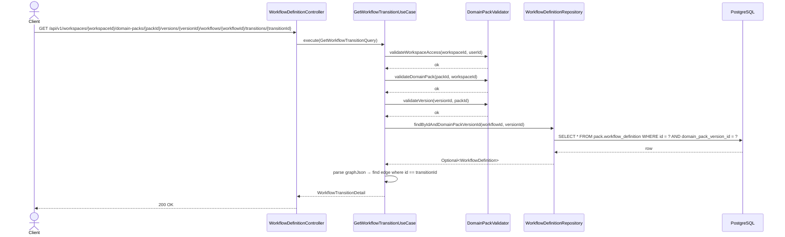

# [BE] 2.2.17 — Transition Condition 초안 단건 조회

## Goal

`workflow_definition.graph_json`의 edge 구조에 고유 `id` 필드를 추가하고, 특정 워크플로우에 속한 Transition(graphJson edge) 초안 단건을 조회하는 READ 전용 엔드포인트를 제공한다.
"Action" 시각화는 이 스펙 범위 밖이며, FE는 policy 단건 조회 API(spec 2211)를 별도로 조합해 사용한다.

---

## graphJson Edge Schema 변경

### 기존

```json
{
  "edges": [
    { "from": "check_refund_policy", "to": "answer_refund", "label": "eligible" },
    { "from": "check_refund_policy", "to": "handoff_agent", "label": "not_eligible" }
  ]
}
```

### 변경 후 (id 필드 추가)

```json
{
  "edges": [
    { "id": "e_check_to_answer",  "from": "check_refund_policy", "to": "answer_refund",  "label": "eligible"     },
    { "id": "e_check_to_handoff", "from": "check_refund_policy", "to": "handoff_agent",  "label": "not_eligible" },
    { "id": "e_answer_to_end",    "from": "answer_refund",       "to": "terminal"                               }
  ]
}
```

- `id`: 필수, 비어있지 않은 문자열, workflow 내 모든 edge 간 고유해야 함.
- `label`: DECISION 노드 발신 edge에 필수 (기존 V6 규칙 유지). 나머지 edge는 선택.

### 신규 Validation Rule — V7 (write-time)

| # | 규칙 | 위반 시 에러 코드 |
|---|------|-----------------|
| V7 | 모든 edge에 `id` 필드가 존재하며 비어있지 않음 | `WORKFLOW_EDGE_ID_MISSING` |
| V7 | 모든 edge `id`가 workflow 내에서 고유함 | `WORKFLOW_EDGE_ID_DUPLICATE` |

이 스펙은 V7을 **정의**한다. 실제 검증·강제 구현은 `CreateDomainPackDraftUseCase`(spec 231 참조)와 `UpdateWorkflowUseCase`(기존 구현에 V7 추가)가 담당한다.

---

## Sequence Diagram



---

## REST API

### Endpoint

| Method | Path | Description |
|--------|------|-------------|
| GET | `/api/v1/workspaces/{workspaceId}/domain-packs/{packId}/versions/{versionId}/workflows/{workflowId}/transitions/{transitionId}` | Transition 초안 단건 조회 |

### Request

Path variables:
- `workspaceId`: Long
- `packId`: Long
- `versionId`: Long
- `workflowId`: Long
- `transitionId`: String (edge의 `id` 필드 값)

Headers:
- `Authorization: Bearer {jwt-token}` (필수)

### Response

**200 OK**

```json
{
  "id": "e_check_to_answer",
  "workflowDefinitionId": 5,
  "domainPackVersionId": 10,
  "from": "check_refund_policy",
  "to": "answer_refund",
  "label": "eligible"
}
```

> `label`은 DECISION 노드 발신 edge에만 존재하며, 나머지 edge는 `null`로 반환한다.

**401 Unauthorized**

```json
{ "code": "UNAUTHORIZED", "message": "인증이 필요합니다." }
```

**403 Forbidden**

```json
{ "code": "FORBIDDEN", "message": "워크스페이스에 접근 권한이 없습니다." }
```

**404 Not Found — transition not found**

```json
{ "code": "WORKFLOW_TRANSITION_NOT_FOUND", "message": "Workflow transition not found: {transitionId}" }
```

**404 Not Found — workflow not found**

```json
{ "code": "WORKFLOW_DEFINITION_NOT_FOUND", "message": "WorkflowDefinition not found: {workflowId}" }
```

**404 Not Found — workspace not found**

```json
{ "code": "DOMAIN_PACK_WORKSPACE_NOT_FOUND", "message": "워크스페이스를 찾을 수 없습니다. id={workspaceId}" }
```

**404 Not Found — pack not found**

```json
{ "code": "DOMAIN_PACK_NOT_FOUND", "message": "DomainPack not found: {packId}" }
```

**404 Not Found — version not found**

```json
{ "code": "DOMAIN_PACK_VERSION_NOT_FOUND", "message": "도메인 팩 버전을 찾을 수 없습니다. id={versionId}" }
```

**500 Internal Server Error — graphJson 정합성 오류**

```json
{ "code": "WORKFLOW_GRAPH_JSON_INVALID", "message": "graphJson이 유효하지 않은 JSON입니다. workflowId={workflowId}" }
```

---

## Class Design

### 신규 생성 파일

| 파일 | 경로 | 역할 |
|------|------|------|
| `GetWorkflowTransitionQuery.java` | `application/` | UseCase 입력 record |
| `GetWorkflowTransitionUseCase.java` | `application/` | edge 추출 + 단건 반환 UseCase |
| `WorkflowTransitionDetail.java` | `application/` | 응답 record + graphJson 파싱 팩토리 |
| `WorkflowTransitionNotFoundException.java` | `application/exception/` | 404 예외 |

### 수정 파일

| 파일 | 변경 내용 |
|------|-----------|
| `WorkflowDefinitionController.java` | `@GetMapping("/{workflowId}/transitions/{transitionId}")` 핸들러 추가 |
| `UpdateWorkflowUseCase.java` (또는 관련 검증 유틸) | V7 edge id 검증 추가 |

### Pseudo-code

```java
// GetWorkflowTransitionQuery.java
record GetWorkflowTransitionQuery(
    Long workspaceId, Long packId, Long versionId,
    Long workflowId, String transitionId, Long userId)

// WorkflowTransitionNotFoundException.java
class WorkflowTransitionNotFoundException extends NotFoundException {
    WorkflowTransitionNotFoundException(String transitionId) {
        super("WORKFLOW_TRANSITION_NOT_FOUND",
              "Workflow transition not found: " + transitionId)
    }
}

// WorkflowTransitionDetail.java
record WorkflowTransitionDetail(
    String id,
    Long workflowDefinitionId,
    Long domainPackVersionId,
    String from,
    String to,
    @Nullable String label) {

    static Optional<WorkflowTransitionDetail> fromGraphJson(
            String graphJson, String transitionId,
            Long workflowId, Long versionId) {
        try {
            // Jackson으로 graphJson 파싱
            // edges[] 순회하여 id == transitionId 인 edge 탐색
            // 발견 시 WorkflowTransitionDetail 반환, 미발견 시 Optional.empty()
        } catch (IOException | IllegalArgumentException e) {
            throw new WorkflowGraphJsonInvalidException(workflowId, e);
        }
    }
}

// GetWorkflowTransitionUseCase.java
@Service
@Transactional(readOnly = true)
class GetWorkflowTransitionUseCase {
    execute(GetWorkflowTransitionQuery query) {
        validator.validateWorkspaceAccess(query.workspaceId(), query.userId())
        validator.validateDomainPack(query.packId(), query.workspaceId())
        validator.validateVersion(query.versionId(), query.packId())

        WorkflowDefinition workflow = workflowDefinitionRepository
            .findByIdAndDomainPackVersionId(query.workflowId(), query.versionId())
            .orElseThrow(() -> new WorkflowDefinitionNotFoundException(query.workflowId()))

        return WorkflowTransitionDetail
            .fromGraphJson(workflow.getGraphJson(), query.transitionId(),
                           workflow.getId(), workflow.getDomainPackVersionId())
            .orElseThrow(() -> new WorkflowTransitionNotFoundException(query.transitionId()))
    }
}

// WorkflowDefinitionController.java — 추가 핸들러
@GetMapping("/{workflowId}/transitions/{transitionId}")
getTransition(@PathVariable Long workspaceId, @PathVariable Long packId,
              @PathVariable Long versionId, @PathVariable Long workflowId,
              @PathVariable String transitionId,
              Authentication authentication) {
    Long userId = AuthenticationUtils.getUserId(authentication)
    return ResponseEntity.ok(
        transitionUseCase.execute(new GetWorkflowTransitionQuery(
            workspaceId, packId, versionId, workflowId, transitionId, userId)))
}
```

---

## Tests

### UseCase 테스트: `GetWorkflowTransitionUseCaseTest.java`

- `@ExtendWith(MockitoExtension.class)` + `@DisplayName`
- `WorkflowDefinitionRepository` mock

| 시나리오 | 예상 결과 |
|----------|-----------|
| 정상 조회 (label 있음) | `WorkflowTransitionDetail` 반환, 전 필드 검증 |
| 정상 조회 (label 없음) | `label == null` 반환 |
| `transitionId` 미존재 | `WorkflowTransitionNotFoundException` |
| `workflowId` 미존재 | `WorkflowDefinitionNotFoundException` |
| DB 저장된 graphJson 파싱 오류 | `WorkflowGraphJsonInvalidException` |
| workspace 미존재 | `DomainPackWorkspaceNotFoundException` (validator 위임) |
| 권한 없음 | `DomainPackUnauthorizedWorkspaceAccessException` (validator 위임) |
| pack 소속 불일치 | `DomainPackNotFoundException` (validator 위임) |

### Controller 테스트: `WorkflowDefinitionControllerTest.java` (기존 확장)

- `@WebMvcTest(WorkflowDefinitionController.class)` + JwtAuthenticationFilter exclude
- `@WithLongPrincipal(10L)` fixture 사용

| 시나리오 | 예상 결과 |
|----------|-----------|
| 정상 조회 | 200, 전 필드 검증 (`id`, `workflowDefinitionId`, `domainPackVersionId`, `from`, `to`, `label`) |
| `transitionId` 미존재 | 404, `body.code == "WORKFLOW_TRANSITION_NOT_FOUND"` |
| `workflowId` 미존재 | 404, `body.code == "WORKFLOW_DEFINITION_NOT_FOUND"` |
| DB 저장된 graphJson 파싱 오류 | 500, `body.code == "WORKFLOW_GRAPH_JSON_INVALID"` |
| 권한 없음 | 403 |
| 인증 없음 | 401 |
| version 미존재 | 404 |

---

## Database

신규 DDL 없음. `pack.workflow_definition.graph_json` JSONB 컬럼 내부 구조만 변경된다.

---

## Additional Notes

- `WorkflowDefinitionRepository.findByIdAndDomainPackVersionId`는 이미 존재하므로 재사용한다.
- graphJson 파싱은 app layer(Jackson)에서 수행한다. PostgreSQL jsonb_path_query는 사용하지 않는다.
- Validator 호출 순서는 기존 `GetWorkflowDefinitionUseCase` 패턴(3단계 개별 호출)을 따른다.
- edge `id`의 형식(예: `"e_check_to_answer"`)은 node `id`와 동일한 자유 문자열 규칙을 따른다.
- 이 스펙은 V7을 **정의**한다. 실제 검증·강제 구현은 `CreateDomainPackDraftUseCase`(spec 231 참조)와 `UpdateWorkflowUseCase`(기존 구현에 V7 추가)가 담당한다.
- `WorkflowGraphJsonInvalidException`은 이미 존재한다(`InternalException` 상속). `fromGraphJson` 파싱 오류 시 workflowId를 포함한 메시지를 위해 `WorkflowGraphJsonInvalidException(Long workflowId, Throwable cause)` 생성자를 추가한다.
- 기존 DB에 저장된 `edge id` 없는 workflow draft는 단건 transition GET이 404를 반환한다. 마이그레이션은 이 스펙 범위 밖이다.
- FE의 Action 시각화는 spec 2211 policy 단건/목록 API를 별도로 조합해서 구현한다.
