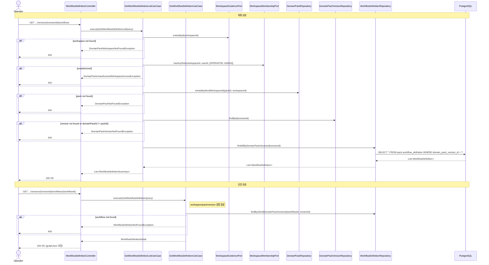
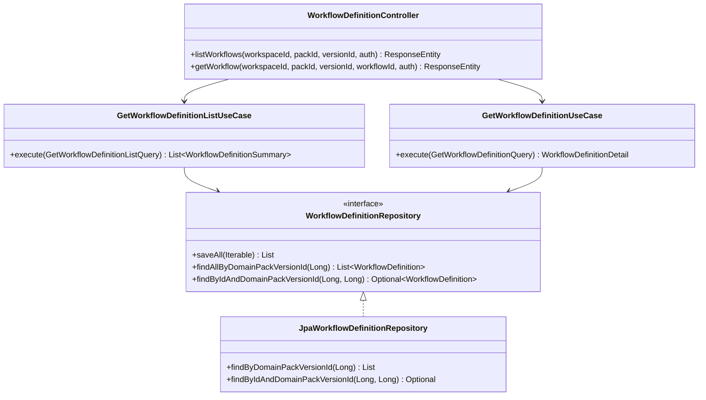

# [BE-226] workflow 구성요소 초안 조회 API

> **Backlog**: 운영자가 특정 DomainPackVersion에 저장된 workflow 초안 목록과 단건 상세를 조회하고 싶다 → 실행 가능한 도메인 구조를 빠르게 확인하기 위해
> **Bounded Context**: `domainpack`
> **Template**: `_TEMPLATE_BE.md`
> **Branch**: `feature/226-workflow-draft-read`

---

## Goal

특정 DomainPackVersion에 저장된 `WorkflowDefinition` 목록과 단건 상세를 조회하는 두 GET 엔드포인트를 제공한다. 단건 조회에는 실행 가능한 도메인 구조(`graphJson`)가 포함된다.

`graphJson` 내부 구조는 Mermaid flowchart를 JSON으로 파싱한 형식(nodes + edges)을 기준으로 정의한다.

---

## graphJson Schema

`WorkflowDefinition.graphJson`은 Mermaid flowchart 문법을 JSON으로 파싱한 구조를 따른다.

**구조 예시 (환불 요청 플로우):**

```json
{
  "direction": "LR",
  "nodes": [
    { "id": "start",               "label": "상담 시작",      "type": "START"    },
    { "id": "collect_order_id",    "label": "주문번호 수집",   "type": "ACTION"   },
    { "id": "check_refund_policy", "label": "환불 정책 확인", "type": "DECISION" },
    { "id": "answer_refund",       "label": "환불 처리 안내", "type": "ANSWER"   },
    { "id": "handoff_agent",       "label": "상담원 연결",    "type": "HANDOFF"  },
    { "id": "terminal",            "label": "상담 종료",      "type": "TERMINAL" }
  ],
  "edges": [
    { "from": "start",               "to": "collect_order_id"                              },
    { "from": "collect_order_id",    "to": "check_refund_policy"                           },
    { "from": "check_refund_policy", "to": "answer_refund",  "label": "eligible"           },
    { "from": "check_refund_policy", "to": "handoff_agent",  "label": "not_eligible"       },
    { "from": "answer_refund",       "to": "terminal"                                      },
    { "from": "handoff_agent",       "to": "terminal"                                      }
  ]
}
```

**Node type ↔ Mermaid shape 매핑:**

| type       | Mermaid shape         | Mermaid 예시               |
|------------|-----------------------|----------------------------|
| `START`    | `([text])` stadium    | `A([상담 시작])`           |
| `ACTION`   | `[text]` rectangle    | `B[주문번호 수집]`         |
| `DECISION` | `{text}` diamond      | `C{환불 정책 확인}`        |
| `ANSWER`   | `>text]` asymmetric   | `D>환불 안내]`             |
| `HANDOFF`  | `[/text\]` trapezoid  | `E[/상담원 연결\]`         |
| `TERMINAL` | `((text))` circle     | `F((상담 종료))`           |

**`initialState` / `terminalStatesJson` 연계:**

- `WorkflowDefinition.initialState` = `nodes` 중 `type == "START"`인 노드의 `id`
- `WorkflowDefinition.terminalStatesJson` = `nodes` 중 `type == "TERMINAL"`인 노드들의 `id` 배열

```json
// initialState
"start"

// terminalStatesJson
["terminal"]
```

---

## graphJson Validation Rules

`graphJson`을 저장할 때 반드시 통과해야 하는 무결성 규칙이다.  
**강제 시점**: write path — `CreateDomainPackDraftUseCase` (spec 231 범위).  
이 스펙(226)은 규칙을 **정의**하며, 코드 강제는 spec 231 구현 시 적용한다.

| # | 규칙 | 위반 시 에러 |
|---|------|-------------|
| V1 | `nodes` 중 `type == "START"` 노드가 **정확히 1개** 존재 | `WORKFLOW_INVALID_START_NODE` |
| V2 | `nodes` 중 `type == "TERMINAL"` 노드가 **1개 이상** 존재 | `WORKFLOW_INVALID_TERMINAL_NODE` |
| V3 | `edges.from`, `edges.to`가 참조하는 노드 id가 **모두 `nodes`에 존재** | `WORKFLOW_DANGLING_EDGE` |
| V4 | START 노드에서 **모든 노드가 도달 가능** (connected graph, BFS/DFS) | `WORKFLOW_UNREACHABLE_NODE` |
| V5 | **사이클 없음** (DAG 구조 — topological sort 가능) | `WORKFLOW_CYCLE_DETECTED` |
| V6 | `type == "DECISION"` 노드에서 나가는 **모든 edge에 `label` 존재** | `WORKFLOW_UNLABELED_BRANCH` |

### 규칙별 보충 설명

**V1 — START 노드 정확히 1개**  
START 노드가 없으면 실행 진입점 불명. 2개 이상이면 진입 경로가 모호해진다.

**V2 — TERMINAL 노드 1개 이상**  
TERMINAL이 없으면 workflow가 종료 불가 상태. 1개 이상 필수.

**V3 — 엣지 참조 무결성**  
`edges[i].from` 또는 `edges[i].to`가 `nodes[j].id` 목록에 없으면 dangling reference.

**V4 — 전체 연결성 (reachability)**  
START 노드에서 BFS/DFS를 수행해 방문 불가 노드가 있으면 dead node로 판단.  
단, START 자신도 방문 대상에 포함.

**V5 — DAG (Directed Acyclic Graph)**  
Kahn's algorithm(위상 정렬) 또는 DFS color marking으로 사이클 탐지.  
DECISION → ACTION → DECISION 같은 루프도 위반으로 처리.

**V6 — 분기 레이블 필수 (DECISION 노드)**  
`type == "DECISION"` 노드에서 나가는 edge가 2개 이상일 때 각 edge에 `label`이 없으면  
runtime이 분기 조건을 특정할 수 없다. 빈 문자열 `""` 도 위반으로 처리.

---

## Sequence Diagram



---

## REST API

### Endpoints

| Method | Path | Description |
|--------|------|-------------|
| GET | `/api/v1/workspaces/{workspaceId}/domain-packs/{packId}/versions/{versionId}/workflows` | 버전 내 workflow 목록 조회 (graphJson 제외) |
| GET | `/api/v1/workspaces/{workspaceId}/domain-packs/{packId}/versions/{versionId}/workflows/{workflowId}` | 단건 workflow 상세 조회 (graphJson 포함) |

### Path Variables

| Name | Type | Description |
|------|------|-------------|
| `workspaceId` | Long | 워크스페이스 ID |
| `packId` | Long | Domain Pack ID |
| `versionId` | Long | DomainPackVersion ID |
| `workflowId` | Long | WorkflowDefinition ID (단건 조회 시) |

### Response — 목록 조회 (200 OK)

`graphJson`은 포함하지 않는다. 성능 고려.

```json
[
  {
    "id": 1,
    "workflowCode": "refund_flow",
    "name": "환불 플로우",
    "description": "환불 요청 처리 플로우",
    "initialState": "start",
    "terminalStatesJson": "[\"terminal\"]",
    "createdAt": "2026-04-14T10:00:00Z",
    "updatedAt": "2026-04-14T10:00:00Z"
  }
]
```

### Response — 단건 조회 (200 OK)

`graphJson`을 `@JsonRawValue`로 반환하여 HTTP 응답에서 JSON object로 직렬화된다.

```json
{
  "id": 1,
  "workflowCode": "refund_flow",
  "name": "환불 플로우",
  "description": "환불 요청 처리 플로우",
  "graphJson": {
    "direction": "LR",
    "nodes": [...],
    "edges": [...]
  },
  "initialState": "start",
  "terminalStatesJson": "[\"terminal\"]",
  "evidenceJson": "[]",
  "metaJson": "{}",
  "createdAt": "2026-04-14T10:00:00Z",
  "updatedAt": "2026-04-14T10:00:00Z"
}
```

> `graphJson` 필드: 응답 DTO에서 `@JsonRawValue`를 사용해 raw JSON으로 직렬화. 엔티티는 여전히 String으로 보관.
> `terminalStatesJson`, `evidenceJson`, `metaJson`: String 그대로 반환.

### Errors

**401 Unauthorized** — 미인증

**403 Forbidden**
```json
{ "code": "FORBIDDEN", "message": "워크스페이스에 접근 권한이 없습니다." }
```

**404 Not Found** — workspace / domain pack / version / workflow 미존재
```json
{ "code": "DOMAIN_PACK_WORKSPACE_NOT_FOUND", "message": "워크스페이스를 찾을 수 없습니다. id=999" }
{ "code": "DOMAIN_PACK_NOT_FOUND",           "message": "DomainPack not found: 7" }
{ "code": "DOMAIN_PACK_VERSION_NOT_FOUND",   "message": "DomainPackVersion not found: 101" }
{ "code": "WORKFLOW_DEFINITION_NOT_FOUND",   "message": "WorkflowDefinition not found: 99" }
```

---

## Class Design

### DDD Layered Structure



### Application Layer

**Query 객체:**

```java
public record GetWorkflowDefinitionListQuery(
    Long workspaceId,
    Long packId,
    Long versionId,
    Long userId) {}

public record GetWorkflowDefinitionQuery(
    Long workspaceId,
    Long packId,
    Long versionId,
    Long workflowId,
    Long userId) {}
```

**Result 객체:**

```java
// 목록 항목 (graphJson 제외)
public record WorkflowDefinitionSummary(
    Long id,
    String workflowCode,
    String name,
    String description,
    String initialState,
    String terminalStatesJson,
    OffsetDateTime createdAt,
    OffsetDateTime updatedAt) {

  public static WorkflowDefinitionSummary from(WorkflowDefinition entity) { ... }
}

// 단건 상세 (graphJson 포함)
public record WorkflowDefinitionDetail(
    Long id,
    String workflowCode,
    String name,
    String description,
    String graphJson,
    String initialState,
    String terminalStatesJson,
    String evidenceJson,
    String metaJson,
    OffsetDateTime createdAt,
    OffsetDateTime updatedAt) {

  public static WorkflowDefinitionDetail from(WorkflowDefinition entity) { ... }
}
```

**UseCase 구조 예시:**

```java
@Service
@Transactional(readOnly = true)
public class GetWorkflowDefinitionListUseCase {

  private static final Set<WorkspaceMemberRole> ALLOWED_ROLES =
      Set.of(WorkspaceMemberRole.OPERATOR, WorkspaceMemberRole.ADMIN);

  // 생성자 주입: WorkspaceExistencePort, WorkspaceMembershipPort,
  //              DomainPackRepository, DomainPackVersionRepository,
  //              WorkflowDefinitionRepository

  public List<WorkflowDefinitionSummary> execute(GetWorkflowDefinitionListQuery query) {
    // 1. workspace 존재 검증
    // 2. 멤버십 역할 검증 (OPERATOR 또는 ADMIN)
    // 3. domain pack 소속 검증 (existsByIdAndWorkspaceId)
    // 4. version 존재 검증: findById → version.getDomainPackId().equals(packId) 확인
    // 5. findAllByDomainPackVersionId(versionId) → WorkflowDefinitionSummary 변환
  }
}
```

### Domain Port 변경 (`WorkflowDefinitionRepository`)

기존:
```java
<S extends WorkflowDefinition> List<S> saveAll(Iterable<S> entities);
```

추가:
```java
List<WorkflowDefinition> findAllByDomainPackVersionId(Long domainPackVersionId);
Optional<WorkflowDefinition> findByIdAndDomainPackVersionId(Long id, Long domainPackVersionId);
```

### Infrastructure 변경 (`JpaWorkflowDefinitionRepository`)

기존 `findByDomainPackVersionId(Long)` → 도메인 포트의 `findAllByDomainPackVersionId`로 매핑 (메서드명 변경 또는 default 위임).

추가:
```java
Optional<WorkflowDefinition> findByIdAndDomainPackVersionId(Long id, Long domainPackVersionId);
```

### 신규 예외 클래스

```java
// backend/src/main/java/com/init/domainpack/application/exception/
public class WorkflowDefinitionNotFoundException extends RuntimeException { ... }
```

---

## Tests

### Unit Tests

```java
@DisplayName("GetWorkflowDefinitionListUseCase")
class GetWorkflowDefinitionListUseCaseTest {

    @Test
    @DisplayName("정상 조회 시 version 내 workflow 목록 반환")
    void execute_withValidQuery_returnsWorkflowList() { ... }

    @Test
    @DisplayName("workflow 없는 version → 빈 목록 반환")
    void execute_noWorkflows_returnsEmptyList() { ... }

    @Test
    @DisplayName("workspace 없음 → DomainPackWorkspaceNotFoundException")
    void execute_workspaceNotFound_throwsException() { ... }

    @Test
    @DisplayName("접근 권한 없음 → DomainPackUnauthorizedWorkspaceAccessException")
    void execute_unauthorized_throwsException() { ... }

    @Test
    @DisplayName("domain pack 소속 불일치 → DomainPackNotFoundException")
    void execute_packNotInWorkspace_throwsException() { ... }

    @Test
    @DisplayName("version 소속 불일치 → DomainPackVersionNotFoundException")
    void execute_versionNotInPack_throwsException() { ... }
}

@DisplayName("GetWorkflowDefinitionUseCase")
class GetWorkflowDefinitionUseCaseTest {

    @Test
    @DisplayName("정상 조회 시 graphJson 포함 전체 필드 반환")
    void execute_withValidQuery_returnsDetail() { ... }

    @Test
    @DisplayName("workflowId가 versionId에 속하지 않음 → WorkflowDefinitionNotFoundException")
    void execute_workflowNotInVersion_throwsException() { ... }
}
```

### Controller Tests

```java
@SpringBootTest
@AutoConfigureMockMvc
@DisplayName("WorkflowDefinitionController")
class WorkflowDefinitionControllerTest {

    @Test
    @DisplayName("GET .../workflows → 200 OK, 목록 반환")
    void listWorkflows_returnsOk() throws Exception { ... }

    @Test
    @DisplayName("GET .../workflows/{id} → 200 OK, graphJson 포함")
    void getWorkflow_returnsOkWithGraphJson() throws Exception { ... }

    @Test
    @DisplayName("GET .../workflows → workflow 없으면 빈 배열")
    void listWorkflows_noWorkflows_returnsEmptyArray() throws Exception { ... }

    @Test
    @DisplayName("GET .../workflows/{id} → 404 미존재")
    void getWorkflow_notFound_returns404() throws Exception { ... }

    @Test
    @DisplayName("GET .../workflows → 403 권한 없음")
    void listWorkflows_unauthorized_returns403() throws Exception { ... }

    @Test
    @DisplayName("GET .../workflows → 401 미인증")
    void listWorkflows_unauthenticated_returns401() throws Exception { ... }

    @Test
    @DisplayName("GET .../workflows → 404 version 소속 불일치")
    void listWorkflows_versionNotInPack_returns404() throws Exception { ... }
}
```

### Test Checklist

- [ ] 정상 목록 조회: 저장된 workflow가 모두 반환됨, graphJson 미포함
- [ ] 정상 단건 조회: graphJson 포함 전체 필드 반환
- [ ] graphJson이 JSON object로 직렬화됨 (`@JsonRawValue` 효과 검증)
- [ ] 빈 목록: workflow 없는 version → 빈 배열 반환
- [ ] 미존재 workflow: 404 반환
- [ ] 권한 없는 사용자: 403 반환
- [ ] 미인증: 401 반환
- [ ] workspace/pack/version 미소속: 404 반환

---

## Database

DB 변경 없음. `pack.workflow_definition` 및 `pack.intent_workflow_binding` 테이블은 Spec 231 구현 시 Liquibase migration 완료.

---

## Additional Notes

- `graphJson` 내부 구조(node/edge schema)와 무결성 규칙(V1~V6)은 이 스펙에서 정의한다. **규칙 강제(코드 구현)는 spec 231 write path** (`CreateDomainPackDraftUseCase`) 범위다.
- 목록 응답에는 `graphJson`을 포함하지 않는다 (최대 200개 workflow × 20,000자 방지).
- `@JsonRawValue`로 `graphJson`을 raw JSON으로 직렬화하면 클라이언트는 별도 파싱 불필요.
- `JpaWorkflowDefinitionRepository.findByDomainPackVersionId`는 이미 존재하나 도메인 포트에 미노출 상태. `findAllByDomainPackVersionId`로 포트에 추가하거나, default 위임 메서드를 Jpa repo에 추가한다.
