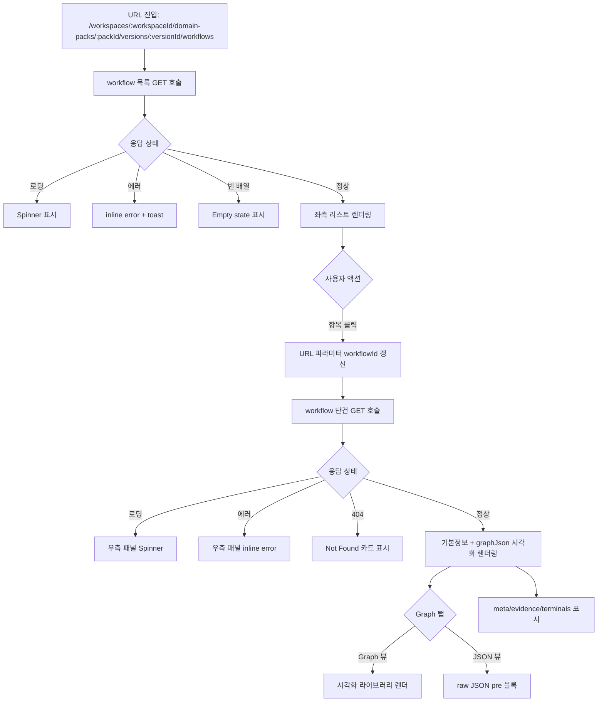

# [FE-227] Console — Workflow 구성요소 초안 조회

> **Backlog**: 운영자가 특정 DomainPackVersion에 저장된 workflow 초안 목록과 단건 상세(graphJson 포함)를 콘솔에서 조회하고 싶다 → 실행 가능한 도메인 구조를 빠르게 검토하기 위해
> **Layer**: Frontend (Operator Console)
> **Template**: `.agent/specs/_TEMPLATE_FE.md`
> **Branch**: `spec/227`
> **Depends on**: `.agent/specs/021.md`, `.agent/specs/226.md` (BE read API), `frontend/DESIGN.md`, `ebb9304` (FE 디자인 개정 main 반영)
> **불확실성 항목**: `.handoff/227/uncertainty-register-227.md` 참조

---

## Goal

운영자 콘솔에서 `workspaceId/packId/versionId`가 주어진 상태로, 해당 버전의 workflow 초안 목록과 선택된 workflow의 상세(graphJson 시각화 포함)를 **단일 페이지의 좌측 리스트 + 우측 상세 패널** 레이아웃으로 조회한다. 상위 탐색(워크스페이스/팩/버전 선택) UX는 이 스펙 범위 밖이며, 라우트 path parameter로 컨텍스트를 받는다.

---

## Workspace Flow Alignment

- `021.md` 기준에서 운영자는 먼저 `/workspaces/:workspaceId/workflows`로 진입하고, 그 안에서 representative version(`publishedAt DESC` 기준 최신 published version)이 해소된다.
- 본 스펙의 화면은 그 다음 단계의 상세 read 화면이다. 즉, workspace 진입점 자체를 정의하지 않고, 해소된 `workspaceId / packId / versionId` 컨텍스트를 받아 deep-link 형태로 동작한다.
- direct URL 진입은 계속 지원하지만, 정보구조상 상위 홈은 별도 빈 workspace 페이지가 아니라 workspace-scoped workflow entry page다.
- 따라서 이 문서의 라우트는 `021.md`와 충돌하지 않으며, representative version이 이미 정해진 뒤의 상세 조회 책임만 가진다.

---

## User Flow Chart



---

## Design Diff

### As-is vs To-be

| 영역 | As-is | To-be | 변경 내용 |
|------|-------|-------|----------|
| Domain Pack 콘솔 | `pages/domain-pack` 비어 있음 (하위 `ui/` 없음) | workflow 조회 화면 신규 추가 | 신규 기능 |
| Workflow 시각화 | 없음 | graphJson → @xyflow/react 기반 그래프 렌더 | 신규 기능 — @xyflow/react(ReactFlow v12) 도입 |
| 서버 상태 관리 | `apiClient` + `useState/useEffect` (기존) | 동일 패턴 유지 | 변경 없음 |
| 디자인 시스템 | `ebb9304`(PR #51)로 Pretendard Variable + 모노크롬 팔레트 + dashed focus + radius 토큰이 main에 반영됨 | 해당 토큰·규칙을 준수한 신규 컴포넌트 추가 | main에 이미 존재하는 토큰 재사용 |

### ebb9304 병합 후 확정된 스타일 기반

- 전역 CSS 변수(`frontend/src/app/index.css`): `--bg-color`, `--bg-secondary`, `--text-primary`, `--text-secondary`, `--text-muted`, `--brand-primary`, `--primary-color`, `--glass-dark`, `--glass-light`, radius 토큰(`--radius-sm: 2px`, `--radius-md: 6px`, `--radius-lg: 8px`, `--radius-xl: 50px`, `--radius-full: 50%`).
- 전역 focus: `*:focus-visible { outline: dashed 2px; outline-offset: 2px; }`.
- Shadcn 계열 HSL 변수(`frontend/src/index.css`): `--background`, `--foreground`, `--primary`, `--secondary`, `--muted`, `--accent`, `--destructive`, `--border`, `--input`, `--ring`, sidebar 변수 전부 black/white 매핑.
- Body 기본: `font-family: 'Pretendard Variable'`, `font-weight: 340`, `font-feature-settings: "kern"`, `letter-spacing: -0.14px`.

> 본 스펙의 모든 컴포넌트는 위 토큰·규칙을 직접 참조하여 CSS 모듈을 작성한다. 하드코딩된 hex/rgba 색상 신규 도입 금지.

---

## Component Tree

```text
WorkflowDraftReadPage (pages/domain-pack/ui/WorkflowDraftReadPage.tsx)
├─ DashboardLayout (shared/ui/layout)
├─ PageHeader
│    ├─ Breadcrumb (path context: ws / pack / version 표시)
│    └─ VersionMetaStrip (versionId, 상태 뱃지 — read-only)
├─ WorkflowTwoPane
│    ├─ WorkflowListPanel (좌측)
│    │    ├─ ListHeader (count, sort 정보)
│    │    ├─ WorkflowListItem[]
│    │    │    ├─ WorkflowCodeLabel (mono 폰트 — Geist Mono)
│    │    │    ├─ WorkflowName
│    │    │    └─ StateBadges (initialState, terminalStates count)
│    │    ├─ LoadingSkeleton
│    │    └─ EmptyState (workflow 없음)
│    └─ WorkflowDetailPanel (우측)
│         ├─ DetailHeader (name, workflowCode, 수정 시각)
│         ├─ DetailTabs
│         │    ├─ GraphTab → GraphRenderer (@xyflow/react)
│         │    ├─ JsonTab → <pre><code>{JSON.stringify(graphJson, null, 2)}</code></pre>
│         │    └─ MetaTab → terminalStates / evidence / meta 표시
│         ├─ DetailLoadingState
│         ├─ DetailErrorState (404 / 500 / network)
│         └─ PlaceholderState (목록은 있으나 미선택)
```

> 각 컴포넌트는 `frontend/DESIGN.md`의 타이포/팔레트/radius/focus outline 규정과 `ebb9304` 이후 main의 CSS 변수·shadcn 토큰을 따른다. 컴포넌트 스타일은 CSS 모듈(`*.module.css`)로 작성하고 위 전역 변수를 참조한다.

---

## API Integration

### Endpoints (소비)

`.agent/specs/226.md` 에서 이미 정의/구현된 BE 엔드포인트를 소비한다. 신규 BE 변경 없음.

| Method | Path | 용도 |
|--------|------|------|
| GET | `/api/v1/workspaces/{workspaceId}/domain-packs/{packId}/versions/{versionId}/workflows` | 목록 조회 (graphJson 미포함) |
| GET | `/api/v1/workspaces/{workspaceId}/domain-packs/{packId}/versions/{versionId}/workflows/{workflowId}` | 단건 조회 (graphJson 포함) |

### TypeScript 타입 (응답)

```ts
// entities/workflow/model/types.ts
export interface WorkflowSummary {
  id: number;
  workflowCode: string;
  name: string;
  description: string | null;
  initialState: string | null;
  terminalStatesJson: string; // JSON array string (예: "[\"terminal\"]")
  createdAt: string;          // ISO-8601 (OffsetDateTime)
  updatedAt: string;
}

export interface GraphNode {
  id: string;
  label: string;
  type: 'START' | 'ACTION' | 'DECISION' | 'ANSWER' | 'HANDOFF' | 'TERMINAL';
}

export interface GraphEdge {
  from: string;
  to: string;
  label?: string;
}

export interface WorkflowGraph {
  direction: 'LR' | 'TB'; // FE-227 범위에서는 LR/TB만 렌더링 대상으로 제한
  nodes: GraphNode[];
  edges: GraphEdge[];
}

export interface WorkflowDetail {
  id: number;
  workflowCode: string;
  name: string;
  description: string | null;
  graphJson: WorkflowGraph;    // 서버에서 @JsonRawValue로 object 직렬화됨
  initialState: string | null;
  terminalStatesJson: string;  // 문자열로 직렬화된 JSON array (spec/226 합의)
  evidenceJson: string;        // 문자열로 직렬화된 JSON array
  metaJson: string;            // 문자열로 직렬화된 JSON object
  createdAt: string;
  updatedAt: string;
}
```

> `graphJson`은 BE가 `@JsonRawValue`로 object 직렬화하므로 FE에서 `JSON.parse` 불필요. 반면 `terminalStatesJson / evidenceJson / metaJson`은 문자열이므로 표시 시점에 `JSON.parse`로 해석한 뒤 UI로 변환한다 (실패 시 raw 문자열 fallback + `console.warn`).

### graphJson → @xyflow/react 매핑

```ts
// features/workflow-draft-read/ui/graphMapper.ts (요약)
import type { Node, Edge } from '@xyflow/react';
import type { WorkflowGraph } from '../../../entities/workflow/model/types';

const mapNodeType = (type: WorkflowGraph['nodes'][number]['type']) =>
  type.toLowerCase();

export function toFlow(graph: WorkflowGraph): { nodes: Node[]; edges: Edge[] } {
  const nodes: Node[] = graph.nodes.map((n, i) => ({
    id: n.id,
    type: mapNodeType(n.type),            // nodeTypes 등록 key
    data: { label: n.label },
    position: layout(i, graph),           // 자동 레이아웃 유틸 (초기 grid/dagre)
  }));
  const edgeIdCounts = new Map<string, number>();
  const edges: Edge[] = graph.edges.map((e) => {
    const baseId = `${e.from}->${e.to}:${e.label ?? 'unlabeled'}`;
    const count = edgeIdCounts.get(baseId) ?? 0;
    edgeIdCounts.set(baseId, count + 1);

    return {
      id: `${baseId}#${count + 1}`, // 첫 번째 edge는 #1
      source: e.from,
      target: e.to,
      label: e.label ?? undefined,
    };
  });
  return { nodes, edges };
}
```

커스텀 노드 타입 key(`nodeTypes` 등록 key) ↔ `GraphNode.type` 매핑:

| GraphNode.type | nodeTypes key | 렌더 컴포넌트 | 형태 |
|----------------|---------------|---------------|------|
| `START`    | `start`    | `StartNode`    | stadium (border-radius 50px) |
| `ACTION`   | `action`   | `ActionNode`   | rectangle (border-radius 6px) |
| `DECISION` | `decision` | `DecisionNode` | diamond (transform rotate) |
| `ANSWER`   | `answer`   | `AnswerNode`   | asymmetric rectangle (좌측 컷) |
| `HANDOFF`  | `handoff`  | `HandoffNode`  | trapezoid |
| `TERMINAL` | `terminal` | `TerminalNode` | circle (border-radius 50%) |

- 색상은 전부 main의 `--text-primary` / `--bg-color` / `--glass-dark` 토큰을 사용. 신규 색상 도입 금지.
- 초기 레이아웃은 grid 기반으로 시작하고, 가독성 이슈 발생 시 `dagre` 등 보조 레이아웃 라이브러리 추가 검토(본 스펙은 grid까지 포함, dagre는 판단 시점에 후속 결정).
- **nodeTypes 등록**: `GraphRenderer.tsx`는 `@xyflow/react`의 `ReactFlow` 컴포넌트에 `nodeTypes` prop을 전달한다. 키는 반드시 소문자(lowercase)여야 하며, `toFlow` 함수가 `n.type.toLowerCase()`로 변환한 값과 1:1 일치해야 한다. 예시:

  ```ts
  // features/workflow-draft-read/ui/GraphRenderer.tsx
  import { StartNode } from './nodes/StartNode';
  import { ActionNode } from './nodes/ActionNode';
  import { DecisionNode } from './nodes/DecisionNode';
  import { AnswerNode } from './nodes/AnswerNode';
  import { HandoffNode } from './nodes/HandoffNode';
  import { TerminalNode } from './nodes/TerminalNode';

  const nodeTypes = {
    start: StartNode,       // GraphNode.type 'START' → n.type.toLowerCase() → 'start'
    action: ActionNode,
    decision: DecisionNode,
    answer: AnswerNode,
    handoff: HandoffNode,
    terminal: TerminalNode,
  };
  ```

  `toFlow`의 `mapNodeType`(`n.type.toLowerCase()`)과 `nodeTypes` 키가 일치하지 않으면 ReactFlow가 노드를 렌더링하지 못하므로, 커스텀 노드 컴포넌트 추가 시 이 매핑을 반드시 함께 갱신한다.

### API 모듈 (service object 패턴)

```ts
// features/workflow-draft-read/api/workflowApi.ts
import { apiClient } from '../../../shared/api';
import type { WorkflowDetail, WorkflowSummary } from '../../../entities/workflow/model/types';

export const workflowApi = {
  list: (wsId: number, packId: number, versionId: number) =>
    apiClient.get<WorkflowSummary[]>(
      `/workspaces/${wsId}/domain-packs/${packId}/versions/${versionId}/workflows`,
    ),

  detail: (wsId: number, packId: number, versionId: number, workflowId: number) =>
    apiClient.get<WorkflowDetail>(
      `/workspaces/${wsId}/domain-packs/${packId}/versions/${versionId}/workflows/${workflowId}`,
    ),
};
```

기존 `shared/api` 컨벤션(`/api/v1` baseURL + Bearer token) 그대로 활용. 신규 서버 상태 라이브러리 도입 없음.

### 상태 훅 (기존 패턴 유지)

```ts
// features/workflow-draft-read/model/useWorkflowList.ts
import { useEffect, useState } from 'react';
import { workflowApi } from '../api/workflowApi';
import { ApiRequestError } from '../../../shared/api';
import type { WorkflowSummary } from '../../../entities/workflow/model/types';

type State =
  | { status: 'loading' }
  | { status: 'error'; code: string; message: string }
  | { status: 'ready'; data: WorkflowSummary[] };

export function useWorkflowList(wsId: number, packId: number, versionId: number) {
  const [state, setState] = useState<State>({ status: 'loading' });

  useEffect(() => {
    let cancelled = false;
    setState({ status: 'loading' });
    workflowApi.list(wsId, packId, versionId)
      .then((data) => { if (!cancelled) setState({ status: 'ready', data }); })
      .catch((e) => {
        if (!cancelled) {
          if (e instanceof ApiRequestError) {
            setState({ status: 'error', code: e.code, message: e.message });
          } else {
            setState({ status: 'error', code: 'UNKNOWN_ERROR', message: '알 수 없는 오류가 발생했습니다.' });
          }
        }
      });
    return () => { cancelled = true; };
  }, [wsId, packId, versionId]);

  return state;
}
```

`useWorkflowDetail`도 동일 discriminated-union 상태 타입을 사용한다 (별도 파일). catch 블록에도 동일한 `instanceof ApiRequestError` 분기를 적용해야 한다.

---

## Data Flow

```text
Route (/workspaces/:workspaceId/domain-packs/:packId/versions/:versionId/workflows)
  │
  ▼ path params
WorkflowDraftReadPage (pages)
  └─ useWorkflowList(workspaceId, packId, versionId)        ── features/workflow-draft-read/model

Route (/workspaces/:workspaceId/domain-packs/:packId/versions/:versionId/workflows/:workflowId)
  │
  ▼ path params
WorkflowDraftReadPage (pages)
  ├─ useWorkflowList(workspaceId, packId, versionId)        ── features/workflow-draft-read/model
  └─ useWorkflowDetail(workspaceId, packId, versionId, workflowId) ── features/workflow-draft-read/model
        ▲
        │ workflowApi.list / .detail
        ▼
shared/api (apiClient — fetch + Bearer)
        ▼
BE /api/v1/... (spec/226)
```

UI 컴포넌트 → features 훅 → shared/api 방향만 허용 (FSD 위반 금지). `entities/workflow`는 타입 정의만 보유하며, 기능 훅/UI는 `features/workflow-draft-read`에 귀속된다.

---

## 수정 대상 파일

| 파일 | 변경 유형 | 설명 |
|------|----------|------|
| `src/entities/workflow/model/types.ts` | new | `WorkflowSummary`, `WorkflowDetail`, `WorkflowGraph`, `GraphNode`, `GraphEdge` 타입 |
| `src/entities/workflow/index.ts` | new | 배럴 |
| `src/features/workflow-draft-read/api/workflowApi.ts` | new | list / detail API 서비스 |
| `src/features/workflow-draft-read/model/useWorkflowList.ts` | new | 목록 훅 |
| `src/features/workflow-draft-read/model/useWorkflowDetail.ts` | new | 단건 훅 |
| `src/features/workflow-draft-read/model/parseTerminalStates.ts` | new | `terminalStatesJson` 문자열 → `string[]` 파서 (실패 시 raw fallback); 상세 구현은 "Implementation Example" 참조 |
| `src/shared/lib/parseRouteId.ts` | new | URL path param `string \| undefined` → `number \| null` 변환 유틸 (NaN 방어) |
| `src/features/workflow-draft-read/ui/WorkflowListPanel.tsx` (+ `.module.css`) | new | 좌측 리스트 |
| `src/features/workflow-draft-read/ui/WorkflowDetailPanel.tsx` (+ `.module.css`) | new | 우측 상세 패널 (Graph/JSON/Meta 탭) |
| `src/features/workflow-draft-read/ui/GraphRenderer.tsx` (+ `.module.css`) | new | graphJson 시각화 래퍼 (@xyflow/react 사용, 커스텀 노드 타입 매핑) |
| `src/features/workflow-draft-read/ui/graphMapper.ts` | new | `WorkflowGraph` → `{ nodes: Node[], edges: Edge[] }` (@xyflow/react 모델) 매핑, 자동 레이아웃(단순 grid 또는 dagre 보조) |
| `frontend/package.json` | modify | `@xyflow/react` 의존성 추가 (dagre 등 레이아웃 보조 라이브러리는 구현 시 필요 판단) |
| `src/features/workflow-draft-read/ui/index.ts` | new | 배럴 |
| `src/pages/domain-pack/ui/WorkflowDraftReadPage.tsx` (+ `.module.css`) | new | Dashboard layout + 두 패널 조합 |
| `src/app/App.tsx` | modify | 라우트 추가 (아래 "Routing" 참조) |

> CSS 모듈은 `frontend/src/app/index.css`의 전역 변수(`--text-primary` 등)와 `frontend/src/index.css`의 shadcn HSL 변수를 참조해야 한다. 컴포넌트 내부에 새로운 hex/rgba 상수를 도입하지 않는다.

---

## Routing

```tsx
// src/app/App.tsx (일부)
<Route
  path="/workspaces/:workspaceId/domain-packs/:packId/versions/:versionId/workflows"
  element={<PrivateRoute><WorkflowDraftReadPage /></PrivateRoute>}
/>
<Route
  path="/workspaces/:workspaceId/domain-packs/:packId/versions/:versionId/workflows/:workflowId"
  element={<PrivateRoute><WorkflowDraftReadPage /></PrivateRoute>}
/>
```

- 목록-only / 목록+상세 모두 같은 페이지 컴포넌트가 처리한다. `workflowId` 존재 여부로 우측 패널 상태를 결정한다.
- 항목 클릭 시 `useNavigate`로 `.../workflows/:workflowId` 로 push. 뒤로가기로 선택 해제 가능.
- 이 화면은 사용자가 `/workspaces`에서 workspace를 선택한 뒤, `021.md`의 `/workspaces/:workspaceId/workflows` 화면에서 representative version이 해소된 다음 진입한다. 그 외 direct URL 진입도 허용한다.
- 상위 탐색 UI 자체를 새로 설계하는 일은 이 스펙 범위 밖이다.

---

## State Management

### Server State

TanStack Query 미도입. `useState + useEffect` 기반 discriminated-union 상태 훅을 이용한다 (features/consultation/ui 패턴과 정합).

- 목록 데이터: `useWorkflowList`
- 단건 데이터: `useWorkflowDetail`
- 재요청 조건: path param 변화 (workspaceId / packId / versionId / workflowId)
- 캐시/무효화 없음. 이 스펙 범위에서는 수정 액션이 존재하지 않으므로 cross-tab invalidation 불필요.

### Client State

- 탭 선택(`graph | json | meta`): 로컬 `useState`. URL 동기화 없음 (YAGNI).
- 선택된 workflowId: URL path param이 SSOT. 별도 Zustand 도입 없음.

---

## Tests

### Test Strategy

| 구분 | 방법 | 도구 | 비고 |
|------|------|------|------|
| 수동 테스트 | `pnpm dev` 로컬 확인 | Chrome DevTools | 브라우저 라우팅 동선 점검 |
| 유닛 테스트 | 훅/파서 테스트 | vitest | `useWorkflowList` 상태 전이, `parseTerminalStates` |
| 컴포넌트 테스트 | UI 렌더 + 상호작용 | vitest + @testing-library/react | List/Detail 패널 |
| E2E | 핵심 플로우 | Playwright | 초기 진입 → 항목 선택 → 상세 렌더 |

### Test Environment

| 항목 | 값 |
|------|---|
| 환경 | `pnpm dev` + 로컬 BE (spec/226 구현) |
| 인증 | `localStorage.accessToken` 주입된 상태 전제 |
| 테스트 시 API | `vi.mock('../../../shared/api')` 로 `apiClient.get` 스텁 |

### Happy Path

| # | 시나리오 | 사전 조건 | 조작 | 기대 결과 |
|---|---------|---------|------|----------|
| 1 | 목록 진입 | workflow 3개 존재 | URL 직접 진입 | 좌측 3개 리스트, 우측 Placeholder |
| 2 | 상세 조회 | 목록 로드 완료 | 첫 항목 클릭 | URL에 workflowId 반영, 우측 상세 렌더 |
| 3 | Graph 탭 | 상세 로드 완료 | Graph 탭 유지 | nodes/edges 시각화 렌더 |
| 4 | JSON 탭 | 상세 로드 완료 | JSON 탭 클릭 | raw JSON `<pre>` 블록 표시 |
| 5 | Meta 탭 | 상세 로드 완료 | Meta 탭 클릭 | terminalStates/evidence/meta 포맷 표시 |

### Error & Edge Cases

| # | 시나리오 | 조작 | 기대 결과 |
|---|---------|------|----------|
| 1 | 빈 버전 | workflow 0개 | 좌측 Empty state, 우측 Placeholder |
| 2 | 목록 403 | 권한 없는 ws | 전체 에러 카드 + toast "접근 권한 없음" |
| 3 | 목록 404 | 미존재 version | "버전을 찾을 수 없습니다" 에러 카드 |
| 4 | 단건 404 | URL에 잘못된 workflowId | 우측 패널만 Not Found, 좌측 목록 유지 |
| 5 | 단건 500 | `WORKFLOW_GRAPH_JSON_INVALID` | 우측 패널에 "graphJson 손상" 메시지 + JSON 탭은 raw 표시 가능 |
| 6 | 네트워크 오류 | 서버 다운 | inline 에러 + toast + 재시도 버튼 |
| 7 | `terminalStatesJson` 파싱 실패 | 손상된 JSON 문자열 | 원본 문자열을 그대로 표시 + `console.warn` |

### 반응형 & 접근성 (DESIGN.md + ebb9304 토큰 준수)

| # | 확인 항목 | 기대 결과 |
|---|---------|----------|
| 1 | 데스크톱 ≥1024px | 좌 360px / 우 flex 레이아웃 |
| 2 | 태블릿 768–1023px | 좌 280px / 우 flex |
| 3 | 모바일 <768px | 리스트 → 상세 스택(단일 컬럼), 뒤로 버튼으로 리스트 복귀 |
| 4 | 키보드 탐색 | 리스트 항목 Tab 이동, Enter로 선택, 탭 좌우 이동 |
| 5 | 포커스 가시성 | `*:focus-visible { outline: dashed 2px; outline-offset: 2px; }` (전역 CSS) |
| 6 | 타이포 | `Pretendard Variable` / letter-spacing -0.14px / kern on (ebb9304 main) |
| 7 | 색상 | `--text-primary` / `--text-secondary` / `--text-muted` / `--glass-dark` 등 main 변수만 사용 |

### Test Checklist

- [ ] `useWorkflowList` 로딩/에러/정상/빈 4상태 전이
- [ ] `useWorkflowDetail` 404 분기
- [ ] `parseTerminalStates` 정상 / 손상 각 케이스
- [ ] 좌측 리스트에서 선택 항목 active 스타일
- [ ] URL 동기화(클릭 시 path 갱신 + 뒤로가기 해제)
- [ ] Graph/JSON/Meta 탭 전환이 데이터 재요청 유발하지 않음
- [ ] 목록 403/404/500 분기별 에러 UX
- [ ] 모바일 뷰에서 리스트↔상세 내비게이션
- [ ] 신규 hex/rgba 상수 도입 없음 — 전역 CSS 변수만 참조 확인
- [ ] focus outline dashed 2px 유지 확인 (override 없음)

---

## Done Criteria

- [ ] `021.md`의 workspace 진입 흐름과 모순 없이, representative version 이후의 상세 read 화면 책임만 정의한다.
- [ ] `/workspaces/:workspaceId/domain-packs/:packId/versions/:versionId/workflows` 및 하위 상세 라우트 표기가 일관된다.
- [ ] direct deep link와 workspace 진입 후 연결되는 시나리오를 모두 설명한다.
- [ ] 신규 backend contract 변경 없이 `226.md`의 read API 소비만 정의한다.

---

## Implementation Example

### parseRouteId 유틸 (shared/lib)

URL path parameter는 항상 문자열이며, `Number()` 직접 변환 시 잘못된 입력이 `NaN`으로 전달될 수 있다. `shared/lib/parseRouteId.ts`에 공통 유틸을 두고 모든 페이지 컴포넌트에서 재사용한다.

```ts
// shared/lib/parseRouteId.ts
export function parseRouteId(id: string | undefined): number | null {
  if (id === undefined) return null;
  const n = Number(id);
  return Number.isNaN(n) ? null : n;
}
```

### parseTerminalStates 파서

`terminalStatesJson`(및 `evidenceJson`, `metaJson`)은 서버에서 문자열로 직렬화된 JSON이므로 파싱이 필요하다. 파싱 실패 시 raw 문자열 그대로 반환하여 UI가 중단되지 않도록 한다.

```ts
// features/workflow-draft-read/model/parseTerminalStates.ts
export function parseTerminalStates(json: string): string[] | string {
  try {
    const parsed: unknown = JSON.parse(json);
    if (Array.isArray(parsed)) return parsed as string[];
    console.warn('[parseTerminalStates] 파싱 결과가 배열이 아닙니다. raw 반환:', json);
    return json;
  } catch (e) {
    console.warn('[parseTerminalStates] JSON 파싱 실패. raw 반환:', json, e);
    return json;
  }
}
```

UI 표시 시점에 `parseTerminalStates(detail.terminalStatesJson)`을 호출하고, 반환값이 `string[]`이면 목록 렌더링, 그렇지 않으면 raw 문자열을 `<code>` 블록으로 표시한다.

### WorkflowDraftReadPage

```tsx
// pages/domain-pack/ui/WorkflowDraftReadPage.tsx
import { useParams, useNavigate } from 'react-router-dom';
import { DashboardLayout } from '../../../shared/ui/layout/DashboardLayout';
import { WorkflowListPanel } from '../../../features/workflow-draft-read/ui/WorkflowListPanel';
import { WorkflowDetailPanel } from '../../../features/workflow-draft-read/ui/WorkflowDetailPanel';
import { parseRouteId } from '../../../shared/lib/parseRouteId';
import styles from './workflow-draft-read-page.module.css';

export function WorkflowDraftReadPage() {
  const { workspaceId, packId, versionId, workflowId } = useParams();
  const navigate = useNavigate();

  const wsId = parseRouteId(workspaceId);
  const pId = parseRouteId(packId);
  const vId = parseRouteId(versionId);
  const wfId = workflowId ? parseRouteId(workflowId) : null;

  if (wsId === null || pId === null || vId === null) {
    return <div>잘못된 URL 파라미터입니다.</div>;
  }

  const handleSelect = (id: number) => {
    navigate(
      `/workspaces/${wsId}/domain-packs/${pId}/versions/${vId}/workflows/${id}`,
    );
  };

  return (
    <DashboardLayout>
      <div className={styles.twoPane}>
        <WorkflowListPanel
          wsId={wsId}
          packId={pId}
          versionId={vId}
          selectedId={wfId}
          onSelect={handleSelect}
        />
        <WorkflowDetailPanel
          wsId={wsId}
          packId={pId}
          versionId={vId}
          workflowId={wfId}
        />
      </div>
    </DashboardLayout>
  );
}
```

---

## Performance Recommendations

- 목록 응답은 `graphJson` 미포함(서버 최적화). 추가 FE 가상화 불필요 (YAGNI — workflow는 버전당 수십 개 수준 가정).
- `@xyflow/react`는 번들 크기가 크므로 Graph 탭 최초 접근 시점에 `React.lazy` 또는 dynamic import로 코드 스플리팅하는 것을 **권장한다**. `GraphRenderer.tsx`를 lazy 컴포넌트로 export하고 사용 측에서 `Suspense`로 감싸는 방식이 권장 구현이다.

  **`React.lazy`는 대상 모듈이 `default export`를 가져야 한다.** `GraphRenderer.tsx`를 `export default`로 구현하는 경우:

  ```ts
  // features/workflow-draft-read/ui/index.ts
  import { lazy } from 'react';
  // GraphRenderer.tsx가 반드시 default export여야 함
  // (export default function GraphRenderer 또는 export { GraphRenderer as default })
  export const GraphRenderer = lazy(() => import('./GraphRenderer'));
  ```

  `export function GraphRenderer` 등 **named export**로 구현한 경우, promise transform으로 `default` 키에 매핑한다:

  ```ts
  // features/workflow-draft-read/ui/index.ts (named export 대응)
  import { lazy } from 'react';
  export const GraphRenderer = lazy(() =>
    import('./GraphRenderer').then((m) => ({ default: m.GraphRenderer })),
  );
  ```

  사용 측 (`WorkflowDetailPanel.tsx`):

  ```tsx
  import { Suspense } from 'react';
  import { GraphRenderer } from './index';

  // Graph 탭 렌더링 시
  <Suspense fallback={<div>그래프 로드 중...</div>}>
    <GraphRenderer graph={detail.graphJson} />
  </Suspense>
  ```

  단, 초기 번들 크기가 허용 범위라면 lazy 없이 직접 import해도 무방하다 (필수 요구사항이 아닌 권장사항).
- 탭 전환 시 데이터 재요청하지 않음. 같은 detail 객체를 뷰만 교체.

---

## Out of Scope

- Domain Pack / Version 선택 UX (상위 탐색) — 별도 백로그
- Workflow 편집/수정 UI — spec/329(BE) 이후 별도 FE 백로그
- Intent/Slot 구성요소 조회 — spec/219, spec/3211 (BE 완료), FE 별도 백로그
- Graph 노드 상세(클릭 → 드로어 등) 인터랙션 — 본 스펙은 단순 렌더까지
- `frontend/DESIGN.md` 문서 자체의 폰트 명칭 교정(`figmaSans/figmaMono` → `Pretendard Variable/Geist Mono`) — 별도 `docs/*` 백로그로 분리 (U-FE-8 결정사항)

---

## Additional Notes

- `frontend/DESIGN.md`는 본 스펙보다 우선한다. 본 스펙의 CSS 값(예: panel width 360px 등)은 구현 시 DESIGN.md의 spacing/radius 규정과 충돌이 나면 DESIGN.md 쪽을 따른다.
- `ebb9304`(PR #51) 병합으로 DESIGN.md 지향 스타일이 main에 반영되었으므로, 본 스펙 구현은 해당 커밋 이후의 `frontend/src/app/index.css` / `frontend/src/index.css` CSS 변수·focus outline·radius 토큰을 직접 참조한다.
- graphJson 시각화 라이브러리는 `@xyflow/react` (ReactFlow v12)로 확정되었다. `{nodes, edges}` 구조가 graphJson과 거의 1:1 대응이라 매핑 비용이 낮고, 커스텀 노드 CSS로 main의 모노크롬 토큰을 그대로 적용 가능.
- 폰트 명칭 충돌(DESIGN.md `figmaSans/figmaMono` vs 실제 `Pretendard Variable/Geist Mono`)은 실제 구현(main)을 정답으로 간주하여 본 스펙은 `Pretendard Variable`/`Geist Mono`를 사용한다. DESIGN.md 문서 개정은 본 스펙 범위 밖의 별도 `docs/*` 백로그로 분리한다.
