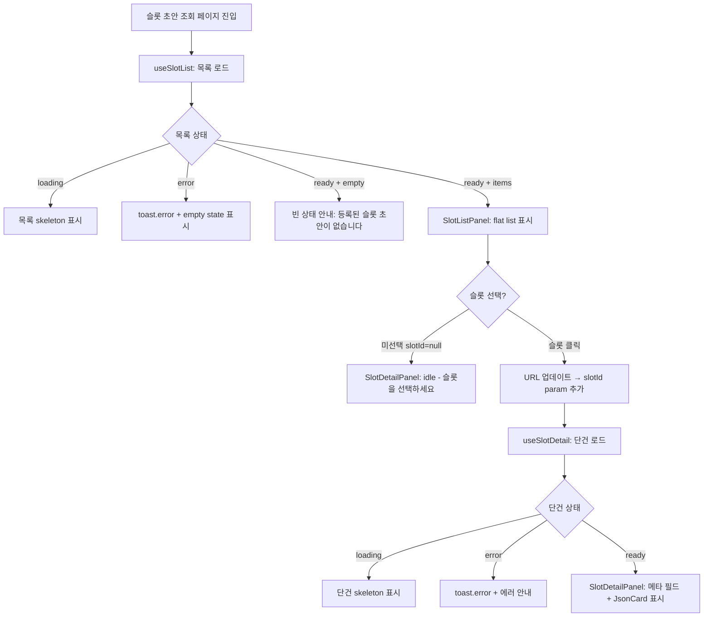

# [FE] 2.2.8 Slot / Slot Status 초안 조회

## Goal

Domain Pack Version에 속한 Slot 정의 목록과 단건 상세를 조회하는 두-패널 읽기 전용 화면을 구현한다. `intent-draft-read` feature 패턴을 준용한다.

---

## User Flow Chart



---

## Design Diff

### As-is vs To-be

| 영역 | As-is | To-be | 변경 내용 |
|------|-------|-------|----------|
| Slot 초안 조회 화면 | 없음 | 신규 | `slot-draft-read` feature + `SlotDraftReadPage` 추가 |
| App.tsx 라우팅 | Slot 라우트 없음 | `/workspaces/:wsId/domain-packs/:packId/versions/:versionId/slots/:slotId?` | PrivateRoute로 등록 |

### Design Constraints (frontend/DESIGN.md 기준)

- 색상: `#000000` / `#ffffff` (interface chrome)
- 타이포그래피: `figmaSans` primary, `figmaMono` labels
- border-radius: container 6px, card/dialog 8px
- spacing base unit: 8px
- focus outline: dashed

---

## Component Tree

```
SlotDraftReadPage
└── DashboardLayout
    └── pageWrapper
        ├── pageHeader
        │   ├── breadcrumb (WS · {wsId} / PACK · {pId} / VER · {vId})
        │   └── versionMeta ("Slot 초안 조회" + "READ ONLY" badge)
        ├── backButton (hasSelection 시만 표시 → handleBack)
        └── twoPane [hasSelection 클래스 조건부 적용]
            ├── listSlot
            │   └── SlotListPanel
            │       ├── loading: skeleton
            │       ├── error: empty state (에러 메시지)
            │       ├── ready + empty: "등록된 슬롯 초안이 없습니다." 안내
            │       └── ready + items: SlotListRow × N (flat list, slot_code ASC)
            │           └── SlotListRow: slotCode, name, status badge, dataType
            │               aria-pressed={true|false} (selectedId 일치 시)
            └── detailSlot
                └── SlotDetailPanel
                    ├── idle: "슬롯을 선택하세요" 안내
                    ├── loading: skeleton
                    ├── error: toast.error() + 에러 안내 (404 분기 메시지 포함)
                    └── ready: SlotDefinition 상세
                        ├── 메타 필드 (slotCode, name, description, dataType,
                        │             isSensitive, status, createdAt, updatedAt)
                        └── JsonCard × 3 (validationRuleJson, defaultValueJson, metaJson)
```

---

## API Integration

### Endpoints

| Method | Path | Response | 출처 |
|--------|------|----------|------|
| GET | `/api/v1/workspaces/{workspaceId}/domain-packs/{packId}/versions/{versionId}/slots` | `SlotSummary[]` (10필드, JSON 필드 제외) | BE spec `.agent/specs/3211.md` |
| GET | `/api/v1/workspaces/{workspaceId}/domain-packs/{packId}/versions/{versionId}/slots/{slotId}` | `SlotDefinition` (13필드, JSON 필드 포함) | BE spec `.agent/specs/3211.md` |

**API 클라이언트**: `entities/slot/api` → `slotApi.list()`, `slotApi.detail()` (이미 구현됨, 별도 feature API 파일 불필요)

**에러 코드**:

| HTTP | code | 발생 조건 |
|------|------|----------|
| 403 | `FORBIDDEN` | workspace 접근 권한 없음 |
| 404 | `DOMAIN_PACK_VERSION_NOT_FOUND` | version 미존재 |
| 404 | `SLOT_DEFINITION_NOT_FOUND` | slot 미존재 |

### State Types

```typescript
// slot-draft-read/model/useSlotList.ts
export type SlotListState =
  | { status: "loading" }
  | { status: "error"; code: string; message: string; httpStatus?: number }
  | { status: "ready"; data: SlotSummary[] };

// slot-draft-read/model/useSlotDetail.ts
export type SlotDetailState =
  | { status: "idle" }
  | { status: "loading" }
  | { status: "error"; code: string; message: string; httpStatus?: number }
  | { status: "ready"; data: SlotDefinition };
```

---

## Data Flow

```
SlotDraftReadPage (URL: /...slots/:slotId?)
  ├── SlotListPanel
  │     └── useSlotList(wsId, packId, versionId)
  │           └── slotApi.list(wsId, packId, versionId)  [entities/slot]
  │                 └── GET /api/v1/.../slots → SlotSummary[]
  └── SlotDetailPanel
        └── useSlotDetail(wsId, packId, versionId, slotId | null)
              └── slotApi.detail(wsId, packId, versionId, slotId)  [entities/slot]
                    └── GET /api/v1/.../slots/{slotId} → SlotDefinition
```

---

## 수정 대상 파일

| 파일 | 유형 | 역할 |
|------|------|------|
| `src/features/slot-draft-read/model/mapApiError.ts` | new | `ApiRequestError` → error state 변환 (intent-draft-read 동일 구현, U2 참조) |
| `src/features/slot-draft-read/model/useSlotList.ts` | new | Slot 목록 상태 훅 (SlotListState, useEffect + cancellation 패턴) |
| `src/features/slot-draft-read/model/useSlotList.test.ts` | new | useSlotList 단위 테스트 |
| `src/features/slot-draft-read/model/useSlotDetail.ts` | new | Slot 단건 상태 훅 (SlotDetailState, slotId=null → idle) |
| `src/features/slot-draft-read/model/useSlotDetail.test.ts` | new | useSlotDetail 단위 테스트 |
| `src/features/slot-draft-read/ui/SlotListPanel.tsx` | new | flat list 패널 (3종 세트: loading/error/empty/ready) |
| `src/features/slot-draft-read/ui/SlotListPanel.module.css` | new | SlotListPanel 스타일 |
| `src/features/slot-draft-read/ui/SlotDetailPanel.tsx` | new | 단건 상세 패널 (4종 세트: idle/loading/error/ready) + JsonCard |
| `src/features/slot-draft-read/ui/SlotDetailPanel.module.css` | new | SlotDetailPanel 스타일 |
| `src/features/slot-draft-read/ui/index.ts` | new | `SlotListPanel`, `SlotDetailPanel` 재수출 |
| `src/pages/domain-pack/ui/SlotDraftReadPage.tsx` | new | 페이지 컴포넌트 (IntentDraftReadPage 패턴 준용) |
| `src/pages/domain-pack/ui/slot-draft-read-page.module.css` | new | 페이지 레이아웃 스타일 (intent-draft-read-page.module.css 클래스 패턴 준용) |
| `src/app/App.tsx` | modify | slot 라우트 2개 등록 (`:slotId?` optional + `:slotId` explicit) |

---

## State Management

### Server State

TanStack Query 미사용. `useEffect` + cancellation 패턴 (`intent-draft-read` 일관성 유지).

- `requestKey = \`${wsId}:${packId}:${versionId}\`` — stale 응답 방지
- `slotId` 변경 시 useSlotDetail 내부에서 `{ status: "loading" }` 재진입

### Client State

- `slotId`: URL path param (`useParams`)으로만 관리, 별도 Zustand store 불필요
- `handleSelect(id)`: `navigate(.../slots/${id})`
- `handleBack()`: `navigate(.../slots)`

---

## Tests

### Test Strategy

| 구분 | 방법 | 도구 | 비고 |
|------|------|------|------|
| 훅 단위 테스트 | `vi.mock` + renderHook | Vitest | loading/ready/error/idle 상태 검증 |
| 수동 통합 확인 | 브라우저 직접 확인 | pnpm dev | 실제 BE API 연결 |

### Test Environment

| 항목 | 값 |
|------|---|
| 환경 | `pnpm test` (Vitest) |
| API Mock | `vi.mock("@/entities/slot", ...)` |
| 사전 조건 | BE API 구현 완료 (확인됨) |

### Test Scenarios

#### useSlotList

| # | 시나리오 | 사전 조건 | 기대 결과 |
|---|---------|---------|----------|
| 1 | 초기 상태 | - | `{ status: "loading" }` |
| 2 | 정상 응답 | `slotApi.list` mock → `SlotSummary[]` | `{ status: "ready", data }` |
| 3 | 빈 배열 응답 | `slotApi.list` mock → `[]` | `{ status: "ready", data: [] }` |
| 4 | ApiRequestError (403) | `slotApi.list` reject → `ApiRequestError(403, "FORBIDDEN")` | `{ status: "error", code: "FORBIDDEN", httpStatus: 403 }` |
| 5 | 알 수 없는 오류 | `slotApi.list` reject → `new Error("net")` | `{ status: "error", code: "UNKNOWN_ERROR" }` |

#### useSlotDetail

| # | 시나리오 | 사전 조건 | 기대 결과 |
|---|---------|---------|----------|
| 1 | `slotId = null` | - | `{ status: "idle" }` |
| 2 | 정상 응답 | `slotApi.detail` mock → `SlotDefinition` (13필드) | `{ status: "ready", data }` (validationRuleJson 포함 확인) |
| 3 | 404 (slot not found) | `slotApi.detail` reject → `ApiRequestError(404, "SLOT_DEFINITION_NOT_FOUND")` | `{ status: "error", code: "SLOT_DEFINITION_NOT_FOUND", httpStatus: 404 }` |
| 4 | ApiRequestError (403) | `slotApi.detail` reject → `ApiRequestError(403, "FORBIDDEN")` | `{ status: "error", code: "FORBIDDEN", httpStatus: 403 }` |

#### 브라우저 수동 확인 (Happy Path)

| # | 시나리오 | 조작 | 기대 결과 |
|---|---------|------|----------|
| 1 | 슬롯 목록 진입 | `/workspaces/1/domain-packs/1/versions/1/slots` | flat list (slot_code ASC) 표시 |
| 2 | 슬롯 선택 | 목록 row 클릭 | URL에 slotId 추가, 우측 패널 상세 표시 |
| 3 | 목록으로 돌아가기 | "← 목록" 버튼 클릭 | slotId 제거, 우측 패널 idle 복귀 |
| 4 | 빈 목록 | slot 0개인 version | "등록된 슬롯 초안이 없습니다." 안내 표시 |
| 5 | 잘못된 URL | `/workspaces/abc/...` | "잘못된 URL 파라미터입니다." 표시 |

#### 브라우저 수동 확인 (Error & Edge Cases)

| # | 시나리오 | 조작 | 기대 결과 |
|---|---------|------|----------|
| 1 | 403 에러 | 권한 없는 workspace | `toast.error()` 표시 |
| 2 | 404 (slot) | 삭제된 slotId로 직접 URL 접근 | `toast.error()` + 404 분기 에러 메시지 |
| 3 | 단건 nullable JSON 필드 null | `defaultValueJson = null` (DB nullable 허용) | JsonCard null 처리 표시 |

#### 반응형 & 접근성

| # | 확인 항목 | 기대 결과 |
|---|---------|----------|
| 1 | 모바일 (375px) | 단일 패널 전환 또는 패널 축소 레이아웃 |
| 2 | 데스크톱 (1280px+) | two-pane 레이아웃 |
| 3 | 키보드 탐색 | Tab + Enter로 슬롯 row 선택 가능 |
| 4 | 스크린 리더 | `aria-pressed` (선택된 row), `aria-label` (breadcrumb nav) |

---

## Implementation Example

```typescript
// features/slot-draft-read/model/useSlotList.ts
import { useEffect, useState } from "react";
import { slotApi } from "@/entities/slot";
import { mapApiError } from "./mapApiError";
import type { SlotSummary } from "@/entities/slot";

export type SlotListState =
  | { status: "loading" }
  | { status: "error"; code: string; message: string; httpStatus?: number }
  | { status: "ready"; data: SlotSummary[] };

export function useSlotList(wsId: number, packId: number, versionId: number): SlotListState {
  const requestKey = `${wsId}:${packId}:${versionId}`;
  const [state, setState] = useState<{ requestKey: string; value: SlotListState }>({
    requestKey,
    value: { status: "loading" },
  });

  useEffect(() => {
    let cancelled = false;
    slotApi
      .list(wsId, packId, versionId)
      .then((data) => {
        if (!cancelled) setState({ requestKey, value: { status: "ready", data } });
      })
      .catch((e: unknown) => {
        if (!cancelled) setState({ requestKey, value: mapApiError(e) });
      });
    return () => { cancelled = true; };
  }, [packId, requestKey, versionId, wsId]);

  return state.requestKey === requestKey ? state.value : { status: "loading" };
}
```

```typescript
// pages/domain-pack/ui/SlotDraftReadPage.tsx
import { useNavigate, useParams } from "react-router-dom";
import { SlotListPanel, SlotDetailPanel } from "../../../features/slot-draft-read/ui";
import { parseRouteId } from "../../../shared/lib/parseRouteId";
import { DashboardLayout } from "../../../shared/ui/layout/DashboardLayout";
import styles from "./slot-draft-read-page.module.css";

export function SlotDraftReadPage() {
  const { workspaceId, packId, versionId, slotId } = useParams();
  const navigate = useNavigate();

  const wsId = parseRouteId(workspaceId);
  const pId = parseRouteId(packId);
  const vId = parseRouteId(versionId);
  const sId = slotId ? parseRouteId(slotId) : null;

  if (wsId === null || pId === null || vId === null || (slotId !== undefined && sId === null)) {
    return (
      <DashboardLayout>
        <div className={styles.invalidParams} role="alert">
          잘못된 URL 파라미터입니다.
        </div>
      </DashboardLayout>
    );
  }

  const handleSelect = (id: number) => {
    navigate(`/workspaces/${wsId}/domain-packs/${pId}/versions/${vId}/slots/${id}`);
  };

  const handleBack = () => {
    navigate(`/workspaces/${wsId}/domain-packs/${pId}/versions/${vId}/slots`);
  };

  const hasSelection = sId !== null;

  return (
    <DashboardLayout>
      <div className={styles.pageWrapper}>
        <header className={styles.pageHeader}>
          <nav className={styles.breadcrumb} aria-label="경로">
            <span>WS · {wsId}</span>
            <span className={styles.breadcrumbSeparator}>/</span>
            <span>PACK · {pId}</span>
            <span className={styles.breadcrumbSeparator}>/</span>
            <span>VER · {vId}</span>
          </nav>
          <div className={styles.versionMeta}>
            <span className={styles.versionTitle}>Slot 초안 조회</span>
            <span className={styles.versionBadge}>READ ONLY</span>
          </div>
        </header>
        {hasSelection && (
          <button type="button" className={styles.backButton} onClick={handleBack}>
            ← 목록
          </button>
        )}
        <div className={`${styles.twoPane} ${hasSelection ? styles.hasSelection : ""}`}>
          <div className={styles.listSlot}>
            <SlotListPanel
              wsId={wsId}
              packId={pId}
              versionId={vId}
              selectedId={sId}
              onSelect={handleSelect}
            />
          </div>
          <div className={styles.detailSlot}>
            <SlotDetailPanel wsId={wsId} packId={pId} versionId={vId} slotId={sId} />
          </div>
        </div>
      </div>
    </DashboardLayout>
  );
}
```

```typescript
// app/App.tsx 추가 라우트 (기존 line 36 이후)
<Route
  path="/workspaces/:workspaceId/domain-packs/:packId/versions/:versionId/slots/:slotId?"
  element={<PrivateRoute><SlotDraftReadPage /></PrivateRoute>}
/>
```

---

## Performance Considerations

- TanStack Query 미사용: `useEffect` + cancellation 패턴 유지 (`intent-draft-read` 일관성)
- Slot 목록은 flat list — 트리 변환 불필요, `buildSlotTree` 상응 함수 없음
- Slot 수 증가 시 가상 스크롤 검토 (현재 미적용, YAGNI)
- 슬롯 JSON 필드(`validationRuleJson` 등) 대용량 대비: `<pre><code>` pretty-print (IntentDetailPanel의 JsonCard 패턴 동일)
