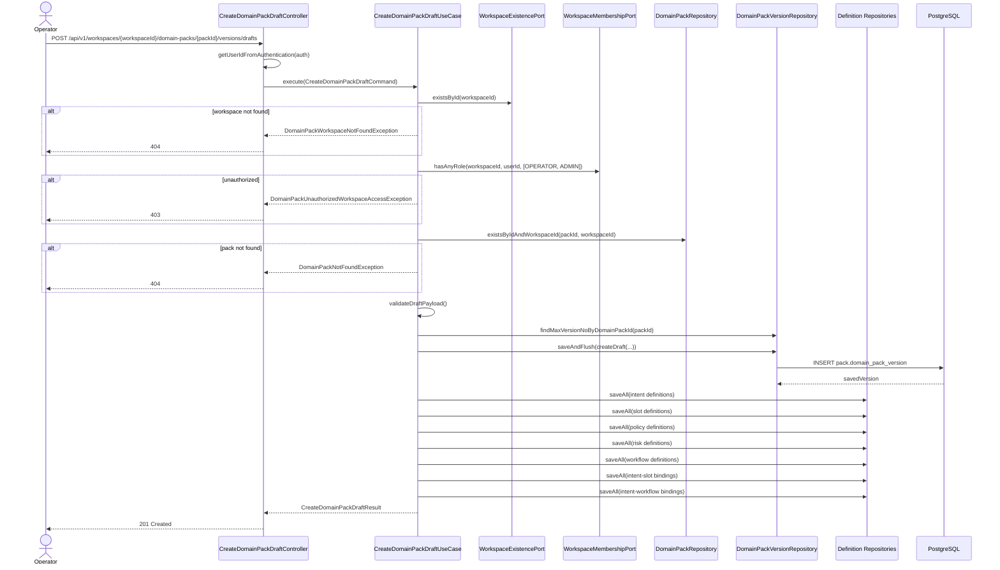
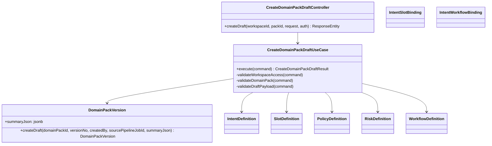

# [BE-231] Domain Pack 초안 생성 및 저장 API

> **Backlog**: 운영자가 파이프라인이 생성한 Domain Pack 초안을 저장하고 싶다 → 검토/승인 전에 초안 버전을 관리할 수 있게 하기 위해
> **Bounded Context**: `domainpack`
> **Template**: `_TEMPLATE_BE.md`
> **Branch**: `feature/231-domain-pack-draft-creation`

---

## Goal

운영자가 특정 `domain_pack`에 대해 새 `DRAFT` 버전을 생성하고, intent/slot/policy/risk/workflow 및 바인딩 초안을 한 번에 저장할 수 있게 한다.

추가로 `DomainPackVersion.summaryJson`은 PostgreSQL `jsonb` 컬럼으로 저장되며, Hibernate 런타임에서도 JSON 타입으로 바인딩되도록 보장한다.

---

## Sequence Diagram



---

## REST API

### Endpoint

| Method | Path | Description |
|--------|------|-------------|
| POST | `/api/v1/workspaces/{workspaceId}/domain-packs/{packId}/versions/drafts` | 특정 Domain Pack에 새 draft version과 하위 정의를 생성 |

### Path Variables

| Name | Type | Description |
|------|------|-------------|
| `workspaceId` | Long | 워크스페이스 ID |
| `packId` | Long | Domain Pack ID |

### Request

주요 요청 제약:

- `summaryJson`: 최대 10000자
- `intents`: 최대 200개
- `slots`: 최대 500개
- `intentSlotBindings`: 최대 1000개
- `policies`: 최대 200개
- `risks`: 최대 200개
- `workflows`: 최대 200개
- `intentWorkflowBindings`: 최대 500개
- `riskLevel`: `LOW`, `MEDIUM`, `HIGH`, `CRITICAL` 중 하나

```json
{
  "sourcePipelineJobId": 55,
  "summaryJson": "{\"summary\":\"draft\"}",
  "intents": [
    {
      "intentCode": "refund_request",
      "name": "환불 요청",
      "taxonomyLevel": 1
    }
  ],
  "slots": [
    {
      "slotCode": "order_id",
      "name": "주문 번호",
      "dataType": "STRING"
    }
  ],
  "intentSlotBindings": [
    {
      "intentCode": "refund_request",
      "slotCode": "order_id",
      "isRequired": true
    }
  ],
  "workflows": [
    {
      "workflowCode": "refund_flow",
      "name": "환불 플로우",
      "graphJson": "{\"nodes\":[]}"
    }
  ],
  "intentWorkflowBindings": [
    {
      "intentCode": "refund_request",
      "workflowCode": "refund_flow",
      "isPrimary": true
    }
  ]
}
```

### Response

**201 Created**

```json
{
  "versionId": 101,
  "domainPackId": 7,
  "versionNo": 3,
  "lifecycleStatus": "DRAFT",
  "sourcePipelineJobId": 55,
  "intentCount": 1,
  "slotCount": 1,
  "policyCount": 0,
  "riskCount": 0,
  "workflowCount": 1,
  "createdAt": "2026-04-10T09:00:00Z"
}
```

**400 Bad Request**

```json
{
  "code": "DOMAIN_PACK_DRAFT_INVALID_REQUEST",
  "message": "slot 참조를 찾을 수 없습니다. code=missing_slot"
}
```

**404 Not Found**

```json
{
  "code": "DOMAIN_PACK_NOT_FOUND",
  "message": "DomainPack not found: 7"
}
```

**403 Forbidden**

```json
{
  "code": "FORBIDDEN",
  "message": "워크스페이스에 접근 권한이 없습니다."
}
```

**409 Conflict**

```json
{
  "code": "DOMAIN_PACK_CONFLICT",
  "message": "동일 Domain Pack에 대한 draft version 생성 중 충돌이 발생했습니다. packId=7"
}
```

---

## Class Design

### DDD Layered Structure



---

## Tests

### Unit Tests

- 정상 생성 시 새 `DRAFT` 버전과 하위 정의 저장
- workspace 없음 → `DomainPackWorkspaceNotFoundException`
- domain pack 소속 불일치 → `DomainPackNotFoundException`
- 존재하지 않는 참조 코드 → `DomainPackDraftRequestInvalidException`

### Controller Tests

- 유효한 요청 → `201 Created`
- 잘못된 초안 참조 → `400 DOMAIN_PACK_DRAFT_INVALID_REQUEST`
- workspace 접근 권한 없음 → `403 FORBIDDEN`
- domain pack 없음 → `404 DOMAIN_PACK_NOT_FOUND`
- workspace 없음 → `404 DOMAIN_PACK_WORKSPACE_NOT_FOUND`
- 버전 충돌 → `409 DOMAIN_PACK_CONFLICT`
- 요청 바디 검증 실패 → `400 VALIDATION_ERROR`
- 인증 없음 → `401 Unauthorized`

### Repository Tests

- `findByIdAndWorkspaceId`: 올바른 `workspaceId`와 `versionId`면 version 반환
- `findByIdAndWorkspaceId`: 다른 `workspaceId`면 `empty` 반환
- `DomainPackVersion.createDraft(...)`로 생성한 엔티티를 `saveAndFlush(...)` 했을 때 `createdAt`이 JPA lifecycle로 채워짐
