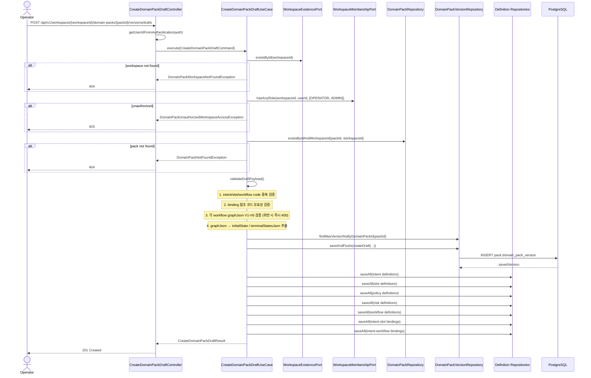

# [BE-231] Domain Pack 초안 생성 및 저장 API

> **Backlog**: 운영자가 파이프라인이 생성한 Domain Pack 초안을 저장하고 싶다 → 검토/승인 전에 초안 버전을 관리할 수 있게 하기 위해
> **Bounded Context**: `domainpack`
> **Template**: `_TEMPLATE_BE.md`
> **Branch**: `feature/231-domain-pack-draft-creation`

---

## Goal

운영자가 특정 `domain_pack`에 대해 새 `DRAFT` 버전을 생성하고, intent/slot/policy/risk/workflow 및 바인딩 초안을 한 번에 저장할 수 있게 한다.

추가로 `DomainPackVersion.summaryJson`은 PostgreSQL `jsonb` 컬럼으로 저장되며, Hibernate 런타임에서도 JSON 타입으로 바인딩되도록 보장한다.

저장 전에 각 workflow의 `graphJson`에 대해 `.agent/specs/226.md`에서 정의한 V1-V6 무결성 규칙을 `validateDraftPayload()` write path에서 강제하며, 위반 시 400 Bad Request를 반환한다.

---

## Sequence Diagram



---

## REST API

### Endpoint

| Method | Path | Description |
|--------|------|-------------|
| POST | `/api/v1/workspaces/{workspaceId}/domain-packs/{packId}/versions/drafts` | 특정 Domain Pack에 새 draft version과 하위 정의를 생성 |

### Path Variables

| Name | Type | Description |
|------|------|-------------|
| `workspaceId` | Long | 워크스페이스 ID |
| `packId` | Long | Domain Pack ID |

### Request

주요 요청 제약:

- `summaryJson`: 최대 10000자
- `intents`: 최대 200개
- `slots`: 최대 500개
- `intentSlotBindings`: 최대 1000개
- `policies`: 최대 200개
- `risks`: 최대 200개
- `workflows`: 최대 200개
- `workflows[].graphJson`: V1-V6 무결성 검증 대상 (`.agent/specs/226.md`). `initialState` / `terminalStatesJson`은 서버가 graphJson V1-V6 검증 후 자동 추출한다. 이 두 필드는 DTO에서 `@Null`로 선언되므로, 클라이언트가 값을 제공하면 400 `VALIDATION_ERROR`를 반환한다.
- `intentWorkflowBindings`: 최대 500개
- `riskLevel`: `LOW`, `MEDIUM`, `HIGH`, `CRITICAL` 중 하나

```json
{
  "sourcePipelineJobId": 55,
  "summaryJson": "{\"summary\":\"draft\"}",
  "intents": [
    {
      "intentCode": "refund_request",
      "name": "환불 요청",
      "taxonomyLevel": 1
    }
  ],
  "slots": [
    {
      "slotCode": "order_id",
      "name": "주문 번호",
      "dataType": "STRING"
    }
  ],
  "intentSlotBindings": [
    {
      "intentCode": "refund_request",
      "slotCode": "order_id",
      "isRequired": true
    }
  ],
  "workflows": [
    {
      "workflowCode": "refund_flow",
      "name": "환불 플로우",
      "graphJson": "{\"direction\":\"LR\",\"nodes\":[{\"id\":\"start\",\"label\":\"상담 시작\",\"type\":\"START\"},{\"id\":\"collect_order_id\",\"label\":\"주문번호 수집\",\"type\":\"ACTION\"},{\"id\":\"terminal\",\"label\":\"상담 종료\",\"type\":\"TERMINAL\"}],\"edges\":[{\"from\":\"start\",\"to\":\"collect_order_id\"},{\"from\":\"collect_order_id\",\"to\":\"terminal\"}]}"
    }
  ],
  "intentWorkflowBindings": [
    {
      "intentCode": "refund_request",
      "workflowCode": "refund_flow",
      "isPrimary": true
    }
  ]
}
```

### 변경 사항 — `WorkflowDraftRequest` 필드

`WorkflowDraftRequest`에서 `initialState` / `terminalStatesJson` 필드를 `@Null`로 교체한다. 완전히 제거하는 대신 `@Null`로 선언하면, 클라이언트가 값을 포함할 경우 Jackson 역직렬화 → Bean Validation 순서로 400 `VALIDATION_ERROR`를 반환한다.

**변경 전**

```java
public record WorkflowDraftRequest(
    @NotBlank String workflowCode,
    @NotBlank String name,
    @NotBlank @Size(max = 20000) String graphJson,
    @Size(max = 100) String initialState,        // @Null로 교체
    @Size(max = 5000) String terminalStatesJson  // @Null로 교체
) {}
```

**변경 후**

```java
public record WorkflowDraftRequest(
    @NotBlank String workflowCode,
    @NotBlank String name,
    @NotBlank @Size(max = 20000) String graphJson,
    @Null(message = "initialState는 서버에서 자동 추출됩니다. 요청에 포함하지 마십시오.") String initialState,
    @Null(message = "terminalStatesJson은 서버에서 자동 추출됩니다. 요청에 포함하지 마십시오.") String terminalStatesJson
) {}
```

### Response

**201 Created**

```json
{
  "versionId": 101,
  "domainPackId": 7,
  "versionNo": 3,
  "lifecycleStatus": "DRAFT",
  "sourcePipelineJobId": 55,
  "intentCount": 1,
  "slotCount": 1,
  "policyCount": 0,
  "riskCount": 0,
  "workflowCount": 1,
  "createdAt": "2026-04-10T09:00:00Z"
}
```

**400 Bad Request** — 바인딩 참조 코드 오류

```json
{
  "code": "DOMAIN_PACK_DRAFT_INVALID_REQUEST",
  "message": "slot 참조를 찾을 수 없습니다. code=missing_slot"
}
```

**400 Bad Request** — workflow graphJson 무결성 규칙(V1-V6) 위반 (각 케이스별 독립 응답 예시)

```json
{ "code": "WORKFLOW_INVALID_START_NODE", "message": "START 노드가 정확히 1개여야 합니다. workflowCode=refund_flow" }
```

```json
{ "code": "WORKFLOW_INVALID_TERMINAL_NODE", "message": "TERMINAL 노드가 1개 이상이어야 합니다. workflowCode=refund_flow" }
```

```json
{ "code": "WORKFLOW_DANGLING_EDGE", "message": "엣지가 존재하지 않는 노드를 참조합니다. workflowCode=refund_flow" }
```

```json
{ "code": "WORKFLOW_UNREACHABLE_NODE", "message": "도달 불가 노드가 존재합니다. workflowCode=refund_flow" }
```

```json
{ "code": "WORKFLOW_CYCLE_DETECTED", "message": "workflow 그래프에 사이클이 있습니다. workflowCode=refund_flow" }
```

```json
{ "code": "WORKFLOW_UNLABELED_BRANCH", "message": "DECISION 노드의 모든 outgoing edge에 label이 필요합니다. workflowCode=refund_flow" }
```

**404 Not Found**

```json
{
  "code": "DOMAIN_PACK_NOT_FOUND",
  "message": "DomainPack not found: 7"
}
```

**403 Forbidden**

```json
{
  "code": "FORBIDDEN",
  "message": "워크스페이스에 접근 권한이 없습니다."
}
```

**409 Conflict**

```json
{
  "code": "DOMAIN_PACK_CONFLICT",
  "message": "동일 Domain Pack에 대한 draft version 생성 중 충돌이 발생했습니다. packId=7"
}
```

---

## Class Design

### DDD Layered Structure


### Application Layer — validateDraftPayload

`validateDraftPayload(command)` 내 검증 순서:

1. intent code 중복 검증
2. slot code 중복 검증
3. workflow code 중복 검증
4. `intentSlotBindings` 참조 코드 유효성 (intent/slot code 목록 내 존재 여부)
5. `intentWorkflowBindings` 참조 코드 유효성 (intent/workflow code 목록 내 존재 여부)
6. 각 workflow `graphJson` V1-V6 검증 (`.agent/specs/226.md` 참조):
   - V1: `type == "START"` 노드 **정확히 1개** → `WorkflowInvalidStartNodeException`
   - V2: `type == "TERMINAL"` 노드 **1개 이상** → `WorkflowInvalidTerminalNodeException`
   - V3: `edges.from/to` 참조 노드 id 모두 `nodes`에 존재 → `WorkflowDanglingEdgeException`
   - V4: START에서 모든 노드 BFS/DFS 도달 가능 → `WorkflowUnreachableNodeException`
   - V5: 사이클 없음 (DAG) → `WorkflowCycleDetectedException`
   - V6: `DECISION` 노드 outgoing edge 전체에 `label` 존재 → `WorkflowUnlabeledBranchException`
7. V1-V6 통과 후 graphJson에서 자동 추출:
   - `initialState` = `type == "START"` 노드의 `id`
   - `terminalStatesJson` = `type == "TERMINAL"` 노드 `id` 목록을 JSON 배열 문자열로 직렬화 (예: `"[\"terminal\"]"`)

> 클라이언트 요청 DTO인 `WorkflowDraftRequest`에는 `initialState` / `terminalStatesJson` 필드를 클라이언트가 직접 설정할 수 없으며, 포함 시 400으로 거부한다. 서버가 V1-V6 검증 후 `graphJson`에서 자동 추출하여 내부 `WorkflowDraft` command record와 `WorkflowDefinition` 엔티티에 저장한다.

#### validateAndExtractWorkflows 구현 참고

```java
private List<WorkflowDraft> validateAndExtractWorkflows(CreateDomainPackDraftCommand command) {
    // 1. workflow code 중복 검증
    // 2. intentWorkflowBindings 참조 코드 유효성
    // 3. 각 workflow graphJson V1-V6 검증 후 추출
    return command.workflows().stream()
        .map(w -> {
            GraphJson graph = parseAndValidate(w.graphJson(), w.workflowCode()); // V1-V6
            String initialState = extractInitialState(graph);             // START 노드 id
            String terminalStatesJson = extractTerminalStatesJson(graph); // TERMINAL 노드 id 배열 JSON
            return new WorkflowDraft(w.workflowCode(), w.name(), w.graphJson(),
                                     initialState, terminalStatesJson);
        })
        .toList();
}
```

`WorkflowDraft` command record (`CreateDomainPackDraftCommand` 내부):

```java
// 요청에서는 initialState/terminalStatesJson 없음 — validateDraftPayload 이후 생성
public record WorkflowDraft(
    String workflowCode,
    String name,
    String graphJson,
    String initialState,        // 서버 추출값
    String terminalStatesJson   // 서버 추출값
) {}
```

**추출 로직 기준 (`.agent/specs/226.md:63-65`)**

| 필드 | 추출 방법 |
|------|-----------|
| `initialState` | `nodes[]` 중 `type == "START"` 노드의 `id` |
| `terminalStatesJson` | `nodes[]` 중 `type == "TERMINAL"` 노드의 `id` 목록 → JSON 배열 직렬화 (예: `"[\"terminal\"]"`) |

### 신규 예외 클래스

```java
import com.init.shared.application.exception.BadRequestException;

// backend/src/main/java/com/init/domainpack/application/exception/
public class WorkflowInvalidStartNodeException extends BadRequestException {
  public WorkflowInvalidStartNodeException(String workflowCode) {
    super("WORKFLOW_INVALID_START_NODE", "START 노드가 정확히 1개여야 합니다. workflowCode=" + workflowCode);
  }
}

public class WorkflowInvalidTerminalNodeException extends BadRequestException {
  public WorkflowInvalidTerminalNodeException(String workflowCode) {
    super("WORKFLOW_INVALID_TERMINAL_NODE", "TERMINAL 노드가 1개 이상이어야 합니다. workflowCode=" + workflowCode);
  }
}

public class WorkflowDanglingEdgeException extends BadRequestException {
  public WorkflowDanglingEdgeException(String workflowCode) {
    super("WORKFLOW_DANGLING_EDGE", "엣지가 존재하지 않는 노드를 참조합니다. workflowCode=" + workflowCode);
  }
}

public class WorkflowUnreachableNodeException extends BadRequestException {
  public WorkflowUnreachableNodeException(String workflowCode) {
    super("WORKFLOW_UNREACHABLE_NODE", "도달 불가 노드가 존재합니다. workflowCode=" + workflowCode);
  }
}

public class WorkflowCycleDetectedException extends BadRequestException {
  public WorkflowCycleDetectedException(String workflowCode) {
    super("WORKFLOW_CYCLE_DETECTED", "workflow 그래프에 사이클이 있습니다. workflowCode=" + workflowCode);
  }
}

public class WorkflowUnlabeledBranchException extends BadRequestException {
  public WorkflowUnlabeledBranchException(String workflowCode) {
    super("WORKFLOW_UNLABELED_BRANCH", "DECISION 노드의 모든 outgoing edge에 label이 필요합니다. workflowCode=" + workflowCode);
  }
}
```

---

## Tests

### Unit Tests

- 정상 생성 시 새 `DRAFT` 버전과 하위 정의 저장
- workspace 없음 → `DomainPackWorkspaceNotFoundException`
- domain pack 소속 불일치 → `DomainPackNotFoundException`
- 존재하지 않는 참조 코드 → `DomainPackDraftRequestInvalidException`
- graphJson V1 위반: START 노드 0개 → `WorkflowInvalidStartNodeException`
- graphJson V1 위반: START 노드 2개 → `WorkflowInvalidStartNodeException`
- graphJson V2 위반: TERMINAL 노드 없음 → `WorkflowInvalidTerminalNodeException`
- graphJson V3 위반: edge가 없는 노드 id 참조 → `WorkflowDanglingEdgeException`
- graphJson V4 위반: START에서 도달 불가 노드 존재 → `WorkflowUnreachableNodeException`
- graphJson V5 위반: 사이클 존재 → `WorkflowCycleDetectedException`
- graphJson V6 위반: DECISION 노드 outgoing edge에 label 없음 → `WorkflowUnlabeledBranchException`
- graphJson V1-V6 통과 시 `initialState`가 START 노드 id로 추출되어 저장됨
- graphJson V1-V6 통과 시 `terminalStatesJson`이 TERMINAL 노드 id 배열 JSON으로 추출되어 저장됨
- TERMINAL 노드 복수 개일 때 `terminalStatesJson` 배열에 모두 포함됨

### Controller Tests

- 유효한 요청 → `201 Created`
- 잘못된 초안 참조 → `400 DOMAIN_PACK_DRAFT_INVALID_REQUEST`
- workspace 접근 권한 없음 → `403 FORBIDDEN`
- domain pack 없음 → `404 DOMAIN_PACK_NOT_FOUND`
- workspace 없음 → `404 DOMAIN_PACK_WORKSPACE_NOT_FOUND`
- 버전 충돌 → `409 DOMAIN_PACK_CONFLICT`
- 요청 바디 검증 실패 → `400 VALIDATION_ERROR`
- 인증 없음 → `401 Unauthorized`
- graphJson V1 위반 (START 0개) → `400 WORKFLOW_INVALID_START_NODE`
- graphJson V2 위반 (TERMINAL 없음) → `400 WORKFLOW_INVALID_TERMINAL_NODE`
- graphJson V3 위반 (dangling edge) → `400 WORKFLOW_DANGLING_EDGE`
- graphJson V4 위반 (unreachable node) → `400 WORKFLOW_UNREACHABLE_NODE`
- graphJson V5 위반 (cycle) → `400 WORKFLOW_CYCLE_DETECTED`
- graphJson V6 위반 (unlabeled branch) → `400 WORKFLOW_UNLABELED_BRANCH`
- 요청에 `workflows[].initialState` 포함 시 → `400 VALIDATION_ERROR`
- 요청에 `workflows[].terminalStatesJson` 포함 시 → `400 VALIDATION_ERROR`

### Repository Tests

- `findByIdAndWorkspaceId`: 올바른 `workspaceId`와 `versionId`면 version 반환
- `findByIdAndWorkspaceId`: 다른 `workspaceId`면 `empty` 반환
- `DomainPackVersion.createDraft(...)`로 생성한 엔티티를 `saveAndFlush(...)` 했을 때 `createdAt`이 JPA lifecycle로 채워짐

---

## Additional Notes

- graphJson 파싱 및 V1-V6 검증 로직은 독립 헬퍼 클래스(`WorkflowGraphValidator` 또는 유사)로 분리하는 것을 권장한다 — `validateDraftPayload()` 인라인 구현 시 테스트 격리 어려움.
- V1-V6은 workflow 단위로 독립 검증하며, 첫 번째 위반 발생 시 즉시 예외를 던진다 (fail-fast).
- graphJson 스키마 및 V1-V6 규칙 원본 정의: `.agent/specs/226.md`.
