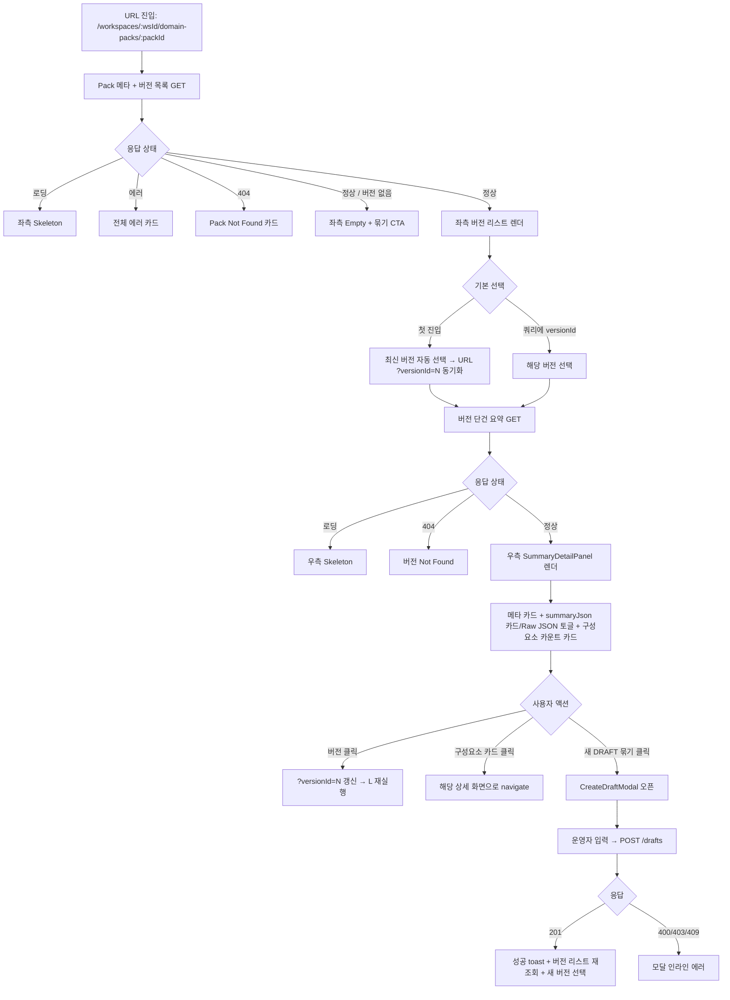

# [FE-232] Console — Domain Pack 요약 화면

> **Backlog**: 운영자가 한 Domain Pack의 버전별 요약(메타 + 구성요소 카운트/요약) 화면을 통해 실행 가능한 도메인 설정을 한눈에 파악하고, 새 DRAFT 버전 묶기를 트리거할 수 있게 한다.
> **Layer**: Frontend (Operator Console)
> **Template**: `.agent/specs/_TEMPLATE_FE.md`
> **Branch**: `spec/232`
> **Depends on**:
> - `.agent/specs/231.md` — POST `/drafts` (Domain Pack 초안 생성)
> - `.agent/specs/226.md` — workflow 읽기 API
> - `.agent/specs/219.md` — intent 읽기 API
> - `.agent/specs/3211.md` — slot 읽기 API
> - `frontend/DESIGN.md` — 타이포/팔레트/radius/focus outline
> - `ebb9304` (PR #51) — DESIGN.md 기반 main 토큰
> **불확실성 항목**: `.handoff/232/uncertainty-register-232.md` 참조

---

## Goal

`/workspaces/:workspaceId/domain-packs/:packId` 진입 시, 해당 Domain Pack의 메타 정보와 버전 리스트를 좌측 패널에 표시하고, 선택된 버전의 요약(메타 + summaryJson + 구성요소 카운트 + 각 컴포넌트 그룹 요약 카드)을 우측 패널에 표시한다. 운영자는 본 화면에서 "새 DRAFT 묶기" 액션을 트리거하여 `POST /drafts`(231)를 호출할 수 있다.

본 스펙은 Domain Pack 단위 **요약/탐색 hub** 역할이며, 컴포넌트별 상세 화면(workflow=2.2.7, slot=2.2.8, policy=2.2.10, risk=2.2.12, workflow node/edge=2.2.14)은 본 스펙 범위 밖이다. 본 화면은 각 상세 화면으로의 진입점만 제공한다.

---

## User Flow Chart



---

## Design Diff

### As-is vs To-be

| 영역 | As-is | To-be | 변경 내용 |
|------|-------|-------|----------|
| Domain Pack 콘솔 | `pages/domain-pack/ui/WorkflowDraftReadPage` 만 존재 (단일 버전의 workflow 조회) | Pack 단위 요약 hub 페이지 추가 (`DomainPackSummaryPage`) | 신규 페이지 |
| 버전 탐색 UX | 직접 URL 입력 (`.../versions/:versionId/workflows`) 외 진입점 없음 | 좌측 버전 리스트로 탐색 가능 | 신규 |
| 초안 생성 트리거 | 콘솔 외부(파이프라인/CLI) | 본 화면에서 운영자 트리거 가능 | 신규 |
| summaryJson 표시 | 없음 | 카드(키-값) + Raw JSON 토글 | 신규 |
| 컴포넌트 카운트 | 없음 | intent/slot/policy/risk/workflow 카운트 카드 | 신규 |

### 디자인 토큰 (ebb9304 main 기준 재사용)

`frontend/src/app/index.css`의 전역 변수와 `frontend/src/index.css`의 shadcn HSL 변수, 전역 focus(`*:focus-visible { outline: dashed 2px; outline-offset: 2px; }`)를 그대로 사용한다. 신규 hex/rgba 색상 도입 금지. 폰트는 main의 `Pretendard Variable` / `Geist Mono`(monospace) 그대로.

---

## Component Tree

```text
DomainPackSummaryPage (pages/domain-pack/ui/DomainPackSummaryPage.tsx)
├─ DashboardLayout (shared/ui/layout)
├─ PageHeader
│    ├─ Breadcrumb (WS · {wsId} / PACK · {packId})
│    ├─ PackTitleStrip (pack name, code, latest versionNo / lifecycleStatus 뱃지)
│    └─ HeaderActions
│         └─ CreateDraftButton  (모달 오픈)
├─ TwoPaneLayout
│    ├─ VersionListPanel (좌측)
│    │    ├─ ListHeader (총 버전 수)
│    │    ├─ VersionListItem[]
│    │    │    ├─ VersionNoLabel (Geist Mono — "v3")
│    │    │    ├─ LifecycleStatusBadge (DRAFT / IN_REVIEW / APPROVED / PUBLISHED / ARCHIVED)
│    │    │    ├─ SourceBadge (sourcePipelineJobId 존재 → "PIPELINE", 없으면 "MANUAL")
│    │    │    └─ CreatedAt (timeago)
│    │    ├─ LoadingSkeleton
│    │    └─ EmptyState (버전 없음 + 묶기 CTA)
│    └─ SummaryDetailPanel (우측)
│         ├─ DetailHeader (versionNo / lifecycleStatus / sourcePipelineJobId / createdAt)
│         ├─ SummaryJsonCard
│         │    ├─ ViewModeToggle ("카드" | "Raw JSON")
│         │    ├─ KeyedCardView   (summaryJson을 키-값 그리드로 표시)
│         │    └─ RawJsonView     (<pre><code> 블록)
│         ├─ ComponentCountGrid
│         │    ├─ IntentCountCard   ("intent · 24" → /workspaces/.../intents)
│         │    ├─ SlotCountCard     ("slot · 17"  → /workspaces/.../slots)
│         │    ├─ PolicyCountCard   ("policy · 5" → /workspaces/.../policies, FE 상세 화면 미구현 시 disabled — U-FE-232-2 Confirmed)
│         │    ├─ RiskCountCard     ("risk · 3"   → /workspaces/.../risks, FE 상세 화면 미구현 시 disabled — U-FE-232-3 Confirmed)
│         │    └─ WorkflowCountCard ("workflow · 8" → /workspaces/.../workflows)
│         ├─ DetailLoadingState
│         ├─ DetailErrorState
│         └─ PlaceholderState (버전 미선택)
└─ CreateDraftModal (features/domain-pack-draft-create/ui)
     ├─ ModalHeader ("새 DRAFT 묶기")
     ├─ DraftPayloadEditor    (입력 방식은 U-FE-232-5 결정 후 확정)
     ├─ ValidationFeedback    (서버 400 응답의 필드별 에러 표시)
     └─ ModalFooter (취소 / 묶기 제출)
```

> 모든 컴포넌트는 CSS 모듈(`*.module.css`)로 작성하고 main의 전역 변수만 참조한다.

---

## API Integration

### Endpoints (소비)

| Method | Path | 출처 | 본 스펙에서 용도 |
|--------|------|------|------------------|
| GET | `/api/v1/workspaces/{workspaceId}/domain-packs/{packId}` | **N/A — BE 미존재 (U-FE-232-1)** | Pack 메타 + 버전 목록 |
| GET | `/api/v1/workspaces/{workspaceId}/domain-packs/{packId}/versions/{versionId}` | **N/A — BE 미존재 (U-FE-232-1)** | 단건 버전 메타 + summaryJson + 구성요소 카운트 |
| POST | `/api/v1/workspaces/{workspaceId}/domain-packs/{packId}/versions/drafts` | spec/231 (구현 완료) | DRAFT 묶기 |
| GET | `/api/v1/workspaces/{workspaceId}/domain-packs/{packId}/versions/{versionId}/intents` | spec/219 | (선택) intent 카운트 폴백 |
| GET | `/api/v1/workspaces/{workspaceId}/domain-packs/{packId}/versions/{versionId}/slots` | spec/3211 | (선택) slot 카운트 폴백 |
| GET | `/api/v1/workspaces/{workspaceId}/domain-packs/{packId}/versions/{versionId}/workflows` | spec/226 | (선택) workflow 카운트 폴백 |

> Pack 메타/버전 목록 GET와 단건 버전 요약 GET 두 엔드포인트가 BE에 존재하지 않는다. 본 스펙은 두 GET API의 신규 BE 스펙이 선행되어야 진행 가능하다 (U-FE-232-1). 정책/리스크 GET 미존재(U-FE-232-2/3) 동안에는 해당 카드만 disabled 처리한다.

### TypeScript 타입 (가정 응답 형식 — BE 확정 시 동기화 필요)

```ts
// entities/domain-pack/model/types.ts
// BE 확정값: DRAFT, PUBLISHED — 나머지는 U-FE-232-7 결정 대기 (Needs Input)
export type DomainPackLifecycleStatus =
  | 'DRAFT'
  | 'IN_REVIEW'
  | 'APPROVED'
  | 'PUBLISHED'
  | 'ARCHIVED';

export interface DomainPackVersionSummary {
  versionId: number;
  versionNo: number;
  lifecycleStatus: DomainPackLifecycleStatus;
  sourcePipelineJobId: number | null;
  createdAt: string;  // ISO-8601
  updatedAt: string;
}

export interface DomainPackDetail {
  packId: number;
  workspaceId: number;
  code: string;
  name: string;
  description: string | null;
  versions: DomainPackVersionSummary[];
  createdAt: string;
  updatedAt: string;
}

export interface DomainPackVersionDetail {
  versionId: number;
  packId: number;
  versionNo: number;
  lifecycleStatus: DomainPackLifecycleStatus;
  sourcePipelineJobId: number | null;
  summaryJson: string;     // 문자열로 직렬화된 JSON object (jsonb를 string으로 받음 — U-FE-232-1에서 확정)
  intentCount: number;
  slotCount: number;
  policyCount: number;
  riskCount: number;
  workflowCount: number;
  createdAt: string;
  updatedAt: string;
}
```

> `summaryJson` 직렬화 형태(string vs object)와 키 스키마는 BE 미확정이므로 U-FE-232-1, U-FE-232-4에서 확정한다.

### POST 요청/응답

POST `/drafts` 요청/응답 스키마는 `.agent/specs/231.md` 정의를 그대로 사용한다. 본 스펙은 신규 BE 변경을 요구하지 않는다.

### API 모듈 (service object 패턴)

```ts
// features/domain-pack-summary-read/api/domainPackApi.ts
import { apiClient } from '../../../shared/api';
import type {
  DomainPackDetail,
  DomainPackVersionDetail,
} from '../../../entities/domain-pack/model/types';

export const domainPackApi = {
  detail: (wsId: number, packId: number) =>
    apiClient.get<DomainPackDetail>(
      `/workspaces/${wsId}/domain-packs/${packId}`,
    ),

  versionDetail: (wsId: number, packId: number, versionId: number) =>
    apiClient.get<DomainPackVersionDetail>(
      `/workspaces/${wsId}/domain-packs/${packId}/versions/${versionId}`,
    ),
};
```

```ts
// features/domain-pack-draft-create/api/createDraftApi.ts
import { apiClient } from '../../../shared/api';
import type { CreateDomainPackDraftRequest, CreateDomainPackDraftResponse }
  from '../../../entities/domain-pack/model/createDraft';

export const createDraftApi = {
  create: (wsId: number, packId: number, payload: CreateDomainPackDraftRequest) =>
    apiClient.post<CreateDomainPackDraftResponse>(
      `/workspaces/${wsId}/domain-packs/${packId}/versions/drafts`,
      payload,
    ),
};
```

### 상태 훅 (기존 패턴 유지 — discriminated-union)

```ts
// features/domain-pack-summary-read/model/usePackDetail.ts
import { useEffect, useState } from 'react';
import { domainPackApi } from '../api/domainPackApi';
import { ApiRequestError } from '../../../shared/api';
import type { DomainPackDetail } from '../../../entities/domain-pack/model/types';

type State =
  | { status: 'loading' }
  | { status: 'error'; code: string; message: string }
  | { status: 'ready'; data: DomainPackDetail };

export function usePackDetail(wsId: number, packId: number, refreshKey: number) {
  const [state, setState] = useState<State>({ status: 'loading' });

  useEffect(() => {
    let cancelled = false;
    setState({ status: 'loading' });
    domainPackApi.detail(wsId, packId)
      .then((data) => { if (!cancelled) setState({ status: 'ready', data }); })
      .catch((e) => {
        if (cancelled) return;
        if (e instanceof ApiRequestError) {
          setState({ status: 'error', code: e.code, message: e.message });
        } else {
          setState({ status: 'error', code: 'UNKNOWN_ERROR', message: '알 수 없는 오류가 발생했습니다.' });
        }
      });
    return () => { cancelled = true; };
  }, [wsId, packId, refreshKey]);

  return state;
}
```

`useVersionDetail`도 동일 패턴으로 작성한다. `refreshKey`는 새 DRAFT 묶기 성공 시 증분되어 목록과 단건을 모두 재요청하게 한다.

---

## Data Flow

```text
Route (/workspaces/:workspaceId/domain-packs/:packId)
  │  ?versionId=N (optional, 선택 버전 동기화)
  ▼
DomainPackSummaryPage (pages/domain-pack)
  ├─ usePackDetail(wsId, packId, refreshKey)         ── features/domain-pack-summary-read/model
  │     ▼
  │   domainPackApi.detail
  │     ▼
  │   shared/api (apiClient)
  │     ▼
  │   BE GET /api/v1/workspaces/{wsId}/domain-packs/{packId}   [U-FE-232-1]
  │
  ├─ useVersionDetail(wsId, packId, selectedVersionId, refreshKey)
  │     ▼
  │   BE GET /api/v1/workspaces/{wsId}/domain-packs/{packId}/versions/{versionId}  [U-FE-232-1]
  │
  └─ CreateDraftModal (features/domain-pack-draft-create)
        └─ createDraftApi.create
             ▼
           BE POST /api/v1/workspaces/{wsId}/domain-packs/{packId}/versions/drafts  (spec/231)
             ▼
           on 201 → setRefreshKey(k => k + 1) + setSelectedVersionId(response.versionId) + toast
```

UI → features 훅 → shared/api 방향만 허용. `entities/domain-pack`은 타입/상수만 보유한다.

---

## 수정 대상 파일

| 파일 | 변경 유형 | 설명 |
|------|----------|------|
| `src/entities/domain-pack/model/types.ts` | new | `DomainPackDetail`, `DomainPackVersionSummary`, `DomainPackVersionDetail`, `DomainPackLifecycleStatus` |
| `src/entities/domain-pack/model/createDraft.ts` | new | `CreateDomainPackDraftRequest`, `CreateDomainPackDraftResponse` (spec/231 미러) |
| `src/entities/domain-pack/index.ts` | new | 배럴 |
| `src/features/domain-pack-summary-read/api/domainPackApi.ts` | new | pack/version 단건 GET |
| `src/features/domain-pack-summary-read/model/usePackDetail.ts` | new | 목록 훅 |
| `src/features/domain-pack-summary-read/model/useVersionDetail.ts` | new | 단건 훅 |
| `src/features/domain-pack-summary-read/model/parseSummaryJson.ts` | new | string → object 파서 (실패 시 raw fallback + console.warn) |
| `src/features/domain-pack-summary-read/ui/VersionListPanel.tsx` (+ `.module.css`) | new | 좌측 버전 리스트 |
| `src/features/domain-pack-summary-read/ui/SummaryDetailPanel.tsx` (+ `.module.css`) | new | 우측 요약 상세 패널 |
| `src/features/domain-pack-summary-read/ui/SummaryJsonCard.tsx` (+ `.module.css`) | new | 카드/Raw JSON 토글 |
| `src/features/domain-pack-summary-read/ui/ComponentCountGrid.tsx` (+ `.module.css`) | new | 5종 카운트 카드 |
| `src/features/domain-pack-summary-read/ui/index.ts` | new | 배럴 |
| `src/features/domain-pack-draft-create/api/createDraftApi.ts` | new | POST /drafts 호출 |
| `src/features/domain-pack-draft-create/model/useCreateDraft.ts` | new | 제출 mutation 훅 (loading/error/success 상태 + ApiRequestError 매핑) |
| `src/features/domain-pack-draft-create/ui/CreateDraftModal.tsx` (+ `.module.css`) | new | 묶기 모달 (입력 방식 U-FE-232-5) |
| `src/features/domain-pack-draft-create/ui/index.ts` | new | 배럴 |
| `src/pages/domain-pack/ui/DomainPackSummaryPage.tsx` (+ `.module.css`) | new | Pack 요약 hub 페이지 |
| `src/app/App.tsx` | modify | 라우트 `/workspaces/:workspaceId/domain-packs/:packId` 추가 |

> 신규 hex/rgba 상수 도입 금지. 모든 색/radius는 `frontend/src/app/index.css`의 전역 CSS 변수와 `frontend/src/index.css`의 shadcn 토큰을 참조한다.

---

## Routing

```tsx
// src/app/App.tsx (일부)
<Route
  path="/workspaces/:workspaceId/domain-packs/:packId"
  element={<PrivateRoute><DomainPackSummaryPage /></PrivateRoute>}
/>
```

- 선택된 버전은 query param `?versionId=N`로 동기화한다 (URL deep-link 가능, history 보존).
- 첫 진입 시 `versionId` 미지정이면 가장 최신(versionNo 기준 최대) 버전을 자동 선택하고 `replace: true`로 URL 동기화한다.
- 컴포넌트 카운트 카드 클릭 시 기존/예정 라우트로 navigate:
  - intent → `/workspaces/:wsId/domain-packs/:packId/versions/:versionId/intents` (FE 미존재 — 백로그 별도)
  - slot → 동일 패턴 (FE 백로그 2.2.8)
  - policy → 동일 패턴 (FE 백로그 2.2.10, BE GET 존재 확인 — U-FE-232-2 Confirmed)
  - risk → 동일 패턴 (FE 백로그 2.2.12, BE GET 존재 확인 — U-FE-232-3 Confirmed)
  - workflow → `/workspaces/:wsId/domain-packs/:packId/versions/:versionId/workflows` (FE-227 구현 완료)

> 진입 라우트가 없는 카드(intent/slot/policy/risk)는 onClick을 disabled하고 툴팁으로 "상세 화면 준비 중"을 표시한다.

---

## State Management

### Server State

TanStack Query 미도입. `useState + useEffect` 기반 discriminated-union 패턴(FE-227 정합).

- `usePackDetail(wsId, packId, refreshKey)` — Pack 메타 + 버전 목록
- `useVersionDetail(wsId, packId, versionId, refreshKey)` — 선택 버전 단건 요약
- 재요청 트리거: path param 또는 query `versionId` 변경, `refreshKey` 증분
- 묶기 성공 시: `refreshKey++`, `selectedVersionId = response.versionId`

### Client State

- `selectedVersionId`: URL `?versionId` SSOT. 컴포넌트 내부 상태 미보관.
- `summaryViewMode`: `'card' | 'raw'` 로컬 `useState`. URL 동기화 없음 (YAGNI).
- `isCreateModalOpen`: 로컬 `useState`. 모달 닫힘 시 form state 폐기.
- `refreshKey`: 페이지 컴포넌트 로컬 `useState<number>(0)`. 묶기 성공 후 +1.

---

## Tests

### Test Strategy

| 구분 | 방법 | 도구 | 비고 |
|------|------|------|------|
| 수동 테스트 | `pnpm dev` 로컬 확인 | Chrome DevTools | 라우팅/모달 동선 |
| 유닛 테스트 | 훅/파서 | vitest | `usePackDetail`, `useVersionDetail`, `useCreateDraft`, `parseSummaryJson` |
| 컴포넌트 테스트 | UI 렌더 + 상호작용 | vitest + @testing-library/react | VersionListPanel, SummaryDetailPanel, CreateDraftModal |
| E2E | 핵심 플로우 | Playwright | 진입 → 버전 선택 → 묶기 → 새 버전 자동 선택 |

### Test Environment

| 항목 | 값 |
|------|---|
| 환경 | `pnpm dev` + 로컬 BE (spec/231 + U-FE-232-1 BE 구현 후) |
| 인증 | `localStorage.accessToken` 주입된 상태 전제 |
| 테스트 시 API | `vi.mock('../../../shared/api')`로 `apiClient.get/post` 스텁 |

### Happy Path

| # | 시나리오 | 사전 조건 | 조작 | 기대 결과 |
|---|---------|---------|------|----------|
| 1 | 첫 진입 | 버전 3개 존재 | URL 직접 진입 | 좌 3개 리스트, 최신 버전 자동 선택, 우측 요약 렌더, URL `?versionId=N` 갱신 |
| 2 | 버전 전환 | 좌 리스트 로드됨 | 다른 버전 클릭 | URL `?versionId` 갱신, 우측 단건 GET 재요청, 새 요약 렌더 |
| 3 | summaryJson 카드 보기 | 단건 로드됨 | "카드" 토글 | summaryJson을 키-값 그리드로 표시 |
| 4 | summaryJson Raw 보기 | 단건 로드됨 | "Raw JSON" 토글 | `<pre><code>` 블록에 JSON 표시 |
| 5 | 컴포넌트 진입 | workflowCount > 0 | "workflow" 카드 클릭 | `/...workflows` 경로로 navigate |
| 6 | 묶기 성공 | DRAFT 가능 입력 | 묶기 버튼 → 모달 → 제출 | 모달 닫힘, 성공 toast, 좌 리스트 재조회, 새 버전 선택 |

### Error & Edge Cases

| # | 시나리오 | 조작 | 기대 결과 |
|---|---------|------|----------|
| 1 | Pack 404 | 미존재 packId 진입 | "Pack을 찾을 수 없습니다" 카드 |
| 2 | 버전 0개 | versions = [] | 좌 Empty + "새 DRAFT 묶기" CTA, 우 Placeholder |
| 3 | 단건 404 | 잘못된 `?versionId` | 우 Not Found, 좌 리스트 유지 |
| 4 | summaryJson 파싱 실패 | 손상 문자열 | "카드" 모드는 raw fallback + 경고 배너, Raw 모드는 정상 |
| 5 | 묶기 400 | 서버 검증 실패 | 모달 인라인 에러(필드별 메시지) |
| 6 | 묶기 403 | 권한 없음 | 모달 닫힘 + toast.error("접근 권한 없음") |
| 7 | 묶기 409 | 동시 충돌 | 모달 인라인 에러("동일 Pack 묶기 충돌") + 재시도 버튼 |
| 8 | 묶기 workflow V1-V6 위반 | graphJson 위반 | 모달 인라인 에러 (`.agent/specs/226.md` 코드별 메시지) |
| 9 | policy/risk FE 상세 화면 미구현 | 카운트 표시됨 / navigate disabled | 카드 disabled + 툴팁 "준비 중" |

### 반응형 & 접근성

| # | 확인 항목 | 기대 결과 |
|---|---------|----------|
| 1 | 데스크톱 ≥1024px | 좌 320px / 우 flex |
| 2 | 태블릿 768–1023px | 좌 260px / 우 flex |
| 3 | 모바일 <768px | 좌 → 상세 스택, 뒤로 버튼으로 좌 복귀 |
| 4 | 키보드 탐색 | 좌 리스트 Tab+Enter, 모달 첫 입력 자동 포커스 + Esc 닫기 |
| 5 | 포커스 가시성 | 전역 `dashed 2px` outline 유지 |
| 6 | 타이포 | `Pretendard Variable` / `Geist Mono`(versionNo, code), letter-spacing -0.14px |
| 7 | 색상 | main의 전역 변수만 사용, 신규 hex/rgba 도입 없음 |
| 8 | 모달 접근성 | role="dialog", aria-modal, focus trap, Esc/배경 클릭으로 닫기 |

### Test Checklist

- [ ] `usePackDetail` 로딩/에러/정상/빈 4상태 전이
- [ ] `useVersionDetail` 404 분기
- [ ] `useCreateDraft` 201/400/403/409 분기
- [ ] `parseSummaryJson` 정상/손상 fallback
- [ ] 좌 리스트에서 선택 항목 active 스타일
- [ ] URL `?versionId` 동기화(클릭 시 갱신, 뒤로가기로 이전 버전 복귀)
- [ ] 묶기 성공 후 새 버전 자동 선택 + 리스트 재조회
- [ ] 컴포넌트 카드 클릭 시 정확한 라우트로 navigate (workflow 한정 — 나머지는 disabled)
- [ ] 모달 focus trap + Esc 닫기 동작
- [ ] 신규 hex/rgba 상수 도입 없음 — 전역 CSS 변수만 참조 확인

---

## Implementation Example

### parseSummaryJson 파서

```ts
// features/domain-pack-summary-read/model/parseSummaryJson.ts
export type ParsedSummary =
  | { ok: true; data: Record<string, unknown> }
  | { ok: false; raw: string };

export function parseSummaryJson(json: string): ParsedSummary {
  try {
    const parsed: unknown = JSON.parse(json);
    if (parsed && typeof parsed === 'object' && !Array.isArray(parsed)) {
      return { ok: true, data: parsed as Record<string, unknown> };
    }
    console.warn('[parseSummaryJson] object가 아님. raw fallback:', json);
    return { ok: false, raw: json };
  } catch (e) {
    console.warn('[parseSummaryJson] 파싱 실패. raw fallback:', json, e);
    return { ok: false, raw: json };
  }
}
```

### DomainPackSummaryPage 골격

```tsx
// pages/domain-pack/ui/DomainPackSummaryPage.tsx
import { useState, useMemo } from 'react';
import { useParams, useSearchParams } from 'react-router-dom';
import { DashboardLayout } from '../../../shared/ui/layout/DashboardLayout';
import { parseRouteId } from '../../../shared/lib/parseRouteId';
import { usePackDetail, useVersionDetail } from '../../../features/domain-pack-summary-read/model';
import { VersionListPanel, SummaryDetailPanel } from '../../../features/domain-pack-summary-read/ui';
import { CreateDraftModal } from '../../../features/domain-pack-draft-create/ui';
import styles from './domain-pack-summary-page.module.css';

export function DomainPackSummaryPage() {
  const { workspaceId, packId } = useParams();
  const [search, setSearch] = useSearchParams();
  const [refreshKey, setRefreshKey] = useState(0);
  const [isCreateOpen, setCreateOpen] = useState(false);

  const wsId = parseRouteId(workspaceId);
  const pId = parseRouteId(packId);
  if (wsId === null || pId === null) {
    return <DashboardLayout><div role="alert">잘못된 URL 파라미터입니다.</div></DashboardLayout>;
  }

  const packState = usePackDetail(wsId, pId, refreshKey);

  const selectedVersionId = useMemo(() => {
    const fromUrl = parseRouteId(search.get('versionId') ?? undefined);
    if (fromUrl !== null) return fromUrl;
    if (packState.status === 'ready' && packState.data.versions.length > 0) {
      return packState.data.versions
        .reduce((a, b) => (a.versionNo >= b.versionNo ? a : b)).versionId;
    }
    return null;
  }, [search, packState]);

  const versionState = useVersionDetail(wsId, pId, selectedVersionId, refreshKey);

  const handleSelectVersion = (versionId: number) => {
    setSearch((prev) => {
      const next = new URLSearchParams(prev);
      next.set('versionId', String(versionId));
      return next;
    }, { replace: false });
  };

  const handleCreateSuccess = (newVersionId: number) => {
    setCreateOpen(false);
    setRefreshKey((k) => k + 1);
    setSearch((prev) => {
      const next = new URLSearchParams(prev);
      next.set('versionId', String(newVersionId));
      return next;
    }, { replace: false });
  };

  return (
    <DashboardLayout>
      <div className={styles.page}>
        {/* PageHeader (Breadcrumb + PackTitleStrip + CreateDraftButton) */}
        {/* TwoPaneLayout */}
        <VersionListPanel state={packState} selectedId={selectedVersionId} onSelect={handleSelectVersion} />
        <SummaryDetailPanel state={versionState} wsId={wsId} packId={pId} />
      </div>
      {isCreateOpen && (
        <CreateDraftModal
          wsId={wsId}
          packId={pId}
          onClose={() => setCreateOpen(false)}
          onSuccess={handleCreateSuccess}
        />
      )}
    </DashboardLayout>
  );
}
```

---

## Performance Considerations

- 좌 리스트는 버전 수가 적을 것으로 가정(YAGNI — 가상화 도입 없음).
- summaryJson 파싱은 단건 응답마다 1회 (메모이제이션은 단순 useMemo로 충분).
- 묶기 성공 시 전체 리스트 재조회 1회 + 새 버전 단건 1회로 round-trip 최소화.

---

## Out of Scope

- intent/slot/policy/risk 컴포넌트 상세 화면 자체 (각각 2.2.8/2.2.10/2.2.12/2.2.14 별도 백로그)
- workflow 컴포넌트 상세 화면(이미 FE-227에서 구현됨 — 본 화면은 진입점만)
- Domain Pack 검색/목록 페이지(여러 Pack을 한꺼번에 보는 화면 — 별도 백로그)
- Domain Pack 발행/승인 워크플로(별도 332 등)
- 리뷰 세션과의 연계(별도 review 도메인)
- 묶기 모달의 운영자 입력 UX 상세 — 입력 방식 결정(U-FE-232-5) 후 별도 후속 작업으로 확정
- summaryJson canonical 스키마 정의(서버측 결정 — U-FE-232-4)
- policy/risk BE GET API 신규 정의 (U-FE-232-2/3)
- DomainPack/DomainPackVersion 단건/목록 GET BE API 신규 정의 (U-FE-232-1)

---

## Additional Notes

- `frontend/DESIGN.md`는 본 스펙보다 우선한다. 본 스펙의 width 수치(320px 등)는 DESIGN.md의 spacing 규정과 충돌이 나면 DESIGN.md 쪽을 따른다.
- 본 스펙은 BE 의존성(U-FE-232-1)이 충족되지 않으면 진행 불가하다. Implementation Agent는 의존성 미충족 시 작업을 시작하지 말고 결정 요청을 사용자에게 다시 올려야 한다.
- 폰트 명칭 충돌(DESIGN.md `figmaSans/figmaMono` vs 실제 `Pretendard Variable/Geist Mono`)은 FE-227에서 채택한 정책 그대로 — 실제 main 구현(`Pretendard Variable` / `Geist Mono`)을 정답으로 사용한다.
