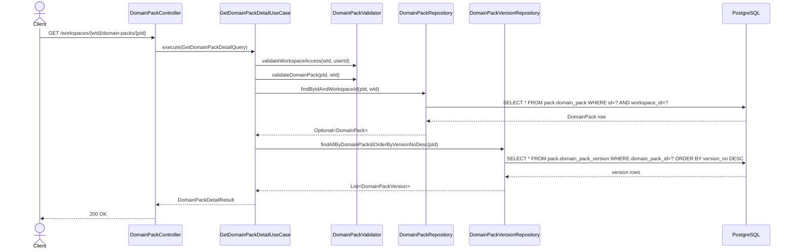
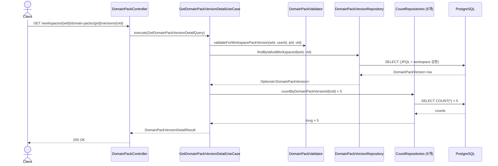

# [BE] 2.3.3 — DomainPack 단건 조회 및 DomainPackVersion 단건 조회 API

## Goal

`GET /api/v1/workspaces/{workspaceId}/domain-packs/{packId}` 와
`GET /api/v1/workspaces/{workspaceId}/domain-packs/{packId}/versions/{versionId}` 두 엔드포인트를 신규 구현하여
FE(`spec/232.md` U-FE-232-1 의존성)가 DomainPack 메타+버전 목록 및 DomainPackVersion 상세(구성요소 카운트 포함)를 조회할 수 있도록 한다.

---

## Sequence Diagram

### Endpoint 1: DomainPack 단건 조회



### Endpoint 2: DomainPackVersion 단건 조회



---

## REST API

### Endpoints

| Method | Path | Description |
|--------|------|-------------|
| GET | `/api/v1/workspaces/{workspaceId}/domain-packs/{packId}` | DomainPack 단건 조회 (버전 목록 포함) |
| GET | `/api/v1/workspaces/{workspaceId}/domain-packs/{packId}/versions/{versionId}` | DomainPackVersion 단건 조회 (구성요소 카운트 포함) |

### Response — Endpoint 1

**200 OK**

```json
{
  "packId": 1,
  "workspaceId": 1,
  "code": "my-pack-key",
  "name": "CS Support Pack",
  "description": "고객 지원용 도메인 팩",
  "versions": [
    {
      "versionId": 2,
      "versionNo": 2,
      "lifecycleStatus": "DRAFT",
      "sourcePipelineJobId": 10,
      "createdAt": "2025-04-03T10:00:00+09:00",
      "updatedAt": "2025-04-03T10:00:00+09:00"
    },
    {
      "versionId": 1,
      "versionNo": 1,
      "lifecycleStatus": "PUBLISHED",
      "sourcePipelineJobId": 5,
      "createdAt": "2025-03-01T10:00:00+09:00",
      "updatedAt": "2025-03-01T10:00:00+09:00"
    }
  ],
  "createdAt": "2025-03-01T09:00:00+09:00",
  "updatedAt": "2025-04-03T10:00:00+09:00"
}
```

> `code` 필드는 `DomainPack.packKey` 값을 응답 DTO에서 `code`로 매핑한다 (U-233-1 확정).
> `versions`는 `versionNo DESC` 정렬 (최신 버전 먼저).
> `description`은 nullable (`null` 가능).

### Response — Endpoint 2

**200 OK**

```json
{
  "versionId": 1,
  "packId": 1,
  "versionNo": 1,
  "lifecycleStatus": "DRAFT",
  "sourcePipelineJobId": null,
  "summaryJson": "{\"intentCount\":5,\"topIntents\":[]}",
  "intentCount": 5,
  "slotCount": 3,
  "policyCount": 2,
  "riskCount": 1,
  "workflowCount": 4,
  "createdAt": "2025-04-03T10:00:00+09:00",
  "updatedAt": "2025-04-03T10:00:00+09:00"
}
```

> `summaryJson`은 Java `String` → Jackson 직렬화 → JSON string (이스케이프된 문자열)으로 반환된다 (U-233-2 확정).
> FE는 `summaryJson: string` 타입으로 수신 후 필요 시 `JSON.parse()`.
> `sourcePipelineJobId`는 nullable (`null` 가능).

### Error Responses (공통)

| HTTP | 예외 클래스 | 발생 조건 |
|------|-----------|---------|
| 404 | `DomainPackWorkspaceNotFoundException` | workspace 미존재 |
| 403 | `DomainPackUnauthorizedWorkspaceAccessException` | 워크스페이스 접근 권한 없음 |
| 404 | `DomainPackNotFoundException` | pack 미존재 또는 workspace 불일치 |
| 404 | `DomainPackVersionNotFoundException` | version 미존재 또는 pack 불일치 |

---

## Class Design

### DDD 계층 구조

```
presentation/
  DomainPackController.java          ← 신규

application/
  GetDomainPackDetailQuery.java      ← 신규 (record)
  GetDomainPackDetailUseCase.java    ← 신규
  DomainPackDetailResult.java        ← 신규 (record)
  DomainPackVersionSummaryEntry.java ← 신규 (record, Endpoint 1 versions 항목)
  GetDomainPackVersionDetailQuery.java   ← 신규 (record)
  GetDomainPackVersionDetailUseCase.java ← 신규
  DomainPackVersionDetailResult.java     ← 신규 (record)

domain/repository/
  DomainPackRepository.java             ← 메서드 추가: findByIdAndWorkspaceId
  DomainPackVersionRepository.java      ← 메서드 추가: findAllByDomainPackIdOrderByVersionNoDesc
  IntentDefinitionRepository.java       ← countByDomainPackVersionId 기존 존재 (변경 없음)
  SlotDefinitionRepository.java         ← 메서드 추가: countByDomainPackVersionId
  PolicyDefinitionRepository.java       ← 메서드 추가: countByDomainPackVersionId
  RiskDefinitionRepository.java         ← 메서드 추가: countByDomainPackVersionId
  WorkflowDefinitionRepository.java     ← 메서드 추가: countByDomainPackVersionId

infrastructure/persistence/
  JpaDomainPackRepository.java          ← @Query 추가 (JPQL, DomainPack 엔티티 직접 참조)
  JpaDomainPackVersionRepository.java   ← Spring Data JPA 자동 파생
  JpaSlotDefinitionRepository.java      ← Spring Data JPA 자동 파생
  JpaPolicyDefinitionRepository.java    ← Spring Data JPA 자동 파생
  JpaRiskDefinitionRepository.java      ← Spring Data JPA 자동 파생
  JpaWorkflowDefinitionRepository.java  ← Spring Data JPA 자동 파생
```

### Presentation Layer

```java
@RestController
@RequestMapping("/api/v1/workspaces/{workspaceId}/domain-packs")
public class DomainPackController {

  private final GetDomainPackDetailUseCase packDetailUseCase;
  private final GetDomainPackVersionDetailUseCase versionDetailUseCase;

  public DomainPackController(
      GetDomainPackDetailUseCase packDetailUseCase,
      GetDomainPackVersionDetailUseCase versionDetailUseCase) {
    this.packDetailUseCase = packDetailUseCase;
    this.versionDetailUseCase = versionDetailUseCase;
  }

  @GetMapping("/{packId}")
  public ResponseEntity<DomainPackDetailResult> getDomainPack(
      @PathVariable Long workspaceId,
      @PathVariable Long packId,
      Authentication authentication) {
    Long userId = AuthenticationUtils.getUserId(authentication);
    return ResponseEntity.ok(
        packDetailUseCase.execute(new GetDomainPackDetailQuery(workspaceId, packId, userId)));
  }

  @GetMapping("/{packId}/versions/{versionId}")
  public ResponseEntity<DomainPackVersionDetailResult> getDomainPackVersion(
      @PathVariable Long workspaceId,
      @PathVariable Long packId,
      @PathVariable Long versionId,
      Authentication authentication) {
    Long userId = AuthenticationUtils.getUserId(authentication);
    return ResponseEntity.ok(
        versionDetailUseCase.execute(
            new GetDomainPackVersionDetailQuery(workspaceId, packId, versionId, userId)));
  }
}
```

### Application Layer — Query / Result Records

```java
public record GetDomainPackDetailQuery(Long workspaceId, Long packId, Long userId) {}

public record GetDomainPackVersionDetailQuery(
    Long workspaceId, Long packId, Long versionId, Long userId) {}

public record DomainPackVersionSummaryEntry(
    Long versionId,
    Integer versionNo,
    String lifecycleStatus,
    Long sourcePipelineJobId,
    OffsetDateTime createdAt,
    OffsetDateTime updatedAt) {

  public static DomainPackVersionSummaryEntry from(DomainPackVersion v) {
    return new DomainPackVersionSummaryEntry(
        v.getId(), v.getVersionNo(), v.getLifecycleStatus(),
        v.getSourcePipelineJobId(), v.getCreatedAt(), v.getUpdatedAt());
  }
}

public record DomainPackDetailResult(
    Long packId,
    Long workspaceId,
    String code,
    String name,
    String description,
    List<DomainPackVersionSummaryEntry> versions,
    OffsetDateTime createdAt,
    OffsetDateTime updatedAt) {

  public static DomainPackDetailResult from(DomainPack pack, List<DomainPackVersion> versions) {
    return new DomainPackDetailResult(
        pack.getId(), pack.getWorkspaceId(),
        pack.getPackKey(),   // JSON key: "code" (U-233-1 확정)
        pack.getName(), pack.getDescription(),
        versions.stream().map(DomainPackVersionSummaryEntry::from).toList(),
        pack.getCreatedAt(), pack.getUpdatedAt());
  }
}

public record DomainPackVersionDetailResult(
    Long versionId,
    Long packId,
    Integer versionNo,
    String lifecycleStatus,
    Long sourcePipelineJobId,
    String summaryJson,
    long intentCount,
    long slotCount,
    long policyCount,
    long riskCount,
    long workflowCount,
    OffsetDateTime createdAt,
    OffsetDateTime updatedAt) {}
```

> `DomainPackDetailResult.code` 필드: Jackson은 record 컴포넌트명을 JSON 키로 사용하므로 필드명을 `code`로 선언하면 `"code"` 로 직렬화된다.

### Application Layer — UseCases

```java
@Service
@Transactional(readOnly = true)
public class GetDomainPackDetailUseCase {

  private final DomainPackValidator validator;
  private final DomainPackRepository domainPackRepository;
  private final DomainPackVersionRepository domainPackVersionRepository;

  // 생성자 주입 (생략)

  public DomainPackDetailResult execute(GetDomainPackDetailQuery query) {
    validator.validateWorkspaceAccess(query.workspaceId(), query.userId());
    validator.validateDomainPack(query.packId(), query.workspaceId());

    DomainPack pack = domainPackRepository
        .findByIdAndWorkspaceId(query.packId(), query.workspaceId())
        .orElseThrow(() -> new DomainPackNotFoundException(query.packId()));

    List<DomainPackVersion> versions =
        domainPackVersionRepository.findAllByDomainPackIdOrderByVersionNoDesc(query.packId());

    return DomainPackDetailResult.from(pack, versions);
  }
}
```

```java
@Service
@Transactional(readOnly = true)
public class GetDomainPackVersionDetailUseCase {

  private final DomainPackValidator validator;
  private final DomainPackVersionRepository domainPackVersionRepository;
  private final IntentDefinitionRepository intentDefinitionRepository;
  private final SlotDefinitionRepository slotDefinitionRepository;
  private final PolicyDefinitionRepository policyDefinitionRepository;
  private final RiskDefinitionRepository riskDefinitionRepository;
  private final WorkflowDefinitionRepository workflowDefinitionRepository;

  // 생성자 주입 (생략)

  public DomainPackVersionDetailResult execute(GetDomainPackVersionDetailQuery query) {
    validator.validateForWorkspacePackVersion(
        query.workspaceId(), query.userId(), query.packId(), query.versionId());

    DomainPackVersion version = domainPackVersionRepository
        .findByIdAndWorkspaceId(query.workspaceId(), query.versionId())
        .orElseThrow(() -> new DomainPackVersionNotFoundException(query.versionId()));

    return new DomainPackVersionDetailResult(
        version.getId(),
        version.getDomainPackId(),
        version.getVersionNo(),
        version.getLifecycleStatus(),
        version.getSourcePipelineJobId(),
        version.getSummaryJson(),
        intentDefinitionRepository.countByDomainPackVersionId(version.getId()),
        slotDefinitionRepository.countByDomainPackVersionId(version.getId()),
        policyDefinitionRepository.countByDomainPackVersionId(version.getId()),
        riskDefinitionRepository.countByDomainPackVersionId(version.getId()),
        workflowDefinitionRepository.countByDomainPackVersionId(version.getId()),
        version.getCreatedAt(),
        version.getUpdatedAt());
  }
}
```

### Domain Repository — 추가 메서드

```java
// DomainPackRepository.java — 추가
Optional<DomainPack> findByIdAndWorkspaceId(Long packId, Long workspaceId);

// DomainPackVersionRepository.java — 추가
List<DomainPackVersion> findAllByDomainPackIdOrderByVersionNoDesc(Long domainPackId);

// SlotDefinitionRepository.java — 추가
long countByDomainPackVersionId(Long domainPackVersionId);

// PolicyDefinitionRepository.java — 추가
long countByDomainPackVersionId(Long domainPackVersionId);

// RiskDefinitionRepository.java — 추가
long countByDomainPackVersionId(Long domainPackVersionId);

// WorkflowDefinitionRepository.java — 추가
long countByDomainPackVersionId(Long domainPackVersionId);
```

### Infrastructure Layer — JPA 구현

```java
// JpaDomainPackRepository.java — @Query 추가
// JpaRepository<DomainPackRef, Long>를 상속하므로 DomainPack 엔티티는 JPQL로 직접 참조
@Query("SELECT p FROM DomainPack p WHERE p.id = :packId AND p.workspaceId = :workspaceId")
Optional<DomainPack> findByIdAndWorkspaceId(
    @Param("packId") Long packId,
    @Param("workspaceId") Long workspaceId);
```

```java
// JpaDomainPackVersionRepository.java — Spring Data JPA 자동 파생
// findAllByDomainPackIdOrderByVersionNoDesc 는 JpaRepository<DomainPackVersion, Long> 상속이므로
// 메서드명 기반 자동 파생 가능 (별도 @Query 불필요)
List<DomainPackVersion> findAllByDomainPackIdOrderByVersionNoDesc(Long domainPackId);
```

```java
// JpaSlotDefinitionRepository.java (및 Policy/Risk/WorkflowDefinitionRepository 동일)
// Spring Data JPA 자동 파생: countBy{fieldName} 메서드명 규칙
long countByDomainPackVersionId(Long domainPackVersionId);
```

---

## Tests

### Unit Tests

```java
@ExtendWith(MockitoExtension.class)
@DisplayName("GetDomainPackDetailUseCase")
class GetDomainPackDetailUseCaseTest {

  @Mock DomainPackValidator validator;
  @Mock DomainPackRepository domainPackRepository;
  @Mock DomainPackVersionRepository domainPackVersionRepository;
  @InjectMocks GetDomainPackDetailUseCase useCase;

  @Test
  @DisplayName("유효한 workspace+pack → DomainPackDetailResult 반환")
  void should_반환PackDetail_when_유효한요청() {
    // given
    var query = new GetDomainPackDetailQuery(1L, 10L, 99L);
    var pack = /* DomainPack mock */;
    var versions = List.of(/* DomainPackVersion mock */);
    given(domainPackRepository.findByIdAndWorkspaceId(10L, 1L)).willReturn(Optional.of(pack));
    given(domainPackVersionRepository.findAllByDomainPackIdOrderByVersionNoDesc(10L))
        .willReturn(versions);

    // when
    var result = useCase.execute(query);

    // then
    assertThat(result.packId()).isEqualTo(pack.getId());
    assertThat(result.code()).isEqualTo(pack.getPackKey());
    assertThat(result.versions()).hasSize(1);
  }

  @Test
  @DisplayName("pack 미존재 → DomainPackNotFoundException")
  void should_throw_when_packNotFound() {
    var query = new GetDomainPackDetailQuery(1L, 999L, 99L);
    given(domainPackRepository.findByIdAndWorkspaceId(999L, 1L)).willReturn(Optional.empty());

    assertThatThrownBy(() -> useCase.execute(query))
        .isInstanceOf(DomainPackNotFoundException.class);
  }

  @Test
  @DisplayName("버전 없는 pack → versions 빈 리스트 반환")
  void should_반환EmptyVersions_when_버전없음() {
    // given
    var query = new GetDomainPackDetailQuery(1L, 10L, 99L);
    given(domainPackRepository.findByIdAndWorkspaceId(10L, 1L)).willReturn(Optional.of(pack));
    given(domainPackVersionRepository.findAllByDomainPackIdOrderByVersionNoDesc(10L))
        .willReturn(Collections.emptyList());

    // when
    var result = useCase.execute(query);

    // then
    assertThat(result.versions()).isEmpty();
  }
}
```

```java
@ExtendWith(MockitoExtension.class)
@DisplayName("GetDomainPackVersionDetailUseCase")
class GetDomainPackVersionDetailUseCaseTest {

  // mock 5개 count repository + validator + versionRepository

  @Test
  @DisplayName("유효한 요청 → DomainPackVersionDetailResult 반환 (카운트 포함)")
  void should_반환VersionDetail_when_유효한요청() { /* ... */ }

  @Test
  @DisplayName("version 미존재 → DomainPackVersionNotFoundException")
  void should_throw_when_versionNotFound() { /* ... */ }
}
```

### Integration Tests

```java
@WebMvcTest(DomainPackController.class)
@DisplayName("DomainPackController")
class DomainPackControllerTest {

  @Autowired MockMvc mockMvc;
  @MockBean GetDomainPackDetailUseCase packDetailUseCase;
  @MockBean GetDomainPackVersionDetailUseCase versionDetailUseCase;

  @Test
  @DisplayName("GET /{workspaceId}/domain-packs/{packId} → 200 OK, JSON 구조 검증")
  void should_200_when_getDomainPack() throws Exception {
    given(packDetailUseCase.execute(any()))
        .willReturn(/* DomainPackDetailResult fixture */);

    mockMvc.perform(get("/api/v1/workspaces/1/domain-packs/10")
            .with(/* auth */))
        .andExpect(status().isOk())
        .andExpect(jsonPath("$.packId").value(10))
        .andExpect(jsonPath("$.code").isString())
        .andExpect(jsonPath("$.versions").isArray());
  }

  @Test
  @DisplayName("GET /{packId} pack 미존재 → 404")
  void should_404_when_packNotFound() throws Exception {
    given(packDetailUseCase.execute(any()))
        .willThrow(new DomainPackNotFoundException(999L));

    mockMvc.perform(get("/api/v1/workspaces/1/domain-packs/999").with(/* auth */))
        .andExpect(status().isNotFound());
  }

  @Test
  @DisplayName("GET /{packId}/versions/{versionId} → 200 OK, summaryJson string 검증")
  void should_200_when_getDomainPackVersion() throws Exception {
    given(versionDetailUseCase.execute(any()))
        .willReturn(/* DomainPackVersionDetailResult fixture with summaryJson="{}" */);

    mockMvc.perform(get("/api/v1/workspaces/1/domain-packs/10/versions/1").with(/* auth */))
        .andExpect(status().isOk())
        .andExpect(jsonPath("$.versionId").value(1))
        .andExpect(jsonPath("$.summaryJson").isString())   // JSON string 검증
        .andExpect(jsonPath("$.intentCount").isNumber());
  }
}
```

### Test Checklist

- [ ] 정상 시나리오: 유효 workspace+pack → 200 + 올바른 JSON 구조
- [ ] 정상 시나리오: pack에 버전 없음 → versions 빈 배열 반환
- [ ] 정상 시나리오: version detail → 카운트 5종 모두 포함
- [ ] 정상 시나리오: summaryJson이 JSON string으로 직렬화되는지 확인
- [ ] Not Found: packId 미존재 → 404
- [ ] Not Found: versionId 미존재 → 404
- [ ] Not Found: workspace 미존재 → 404
- [ ] 권한: workspace 접근 권한 없음 → 403

---

## Database

### 신규 Migration 불필요

`pack.domain_pack`, `pack.domain_pack_version` 테이블은 이미 존재한다.
이 스펙의 구현은 기존 테이블에서 데이터를 읽기만 하며 스키마 변경이 없다.

### 참조 인덱스

| 인덱스 | 테이블 | 컬럼 | 이 스펙과의 관련 |
|--------|--------|------|----------------|
| `idx_pack_version_pack_id` | `pack.domain_pack_version` | `domain_pack_id, version_no DESC` | Endpoint 1 버전 목록 정렬 지원 |

---

## Additional Notes

- `DomainPackDetailResult.code` 필드명: record 컴포넌트명 `code`를 선언하면 Jackson이 `"code"`로 직렬화. `@JsonProperty` 불필요.
- `JpaDomainPackRepository`는 `JpaRepository<DomainPackRef, Long>`를 상속하므로, `DomainPack` 엔티티를 반환하는 메서드는 반드시 `@Query` JPQL로 명시해야 한다 (Spring Data 메서드명 자동 파생 사용 불가).
- count 쿼리 5개는 동일 트랜잭션 내에서 순차 실행된다. 성능 최적화(배치 조회)는 이 스펙의 범위 밖이다.
- 기존 `DomainPackValidator.validateForWorkspacePackVersion()`은 내부적으로 version `findById`를 호출한다. Endpoint 2 UseCase는 이후 `findByIdAndWorkspaceId`로 version을 다시 조회하므로 DB 쿼리가 중복된다. 이는 기존 패턴(`GetWorkflowDefinitionListUseCase` 참조)과 일치하며 이 스펙에서는 그대로 따른다.
