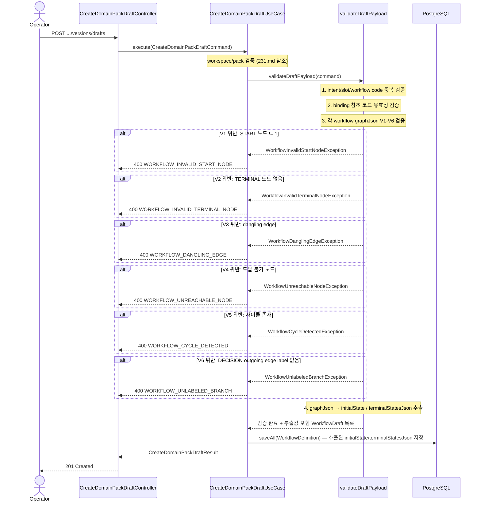

# [BE-31] CreateDomainPackDraft — graphJson V1-V6 검증 및 `initialState` 자동 추출

> **Backlog**: spec/226에서 확정된 graphJson 무결성 규칙을 `CreateDomainPackDraftUseCase` write path에 적용하고, `initialState` / `terminalStatesJson`을 클라이언트 제공에서 서버 자동 추출로 전환한다
> **Bounded Context**: `domainpack`
> **Template**: `_TEMPLATE_BE.md`
> **Amends**: `.agent/specs/231.md` (기존 스펙 델타)
> **Branch**: `feature/231-domain-pack-draft-creation`

---

## Goal

`CreateDomainPackDraftUseCase.validateDraftPayload()` write path에 graphJson 무결성 규칙 V1-V6(`.agent/specs/226.md` 정의)를 추가한다.
V1-V6 통과 후 graphJson nodes에서 `initialState`(START 노드 id)와 `terminalStatesJson`(TERMINAL 노드 id 배열)을 서버가 자동 추출하여 `WorkflowDefinition`에 저장한다.
이에 따라 `WorkflowDraftRequest` DTO와 `WorkflowDraft` command record에서 두 필드를 제거한다.

---

## Sequence Diagram



---

## REST API

### 변경 사항 — `workflows` 요청 필드

`WorkflowDraftRequest`에서 `initialState`, `terminalStatesJson` 필드를 **제거**한다.
클라이언트는 `graphJson`만 제공하며, 서버가 V1-V6 검증 후 자동 추출한다.

**변경 전 (기존 DTO)**

```java
public record WorkflowDraftRequest(
    @NotBlank String workflowCode,
    @NotBlank String name,
    @NotBlank @Size(max = 20000) String graphJson,
    @Size(max = 100) String initialState,        // 제거
    @Size(max = 5000) String terminalStatesJson  // 제거
) {}
```

**변경 후 (이 스펙 적용)**

```java
public record WorkflowDraftRequest(
    @NotBlank String workflowCode,
    @NotBlank String name,
    @NotBlank @Size(max = 20000) String graphJson
) {}
```

**Request 예시 (workflows 부분)**

```json
"workflows": [
  {
    "workflowCode": "refund_flow",
    "name": "환불 플로우",
    "graphJson": "{\"direction\":\"LR\",\"nodes\":[{\"id\":\"start\",\"label\":\"상담 시작\",\"type\":\"START\"},{\"id\":\"collect_order_id\",\"label\":\"주문번호 수집\",\"type\":\"ACTION\"},{\"id\":\"terminal\",\"label\":\"상담 종료\",\"type\":\"TERMINAL\"}],\"edges\":[{\"from\":\"start\",\"to\":\"collect_order_id\"},{\"from\":\"collect_order_id\",\"to\":\"terminal\"}]}"
  }
]
```

### Errors — V1-V6 위반 (400 Bad Request)

```json
{ "code": "WORKFLOW_INVALID_START_NODE",    "message": "START 노드가 정확히 1개여야 합니다. workflowCode=refund_flow" }
{ "code": "WORKFLOW_INVALID_TERMINAL_NODE", "message": "TERMINAL 노드가 1개 이상이어야 합니다. workflowCode=refund_flow" }
{ "code": "WORKFLOW_DANGLING_EDGE",         "message": "엣지가 존재하지 않는 노드를 참조합니다. workflowCode=refund_flow" }
{ "code": "WORKFLOW_UNREACHABLE_NODE",      "message": "도달 불가 노드가 존재합니다. workflowCode=refund_flow" }
{ "code": "WORKFLOW_CYCLE_DETECTED",        "message": "workflow 그래프에 사이클이 있습니다. workflowCode=refund_flow" }
{ "code": "WORKFLOW_UNLABELED_BRANCH",      "message": "DECISION 노드의 모든 outgoing edge에 label이 필요합니다. workflowCode=refund_flow" }
```

---

## Class Design

### validateDraftPayload — 검증 및 추출 절차

```java
private List<WorkflowDraft> validateAndExtractWorkflows(CreateDomainPackDraftCommand command) {
    // 1. workflow code 중복 검증
    // 2. intentWorkflowBindings 참조 코드 유효성
    // 3. 각 workflow graphJson V1-V6 검증 후 추출
    return command.workflows().stream()
        .map(w -> {
            GraphJson graph = parseAndValidate(w.graphJson(), w.workflowCode()); // V1-V6
            String initialState = extractInitialState(graph);        // START 노드 id
            String terminalStatesJson = extractTerminalStates(graph); // TERMINAL 노드 id 배열 JSON
            return new WorkflowDraft(w.workflowCode(), w.name(), w.graphJson(),
                                     initialState, terminalStatesJson);
        })
        .toList();
}
```

`WorkflowDraft` command record (내부 사용, 추출값 포함):

```java
// CreateDomainPackDraftCommand 내부 record
// 요청에서는 initialState/terminalStatesJson 없음 — validateDraftPayload 이후 생성
public record WorkflowDraft(
    String workflowCode,
    String name,
    String graphJson,
    String initialState,        // 서버 추출값
    String terminalStatesJson   // 서버 추출값
) {}
```

### 추출 로직 기준 (`.agent/specs/226.md:63-65`)

| 필드 | 추출 방법 |
|------|-----------|
| `initialState` | `nodes[]` 중 `type == "START"` 노드의 `id` |
| `terminalStatesJson` | `nodes[]` 중 `type == "TERMINAL"` 노드의 `id` 목록 → JSON 배열 직렬화 (예: `"[\"terminal\"]"`) |

### 신규 예외 클래스

```java
import com.init.shared.application.exception.BadRequestException;

// backend/src/main/java/com/init/domainpack/application/exception/
public class WorkflowInvalidStartNodeException extends BadRequestException {
  public WorkflowInvalidStartNodeException(String workflowCode) {
    super("WORKFLOW_INVALID_START_NODE", "START 노드가 정확히 1개여야 합니다. workflowCode=" + workflowCode);
  }
}

public class WorkflowInvalidTerminalNodeException extends BadRequestException {
  public WorkflowInvalidTerminalNodeException(String workflowCode) {
    super("WORKFLOW_INVALID_TERMINAL_NODE", "TERMINAL 노드가 1개 이상이어야 합니다. workflowCode=" + workflowCode);
  }
}

public class WorkflowDanglingEdgeException extends BadRequestException {
  public WorkflowDanglingEdgeException(String workflowCode) {
    super("WORKFLOW_DANGLING_EDGE", "엣지가 존재하지 않는 노드를 참조합니다. workflowCode=" + workflowCode);
  }
}

public class WorkflowUnreachableNodeException extends BadRequestException {
  public WorkflowUnreachableNodeException(String workflowCode) {
    super("WORKFLOW_UNREACHABLE_NODE", "도달 불가 노드가 존재합니다. workflowCode=" + workflowCode);
  }
}

public class WorkflowCycleDetectedException extends BadRequestException {
  public WorkflowCycleDetectedException(String workflowCode) {
    super("WORKFLOW_CYCLE_DETECTED", "workflow 그래프에 사이클이 있습니다. workflowCode=" + workflowCode);
  }
}

public class WorkflowUnlabeledBranchException extends BadRequestException {
  public WorkflowUnlabeledBranchException(String workflowCode) {
    super("WORKFLOW_UNLABELED_BRANCH", "DECISION 노드의 모든 outgoing edge에 label이 필요합니다. workflowCode=" + workflowCode);
  }
}
```

---

## Tests

### Unit Tests

```java
@DisplayName("CreateDomainPackDraftUseCase — graphJson V1-V6 검증")
class CreateDomainPackDraftUseCaseGraphValidationTest {

    @Test
    @DisplayName("V1 위반: START 노드 없음 → WorkflowInvalidStartNodeException")
    void validate_noStartNode_throwsException() { ... }

    @Test
    @DisplayName("V1 위반: START 노드 2개 → WorkflowInvalidStartNodeException")
    void validate_multipleStartNodes_throwsException() { ... }

    @Test
    @DisplayName("V2 위반: TERMINAL 노드 없음 → WorkflowInvalidTerminalNodeException")
    void validate_noTerminalNode_throwsException() { ... }

    @Test
    @DisplayName("V3 위반: edge가 없는 노드 id 참조 → WorkflowDanglingEdgeException")
    void validate_danglingEdge_throwsException() { ... }

    @Test
    @DisplayName("V4 위반: START에서 도달 불가 노드 → WorkflowUnreachableNodeException")
    void validate_unreachableNode_throwsException() { ... }

    @Test
    @DisplayName("V5 위반: 사이클 존재 → WorkflowCycleDetectedException")
    void validate_cycleDetected_throwsException() { ... }

    @Test
    @DisplayName("V6 위반: DECISION outgoing edge에 label 없음 → WorkflowUnlabeledBranchException")
    void validate_unlabeledBranch_throwsException() { ... }

    @Test
    @DisplayName("V1-V6 통과 시 initialState가 START 노드 id로 추출됨")
    void validate_valid_extractsInitialState() { ... }

    @Test
    @DisplayName("V1-V6 통과 시 terminalStatesJson이 TERMINAL 노드 id 배열 JSON으로 추출됨")
    void validate_valid_extractsTerminalStatesJson() { ... }
}
```

### Controller Tests

```java
@SpringBootTest
@AutoConfigureMockMvc
@DisplayName("CreateDomainPackDraftController — graphJson V1-V6")
class CreateDomainPackDraftControllerGraphValidationTest {

    @Test
    @DisplayName("V1 위반: START 노드 없음 → 400 WORKFLOW_INVALID_START_NODE")
    void createDraft_noStartNode_returns400() throws Exception { ... }

    @Test
    @DisplayName("V2 위반: TERMINAL 노드 없음 → 400 WORKFLOW_INVALID_TERMINAL_NODE")
    void createDraft_noTerminalNode_returns400() throws Exception { ... }

    @Test
    @DisplayName("V3 위반: dangling edge → 400 WORKFLOW_DANGLING_EDGE")
    void createDraft_danglingEdge_returns400() throws Exception { ... }

    @Test
    @DisplayName("V4 위반: 도달 불가 노드 → 400 WORKFLOW_UNREACHABLE_NODE")
    void createDraft_unreachableNode_returns400() throws Exception { ... }

    @Test
    @DisplayName("V5 위반: 사이클 → 400 WORKFLOW_CYCLE_DETECTED")
    void createDraft_cycle_returns400() throws Exception { ... }

    @Test
    @DisplayName("V6 위반: DECISION unlabeled branch → 400 WORKFLOW_UNLABELED_BRANCH")
    void createDraft_unlabeledBranch_returns400() throws Exception { ... }

    @Test
    @DisplayName("유효한 graphJson + initialState/terminalStatesJson 미제공 → 201 Created")
    void createDraft_validGraphJsonOnly_returns201() throws Exception { ... }

    @Test
    @DisplayName("요청에 initialState 필드 포함 시 무시되거나 400 처리됨")
    void createDraft_unexpectedInitialStateField_ignored() throws Exception { ... }
}
```

### Test Checklist

- [ ] V1-V6 각 규칙 위반 시 대응 에러 코드로 400 반환
- [ ] V1-V6 통과 시 `initialState`가 START 노드 id로 DB에 저장됨
- [ ] V1-V6 통과 시 `terminalStatesJson`이 TERMINAL 노드 id 배열 JSON으로 DB에 저장됨
- [ ] 요청에 `workflows[].initialState` / `terminalStatesJson` 포함 시 무시 또는 400 처리
- [ ] TERMINAL 노드 복수 개일 때 `terminalStatesJson` 배열에 모두 포함됨

---

## Database

변경 없음. `pack.workflow_definition` 테이블의 `initial_state`, `terminal_states_json` 컬럼은 서버 추출값으로 채워진다.

---

## Additional Notes

- 전체 스펙 맥락: `.agent/specs/231.md`
- graphJson 스키마 및 V1-V6 규칙 정의: `.agent/specs/226.md`
- graphJson 파싱 및 V1-V6 검증 로직은 독립 헬퍼 클래스(`WorkflowGraphValidator` 또는 유사)로 분리하는 것을 권장한다 — `validateDraftPayload()` 인라인 구현 시 테스트 격리 어려움.
- V1-V6은 workflow 단위로 독립 검증하며, 첫 번째 위반 발생 시 즉시 예외를 던진다 (fail-fast).
