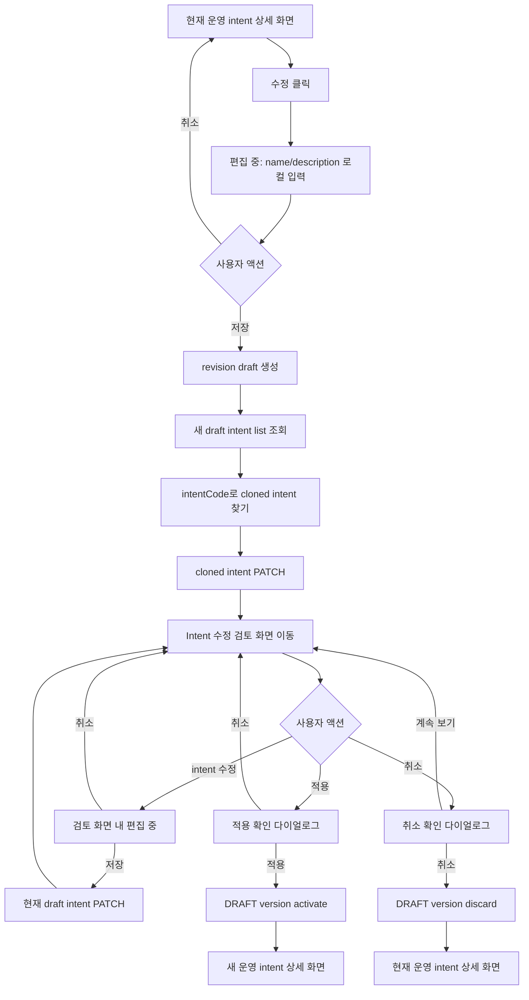
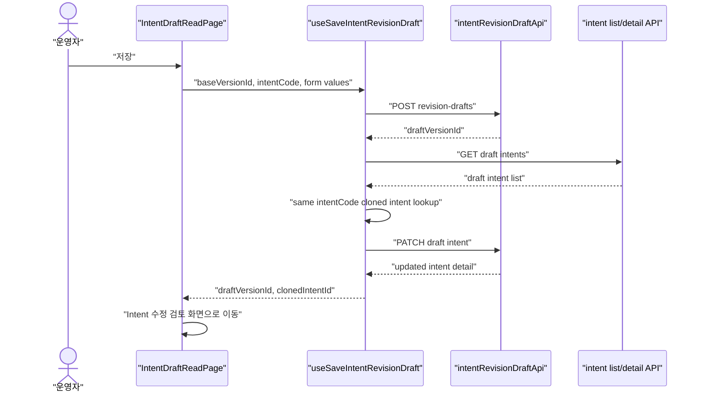
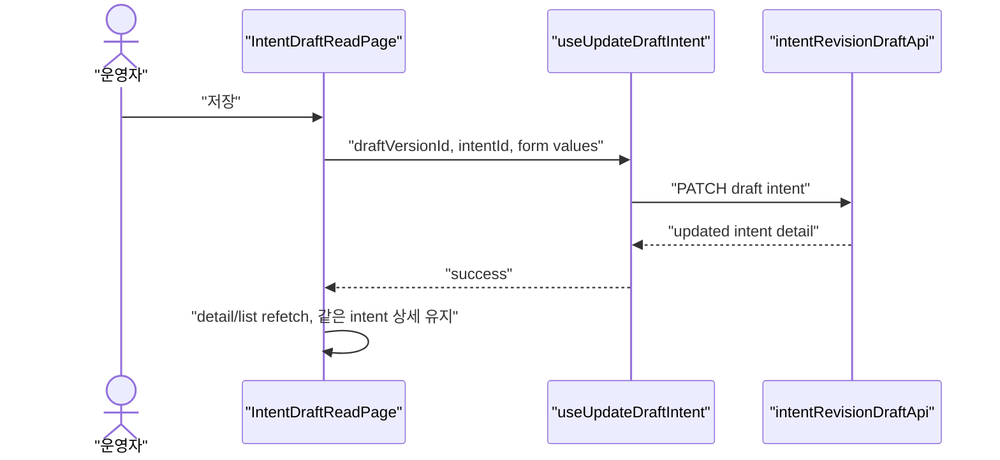
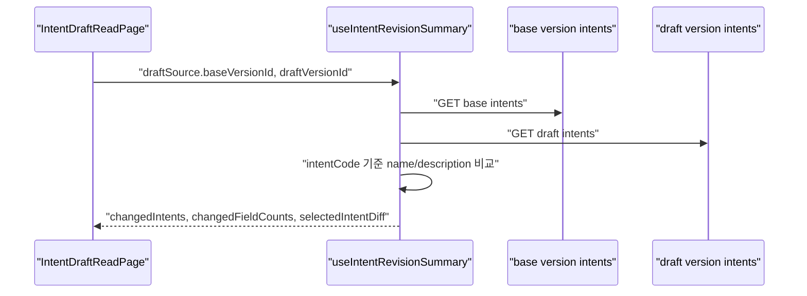
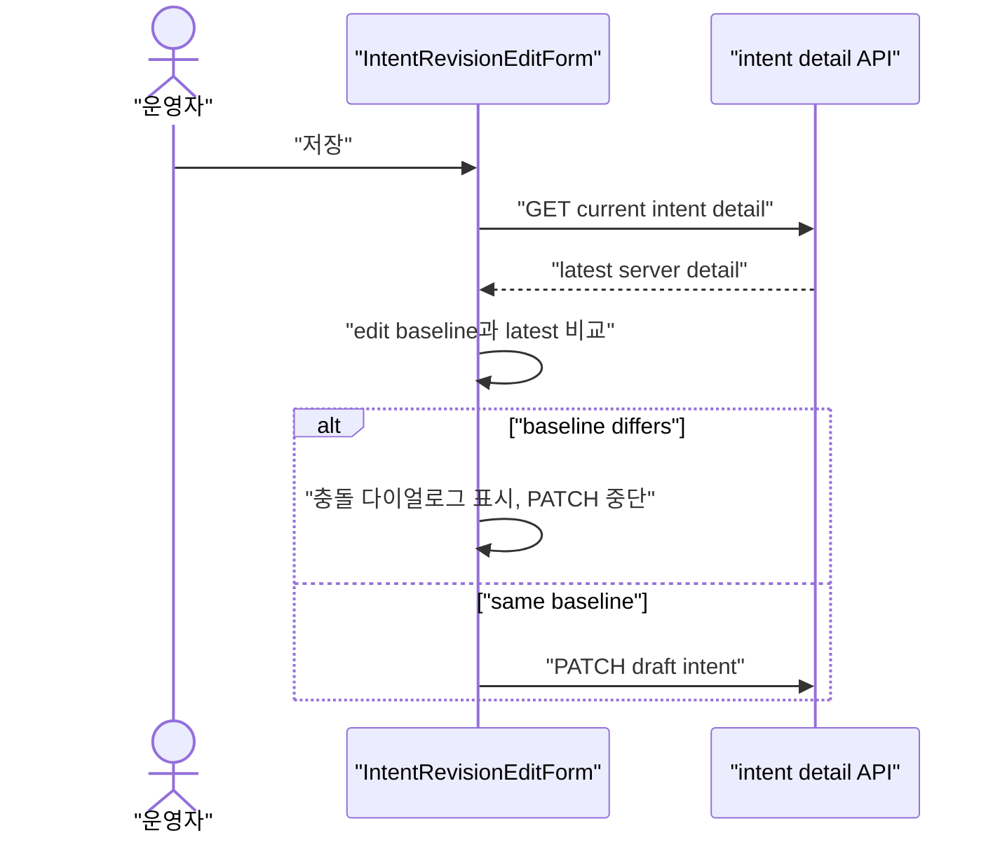

# 311: [FE] Conversation Intent 이름 수정 기능

**Branch**: `spec/311`
**Canonical Number**: `311`
**Type**: Frontend (FSD)
**Template**: `_TEMPLATE_FE.md`
**작성일**: 2026-05-10
**수정일**: 2026-05-10

---

## Goal

운영자가 현재 운영 중인 Domain Pack version의 intent 이름과 설명을 안전하게 수정하고, 적용 전 `Intent 수정 검토` 화면에서 변경 내용을 확인한 뒤 version 단위로 적용 또는 취소할 수 있는 FE UX를 구현한다.

---

## Scope

### In Scope

- 현재 운영 중인 `PUBLISHED` version의 intent `name`, `description` 수정 폼 제공
- 최초 저장 시 기존 Backend revision draft API를 조합하여 DB에 수정 후보 version 생성
- DB에 생성된 intent 수정 후보 version을 `Intent 수정 검토` 화면으로 표시
- `Intent 수정 검토` 화면에서 intent 재수정, 적용, 취소 제공
- tree row에 로컬 `수정 중`, 저장 후 `수정됨` 배지 표시
- `Intent 수정 검토` 화면에서 수정된 intent 선택 시 `name`, `description` before/after diff 표시
- 적용 전 변경 요약과 변경 없는 DRAFT 적용 방지
- 동시 편집/현재 운영 version 변경에 대한 FE best-effort 방어
- 미저장 변경이 있는 앱 내부 이동 guard
- 브라우저 새로고침/탭 닫기 `beforeunload` guard
- FE 단위/컴포넌트/통합 테스트
- mock 기반 E2E smoke는 권장 범위로 두되, CI 안정성을 해치면 후속 작업으로 분리

### Out of Scope

- Backend 신규 API, DB schema 변경
- 과거 `PUBLISHED` version 기반 restore 편집 UX
- 일반 DRAFT 승인/반려 UX 재설계
- `intentCode`, taxonomy, parent intent, JSON 필드 수정
- 전체 diff 전용 화면
- taxonomy, JSON, parent 변경 diff
- 강제 덮어쓰기 방식의 동시 편집 해결
- Chat Demo 또는 runtime 테스트 화면 CTA
- 실제 Backend/DB seed에 의존하는 full E2E suite

---

## Terminology

| 용어 | 정의 |
| --- | --- |
| 현재 운영 version | 같은 pack의 `PUBLISHED` version 중 `versionNo`가 가장 큰 version |
| 편집 중 | DB 변경 없이 intent 수정 폼에 로컬 입력값이 있는 상태 |
| Intent 수정 초안 | 저장 후 DB에 생성된 `DRAFT` version. 내부적으로 `summaryJson.draftSource.type = "INTENT_REVISION"` |
| Intent 수정 검토 | Intent 수정 초안을 적용하기 전 확인하고 추가 수정하는 화면 상태 |
| 적용 | Intent 수정 초안 version을 `PUBLISHED`로 승격 |
| 취소 | Intent 수정 초안 version을 폐기하고 현재 운영 version으로 이동 |
| `draftSource` | DRAFT가 어떤 목적과 base version에서 생성됐는지 구분하기 위해 `summaryJson`에 저장되는 메타 값 |
| 변경 요약 | base version과 Intent 수정 초안의 intent를 `intentCode` 기준으로 비교한 변경 intent 수와 변경 필드 목록 |

---

## Scope Decision

### 311은 Intent 수정 UX만 담당한다

이 스펙은 이미 존재하는 Domain Pack version 조회 화면과 Backend revision draft API를 조합해, intent 이름/설명 수정 흐름을 FE에서 제공하는 책임만 가진다.

이 결정의 기준:

- 사용자는 `PUBLISHED` intent 상세에서 `수정`을 눌러 로컬 폼을 열지만, 이 시점에는 DB DRAFT를 생성하지 않는다.
- 사용자가 폼에서 `저장`을 눌렀을 때 처음으로 `Intent 수정 초안` DRAFT를 생성하고 cloned intent를 PATCH한다.
- `Intent 수정 초안`이 생성된 뒤에는 해당 DRAFT version을 `Intent 수정 검토` 화면으로 보여준다.
- `Intent 수정 검토` 화면의 상단 `적용`/`취소`는 version 단위 action이다.
- `Intent 수정 검토` 화면 안의 intent 폼 `저장`/`취소`는 선택된 개별 intent의 폼 action이다.
- 같은 pack에 이미 DRAFT가 있으면 새 DRAFT를 만들지 않는다. 사용자가 이동을 선택하면 로컬 입력은 자동 반영하지 않고 기존 DRAFT 화면으로 이동한다.
- `Intent 수정 검토` 화면에서는 수정된 intent의 `name`, `description` diff를 오른쪽 상세 패널에서 확인할 수 있다.
- 적용 확인 다이얼로그는 상세 diff를 담지 않고 변경된 intent 수와 변경 필드 요약만 제공한다.
- 변경된 intent가 0개이면 적용할 수 없다.
- 과거 `PUBLISHED` version을 기준으로 복구 DRAFT를 만드는 restore 흐름은 별도 기능이며 이 스펙에서 다루지 않는다.

### 선행 조건

| Source | Status | Description |
| --- | --- | --- |
| `314.md` | 선행 필요 | Intent revision draft 생성, draft intent 수정, draft 폐기, version activate Backend API |
| `312.md` | 참고 | 일반 DRAFT intent 승인/반려 UI. `INTENT_REVISION` DRAFT에서는 이 UX를 숨긴다. |
| `frontend/DESIGN.md` | 구현 전 확인 | Console UI 타이포그래피, 색상, spacing, focus 규칙 |

Backend API는 이미 존재한다고 가정하며, 이번 티켓에서 OpenAPI/generated 갱신이나 신규 Backend API 추가를 요구하지 않는다.

---

## User Flow Chart



---

## Design Diff

### As-is vs To-be

| 영역 | As-is | To-be | 변경 내용 |
| --- | --- | --- | --- |
| Intent page header | `Intent 초안 조회`, `READ ONLY` | version 상태별 라벨 | `운영 중`, `Intent 수정 검토`, `이전 버전` 표시 |
| Intent 상세 패널 | 읽기 전용 + 개별 승인/반려 | 읽기 + 수정 폼 + source별 action | `INTENT_REVISION`에서는 승인/반려 숨김 |
| Intent 수정 | 불가 | `name`, `description` 편집 | `intentCode` 등 연결 필드는 읽기 전용 |
| 저장 | 없음 | PUBLISHED 첫 저장은 draft 생성 + PATCH, draft 내 저장은 PATCH only | page가 저장 orchestration 담당 |
| 적용/취소 | summary의 activate 중심 | Intent 수정 검토 화면 상단 action | 적용/취소 확인 다이얼로그 |
| Tree 표시 | status/taxonomy만 표시 | `수정 중`, `수정됨` marker 추가 | 수정 맥락을 좌측 tree에서 확인 |
| 변경 확인 | 없음 | 수정된 intent 선택 시 우측 패널에 name/description diff | 적용 전 변경 확인 강화 |
| 적용 확인 | 단순 activate | 변경 요약 포함 confirm + 변경 없음 apply disabled | 운영 version 변경 방어 |
| 이동 guard | 없음 | 미저장 변경이 있으면 앱 내부/브라우저 이동 경고 | `저장하지 않고 이동 시 수정 내역은 사라집니다.` |

---

## Screen States

| 상태 | 판단 기준 | Header label | 주요 UI |
| --- | --- | --- | --- |
| 현재 운영 version | `lifecycleStatus = PUBLISHED` + PUBLISHED 중 최대 `versionNo` | `운영 중` | intent `수정` 가능 |
| 편집 중 | 현재 운영 화면 또는 검토 화면에서 폼 dirty | 별도 page label 변경 없음 | 폼 안 `저장`, `취소` |
| Intent 수정 검토 | `lifecycleStatus = DRAFT` + `draftSource.type = "INTENT_REVISION"` | `Intent 수정 검토` | 상단 `적용`, `취소`; intent `수정` 가능 |
| Intent 수정 검토 - 변경 없음 | `INTENT_REVISION` DRAFT이나 `changedIntents.length = 0` | `Intent 수정 검토` | `적용` disabled, 변경 없음 안내 |
| 과거 version | `lifecycleStatus = PUBLISHED`이나 current 아님 | `이전 버전` | read-only |
| 일반 DRAFT | `lifecycleStatus = DRAFT`이나 `INTENT_REVISION` 아님 | 기존 검토 흐름 유지 | 기존 승인/반려 UX 유지 |

`draftSource.type`은 `version.summaryJson`에서 파싱한다. 파싱 실패 시 `INTENT_REVISION`으로 간주하지 않고 기존 read/review 흐름으로 fallback한다.

### Action Boundary

| 화면/상태 | Action | 책임 | DB 반영 |
| --- | --- | --- | --- |
| 현재 운영 version | `수정` | 개별 intent 로컬 폼 열기 | 없음 |
| 현재 운영 version의 편집 중 폼 | `저장` | Intent 수정 초안 생성 + cloned intent PATCH | 있음 |
| 현재 운영 version의 편집 중 폼 | `취소` | 로컬 입력 폐기 | 없음 |
| Intent 수정 검토 | 상단 `적용` | DRAFT version activate | 있음 |
| Intent 수정 검토 | 상단 `취소` | DRAFT version discard | 있음 |
| Intent 수정 검토의 intent 편집 폼 | `저장` | 현재 draft intent PATCH | 있음 |
| Intent 수정 검토의 intent 편집 폼 | `취소` | 선택 intent의 로컬 입력 폐기 | 없음 |

---

## Component Tree

```
IntentDraftReadPage
├─ PageHeader
│  ├─ Breadcrumb
│  ├─ VersionStateBadge
│  └─ IntentRevisionDraftActions (INTENT_REVISION DRAFT only, 신규 예정)
│     ├─ ApplyButton
│     ├─ CancelButton
│     ├─ ApplyConfirmDialog
│     │  └─ ChangeSummaryPreview
│     └─ CancelConfirmDialog
├─ IntentTreePanel (기존 확장)
│  └─ IntentTreeRow
│     └─ IntentTreeMarker ("수정 중" | "수정됨", 신규 prop)
└─ IntentDetailPanel (기존 재사용)
   ├─ DetailHeader
   ├─ InfoCards
   ├─ IntentRevisionDiffPanel (수정됨 intent 선택 시, 신규 예정)
   ├─ JsonCards
   └─ IntentRevisionEditForm (신규 예정)
      ├─ name input
      ├─ description textarea
      ├─ SaveButton
      └─ CancelButton
```

### 기존 확인된 파일

| 파일 | 현재 역할 |
| --- | --- |
| `frontend/src/pages/domain-pack/ui/IntentDraftReadPage.tsx` | intent 목록/상세 page 조합 |
| `frontend/src/features/intent-draft-read/ui/IntentTreePanel.tsx` | intent tree 목록 |
| `frontend/src/features/intent-draft-read/ui/IntentDetailPanel.tsx` | intent 상세 조회 패널 |
| `frontend/src/features/approve-intent/ui/IntentDetailWithApproval.tsx` | 기존 개별 승인/반려 wrapper |
| `frontend/src/features/domain-pack-summary-read/model/usePackDetail.ts` | domain pack/version detail 조회 |
| `frontend/src/shared/api/index.ts` | `apiClient`, `ApiRequestError` |
| `frontend/src/shared/api/mutator.ts` | generated endpoint용 `customFetch` |
| `frontend/DESIGN.md` | FE 디자인 규칙 |

### 신규 예정 파일

아래 경로는 구현 단계에서 생성할 신규 예정 경로다.

| 파일 | 설명 |
| --- | --- |
| `frontend/src/features/intent-revision-draft/api/intentRevisionDraftApi.ts` | generated에 없는 revision/update/discard endpoint wrapper |
| `frontend/src/features/intent-revision-draft/model/useSaveIntentRevisionDraft.ts` | current PUBLISHED 첫 저장 orchestration |
| `frontend/src/features/intent-revision-draft/model/useUpdateDraftIntent.ts` | 기존 draft intent PATCH |
| `frontend/src/features/intent-revision-draft/model/useIntentRevisionMarkers.ts` | `수정 중`/`수정됨` marker 계산 |
| `frontend/src/features/intent-revision-draft/model/useIntentRevisionSummary.ts` | 변경 intent 수, 변경 필드, before/after diff 계산 |
| `frontend/src/features/intent-revision-draft/ui/IntentRevisionEditForm.tsx` | name/description 수정 폼 |
| `frontend/src/features/intent-revision-draft/ui/IntentRevisionDiffPanel.tsx` | 선택 intent의 name/description before/after 표시 |
| `frontend/src/features/intent-revision-draft/ui/IntentRevisionDraftActions.tsx` | 적용/취소 action + 확인 dialog |
| `frontend/src/features/intent-revision-draft/ui/IntentRevisionRecoveryBanner.tsx` | draft 생성 후 첫 PATCH 실패 등 복구 안내 banner |

### 기존 UI 확장 포인트

현재 `IntentDetailPanel`은 `children`을 JSON 카드 뒤에 렌더링한다. `IntentRevisionDiffPanel`은 JSON 카드보다 앞에서 보여야 하므로 `children` 하나에 의존하지 않고 얇은 slot prop을 추가한다.

| Slot | 용도 |
| --- | --- |
| `headerActions` | 상세 header 오른쪽 action이 필요할 때 사용 |
| `afterHeader` | header 바로 아래 안내/banner가 필요할 때 사용 |
| `beforeJsonCards` | info cards 뒤, JSON cards 앞에 diff panel을 배치 |
| `footer` 또는 기존 `children` | 편집 폼, 승인/반려 control처럼 상세 하단 action 배치 |

기존 승인/반려 UX는 `footer` 또는 기존 `children` 위치를 유지한다. revision 전용 detail wrapper를 새로 만들어 상세 레이아웃을 복제하지 않는다.

### FSD 의존성 규칙

- `IntentDraftReadPage`가 `intent-draft-read`, `approve-intent`, `intent-revision-draft` feature를 조합한다.
- `features/intent-revision-draft`는 다른 feature slice를 import하지 않는다.
- 기존 `IntentTreePanel`, `IntentDetailPanel`은 `onEdit`, marker props, render slot처럼 page가 조합할 수 있는 얇은 확장 포인트만 제공한다.
- `features/intent-draft-read`가 `features/intent-revision-draft`를 직접 import하지 않는다.
- API wrapper와 mutation hook은 `features/intent-revision-draft` 내부에 둔다.
- shared UI/API만 하위 의존성으로 사용한다.

---

## API Integration

Backend 신규 API는 추가하지 않는다. 기존 Backend 계약을 FE에서 조합한다.

### Endpoints

| Method | Path | FE 사용 |
| --- | --- | --- |
| `GET` | `/api/v1/workspaces/{workspaceId}/domain-packs/{packId}` | pack version list로 current PUBLISHED 판단 |
| `GET` | `/api/v1/workspaces/{workspaceId}/domain-packs/{packId}/versions/{versionId}` | lifecycle/source 판단 |
| `GET` | `/api/v1/workspaces/{workspaceId}/domain-packs/{packId}/versions/{versionId}/intents` | intent list, cloned intent lookup, marker 비교 |
| `GET` | `/api/v1/workspaces/{workspaceId}/domain-packs/{packId}/versions/{versionId}/intents/{intentId}` | intent detail |
| `POST` | `/api/v1/workspaces/{workspaceId}/domain-packs/{packId}/versions/{versionId}/revision-drafts` | current PUBLISHED 첫 저장 시 Intent 수정 초안 생성 |
| `PATCH` | `/api/v1/workspaces/{workspaceId}/domain-packs/{packId}/versions/{draftVersionId}/intents/{intentId}` | draft 안 intent name/description 저장 |
| `POST` | `/api/v1/workspaces/{workspaceId}/domain-packs/{packId}/versions/{versionId}/activate` | Intent 수정 초안 적용 |
| `DELETE` | `/api/v1/workspaces/{workspaceId}/domain-packs/{packId}/versions/{draftVersionId}/draft` | Intent 수정 초안 취소 |

### Endpoint 호출 방식

- generated endpoint가 있는 API는 generated hook/function을 재사용한다.
- generated endpoint가 없는 API는 `features/intent-revision-draft/api` 내부에서 feature-local wrapper를 만든다.
- wrapper는 `apiClient` 또는 `customFetch`를 사용하고, 컴포넌트는 wrapper/hook만 호출한다.
- OpenAPI/generated 갱신은 이번 티켓 필수 범위가 아니다.

### Intent Read Refresh Strategy

현재 intent 조회 훅은 TanStack Query가 아니라 수동 `useState/useEffect` 기반이다. 따라서 이 스펙에서는 intent list/detail 갱신을 React Query invalidate로 표현하지 않고 `refreshKey` 또는 page-local refetch callback으로 처리한다.

| 대상 | 갱신 방식 |
| --- | --- |
| intent detail | 기존 `useIntentDetail(..., refreshKey)`의 `refreshKey` 증가 |
| intent list | `useIntentList`에 `refreshKey`를 추가하거나 page-local list reload callback 제공 |
| pack/version detail | generated React Query hook의 `refetch` 사용 |
| 변경 요약/diff | base/draft intent list reload 결과를 재사용 |

- 첫 저장 성공 후 새 draft version id와 cloned intent id를 기준으로 route를 이동하고, draft version detail/list/detail을 reload한다.
- draft intent PATCH 성공 후 현재 intent detail과 intent list를 reload한다.
- `수정됨` marker 계산에 필요한 base version intent list는 `draftSource.baseVersionId`가 있을 때만 조회한다.
- 변경 요약과 diff도 같은 base/draft intent list 비교 결과를 재사용한다.
- activate 성공 후 pack detail/version list와 새 PUBLISHED version detail/list/detail을 reload/refetch한다.
- discard 성공 후 pack detail/version list와 current PUBLISHED intent list/detail을 reload/refetch한다.
- 실패한 mutation 결과를 optimistic하게 tree/detail에 반영하지 않는다.

React Query 전환은 이번 티켓의 필수 범위가 아니다. intent read 훅을 TanStack Query 기반으로 전환하려면 별도 리팩터링으로 분리한다.

### API Contract Normalization

feature-local wrapper는 Backend response shape를 page/hook에서 쓰기 쉬운 형태로 normalize한다.

| Backend 값 | FE 내부 값 | 비고 |
| --- | --- | --- |
| revision draft 생성 응답의 draft version id | `draftVersionId` | 응답 필드명이 `versionId`, `draftVersion.versionId` 등으로 달라져도 wrapper 경계에서 통일 |
| intent list item id | `intentId` | cloned intent lookup 후 PATCH path에 사용 |
| `summaryJson.draftSource.baseVersionId` | `baseVersionId` | 변경 요약/diff 기준 version |

wrapper 테스트 fixture로 revision draft 생성, intent PATCH, activate, discard의 최소 response shape를 고정한다. OpenAPI/generated 갱신은 필수 범위가 아니지만, wrapper 밖으로 Backend 응답 shape가 새지 않게 한다.

### DRAFT Source Resolution

pack detail의 version list에는 `summaryJson`이 없으므로 DRAFT source는 version detail 조회 후 판별한다.

1. pack detail/version list를 refetch한다.
2. `lifecycleStatus = DRAFT`인 version을 찾는다.
3. DRAFT가 정확히 1개이면 해당 `versionId`로 version detail을 조회한다.
4. version detail의 `summaryJson.draftSource.type`을 파싱한다.
5. `INTENT_REVISION`이면 `Intent 수정 검토` 화면으로 이동한다.
6. 그 외 DRAFT이면 기존 일반 DRAFT 검토 화면으로 이동한다.
7. DRAFT가 0개 또는 2개 이상이면 이동하지 않고 `초안 상태를 확인할 수 없습니다. 목록을 새로고침해 주세요.`를 표시한다.

`summaryJson` 파싱 실패, `draftSource` 없음, `baseVersionId` 없음은 `INTENT_REVISION`으로 간주하지 않는다.

### Create Revision Draft Body

`POST /revision-drafts`의 request body는 optional이다. 이번 FE 범위에서는 별도 reason 입력 UX가 없으므로 body를 생략한다. 이후 reason UX가 생기면 `{ reason }` 전송을 별도 스펙에서 다룬다.

### Draft Intent Update Body

FE는 수정 허용 필드 중 아래만 전송한다.

```typescript
interface UpdateDraftIntentBody {
  name: string;
  description: string;
}
```

- FE는 `name`, `description`만 전송한다.
- `name`은 submit 시 trim한 값을 전송한다.
- `description`을 비우는 의도는 `description: ""`로 전송한다.
- `description`은 dirty/diff 비교에서는 `value ?? ""`로 normalize하지만, 저장 시에는 사용자가 입력한 문자열을 유지한다.
- `intentCode`, `status`, `parentIntentId`, `taxonomyLevel`, `entryConditionJson`, `metaJson`은 이번 FE 수정 폼에서 변경하지 않고 PATCH body에도 포함하지 않는다.

---

## Data Flow

### Current PUBLISHED 첫 저장



### Intent 수정 검토 화면 내 저장



### 적용 전 변경 요약



### 저장 전 동시 편집 확인



---

## State Management

### Server State

- version detail: lifecycle/source 판단
- pack detail/version list: current PUBLISHED 판단
- intent list/detail: tree/detail 렌더링
- base version intent list: `수정됨` marker 계산

### Client State

| State | 설명 |
| --- | --- |
| `editingIntentId` | 현재 폼이 열린 intent id |
| `formValues` | `name`, `description` 로컬 입력값 |
| `isDirty` | 원본 detail과 form 값 비교 |
| `pendingNavigation` | 미저장 이동 guard에서 보류 중인 이동 |
| `localMarkers` | DB 저장 전 `수정 중` marker |
| `editBaseline` | 폼을 열 때의 서버 기준 `name`, `description`, `updatedAt` |
| `revisionSummary` | base/draft 비교로 계산한 변경 intent 목록과 변경 필드 |
| `recoveryNotice` | draft 생성 후 첫 PATCH 실패 등 일회성 복구 안내 상태 |

### Form State Lifecycle

- selected intent가 바뀌면 dirty guard를 먼저 통과한 뒤 새 intent detail 값으로 폼을 초기화한다.
- `수정` 버튼을 누르기 전에는 상세 패널을 read-only로 유지한다.
- current PUBLISHED에서 폼 `저장`이 성공하면 로컬 form state를 초기화하고 새 draft route의 cloned intent detail을 기준으로 다시 초기화한다.
- Intent 수정 검토 화면에서 폼 `저장`이 성공하면 같은 intent detail refetch 결과로 폼 기준값을 갱신한다.
- 폼 `취소`는 DB 호출 없이 해당 intent의 마지막 서버 기준값으로 되돌린다.
- detail refetch 중에는 같은 intent 상세 영역을 유지하고 저장 버튼만 pending 상태로 둔다.
- 저장 직전 최신 detail을 refetch하고 `editBaseline`과 다르면 PATCH하지 않는다.
- `editBaseline`은 폼 open, 저장 성공, 최신 내용 불러오기 성공 시 갱신한다.

---

## Marker Policy

### 수정 중

- DB 저장 전 로컬 폼 dirty 상태에서 표시한다.
- current PUBLISHED 화면에서 사용자가 intent를 수정 중일 때 해당 intent row에 표시한다.
- 기준은 현재 선택 intent의 form dirty 상태다.

### 수정됨

- DB에 Intent 수정 초안이 생성된 뒤 `Intent 수정 검토` 화면에서 표시한다.
- `summaryJson.draftSource.baseVersionId`의 intent list와 현재 draft intent list를 `intentCode` 기준으로 비교한다.
- `name` 또는 `description`이 다르면 해당 intent row에 표시한다.
- 같은 비교 결과를 변경 요약과 우측 diff panel에 재사용한다.

---

## Change Summary & Diff Policy

### 변경 요약

- `Intent 수정 검토` 화면에서는 base version과 draft version을 `intentCode` 기준으로 비교해 `changedIntents`를 계산한다.
- 변경 필드는 `name`, `description`만 포함한다.
- `description` 비교는 `(value ?? "")` 기준으로 normalize한다.
- base `description = null`, draft `description = ""`는 변경으로 보지 않는다.
- 상단 action 영역 또는 인접 summary 영역에 `변경된 intent N개`를 표시한다.
- 적용 확인 다이얼로그에는 변경된 intent 수, 변경 필드별 count, 변경된 intent 목록 일부를 표시한다.
- 목록은 최대 5개까지만 노출하고 나머지는 `외 N개`로 접는다.
- 상세 diff는 적용 확인 다이얼로그에 넣지 않는다.

### 우측 diff panel

- `Intent 수정 검토` 화면에서 `수정됨` intent를 선택하면 오른쪽 상세 패널에 `IntentRevisionDiffPanel`을 표시한다.
- diff panel은 `name`, `description`의 before/after만 보여준다.
- 변경된 필드만 표시한다.
- `description` before/after 표시도 `(value ?? "")` 기준으로 비교하되, 빈 값은 UI에서 `비어 있음` 또는 기존 빈 상태 표현으로 표시한다.
- 현재 선택 intent가 변경되지 않았거나 base intent를 찾지 못하면 diff panel을 숨긴다.
- JSON, taxonomy, parent, status diff는 표시하지 않는다.

### 적용 guard

- `changedIntents.length === 0`이면 `적용` 버튼을 disabled 한다.
- 변경 없는 상태에는 `변경된 intent가 없습니다.` 안내를 표시한다.
- 변경이 없어도 `취소`는 가능하다.

---

## Validation

| Field | Rule | UI 처리 |
| --- | --- | --- |
| `name` | 필수, trim 후 non-empty, 60자 이하 | inline error, 저장 disabled |
| `description` | 선택, 1000자 이하, 빈 값 저장 가능 | inline error, 저장 disabled |
| `intentCode` | 읽기 전용 | 입력 필드 없음 |

Backend는 `name` 255자까지 허용하지만, FE는 콘솔 표시명 품질을 위해 60자로 제한한다.

정규화 규칙:

- `name`: submit 시 trim하고, trim 결과가 빈 값이면 저장할 수 없다.
- `description`: 입력과 저장은 사용자가 입력한 문자열을 유지한다. dirty/diff 비교에서만 `value ?? ""`로 normalize한다.
- 초기 form 값은 서버 값 기준으로 `name = detail.name ?? ""`, `description = detail.description ?? ""`를 사용한다.

---

## Navigation & Guard

### 저장 후 위치

| Action | 이동 |
| --- | --- |
| current PUBLISHED에서 첫 저장 | 새 draft version의 같은 `intentCode` cloned intent 상세 |
| Intent 수정 검토 화면에서 intent 저장 | 같은 intent 상세 유지 + refetch |
| 적용 성공 | activate 후 current PUBLISHED version을 refetch하고 같은 `intentCode` intent 상세 |
| 취소 성공 | current PUBLISHED version의 같은 `intentCode` intent 상세, 없으면 `/workspaces/{wsId}/domain-packs/{packId}/versions/{currentPublishedVersionId}/intents` |

### 미저장 내부 이동 guard

- 대상: 다른 intent 선택, intent 목록 버튼, 앱 내부 route 변경
- 조건: 폼 dirty 상태
- 문구: `저장하지 않고 이동 시 수정 내역은 사라집니다.`
- 버튼: `이동`, `취소`
- `이동`: 로컬 입력 폐기 후 이동
- `취소`: 현재 편집 유지
- intent row 선택과 intent 목록 버튼은 page-local confirm으로 처리한다.
- 다른 route 이동은 React Router의 blocker 사용 가능 여부를 확인한 뒤 적용한다. 현재 `BrowserRouter + Routes` 구조에서 blocker 적용이 불안정하면 page-local 이동 경로부터 우선 막고, 전역 route blocker는 후속으로 분리한다.

### 브라우저 새로고침/탭 닫기 guard

- 조건: 폼 dirty 상태
- 구현: `beforeunload` 이벤트를 dirty 상태일 때만 등록한다.
- 브라우저 기본 confirm 문구를 사용한다.
- dirty가 해제되면 listener를 제거한다.
- DB에 저장된 Intent 수정 초안 자체가 있더라도 폼 dirty가 아니면 `beforeunload` guard를 걸지 않는다.

---

## Feedback Policy

| 상황 | 피드백 |
| --- | --- |
| 개별 intent 저장 성공 | toast 없음. 상세 패널/tree 갱신으로 대체 |
| current PUBLISHED 첫 저장 성공 | toast 없음. Intent 수정 검토 화면 이동 + `수정됨` 표시 |
| 개별 intent 저장 실패 | toast: `Intent 수정 내용 저장에 실패했습니다.` |
| 적용 클릭 | 변경 요약 포함 확인 다이얼로그 |
| 적용 성공 | toast: `Intent 수정 초안이 적용되었습니다.` |
| 변경 없음 상태에서 적용 | `적용` disabled + `변경된 intent가 없습니다.` |
| 취소 클릭 | 확인 다이얼로그 |
| 취소 성공 | toast: `Intent 수정 초안이 취소되었습니다.` |
| pack에 DRAFT가 이미 있음 | dialog: `진행 중인 초안이 있어 새 Intent 수정 초안을 만들 수 없습니다.` |
| revision draft 생성 후 PATCH 실패 | toast: `Intent 수정 초안은 생성됐지만 수정 내용 저장에 실패했습니다.` 후 생성된 draft로 이동 |
| draft 생성 후 PATCH 실패로 이동한 검토 화면 | warning banner: `Intent 수정 초안은 생성됐지만 첫 수정 내용은 저장되지 않았습니다. 다시 수정 후 저장해 주세요.` |
| 동시 편집 감지 | dialog: `다른 사용자가 먼저 수정했습니다.` |
| 현재 운영 version 변경 감지 | toast/dialog: `현재 운영 버전이 변경되었습니다. 최신 버전에서 다시 수정해 주세요.` |

### 적용 확인 다이얼로그

- 제목: `Intent 수정 초안을 적용할까요?`
- 설명: `저장된 intent 수정 내용이 새 운영 버전으로 반영됩니다.`
- 변경 요약:
  - `변경된 intent N개`
  - `이름 변경 N개`, `설명 변경 N개`
  - 변경된 intent 목록 최대 5개: `intentCode`, 현재 draft `name`, 변경 필드 badge
- 버튼: `적용`, `취소`

### 취소 확인 다이얼로그

- 제목: `Intent 수정 초안을 취소할까요?`
- 설명: `이 초안에 저장된 intent 수정 내용이 폐기되고 현재 운영 버전으로 돌아갑니다.`
- 버튼: `취소`, `계속 보기`

### 기존 DRAFT 이동 다이얼로그

- 제목: `진행 중인 초안이 있습니다.`
- 설명: `저장하지 않고 이동 시 수정 내역은 사라집니다. 기존 초안으로 이동할까요?`
- 버튼: `이동`, `취소`
- `이동`: current PUBLISHED에서 입력 중이던 로컬 form 값을 폐기하고 기존 DRAFT 화면으로 이동
- `취소`: 현재 form 편집 유지
- 기존 DRAFT가 `INTENT_REVISION`이면 `Intent 수정 검토` 화면으로 이동한다.
- 기존 DRAFT가 일반 DRAFT이면 기존 일반 DRAFT 검토 화면으로 이동하고 로컬 입력은 자동 반영하지 않는다.

### 동시 편집 다이얼로그

- 제목: `다른 사용자가 먼저 수정했습니다.`
- 설명: `최신 내용을 불러온 뒤 다시 수정해 주세요.`
- 버튼: `최신 내용 불러오기`, `취소`
- `최신 내용 불러오기`: latest detail로 form 기준값과 입력값을 갱신
- `취소`: 현재 form 유지, 저장은 재시도하지 않음

### 권한 기반 UI

- FE에서 현재 사용자 role 또는 workspace member role을 확인할 수 있으면 `OWNER`, `ADMIN`, `OPERATOR`만 `수정`, `적용`, `취소` action을 사용할 수 있게 한다.
- 권한을 확인할 수 없으면 버튼을 낙관적으로 숨기지 않고, BE 403을 최종 방어선으로 처리한다.
- 403 발생 시 toast 또는 기존 error state로 안내하고 관련 mutation은 성공 처리하지 않는다.

---

## Error Handling

| Error | 상황 | FE 처리 |
| --- | --- | --- |
| `409` draft already exists | current PUBLISHED 첫 저장 중 pack에 DRAFT 존재 | 기존 DRAFT 이동 dialog. 로컬 입력 자동 반영 금지 |
| draft count 0 after 409 | 409 후 refetch했지만 DRAFT 없음 | `초안 상태를 확인할 수 없습니다. 목록을 새로고침해 주세요.` |
| draft count > 1 after 409 | 409 후 DRAFT가 2개 이상 | `초안 상태를 확인할 수 없습니다. 목록을 새로고침해 주세요.` |
| current version changed | current PUBLISHED 첫 저장 중 base가 더 이상 current가 아님 | pack/version refetch 후 최신 current PUBLISHED로 이동 안내 |
| concurrent edit detected | 저장 직전 latest detail이 `editBaseline`과 다름 | PATCH 중단, 동시 편집 다이얼로그 |
| cloned intent not found | draft 생성 후 같은 `intentCode` 없음 | toast 표시 후 draft intent 목록 이동 |
| PATCH failure after draft created | draft 생성 성공, 수정 저장 실패 | draft 자동 폐기 금지. 생성된 draft로 이동 |
| validation error | FE 검증 또는 Backend 400 | inline error 또는 toast |
| 403/404 | 권한/대상 없음 | toast 또는 기존 error state |
| known mutation failure | PATCH failure, cloned intent not found, current version changed 등 | `ApiRequestError.status/code`를 보존하고 테스트에서 error mapping 검증 |

409 응답만으로 기존 DRAFT id를 알 수 없으면 pack detail/version list를 refetch해 `lifecycleStatus = DRAFT` version을 찾는다. DRAFT가 정확히 1개일 때만 이동 대상으로 사용한다.

### Known Error Codes

아래 error code는 테스트 fixture에 고정하고, FE 분기에서 문자열 비교가 흩어지지 않도록 feature-local mapper로 모은다.

| Code | FE 처리 |
| --- | --- |
| `DOMAIN_PACK_DRAFT_ALREADY_EXISTS` | DRAFT source resolution 후 기존 DRAFT 이동 dialog |
| `DOMAIN_PACK_VERSION_NOT_CURRENT` | pack/version refetch 후 최신 운영 version 안내 |
| `DOMAIN_PACK_VERSION_NOT_DRAFT` | 현재 화면 reload 후 DRAFT가 아님을 안내 |
| `INTENT_DEFINITION_NOT_FOUND` | cloned intent lookup/detail fallback |
| `VALIDATION_ERROR` | inline error 또는 저장 실패 toast |
| `FORBIDDEN` | 권한 없음 안내 |

---

## Design Rules

- 구현 전 `frontend/DESIGN.md`를 확인하고 기존 intent 화면 톤을 유지한다.
- `IntentDetailPanel`, `IntentTreePanel`의 구조와 간격을 확장한다.
- 버튼은 `frontend/src/shared/ui/button/Button.tsx`를 우선 사용한다.
- 확인/경고 dialog는 기존 shared dialog 패턴이 있으면 재사용한다.
- toast는 기존처럼 `sonner`를 사용한다.
- 폼은 detail panel 안에서 간결하게 제공한다.
- 새 card-heavy 레이아웃이나 별도 landing 화면을 만들지 않는다.

---

## Tests

### Test Strategy

| 구분 | 방법 | 도구 | 비고 |
| --- | --- | --- | --- |
| Hook test | orchestration 순서 검증 | Vitest | API mock |
| Component test | 상태 분기/폼/marker 검증 | Testing Library | 기존 page 테스트 패턴 |
| Integration test | route 이동 + mutation orchestration 검증 | Vitest/Testing Library | 필수 |
| E2E smoke | mock 기반 사용자 플로우 확인 | Playwright | 권장, CI 안정성 우선 |

### Test Environment & 사전 조건

| 항목 | 값 |
| --- | --- |
| 환경 | `cd frontend && pnpm test`, E2E smoke는 mock 기반으로 안정화 가능한 경우에만 `cd frontend && pnpm exec playwright test` 또는 구현 시 확정된 script |
| API Mock | 기존 테스트 패턴에 맞춰 API wrapper 또는 query hook mock |
| 사전 조건 | current PUBLISHED version, `INTENT_REVISION` DRAFT, 일반 DRAFT, 과거 PUBLISHED fixture |

E2E smoke는 mock 기반으로 작성할 수 있을 때만 이번 티켓에 포함한다. 테스트가 실제 Backend/DB seed, 로그인 세션, 불안정한 timing에 의존하면 후속 작업으로 분리하고, 이번 티켓에서는 integration test로 route 이동과 mutation orchestration을 검증한다.

### Test Scenarios

#### Happy Path

| # | 시나리오 | 사전 조건 | 조작 | 기대 결과 |
| --- | --- | --- | --- | --- |
| 1 | current PUBLISHED intent 첫 저장 | current PUBLISHED, intent status PUBLISHED | 수정 후 저장 | revision draft 생성, 같은 `intentCode` PATCH, Intent 수정 검토 화면 이동 |
| 2 | Intent 수정 검토 화면에서 재저장 | `INTENT_REVISION` DRAFT | 수정 후 저장 | 현재 draft intent PATCH, 같은 상세 유지, toast 없음 |
| 3 | 적용 | `INTENT_REVISION` DRAFT | 적용 확인 | activate 호출, 같은 intent 상세 유지, 성공 toast |
| 4 | 취소 | `INTENT_REVISION` DRAFT | 취소 확인 | discard 호출, current PUBLISHED 같은 intent 이동 |
| 5 | 수정됨 marker | base와 draft의 name 또는 description 다름 | Intent 수정 검토 진입 | tree row에 `수정됨` 표시 |
| 6 | current PUBLISHED 편집 취소 | 수정 폼 dirty | 폼 `취소` | DB 호출 없음, read-only 상세로 복귀 |
| 7 | 수정된 intent diff | `INTENT_REVISION` DRAFT, name/description 변경 | `수정됨` intent 선택 | 우측 패널에 변경 필드 before/after 표시 |
| 8 | 적용 전 변경 요약 | 변경 intent 1개 이상 | 적용 클릭 | confirm에 변경된 intent 수와 변경 필드 요약 표시 |

#### Error & Edge Cases

| # | 시나리오 | 사전 조건 | 조작 | 기대 결과 |
| --- | --- | --- | --- | --- |
| 1 | DRAFT 중복 | current PUBLISHED | 저장 시 409 | 기존 DRAFT 이동 dialog, `이동` 선택 시 로컬 입력 폐기 후 기존 DRAFT 이동 |
| 2 | draft 생성 후 PATCH 실패 | revision draft 생성 성공 | PATCH 실패 | toast 표시, 생성된 draft로 이동 |
| 3 | cloned intent 없음 | draft intent list에 같은 `intentCode` 없음 | cloned intent lookup | toast 표시, draft intent 목록 fallback |
| 4 | name 빈 값 | intent 편집 폼 | name을 공백으로 입력 | inline error, 저장 disabled |
| 5 | name 60자 초과 | intent 편집 폼 | 61자 입력 | inline error, 저장 disabled |
| 6 | description 1000자 초과 | intent 편집 폼 | 1001자 입력 | inline error, 저장 disabled |
| 7 | 미저장 변경 후 intent 이동 | 폼 dirty 상태 | 다른 intent 클릭 | guard dialog, `이동`/`취소` 분기 |
| 8 | 과거 PUBLISHED | current가 아닌 PUBLISHED version | version 진입 | `이전 버전`, 수정 불가 |
| 9 | 변경 없는 DRAFT | `changedIntents.length = 0` | Intent 수정 검토 진입 | 적용 disabled, 변경 없음 안내 |
| 10 | 동시 편집 충돌 | 저장 직전 latest detail이 baseline과 다름 | 저장 클릭 | PATCH 중단, 동시 편집 다이얼로그 |
| 11 | current version stale | 첫 저장 시 current PUBLISHED가 바뀜 | 저장 클릭 | 최신 운영 version 안내 및 refetch |
| 12 | 409 후 DRAFT 없음/복수 | version list refetch 결과 DRAFT 0개 또는 2개 이상 | 저장 클릭 | 이동하지 않고 초안 상태 확인 실패 안내 |
| 13 | beforeunload guard | 폼 dirty 상태 | 새로고침/탭 닫기 | 브라우저 기본 이탈 확인 |
| 14 | description null/empty normalize | base description null, draft description "" | Intent 수정 검토 진입 | description은 변경으로 표시하지 않음 |
| 15 | source 파싱 실패 | summaryJson 파싱 실패 또는 draftSource 없음 | DRAFT version 진입 | `INTENT_REVISION`으로 간주하지 않고 기존 흐름 fallback |
| 16 | baseVersionId 없음 | `INTENT_REVISION`이나 baseVersionId 없음 | Intent 수정 검토 진입 | marker/diff/summary 비활성 또는 fallback 안내 |
| 17 | base intent 없음 | draft intent와 같은 intentCode가 base에 없음 | 수정됨 계산 | 해당 intent diff 숨김, summary 계산 실패로 전체 화면 중단하지 않음 |
| 18 | known error mapping | Backend error code별 fixture | mutation 실패 | feature-local mapper가 기대 메시지/분기로 변환 |

#### E2E Smoke (권장)

| # | 시나리오 | 기대 결과 |
| --- | --- | --- |
| 1 | PUBLISHED intent 수정 저장 | revision draft 생성, Intent 수정 검토 이동, `수정됨` 배지, 우측 diff 표시 |
| 2 | DRAFT source별 action 분기 | `INTENT_REVISION` DRAFT는 적용/취소 표시 및 승인/반려 숨김, 일반 DRAFT는 기존 승인/반려 유지 |
| 3 | 변경 없는 DRAFT 적용 방지 | 변경 요약이 0개이면 적용 버튼 disabled |

---

## Acceptance Criteria

- [ ] current PUBLISHED intent 상세에서 `수정`을 눌러 `name`, `description`을 편집할 수 있다.
- [ ] PUBLISHED 첫 저장은 DB에 Intent 수정 초안을 생성하고 같은 `intentCode`의 cloned intent를 PATCH한다.
- [ ] 저장 후 새 `Intent 수정 검토` 화면에서 같은 intent 상세가 유지된다.
- [ ] Intent 수정 검토 화면에서 `적용`, `취소` action이 보이고 개별 승인/반려는 보이지 않는다.
- [ ] Intent 수정 검토 화면에서 intent를 다시 수정하면 현재 draft intent만 PATCH한다.
- [ ] tree row에 저장 전 `수정 중`, 저장 후 `수정됨` marker가 표시된다.
- [ ] Intent 수정 검토 화면에서 `수정됨` intent를 선택하면 우측 패널에 `name`, `description` before/after diff가 표시된다.
- [ ] 적용 확인 다이얼로그에 변경된 intent 수와 변경 필드 요약이 표시된다.
- [ ] 변경된 intent가 없으면 `적용` 버튼이 disabled 된다.
- [ ] `description` dirty/diff 비교는 `(value ?? "")` 기준으로 동작한다.
- [ ] `name` 필수/60자, `description` 1000자 검증이 동작한다.
- [ ] 미저장 내부 이동 시 경고하고 `이동`, `취소` 선택을 제공한다.
- [ ] 미저장 상태에서 새로고침/탭 닫기 시 browser 기본 이탈 확인이 동작한다.
- [ ] 이미 DRAFT가 있는 경우 새 DRAFT를 만들지 않고, 이동 전 로컬 입력 폐기 경고를 표시한다.
- [ ] 409 후 기존 DRAFT 이동 여부는 version detail의 `summaryJson.draftSource.type` 조회 후 판단한다.
- [ ] 409 후 DRAFT가 0개 또는 2개 이상이면 이동하지 않고 초안 상태 확인 실패를 안내한다.
- [ ] 저장 직전 다른 사용자의 변경이 감지되면 PATCH하지 않고 최신 내용 불러오기 선택지를 제공한다.
- [ ] 과거 PUBLISHED version에서는 수정할 수 없다.
- [ ] `INTENT_REVISION` DRAFT에서는 개별 승인/반려 UI가 보이지 않고, 일반 DRAFT에서는 기존 승인/반려 흐름이 유지된다.
- [ ] FSD 의존성 방향을 준수하고 feature 간 cross-slice import를 만들지 않는다.
- [ ] intent read 갱신은 현재 수동 훅 구조에 맞춰 `refreshKey` 또는 page-local reload callback으로 처리한다.
- [ ] Backend 신규 API 없이 기존 endpoint 조합으로 동작한다.
- [ ] route 이동, draft 생성, PATCH, 적용/취소 분기를 integration test로 검증한다.
