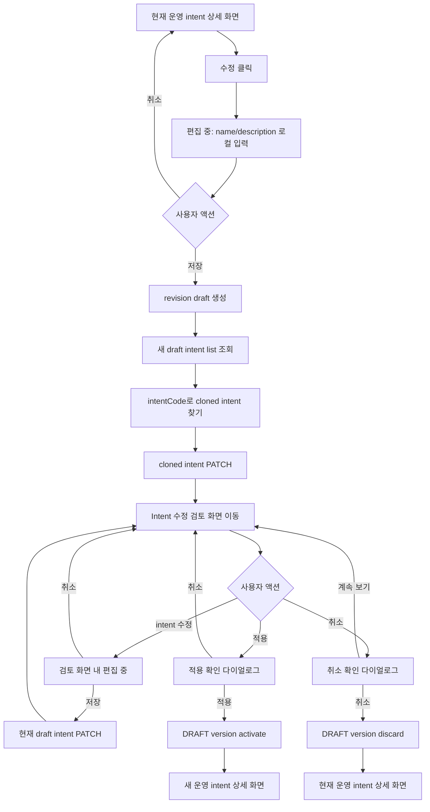
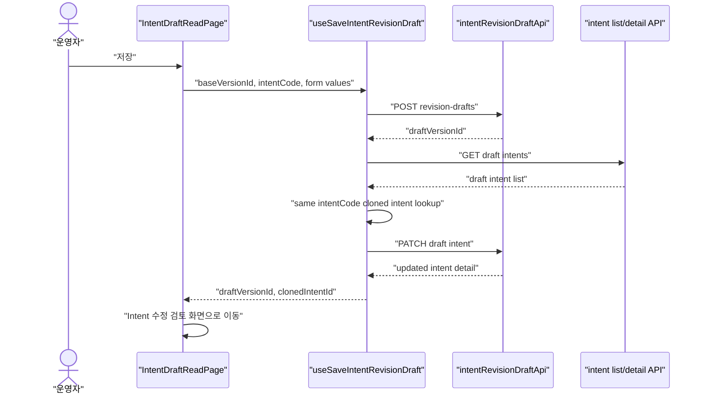
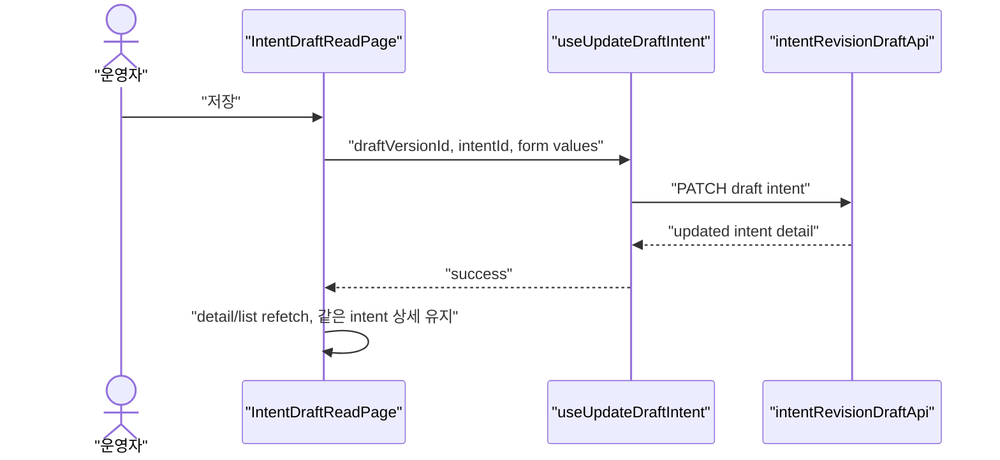

# 311: [FE] Conversation Intent 이름 수정 기능

> Issue: #311
> Branch: spec/311
> Template: _TEMPLATE_FE.md

---

## Goal

운영자가 현재 운영 중인 Domain Pack version의 intent 이름과 설명을 안전하게 수정하고, 적용 전 `Intent 수정 검토` 화면에서 변경 내용을 확인한 뒤 version 단위로 적용 또는 취소할 수 있는 FE UX를 구현한다.

---

## Scope

### In Scope

- 현재 운영 중인 `PUBLISHED` version의 intent `name`, `description` 수정 폼 제공
- 최초 저장 시 기존 Backend revision draft API를 조합하여 DB에 수정 후보 version 생성
- DB에 생성된 intent 수정 후보 version을 `Intent 수정 검토` 화면으로 표시
- `Intent 수정 검토` 화면에서 intent 재수정, 적용, 취소 제공
- tree row에 로컬 `수정 중`, 저장 후 `수정됨` 배지 표시
- 미저장 변경이 있는 앱 내부 이동 guard
- FE 단위/컴포넌트 테스트

### Out of Scope

- Backend 신규 API, DB schema 변경
- 과거 `PUBLISHED` version 기반 restore 편집 UX
- `intentCode`, taxonomy, parent intent, JSON 필드 수정
- 상세 diff UI
- 브라우저 새로고침/탭 닫기 `beforeunload` guard
- E2E 테스트

---

## Terminology

| 용어 | 정의 |
| --- | --- |
| 현재 운영 version | 같은 pack의 `PUBLISHED` version 중 `versionNo`가 가장 큰 version |
| 편집 중 | DB 변경 없이 intent 수정 폼에 로컬 입력값이 있는 상태 |
| Intent 수정 초안 | 저장 후 DB에 생성된 `DRAFT` version. 내부적으로 `summaryJson.draftSource.type = "INTENT_REVISION"` |
| Intent 수정 검토 | Intent 수정 초안을 적용하기 전 확인하고 추가 수정하는 화면 상태 |
| 적용 | Intent 수정 초안 version을 `PUBLISHED`로 승격 |
| 취소 | Intent 수정 초안 version을 폐기하고 현재 운영 version으로 이동 |

---

## User Flow Chart



---

## Design Diff

### As-is vs To-be

| 영역 | As-is | To-be | 변경 내용 |
| --- | --- | --- | --- |
| Intent page header | `Intent 초안 조회`, `READ ONLY` | version 상태별 라벨 | `운영 중`, `Intent 수정 검토`, `이전 버전` 표시 |
| Intent 상세 패널 | 읽기 전용 + 개별 승인/반려 | 읽기 + 수정 폼 + source별 action | `INTENT_REVISION`에서는 승인/반려 숨김 |
| Intent 수정 | 불가 | `name`, `description` 편집 | `intentCode` 등 연결 필드는 읽기 전용 |
| 저장 | 없음 | PUBLISHED 첫 저장은 draft 생성 + PATCH, draft 내 저장은 PATCH only | page가 저장 orchestration 담당 |
| 적용/취소 | summary의 activate 중심 | Intent 수정 검토 화면 상단 action | 적용/취소 확인 다이얼로그 |
| Tree 표시 | status/taxonomy만 표시 | `수정 중`, `수정됨` marker 추가 | 수정 맥락을 좌측 tree에서 확인 |
| 이동 guard | 없음 | 미저장 변경이 있으면 앱 내부 이동 경고 | `저장하지 않고 이동 시 수정 내역은 사라집니다.` |

---

## Screen States

| 상태 | 판단 기준 | Header label | 주요 UI |
| --- | --- | --- | --- |
| 현재 운영 version | `lifecycleStatus = PUBLISHED` + PUBLISHED 중 최대 `versionNo` | `운영 중` | intent `수정` 가능 |
| 편집 중 | 현재 운영 화면 또는 검토 화면에서 폼 dirty | 별도 page label 변경 없음 | 폼 안 `저장`, `취소` |
| Intent 수정 검토 | `lifecycleStatus = DRAFT` + `draftSource.type = "INTENT_REVISION"` | `Intent 수정 검토` | 상단 `적용`, `취소`; intent `수정` 가능 |
| 과거 version | `lifecycleStatus = PUBLISHED`이나 current 아님 | `이전 버전` | read-only |
| 일반 DRAFT | `lifecycleStatus = DRAFT`이나 `INTENT_REVISION` 아님 | 기존 검토 흐름 유지 | 기존 승인/반려 UX 유지 |

`draftSource.type`은 `version.summaryJson`에서 파싱한다. 파싱 실패 시 `INTENT_REVISION`으로 간주하지 않고 기존 read/review 흐름으로 fallback한다.

---

## Component Tree

```
IntentDraftReadPage
├─ PageHeader
│  ├─ Breadcrumb
│  ├─ VersionStateBadge
│  └─ IntentRevisionDraftActions (INTENT_REVISION DRAFT only, 신규 예정)
│     ├─ ApplyButton
│     ├─ CancelButton
│     ├─ ApplyConfirmDialog
│     └─ CancelConfirmDialog
├─ IntentTreePanel (기존 확장)
│  └─ IntentTreeRow
│     └─ IntentTreeMarker ("수정 중" | "수정됨", 신규 prop)
└─ IntentDetailPanel (기존 재사용)
   ├─ DetailHeader
   ├─ InfoCards
   ├─ JsonCards
   └─ IntentRevisionEditForm (신규 예정)
      ├─ name input
      ├─ description textarea
      ├─ SaveButton
      └─ CancelButton
```

### 기존 확인된 파일

| 파일 | 현재 역할 |
| --- | --- |
| `frontend/src/pages/domain-pack/ui/IntentDraftReadPage.tsx` | intent 목록/상세 page 조합 |
| `frontend/src/features/intent-draft-read/ui/IntentTreePanel.tsx` | intent tree 목록 |
| `frontend/src/features/intent-draft-read/ui/IntentDetailPanel.tsx` | intent 상세 조회 패널 |
| `frontend/src/features/approve-intent/ui/IntentDetailWithApproval.tsx` | 기존 개별 승인/반려 wrapper |
| `frontend/src/features/domain-pack-summary-read/model/usePackDetail.ts` | domain pack/version detail 조회 |
| `frontend/src/shared/api/index.ts` | `apiClient`, `ApiRequestError` |
| `frontend/src/shared/api/mutator.ts` | generated endpoint용 `customFetch` |
| `frontend/DESIGN.md` | FE 디자인 규칙 |

### 신규 예정 파일

아래 경로는 구현 단계에서 생성할 신규 예정 경로다.

| 파일 | 설명 |
| --- | --- |
| `frontend/src/features/intent-revision-draft/api/intentRevisionDraftApi.ts` | generated에 없는 revision/update/discard endpoint wrapper |
| `frontend/src/features/intent-revision-draft/model/useSaveIntentRevisionDraft.ts` | current PUBLISHED 첫 저장 orchestration |
| `frontend/src/features/intent-revision-draft/model/useUpdateDraftIntent.ts` | 기존 draft intent PATCH |
| `frontend/src/features/intent-revision-draft/model/useIntentRevisionMarkers.ts` | `수정 중`/`수정됨` marker 계산 |
| `frontend/src/features/intent-revision-draft/ui/IntentRevisionEditForm.tsx` | name/description 수정 폼 |
| `frontend/src/features/intent-revision-draft/ui/IntentRevisionDraftActions.tsx` | 적용/취소 action + 확인 dialog |

---

## API Integration

Backend 신규 API는 추가하지 않는다. 기존 Backend 계약을 FE에서 조합한다.

### Endpoints

| Method | Path | FE 사용 |
| --- | --- | --- |
| `GET` | `/api/v1/workspaces/{workspaceId}/domain-packs/{packId}` | pack version list로 current PUBLISHED 판단 |
| `GET` | `/api/v1/workspaces/{workspaceId}/domain-packs/{packId}/versions/{versionId}` | lifecycle/source 판단 |
| `GET` | `/api/v1/workspaces/{workspaceId}/domain-packs/{packId}/versions/{versionId}/intents` | intent list, cloned intent lookup, marker 비교 |
| `GET` | `/api/v1/workspaces/{workspaceId}/domain-packs/{packId}/versions/{versionId}/intents/{intentId}` | intent detail |
| `POST` | `/api/v1/workspaces/{workspaceId}/domain-packs/{packId}/versions/{versionId}/revision-drafts` | current PUBLISHED 첫 저장 시 Intent 수정 초안 생성 |
| `PATCH` | `/api/v1/workspaces/{workspaceId}/domain-packs/{packId}/versions/{draftVersionId}/intents/{intentId}` | draft 안 intent name/description 저장 |
| `POST` | `/api/v1/workspaces/{workspaceId}/domain-packs/{packId}/versions/{versionId}/activate` | Intent 수정 초안 적용 |
| `DELETE` | `/api/v1/workspaces/{workspaceId}/domain-packs/{packId}/versions/{draftVersionId}/draft` | Intent 수정 초안 취소 |

### Endpoint 호출 방식

- generated endpoint가 있는 API는 generated hook/function을 재사용한다.
- generated endpoint가 없는 API는 `features/intent-revision-draft/api` 내부에서 feature-local wrapper를 만든다.
- wrapper는 `apiClient` 또는 `customFetch`를 사용하고, 컴포넌트는 wrapper/hook만 호출한다.
- OpenAPI/generated 갱신은 이번 티켓 필수 범위가 아니다.

### Draft Intent Update Body

FE는 수정 허용 필드 중 아래만 전송한다.

```typescript
interface UpdateDraftIntentBody {
  name: string;
  description: string;
}
```

`intentCode`, `status`, `parentIntentId`, `taxonomyLevel`, `entryConditionJson`, `metaJson`은 이번 FE 수정 폼에서 변경하지 않는다.

---

## Data Flow

### Current PUBLISHED 첫 저장



### Intent 수정 검토 화면 내 저장



---

## State Management

### Server State

- version detail: lifecycle/source 판단
- pack detail/version list: current PUBLISHED 판단
- intent list/detail: tree/detail 렌더링
- base version intent list: `수정됨` marker 계산

### Client State

| State | 설명 |
| --- | --- |
| `editingIntentId` | 현재 폼이 열린 intent id |
| `formValues` | `name`, `description` 로컬 입력값 |
| `isDirty` | 원본 detail과 form 값 비교 |
| `pendingNavigation` | 미저장 이동 guard에서 보류 중인 이동 |
| `localMarkers` | DB 저장 전 `수정 중` marker |

---

## Marker Policy

### 수정 중

- DB 저장 전 로컬 폼 dirty 상태에서 표시한다.
- current PUBLISHED 화면에서 사용자가 intent를 수정 중일 때 해당 intent row에 표시한다.
- 기준은 현재 선택 intent의 form dirty 상태다.

### 수정됨

- DB에 Intent 수정 초안이 생성된 뒤 `Intent 수정 검토` 화면에서 표시한다.
- `summaryJson.draftSource.baseVersionId`의 intent list와 현재 draft intent list를 `intentCode` 기준으로 비교한다.
- `name` 또는 `description`이 다르면 해당 intent row에 표시한다.
- 상세 diff UI는 1차 범위에서 제외한다.

---

## Validation

| Field | Rule | UI 처리 |
| --- | --- | --- |
| `name` | 필수, trim 후 non-empty, 60자 이하 | inline error, 저장 disabled |
| `description` | 선택, 1000자 이하, 빈 값 저장 가능 | inline error, 저장 disabled |
| `intentCode` | 읽기 전용 | 입력 필드 없음 |

Backend는 `name` 255자까지 허용하지만, FE는 콘솔 표시명 품질을 위해 60자로 제한한다.

---

## Navigation & Guard

### 저장 후 위치

| Action | 이동 |
| --- | --- |
| current PUBLISHED에서 첫 저장 | 새 draft version의 같은 `intentCode` cloned intent 상세 |
| Intent 수정 검토 화면에서 intent 저장 | 같은 intent 상세 유지 + refetch |
| 적용 성공 | 방금 `PUBLISHED` 된 같은 intent 상세 |
| 취소 성공 | current PUBLISHED version의 같은 `intentCode` intent 상세, 없으면 intent 목록 |

### 미저장 내부 이동 guard

- 대상: 다른 intent 선택, 목록 이동, 앱 내부 route 변경
- 조건: 폼 dirty 상태
- 문구: `저장하지 않고 이동 시 수정 내역은 사라집니다.`
- 버튼: `이동`, `취소`
- `이동`: 로컬 입력 폐기 후 이동
- `취소`: 현재 편집 유지
- 브라우저 새로고침/탭 닫기 guard는 제외한다.

---

## Feedback Policy

| 상황 | 피드백 |
| --- | --- |
| 개별 intent 저장 성공 | toast 없음. 상세 패널/tree 갱신으로 대체 |
| current PUBLISHED 첫 저장 성공 | toast 없음. Intent 수정 검토 화면 이동 + `수정됨` 표시 |
| 개별 intent 저장 실패 | toast: `Intent 수정 내용 저장에 실패했습니다.` |
| 적용 클릭 | 확인 다이얼로그 |
| 적용 성공 | toast: `Intent 수정 초안이 적용되었습니다.` |
| 취소 클릭 | 확인 다이얼로그 |
| 취소 성공 | toast: `Intent 수정 초안이 취소되었습니다.` |
| pack에 DRAFT가 이미 있음 | dialog: `진행 중인 Intent 수정 초안이 있어 새 초안을 만들 수 없습니다.` |
| revision draft 생성 후 PATCH 실패 | toast: `Intent 수정 초안은 생성됐지만 수정 내용 저장에 실패했습니다.` 후 생성된 draft로 이동 |

### 적용 확인 다이얼로그

- 제목: `Intent 수정 초안을 적용할까요?`
- 설명: `저장된 intent 수정 내용이 새 운영 버전으로 반영됩니다.`
- 버튼: `적용`, `취소`

### 취소 확인 다이얼로그

- 제목: `Intent 수정 초안을 취소할까요?`
- 설명: `이 초안에 저장된 intent 수정 내용이 폐기되고 현재 운영 버전으로 돌아갑니다.`
- 버튼: `취소`, `계속 보기`

---

## Error Handling

| Error | 상황 | FE 처리 |
| --- | --- | --- |
| `409` draft already exists | current PUBLISHED 첫 저장 중 pack에 DRAFT 존재 | 기존 DRAFT 이동 dialog. 로컬 입력 자동 반영 금지 |
| cloned intent not found | draft 생성 후 같은 `intentCode` 없음 | toast 표시 후 draft intent 목록 이동 |
| PATCH failure after draft created | draft 생성 성공, 수정 저장 실패 | draft 자동 폐기 금지. 생성된 draft로 이동 |
| validation error | FE 검증 또는 Backend 400 | inline error 또는 toast |
| 403/404 | 권한/대상 없음 | toast 또는 기존 error state |

---

## Design Rules

- 구현 전 `frontend/DESIGN.md`를 확인하고 기존 intent 화면 톤을 유지한다.
- `IntentDetailPanel`, `IntentTreePanel`의 구조와 간격을 확장한다.
- 버튼은 `frontend/src/shared/ui/button/Button.tsx`를 우선 사용한다.
- 확인/경고 dialog는 기존 shared dialog 패턴이 있으면 재사용한다.
- toast는 기존처럼 `sonner`를 사용한다.
- 폼은 detail panel 안에서 간결하게 제공한다.
- 새 card-heavy 레이아웃이나 별도 landing 화면을 만들지 않는다.

---

## Tests

### Test Strategy

| 구분 | 방법 | 도구 | 비고 |
| --- | --- | --- | --- |
| Hook test | orchestration 순서 검증 | Vitest | API mock |
| Component test | 상태 분기/폼/marker 검증 | Testing Library | 기존 page 테스트 패턴 |
| E2E | 제외 | - | 이번 범위 아님 |

### Test Scenarios

#### Happy Path

| # | 시나리오 | 사전 조건 | 조작 | 기대 결과 |
| --- | --- | --- | --- | --- |
| 1 | current PUBLISHED intent 첫 저장 | current PUBLISHED, intent status PUBLISHED | 수정 후 저장 | revision draft 생성, 같은 `intentCode` PATCH, Intent 수정 검토 화면 이동 |
| 2 | Intent 수정 검토 화면에서 재저장 | `INTENT_REVISION` DRAFT | 수정 후 저장 | 현재 draft intent PATCH, 같은 상세 유지, toast 없음 |
| 3 | 적용 | `INTENT_REVISION` DRAFT | 적용 확인 | activate 호출, 같은 intent 상세 유지, 성공 toast |
| 4 | 취소 | `INTENT_REVISION` DRAFT | 취소 확인 | discard 호출, current PUBLISHED 같은 intent 이동 |
| 5 | 수정됨 marker | base와 draft의 name 또는 description 다름 | Intent 수정 검토 진입 | tree row에 `수정됨` 표시 |

#### Error & Edge Cases

| # | 시나리오 | 조작 | 기대 결과 |
| --- | --- | --- | --- |
| 1 | DRAFT 중복 | current PUBLISHED에서 저장 시 409 | 기존 DRAFT 이동 dialog, 로컬 입력 자동 반영 없음 |
| 2 | draft 생성 후 PATCH 실패 | revision draft 생성 성공 후 PATCH 실패 | toast 표시, 생성된 draft로 이동 |
| 3 | cloned intent 없음 | draft intent list에 같은 `intentCode` 없음 | toast 표시, draft intent 목록 fallback |
| 4 | name 빈 값 | name을 공백으로 입력 | inline error, 저장 disabled |
| 5 | name 60자 초과 | 61자 입력 | inline error, 저장 disabled |
| 6 | description 1000자 초과 | 1001자 입력 | inline error, 저장 disabled |
| 7 | 미저장 변경 후 intent 이동 | 폼 dirty 상태에서 다른 intent 클릭 | guard dialog, `이동`/`취소` 분기 |
| 8 | 과거 PUBLISHED | current가 아닌 PUBLISHED version 진입 | `이전 버전`, 수정 불가 |

---

## Acceptance Criteria

- [ ] current PUBLISHED intent 상세에서 `수정`을 눌러 `name`, `description`을 편집할 수 있다.
- [ ] PUBLISHED 첫 저장은 DB에 Intent 수정 초안을 생성하고 같은 `intentCode`의 cloned intent를 PATCH한다.
- [ ] 저장 후 새 `Intent 수정 검토` 화면에서 같은 intent 상세가 유지된다.
- [ ] Intent 수정 검토 화면에서 `적용`, `취소` action이 보이고 개별 승인/반려는 보이지 않는다.
- [ ] Intent 수정 검토 화면에서 intent를 다시 수정하면 현재 draft intent만 PATCH한다.
- [ ] tree row에 저장 전 `수정 중`, 저장 후 `수정됨` marker가 표시된다.
- [ ] `name` 필수/60자, `description` 1000자 검증이 동작한다.
- [ ] 미저장 내부 이동 시 경고하고 `이동`, `취소` 선택을 제공한다.
- [ ] 과거 PUBLISHED version에서는 수정할 수 없다.
- [ ] Backend 신규 API 없이 기존 endpoint 조합으로 동작한다.
