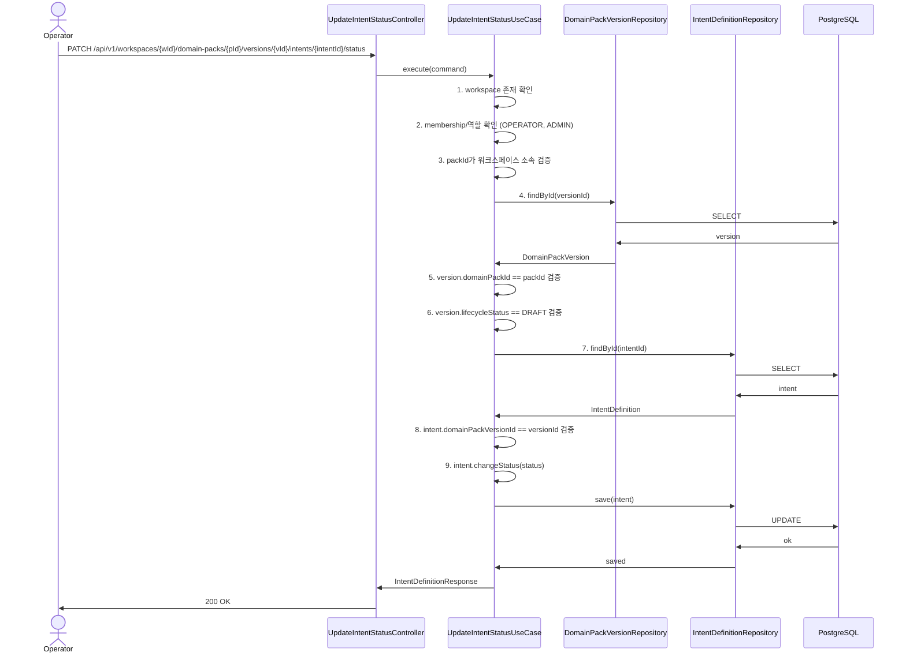
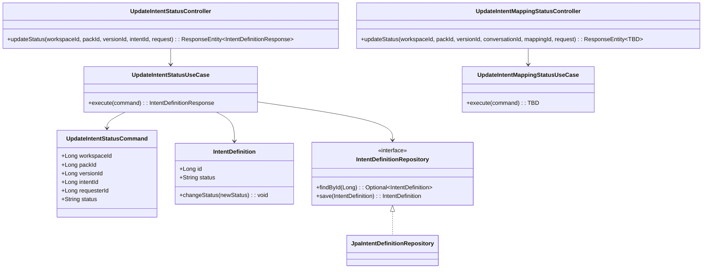

# 313: [BE] Conversation Intent 승인/반려 API

> Issue: #313 (Burndown Studio)
> Branch: spec/313
> Template: _TEMPLATE_BE.md

## Goal

운영자가 `domain_pack_version`에 속한 `intent_definition`의 상태를 승인(`PUBLISHED`) 또는 반려(`REJECTED`)할 수 있는 REST API를 제공한다. 이 API는 `DomainPackVersion.lifecycle_status = 'DRAFT'`인 경우에만 허용한다.

---

## REST API

### Endpoint

| Method | Path | Description |
| --- | --- | --- |
| `PATCH` | `/api/v1/workspaces/{workspaceId}/domain-packs/{packId}/versions/{versionId}/intents/{intentId}/status` | Intent status 전환 |
| `PATCH` | `/api/v1/workspaces/{workspaceId}/domain-packs/{packId}/versions/{versionId}/conversations/{conversationId}/intent-mappings/{mappingId}/status` | Intent Mapping status 전환 |

### Request

**1. Intent status 전환**

```json
{
  "status": "PUBLISHED"
}
```

허용 값
- `PUBLISHED` (승인)
- `REJECTED` (반려)

**2. Intent Mapping status 전환** (TBD)

```json
{
  "status": "PUBLISHED"
}
```

허용 값
- `PUBLISHED` (승인)
- `REJECTED` (반려)

### Response

**200 OK — Intent status 전환**

```json
{
  "id": 42,
  "domainPackVersionId": 10,
  "intentCode": "refund_inquiry",
  "name": "환불 문의",
  "description": "환불 관련 문의 의도",
  "taxonomyLevel": 2,
  "parentIntentId": null,
  "sourceClusterRef": [{"conversationId": "conv_001", "turnIds": [1, 2]}],
  "entryConditionJson": "{}",
  "evidenceJson": "[]",
  "metaJson": "{}",
  "status": "PUBLISHED",
  "createdAt": "2026-04-16T10:00:00Z",
  "updatedAt": "2026-04-16T10:30:00Z"
}
```

### Error Responses

`400 INTENT_NOT_EDITABLE`

```json
{
  "code": "INTENT_NOT_EDITABLE",
  "message": "DRAFT 상태의 버전에서만 의도를 승인/반려할 수 있습니다."
}
```

`400 VALIDATION_ERROR` — 허용되지 않는 상태 값

```json
{
  "code": "VALIDATION_ERROR",
  "message": "허용되지 않은 상태 값입니다: INVALID. 허용 값: PUBLISHED, REJECTED"
}
```

`400 VALIDATION_ERROR`

```json
{
  "code": "VALIDATION_ERROR",
  "errors": ["status는 필수 항목입니다."]
}
```

`403 FORBIDDEN`

```json
{
  "code": "FORBIDDEN",
  "message": "OPERATOR 또는 ADMIN 권한이 필요합니다."
}
```

`404 NOT_FOUND`

```json
{
  "code": "NOT_FOUND",
  "message": "의도를 찾을 수 없습니다: 42"
}
```

---

## Application Flow

검증 순서는 다음과 같다.

1. `workspaceId` 존재 확인
2. 요청 사용자의 워크스페이스 멤버십/역할 확인
   - 허용 역할: `OPERATOR`, `ADMIN`
   - 비허용 역할: 그 외 역할은 `403 FORBIDDEN`
3. `packId`가 해당 `workspaceId` 소속인지 검증
4. `versionId`로 `DomainPackVersion` 조회
5. `version.domainPackId == packId` 검증
6. `version.lifecycleStatus == DRAFT` 검증
7. `intentId`로 `IntentDefinition` 조회
8. `intent.domainPackVersionId == versionId` 검증
9. `intent.changeStatus(status)` 호출
10. 저장 후 `IntentDefinitionResponse` 반환

핵심 포인트
- 실제 조회 키는 `versionId`, `intentId`다.
- `packId`는 경로 일관성 검증용이다.
- `workspaceId`는 권한 확인과 `packId`의 워크스페이스 소속 검증에 사용된다.
- 다른 version에 속한 intent를 path 조합으로 접근하면 `404`로 처리한다.
- 다른 workspace에 속한 pack/version/intent를 path 조합으로 접근하면 `404`로 처리한다.

---

## Sequence Diagram



---

## Class Design



---

## Tests

### Unit Tests

```java
@DisplayName("UpdateIntentStatusUseCase")
class UpdateIntentStatusUseCaseTest {

    @Test
    @DisplayName("PUBLISHED로 상태 변경")
    void changeStatus_toPublished_success() {
        // given
        var command = new UpdateIntentStatusCommand(1L, 10L, 100L, 42L, "user1", "PUBLISHED");
        var intent = IntentDefinitionFixture.create(100L, "INTENT_001");
        
        // when
        var result = useCase.execute(command);
        
        // then
        assertThat(result.status()).isEqualTo("PUBLISHED");
    }

    @Test
    @DisplayName("REJECTED로 상태 변경")
    void changeStatus_toRejected_success() {
        // given
        var command = new UpdateIntentStatusCommand(1L, 10L, 100L, 42L, "user1", "REJECTED");
        
        // when
        var result = useCase.execute(command);
        
        // then
        assertThat(result.status()).isEqualTo("REJECTED");
    }

    @Test
    @DisplayName("허용되지 않는 상태 값")
    void changeStatus_withInvalidStatus_throwsException() {
        // given
        var command = new UpdateIntentStatusCommand(1L, 10L, 100L, 42L, "user1", "INVALID");
        
        // then
        assertThatThrownBy(() -> useCase.execute(command))
            .isInstanceOf(IllegalArgumentException.class)
            .hasMessageContaining("허용되지 않은 상태 값");
    }
}
```

### Integration Tests

```java
@SpringBootTest
@AutoConfigureMockMvc
@DisplayName("UpdateIntentStatusController")
class UpdateIntentStatusControllerTest {

    @Test
    @DisplayName("PATCH /intents/{intentId}/status - 정상 요청")
    void updateStatus_returnsOk() throws Exception {
        mockMvc.perform(patch("/api/v1/workspaces/1/domain-packs/10/versions/100/intents/42/status")
                .header("Authorization", "Bearer " + validToken)
                .contentType(MediaType.APPLICATION_JSON)
                .content("{\"status\": \"PUBLISHED\"}"))
            .andExpect(status().isOk())
            .andExpect(jsonPath("$.status").value("PUBLISHED"));
    }

    @Test
    @DisplayName("PATCH /intents/{intentId}/status - 비허용 역할 403")
    void updateStatus_withForbiddenRole_returns403() throws Exception {
        mockMvc.perform(patch("/api/v1/workspaces/1/domain-packs/10/versions/100/intents/42/status")
                .header("Authorization", "Bearer " + userToken)
                .contentType(MediaType.APPLICATION_JSON)
                .content("{\"status\": \"PUBLISHED\"}"))
            .andExpect(status().isForbidden());
    }

    @Test
    @DisplayName("PATCH /intents/{intentId}/status - 잘못된 status 400")
    void updateStatus_withInvalidStatus_returns400() throws Exception {
        mockMvc.perform(patch("/api/v1/workspaces/1/domain-packs/10/versions/100/intents/42/status")
                .header("Authorization", "Bearer " + validToken)
                .contentType(MediaType.APPLICATION_JSON)
                .content("{\"status\": \"INVALID\"}"))
            .andExpect(status().isBadRequest())
            .andExpect(jsonPath("$.code").value("VALIDATION_ERROR"));
    }
}
```

### Test Checklist

- [ ] 정상 시나리오: 유효 입력 시 기대 응답 검증
- [ ] 멱등성: 동일 입력 반복 호출 시 응답 일관성 검증
- [ ] 유효성 오류: 필수 필드 누락/형식 오류 시 에러 검증
- [ ] 권한/인증 오류: 인증 불가 상태에서의 에러 검증
- [ ] 상태 전이: DRAFT → PUBLISHED, DRAFT → REJECTED 검증
- [ ] 경계값: 잘못된 status 값에 대한 에러 검증
- [ ] 버전 검증: PUBLISHED 버전 수정 시도 시 400 반환

---

## Database

### Migration (Liquibase)

현재 `pack.intent_definition`의 `status` 컬럼은 존재하나 허용 값 체크 제약이 없다. `PUBLISHED`, `REJECTED`를 허용하는 체크 제약을 추가한다.

```sql
-- Step 1: 기존 ACTIVE 상태를 PUBLISHED로 마이그레이션
UPDATE pack.intent_definition
SET status = 'PUBLISHED'
WHERE status = 'ACTIVE';

-- Step 2: CHECK 제약 추가
ALTER TABLE pack.intent_definition
    ADD CONSTRAINT chk_intent_definition_status
        CHECK (status IN ('PUBLISHED', 'REJECTED'));
```

참고: `status` 컬럼은 이미 존재하며, 기존 레코드는 모두 `'ACTIVE'` 상태이므로 Step 1에서 `'PUBLISHED'`로 전환 후 제약을 추가한다.

---

## Domain / Persistence Changes

### `IntentDefinition`

추가/변경 사항
- `changeStatus(String newStatus)` 메서드 추가
- 상수 추가: `STATUS_ACTIVE = "ACTIVE"`, `STATUS_PUBLISHED = "PUBLISHED"`, `STATUS_REJECTED = "REJECTED"`

허용 상태
- `ACTIVE` (초기 상태, `IntentDefinition.create()`에서 기본값으로 설정)
- `PUBLISHED` (승인 상태)
- `REJECTED` (반려 상태)

상태 전이
- `ACTIVE` → `PUBLISHED` (승인)
- `ACTIVE` → `REJECTED` (반려)

```java
public void changeStatus(String newStatus) {
    if (!STATUS_PUBLISHED.equals(newStatus) && !STATUS_REJECTED.equals(newStatus)) {
        throw new IllegalArgumentException("허용되지 않은 상태 값입니다: " + newStatus + ". 허용 값: PUBLISHED, REJECTED");
    }
    this.status = newStatus;
}
```

### `UpdateIntentStatusCommand`

신규 생성. 변경 요청을 운반한다.

```java
public record UpdateIntentStatusCommand(
    Long workspaceId,
    Long packId,
    Long versionId,
    Long intentId,
    String requesterId,
    String status
) {}
```

### `UpdateIntentStatusUseCase`

신규 생성. 10단계 검증 흐름을 오케스트레이션한다.

```java
@Service
@RequiredArgsConstructor
@Transactional
public class UpdateIntentStatusUseCase {
    // workspaceRepository, membershipRepository, versionRepository, intentRepository 주입
    // execute(command): 10단계 검증 후 변경
}
```

### `UpdateIntentStatusController`

신규 생성. PATCH 엔드포인트를 노출한다.

```java
@RestController
@RequiredArgsConstructor
@RequestMapping("/api/v1/workspaces/{workspaceId}/domain-packs/{packId}/versions/{versionId}/intents")
public class UpdateIntentStatusController {
    private final UpdateIntentStatusUseCase useCase;

    @PatchMapping("/{intentId}/status")
    public ResponseEntity<IntentDefinitionResponse> updateStatus(
            @PathVariable Long workspaceId,
            @PathVariable Long packId,
            @PathVariable Long versionId,
            @PathVariable Long intentId,
    @Valid @RequestBody UpdateIntentStatusRequest request,
        Authentication authentication) {
    Long userId = AuthenticationUtils.getUserId(authentication);
    // userId 포함 command 생성 후 useCase 실행
    }
}
```

### `IntentDefinitionResponse`

기존 응답 DTO에 `changeStatus` 이후 반환용 필드 매핑 확인.

### Repository

`IntentDefinitionRepository`
- `findById(Long id)`

---

## Out of Scope

- intent 일반 필드 수정 API (별도 스펙)
- bulk 승인/반려
- 반려 사유(`reason`) 필드
- 수정 요청(`MODIFICATION_REQUEST`) 상태
- review task 자동 생성
- review 모듈 배치 금지
- ApprovalService 미사용
- publish/runtime에서 intent status를 실제 실행 판단에 반영하는 로직

---

## Additional Notes

### Intent Mapping 승인 API (TBD)

Intent Mapping(status) 승인을 위한 엔드포인트가 별도로 추가된다:
- `PATCH /api/v1/workspaces/{workspaceId}/domain-packs/{packId}/versions/{versionId}/conversations/{conversationId}/intent-mappings/{mappingId}/status`

데이터 구조(Request/Response)는 추후 정의(TBD)된다.

### Key Decisions

- 의도 상태 전이: `ACTIVE` → `PUBLISHED` (승인), `ACTIVE` → `REJECTED` (반려)
- 전제 조건: DomainPackVersion의 `lifecycle_status`가 `DRAFT`인 경우에만 허용
- 상태 값 명명: 사용자 확정사항에 따라 `PUBLISHED`/`REJECTED` 사용
- 승인 범위: Definition + Mapping 둘 다 승인 가능
- 권한: OPERATOR, ADMIN만 허용
- 모듈 배치: domain-pack 모듈 (review 아님)

