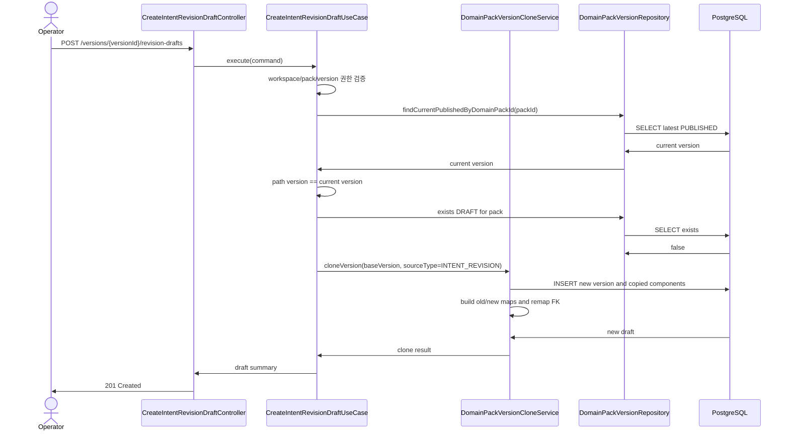
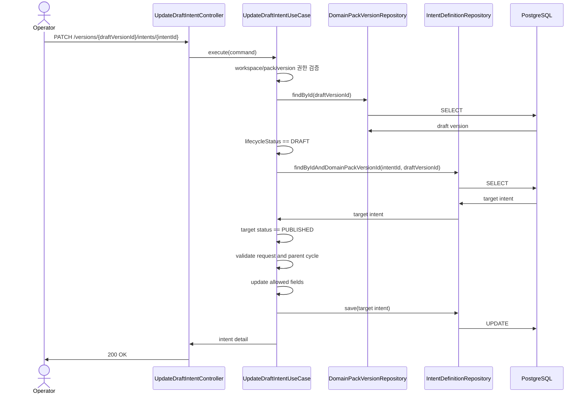
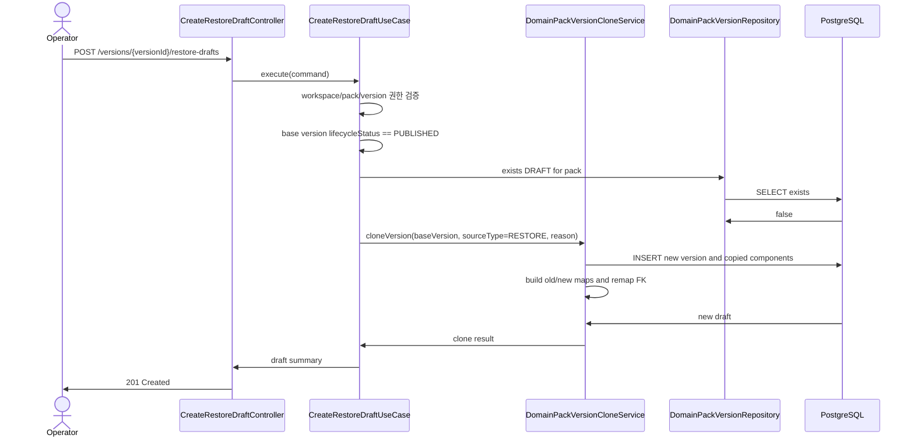

# 314: [BE] Conversation Intent 보정 Draft / Version Restore Draft API

> Issue: #314
> Branch: feature/314-intent-revision-draft
> Template: _TEMPLATE_BE.md

## Goal

운영 중인 Domain Pack Version을 직접 수정하지 않고, 현재 운영 version 또는 과거 published version을 기준으로 새 `DRAFT` version을 생성하여 Conversation Intent 보정안 또는 복구안을 안전하게 준비할 수 있는 REST API를 제공한다.

---

## Current State

확인된 기존 경로:

| Path | 현재 역할 |
| --- | --- |
| `backend/src/main/java/com/init/domainpack/domain/model/DomainPackVersion.java` | `DRAFT`, `PUBLISHED` lifecycle 및 `activate()` 보유 |
| `backend/src/main/java/com/init/domainpack/domain/model/IntentDefinition.java` | intent 필드, `DRAFT/PUBLISHED/REJECTED` 상태, 승인/반려 전이 보유 |
| `backend/src/main/java/com/init/domainpack/application/ActivateDomainPackVersionUseCase.java` | version activate 처리. 현재는 기존 published 비활성화 없음 |
| `backend/src/main/java/com/init/domainpack/application/DomainPackDraftPersistenceService.java` | 신규 draft version 생성 및 pipeline draft 적재 로직 보유 |
| `backend/src/main/java/com/init/domainpack/domain/repository/DomainPackVersionRepository.java` | `findMaxVersionNoByDomainPackId` 보유 |
| `backend/src/main/java/com/init/domainpack/domain/repository/IntentDefinitionRepository.java` | version별 intent 조회/저장 보유 |
| `backend/src/main/java/com/init/domainpack/domain/repository/SlotDefinitionRepository.java` | version별 slot 목록 조회/저장 보유 |
| `backend/src/main/java/com/init/domainpack/domain/repository/PolicyDefinitionRepository.java` | version별 policy 목록 조회/저장 보유 |
| `backend/src/main/java/com/init/domainpack/domain/repository/RiskDefinitionRepository.java` | version별 risk 목록 조회/저장 보유 |
| `backend/src/main/java/com/init/domainpack/domain/repository/WorkflowDefinitionRepository.java` | workflow summary 조회는 있으나 복제용 full entity 목록 조회는 없음 |
| `backend/src/main/java/com/init/domainpack/domain/repository/IntentSlotBindingRepository.java` | binding 저장만 있음. 복제용 조회 메서드 없음 |
| `backend/src/main/java/com/init/domainpack/domain/repository/IntentWorkflowBindingRepository.java` | binding 저장만 있음. 복제용 조회 메서드 없음 |

현재 `DomainPackVersion.lifecycleStatus = PUBLISHED`는 “published 된 version”을 나타내지만, 별도의 `currentVersionId`나 `ACTIVE/SUPERSEDED` 상태는 없다. 본 스펙에서는 **현재 운영 version**을 “같은 pack의 `PUBLISHED` version 중 `versionNo`가 가장 큰 version”으로 정의한다.

---

## Terminology

| 용어 | 정의 |
| --- | --- |
| 현재 운영 version | 같은 `domain_pack` 안에서 `lifecycleStatus = PUBLISHED`이고 `versionNo`가 가장 큰 version |
| Intent 보정 Draft | 현재 운영 version 전체를 새 `DRAFT` version으로 한 번 복제하여 여러 intent를 편집할 수 있게 만든 version |
| Draft Intent 수정 | 이미 생성된 `DRAFT` version 안의 intent 정의 필드를 수정하는 작업 |
| Restore Draft | 현재 운영 version보다 이전인 `PUBLISHED` version 전체를 새 `DRAFT` version으로 복제한 version |
| 기준 version | 보정 또는 복구의 source가 되는 기존 `DomainPackVersion` |

---

## Decisions

- Published version은 in-place 수정하지 않는다.
- 과거 published version을 직접 재활성화하지 않는다.
- 보정/복구는 항상 새 `DRAFT DomainPackVersion`을 생성한다.
- Intent 보정 Draft 생성은 version 전체 복제를 한 번만 수행한다. 이후 여러 intent 수정은 생성된 `DRAFT` version 내부 row를 update한다.
- 새 draft activate는 기존 activate API를 사용하며, 본 스펙에서 activate API에 최신 version 검증을 추가한다.
- pack당 동시에 존재 가능한 `DRAFT` version은 하나만 허용한다.
- 생성된 draft를 취소하려면 draft discard API로 물리 삭제한다. discard는 `DRAFT` version에만 허용하며, `DISCARDED` lifecycle status는 도입하지 않는다.
- version 목록은 숨기지 않는다. restore/revision 출처는 `summaryJson`에 기록하여 badge/filter로 표현할 수 있게 한다.
- 진행 중인 `ChatSession` migration, 신규 세션의 active version 선택 정책은 본 스펙 범위에서 제외한다.
- Restore Draft의 기준 version은 현재 운영 version보다 낮은 `versionNo`를 가진 과거 `PUBLISHED` version만 허용한다. 현재 운영 version을 기준으로 새 draft를 만들 때는 Intent 보정 Draft API를 사용한다.

---

## REST API

### Endpoint

| Method | Path | Description |
| --- | --- | --- |
| `POST` | `/api/v1/workspaces/{workspaceId}/domain-packs/{packId}/versions/{versionId}/revision-drafts` | 현재 운영 version 기준 Intent 보정 Draft 생성 |
| `PATCH` | `/api/v1/workspaces/{workspaceId}/domain-packs/{packId}/versions/{draftVersionId}/intents/{intentId}` | DRAFT version 안의 Intent 정의 수정 |
| `POST` | `/api/v1/workspaces/{workspaceId}/domain-packs/{packId}/versions/{versionId}/restore-drafts` | 선택한 과거 published version 기준 Restore Draft 생성 |
| `DELETE` | `/api/v1/workspaces/{workspaceId}/domain-packs/{packId}/versions/{draftVersionId}/draft` | 생성된 DRAFT version 폐기 |
| `POST` | `/api/v1/workspaces/{workspaceId}/domain-packs/{packId}/versions/{versionId}/activate` | 기존 endpoint 유지. 최신 DRAFT 검증 추가 |

### Intent 보정 Draft Request

```json
{
  "reason": "운영 중 intent 정의 보정을 위한 편집 초안 생성"
}
```

Validation:

- `reason`: optional, 1000자 이하

### Draft Intent 수정 Request

```json
{
  "name": "환불 문의",
  "description": "환불 조건과 진행 상태를 확인하려는 문의",
  "taxonomyLevel": 1,
  "parentIntentId": null,
  "entryConditionJson": "{\"keywords\":[\"환불\",\"취소\",\"결제 취소\"]}",
  "metaJson": "{\"reviewNote\":\"운영 중 환불/취소 의도가 섞여 있어 설명을 보정함\"}"
}
```

수정 허용 필드:

- `name`
- `description`
- `taxonomyLevel`
- `parentIntentId`
- `entryConditionJson`
- `metaJson`

수정 제외 필드:

- `intentCode`
- `status`
- `sourceClusterRef`
- `evidenceJson`

Validation:

- `name`: 필수, blank 불가, 255자 이하
- `description`: optional, 1000자 이하
- `taxonomyLevel`: optional, 값이 있으면 `>= 1`
- `parentIntentId`: optional, 값이 있으면 같은 `DRAFT` version 안의 다른 `PUBLISHED` intent여야 하며 순환 참조를 만들 수 없음
- `entryConditionJson`: optional, 5000자 이하, JSON object 문자열
- `metaJson`: optional, 5000자 이하, JSON object 문자열

Request DTO는 기존 draft callback/update DTO와 일관되게 JSON 필드를 `String`으로 받는다. `ObjectMapper.readTree()`로 파싱 가능 여부와 root node가 object인지 검증한다.

수정 의미:

- 본 API는 수정 폼 저장 방식이다. 클라이언트는 수정 허용 필드를 현재 값 기준으로 채워 전송한다.
- `name`은 반드시 전송해야 한다.
- `description`, `taxonomyLevel`, `parentIntentId`, `entryConditionJson`, `metaJson`은 전송되지 않거나 `null`이면 기존 값을 유지한다.
- `parentIntentId`를 명시적으로 해제해야 하는 요구가 생기면 null/omitted 구분이 필요하므로 별도 request shape을 추가로 정의한다. 본 스펙에서는 parent 해제 기능은 포함하지 않는다.

### Restore Draft Request

```json
{
  "reason": "v4 적용 후 환불 문의 라우팅 오류가 있어 v2 기준으로 복구 초안을 생성"
}
```

Validation:

- `reason`: optional, 1000자 이하

### Intent 보정 Draft Response

```json
{
  "draftVersion": {
    "versionId": 15,
    "versionNo": 5,
    "lifecycleStatus": "DRAFT",
    "sourceType": "INTENT_REVISION",
    "baseVersionId": 12,
    "baseVersionNo": 4,
    "reason": "운영 중 intent 정의 보정을 위한 편집 초안 생성"
  }
}
```

### Draft Intent 수정 Response

기존 `IntentDefinitionDetail` 응답 구조를 재사용한다.

```json
{
  "id": 88,
  "intentCode": "refund_inquiry",
  "name": "환불 문의",
  "description": "환불 조건과 진행 상태를 확인하려는 문의",
  "taxonomyLevel": 1,
  "parentIntentId": null,
  "status": "PUBLISHED",
  "sourceClusterRef": "{}",
  "entryConditionJson": "{\"keywords\":[\"환불\",\"취소\",\"결제 취소\"]}",
  "evidenceJson": "[]",
  "metaJson": "{\"reviewNote\":\"운영 중 환불/취소 의도가 섞여 있어 설명을 보정함\"}",
  "createdAt": "2026-05-08T10:00:00Z",
  "updatedAt": "2026-05-08T10:00:00Z"
}
```

### Restore Draft Response

```json
{
  "draftVersion": {
    "versionId": 16,
    "versionNo": 6,
    "lifecycleStatus": "DRAFT",
    "sourceType": "RESTORE",
    "baseVersionId": 10,
    "baseVersionNo": 2,
    "reason": "v4 적용 후 환불 문의 라우팅 오류가 있어 v2 기준으로 복구 초안을 생성"
  }
}
```

### Error Responses

`400 VALIDATION_ERROR`

```json
{
  "code": "VALIDATION_ERROR",
  "errors": ["name은 필수 항목입니다."]
}
```

`400 INTENT_REVISION_TARGET_NOT_PUBLISHED`

```json
{
  "code": "INTENT_REVISION_TARGET_NOT_PUBLISHED",
  "message": "PUBLISHED 상태의 Intent만 보정 Draft를 생성할 수 있습니다."
}
```

`400 RESTORE_SOURCE_NOT_PUBLISHED`

```json
{
  "code": "RESTORE_SOURCE_NOT_PUBLISHED",
  "message": "PUBLISHED 상태의 version만 Restore Draft 기준으로 사용할 수 있습니다."
}
```

`409 RESTORE_SOURCE_NOT_PREVIOUS_PUBLISHED`

```json
{
  "code": "RESTORE_SOURCE_NOT_PREVIOUS_PUBLISHED",
  "message": "Restore Draft는 현재 운영 version보다 이전의 PUBLISHED version에서만 생성할 수 있습니다."
}
```

`409 DOMAIN_PACK_DRAFT_ALREADY_EXISTS`

```json
{
  "code": "DOMAIN_PACK_DRAFT_ALREADY_EXISTS",
  "message": "이미 처리 중인 DRAFT version이 있습니다."
}
```

`409 DOMAIN_PACK_VERSION_NOT_CURRENT`

```json
{
  "code": "DOMAIN_PACK_VERSION_NOT_CURRENT",
  "message": "Intent 보정 Draft는 현재 운영 version에서만 생성할 수 있습니다."
}
```

`409 DOMAIN_PACK_VERSION_NOT_LATEST`

```json
{
  "code": "DOMAIN_PACK_VERSION_NOT_LATEST",
  "message": "최신 DRAFT version만 activate할 수 있습니다."
}
```

`409 DOMAIN_PACK_DRAFT_IN_USE`

```json
{
  "code": "DOMAIN_PACK_DRAFT_IN_USE",
  "message": "다른 데이터가 참조 중인 DRAFT version은 폐기할 수 없습니다."
}
```

`400 DOMAIN_PACK_INVALID_STATE`

```json
{
  "code": "DOMAIN_PACK_INVALID_STATE",
  "message": "DRAFT 상태의 version에서만 수행할 수 있습니다."
}
```

`404 NOT_FOUND`

```json
{
  "code": "NOT_FOUND",
  "message": "도메인 팩 버전 또는 Intent를 찾을 수 없습니다."
}
```

---

## UI / Persistence Flow

권장 UI 흐름:

1. 운영자가 현재 운영 version에서 “수정 시작”을 누른다.
2. FE는 `POST /versions/{versionId}/revision-drafts`를 호출한다.
3. BE는 현재 운영 version 전체를 한 번만 복제하여 새 `DRAFT` version을 생성한다.
4. FE는 새 `draftVersionId` 기준 intent 목록/상세를 조회한다.
5. 운영자가 intent를 하나씩 수정할 때마다 `PATCH /versions/{draftVersionId}/intents/{intentId}`를 호출한다.
6. 운영자가 적용을 누르면 기존 activate API를 호출한다.
7. 운영자가 취소/폐기를 누르면 `DELETE /versions/{draftVersionId}/draft`를 호출한다.

이 구조에서는 intent가 N개인 version을 편집할 때 version 복제는 한 번만 발생한다. 이후 M개의 intent를 수정해도 새 version row가 M번 생기지 않으므로 저장 데이터는 대략 `O(N + M update)`이고, intent row 복제량은 `O(N)`이다.

`PATCH` 저장 실패는 해당 intent update transaction만 rollback한다. `POST revision-drafts` 저장 실패는 clone transaction 전체를 rollback하여 draft version이 생성되지 않아야 한다. draft 생성 후 취소는 rollback이 아니라 명시적 discard/delete 작업이다.

---

## Application Flow

### Intent 보정 Draft 생성

1. `workspaceId` 존재 확인
2. 요청 사용자 워크스페이스 멤버십/역할 확인
   - 허용 역할: `OPERATOR`, `ADMIN`
3. `packId`가 `workspaceId` 소속인지 확인
4. 기준 `versionId` 조회
5. `version.domainPackId == packId` 확인
6. 기준 version이 `PUBLISHED`인지 확인
7. 기준 version이 현재 운영 version인지 확인
   - 현재 운영 version = 같은 pack의 `PUBLISHED` 중 `versionNo` 최대
8. 같은 pack에 이미 `DRAFT` version이 있으면 `409 DOMAIN_PACK_DRAFT_ALREADY_EXISTS`
9. `reason` 길이 검증
10. 기준 version 전체를 새 `DRAFT` version으로 복제
11. clone 과정에서 intent/slot/workflow old ID -> new ID map을 생성하고 parent/binding FK를 새 ID로 재매핑
12. 새 draft `summaryJson`에 `sourceType=INTENT_REVISION`, `baseVersionId`, `baseVersionNo`, `reason` 기록
13. 새 draft version 요약 반환

### Draft Intent 수정

1. `workspaceId` 존재 확인
2. 요청 사용자 워크스페이스 멤버십/역할 확인
   - 허용 역할: `OPERATOR`, `ADMIN`
3. `packId`가 `workspaceId` 소속인지 확인
4. `draftVersionId` 조회
5. `version.domainPackId == packId` 확인
6. 대상 version이 `DRAFT`인지 확인
7. target `intentId`가 draft version 소속인지 확인
8. target intent 상태가 `PUBLISHED`인지 확인
9. request 필드 검증
   - `parentIntentId`는 draft version의 intent ID로 해석한다.
   - `parentIntentId`가 있으면 같은 draft version 안의 다른 `PUBLISHED` intent인지 검증한다.
   - target intent의 parent를 변경하는 경우, draft version의 parent graph 기준으로 순환 참조가 생기지 않는지 검증한다.
10. target intent의 허용 필드만 수정
11. 수정된 intent status는 원본처럼 `PUBLISHED` 유지
12. 수정된 intent 상세 반환

### Restore Draft 생성

1. `workspaceId` 존재 확인
2. 요청 사용자 워크스페이스 멤버십/역할 확인
3. `packId`가 `workspaceId` 소속인지 확인
4. 기준 `versionId` 조회
5. `version.domainPackId == packId` 확인
6. 기준 version이 `PUBLISHED`인지 확인
7. 현재 운영 version 조회
   - 현재 운영 version = 같은 pack의 `PUBLISHED` 중 `versionNo` 최대
8. 기준 version의 `versionNo`가 현재 운영 version보다 작지 않으면 `409 RESTORE_SOURCE_NOT_PREVIOUS_PUBLISHED`
9. 같은 pack에 이미 `DRAFT` version이 있으면 `409 DOMAIN_PACK_DRAFT_ALREADY_EXISTS`
10. `reason` 길이 검증
11. 기준 version 전체를 새 `DRAFT` version으로 복제
12. clone 과정에서 intent/slot/workflow old ID -> new ID map을 생성하고 parent/binding FK를 새 ID로 재매핑
13. 새 draft `summaryJson`에 restore metadata 기록
14. 새 draft version 요약 반환

### Draft 폐기

Draft 폐기는 soft delete나 상태 전이가 아니라 `DomainPackVersion` row 물리 삭제로 처리한다. `DISCARDED` lifecycle status는 추가하지 않는다.

1. `workspaceId` 존재 확인
2. 요청 사용자 워크스페이스 멤버십/역할 확인
   - 허용 역할: `OPERATOR`, `ADMIN`
3. `packId`가 `workspaceId` 소속인지 확인
4. `draftVersionId` 조회
5. `version.domainPackId == packId` 확인
6. 대상 version이 `DRAFT`인지 확인
7. 외부 참조가 있으면 `409 DOMAIN_PACK_DRAFT_IN_USE`
   - `review.review_session.domain_pack_version_id`
   - `runtime.chat_session.domain_pack_version_id`
   - `pipeline.taxonomy_drift_log.from_version_id`
   - `pipeline.taxonomy_drift_log.to_version_id`
8. `DomainPackVersion` row 삭제
9. FK `ON DELETE CASCADE`로 intent/slot/policy/risk/workflow/binding 하위 row 삭제
10. `204 No Content` 반환

하위 pack 구성요소(`intent_definition`, `slot_definition`, `policy_definition`, `risk_definition`, `workflow_definition`)는 `domain_pack_version_id`가 `ON DELETE CASCADE`이므로 함께 삭제된다. 반면 review/runtime/pipeline 일부 테이블은 cascade가 아니므로, 삭제 전에 참조 여부를 명시적으로 검사해 DB FK 오류 대신 도메인 에러를 반환한다.

### Activate 최신 DRAFT 검증

기존 `ActivateDomainPackVersionUseCase`에 다음 검증을 추가한다.

1. 대상 version은 `DRAFT`여야 한다.
2. 대상 version의 `versionNo`는 같은 pack의 전체 version 중 최대값이어야 한다.
3. 최신 version이 아니면 `409 DOMAIN_PACK_VERSION_NOT_LATEST`를 반환한다.

현재 `DomainPackVersion.activate()`는 PUBLISHED가 아닌 모든 상태에서 PUBLISHED 전이를 허용한다. 본 스펙 구현 시 use case에서 DRAFT 여부를 선검증하고, 도메인 메서드 주석도 “DRAFT에서 PUBLISHED로 전이” 정책에 맞춰 갱신한다.

---

## Version Clone Policy

### DomainPackVersion

새 row를 생성한다.

| Field | Policy |
| --- | --- |
| `domainPackId` | 기준 version과 동일 |
| `versionNo` | `findMaxVersionNoByDomainPackId(packId) + 1` |
| `lifecycleStatus` | `DRAFT` |
| `sourcePipelineJobId` | `null` |
| `summaryJson` | 기준 summary를 기반으로 source metadata 추가 |
| `publishedAt` | `null` |
| `createdBy` | 요청 사용자 |
| `createdAt`, `updatedAt` | 새 생성 시각 |

`summaryJson` metadata 예시:

```json
{
  "sourceType": "INTENT_REVISION",
  "baseVersionId": 12,
  "baseVersionNo": 4,
  "reason": "운영 중 intent 정의 보정을 위한 편집 초안 생성"
}
```

```json
{
  "sourceType": "RESTORE",
  "baseVersionId": 10,
  "baseVersionNo": 2,
  "reason": "v4 적용 후 환불 문의 라우팅 오류가 있어 v2 기준으로 복구 초안을 생성"
}
```

### 하위 구성요소

새 row로 복제한다.

| Component | Copy Policy |
| --- | --- |
| `IntentDefinition` | business field와 `status` 복사, `domainPackVersionId`는 새 draft version |
| `SlotDefinition` | business field와 `status` 복사, `domainPackVersionId`는 새 draft version |
| `PolicyDefinition` | business field와 `status` 복사, `domainPackVersionId`는 새 draft version |
| `RiskDefinition` | business field와 `status` 복사, `domainPackVersionId`는 새 draft version |
| `WorkflowDefinition` | business field 복사, `domainPackVersionId`는 새 draft version |
| `IntentSlotBinding` | 새 intent ID와 새 slot ID로 재매핑 |
| `IntentWorkflowBinding` | 새 intent ID와 새 workflow ID로 재매핑 |

ID와 timestamp는 모두 새로 생성한다. binding은 원본 FK를 그대로 복사하지 않고, 복제 과정에서 만든 old-id/new-id map을 사용한다.

old/new ID map은 복제된 row가 DB에 저장되어 새 ID가 발급된 뒤 생성한다. 매핑 기준은 같은 version 안에서 유일한 business key를 사용한다.

| Component | Mapping Key |
| --- | --- |
| `IntentDefinition` | `intentCode` |
| `SlotDefinition` | `slotCode` |
| `PolicyDefinition` | `policyCode` |
| `RiskDefinition` | `riskCode` |
| `WorkflowDefinition` | `workflowCode` |

매핑 검증:

- 원본 row 수와 복제 row 수가 같아야 한다.
- 모든 원본 business key에 대응하는 복제 row가 있어야 한다.
- parent/binding FK 재매핑 시 누락된 old ID가 있으면 실패한다.
- clone은 단일 transaction으로 처리한다. 매핑 실패 또는 저장 실패가 발생하면 새 draft version과 하위 row는 모두 rollback되어야 한다.

### Parent Intent 재매핑

`IntentDefinition.parentIntentId`는 원본 ID를 그대로 복사하면 안 된다. intent 복제 후 old intent ID -> new intent ID map을 만든 뒤, parent가 있는 intent에 새 parent ID를 할당한다.

Draft Intent 수정 request의 `parentIntentId`는 이미 생성된 draft version 안의 intent ID를 전달한다. 이 경우 별도 old/new 변환 없이 같은 draft version 소속 여부와 순환 참조 여부만 검증한다.

---

## Required Repository Additions

기존 경로는 확인되었으나 일부 복제 조회 메서드는 아직 없다. 다음 port 메서드 추가가 필요하다.

### `DomainPackVersionRepository`

```java
Optional<DomainPackVersion> findCurrentPublishedByDomainPackId(Long domainPackId);

boolean existsByDomainPackIdAndLifecycleStatus(Long domainPackId, String lifecycleStatus);

void delete(DomainPackVersion version);
```

구현은 `lifecycleStatus = 'PUBLISHED' ORDER BY versionNo DESC LIMIT 1`, `DRAFT` 존재 여부 조회로 처리한다.

### `DomainPackVersionReferencePort`

discard 전에 cascade가 아닌 외부 참조가 있는지 확인하기 위한 application port를 추가한다. 구현체는 각 schema table의 `exists` 조회를 조합하거나 native query로 처리한다.

```java
boolean existsExternalReference(Long domainPackVersionId);
```

검사 대상:

- `review.review_session.domain_pack_version_id`
- `runtime.chat_session.domain_pack_version_id`
- `pipeline.taxonomy_drift_log.from_version_id`
- `pipeline.taxonomy_drift_log.to_version_id`

### `WorkflowDefinitionRepository`

```java
List<WorkflowDefinition> findAllByDomainPackVersionId(Long domainPackVersionId);
```

### `IntentSlotBindingRepository`

```java
List<IntentSlotBinding> findAllByIntentDefinitionIdIn(List<Long> intentDefinitionIds);
```

### `IntentWorkflowBindingRepository`

```java
List<IntentWorkflowBinding> findAllByIntentDefinitionIdIn(List<Long> intentDefinitionIds);
```

---

## Required Domain Model Additions

기존 `IntentDefinition.create()`는 새 intent status를 항상 `DRAFT`로 만들고, `name/description/taxonomyLevel/entryConditionJson/metaJson` 수정 메서드는 아직 없다. 본 기능 구현 시 public setter를 추가하지 않고 의미 있는 도메인 메서드를 추가한다.

후보:

```java
public void reviseDefinition(
    String name,
    String description,
    Integer taxonomyLevel,
    Long parentIntentId,
    String entryConditionJson,
    String metaJson)
```

검증 책임:

- `name` 필수/blank 불가
- `taxonomyLevel`이 있으면 `>= 1`
- `parentIntentId` 자기 자신 금지
- JSON 문자열 파싱 검증은 application layer에서 처리

복제 구현은 각 entity의 기존 `create()`가 status를 기본값으로 세팅한다는 점을 주의한다. 원본 status까지 그대로 복제해야 하므로 다음 중 하나를 선택한다.

- 복제 전용 정적 팩토리 추가: `copyToVersion(source, newVersionId, copiedStatus)`
- 생성 후 status를 원본과 동일하게 맞출 수 있는 도메인 메서드 추가

`IntentDefinition`, `SlotDefinition`, `PolicyDefinition`, `RiskDefinition`은 status 복제 대상이다. public setter로 우회하지 않는다.

---

## Class Design

```mermaid
classDiagram
    class CreateIntentRevisionDraftController {
        +create(workspaceId, packId, versionId, request, authentication): ResponseEntity~IntentRevisionDraftResponse~
    }

    class UpdateDraftIntentController {
        +update(workspaceId, packId, draftVersionId, intentId, request, authentication): ResponseEntity~IntentDefinitionDetail~
    }

    class CreateRestoreDraftController {
        +create(workspaceId, packId, versionId, request, authentication): ResponseEntity~RestoreDraftResponse~
    }

    class DiscardDraftVersionController {
        +discard(workspaceId, packId, draftVersionId, authentication): ResponseEntity~Void~
    }

    class CreateIntentRevisionDraftUseCase {
        +execute(command): IntentRevisionDraftResult
    }

    class UpdateDraftIntentUseCase {
        +execute(command): IntentDefinitionDetail
    }

    class CreateRestoreDraftUseCase {
        +execute(command): RestoreDraftResult
    }

    class DiscardDraftVersionUseCase {
        +execute(command): void
    }

    class DomainPackVersionCloneService {
        +cloneVersion(command): DomainPackVersionCloneResult
    }

    class UpdateIntentRevisionFields {
        +apply(intent, command): void
    }

    class ActivateDomainPackVersionUseCase {
        +execute(command): ActivateDomainPackVersionResult
    }

    CreateIntentRevisionDraftController --> CreateIntentRevisionDraftUseCase
    UpdateDraftIntentController --> UpdateDraftIntentUseCase
    CreateRestoreDraftController --> CreateRestoreDraftUseCase
    DiscardDraftVersionController --> DiscardDraftVersionUseCase
    CreateIntentRevisionDraftUseCase --> DomainPackVersionCloneService
    CreateRestoreDraftUseCase --> DomainPackVersionCloneService
    UpdateDraftIntentUseCase --> UpdateIntentRevisionFields
    ActivateDomainPackVersionUseCase --> DomainPackVersionRepository
```



신규 파일 후보:

| Path | Role |
| --- | --- |
| `backend/src/main/java/com/init/domainpack/presentation/CreateIntentRevisionDraftController.java` | Intent 보정 Draft 생성 endpoint |
| `backend/src/main/java/com/init/domainpack/presentation/UpdateDraftIntentController.java` | DRAFT version Intent 수정 endpoint |
| `backend/src/main/java/com/init/domainpack/presentation/CreateRestoreDraftController.java` | Restore Draft 생성 endpoint |
| `backend/src/main/java/com/init/domainpack/presentation/DiscardDraftVersionController.java` | DRAFT version 폐기 endpoint |
| `backend/src/main/java/com/init/domainpack/presentation/dto/CreateIntentRevisionDraftRequest.java` | Intent 보정 Draft 생성 request |
| `backend/src/main/java/com/init/domainpack/presentation/dto/UpdateDraftIntentRequest.java` | DRAFT Intent 수정 request |
| `backend/src/main/java/com/init/domainpack/presentation/dto/CreateRestoreDraftRequest.java` | Restore request |
| `backend/src/main/java/com/init/domainpack/presentation/dto/DomainPackDraftVersionResponse.java` | 새 draft version 요약 response |
| `backend/src/main/java/com/init/domainpack/application/CreateIntentRevisionDraftCommand.java` | Intent 보정 command |
| `backend/src/main/java/com/init/domainpack/application/CreateIntentRevisionDraftUseCase.java` | Intent 보정 orchestration |
| `backend/src/main/java/com/init/domainpack/application/UpdateDraftIntentCommand.java` | DRAFT Intent 수정 command |
| `backend/src/main/java/com/init/domainpack/application/UpdateDraftIntentUseCase.java` | DRAFT Intent 수정 orchestration |
| `backend/src/main/java/com/init/domainpack/application/CreateRestoreDraftCommand.java` | Restore command |
| `backend/src/main/java/com/init/domainpack/application/CreateRestoreDraftUseCase.java` | Restore orchestration |
| `backend/src/main/java/com/init/domainpack/application/DiscardDraftVersionCommand.java` | DRAFT 폐기 command |
| `backend/src/main/java/com/init/domainpack/application/DiscardDraftVersionUseCase.java` | DRAFT 폐기 orchestration |
| `backend/src/main/java/com/init/domainpack/application/DomainPackVersionCloneService.java` | version 전체 복제 공통 서비스 |
| `backend/src/main/java/com/init/domainpack/application/DomainPackVersionCloneResult.java` | clone 결과 |
| `backend/src/main/java/com/init/domainpack/application/IntentRevisionDraftResult.java` | Intent 보정 결과 |
| `backend/src/main/java/com/init/domainpack/application/RestoreDraftResult.java` | Restore 결과 |

---

## Sequence Diagram

### Intent 보정 Draft



### Draft Intent 수정



### Restore Draft



---

## Tests

### Unit Tests

`CreateIntentRevisionDraftUseCaseTest`

- 현재 운영 version 기준 요청이면 새 revision draft를 만든다.
- 기준 version이 `PUBLISHED`가 아니면 실패한다.
- 기준 version이 현재 운영 version이 아니면 `DOMAIN_PACK_VERSION_NOT_CURRENT`.
- 이미 같은 pack에 `DRAFT`가 있으면 `DOMAIN_PACK_DRAFT_ALREADY_EXISTS`.
- `summaryJson`에 `sourceType=INTENT_REVISION`, `baseVersionId`, `baseVersionNo`, `reason`을 기록한다.

`UpdateDraftIntentUseCaseTest`

- `DRAFT` version의 `PUBLISHED` intent 수정이면 성공한다.
- 대상 version이 `DRAFT`가 아니면 기존 `DOMAIN_PACK_INVALID_STATE`.
- target intent가 없으면 404.
- target intent가 `PUBLISHED`가 아니면 `INTENT_REVISION_TARGET_NOT_PUBLISHED`.
- `taxonomyLevel < 1`이면 validation error.
- `parentIntentId`가 같은 draft version의 다른 `PUBLISHED` intent가 아니면 validation error.
- parent 순환을 만들면 validation error.
- `entryConditionJson`, `metaJson`이 JSON object 문자열이 아니면 validation error.
- optional 수정 필드가 `null`이면 기존 target intent 값을 유지한다.
- 수정 후 target intent status는 `PUBLISHED`로 유지된다.

`CreateRestoreDraftUseCaseTest`

- `PUBLISHED` version 기준 요청이면 새 restore draft를 만든다.
- `reason`이 없어도 성공한다.
- 기준 version이 `DRAFT`면 `RESTORE_SOURCE_NOT_PUBLISHED`.
- 기준 version이 현재 운영 version이면 `RESTORE_SOURCE_NOT_PREVIOUS_PUBLISHED`.
- 이미 같은 pack에 `DRAFT`가 있으면 `DOMAIN_PACK_DRAFT_ALREADY_EXISTS`.
- `summaryJson`에 `sourceType=RESTORE`, `baseVersionId`, `baseVersionNo`, `reason`을 기록한다.

`DomainPackVersionCloneServiceTest`

- version 메타는 새로 생성한다.
- intent/slot/policy/risk/workflow는 새 row로 복제한다.
- status와 business field는 원본과 동일하게 복사한다.
- business key 기준으로 old ID -> new ID map을 만든다.
- intent parent는 새 intent ID로 재매핑한다.
- intent-slot binding은 새 intent ID와 새 slot ID로 재매핑한다.
- intent-workflow binding은 새 intent ID와 새 workflow ID로 재매핑한다.
- 매핑 누락이 있으면 transaction rollback 처리한다.

`DiscardDraftVersionUseCaseTest`

- `DRAFT` version이면 삭제 성공.
- `PUBLISHED` version이면 기존 `DOMAIN_PACK_INVALID_STATE`.
- review/runtime/pipeline 외부 참조가 있으면 `DOMAIN_PACK_DRAFT_IN_USE`.
- 삭제 시 하위 구성요소는 FK cascade로 함께 삭제된다.
- `DISCARDED` lifecycle status는 생성하지 않는다.

`ActivateDomainPackVersionUseCaseTest`

- 최신 `DRAFT` version이면 activate 성공.
- 최신 versionNo가 아니면 `DOMAIN_PACK_VERSION_NOT_LATEST`.
- 대상 version이 `DRAFT`가 아니면 기존 `DOMAIN_PACK_INVALID_STATE`.
- 이미 `PUBLISHED`인 version은 기존처럼 실패.

### Controller Tests

`CreateIntentRevisionDraftControllerTest`

- 정상 요청은 `201 Created`와 draft version 요약 반환.
- 인증 없으면 401.
- 권한 없으면 403.
- validation 실패는 400.
- 이미 draft 존재 시 409.

`UpdateDraftIntentControllerTest`

- 정상 요청은 `200 OK`와 intent 상세 반환.
- 인증 없으면 401.
- 권한 없으면 403.
- validation 실패는 400.
- 대상 version이 `DRAFT`가 아니면 400.

`CreateRestoreDraftControllerTest`

- 정상 요청은 `201 Created`와 draft version 요약 반환.
- `reason` 없이 성공.
- 기준 version이 `PUBLISHED`가 아니면 400.
- 이미 draft 존재 시 409.

`DiscardDraftVersionControllerTest`

- 정상 요청은 `204 No Content`.
- 인증 없으면 401.
- 권한 없으면 403.
- 대상 version이 `DRAFT`가 아니면 400.
- 외부 참조가 있으면 409.

---

## Out of Scope

- published version in-place 수정
- 과거 published version 직접 재활성화
- 여러 draft 병렬 관리
- 진행 중 `ChatSession`의 version migration
- 새 chat session 생성 시 active version 선택 로직 구현
- rejected intent reopen/re-review 플로우
- FE version 목록 badge/filter 구현

---

## Implementation Notes

- `DomainPackVersion.lifecycleStatus = PUBLISHED`가 여러 개 존재할 수 있다는 전제를 유지한다.
- `DomainPackVersion.lifecycleStatus`에는 본 스펙에서 `DISCARDED`를 추가하지 않는다. draft 취소는 hard delete로 처리한다.
- 현재 운영 version 조회는 반드시 `PUBLISHED` 중 `versionNo DESC LIMIT 1`로 통일한다.
- activate 후 새 세션이 최신 published version을 사용해야 하는 정책은 runtime 별도 스펙에서 다룬다.
- `IntentDefinition.status = REJECTED`는 pack 안에 남아 있을 수 있으나 운영/보정 대상에서는 제외한다.
- `pack.intent_definition.status`의 DB 기본값은 현재 `ACTIVE`이고, 코드 생성 기본값은 `DRAFT`다. 본 기능은 코드 경로로 생성/복제하므로 status를 명시적으로 복사해야 한다.
