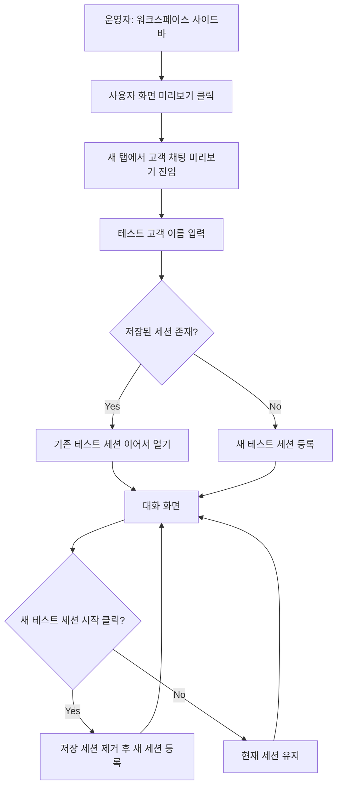

# 사용자 화면 미리보기 라벨과 진입 화면 정리

## Goal

운영자가 사이드바와 고객 채팅 화면에서 고객용 미리보기 목적을 명확히 이해하고, 같은 이름의 기존 테스트 세션 재사용과 새 테스트 세션 시작을 구분할 수 있게 한다.

## User Flow Chart



## Design Diff

| 영역 | As-is | To-be | 변경 내용 |
|------|-------|-------|----------|
| 사이드바 | `Chat` 라벨 | `사용자 화면 미리보기` 라벨 | 운영자 상담 화면과 고객 화면 preview를 구분한다. |
| 진입 화면 브랜딩 | `CSTONE · DEMO CHAT` | `CSTONE · 고객 채팅 미리보기` | 개발/시연 느낌보다 운영 중인 고객 화면 preview 맥락을 우선한다. |
| 진입 안내 | 이름 입력 후 채팅 시작 | 운영 도메인 팩 기준 미리보기 시작 | 현재 운영 도메인 팩 기준의 고객 응답 확인 목적을 설명한다. |
| 대화 화면 | 세션 재사용 여부가 명시되지 않음 | 세션 재사용 안내와 새 테스트 세션 시작 액션 | 같은 이름 재진입 시 기존 세션을 이어 쓰고, 사용자가 새 세션을 명시적으로 시작할 수 있다. |

## Component Tree

```text
Sidebar
└─ SidebarLink(chat)

UserChatPage
├─ ChatEntryScreen
└─ ChatConversationScreen
   ├─ ChatHeader
   ├─ chat-meta-strip
   ├─ chat-session-reuse-note
   ├─ MessageList
   └─ MessageInput
```

## API Integration

기존 데모 채팅 세션 API를 유지한다. 새 테스트 세션 시작은 클라이언트에 저장된 세션 키를 제거한 뒤 기존 세션 등록 API를 다시 호출한다.

| Method | Path | Description |
|--------|------|-------------|
| POST | `/api/v1/workspaces/{workspaceId}/demo/chat-sessions` | 테스트 고객 이름으로 데모 채팅 세션 생성 |
| GET | `/api/v1/workspaces/{workspaceId}/demo/chat-sessions/{sessionId}/messages` | 데모 채팅 메시지 동기화 |
| POST | `/api/v1/workspaces/{workspaceId}/demo/chat-sessions/{sessionId}/messages` | 데모 채팅 메시지 전송 |

## 수정 대상 파일

| 파일 | 변경 유형 | 설명 |
|------|----------|------|
| `frontend/src/shared/ui/ostone/chrome/Sidebar.tsx` | modify | 고객 화면 preview 목적이 드러나도록 chat 라벨 변경 |
| `frontend/src/pages/user-chat/ui/ChatEntryScreen.tsx` | modify | 진입 화면 브랜딩과 안내 문구를 고객 채팅 미리보기 중심으로 변경 |
| `frontend/src/pages/user-chat/ui/UserChatPage.tsx` | modify | 저장 세션 제거 후 새 데모 세션을 등록하는 재시작 흐름 추가 |
| `frontend/src/pages/user-chat/ui/ChatConversationScreen.tsx` | modify | 운영 도메인 팩 기준 메타, 세션 재사용 안내, 새 테스트 세션 시작 버튼 추가 |
| `frontend/src/shared/ui/ostone/chrome/Sidebar.test.tsx` | modify | 변경된 사이드바 라벨과 새 탭 링크 유지 검증 |
| `frontend/src/widgets/ostone-shell/ui/OstoneShell.test.tsx` | modify | shell에서 변경된 사이드바 라벨 검증 |
| `frontend/src/pages/user-chat/ui/ChatEntryScreen.test.tsx` | modify | 진입 화면 preview 문구 검증 |
| `frontend/src/pages/user-chat/ui/ChatConversationScreen.test.tsx` | modify | 대화 화면 메타와 새 세션 액션 검증 |
| `frontend/src/pages/user-chat/ui/UserChatPage.test.tsx` | modify | 기존 세션 재사용과 새 테스트 세션 생성 흐름 검증 |

## State Management

| 상태 | 위치 | 설명 |
|------|------|------|
| `draftName` | `UserChatPage` local state | 진입 화면 이름 입력값 |
| `customerName` | `UserChatPage` local state | 현재 테스트 고객 이름 |
| `chatState` | `UserChatPage` local state | 현재 workspace, customerName, session, error |
| `localStorage` | browser storage | `workspaceId + customerName` 기준 데모 세션 캐시 |

## Tests

### Test Strategy

| 구분 | 방법 | 도구 | 비고 |
|------|------|------|------|
| 컴포넌트/페이지 테스트 | 관련 테스트 파일 실행 | Vitest | 라벨, 문구, 세션 재사용/초기화 흐름 검증 |
| 정적 검사 | 변경 파일 대상 ESLint | ESLint | 변경 범위 lint 확인 |
| 빌드 | production build | Vite+ | 타입 및 번들 가능 여부 확인 |
| 수동 확인 | 로컬 dev server + 브라우저 | Codex in-app browser | 진입 화면 렌더링 확인 |

### Test Scenarios

| # | 시나리오 | 조작 | 기대 결과 |
|---|---------|------|----------|
| 1 | 사이드바에서 고객 화면 preview 진입 확인 | `사용자 화면 미리보기` 클릭 | `/demo/workspaces/{id}/chat`가 새 탭으로 열린다. |
| 2 | 진입 화면 문구 확인 | 고객 채팅 URL 진입 | `고객 채팅 미리보기`, `운영 중인 도메인 팩` 맥락이 표시된다. |
| 3 | 기존 세션 재사용 | 같은 이름으로 재진입 | 저장된 세션 메시지를 유지하고 세션 재사용 안내를 표시한다. |
| 4 | 새 테스트 세션 시작 | 대화 화면 버튼 클릭 | 저장 세션을 제거하고 새 백엔드 세션을 등록한다. |
| 5 | 운영 도메인 팩 없음 | 세션 생성 API 404 또는 `DOMAIN_PACK_CURRENT_VERSION_NOT_FOUND` | 운영 중인 도메인 팩 버전이 없다는 안내를 표시한다. |

## Verification

- `pnpm test -- ChatEntryScreen ChatConversationScreen UserChatPage Sidebar OstoneShell --run`
- 변경 파일 대상 `pnpm exec eslint ...`
- `pnpm build`
