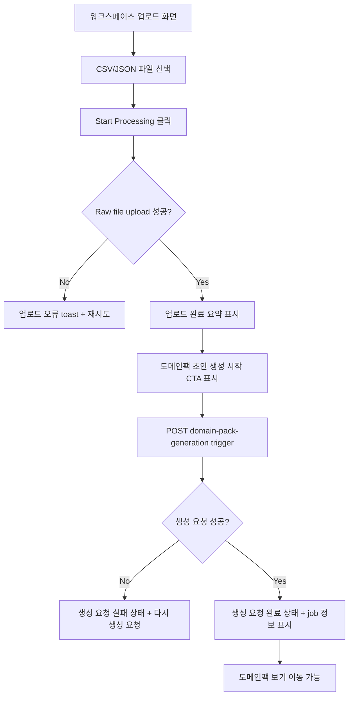

# Spec 320 — 상담 로그 업로드 후 도메인팩 생성 요청 흐름 연결

**Branch**: `fix/320-upload-generation-flow`  
**Canonical Number**: `320`  
**Type**: Frontend + Backend Config  
**작성일**: 2026-05-31

---

## Goal

상담 로그 파일 업로드 성공 후 사용자가 같은 화면에서 도메인팩 초안 생성 파이프라인을 명시적으로 시작할 수 있도록 연결한다.

---

## User Flow Chart



---

## Design Diff

| 영역 | As-is | To-be | 변경 내용 |
| --- | --- | --- | --- |
| 업로드 성공 후 행동 | `도메인팩 보기`로 이동 가능 | 생성 CTA를 먼저 표시 | 업로드와 생성 요청 단계를 분리 |
| 생성 요청 | 없음 | `domain-pack-generation` mutation 호출 | 업로드 응답의 `datasetId` 사용 |
| 생성 상태 | 없음 | 요청 중/성공/실패/재시도 | 사용자에게 파이프라인 요청 결과를 명확히 표시 |
| 로컬 검증 | `localhost` 오리진 위주 | `127.0.0.1` 개발 오리진 허용 | 인앱 브라우저와 로컬 Playwright 검증 지원 |

---

## Component Tree

```
WorkspaceUploadPage
└── LogUploadForm
    ├── FileUploader
    ├── Start Processing Button
    └── AfterUpload
        ├── UploadSummary
        └── GenerationPanel
            ├── 도메인팩 초안 생성 시작 Button
            ├── 생성 요청 중 상태
            ├── 생성 요청 실패 + 다시 생성 요청 Button
            └── 생성 요청 완료 + 도메인팩 보기 Button
```

---

## API Integration

| Method | Path | Description |
| --- | --- | --- |
| POST | `/api/v1/workspaces/{workspaceId}/datasets/raw-file` | 상담 로그 원본 파일 업로드 |
| POST | `/api/v1/workspaces/{workspaceId}/datasets/{datasetId}/pipeline-jobs/domain-pack-generation` | 업로드된 데이터셋 기반 도메인팩 초안 생성 요청 |

프론트엔드는 `frontend/src/shared/api/generated/`의 generated hook을 사용한다.

---

## 수정 대상 파일

| 파일 | 변경 유형 | 설명 |
| --- | --- | --- |
| `frontend/src/features/log-upload/ui/LogUploadForm.tsx` | modify | 업로드 성공 후 생성 CTA, 생성 요청 mutation, 상태/재시도 처리 |
| `frontend/src/features/log-upload/ui/log-upload-form.module.css` | modify | 업로드 요약 및 생성 상태 패널 스타일 |
| `frontend/src/features/log-upload/ui/LogUploadForm.test.tsx` | modify | CTA 표시, trigger 호출, 성공/실패/재시도 테스트 |
| `frontend/src/shared/lib/auth.ts` | modify | 인증 저장소 접근을 localStorage 불가 환경에서도 안전하게 처리 |
| `frontend/src/shared/api/index.ts` | modify | API Authorization header가 인증 유틸을 통해 토큰을 읽도록 변경 |
| `backend/src/main/resources/application.yml` | modify | 로컬 기본 CORS 허용 오리진에 `127.0.0.1` Vite 포트 추가 |
| `.env.example` | modify | 로컬 CORS 예시 값에 `127.0.0.1` Vite 포트 추가 |

---

## Validation

| 구분 | 명령/방법 | 기대 결과 |
| --- | --- | --- |
| 단위 테스트 | `cd frontend && pnpm test -- auth LoginForm LogUploadForm` | 관련 테스트 통과 |
| 린트 | `cd frontend && pnpm exec eslint src/shared/lib/auth.ts src/shared/api/index.ts src/features/log-upload/ui/LogUploadForm.tsx src/features/log-upload/ui/LogUploadForm.test.tsx` | 오류 없음 |
| 빌드 | `cd frontend && pnpm build` | production build 성공 |
| UI smoke | Playwright로 로그인 → 업로드 → 생성 요청 | login 200, raw-file upload 201, generation trigger 201, job RUNNING 확인 |

---

## Acceptance Criteria

- 업로드 성공 직후 사용자는 도메인팩 목록으로 이동하지 않고 `도메인팩 초안 생성 시작` CTA를 본다.
- CTA 클릭 시 업로드 응답의 `datasetId`로 domain-pack-generation trigger API가 호출된다.
- 생성 요청 성공 시 job id/status가 표시되고 `도메인팩 보기`가 활성화된다.
- 생성 요청 실패 시 오류 메시지와 재시도 액션이 표시된다.
- `http://127.0.0.1:5174`에서 실행한 로컬 UI 검증이 CORS로 막히지 않는다.
