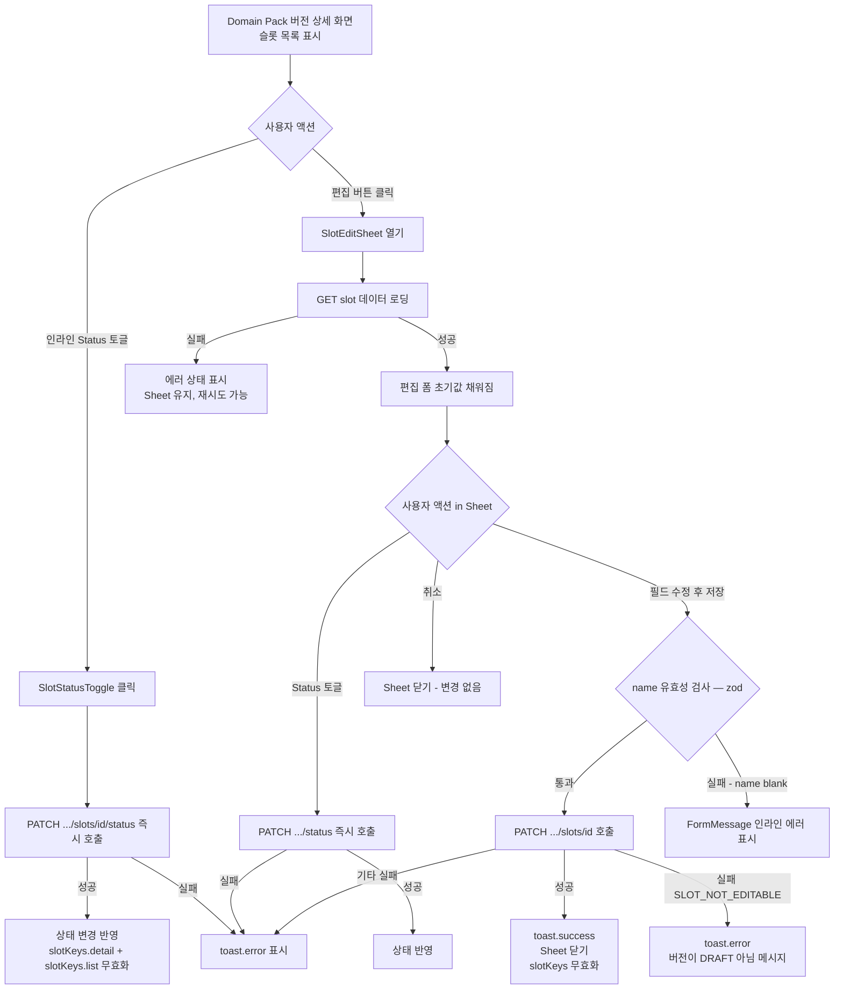

# Spec 321 — [Console] Slot / Slot Status 수정 기능 구현

**Branch**: `spec/321`
**Canonical Number**: `321`
**Type**: Frontend (FSD)
**작성일**: 2026-04-16
**최종 업데이트**: 2026-04-24 (UR-001·006·007 확정)

---

## Goal

운영자가 Domain Pack 버전 상세 화면 내 슬롯 목록에서, Side Sheet를 통해 슬롯 필드를 수정하고 슬롯 상태(ACTIVE/INACTIVE)를 변경할 수 있는 기능을 구현한다.

---

## User Flow Chart



---

## Design Diff

### As-is vs To-be

| 영역 | As-is | To-be | 변경 내용 |
|------|-------|-------|----------|
| 슬롯 수정 기능 | 없음 | SlotEditSheet (side sheet) | 신규 구현 |
| 슬롯 상태 변경 | 없음 | 인라인 SlotStatusToggle + Sheet 내 Toggle | 신규 구현 |
| 슬롯 타입 정의 | 없음 | `entities/slot` | 신규 구현 |
| 슬롯 API 연동 | 없음 | GET slot, PATCH slot, PATCH status | 신규 구현 |

---

## Prerequisites

### 패키지 설치 (구현 전 선행)

```bash
cd frontend && pnpm add @tanstack/react-query
```

### BE API (모두 구현 완료)

| Method | Path | 설명 | 응답 타입 |
|--------|------|------|-----------|
| GET | `.../slots` | 슬롯 목록 조회 | `SlotDefinitionSummary[]` (JSON 필드 미포함) |
| GET | `.../slots/{slotId}` | 슬롯 단건 조회 | `SlotDefinitionResponse` (전 필드 포함) |
| PATCH | `.../slots/{slotId}` | 슬롯 필드 수정 | `SlotDefinitionResponse` |
| PATCH | `.../slots/{slotId}/status` | 슬롯 상태 수정 | `SlotDefinitionResponse` |

공통 path prefix: `/api/v1/workspaces/{workspaceId}/domain-packs/{packId}/versions/{versionId}`

---

## Component Tree

```
[부모: DomainPackVersionDetailPage — 별도 스펙]
└── SlotListSection (별도 스펙 범위)
    ├── SlotListItem (× N)
    │   ├── SlotInfo (slotCode, name, dataType — read-only)
    │   ├── SlotStatusToggle ← [이 스펙 범위]
    │   └── EditButton → SlotEditSheet 트리거
    └── SlotEditSheet ← [이 스펙 범위]
         ├── SheetHeader (slotCode + name 표시)
         ├── [로딩 상태: Spinner]
         ├── [에러 상태: 에러 메시지]
         └── SlotEditForm
              ├── NameInput (required, @NotBlank)
              ├── DescriptionTextarea (optional)
              ├── IsSensitiveSwitch (Switch 컴포넌트)
              ├── DataTypeField (read-only — 수정 불가)
              ├── SlotCodeField (read-only — 수정 불가)
              ├── ValidationRuleJsonTextarea (raw JSON, optional)
              ├── DefaultValueJsonTextarea (raw JSON, optional)
              ├── MetaJsonTextarea (raw JSON, optional)
              ├── SlotStatusToggle (즉시 PATCH status)
              └── SheetFooter
                   ├── 저장 버튼 (PATCH fields)
                   └── 취소 버튼 (Sheet 닫기)
```

**이 스펙(321) 직접 구현 범위**: `SlotEditSheet`, `SlotEditForm`, `SlotStatusToggle`, 관련 hooks, `entities/slot`

**이 스펙 범위 외**: `SlotListSection`, `SlotListItem`, `DomainPackVersionDetailPage`, `EditButton` (부모 페이지 스펙에서 연결)

---

## API Integration

### Query Key Pattern

```typescript
// entities/slot/api/index.ts
export const slotKeys = {
  all: ['slots'] as const,
  lists: () => [...slotKeys.all, 'list'] as const,
  list: (workspaceId: number, packId: number, versionId: number) =>
    [...slotKeys.lists(), workspaceId, packId, versionId] as const,
  detail: (workspaceId: number, packId: number, versionId: number, slotId: number) =>
    [...slotKeys.all, 'detail', workspaceId, packId, versionId, slotId] as const,
};
```

### Request / Response 타입

```typescript
// entities/slot/model/types.ts

// GET /slots/{slotId} 및 PATCH 응답 (SlotDefinitionResponse)
export interface SlotDefinition {
  id: number;
  domainPackVersionId: number;
  slotCode: string;
  name: string;
  description: string | null;
  dataType: string;
  isSensitive: boolean;
  validationRuleJson: string;
  defaultValueJson: string | null;
  metaJson: string;
  status: 'ACTIVE' | 'INACTIVE';
  createdAt: string;
  updatedAt: string;
}

// GET /slots 목록 응답 (SlotDefinitionSummary — JSON 필드 없음)
export interface SlotSummary {
  id: number;
  domainPackVersionId: number;
  slotCode: string;
  name: string;
  description: string | null;
  dataType: string;
  isSensitive: boolean;
  status: 'ACTIVE' | 'INACTIVE';
  createdAt: string;
  updatedAt: string;
}

// PATCH fields request
export interface UpdateSlotRequest {
  name: string;
  description?: string | null;
  isSensitive?: boolean | null;
  validationRuleJson?: string | null;
  defaultValueJson?: string | null;
  metaJson?: string | null;
}

// PATCH status request
export interface UpdateSlotStatusRequest {
  status: 'ACTIVE' | 'INACTIVE';
}
```

---

## 수정 대상 파일

| 파일 | 변경 유형 | 설명 |
|------|----------|------|
| `src/entities/slot/model/types.ts` | new | SlotDefinition, SlotSummary, 요청 타입 |
| `src/entities/slot/api/index.ts` | new | API 함수 + slotKeys |
| `src/entities/slot/index.ts` | new | barrel export |
| `src/features/update-slot/model/schema.ts` | new | zod schema (name 필수 검사) |
| `src/features/update-slot/api/useGetSlot.ts` | new | GET slot useQuery hook |
| `src/features/update-slot/api/useUpdateSlot.ts` | new | PATCH fields useMutation hook |
| `src/features/update-slot/api/useUpdateSlotStatus.ts` | new | PATCH status useMutation hook |
| `src/features/update-slot/ui/SlotEditSheet.tsx` | new | Side sheet 진입점 |
| `src/features/update-slot/ui/SlotEditForm.tsx` | new | react-hook-form 기반 필드 편집 폼 |
| `src/features/update-slot/ui/SlotStatusToggle.tsx` | new | 인라인 + 폼 내 재사용 toggle |
| `src/features/update-slot/index.ts` | new | barrel export |

---

## Data Flow

```
[Parent: SlotListSection]
    │  props: { workspaceId, packId, versionId, slotId, currentStatus }
    ▼
SlotStatusToggle (inline)
    │  onClick → useUpdateSlotStatus.mutate({ status: toggled })
    │  onSuccess → invalidate slotKeys.detail(...) + slotKeys.list(...)
    ▼
[Parent triggers SlotEditSheet open]
    │  props: { workspaceId, packId, versionId, slotId, isOpen, onClose }
    ▼
SlotEditSheet
    │  useGetSlot(workspaceId, packId, versionId, slotId, enabled: isOpen)
    ├── [loading] → Spinner
    ├── [error]   → 에러 상태 표시 (Sheet 유지, 재시도 가능)
    └── [success] → SlotEditForm (defaultValues = slot data)
                        │  react-hook-form + zod resolver
                        │  SlotStatusToggle (embedded)
                        │     → useUpdateSlotStatus.mutate(...)
                        │  저장 버튼
                        │     → useUpdateSlot.mutate(formValues)
                        │     → onSuccess: toast.success + onClose + invalidate
                        │     → onError SLOT_NOT_EDITABLE: toast.error(...)
                        └─── 취소 → onClose
```

---

## State Management

### Server State (TanStack Query)

```typescript
// features/update-slot/api/useGetSlot.ts
export function useGetSlot(
  workspaceId: number,
  packId: number,
  versionId: number,
  slotId: number,
  enabled: boolean,
) {
  return useQuery({
    queryKey: slotKeys.detail(workspaceId, packId, versionId, slotId),
    queryFn: () => fetchSlot(workspaceId, packId, versionId, slotId),
    enabled,
  });
}
```

```typescript
// features/update-slot/api/useUpdateSlot.ts
export function useUpdateSlot() {
  const queryClient = useQueryClient();
  return useMutation({
    mutationFn: ({ workspaceId, packId, versionId, slotId, body }: UpdateSlotParams) =>
      patchSlot(workspaceId, packId, versionId, slotId, body),
    onSuccess: (_, { workspaceId, packId, versionId, slotId }) => {
      queryClient.invalidateQueries({ queryKey: slotKeys.detail(workspaceId, packId, versionId, slotId) });
      queryClient.invalidateQueries({ queryKey: slotKeys.list(workspaceId, packId, versionId) });
      toast.success('슬롯이 수정되었습니다.');
    },
    onError: (error: ApiRequestError) => {
      if (error.code === 'SLOT_NOT_EDITABLE') {
        toast.error('DRAFT 상태의 버전에서만 수정할 수 있습니다.');
      } else {
        toast.error('슬롯 수정에 실패했습니다.');
      }
    },
  });
}
```

```typescript
// features/update-slot/api/useUpdateSlotStatus.ts
export function useUpdateSlotStatus() {
  const queryClient = useQueryClient();
  return useMutation({
    mutationFn: ({ workspaceId, packId, versionId, slotId, status }: UpdateSlotStatusParams) =>
      patchSlotStatus(workspaceId, packId, versionId, slotId, { status }),
    onSuccess: (_, { workspaceId, packId, versionId, slotId }) => {
      queryClient.invalidateQueries({ queryKey: slotKeys.detail(workspaceId, packId, versionId, slotId) });
      queryClient.invalidateQueries({ queryKey: slotKeys.list(workspaceId, packId, versionId) });
    },
    onError: () => {
      toast.error('상태 변경에 실패했습니다.');
    },
  });
}
```

### Client State (react-hook-form + zod)

```typescript
// features/update-slot/model/schema.ts
import { z } from 'zod';

export const slotEditSchema = z.object({
  name: z.string().min(1, '슬롯 이름은 필수입니다.'),
  description: z.string().nullable().optional(),
  isSensitive: z.boolean().optional(),
  validationRuleJson: z.string().nullable().optional(),
  defaultValueJson: z.string().nullable().optional(),
  metaJson: z.string().nullable().optional(),
});

export type SlotEditFormValues = z.infer<typeof slotEditSchema>;
```

```typescript
// SlotEditForm.tsx 내 — react-hook-form 연결
const form = useForm<SlotEditFormValues>({
  resolver: zodResolver(slotEditSchema),
  defaultValues: {
    name: slot.name,
    description: slot.description,
    isSensitive: slot.isSensitive,
    validationRuleJson: slot.validationRuleJson,
    defaultValueJson: slot.defaultValueJson,
    metaJson: slot.metaJson,
  },
});
```

- Sheet open/close: 부모 컴포넌트에서 관리, `isOpen` props로 전달

---

## Design Constraints

`frontend/DESIGN.md` 준수:
- 색상: 모노크롬만 사용 (`#000000` / `#ffffff`)
- 폰트: figmaSans (기존 설정 상속)
- 버튼: `shared/ui/button.tsx` 사용 (pill geometry)
- Focus outline: `dashed 2px`
- Sheet radius: 8px (Card/Dialog 기준)
- `alert()` 사용 금지 → `import { toast } from "sonner"` (패키지 직접 import)

### 공유 컴포넌트 활용

| 역할 | `shared/ui` 파일 |
|------|-----------------|
| Side Sheet | `sheet.tsx` |
| 텍스트 입력 | `input.tsx` |
| 여러 줄 입력 | `textarea.tsx` |
| Boolean Toggle (isSensitive, status) | `switch.tsx` |
| 저장/취소 버튼 | `button.tsx` |
| 로딩 표시 | `spinner.tsx` |
| 폼 레이블/에러 | `form.tsx` (FormField, FormItem, FormLabel, FormControl, FormMessage) |
| Toast 알림 | `import { toast } from "sonner"` |

---

## Tests

### Test Strategy

| 구분 | 방법 | 도구 | 비고 |
|------|------|------|------|
| 수동 테스트 | 브라우저 직접 확인 | Chrome DevTools | 전체 플로우 |
| 통합 테스트 | Vitest + fetch mock | `pnpm test` | 핵심 시나리오 |

### Test Environment & 사전 조건

| 항목 | 값 |
|------|---|
| 환경 | `pnpm dev` (백엔드 포함) |
| 사전 조건 | DRAFT 상태 Domain Pack Version + 슬롯 1개 이상 |
| 역할 | OPERATOR 또는 ADMIN 로그인 상태 |

### Test Scenarios

#### Happy Path

| # | 시나리오 | 사전 조건 | 조작 | 기대 결과 |
|---|---------|---------|------|----------|
| 1 | 슬롯 필드 수정 | DRAFT version, 슬롯 존재 | Sheet 열기 → name 수정 → 저장 | 성공 toast, Sheet 닫힘, 데이터 반영 |
| 2 | 인라인 Status 토글 (ACTIVE→INACTIVE) | DRAFT version, ACTIVE 슬롯 | 목록 내 toggle 클릭 | 즉시 INACTIVE로 변경 |
| 3 | Sheet 내 Status 토글 | DRAFT version, ACTIVE 슬롯 | Sheet 열기 → status toggle | 즉시 INACTIVE로 변경 |
| 4 | 취소 시 변경 없음 | — | Sheet 열기 → 필드 수정 → 취소 | 원본 데이터 그대로 유지 |

#### Error & Edge Cases

| # | 시나리오 | 조작 | 기대 결과 |
|---|---------|------|----------|
| 1 | name 빈 문자열로 저장 | name 지우고 저장 버튼 클릭 | FormMessage 인라인 에러 표시, API 호출 안 됨 |
| 2 | DRAFT 아닌 버전 수정 시도 | 저장 버튼 클릭 | `SLOT_NOT_EDITABLE` → toast.error |
| 3 | 네트워크 오류 | 저장 중 실패 | toast.error 표시 |
| 4 | GET 슬롯 실패 | Sheet 열기 시 API 에러 | 에러 상태 표시 (Sheet 유지, 재시도 가능) |
| 5 | dataType / slotCode 필드 | Sheet 내 해당 필드 | read-only, 수정 불가 |

#### 접근성

| # | 확인 항목 | 기대 결과 |
|---|---------|----------|
| 1 | 키보드 탐색 | Tab → 각 필드 순서대로 이동 |
| 2 | Focus outline | dashed 2px 아웃라인 표시 |
| 3 | Status toggle aria | `aria-label` "슬롯 상태" 포함 |

---

## Done Criteria

- [ ] `pnpm add @tanstack/react-query` 설치 완료
- [ ] `SlotStatusToggle` 컴포넌트: ACTIVE/INACTIVE 즉시 전환, loading 상태 표시
- [ ] `SlotEditSheet`: Sheet open 시 GET slot 데이터 로딩, loading/error/populated 3종 상태 처리; 에러 시 Sheet 유지하고 재시도 가능 (Sheet 닫기 금지)
- [ ] `SlotEditForm`: react-hook-form + zod, name 필수 유효성(FormMessage), 나머지 optional, PATCH 성공 시 toast + Sheet 닫기
- [ ] `dataType`, `slotCode` 필드: read-only 표시
- [ ] JSON 필드 (`validationRuleJson`, `defaultValueJson`, `metaJson`): `JsonTextarea` wrapper 컴포넌트로 구현 (raw textarea, 추후 교체 가능 구조)
- [ ] SLOT_NOT_EDITABLE 에러 코드: 사용자 친화적 메시지로 toast.error
- [ ] DESIGN.md 준수: 모노크롬, dashed focus, shared/ui 컴포넌트 사용
- [ ] FSD 의존성 방향 준수: `features/update-slot` → `entities/slot` → `shared`
- [ ] status/fields PATCH 성공 시 `slotKeys.detail` + `slotKeys.list` 두 캐시 모두 `invalidateQueries` 무효화
- [ ] `alert()` 미사용, `import { toast } from "sonner"` 사용

---

## Out of Scope (이 스펙 제외)

- SlotListSection / SlotListItem 구현 (부모 페이지 스펙)
- DomainPackVersionDetailPage 구현
- JSON 필드 전용 편집기 UI (추후 확장)
- 슬롯 생성 / 삭제 기능
