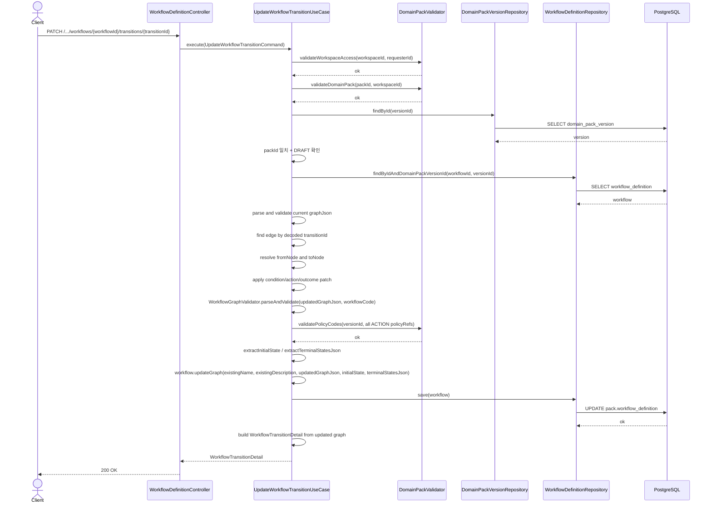

# [BE] 3.2.10 — Transition Condition / Action / Outcome 수정 API

> Branch: `spec/3210`  
> Template: `.agent/specs/_TEMPLATE_BE.md`  
> Bounded Context: `domainpack`

---

## Goal

DRAFT 상태의 Domain Pack Version에서 Workflow transition 단위로 condition, action, outcome 의미 필드만 부분 수정하는 PATCH API를 제공한다.

기존 Workflow 전체 수정 API는 `graphJson` 전체 교체 방식이다. 이 스펙은 운영자가 topology를 바꾸지 않고 transition의 의미 값만 안정적으로 수정할 수 있는 좁은 API를 정의한다.

---

## Verified Existing Implementation

아래 경로는 현재 코드베이스에서 존재를 확인했다.

| 영역 | 현재 상태 | 확인 경로 |
|------|-----------|-----------|
| Workflow 전체 수정 | `PATCH .../workflows/{workflowId}` 구현 완료. `name`, `description`, `graphJson` 전체 교체 | `backend/src/main/java/com/init/domainpack/presentation/WorkflowDefinitionController.java` |
| 전체 수정 UseCase | DRAFT-only, graphJson 크기 제한, V1-V8 검증, policyRef cross-entity 검증 구현 | `backend/src/main/java/com/init/domainpack/application/UpdateWorkflowUseCase.java` |
| Transition 목록 조회 | `GET .../workflows/{workflowId}/transitions` 구현 완료 | `backend/src/main/java/com/init/domainpack/application/GetWorkflowTransitionListUseCase.java` |
| Transition 단건 조회 | `GET .../workflows/{workflowId}/transitions/{transitionId}` 구현 완료 | `backend/src/main/java/com/init/domainpack/application/GetWorkflowTransitionUseCase.java` |
| Transition 응답 | `id`, `workflowDefinitionId`, `domainPackVersionId`, `from`, `to`, `label`, `toPolicyRef` 반환 | `backend/src/main/java/com/init/domainpack/application/WorkflowTransitionDetail.java` |
| graph 검증 | START/TERMINAL/dangling/reachability/cycle/decision label/edge id/ACTION policyRef 검증 | `backend/src/main/java/com/init/domainpack/application/WorkflowGraphValidator.java` |
| Workflow 저장 모델 | `workflow_definition.graph_json` JSONB가 source of truth | `backend/src/main/java/com/init/domainpack/domain/model/WorkflowDefinition.java` |

---

## Development Scope

이번 개발에서 해야 할 것:

- transition 단위 PATCH endpoint 추가
- `condition`, `action`, `outcome` 부분 수정 request DTO 추가
- graphJson을 파싱하여 특정 edge와 from/to node를 찾고 의미 필드만 수정하는 UseCase 추가
- 수정 후 전체 graphJson에 기존 WorkflowGraphValidator 규칙을 다시 적용
- ACTION `policyRef` 변경 시 같은 version의 policyCode 존재 여부 검증
- `WorkflowTransitionDetail` 응답 shape 확장
- 기존 transition 목록/단건 조회도 확장된 응답 shape를 반환하도록 보강
- controller/usecase/domain utility 테스트 추가

이번 개발에서 하지 않을 것:

- node/edge 추가, 삭제
- `edge.id`, `edge.from`, `edge.to` 수정
- node type 변경
- Workflow `name`, `description` 수정
- `workflow_definition` 테이블 변경
- runtime workflow execution 엔진 구현
- PUBLISHED version 직접 수정

---

## Domain Definition

Transition은 `workflow_definition.graph_json.edges[]`의 edge 하나다. `transitionId`는 edge의 `id` 값이다.

이번 API의 의미 필드는 graphJson에서 아래 위치를 수정한다.

| 의미 필드 | 수정 대상 | 허용 조건 |
|-----------|-----------|-----------|
| Condition | edge의 `label` | `from` node type이 `DECISION`일 때만 |
| Action | `to` ACTION node의 `policyRef` | `to` node type이 `ACTION`일 때만 |
| Outcome | `to` TERMINAL node의 `state`, `label` | `to` node type이 `TERMINAL`일 때만 |

`Outcome`은 별도 edge 필드가 아니다. 목적지 TERMINAL node의 `state`와 `label`을 transition의 결과 의미로 해석한다.

현재 backend 기준 `TERMINAL node.state`는 runtime 제어에 강하게 연결되어 있지 않다. `terminalStatesJson`은 TERMINAL node의 `id` 배열로 추출된다. 따라서 이번 scope에서 `outcome.state` 변경은 graph topology나 `terminalStatesJson`을 변경하지 않는다.

다만 future runtime에서 상태명으로 사용될 수 있으므로 `outcome.state`는 machine-readable code로 검증한다.

---

## REST API

### Endpoint

| Method | Path | Description |
|--------|------|-------------|
| PATCH | `/api/v1/workspaces/{workspaceId}/domain-packs/{packId}/versions/{versionId}/workflows/{workflowId}/transitions/{transitionId}` | Transition 의미 필드 부분 수정 |

### Request

Path variables:

| 이름 | 타입 | 설명 |
|------|------|------|
| `workspaceId` | Long | Workspace id |
| `packId` | Long | Domain Pack id |
| `versionId` | Long | Domain Pack Version id |
| `workflowId` | Long | WorkflowDefinition id |
| `transitionId` | String | graphJson edge id. URL path에서는 URL-encoded 값으로 전달하고, 서버는 decode된 문자열을 `edge.id`와 exact match한다. |

Headers:

- `Authorization: Bearer {jwt-token}` 필수

Body는 `condition`, `action`, `outcome` 중 최소 1개를 포함한다. 없는 섹션은 기존 값을 유지한다. 명시적으로 `null`을 보낸 섹션이나 필드는 "삭제" 의미로 해석하지 않고 400으로 실패한다.

```json
{
  "condition": {
    "label": "가능"
  },
  "action": {
    "policyRef": "return_deadline_check"
  },
  "outcome": {
    "state": "refund_requested",
    "label": "환불 접수 완료"
  }
}
```

#### Request Validation

공통:

- body는 null일 수 없다.
- `condition`, `action`, `outcome` 중 최소 1개가 있어야 한다.
- request에 포함된 섹션이 현재 transition 구조에 맞지 않으면 400으로 실패한다.
- 명시적으로 전달한 값이 `null`이거나 blank이면 400으로 실패한다.
- PATCH semantics에서 필드 presence가 중요하므로, Controller/request mapper는 `JsonNode` 또는 `ObjectNode` 기반 presence validation을 먼저 수행한 뒤 command DTO로 변환한다.
- record DTO만으로는 `action` 생략과 `"action": null`, `outcome.state` 생략과 `"state": null`을 구분할 수 없으므로 이 구분을 Bean Validation에만 맡기지 않는다.
- 문자열 값은 trim 후 검증하고, 저장도 trim된 값을 사용한다.

`condition`:

| 필드 | 타입 | 필수 | 규칙 |
|------|------|------|------|
| `label` | String | condition 섹션 포함 시 필수 | non-blank, max 255 |

- `from` node type이 `DECISION`인 transition에서만 수정 가능하다.
- non-DECISION edge에 `condition`을 보내면 `400 WORKFLOW_TRANSITION_CONDITION_NOT_EDITABLE`.

`action`:

| 필드 | 타입 | 필수 | 규칙 |
|------|------|------|------|
| `policyRef` | String | action 섹션 포함 시 필수 | non-blank, max 100, `[A-Za-z0-9_-]+` |

- `to` node type이 `ACTION`인 transition에서만 수정 가능하다.
- ACTION이 아닌 목적지에 `action`을 보내면 `400 WORKFLOW_TRANSITION_ACTION_NOT_EDITABLE`.
- `policyRef`는 같은 `domainPackVersionId`의 `policy_definition.policy_code` 중 하나와 일치해야 한다.
- policyCode가 없으면 기존 V8c와 동일하게 `400 WORKFLOW_ACTION_NODE_POLICY_REF_NOT_FOUND`.
- 수정 후 graphJson에 존재하는 전체 ACTION node의 `policyRef`를 수집해 version 내부 policyCode 존재 여부를 검증한다. 이는 기존 전체 Workflow 수정 API의 invariant와 맞추기 위함이다.

`outcome`:

| 필드 | 타입 | 필수 | 규칙 |
|------|------|------|------|
| `state` | String | 선택 | 보낸 경우 non-blank, max 100, `[A-Za-z0-9_-]+` |
| `label` | String | 선택 | 보낸 경우 non-blank, max 255 |

- `outcome` 객체 안에는 `state`, `label` 중 최소 1개가 있어야 한다.
- `to` node type이 `TERMINAL`인 transition에서만 수정 가능하다.
- TERMINAL이 아닌 목적지에 `outcome`을 보내면 `400 WORKFLOW_TRANSITION_OUTCOME_NOT_EDITABLE`.
- `outcome.state`는 machine-readable code다. 한글/공백은 허용하지 않는다.
- 사람이 읽는 표시명은 `outcome.label`에 둔다.

### Response

성공 시 수정된 transition 단건만 반환한다. 전체 WorkflowDefinitionDetail 또는 graphJson 전체를 반환하지 않는다.

기존 호환성을 위해 `label`, `toPolicyRef` 필드는 유지하고, 신규 구조화 필드를 추가한다.

**200 OK**

```json
{
  "id": "e3",
  "workflowDefinitionId": 1,
  "domainPackVersionId": 101,
  "from": "n2",
  "to": "n3",
  "fromType": "DECISION",
  "toType": "ACTION",
  "label": "가능",
  "toPolicyRef": "return_deadline_check",
  "condition": {
    "editable": true,
    "label": "가능"
  },
  "action": {
    "editable": true,
    "policyRef": "return_deadline_check"
  },
  "outcome": {
    "editable": false,
    "state": null,
    "label": null
  }
}
```

`DECISION -> TERMINAL` 예시:

```json
{
  "id": "e4",
  "workflowDefinitionId": 1,
  "domainPackVersionId": 101,
  "from": "n2",
  "to": "end_rejected",
  "fromType": "DECISION",
  "toType": "TERMINAL",
  "label": "불가능",
  "toPolicyRef": null,
  "condition": {
    "editable": true,
    "label": "불가능"
  },
  "action": {
    "editable": false,
    "policyRef": null
  },
  "outcome": {
    "editable": true,
    "state": "rejected",
    "label": "환불 불가"
  }
}
```

### Error Responses

**400 Bad Request**

| code | 원인 |
|------|------|
| `VALIDATION_ERROR` | Bean Validation 실패, malformed JSON, empty body, 명시적 null 등 기본 request 형식 오류 |
| `WORKFLOW_NOT_EDITABLE` | DRAFT가 아닌 version 수정 시도 |
| `WORKFLOW_TRANSITION_PATCH_EMPTY` | `condition`, `action`, `outcome` 중 아무것도 없음 |
| `WORKFLOW_TRANSITION_CONDITION_NOT_EDITABLE` | `from`이 DECISION이 아닌데 condition 수정 요청 |
| `WORKFLOW_TRANSITION_ACTION_NOT_EDITABLE` | `to`가 ACTION이 아닌데 action 수정 요청 |
| `WORKFLOW_TRANSITION_OUTCOME_NOT_EDITABLE` | `to`가 TERMINAL이 아닌데 outcome 수정 요청 |
| `WORKFLOW_TRANSITION_OUTCOME_EMPTY` | outcome 섹션 안에 `state`, `label`이 모두 없음 |
| `WORKFLOW_TRANSITION_OUTCOME_STATE_INVALID_CHARS` | `outcome.state`가 `[A-Za-z0-9_-]+` 패턴 위반 |
| `WORKFLOW_ACTION_NODE_POLICY_REF_INVALID_CHARS` | `action.policyRef` 패턴 위반 |
| `WORKFLOW_ACTION_NODE_POLICY_REF_NOT_FOUND` | `action.policyRef`가 같은 version의 policyCode에 없음 |
| `WORKFLOW_EDGE_ID_MISSING` 등 | 수정 후 graphJson 전체 검증 실패 |

**404 Not Found**

| code | 원인 |
|------|------|
| `DOMAIN_PACK_NOT_FOUND` | pack 미존재 |
| `DOMAIN_PACK_VERSION_NOT_FOUND` 또는 기존 `NOT_FOUND` | version 미존재 |
| `WORKFLOW_DEFINITION_NOT_FOUND` 또는 기존 `NOT_FOUND` | workflow 미존재 |
| `WORKFLOW_TRANSITION_NOT_FOUND` | transitionId와 일치하는 edge 미존재 |

전용 Not Found code를 새로 만들 수 있으면 위 전용 code를 우선한다. 단, 기존 `GlobalExceptionHandler`와 `UpdateWorkflowUseCase`의 `NOT_FOUND` 패턴을 재사용하는 경우에도 클라이언트가 HTTP status와 message로 구분할 수 있어야 한다.

**403 Forbidden**

| code | 원인 |
|------|------|
| `FORBIDDEN` | workspace 접근 권한 없음 |

**401 Unauthorized**

Spring Security 기본 인증 실패 응답을 따른다.

---

## Sequence Diagram



---

## Class Design

### New Files

| 파일 | 경로 | 역할 |
|------|------|------|
| `UpdateWorkflowTransitionCommand.java` | `backend/src/main/java/com/init/domainpack/application/` | UseCase 입력 record |
| `UpdateWorkflowTransitionUseCase.java` | `backend/src/main/java/com/init/domainpack/application/` | transition 의미 필드 부분 수정 |
| `UpdateWorkflowTransitionRequest.java` | `backend/src/main/java/com/init/domainpack/presentation/dto/` | PATCH request DTO |
| `WorkflowGraphDocument.java` 또는 동등한 helper | `backend/src/main/java/com/init/domainpack/application/` | graphJson edge/node 탐색, detail 생성, mutation 보조 package-private utility. 최종 이름은 구현 시 기존 패턴에 맞춰 조정 가능 |
| `WorkflowTransitionPatchEmptyException.java` | `backend/src/main/java/com/init/domainpack/application/exception/` | 빈 PATCH body |
| `WorkflowTransitionConditionNotEditableException.java` | `backend/src/main/java/com/init/domainpack/application/exception/` | condition 수정 불가 |
| `WorkflowTransitionActionNotEditableException.java` | `backend/src/main/java/com/init/domainpack/application/exception/` | action 수정 불가 |
| `WorkflowTransitionOutcomeNotEditableException.java` | `backend/src/main/java/com/init/domainpack/application/exception/` | outcome 수정 불가 |
| `WorkflowTransitionOutcomeEmptyException.java` | `backend/src/main/java/com/init/domainpack/application/exception/` | outcome 내부 빈 요청 |
| `WorkflowTransitionOutcomeStateInvalidCharsException.java` | `backend/src/main/java/com/init/domainpack/application/exception/` | outcome.state 패턴 위반 |

### Modified Files

| 파일 | 변경 내용 |
|------|-----------|
| `WorkflowDefinitionController.java` | `@PatchMapping("/{workflowId}/transitions/{transitionId}")` 추가 |
| `WorkflowTransitionDetail.java` | `fromType`, `toType`, `condition`, `action`, `outcome` 필드 추가. mutation 로직은 추가하지 않는다 |
| `WorkflowDefinition.java` | 기존 `updateGraph(...)` 재사용. 신규 public setter 추가 금지 |
| `WorkflowDefinitionControllerTest.java` | PATCH transition controller 테스트 추가 |
| `GetWorkflowTransitionUseCaseTest.java` | 확장 응답 shape 검증 추가 |
| `GetWorkflowTransitionListUseCaseTest.java` | 확장 응답 shape 검증 추가 |

### DTO Sketch

```java
public record UpdateWorkflowTransitionRequest(
    @Valid ConditionPatch condition,
    @Valid ActionPatch action,
    @Valid OutcomePatch outcome
) {
  public record ConditionPatch(@NotBlank @Size(max = 255) String label) {}

  public record ActionPatch(
      @NotBlank
      @Size(max = 100)
      @Pattern(regexp = "[A-Za-z0-9_-]+")
      String policyRef
  ) {}

  public record OutcomePatch(
      @Size(max = 100)
      @Pattern(regexp = "[A-Za-z0-9_-]+")
      String state,
      @Size(max = 255)
      String label
  ) {}
}
```

주의:

- `@Valid`를 parent record field에 붙여 nested record의 `@NotBlank`, `@Pattern`, `@Size`가 동작하게 한다.
- presence validation은 이 DTO보다 먼저 수행한다. `JsonNode`/`ObjectNode`에서 section/field가 명시적으로 존재하는지 확인한 뒤, 명시적 `null`은 400으로 실패시키고 command로 변환한다.
- `OutcomePatch`는 Bean Validation만으로 `state`, `label` 중 최소 1개 non-blank를 표현하기 어렵다. UseCase 또는 request validation helper에서 별도 검증한다.
- `label`류 필드는 `@Size`만으로 blank를 막지 못한다. 포함된 필드는 UseCase에서 trim 후 blank 검증한다.

### Command Sketch

```java
public record UpdateWorkflowTransitionCommand(
    Long workspaceId,
    Long packId,
    Long versionId,
    Long workflowId,
    String transitionId,
    Long requesterId,
    ConditionPatch condition,
    ActionPatch action,
    OutcomePatch outcome
) {
  public record ConditionPatch(String label) {}
  public record ActionPatch(String policyRef) {}
  public record OutcomePatch(String state, String label) {}
}
```

### Response Shape

```java
public record WorkflowTransitionDetail(
    String id,
    Long workflowDefinitionId,
    Long domainPackVersionId,
    String from,
    String to,
    String fromType,
    String toType,
    String label,
    String toPolicyRef,
    TransitionConditionDetail condition,
    TransitionActionDetail action,
    TransitionOutcomeDetail outcome
) {
  public record TransitionConditionDetail(boolean editable, String label) {}
  public record TransitionActionDetail(boolean editable, String policyRef) {}
  public record TransitionOutcomeDetail(boolean editable, String state, String label) {}
}
```

Backward compatibility:

- 기존 `label`은 유지한다. 값은 `condition.label`과 동일하며, DECISION 발신 edge가 아니면 `null`.
- 기존 `toPolicyRef`는 유지한다. 값은 `action.policyRef`와 동일하며, ACTION 목적지가 아니면 `null`.

---

## Graph Mutation Rules

UseCase는 graphJson을 Jackson tree로 파싱해 ObjectNode를 수정한다. string replace 금지.

`WorkflowTransitionDetail`은 응답 record 역할을 유지한다. edge/node 탐색, detail 생성, mutation 보조 로직은 package-private graph helper에 분리해 조회와 수정 UseCase가 함께 사용한다.

1. 현재 DB의 graphJson을 먼저 `WorkflowGraphValidator.parseAndValidate(...)`로 검증한다.
2. `edges[]`에서 decoded `transitionId`와 `id`가 exact match인 edge를 찾는다.
3. edge의 `from`, `to`로 `nodes[]`에서 fromNode/toNode를 찾는다.
4. request에 `condition`이 있으면 fromNode type이 `DECISION`인지 확인하고 edge `label`을 수정한다.
5. request에 `action`이 있으면 toNode type이 `ACTION`인지 확인하고 toNode `policyRef`를 수정한다.
6. request에 `outcome`이 있으면 toNode type이 `TERMINAL`인지 확인하고 toNode `state`/`label`을 보낸 필드만 수정한다.
7. 수정된 graphJson 전체를 문자열로 직렬화한다.
8. `WorkflowGraphValidator.parseAndValidate(...)`를 재실행한다.
9. 수정 후 graphJson 전체의 ACTION node `policyRef`를 수집해 `DomainPackValidator.validatePolicyCodes(...)`로 version 내부 policyCode 존재 여부를 검증한다.
10. `WorkflowGraphValidator.extractInitialState(...)`, `extractTerminalStatesJson(...)`로 derived column을 갱신한다.
11. `workflow.updateGraph(existingName, existingDescription, updatedGraphJson, initialState, terminalStatesJson)`를 호출한다.

수정하지 않는 필드는 보존한다.

- edge `id`, `from`, `to`
- node `id`, `type`
- node/edge의 기타 unknown fields
- workflow `name`, `description`, `workflowCode`, `evidenceJson`, `metaJson`

---

## Database

스키마 변경 없음.

수정 대상:

- `pack.workflow_definition.graph_json`
- `pack.workflow_definition.initial_state`
- `pack.workflow_definition.terminal_states_json`
- `pack.workflow_definition.updated_at`

`initial_state`와 `terminal_states_json`은 topology를 바꾸지 않는 한 결과가 기존과 동일해야 하지만, 전체 graph 검증 결과를 기준으로 재계산해 저장한다. 이는 기존 전체 workflow 수정 API와 같은 방식이다.

---

## Tests

### Application Tests

`UpdateWorkflowTransitionUseCaseTest`

- [ ] DRAFT version + `DECISION -> ACTION` transition에서 `condition.label`, `action.policyRef` 수정 성공
- [ ] DRAFT version + `DECISION -> TERMINAL` transition에서 `condition.label`, `outcome.state`, `outcome.label` 수정 성공
- [ ] `outcome.state`만 보내면 state만 수정되고 label은 유지
- [ ] `outcome.label`만 보내면 label만 수정되고 state는 유지
- [ ] `condition`, `action`, `outcome` 모두 없으면 `WORKFLOW_TRANSITION_PATCH_EMPTY`
- [ ] non-DECISION edge에 condition 요청 시 `WORKFLOW_TRANSITION_CONDITION_NOT_EDITABLE`
- [ ] non-ACTION 목적지에 action 요청 시 `WORKFLOW_TRANSITION_ACTION_NOT_EDITABLE`
- [ ] non-TERMINAL 목적지에 outcome 요청 시 `WORKFLOW_TRANSITION_OUTCOME_NOT_EDITABLE`
- [ ] outcome 내부가 비어 있으면 `WORKFLOW_TRANSITION_OUTCOME_EMPTY`
- [ ] `outcome.state` 패턴 위반 시 `WORKFLOW_TRANSITION_OUTCOME_STATE_INVALID_CHARS`
- [ ] `action.policyRef` 패턴 위반 시 `WORKFLOW_ACTION_NODE_POLICY_REF_INVALID_CHARS`
- [ ] `action.policyRef`가 version 내부 policyCode에 없으면 `WORKFLOW_ACTION_NODE_POLICY_REF_NOT_FOUND`
- [ ] action section이 포함되지 않은 PATCH도 수정 후 전체 ACTION node의 policyRef 존재 검증을 수행한다
- [ ] PUBLISHED version이면 `WORKFLOW_NOT_EDITABLE`
- [ ] transitionId 미존재이면 `WORKFLOW_TRANSITION_NOT_FOUND`
- [ ] workflowId 미존재이면 `WORKFLOW_DEFINITION_NOT_FOUND`
- [ ] 수정 후 graphJson 검증 실패 시 기존 graph validator 예외 전파

### Controller Tests

`WorkflowDefinitionControllerTest`

- [ ] `PATCH .../transitions/{transitionId}` 정상 요청 시 200과 확장된 `WorkflowTransitionDetail` 반환
- [ ] 인증 없으면 401
- [ ] 권한 없으면 403
- [ ] request body validation 실패 시 400 `VALIDATION_ERROR`
- [ ] empty body이면 400 `VALIDATION_ERROR`
- [ ] malformed JSON이면 400 `VALIDATION_ERROR`
- [ ] `"action": null`처럼 명시적 null section이면 400 `VALIDATION_ERROR`
- [ ] `"outcome": {"state": null, "label": "완료"}`처럼 명시적 null field이면 400 `VALIDATION_ERROR`
- [ ] UseCase가 `WORKFLOW_TRANSITION_NOT_FOUND`를 던지면 404
- [ ] UseCase가 `WORKFLOW_NOT_EDITABLE`을 던지면 400
- [ ] request의 `condition/action/outcome` 중 일부만 보내도 누락 section은 command에 null 유지 전달
- [ ] nested DTO validation이 동작해 `action.policyRef` 패턴 위반이 400으로 반환된다

### Existing Read Tests

기존 transition 조회 테스트도 확장 응답 shape를 검증하도록 보강한다.

- [ ] 단건 조회가 `fromType`, `toType`, `condition`, `action`, `outcome`을 반환
- [ ] 목록 조회가 같은 shape를 반환
- [ ] 기존 `label`, `toPolicyRef` 필드는 계속 반환

---

## Acceptance Criteria

- [ ] DRAFT version에서 transition 의미 필드 부분 수정이 가능하다.
- [ ] PUBLISHED 또는 그 외 lifecycle version은 수정할 수 없다.
- [ ] topology 필드는 변경할 수 없다.
- [ ] request에 포함된 섹션이 transition 구조와 맞지 않으면 400으로 실패한다.
- [ ] missing section과 명시적 null section/field를 구분하고, 명시적 null은 400으로 실패한다.
- [ ] ACTION `policyRef`는 수정 후 graphJson 전체 ACTION node 기준으로 기존 V8 규칙과 version 내부 policyCode 존재 검증을 따른다.
- [ ] Outcome은 TERMINAL node의 `state`/`label`로만 표현한다.
- [ ] PATCH 응답은 수정된 transition 단건만 반환한다.
- [ ] 기존 transition GET API는 확장된 응답 shape를 반환하되 `label`, `toPolicyRef` 호환 필드를 유지한다.
- [ ] DB schema migration 없이 기존 `workflow_definition.graph_json`만 갱신한다.
- [ ] malformed JSON, empty body, nested validation 실패가 모두 400 계열의 일관된 에러 응답으로 반환된다.

---

## Notes

- `outcome.state`는 현재 runtime 실행 제어와 강하게 연결되어 있지 않다. 현재 구현에서는 terminal states가 node `state`가 아니라 TERMINAL node `id` 기준으로 추출된다.
- future runtime에서 `workflow_execution.current_state`, `workflow_execution_step.state_to`, `decision_log.state_name`과 연결될 수 있으므로 `outcome.state`는 machine-readable code로 제한한다.
- node/edge 위치나 그래프 레이아웃 저장은 이 스펙 범위 밖이다.
- 전체 graph 편집이 필요한 경우 기존 `PATCH .../workflows/{workflowId}` API를 사용한다.
- `HttpMessageNotReadableException` 처리 여부를 확인한다. empty body나 malformed JSON이 기본 Spring 응답으로 새어 나가면 `GlobalExceptionHandler`에서 `VALIDATION_ERROR`로 매핑한다.
- 기존 transition GET 응답 shape가 확장되므로 FE 타입/API client 보강이 필요할 수 있다. 이번 BE 스펙에서는 호환 필드 유지까지만 보장하고, FE 수정은 별도 작업으로 분리한다.
