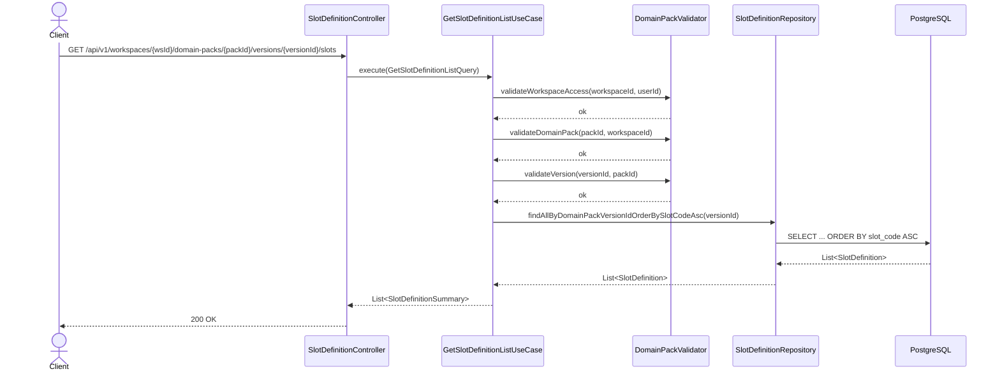
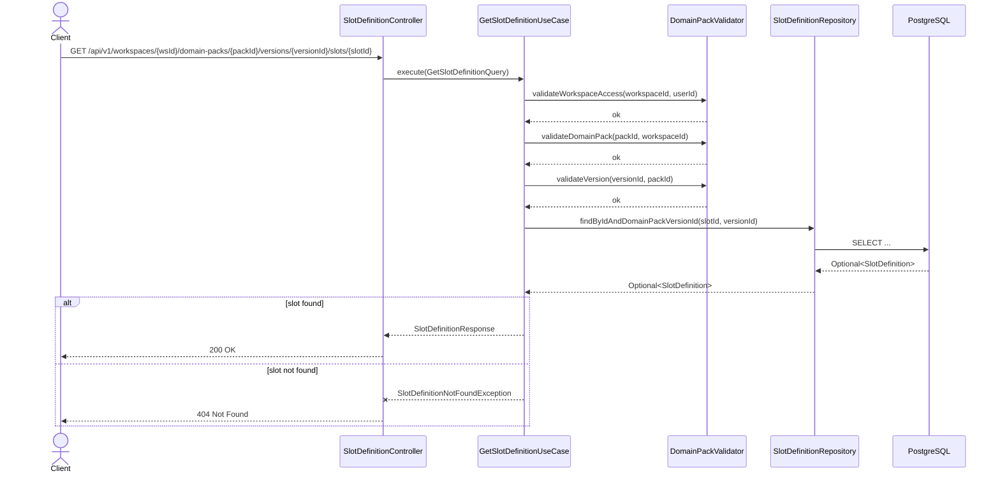
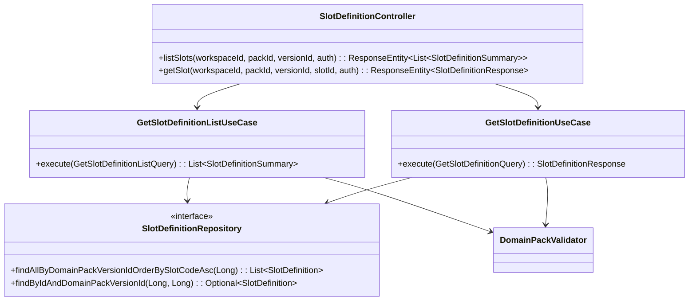

# [BE] 3.2.11 Slot / Slot Status 초안 목록 조회

## Goal

domain pack version에 속한 slot 정의 목록과 단건을 조회하는 API를 제공한다. 운영자가 workflow 구성요소 초안을 검토·수정할 수 있도록, 목록은 JSON 필드를 제외한 `SlotDefinitionSummary`로, 단건은 전체 필드를 포함하는 `SlotDefinitionResponse`로 반환한다.

---

## Sequence Diagram

### GET /slots (목록)



### GET /slots/{slotId} (단건)



---

## REST API

### Endpoints

| Method | Path | Description |
|--------|------|-------------|
| GET | `/api/v1/workspaces/{workspaceId}/domain-packs/{packId}/versions/{versionId}/slots` | Slot 목록 조회 (slot_code ASC) |
| GET | `/api/v1/workspaces/{workspaceId}/domain-packs/{packId}/versions/{versionId}/slots/{slotId}` | Slot 단건 조회 (전체 필드) |

### Request

두 엔드포인트 모두 request body 없음. `workspaceId`, `packId`, `versionId`, `slotId`는 path variable.

### Response

**GET /slots → 200 OK**

```json
[
  {
    "id": 1,
    "domainPackVersionId": 10,
    "slotCode": "customer_name",
    "name": "고객명",
    "description": "상담 고객의 이름",
    "dataType": "STRING",
    "isSensitive": false,
    "status": "ACTIVE",
    "createdAt": "2025-04-01T09:00:00Z",
    "updatedAt": "2025-04-01T09:00:00Z"
  }
]
```

> `validationRuleJson`, `defaultValueJson`, `metaJson` 제외. 단건 조회에서만 반환.

**GET /slots/{slotId} → 200 OK**

```json
{
  "id": 1,
  "domainPackVersionId": 10,
  "slotCode": "customer_name",
  "name": "고객명",
  "description": "상담 고객의 이름",
  "dataType": "STRING",
  "isSensitive": false,
  "validationRuleJson": "{}",
  "defaultValueJson": null,
  "metaJson": "{}",
  "status": "ACTIVE",
  "createdAt": "2025-04-01T09:00:00Z",
  "updatedAt": "2025-04-01T09:00:00Z"
}
```

**403 Forbidden**

```json
{
  "code": "FORBIDDEN",
  "message": "workspace 접근 권한이 없습니다"
}
```

**404 Not Found** (version 없음)

```json
{
  "code": "DOMAIN_PACK_VERSION_NOT_FOUND",
  "message": "도메인 팩 버전을 찾을 수 없습니다. id=999"
}
```

**404 Not Found** (slot 없음)

```json
{
  "code": "SLOT_DEFINITION_NOT_FOUND",
  "message": "SlotDefinition not found: 999"
}
```

---

## Class Design

### DDD Layered Structure



### New Files

| 파일 | 계층 | 역할 |
|------|------|------|
| `SlotDefinitionController.java` | presentation | GET 목록 + 단건 엔드포인트 |
| `GetSlotDefinitionListQuery.java` | application | `record(workspaceId, packId, versionId, userId)` |
| `GetSlotDefinitionListUseCase.java` | application | 목록 조회 유스케이스 |
| `SlotDefinitionSummary.java` | application | JSON 필드 제외 subset record |
| `GetSlotDefinitionQuery.java` | application | `record(workspaceId, packId, versionId, slotId, userId)` |
| `GetSlotDefinitionUseCase.java` | application | 단건 조회 유스케이스 |
| `SlotDefinitionNotFoundException.java` | application/exception | 단건 조회 시 slot 미발견 예외 |

### Modified Files

| 파일 | 변경 내용 |
|------|-----------|
| `SlotDefinitionRepository.java` | `findAllByDomainPackVersionIdOrderBySlotCodeAsc`, `findByIdAndDomainPackVersionId` 메서드 추가 |
| `JpaSlotDefinitionRepository.java` | `@Query` + `@Param` 어노테이션을 포함한 두 메서드 구현 (도메인 인터페이스는 순수 Java 시그니처만 선언) |

### Key Code Sketches

```java
// application/SlotDefinitionSummary.java
public record SlotDefinitionSummary(
    Long id,
    Long domainPackVersionId,
    String slotCode,
    String name,
    String description,
    String dataType,
    Boolean isSensitive,
    String status,
    OffsetDateTime createdAt,
    OffsetDateTime updatedAt) {

  public static SlotDefinitionSummary from(SlotDefinition slot) {
    return new SlotDefinitionSummary(
        slot.getId(), slot.getDomainPackVersionId(), slot.getSlotCode(),
        slot.getName(), slot.getDescription(), slot.getDataType(),
        slot.getIsSensitive(), slot.getStatus(),
        slot.getCreatedAt(), slot.getUpdatedAt());
  }
}
```

```java
// application/GetSlotDefinitionListUseCase.java
@Service
@Transactional(readOnly = true)
public class GetSlotDefinitionListUseCase {
  private final DomainPackValidator validator;
  private final SlotDefinitionRepository slotDefinitionRepository;

  public GetSlotDefinitionListUseCase(
      DomainPackValidator validator, SlotDefinitionRepository slotDefinitionRepository) {
    this.validator = validator;
    this.slotDefinitionRepository = slotDefinitionRepository;
  }

  public List<SlotDefinitionSummary> execute(GetSlotDefinitionListQuery query) {
    validator.validateWorkspaceAccess(query.workspaceId(), query.userId());
    validator.validateDomainPack(query.packId(), query.workspaceId());
    validator.validateVersion(query.versionId(), query.packId());

    return slotDefinitionRepository
        .findAllByDomainPackVersionIdOrderBySlotCodeAsc(query.versionId())
        .stream()
        .map(SlotDefinitionSummary::from)
        .toList();
  }
}
```

```java
// application/GetSlotDefinitionUseCase.java
@Service
@Transactional(readOnly = true)
public class GetSlotDefinitionUseCase {
  private final DomainPackValidator validator;
  private final SlotDefinitionRepository slotDefinitionRepository;

  public GetSlotDefinitionUseCase(
      DomainPackValidator validator, SlotDefinitionRepository slotDefinitionRepository) {
    this.validator = validator;
    this.slotDefinitionRepository = slotDefinitionRepository;
  }

  public SlotDefinitionResponse execute(GetSlotDefinitionQuery query) {
    validator.validateWorkspaceAccess(query.workspaceId(), query.userId());
    validator.validateDomainPack(query.packId(), query.workspaceId());
    validator.validateVersion(query.versionId(), query.packId());

    return slotDefinitionRepository
        .findByIdAndDomainPackVersionId(query.slotId(), query.versionId())
        .map(SlotDefinitionResponse::from)
        .orElseThrow(() -> new SlotDefinitionNotFoundException(query.slotId()));
  }
}
```

```java
// presentation/SlotDefinitionController.java
@RestController
@RequestMapping(
    "/api/v1/workspaces/{workspaceId}/domain-packs/{packId}/versions/{versionId}/slots")
public class SlotDefinitionController {

  private final GetSlotDefinitionListUseCase listUseCase;
  private final GetSlotDefinitionUseCase detailUseCase;

  public SlotDefinitionController(
      GetSlotDefinitionListUseCase listUseCase, GetSlotDefinitionUseCase detailUseCase) {
    this.listUseCase = listUseCase;
    this.detailUseCase = detailUseCase;
  }

  @GetMapping
  public ResponseEntity<List<SlotDefinitionSummary>> listSlots(
      @PathVariable Long workspaceId,
      @PathVariable Long packId,
      @PathVariable Long versionId,
      Authentication authentication) {
    Long userId = AuthenticationUtils.getUserId(authentication);
    return ResponseEntity.ok(
        listUseCase.execute(new GetSlotDefinitionListQuery(workspaceId, packId, versionId, userId)));
  }

  @GetMapping("/{slotId}")
  public ResponseEntity<SlotDefinitionResponse> getSlot(
      @PathVariable Long workspaceId,
      @PathVariable Long packId,
      @PathVariable Long versionId,
      @PathVariable Long slotId,
      Authentication authentication) {
    Long userId = AuthenticationUtils.getUserId(authentication);
    return ResponseEntity.ok(
        detailUseCase.execute(
            new GetSlotDefinitionQuery(workspaceId, packId, versionId, slotId, userId)));
  }
}
```

```java
// domain/repository/SlotDefinitionRepository.java (추가 메서드)
List<SlotDefinition> findAllByDomainPackVersionIdOrderBySlotCodeAsc(Long domainPackVersionId);

Optional<SlotDefinition> findByIdAndDomainPackVersionId(Long id, Long domainPackVersionId);
```

```java
// infrastructure/persistence/JpaSlotDefinitionRepository.java (추가 메서드)
@Query("SELECT s FROM SlotDefinition s WHERE s.domainPackVersionId = :versionId ORDER BY s.slotCode ASC")
List<SlotDefinition> findAllByDomainPackVersionIdOrderBySlotCodeAsc(@Param("versionId") Long versionId);

Optional<SlotDefinition> findByIdAndDomainPackVersionId(Long id, Long domainPackVersionId);
```

---

## Tests

### Unit Tests

**GetSlotDefinitionListUseCaseTest**

```java
@DisplayName("GetSlotDefinitionListUseCase")
class GetSlotDefinitionListUseCaseTest {

  @Test
  @DisplayName("유효한 query → SlotDefinitionSummary 목록 반환 (slot_code ASC)")
  void execute_validQuery_returnsOrderedSummaryList() { ... }

  @Test
  @DisplayName("workspace 접근 권한 없음 → 예외")
  void execute_invalidWorkspaceAccess_throws() { ... }

  @Test
  @DisplayName("pack이 workspace 소속 아님 → 예외")
  void execute_packNotInWorkspace_throws() { ... }

  @Test
  @DisplayName("version이 pack 소속 아님 → 예외")
  void execute_versionNotInPack_throws() { ... }
}
```

**GetSlotDefinitionUseCaseTest**

```java
@DisplayName("GetSlotDefinitionUseCase")
class GetSlotDefinitionUseCaseTest {

  @Test
  @DisplayName("유효한 query → SlotDefinitionResponse 반환 (전체 필드)")
  void execute_validQuery_returnsFullResponse() { ... }

  @Test
  @DisplayName("slot 미존재 → SlotDefinitionNotFoundException")
  void execute_slotNotFound_throwsNotFoundException() { ... }

  @Test
  @DisplayName("다른 version의 slotId → SlotDefinitionNotFoundException")
  void execute_slotBelongsToOtherVersion_throwsNotFoundException() { ... }
}
```

### Integration Tests

```java
@SpringBootTest
@AutoConfigureMockMvc
@DisplayName("SlotDefinitionController")
class SlotDefinitionControllerTest {

  @Test
  @DisplayName("GET /slots → 200 OK, slot_code ASC 순 목록")
  void listSlots_returnsOk() throws Exception { ... }

  @Test
  @DisplayName("GET /slots 응답에 validationRuleJson 미포함")
  void listSlots_responseExcludesJsonFields() throws Exception { ... }

  @Test
  @DisplayName("GET /slots/{slotId} → 200 OK, validationRuleJson 포함")
  void getSlot_returnsOkWithJsonFields() throws Exception { ... }

  @Test
  @DisplayName("GET /slots/{slotId} 존재하지 않는 slotId → 404")
  void getSlot_notFound_returns404() throws Exception { ... }

  @Test
  @DisplayName("GET /slots 권한 없는 workspace → 403")
  void listSlots_unauthorizedWorkspace_returns403() throws Exception { ... }

  @Test
  @DisplayName("GET /slots/{slotId} 다른 version 소속 slotId → 404")
  void getSlot_wrongVersion_returns404() throws Exception { ... }
}
```

### Test Checklist

- [ ] 정상 시나리오: 목록 응답의 slot_code ASC 정렬 순서 검증
- [ ] 정상 시나리오: 목록 응답에 `validationRuleJson`, `defaultValueJson`, `metaJson` 미포함 확인
- [ ] 정상 시나리오: 단건 응답에 `validationRuleJson`, `defaultValueJson`, `metaJson` 포함 확인
- [ ] 권한/인증 오류: 잘못된 workspace → 403
- [ ] Not Found: 존재하지 않는 slotId → 404
- [ ] Not Found: 다른 versionId 소속 slotId → 404
- [ ] Not Found: 존재하지 않는 versionId → 404

---

## Database

변경 없음. `pack.slot_definition` 테이블과 `idx_slot_version_id` 인덱스가 이미 존재한다.

정렬 기준 `slot_code ASC`는 별도 인덱스 없이 처리한다. 아래 기준 중 하나라도 충족될 때 `idx_slot_version_slot_code` 추가를 검토한다.

| 트리거 | 임계값 |
|--------|--------|
| 버전당 평균 slot 수 | > 50 개 |
| `pack.slot_definition` 전체 행 수 | > 10,000 행 |
| 목록 조회 p95/p99 응답 시간 | > 500 ms |

임계값 미만인 동안 (버전당 평균 slot ≤ 50 개) 기존 `idx_slot_version_id`로 충분하다.  
모니터링은 `idx_slot_version_id` 인덱스 사용률과 목록 쿼리 실행 계획(EXPLAIN ANALYZE)을 기준으로 한다.

```sql
-- 선택적 추가 (위 임계값 충족 시)
CREATE INDEX idx_slot_version_slot_code
    ON pack.slot_definition(domain_pack_version_id, slot_code ASC);
```

---

## Additional Notes

- `UpdateSlotController` (`PATCH /slots/{slotId}`)와 `UpdateSlotStatusController` (`PATCH /slots/{slotId}/status`)와의 경로 충돌 없음 (HTTP method 분리: GET vs PATCH)
- `SlotDefinitionRepository` 도메인 인터페이스에 현재 `findByDomainPackVersionId`가 없고 `JpaSlotDefinitionRepository`에만 존재하는 불일치 상태임 → 도메인 인터페이스에 명시적으로 두 메서드를 추가해 해소한다
- `SlotDefinitionNotFoundException`은 신규 생성 필요
