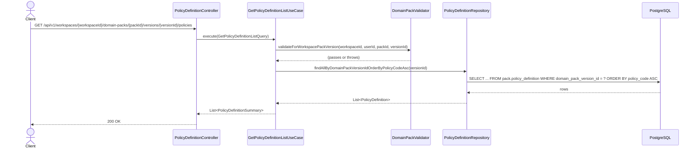

# [BE] 3.2.12 — Policy / Rule 초안 목록 조회

## Goal

특정 Domain Pack Version에 속한 Policy 초안 전체 목록을 조회하는 READ 전용 엔드포인트를 제공한다.

---

## Sequence Diagram



---

## REST API

### Endpoint

| Method | Path | Description |
|--------|------|-------------|
| GET | `/api/v1/workspaces/{workspaceId}/domain-packs/{packId}/versions/{versionId}/policies` | Policy 초안 목록 조회 |

### Request

Path variables:
- `workspaceId`: Long
- `packId`: Long
- `versionId`: Long

Headers:
- `Authorization: Bearer {jwt-token}` (필수)

Query parameters: 없음 (pagination / filtering 미지원)

### Response

**200 OK**

```json
[
  {
    "id": 1,
    "domainPackVersionId": 10,
    "policyCode": "POL_RETURN",
    "name": "반품 처리 정책",
    "description": "7일 이내 반품 허용",
    "severity": "HIGH",
    "status": "ACTIVE",
    "createdAt": "2025-04-03T10:00:00Z",
    "updatedAt": "2025-04-03T10:00:00Z"
  }
]
```

> JSON 필드(`conditionJson`, `actionJson`, `evidenceJson`, `metaJson`)는 목록 응답에서 제외한다.  
> policy가 없는 version이면 빈 배열 `[]`를 반환한다.

**401 Unauthorized**

```json
{ "code": "UNAUTHORIZED", "message": "인증이 필요합니다." }
```

**403 Forbidden**

```json
{ "code": "FORBIDDEN", "message": "접근 권한이 없습니다." }
```

**404 Not Found — workspace not found**

```json
{ "code": "DOMAIN_PACK_WORKSPACE_NOT_FOUND", "message": "워크스페이스를 찾을 수 없습니다. id={workspaceId}" }
```

**404 Not Found — pack not found**

```json
{ "code": "DOMAIN_PACK_NOT_FOUND", "message": "DomainPack not found: {packId}" }
```

**404 Not Found — version not found**

```json
{ "code": "DOMAIN_PACK_VERSION_NOT_FOUND", "message": "도메인 팩 버전을 찾을 수 없습니다. id={versionId}" }
```

---

## Class Design

### 신규 생성 파일

| 파일 | 경로 | 역할 |
|------|------|------|
| `GetPolicyDefinitionListQuery.java` | `application/` | UseCase 입력 record |
| `GetPolicyDefinitionListUseCase.java` | `application/` | 목록 조회 UseCase |
| `PolicyDefinitionSummary.java` | `application/` | 목록 응답 DTO (JSON 필드 제외) |

### 수정 파일

| 파일 | 변경 내용 |
|------|-----------|
| `PolicyDefinitionRepository.java` | `findAllByDomainPackVersionIdOrderByPolicyCodeAsc(Long domainPackVersionId)` 추가 |
| `JpaPolicyDefinitionRepository.java` | 기존 `findByDomainPackVersionId` 제거 → `findAllByDomainPackVersionIdOrderByPolicyCodeAsc` 선언으로 교체 |
| `PolicyDefinitionController.java` | `GetPolicyDefinitionListUseCase` 생성자 주입 추가; `@GetMapping listPolicies(...)` 메서드 추가 |

### Pseudo-code

```java
// GetPolicyDefinitionListQuery.java
record GetPolicyDefinitionListQuery(
    Long workspaceId, Long packId, Long versionId, Long userId)

// PolicyDefinitionSummary.java
record PolicyDefinitionSummary(
    Long id,
    Long domainPackVersionId,
    String policyCode,
    String name,
    String description,
    String severity,
    String status,
    OffsetDateTime createdAt,
    OffsetDateTime updatedAt) {

    static PolicyDefinitionSummary from(PolicyDefinition policy) {
        return new PolicyDefinitionSummary(
            policy.getId(),
            policy.getDomainPackVersionId(),
            policy.getPolicyCode(),
            policy.getName(),
            policy.getDescription(),
            policy.getSeverity(),
            policy.getStatus(),
            policy.getCreatedAt(),
            policy.getUpdatedAt())
    }
}

// GetPolicyDefinitionListUseCase.java
@Service
@Transactional(readOnly = true)
class GetPolicyDefinitionListUseCase {
    execute(GetPolicyDefinitionListQuery query) {
        validator.validateForWorkspacePackVersion(
            query.workspaceId(), query.userId(), query.packId(), query.versionId())
        return policyDefinitionRepository
            .findAllByDomainPackVersionIdOrderByPolicyCodeAsc(query.versionId())
            .stream()
            .map(PolicyDefinitionSummary::from)
            .toList()
    }
}

// PolicyDefinitionController.java (수정)
@RestController
@RequestMapping("/api/v1/workspaces/{workspaceId}/domain-packs/{packId}/versions/{versionId}/policies")
class PolicyDefinitionController {
    // listUseCase 추가, detailUseCase 기존 유지

    @GetMapping
    listPolicies(@PathVariable Long workspaceId, @PathVariable Long packId,
                 @PathVariable Long versionId, Authentication authentication) {
        Long userId = AuthenticationUtils.getUserId(authentication)
        return ResponseEntity.ok(
            listUseCase.execute(
                new GetPolicyDefinitionListQuery(workspaceId, packId, versionId, userId)))
    }

    @GetMapping("/{policyId}")
    getPolicy(...) { /* 기존 그대로 */ }
}
```

---

## Tests

### UseCase 테스트: `GetPolicyDefinitionListUseCaseTest.java`

참조: `GetSlotDefinitionListUseCaseTest.java` 패턴 동일 적용

- `@ExtendWith(MockitoExtension.class)` + `@DisplayName`
- `@BeforeEach`: `DomainPackValidator` 직접 생성 → `GetPolicyDefinitionListUseCase` 주입

| 시나리오 | 예상 결과 |
|----------|-----------|
| 유효한 query → policyCode ASC 순 목록 반환 | `List<PolicyDefinitionSummary>` 반환 (순서 검증) |
| 목록 응답에 JSON 필드 미포함 | `conditionJson`, `actionJson`, `evidenceJson`, `metaJson` 미포함 (RecordComponent 이름 검증) |
| policy 없는 version → 빈 목록 반환 | `result.isEmpty()` |
| workspace 미존재 | `DomainPackWorkspaceNotFoundException` |
| 접근 권한 없음 | `DomainPackUnauthorizedWorkspaceAccessException` |
| pack 소속 불일치 | `DomainPackNotFoundException` |
| version 소속 불일치 | `DomainPackVersionNotFoundException` |

### Controller 테스트: `PolicyDefinitionControllerTest.java`

- `@WebMvcTest(PolicyDefinitionController.class)` + JwtAuthenticationFilter exclude
- `@WithLongPrincipal(10L)` fixture 사용 (패키지: `com.init.fixtures`)
- `@MockitoBean`: `GetPolicyDefinitionListUseCase listUseCase`, `GetPolicyDefinitionUseCase detailUseCase`

| 시나리오 | 예상 결과 |
|----------|-----------|
| GET .../policies → 200 OK, JSON 필드 미노출 검증 | `$[0].conditionJson doesNotExist()`, `$[0].actionJson doesNotExist()`, `$[0].evidenceJson doesNotExist()`, `$[0].metaJson doesNotExist()` |
| GET .../policies → policy 없으면 빈 배열 | `$` isArray() isEmpty() |
| GET .../policies → 403 권한 없음 | 403, `$.code = "FORBIDDEN"` |
| GET .../policies → 401 미인증 | 401 |
| GET .../policies → 404 version 소속 불일치 | 404, `$.code = "DOMAIN_PACK_VERSION_NOT_FOUND"` |
| GET .../policies → 404 pack 미존재 | 404, `$.code = "DOMAIN_PACK_NOT_FOUND"` |

---

## Database

신규 DDL 없음.

`pack.policy_definition` 테이블 및 `idx_policy_version_id` 인덱스 이미 존재 (`.agent/docs/schema.md:480–495, 846`).

---

## Additional Notes

- 구현은 `GetSlotDefinitionListUseCase` + `SlotDefinitionController` 패턴을 그대로 따른다.
- 기존 `JpaPolicyDefinitionRepository.findByDomainPackVersionId(Long)`는 도메인 인터페이스와 불일치 상태이므로, 이번 작업에서 `findAllByDomainPackVersionIdOrderByPolicyCodeAsc`로 교체하여 인터페이스 일관성을 회복한다.
- `PolicyDefinitionSummary`는 JSON 대용량 필드(`conditionJson`, `actionJson`, `evidenceJson`, `metaJson`)를 제외하여 목록 페이로드를 줄인다.
- `PolicyDefinitionController`는 단건 조회(`GetPolicyDefinitionUseCase`)와 목록 조회(`GetPolicyDefinitionListUseCase`)를 하나의 Controller 클래스에서 함께 처리한다 (`SlotDefinitionController` 참조).
