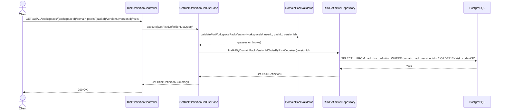
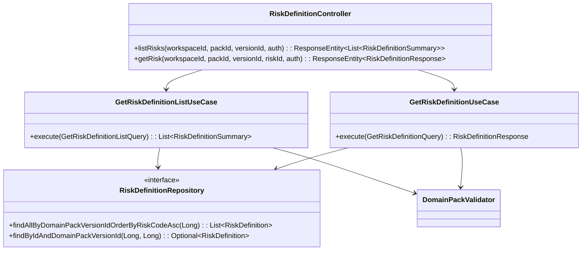

# [BE] 3.2.13 — Risk Factor 초안 목록 조회

## Goal

특정 Domain Pack Version에 속한 Risk Factor 초안 전체 목록을 조회하는 READ 전용 엔드포인트를 제공한다.

---

## Sequence Diagram



---

## REST API

### Endpoint

| Method | Path | Description |
|--------|------|-------------|
| GET | `/api/v1/workspaces/{workspaceId}/domain-packs/{packId}/versions/{versionId}/risks` | Risk Factor 초안 목록 조회 |

### Request

Path variables:
- `workspaceId`: Long
- `packId`: Long
- `versionId`: Long

Headers:
- `Authorization: Bearer {jwt-token}` (필수)

Query parameters: 없음 (pagination / filtering 미지원)

### Response

**200 OK**

```json
[
  {
    "id": 1,
    "domainPackVersionId": 10,
    "riskCode": "RISK_FRAUD",
    "name": "사기 거래 위험",
    "description": "비정상적인 결제 패턴 감지 시 차단",
    "riskLevel": "HIGH",
    "status": "ACTIVE",
    "createdAt": "2025-04-03T10:00:00Z",
    "updatedAt": "2025-04-03T10:00:00Z"
  }
]
```

> JSON 필드(`triggerConditionJson`, `handlingActionJson`, `evidenceJson`, `metaJson`)는 목록 응답에서 제외한다.
> risk가 없는 version이면 빈 배열 `[]`를 반환한다.

**401 Unauthorized**

```json
{ "code": "UNAUTHORIZED", "message": "인증이 필요합니다." }
```

**403 Forbidden**

```json
{ "code": "FORBIDDEN", "message": "워크스페이스에 접근 권한이 없습니다." }
```

**404 Not Found — workspace not found**

```json
{ "code": "DOMAIN_PACK_WORKSPACE_NOT_FOUND", "message": "워크스페이스를 찾을 수 없습니다. id={workspaceId}" }
```

**404 Not Found — pack not found**

```json
{ "code": "DOMAIN_PACK_NOT_FOUND", "message": "DomainPack not found: {packId}" }
```

**404 Not Found — version not found**

```json
{ "code": "DOMAIN_PACK_VERSION_NOT_FOUND", "message": "도메인 팩 버전을 찾을 수 없습니다. id={versionId}" }
```

---

## Class Design

### DDD Layered Structure



### 신규 생성 파일

| 파일 | 경로 | 역할 |
|------|------|------|
| `GetRiskDefinitionListQuery.java` | `application/` | UseCase 입력 record |
| `RiskDefinitionSummary.java` | `application/` | 목록 응답 DTO (JSON 필드 제외) |
| `GetRiskDefinitionListUseCase.java` | `application/` | 목록 조회 UseCase |

### 수정 파일

| 파일 | 변경 내용 |
|------|-----------|
| `RiskDefinitionRepository.java` | `findAllByDomainPackVersionIdOrderByRiskCodeAsc(Long)` 추가 |
| `JpaRiskDefinitionRepository.java` | `findAllByDomainPackVersionIdOrderByRiskCodeAsc` 선언 추가; 기존 `findByDomainPackVersionId` 제거 (도메인 인터페이스 불일치 해소 — 사용처 확인 후) |
| `RiskDefinitionController.java` | `GetRiskDefinitionListUseCase` 생성자 주입 추가; `@GetMapping listRisks(...)` 메서드 추가 |

### Pseudo-code

```java
// GetRiskDefinitionListQuery.java
record GetRiskDefinitionListQuery(
    Long workspaceId, Long packId, Long versionId, Long userId)

// RiskDefinitionSummary.java
record RiskDefinitionSummary(
    Long id,
    Long domainPackVersionId,
    String riskCode,
    String name,
    String description,
    String riskLevel,
    String status,
    OffsetDateTime createdAt,
    OffsetDateTime updatedAt) {

    static RiskDefinitionSummary from(RiskDefinition risk) {
        return new RiskDefinitionSummary(
            risk.getId(),
            risk.getDomainPackVersionId(),
            risk.getRiskCode(),
            risk.getName(),
            risk.getDescription(),
            risk.getRiskLevel(),
            risk.getStatus(),
            risk.getCreatedAt(),
            risk.getUpdatedAt())
    }
}

// GetRiskDefinitionListUseCase.java
@Service
@Transactional(readOnly = true)
class GetRiskDefinitionListUseCase {
    execute(GetRiskDefinitionListQuery query) {
        validator.validateForWorkspacePackVersion(
            query.workspaceId(), query.userId(), query.packId(), query.versionId())
        return riskDefinitionRepository
            .findAllByDomainPackVersionIdOrderByRiskCodeAsc(query.versionId())
            .stream()
            .map(RiskDefinitionSummary::from)
            .toList()
    }
}

// RiskDefinitionController.java (수정 — listRisks 추가)
@RestController
@RequestMapping("/api/v1/workspaces/{workspaceId}/domain-packs/{packId}/versions/{versionId}/risks")
class RiskDefinitionController {
    // listUseCase 추가, detailUseCase 기존 유지

    @GetMapping
    listRisks(@PathVariable Long workspaceId, @PathVariable Long packId,
              @PathVariable Long versionId, Authentication authentication) {
        Long userId = AuthenticationUtils.getUserId(authentication)
        return ResponseEntity.ok(
            listUseCase.execute(
                new GetRiskDefinitionListQuery(workspaceId, packId, versionId, userId)))
    }

    @GetMapping("/{riskId}")
    getRisk(...) { /* 기존 그대로 */ }
}
```

---

## Tests

### UseCase 테스트: `GetRiskDefinitionListUseCaseTest.java`

참조: `GetPolicyDefinitionListUseCaseTest.java` 패턴 동일 적용

- `@ExtendWith(MockitoExtension.class)` + `@DisplayName`

| 시나리오 | 예상 결과 |
|----------|-----------|
| 유효한 query → riskCode ASC 순 목록 반환 | `List<RiskDefinitionSummary>` 반환 (순서 검증) |
| 목록 응답에 JSON 필드 미포함 | `triggerConditionJson`, `handlingActionJson`, `evidenceJson`, `metaJson` 미포함 (RecordComponent 이름 검증) |
| risk 없는 version → 빈 목록 반환 | `result.isEmpty()` |
| workspace 미존재 | `DomainPackWorkspaceNotFoundException` |
| 접근 권한 없음 | `DomainPackUnauthorizedWorkspaceAccessException` |
| pack 소속 불일치 | `DomainPackNotFoundException` |
| version 소속 불일치 | `DomainPackVersionNotFoundException` |

### Controller 테스트: `RiskDefinitionControllerTest.java`

- `@WebMvcTest(RiskDefinitionController.class)` + JwtAuthenticationFilter exclude
- `@WithLongPrincipal(10L)` fixture 사용 (패키지: `com.init.fixtures`)
- `@MockitoBean`: `GetRiskDefinitionListUseCase listUseCase`, `GetRiskDefinitionUseCase detailUseCase`

| 시나리오 | 예상 결과 |
|----------|-----------|
| GET .../risks → 200 OK, JSON 필드 미노출 검증 | `$[0].triggerConditionJson doesNotExist()`, `$[0].handlingActionJson doesNotExist()`, `$[0].evidenceJson doesNotExist()`, `$[0].metaJson doesNotExist()` |
| GET .../risks → risk 없으면 빈 배열 | `$` isArray() isEmpty() |
| GET .../risks → 403 권한 없음 | 403, `$.code = "FORBIDDEN"` |
| GET .../risks → 401 미인증 | 401 |
| GET .../risks → 404 version 소속 불일치 | 404, `$.code = "DOMAIN_PACK_VERSION_NOT_FOUND"` |
| GET .../risks → 404 pack 미존재 | 404, `$.code = "DOMAIN_PACK_NOT_FOUND"` |

---

## Database

신규 DDL 없음.

`pack.risk_definition` 테이블 및 인덱스 이미 존재 (`.agent/docs/schema.md` 참조).

---

## Additional Notes

- 구현은 `GetPolicyDefinitionListUseCase` + `PolicyDefinitionController` 패턴을 그대로 따른다.
- `DomainPackValidator.validateForWorkspacePackVersion(workspaceId, userId, packId, versionId)`가 4단계 공통 검증 진입점이다.
- `findAllByDomainPackVersionIdOrderByRiskCodeAsc`는 `RiskDefinitionRepository`(도메인 인터페이스)와 `JpaRiskDefinitionRepository` 모두에 선언한다.
- `JpaRiskDefinitionRepository.findByDomainPackVersionId`는 도메인 인터페이스와 불일치 상태이므로, 구현 전 사용처를 확인하고 미사용이면 제거하여 인터페이스 일관성을 회복한다 (3212 Policy 케이스 동일 패턴).
- `RiskDefinitionController`는 이미 존재하는 컨트롤러이므로 `listRisks` 메서드와 `GetRiskDefinitionListUseCase` 의존성만 추가한다.
